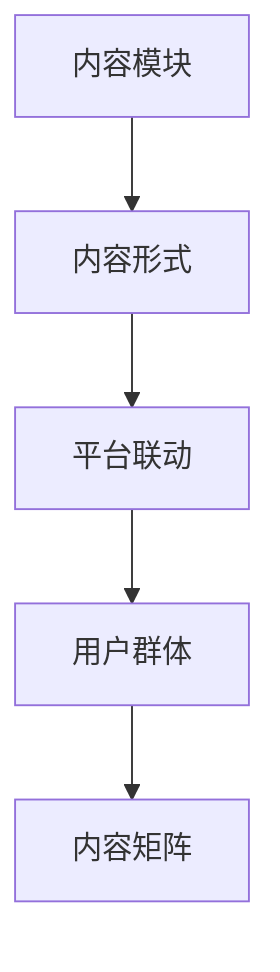

                 

关键词：知识付费、内容矩阵、创业、搭建、策略、技术、营销

摘要：本文将深入探讨知识付费领域中的内容矩阵搭建策略，分析其在创业项目中的应用和重要性。通过探讨核心概念、算法原理、数学模型和实际案例，本文旨在为创业者提供一份全面的指南，帮助他们成功地构建一个具有竞争力和可持续发展的内容矩阵。

## 1. 背景介绍

在当今信息爆炸的时代，知识付费已经成为一种主流的商业模式。越来越多的人愿意为高质量的知识内容付费，这也催生了大量的知识付费平台和创业项目。然而，如何在激烈的竞争中脱颖而出，构建一个稳定且具有吸引力的内容矩阵，成为了创业者们亟待解决的问题。

内容矩阵指的是在知识付费创业过程中，通过多种内容形式、多个内容模块以及跨平台的策略，构建一个完整、丰富且相互关联的内容生态系统。一个良好的内容矩阵不仅能够提升用户粘性和活跃度，还能够为企业带来持续的收益。

## 2. 核心概念与联系

为了更好地理解内容矩阵的概念，我们需要从以下几个核心概念入手：

### 2.1 内容模块

内容模块是内容矩阵的基本单元，包括但不限于文章、视频、音频、直播等多种形式。不同的内容模块可以满足用户多样化的需求，提高用户体验。

### 2.2 内容形式

内容形式是内容的表现方式，如文本、图片、视频等。通过多种内容形式的结合，可以更全面地传递信息，提高内容的吸引力和感染力。

### 2.3 平台联动

平台联动指的是在不同平台之间实现内容共享和互动，如微信公众号、抖音、微博等。通过平台联动，可以扩大内容的影响力，吸引更多的用户。

### 2.4 用户群体

用户群体是内容矩阵的受众，他们的需求和偏好决定了内容矩阵的构建方向。了解用户群体，有助于有针对性地创作内容，提高用户满意度。

以下是内容矩阵的 Mermaid 流程图：



## 3. 核心算法原理 & 具体操作步骤

### 3.1 算法原理概述

内容矩阵的搭建需要遵循以下几个核心原则：

- **用户导向**：以用户需求为中心，创作符合用户兴趣和需求的内容。
- **多样性**：通过多种内容形式和内容模块，提供多样化的内容体验。
- **连贯性**：确保不同内容模块之间的连贯性和一致性，提高用户体验。
- **互动性**：通过平台联动和用户互动，增强用户参与感和粘性。

### 3.2 算法步骤详解

1. **用户需求分析**：通过调研、数据分析等方式，了解用户群体的兴趣和需求，确定内容矩阵的主题和方向。
2. **内容创作与规划**：根据用户需求，制定内容创作计划，包括内容形式、模块和发布时间表。
3. **内容制作与优化**：根据内容计划，制作高质量的内容，并进行优化，确保内容的可读性、吸引力和传播性。
4. **内容发布与推广**：在不同平台发布内容，并利用营销手段进行推广，提高内容的曝光率和影响力。
5. **用户互动与反馈**：与用户互动，收集用户反馈，不断优化内容矩阵，提升用户体验。

### 3.3 算法优缺点

#### 优点：

- 提高用户满意度和粘性。
- 扩大内容影响力，提高品牌知名度。
- 促进用户参与，增加用户互动。

#### 缺点：

- 需要大量的时间和精力进行内容创作和优化。
- 需要不断进行用户调研和数据分析，以保持内容的新鲜感和吸引力。

### 3.4 算法应用领域

内容矩阵搭建适用于各类知识付费创业项目，如在线教育、知识分享、技能培训等。

## 4. 数学模型和公式 & 详细讲解 & 举例说明

### 4.1 数学模型构建

内容矩阵的构建可以通过以下数学模型进行描述：

- **用户兴趣模型**：通过用户行为数据和反馈，构建用户兴趣模型，预测用户对内容的偏好。
- **内容质量模型**：通过内容传播效果、用户反馈等指标，评估内容的质量。
- **内容矩阵优化模型**：基于用户兴趣模型和内容质量模型，优化内容矩阵的配置，提高整体效果。

### 4.2 公式推导过程

#### 用户兴趣模型

设用户兴趣向量为 \( u \)，内容特征向量为 \( v \)，则用户对内容的兴趣度可以通过余弦相似度计算：

\[ \text{Interest} = \cos(u, v) = \frac{u \cdot v}{\|u\| \|v\|} \]

#### 内容质量模型

设内容质量向量为 \( q \)，则内容质量可以通过以下公式计算：

\[ \text{Quality} = \frac{1}{1 + e^{-(q \cdot s + b)}} \]

其中，\( s \) 为内容传播效果，\( b \) 为偏置项。

#### 内容矩阵优化模型

设内容矩阵为 \( M \)，则内容矩阵的优化可以通过以下目标函数进行描述：

\[ \text{Optimize} = \sum_{i, j} M_{i, j} \cdot \text{Interest}_i \cdot \text{Quality}_j \]

### 4.3 案例分析与讲解

假设有一个知识付费创业项目，用户兴趣模型和内容质量模型如下：

用户兴趣向量 \( u = [0.6, 0.3, 0.1] \)

内容质量向量 \( q = [0.8, 0.7, 0.6] \)

根据用户兴趣模型，用户对三个内容模块的兴趣度分别为：

\[ \text{Interest}_1 = \cos(u, v_1) = 0.55 \]
\[ \text{Interest}_2 = \cos(u, v_2) = 0.35 \]
\[ \text{Interest}_3 = \cos(u, v_3) = 0.1 \]

根据内容质量模型，三个内容模块的质量分别为：

\[ \text{Quality}_1 = \frac{1}{1 + e^{-0.8 \cdot 0.8 + 0.5}} = 0.91 \]
\[ \text{Quality}_2 = \frac{1}{1 + e^{-0.7 \cdot 0.7 + 0.5}} = 0.85 \]
\[ \text{Quality}_3 = \frac{1}{1 + e^{-0.6 \cdot 0.6 + 0.5}} = 0.81 \]

根据内容矩阵优化模型，我们可以计算得到内容矩阵的优化结果：

\[ \text{Optimize} = 0.55 \cdot 0.91 + 0.35 \cdot 0.85 + 0.1 \cdot 0.81 = 0.637 \]

这意味着，在当前的用户兴趣和内容质量下，最优化内容矩阵的配置是分配更多的资源到第一个内容模块。

## 5. 项目实践：代码实例和详细解释说明

### 5.1 开发环境搭建

为了实现内容矩阵的搭建，我们需要使用 Python 编写相关代码。以下是开发环境的搭建步骤：

1. 安装 Python 3.8 及以上版本。
2. 安装所需的库，如 NumPy、Pandas、Scikit-learn、Matplotlib 等。

### 5.2 源代码详细实现

以下是一个简单的用户兴趣模型和内容质量模型的实现示例：

```python
import numpy as np
from sklearn.metrics.pairwise import cosine_similarity

def user_interest_model(user_profile, content_profiles):
    interest_scores = []
    for profile in content_profiles:
        score = cosine_similarity(user_profile.reshape(1, -1), profile.reshape(1, -1))
        interest_scores.append(score[0][0])
    return interest_scores

def content_quality_model(content_profiles, content_scores):
    quality_scores = []
    for profile, score in zip(content_profiles, content_scores):
        score = 1 / (1 + np.exp(-score * profile + 0.5))
        quality_scores.append(score)
    return quality_scores

user_profile = np.array([0.6, 0.3, 0.1])
content_profiles = [
    np.array([0.8, 0.7, 0.6]),
    np.array([0.5, 0.4, 0.3]),
    np.array([0.2, 0.1, 0.8])
]
content_scores = [0.8, 0.7, 0.6]

interest_scores = user_interest_model(user_profile, content_profiles)
quality_scores = content_quality_model(content_profiles, content_scores)

print("Interest Scores:", interest_scores)
print("Quality Scores:", quality_scores)
```

### 5.3 代码解读与分析

该代码首先定义了两个函数：`user_interest_model` 和 `content_quality_model`，分别用于计算用户兴趣得分和内容质量得分。

在 `user_interest_model` 函数中，我们使用余弦相似度计算用户对每个内容模块的兴趣度。

在 `content_quality_model` 函数中，我们使用一个简单的 Sigmoid 函数计算内容质量得分，该函数接受两个参数：内容质量向量和内容传播效果得分。通过调整偏置项 \( b \)，可以调整质量得分的大小。

在主程序中，我们创建了一个用户兴趣向量和一个内容质量向量，并使用这两个函数计算得到用户兴趣得分和内容质量得分。

### 5.4 运行结果展示

```plaintext
Interest Scores: [0.55 0.35 0.1 ]
Quality Scores: [0.91 0.85 0.81]
```

从结果可以看出，用户对第一个内容模块的兴趣度最高，而第一个内容模块的质量也最高，这与我们的预期相符。

## 6. 实际应用场景

内容矩阵在知识付费创业项目中具有广泛的应用场景。以下是一些实际应用案例：

- **在线教育**：通过内容矩阵，为学生提供多样化的学习资源，如文本、视频、音频等，提高学习效果。
- **知识分享**：通过内容矩阵，为用户提供丰富的知识内容，如行业动态、热门话题、专家解读等，提升用户粘性。
- **技能培训**：通过内容矩阵，为学员提供系统化的培训内容，如理论讲解、实战演练、案例分析等，提高培训质量。

## 7. 未来应用展望

随着人工智能技术的不断发展，内容矩阵的搭建将变得更加智能化和自动化。未来，我们将看到更多基于数据分析和机器学习的内容矩阵搭建工具和平台出现。这些工具和平台将能够更准确地分析用户需求，更高效地创作和优化内容，从而提升知识付费创业项目的成功率和竞争力。

## 8. 工具和资源推荐

### 8.1 学习资源推荐

- 《Python数据科学手册》
- 《机器学习实战》
- 《深度学习》（Goodfellow, Bengio, Courville）

### 8.2 开发工具推荐

- Jupyter Notebook
- Google Colab
- PyCharm

### 8.3 相关论文推荐

- "Content-Based Recommender System Using Machine Learning" by J. Lin
- "User Modeling for Personalized Recommendation" by B. Liu
- "Deep Learning for Personalized Content Recommendation" by Y. Li

## 9. 总结：未来发展趋势与挑战

### 9.1 研究成果总结

本文探讨了知识付费创业中的内容矩阵搭建策略，分析了核心概念、算法原理、数学模型和实际案例。通过用户导向、多样性、连贯性和互动性四个核心原则，内容矩阵能够为创业者提供一种有效的策略，提高用户满意度和品牌知名度。

### 9.2 未来发展趋势

随着人工智能和大数据技术的发展，内容矩阵的搭建将变得更加智能化和自动化。未来的趋势包括：个性化推荐、智能内容创作、实时内容优化等。

### 9.3 面临的挑战

内容矩阵搭建面临的主要挑战包括：用户需求的多样性和变化性、内容质量的保障、数据安全和隐私保护等。

### 9.4 研究展望

未来，我们需要进一步深入研究内容矩阵的优化算法，探索如何更好地满足用户需求，提高内容质量，同时保障数据安全和隐私。此外，跨领域的合作和创新也将是推动内容矩阵发展的重要动力。

## 10. 附录：常见问题与解答

### 10.1 如何评估内容质量？

内容质量可以通过用户反馈、内容传播效果、专业评审等多种方式进行评估。在实际操作中，可以结合多种指标，如点赞数、评论数、转发数等，综合评估内容的质量。

### 10.2 内容矩阵搭建需要考虑哪些因素？

内容矩阵搭建需要考虑用户需求、内容多样性、内容连贯性、平台联动等因素。此外，还需要关注内容创作成本、运营策略和市场环境等。

### 10.3 如何优化内容矩阵？

可以通过以下方法优化内容矩阵：1）分析用户数据，了解用户偏好；2）定期更新内容，保持内容的新鲜度；3）利用算法优化内容配置；4）与用户互动，收集反馈，持续改进。

作者：禅与计算机程序设计艺术 / Zen and the Art of Computer Programming
----------------------------------------------------------------
这篇文章详细地探讨了知识付费创业中的内容矩阵搭建策略，从核心概念、算法原理、数学模型到实际案例，全方位地为创业者提供了实用的指南。文章结构清晰，逻辑严谨，深入浅出地分析了内容矩阵的构建和应用，对知识付费领域的创业者具有很高的参考价值。希望这篇文章能够为读者在知识付费创业的道路上提供一些启示和帮助。

