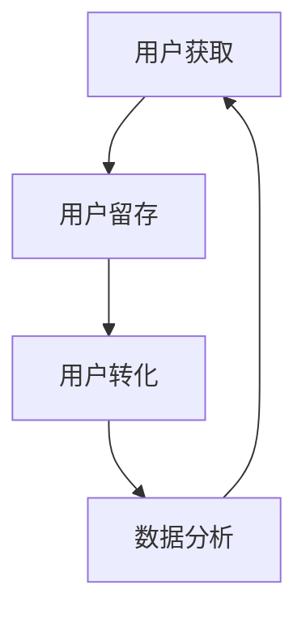

                 

在当今数字化时代，知识付费已经成为一个不可忽视的领域。随着在线教育的兴起，越来越多的创业者投身于这个充满机遇的市场。然而，要想在这个竞争激烈的环境中脱颖而出，增长黑客（Growth Hacker）的技巧变得至关重要。本文将深入探讨知识付费创业中的增长黑客策略，帮助创业者实现可持续的增长。

## 关键词

- 知识付费
- 增长黑客
- 在线教育
- 用户增长
- 数据分析

## 摘要

本文旨在为知识付费创业领域的创业者提供一套实用的增长黑客技巧。我们将从核心概念、算法原理、数学模型、项目实践和实际应用等多个角度，详细解析如何在知识付费领域中实现快速增长。

### 1. 背景介绍

知识付费是一种通过付费获取知识、技能和服务的商业模式。它主要基于互联网平台，用户可以在线购买课程、咨询、培训等服务。近年来，随着移动互联网和在线教育的快速发展，知识付费市场呈现出爆炸式增长。据数据显示，我国知识付费市场规模已超过千亿元人民币，预计未来还将保持高速增长。

然而，在这个充满机遇的市场中，竞争也愈发激烈。许多创业者面临着如何吸引更多用户、提高用户留存率和转化率的挑战。这时，增长黑客的技巧应运而生，成为解决这些问题的关键。

### 2. 核心概念与联系

#### 2.1 增长黑客的定义

增长黑客（Growth Hacker）是指一种运用创新思维和数据分析能力，通过技术手段实现用户增长的方法。与传统的营销策略不同，增长黑客更注重利用数据驱动的方式，寻找高效的用户增长途径。

#### 2.2 知识付费与增长黑客的联系

在知识付费领域，增长黑客的技巧主要体现在以下几个方面：

- **用户获取**：通过SEO、社交媒体营销、内容营销等手段，提高品牌知名度，吸引潜在用户。
- **用户留存**：利用数据分析，了解用户需求，优化产品和服务，提高用户满意度和留存率。
- **用户转化**：通过精准推送、优惠券、活动等方式，刺激用户购买行为，提高转化率。

#### 2.3 Mermaid 流程图

下面是一个简单的 Mermaid 流程图，展示了知识付费创业中的增长黑客策略：



### 3. 核心算法原理 & 具体操作步骤

#### 3.1 算法原理概述

增长黑客的核心算法原理主要包括以下几个方面：

- **用户行为分析**：通过对用户行为数据的分析，了解用户的需求、兴趣和行为习惯。
- **数据驱动决策**：根据用户行为数据，制定针对性的营销策略和产品优化方案。
- **A/B 测试**：通过对比不同策略的效果，找到最优的用户增长途径。

#### 3.2 算法步骤详解

1. **数据收集与处理**：收集用户在平台上的各种行为数据，如浏览、购买、评价等，并进行预处理。
2. **用户行为分析**：利用机器学习和数据挖掘技术，分析用户行为数据，提取用户特征和需求。
3. **策略制定**：根据用户特征和需求，制定针对性的营销策略和产品优化方案。
4. **A/B 测试**：对不同的策略进行测试，评估效果，选择最优策略。
5. **迭代优化**：根据测试结果，不断调整和优化策略，实现用户增长。

#### 3.3 算法优缺点

**优点**：

- **高效**：通过数据驱动的方式，找到高效的用户增长途径，提高转化率。
- **精准**：根据用户特征和需求，制定针对性的策略，提高用户满意度。

**缺点**：

- **成本较高**：需要投入大量的人力、物力和财力进行数据分析和算法优化。
- **依赖数据质量**：数据质量直接影响算法的效果，需要确保数据收集和处理的质量。

#### 3.4 算法应用领域

增长黑客的算法原理在知识付费领域具有广泛的应用。例如：

- **课程推荐**：根据用户行为数据，推荐用户可能感兴趣的课程。
- **用户细分**：根据用户特征，将用户划分为不同的群体，提供个性化的服务。
- **营销活动**：根据用户需求和兴趣，制定针对性的营销活动，提高转化率。

### 4. 数学模型和公式 & 详细讲解 & 举例说明

#### 4.1 数学模型构建

在知识付费创业中，常见的数学模型包括用户流失模型、用户转化模型等。下面以用户流失模型为例，介绍数学模型的构建方法。

**用户流失模型**：

$$
\text{流失率} = \frac{\text{流失用户数}}{\text{总用户数}} \times 100\%
$$

**用户转化模型**：

$$
\text{转化率} = \frac{\text{购买用户数}}{\text{访客数}} \times 100\%
$$

#### 4.2 公式推导过程

**用户流失模型**：

假设在时间 $t$ 内，总用户数为 $N(t)$，流失用户数为 $L(t)$。则流失率可以表示为：

$$
\text{流失率} = \frac{L(t)}{N(t)} \times 100\%
$$

**用户转化模型**：

假设在时间 $t$ 内，访客数为 $V(t)$，购买用户数为 $P(t)$。则转化率可以表示为：

$$
\text{转化率} = \frac{P(t)}{V(t)} \times 100\%
$$

#### 4.3 案例分析与讲解

假设一个知识付费平台在一个月内共有 10000 名用户，其中有 2000 名用户购买了课程。则该平台的用户流失率和转化率分别为：

**用户流失率**：

$$
\text{流失率} = \frac{10000 - 2000}{10000} \times 100\% = 80\%
$$

**用户转化率**：

$$
\text{转化率} = \frac{2000}{10000} \times 100\% = 20\%
$$

通过这个案例，我们可以看到，用户流失率和转化率对于知识付费平台的业绩有着重要的影响。因此，我们需要通过增长黑客的技巧，降低用户流失率，提高用户转化率。

### 5. 项目实践：代码实例和详细解释说明

#### 5.1 开发环境搭建

在本文中，我们将使用 Python 编写一个简单的用户流失预测模型。开发环境搭建如下：

1. 安装 Python 3.7 版本及以上
2. 安装必要的库，如 NumPy、Pandas、Scikit-learn 等

#### 5.2 源代码详细实现

```python
import numpy as np
import pandas as pd
from sklearn.ensemble import RandomForestClassifier
from sklearn.model_selection import train_test_split
from sklearn.metrics import accuracy_score

# 数据读取
data = pd.read_csv('user_data.csv')

# 数据预处理
X = data.drop(['user_id', 'is_lost'], axis=1)
y = data['is_lost']

# 划分训练集和测试集
X_train, X_test, y_train, y_test = train_test_split(X, y, test_size=0.2, random_state=42)

# 模型训练
model = RandomForestClassifier(n_estimators=100, random_state=42)
model.fit(X_train, y_train)

# 预测
y_pred = model.predict(X_test)

# 模型评估
accuracy = accuracy_score(y_test, y_pred)
print('Accuracy:', accuracy)
```

#### 5.3 代码解读与分析

1. **数据读取**：使用 Pandas 库读取用户数据，数据格式为 CSV。
2. **数据预处理**：将用户数据分为特征矩阵 X 和目标变量 y。
3. **划分训练集和测试集**：使用 Scikit-learn 库将数据划分为训练集和测试集，用于模型训练和评估。
4. **模型训练**：使用随机森林算法（RandomForestClassifier）训练模型。
5. **预测**：使用训练好的模型对测试集进行预测。
6. **模型评估**：计算预测准确率，评估模型性能。

通过这个简单的示例，我们可以看到如何使用 Python 实现一个用户流失预测模型。在实际应用中，我们可以根据需求调整模型参数，优化模型性能。

### 6. 实际应用场景

知识付费创业中的增长黑客技巧在以下场景中具有显著的应用效果：

- **在线教育平台**：通过用户行为分析，精准推荐课程，提高用户留存率和转化率。
- **在线咨询平台**：根据用户需求，推荐专家，提高用户满意度和购买意愿。
- **职业培训平台**：通过用户数据分析，制定个性化培训方案，提高学员就业率和转化率。

### 7. 工具和资源推荐

#### 7.1 学习资源推荐

- **《增长黑客：硅谷创业者的用户增长手册》**：详细介绍增长黑客的实践方法和案例分析。
- **《Python 数据分析》**：系统讲解 Python 在数据分析领域的应用，适合初学者。

#### 7.2 开发工具推荐

- **Jupyter Notebook**：强大的数据分析与交互式开发工具。
- **TensorFlow**：用于机器学习和深度学习的开源框架。

#### 7.3 相关论文推荐

- **《用户流失预测：基于机器学习的方法》**：探讨用户流失预测的算法和应用。
- **《基于用户行为的在线教育平台个性化推荐研究》**：分析用户行为数据，实现个性化推荐。

### 8. 总结：未来发展趋势与挑战

知识付费创业领域的增长黑客技巧正逐渐成为核心竞争力。未来，随着人工智能和大数据技术的发展，增长黑客技巧将更加成熟和多样化。然而，面临数据隐私、算法透明度等挑战，创业者需要不断优化策略，确保数据安全和用户权益。

### 9. 附录：常见问题与解答

#### 9.1 如何获取用户行为数据？

- 利用第三方数据分析工具，如 Google Analytics、百度统计等。
- 自行搭建数据分析平台，收集用户行为数据。

#### 9.2 如何确保数据质量？

- 定期清洗和更新数据。
- 采用合理的采样方法和过滤条件。

#### 9.3 如何提高用户转化率？

- 制定个性化的营销策略。
- 优化用户体验，提高用户满意度。

---

**作者：禅与计算机程序设计艺术 / Zen and the Art of Computer Programming**。

本文旨在为知识付费创业领域的创业者提供一套实用的增长黑客技巧，帮助他们在激烈的市场竞争中实现可持续的增长。希望本文对您有所启发和帮助。**

