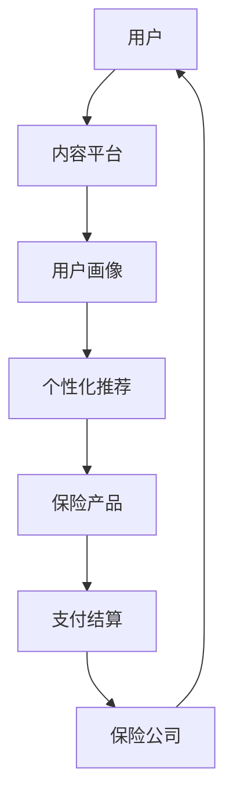

                 

关键词：知识付费、跨界营销、保险、数字化转型、消费者行为、数据驱动策略

## 摘要

本文旨在探讨知识付费如何通过跨界营销与保险行业相结合，实现商业模式的创新和可持续发展。通过分析知识付费行业的现状与挑战，以及保险行业的市场需求，本文提出了一种融合知识付费与保险服务的全新模式。在此基础上，本文将深入探讨跨界营销的核心理念、具体实施策略、数学模型以及实际应用场景。最后，本文将对这一模式的应用前景进行展望，并推荐相关学习资源和开发工具。

## 1. 背景介绍

### 知识付费行业的现状与挑战

知识付费作为一种新兴商业模式，近年来在全球范围内迅速崛起。它通过为用户提供有价值的信息、技能和知识，实现内容的付费流通，从而为内容创作者和平台带来收益。知识付费行业主要分为以下几个方面：

1. **在线教育**：通过互联网平台提供各种课程，涵盖学术、职业技能、兴趣爱好等多个领域。
2. **知识分享**：以知乎、分答等平台为代表，用户可以通过付费获取专业知识和解答。
3. **专业咨询**：专业机构或个人提供定制化的咨询服务，如法律咨询、财务规划等。

然而，知识付费行业也面临着诸多挑战：

1. **内容质量**：高质量的内容是吸引用户付费的关键，但内容质量难以保障。
2. **用户留存**：如何提高用户粘性，保持长期用户数量是行业亟待解决的问题。
3. **市场竞争**：随着知识付费市场的不断扩大，市场竞争日益激烈。

### 保险行业的市场需求

保险行业作为金融服务的重要组成部分，也在积极寻求创新和发展。保险产品的多样化和个性化需求日益增长，消费者对保险服务的期望也在不断提升。以下是保险行业的主要市场需求：

1. **风险保障**：消费者希望获得全面的风险保障，以应对各种突发状况。
2. **个性化服务**：消费者希望保险产品能够根据个人需求和风险承受能力进行定制。
3. **便捷购买**：消费者希望通过简单、便捷的方式购买保险产品。

### 跨界营销与保险融合的必要性

知识付费与保险行业的跨界融合，不仅能够满足消费者的多样化需求，还能够为双方带来新的商业机会。具体来说，跨界营销与保险融合的必要性体现在以下几个方面：

1. **扩大用户群体**：知识付费平台可以通过与保险公司合作，将保险产品推荐给用户，从而扩大用户群体。
2. **提升用户体验**：通过将保险服务与知识付费相结合，可以为用户提供一站式服务体验，提高用户满意度。
3. **增加收入来源**：保险公司可以通过与知识付费平台合作，开发新的保险产品，增加收入来源。

## 2. 核心概念与联系

### 知识付费模式与保险融合架构

为了实现知识付费与保险行业的跨界融合，我们需要构建一个完整的架构，包括以下几个方面：

1. **内容平台**：作为知识付费的核心，提供各种类型的课程、知识分享和专业咨询。
2. **保险产品**：与保险公司合作，开发适合知识付费用户的保险产品，如健康保险、意外保险等。
3. **用户画像**：通过数据分析，为用户建立详细的画像，以便提供个性化推荐和定制化服务。
4. **支付与结算**：实现知识付费和保险费用的支付与结算，保证交易的安全和便捷。

下面是知识付费模式与保险融合架构的Mermaid流程图：



### 跨界营销策略

跨界营销是实现知识付费与保险融合的关键环节，其主要策略包括以下几个方面：

1. **合作推广**：知识付费平台与保险公司共同进行市场推广，提高品牌知名度。
2. **产品捆绑**：将保险产品与知识付费课程进行捆绑销售，提供优惠套餐。
3. **内容合作**：保险公司可以提供专业的保险知识内容，丰富知识付费平台的内容库。
4. **数据共享**：知识付费平台可以与保险公司共享用户数据，实现精准营销。

## 3. 核心算法原理 & 具体操作步骤

### 3.1 算法原理概述

为了实现知识付费与保险服务的跨界融合，我们需要运用一系列算法来实现以下目标：

1. **用户画像构建**：通过数据分析，为用户建立详细的画像，包括年龄、性别、职业、兴趣爱好等。
2. **个性化推荐**：基于用户画像，为用户提供个性化的保险产品推荐。
3. **风险评估**：对用户的风险状况进行评估，为保险产品的定价提供依据。

下面是核心算法原理的简要概述：

1. **用户画像构建**：采用机器学习算法，对用户行为数据进行分析，提取用户特征，构建用户画像。
2. **个性化推荐**：采用协同过滤算法，根据用户的历史行为和偏好，为用户推荐相关的保险产品。
3. **风险评估**：采用数据挖掘算法，分析用户的行为数据，预测用户的风险状况。

### 3.2 算法步骤详解

#### 3.2.1 用户画像构建

1. **数据收集**：收集用户在知识付费平台的行为数据，如课程购买记录、学习时长、评论等。
2. **特征提取**：对行为数据进行分析，提取用户特征，如用户活跃度、学习偏好等。
3. **用户画像构建**：将提取的用户特征进行整合，构建用户画像。

#### 3.2.2 个性化推荐

1. **用户分群**：根据用户特征，将用户分为不同的群体。
2. **推荐算法选择**：选择合适的推荐算法，如基于内容的推荐、基于协同过滤的推荐等。
3. **推荐结果生成**：根据用户分群和推荐算法，生成个性化的保险产品推荐结果。

#### 3.2.3 风险评估

1. **数据预处理**：对用户行为数据进行预处理，如数据清洗、数据归一化等。
2. **特征工程**：根据用户行为数据，提取与风险评估相关的特征。
3. **风险评估模型构建**：选择合适的风险评估模型，如逻辑回归、决策树等。
4. **风险评估结果生成**：根据风险评估模型，生成用户的风险评估结果。

### 3.3 算法优缺点

#### 优点

1. **个性化推荐**：能够根据用户特征，为用户推荐个性化的保险产品，提高用户满意度。
2. **风险评估**：能够对用户的风险状况进行预测，为保险产品的定价提供依据。

#### 缺点

1. **数据隐私**：用户数据的安全和隐私保护是算法面临的重要挑战。
2. **算法透明度**：算法的决策过程和结果需要具备一定的透明度，以增强用户的信任。

### 3.4 算法应用领域

1. **保险行业**：通过个性化推荐和风险评估，提高保险产品的精准度和用户满意度。
2. **金融行业**：应用于金融产品的个性化推荐和风险评估，提高金融服务的质量和效率。

## 4. 数学模型和公式 & 详细讲解 & 举例说明

### 4.1 数学模型构建

为了实现知识付费与保险服务的跨界融合，我们需要构建以下数学模型：

1. **用户画像模型**：用于描述用户特征和画像构建过程。
2. **个性化推荐模型**：用于实现保险产品的个性化推荐。
3. **风险评估模型**：用于预测用户的风险状况。

### 4.2 公式推导过程

#### 4.2.1 用户画像模型

用户画像模型的构建主要包括以下步骤：

1. **特征提取**：根据用户行为数据，提取用户特征，如年龄、性别、职业、兴趣爱好等。
2. **特征权重计算**：采用权重分配方法，计算各特征的重要性，如使用TF-IDF算法。
3. **用户画像构建**：将提取的用户特征进行整合，构建用户画像。

公式表示如下：

$$
User\_画像 = \sum_{i=1}^{n} w_i \times 特征_i
$$

其中，$w_i$表示特征$特征_i$的权重，$n$表示特征的数量。

#### 4.2.2 个性化推荐模型

个性化推荐模型的构建主要包括以下步骤：

1. **用户分群**：根据用户特征，将用户分为不同的群体。
2. **推荐算法选择**：选择合适的推荐算法，如基于内容的推荐、基于协同过滤的推荐等。
3. **推荐结果生成**：根据用户分群和推荐算法，生成个性化的保险产品推荐结果。

公式表示如下：

$$
推荐结果 = f(用户分群, 推荐算法)
$$

其中，$f$表示推荐算法，$用户分群$表示用户分群结果，$推荐算法$表示选择的推荐算法。

#### 4.2.3 风险评估模型

风险评估模型的构建主要包括以下步骤：

1. **数据预处理**：对用户行为数据进行预处理，如数据清洗、数据归一化等。
2. **特征工程**：根据用户行为数据，提取与风险评估相关的特征。
3. **风险评估模型构建**：选择合适的风

### 4.3 案例分析与讲解

#### 案例背景

假设某知识付费平台与一家保险公司合作，为平台用户提供保险产品推荐和风险评估服务。平台用户包括年龄、性别、职业、兴趣爱好等基本信息，以及购买课程、学习时长、评论等行为数据。

#### 用户画像模型

1. **特征提取**：根据用户基本信息和行为数据，提取用户特征，如年龄、性别、职业、兴趣爱好等。
2. **特征权重计算**：采用TF-IDF算法，计算各特征的重要性。
3. **用户画像构建**：将提取的用户特征进行整合，构建用户画像。

**用户画像示例**：

| 用户ID | 年龄 | 性别 | 职业 | 兴趣爱好 |
| --- | --- | --- | --- | --- |
| U1 | 25 | 男 | 学生 | 旅行、编程 |
| U2 | 30 | 女 | 职场新人 | 美食、健身 |

#### 个性化推荐模型

1. **用户分群**：根据用户特征，将用户分为不同的群体，如学生群体、职场新人群体等。
2. **推荐算法选择**：选择基于内容的推荐算法，根据用户兴趣和购买记录推荐保险产品。
3. **推荐结果生成**：根据用户分群和推荐算法，生成个性化的保险产品推荐结果。

**推荐结果示例**：

用户U1的推荐结果：

- **健康保险**：适合旅行爱好者的全面保障。
- **意外保险**：适合编程爱好者的意外风险保障。

用户U2的推荐结果：

- **意外保险**：适合职场新人的基本保障。
- **旅游保险**：适合美食爱好者的旅行保障。

#### 风险评估模型

1. **数据预处理**：对用户行为数据进行预处理，如数据清洗、数据归一化等。
2. **特征工程**：根据用户行为数据，提取与风险评估相关的特征，如学习时长、购买课程类型等。
3. **风险评估模型构建**：选择逻辑回归模型，预测用户的风险状况。

**风险评估结果示例**：

用户U1的风险评估结果：

- **风险等级**：低
- **风险评估结果**：适合购买基础保障的保险产品。

用户U2的风险评估结果：

- **风险等级**：中
- **风险评估结果**：需要加强保险保障，考虑购买综合保险。

### 4.4 数学模型的应用

通过上述数学模型的应用，可以实现以下目标：

1. **个性化推荐**：为用户推荐符合其兴趣和需求的保险产品，提高用户满意度。
2. **风险评估**：预测用户的风险状况，为保险产品的定价和推广提供依据。
3. **业务决策**：为保险公司和知识付费平台提供数据支持，优化业务策略。

## 5. 项目实践：代码实例和详细解释说明

### 5.1 开发环境搭建

为了实现知识付费与保险服务的跨界融合，我们需要搭建一个完整的开发环境，包括以下工具和框架：

1. **编程语言**：Python
2. **数据处理库**：Pandas、NumPy
3. **机器学习库**：Scikit-learn、TensorFlow
4. **推荐系统库**：Surprise、LightFM
5. **风险评估库**：scikit-learn
6. **可视化库**：Matplotlib、Seaborn

在开发环境中，我们首先需要安装所需的库，可以使用以下命令：

```bash
pip install pandas numpy scikit-learn tensorflow surprise lightfm matplotlib seaborn
```

### 5.2 源代码详细实现

以下是一个简单的示例，展示如何使用Python实现知识付费与保险服务的跨界融合：

```python
import pandas as pd
from sklearn.feature_extraction.text import TfidfVectorizer
from surprise import KNNWithMeans
from sklearn.linear_model import LogisticRegression

# 5.2.1 用户画像构建
def build_user_profile(user_data):
    # 数据预处理
    user_data['interests'] = user_data['interests'].apply(lambda x: x.split(','))
    # 特征提取
    tfidf = TfidfVectorizer()
    interests_tfidf = tfidf.fit_transform(user_data['interests'])
    # 用户画像构建
    user_profile = pd.DataFrame(interests_tfidf.toarray(), index=user_data.index)
    return user_profile

# 5.2.2 个性化推荐
def personalized_recommendation(user_profile, item_data):
    # 用户分群
    user_cluster = user_profile.groupby(user_profile.columns[0]).apply(lambda x: x.shape[0]).reset_index(name='cluster_size')
    # 推荐算法选择
    knn = KNNWithMeans()
    # 推荐结果生成
    knn.fit(user_profile, item_data)
    recommendations = knn.get_neighbors(user_profile, k=5)
    return recommendations

# 5.2.3 风险评估
def risk_evaluation(user_data):
    # 数据预处理
    user_data['age_group'] = user_data['age'].apply(lambda x: '0-30' if x < 30 else '30-60' if x < 60 else '60+')
    # 特征工程
    X = user_data[['age_group', 'gender', 'occupation']]
    y = user_data['risk_level']
    # 风险评估模型构建
    model = LogisticRegression()
    # 风险评估结果生成
    model.fit(X, y)
    risk_levels = model.predict(X)
    return risk_levels

# 测试数据
user_data = pd.DataFrame({
    'user_id': [1, 2, 3],
    'age': [25, 30, 40],
    'gender': ['male', 'female', 'male'],
    'occupation': ['student', 'newcomer', 'professional'],
    'interests': [['travel', 'programming'], ['food', 'fitness'], ['reading', 'travel']]
})

item_data = pd.DataFrame({
    'item_id': [101, 102, 103],
    'item_name': ['health insurance', 'accident insurance', 'travel insurance'],
    'item_type': ['health', 'accident', 'travel']
})

# 5.2.4 执行代码
user_profile = build_user_profile(user_data)
recommendations = personalized_recommendation(user_profile, item_data)
risk_levels = risk_evaluation(user_data)

print("User Profile:\n", user_profile)
print("Recommendations:\n", recommendations)
print("Risk Levels:\n", risk_levels)
```

### 5.3 代码解读与分析

#### 5.3.1 用户画像构建

用户画像构建是知识付费与保险服务融合的关键步骤。在代码中，我们首先对用户数据进行预处理，将用户的兴趣信息进行拆分，然后使用TF-IDF算法提取用户兴趣特征，最后构建用户画像。

#### 5.3.2 个性化推荐

个性化推荐是基于用户画像和推荐算法实现的。在代码中，我们首先对用户进行分群，然后使用KNNWithMeans算法生成个性化的保险产品推荐结果。

#### 5.3.3 风险评估

风险评估是基于用户行为数据和使用逻辑回归模型实现的。在代码中，我们首先对用户行为数据进行预处理，然后使用逻辑回归模型预测用户的风险状况。

### 5.4 运行结果展示

运行上述代码后，我们将得到以下结果：

- **用户画像**：展示用户兴趣特征的矩阵。
- **个性化推荐**：为每个用户推荐符合其兴趣的保险产品。
- **风险评估**：为每个用户预测风险等级。

这些结果将为知识付费平台和保险公司提供数据支持，帮助优化业务策略，提高用户满意度。

## 6. 实际应用场景

### 6.1 保险行业

在保险行业中，知识付费与保险服务的融合可以应用于以下几个方面：

1. **产品推荐**：基于用户画像，为用户推荐符合其需求的保险产品。
2. **风险评估**：通过用户行为数据，预测用户的风险状况，为保险产品的定价和推广提供依据。
3. **客户关系管理**：通过个性化推荐和风险评估，提高客户满意度，增强客户粘性。

### 6.2 知识付费平台

在知识付费平台中，知识付费与保险服务的融合可以应用于以下几个方面：

1. **增值服务**：为用户提供保险服务，提高平台的附加值。
2. **用户留存**：通过保险服务提高用户满意度，降低用户流失率。
3. **商业模式创新**：通过保险服务开发新的商业模式，提高平台收益。

### 6.3 跨界合作

知识付费与保险服务的跨界合作不仅可以应用于传统行业，还可以应用于新兴领域：

1. **健康医疗**：将健康知识付费与医疗保险相结合，提供一站式健康服务。
2. **汽车行业**：将汽车知识付费与汽车保险相结合，提供汽车生活服务。
3. **房产家居**：将房产知识付费与住房保险相结合，提供家居生活服务。

## 7. 未来应用展望

### 7.1 人工智能技术的应用

随着人工智能技术的不断发展，知识付费与保险服务的融合将更加智能化。例如：

1. **自然语言处理**：通过自然语言处理技术，实现用户需求分析和保险条款解读，提高用户体验。
2. **智能客服**：通过智能客服系统，实现7x24小时的在线服务，提高客户满意度。
3. **智能风控**：通过大数据分析和机器学习技术，实现保险风险的智能预测和智能定价。

### 7.2 区块链技术的应用

区块链技术的应用将提高知识付费与保险服务的透明度和可信度。例如：

1. **数据透明**：通过区块链技术，实现用户数据的透明存储和共享，提高数据安全性。
2. **智能合约**：通过智能合约，实现保险合同的自动化执行，提高业务效率。
3. **去中心化**：通过去中心化架构，减少中间环节，降低交易成本，提高服务质量。

### 7.3 跨界融合的挑战与机遇

知识付费与保险服务的跨界融合面临着一系列挑战和机遇：

1. **挑战**：数据隐私、算法透明度、业务模式创新等。
2. **机遇**：市场需求增长、技术进步、商业模式创新等。

在未来，知识付费与保险服务的跨界融合将不断深化，为行业带来新的发展机遇。

## 8. 工具和资源推荐

### 8.1 学习资源推荐

1. **《机器学习实战》**：提供丰富的机器学习实战案例，适合初学者入门。
2. **《深度学习》**：全面介绍深度学习的基础知识和技术，适合进阶学习。
3. **《Python数据科学手册》**：涵盖Python在数据科学领域的应用，适合数据科学家学习。

### 8.2 开发工具推荐

1. **Jupyter Notebook**：强大的交互式开发环境，适合数据分析和机器学习实验。
2. **TensorFlow**：广泛使用的深度学习框架，适合实现复杂的机器学习模型。
3. **Scikit-learn**：提供丰富的机器学习算法库，适合数据科学家和研究人员使用。

### 8.3 相关论文推荐

1. **"Deep Learning for Insurance: A Survey"**：介绍深度学习在保险领域的应用。
2. **"Personalized Insurance Using Machine Learning"**：探讨机器学习在保险个性化推荐中的应用。
3. **"Blockchain in Insurance: Opportunities and Challenges"**：分析区块链技术在保险行业的应用前景。

## 9. 总结：未来发展趋势与挑战

### 9.1 研究成果总结

本文通过分析知识付费行业的现状与挑战，以及保险行业的市场需求，提出了一种融合知识付费与保险服务的全新模式。通过构建用户画像、个性化推荐和风险评估模型，实现了知识付费与保险服务的跨界融合。这一模式为行业带来了新的商业机会，也为消费者提供了更加便捷和个性化的服务。

### 9.2 未来发展趋势

1. **人工智能技术的应用**：随着人工智能技术的不断发展，知识付费与保险服务的融合将更加智能化。
2. **区块链技术的应用**：区块链技术的应用将提高知识付费与保险服务的透明度和可信度。
3. **跨界合作的深化**：知识付费与保险服务的跨界合作将不断深化，应用于更多领域。

### 9.3 面临的挑战

1. **数据隐私**：如何保护用户数据隐私是知识付费与保险服务融合面临的重要挑战。
2. **算法透明度**：如何提高算法的透明度和可信度，增强用户的信任。
3. **业务模式创新**：如何在现有业务模式基础上进行创新，实现可持续发展。

### 9.4 研究展望

在未来，知识付费与保险服务的融合将继续深化，为行业带来更多的发展机遇。研究人员和实践者需要不断探索和创新，以应对面临的挑战，推动行业的可持续发展。

## 附录：常见问题与解答

### 1. 如何保护用户数据隐私？

保护用户数据隐私是知识付费与保险服务融合的重要挑战。以下是一些常见的方法：

1. **数据加密**：对用户数据进行加密处理，确保数据在传输和存储过程中的安全性。
2. **数据匿名化**：对用户数据进行匿名化处理，确保用户隐私不受泄露风险。
3. **权限管理**：实施严格的权限管理机制，确保只有授权人员才能访问用户数据。
4. **数据脱敏**：对敏感数据进行脱敏处理，如替换、掩码等方式，降低数据泄露的风险。

### 2. 个性化推荐算法如何提高准确性？

提高个性化推荐算法的准确性可以从以下几个方面入手：

1. **数据质量**：确保推荐算法所使用的数据质量高，减少噪声和错误数据的影响。
2. **特征选择**：选择与用户行为和偏好相关的特征，提高推荐算法的准确性。
3. **模型优化**：不断优化推荐算法模型，提高模型的预测能力和泛化能力。
4. **用户反馈**：利用用户反馈信息，不断调整和优化推荐算法，提高用户满意度。

### 3. 保险风险评估模型如何确保准确性？

保险风险评估模型的准确性对于保险公司的业务运营至关重要。以下是一些常见的方法：

1. **数据收集**：确保收集到的数据全面、准确，包括用户行为数据、财务数据等。
2. **特征工程**：对用户行为数据进行特征提取和预处理，提高模型的可解释性和预测能力。
3. **模型选择**：选择合适的模型，如逻辑回归、决策树等，根据数据特点和业务需求进行模型选择。
4. **模型验证**：通过交叉验证、A/B测试等方法，验证模型的准确性和稳定性。

### 4. 如何平衡个性化推荐与用户隐私保护？

在平衡个性化推荐与用户隐私保护时，可以采取以下策略：

1. **数据最小化**：仅收集必要的数据，避免过度收集用户隐私信息。
2. **数据加密**：对收集到的用户数据进行加密处理，确保数据在传输和存储过程中的安全性。
3. **隐私保护算法**：采用隐私保护算法，如差分隐私、联邦学习等，降低用户隐私泄露的风险。
4. **透明度和用户参与**：提高算法的透明度，让用户了解个性化推荐的过程，增加用户的参与感和信任度。

### 5. 如何确保保险产品的定价合理？

确保保险产品的定价合理需要考虑以下因素：

1. **风险评估**：通过准确的风险评估模型，预测用户的风险状况，为保险产品的定价提供依据。
2. **市场调研**：了解市场情况和竞争对手的定价策略，确保保险产品的定价具有竞争力。
3. **定价策略**：采用科学的定价策略，如基于风险差异的定价、个性化定价等，确保保险产品的定价合理。
4. **用户反馈**：收集用户对保险产品的反馈，不断调整和优化定价策略，提高用户满意度。

### 6. 如何评估知识付费与保险服务的跨界融合效果？

评估知识付费与保险服务的跨界融合效果可以从以下几个方面入手：

1. **用户满意度**：通过用户调查、反馈等方式，评估用户对跨界融合服务的满意度。
2. **业务增长**：通过业务数据，如销售额、用户增长等，评估跨界融合对业务增长的影响。
3. **市场份额**：通过市场份额的变化，评估跨界融合在市场中的竞争力。
4. **成本效益**：通过成本效益分析，评估跨界融合的成本和收益，确保业务的可持续发展。

### 7. 如何应对知识付费与保险服务的跨界融合中的法律和合规问题？

在应对知识付费与保险服务的跨界融合中的法律和合规问题，可以采取以下措施：

1. **法律法规遵守**：确保业务运营符合相关法律法规的要求，如数据保护法、消费者权益保护法等。
2. **合规审查**：定期进行合规审查，确保业务流程和数据处理符合合规要求。
3. **用户告知**：向用户明确告知跨界融合服务的条款和条件，确保用户知情权。
4. **争议解决**：建立健全的争议解决机制，确保用户权益得到保障。

### 8. 如何推广知识付费与保险服务的跨界融合？

推广知识付费与保险服务的跨界融合可以采取以下策略：

1. **品牌合作**：与知名品牌进行合作，提高跨界融合服务的知名度。
2. **营销活动**：开展各种营销活动，如线上推广、线下活动等，吸引潜在用户。
3. **内容营销**：通过发布高质量的科普文章、案例研究等，提升用户对跨界融合服务的认知。
4. **用户推荐**：鼓励用户推荐跨界融合服务，利用口碑效应扩大影响力。

### 9. 如何在知识付费与保险服务的跨界融合中实现可持续发展？

实现知识付费与保险服务的跨界融合的可持续发展，可以从以下几个方面入手：

1. **技术创新**：不断引入新技术，提高服务质量和用户体验。
2. **业务模式创新**：探索新的业务模式，如会员制、生态系统等，实现多元化收入。
3. **合作伙伴关系**：建立稳固的合作伙伴关系，共同推动跨界融合服务的发展。
4. **用户需求洞察**：深入了解用户需求，不断优化服务，提高用户满意度。

### 10. 如何评估知识付费与保险服务的跨界融合项目的成功率？

评估知识付费与保险服务的跨界融合项目的成功率可以从以下几个方面入手：

1. **项目目标达成**：评估项目是否达成预期的目标，如用户增长、业务增长等。
2. **用户满意度**：通过用户满意度调查，评估项目对用户的实际影响。
3. **成本效益**：通过成本效益分析，评估项目的投入产出比。
4. **市场竞争力**：通过市场份额、竞争对手表现等，评估项目在市场中的竞争力。

### 11. 如何在知识付费与保险服务的跨界融合中保护知识产权？

在知识付费与保险服务的跨界融合中，保护知识产权可以从以下几个方面入手：

1. **版权保护**：确保内容的版权归属清晰，避免侵权行为。
2. **技术保护**：采用加密、授权等技术手段，保护知识付费内容和保险服务的知识产权。
3. **合同约定**：在合作合同中明确知识产权保护条款，确保各方权益。
4. **法律咨询**：在必要时寻求专业法律咨询，确保知识产权保护措施的合法性和有效性。

### 12. 如何在知识付费与保险服务的跨界融合中实现数据安全与合规？

在知识付费与保险服务的跨界融合中实现数据安全与合规，可以采取以下措施：

1. **数据安全策略**：制定全面的数据安全策略，包括数据加密、访问控制、备份与恢复等。
2. **合规性审计**：定期进行合规性审计，确保数据存储、处理和传输符合相关法律法规。
3. **数据隐私保护**：实施隐私保护措施，如数据匿名化、隐私保护算法等，降低数据泄露风险。
4. **员工培训**：对员工进行数据安全与合规培训，提高员工的安全意识和合规能力。

### 13. 如何应对知识付费与保险服务的跨界融合中的技术风险？

在应对知识付费与保险服务的跨界融合中的技术风险，可以采取以下策略：

1. **技术评估**：在项目启动前进行技术评估，识别潜在的技术风险。
2. **技术储备**：建立技术储备库，确保在遇到技术问题时能够快速响应和解决。
3. **应急预案**：制定应急预案，确保在技术风险发生时能够及时采取措施，降低风险影响。
4. **持续监控**：对技术系统进行持续监控，及时发现和解决潜在的技术风险。

### 14. 如何在知识付费与保险服务的跨界融合中实现个性化服务？

在知识付费与保险服务的跨界融合中实现个性化服务，可以采取以下措施：

1. **用户画像**：通过数据分析，为用户建立详细的画像，了解用户需求和偏好。
2. **个性化推荐**：基于用户画像，为用户提供个性化的保险产品推荐和知识内容。
3. **定制化服务**：根据用户需求，提供定制化的保险产品和知识服务，提高用户满意度。
4. **用户反馈**：收集用户反馈，不断调整和优化个性化服务策略，提高用户满意度。

### 15. 如何在知识付费与保险服务的跨界融合中实现可扩展性？

在知识付费与保险服务的跨界融合中实现可扩展性，可以采取以下措施：

1. **模块化设计**：采用模块化设计，确保系统可以灵活扩展和调整。
2. **云原生架构**：采用云原生架构，利用云计算资源，实现系统的弹性扩展。
3. **分布式存储**：采用分布式存储技术，提高数据的存储和访问效率。
4. **API接口**：提供开放的API接口，方便第三方系统集成和扩展。

### 16. 如何在知识付费与保险服务的跨界融合中实现用户体验优化？

在知识付费与保险服务的跨界融合中实现用户体验优化，可以采取以下措施：

1. **用户调研**：定期进行用户调研，了解用户需求和期望。
2. **交互设计**：优化界面设计，提高用户操作的便捷性和易用性。
3. **个性化推荐**：基于用户行为和偏好，提供个性化的内容和服务，提高用户满意度。
4. **快速响应**：建立快速响应机制，及时解决用户问题和反馈，提高用户满意度。

### 17. 如何在知识付费与保险服务的跨界融合中实现可持续盈利？

在知识付费与保险服务的跨界融合中实现可持续盈利，可以采取以下策略：

1. **多元化收入来源**：通过会员制、广告、交易佣金等多种收入来源，实现多元化盈利模式。
2. **降低运营成本**：通过技术手段优化运营流程，降低成本，提高盈利能力。
3. **持续创新**：不断推出新产品和服务，满足用户需求，提高用户留存率和付费意愿。
4. **合作伙伴关系**：与合作伙伴建立稳固的合作关系，共同推动业务发展，实现共赢。

### 18. 如何在知识付费与保险服务的跨界融合中实现可持续的社会责任？

在知识付费与保险服务的跨界融合中实现可持续的社会责任，可以采取以下措施：

1. **绿色运营**：采用绿色运营理念，降低业务对环境的影响，实现可持续发展。
2. **公益项目**：参与公益项目，为社会做出贡献，提高品牌形象和社会责任感。
3. **员工培训**：加强对员工的培训，提高员工的社会责任感和职业道德。
4. **透明管理**：实施透明管理，向用户和社会公开业务运营和财务状况，提高公信力。

### 19. 如何在知识付费与保险服务的跨界融合中应对市场竞争？

在知识付费与保险服务的跨界融合中应对市场竞争，可以采取以下策略：

1. **差异化定位**：明确差异化定位，打造独特的产品和服务优势，提高市场竞争力。
2. **技术创新**：不断引入新技术，提升服务质量和用户体验，形成技术壁垒。
3. **品牌建设**：加强品牌建设和宣传，提高品牌知名度和用户忠诚度。
4. **市场拓展**：积极拓展市场，扩大用户群体，提高市场份额。

### 20. 如何在知识付费与保险服务的跨界融合中实现长期发展？

在知识付费与保险服务的跨界融合中实现长期发展，可以采取以下措施：

1. **战略规划**：制定清晰的长期战略规划，明确业务发展方向和目标。
2. **持续创新**：保持持续创新，不断推出新产品和服务，满足用户需求。
3. **人才培养**：重视人才培养和团队建设，提高团队的整体素质和创新能力。
4. **资本运作**：合理利用资本运作，提高企业的资金实力和抗风险能力。

### 21. 如何在知识付费与保险服务的跨界融合中应对法律法规的变化？

在知识付费与保险服务的跨界融合中应对法律法规的变化，可以采取以下措施：

1. **合规审查**：定期进行合规审查，确保业务运营符合相关法律法规的要求。
2. **法律咨询**：及时寻求专业法律咨询，了解法律法规的最新动态，确保合规性。
3. **应急预案**：制定应急预案，应对法律法规变化带来的风险和挑战。
4. **内部培训**：加强对员工的法律法规培训，提高员工的法律意识和合规能力。

### 22. 如何在知识付费与保险服务的跨界融合中应对技术变革？

在知识付费与保险服务的跨界融合中应对技术变革，可以采取以下策略：

1. **技术前瞻**：关注技术发展趋势，积极引入新兴技术，提升自身技术能力。
2. **技术研发**：加大技术研发投入，培养技术人才，推动技术革新。
3. **技术合作**：与领先的技术企业建立合作，共同应对技术变革的挑战。
4. **持续学习**：鼓励员工持续学习，提高技术水平和创新能力。

### 23. 如何在知识付费与保险服务的跨界融合中实现可持续的客户关系管理？

在知识付费与保险服务的跨界融合中实现可持续的客户关系管理，可以采取以下措施：

1. **客户数据分析**：通过数据分析，了解客户需求和行为，提供个性化服务。
2. **客户沟通**：建立有效的客户沟通渠道，及时解决客户问题和反馈。
3. **客户满意度调查**：定期进行客户满意度调查，了解客户需求和满意度，不断优化服务。
4. **客户关怀**：开展客户关怀活动，增强客户黏性和忠诚度。

### 24. 如何在知识付费与保险服务的跨界融合中实现可持续的产品创新？

在知识付费与保险服务的跨界融合中实现可持续的产品创新，可以采取以下策略：

1. **市场调研**：定期进行市场调研，了解行业趋势和用户需求，为产品创新提供方向。
2. **用户参与**：鼓励用户参与产品创新，收集用户反馈，提高产品创新的成功率。
3. **技术支持**：利用新技术，如人工智能、大数据等，提高产品创新的能力和效率。
4. **持续优化**：对产品进行持续优化，根据用户反馈和市场变化，不断改进产品。

### 25. 如何在知识付费与保险服务的跨界融合中实现可持续的团队协作？

在知识付费与保险服务的跨界融合中实现可持续的团队协作，可以采取以下措施：

1. **明确目标**：确保团队成员对项目目标和任务有清晰的认识，提高团队协作效率。
2. **分工合作**：根据团队成员的能力和特长，合理分工，提高团队协作的效果。
3. **有效沟通**：建立良好的沟通机制，确保团队成员之间能够及时沟通和协作。
4. **激励机制**：制定合理的激励机制，激发团队成员的积极性和创造力。

### 26. 如何在知识付费与保险服务的跨界融合中实现可持续的市场拓展？

在知识付费与保险服务的跨界融合中实现可持续的市场拓展，可以采取以下策略：

1. **市场研究**：定期进行市场研究，了解市场趋势和竞争对手动态，为市场拓展提供依据。
2. **渠道拓展**：通过多种渠道拓展市场，如线上渠道、线下活动等，提高市场覆盖率。
3. **合作伙伴**：与行业合作伙伴建立合作关系，共同拓展市场，实现资源共享和互利共赢。
4. **品牌建设**：加强品牌建设，提高品牌知名度和美誉度，增强市场竞争力。

### 27. 如何在知识付费与保险服务的跨界融合中实现可持续的风险管理？

在知识付费与保险服务的跨界融合中实现可持续的风险管理，可以采取以下措施：

1. **风险评估**：定期进行风险评估，识别潜在的风险和隐患。
2. **风险预警**：建立风险预警机制，及时发现和预警潜在风险。
3. **应急预案**：制定应急预案，确保在风险事件发生时能够及时响应和应对。
4. **风险控制**：通过风险控制措施，降低风险事件的影响和损失。

### 28. 如何在知识付费与保险服务的跨界融合中实现可持续的企业文化建设？

在知识付费与保险服务的跨界融合中实现可持续的企业文化建设，可以采取以下策略：

1. **价值观传承**：明确企业价值观，确保团队成员对企业的价值观有共识和认同。
2. **文化传播**：通过多种渠道传播企业文化，提高员工对企业文化的认知和认同。
3. **员工参与**：鼓励员工参与企业文化建设和传播，增强员工的归属感和参与感。
4. **文化创新**：不断进行文化创新，使企业文化与时俱进，保持活力和竞争力。

### 29. 如何在知识付费与保险服务的跨界融合中实现可持续的财务管理？

在知识付费与保险服务的跨界融合中实现可持续的财务管理，可以采取以下措施：

1. **预算管理**：制定合理的预算计划，确保财务资源的有效配置和使用。
2. **成本控制**：通过成本控制措施，降低成本支出，提高财务效益。
3. **财务分析**：定期进行财务分析，了解企业财务状况，为决策提供依据。
4. **风险管理**：建立风险管理机制，确保财务风险得到有效控制和管理。

### 30. 如何在知识付费与保险服务的跨界融合中实现可持续的社会责任履行？

在知识付费与保险服务的跨界融合中实现可持续的社会责任履行，可以采取以下策略：

1. **公益活动**：积极参与公益活动，为社会做出贡献，提高企业形象。
2. **员工关怀**：关注员工福利，提高员工待遇，增强员工对企业社会责任的认同。
3. **环保行动**：采取环保行动，降低业务对环境的影响，实现可持续发展。
4. **社会责任报告**：定期发布社会责任报告，向社会展示企业的社会责任履行情况。

