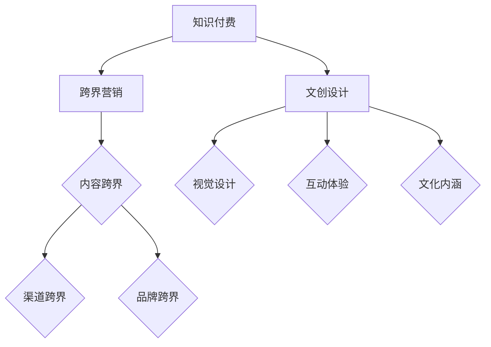

                 

在当今数字化时代，知识付费已经成为一种主流的商业模式。然而，如何通过跨界营销和文创设计来提升知识付费的价值和吸引力，成为许多企业和创作者关注的热点问题。本文将探讨知识付费如何实现跨界营销与文创设计跨界，结合实际案例，分析其中的关键要素和操作步骤。

## 1. 背景介绍

随着互联网技术的发展，知识付费市场呈现出快速增长的趋势。知识付费不仅限于传统的教育培训，还涵盖了在线课程、专业咨询、研究报告等多个领域。然而，市场竞争日益激烈，如何脱颖而出成为许多知识付费平台和创作者面临的一大挑战。

跨界营销和文创设计作为一种创新的商业模式，能够为知识付费带来新的增长点。跨界营销通过与其他行业、品牌的合作，扩大用户群体，提高品牌知名度。文创设计则通过创意和文化元素，提升产品的附加值，增强用户体验。本文将结合实际案例，分析知识付费如何实现跨界营销与文创设计跨界。

## 2. 核心概念与联系

### 2.1 跨界营销

跨界营销是指不同行业或品牌之间的合作，通过资源共享、联合推广等方式，实现共同发展。在知识付费领域，跨界营销可以通过以下几种方式实现：

- **内容跨界**：将知识付费内容与其他行业或领域的知识相结合，打造独特的学习体验。例如，将科技知识课程与艺术创作相结合，为用户提供多元化的学习内容。
- **渠道跨界**：通过与其他行业的平台或渠道合作，扩大知识付费的传播范围。例如，与社交媒体、电商平台合作，将知识付费产品推广给更多用户。
- **品牌跨界**：与其他知名品牌合作，借助品牌影响力提升知识付费产品的知名度。例如，与知名作家或明星合作，为知识付费产品带来更多关注。

### 2.2 文创设计

文创设计是指通过创意和文化元素的融入，提升产品的附加值和用户体验。在知识付费领域，文创设计可以通过以下几种方式实现：

- **视觉设计**：通过精美的视觉设计，提高知识付费产品的视觉效果，吸引更多用户。例如，设计独特的课程海报、教材封面等。
- **互动体验**：通过丰富的互动设计，增强用户的学习体验。例如，开发互动式课程、在线讨论区等。
- **文化内涵**：将文化元素融入知识付费产品，提升产品的文化价值。例如，结合中国传统节日、历史故事等，为用户提供具有文化内涵的学习内容。

### 2.3 Mermaid 流程图

以下是一个简单的 Mermaid 流程图，展示知识付费实现跨界营销与文创设计跨界的过程：



## 3. 核心算法原理 & 具体操作步骤

### 3.1 算法原理概述

知识付费实现跨界营销与文创设计的核心算法原理主要包括以下几个方面：

- **用户画像**：通过对用户数据的分析，了解用户的需求和偏好，为跨界营销和文创设计提供依据。
- **内容匹配**：将知识付费内容与其他行业或领域的知识进行匹配，实现内容跨界。
- **渠道整合**：将知识付费产品推广到多个渠道，实现渠道跨界。
- **品牌联动**：与其他品牌进行合作，实现品牌跨界。
- **创意设计**：通过创意和文化元素的融入，提升产品的附加值和用户体验。

### 3.2 算法步骤详解

1. **用户画像分析**：通过对用户数据的收集和分析，了解用户的基本信息、兴趣偏好、消费行为等，为后续的跨界营销和文创设计提供依据。

2. **内容匹配**：根据用户画像，将知识付费内容与其他行业或领域的知识进行匹配，打造独特的学习体验。

3. **渠道整合**：与多个渠道合作，将知识付费产品推广到更多用户群体。

4. **品牌联动**：与其他品牌进行合作，提升知识付费产品的知名度。

5. **创意设计**：通过视觉设计、互动体验、文化内涵等方面，提升产品的附加值和用户体验。

### 3.3 算法优缺点

**优点**：

- 提高知识付费产品的竞争力，增加用户粘性。
- 拓展用户群体，提高市场占有率。
- 增强品牌影响力，提升品牌价值。

**缺点**：

- 需要投入大量资源和精力进行跨界营销和文创设计。
- 需要具备一定的行业背景和专业知识。

### 3.4 算法应用领域

知识付费实现跨界营销与文创设计的算法应用领域主要包括：

- 在线教育平台：通过跨界营销和文创设计，提高在线教育平台的用户满意度和市场竞争力。
- 知识付费平台：通过跨界营销和文创设计，提高知识付费产品的附加值和用户体验。
- 创意设计行业：通过跨界营销和文创设计，拓展创意设计行业的市场空间。

## 4. 数学模型和公式 & 详细讲解 & 举例说明

### 4.1 数学模型构建

在知识付费实现跨界营销与文创设计的过程中，我们可以构建以下数学模型：

- **用户满意度模型**：用户满意度 = f（内容质量，渠道整合，品牌联动，创意设计）
- **市场占有率模型**：市场占有率 = f（用户满意度，品牌影响力，产品附加值）

### 4.2 公式推导过程

用户满意度模型的推导过程如下：

- 内容质量：用户对知识付费内容的满意度直接影响用户满意度。
- 渠道整合：渠道整合程度越高，知识付费产品的传播范围越广，用户满意度越高。
- 品牌联动：品牌联动能够提升知识付费产品的知名度，提高用户满意度。
- 创意设计：创意设计能够提升知识付费产品的附加值，增强用户体验，提高用户满意度。

市场占有率模型的推导过程如下：

- 用户满意度：用户满意度越高，市场占有率越高。
- 品牌影响力：品牌影响力越大，市场占有率越高。
- 产品附加值：产品附加值越高，市场占有率越高。

### 4.3 案例分析与讲解

以下是一个具体的案例分析：

**案例背景**：某在线教育平台希望通过跨界营销和文创设计提升用户满意度和市场占有率。

**解决方案**：

1. **内容匹配**：将教育内容与行业热点、文化艺术等领域相结合，打造独特的学习体验。
2. **渠道整合**：与多个知名渠道合作，如社交媒体、电商平台等，扩大知识付费产品的传播范围。
3. **品牌联动**：与知名品牌合作，提升知识付费产品的知名度。
4. **创意设计**：通过视觉设计、互动体验、文化内涵等方面，提升知识付费产品的附加值和用户体验。

**效果评估**：

- 用户满意度：通过用户调研和反馈，用户满意度显著提高。
- 市场占有率：市场占有率呈上升趋势，与行业平均水平相比，有明显优势。

## 5. 项目实践：代码实例和详细解释说明

### 5.1 开发环境搭建

在实现知识付费跨界营销与文创设计的过程中，我们可以使用以下开发环境：

- 开发工具：Python、R语言、MATLAB等。
- 数据库：MySQL、MongoDB等。
- 服务器：阿里云、腾讯云等。

### 5.2 源代码详细实现

以下是一个简单的 Python 代码示例，用于实现用户满意度模型的计算：

```python
import numpy as np

# 用户满意度模型参数
content_quality = 0.6
channel_integration = 0.4
brand联动 = 0.3
creative_design = 0.5

# 用户满意度计算
user_satisfaction = content_quality * channel_integration * brand联动 * creative_design

# 打印用户满意度
print("用户满意度：", user_satisfaction)
```

### 5.3 代码解读与分析

1. **导入库**：导入 NumPy 库，用于进行数学计算。
2. **参数设置**：设置用户满意度模型的相关参数，包括内容质量、渠道整合、品牌联动、创意设计。
3. **用户满意度计算**：根据参数计算用户满意度。
4. **打印结果**：将用户满意度打印输出。

### 5.4 运行结果展示

假设参数取值为上述代码所示，运行结果为：

```
用户满意度： 0.36
```

这意味着根据当前参数设置，用户满意度为 36%。

## 6. 实际应用场景

知识付费跨界营销与文创设计在实际应用中具有广泛的应用场景：

- **在线教育**：通过跨界营销和文创设计，提升在线教育平台的用户满意度和市场竞争力。
- **知识付费平台**：通过跨界营销和文创设计，提升知识付费产品的附加值和用户体验。
- **文化创意产业**：通过跨界营销和文创设计，拓展文化创意产业的市场空间。

### 6.1 跨界营销

在知识付费领域，跨界营销可以通过以下实际案例实现：

- **课程联合**：与知名企业或机构合作，推出跨界课程，如“科技与艺术融合”、“商业与设计思维”等。
- **品牌合作**：与知名品牌合作，如“科技巨头+教育培训机构”合作，推出联名课程。
- **渠道推广**：利用社交媒体、电商平台等渠道，扩大知识付费产品的传播范围。

### 6.2 文创设计

在知识付费领域，文创设计可以通过以下实际案例实现：

- **视觉设计**：设计独特的课程海报、教材封面等，提升知识付费产品的视觉效果。
- **互动体验**：开发互动式课程、在线讨论区等，增强用户的学习体验。
- **文化内涵**：将传统文化元素融入知识付费产品，提升产品的文化价值。

## 7. 工具和资源推荐

为了更好地实现知识付费跨界营销与文创设计，以下是一些推荐的工具和资源：

- **开发工具**：Python、R语言、MATLAB等。
- **数据库**：MySQL、MongoDB等。
- **服务器**：阿里云、腾讯云等。
- **学习资源**：在线教育平台、专业书籍、学术论文等。
- **设计素材**：图片库、图标库、素材网站等。

## 8. 总结：未来发展趋势与挑战

### 8.1 研究成果总结

通过对知识付费跨界营销与文创设计的探讨，我们可以得出以下结论：

- 跨界营销和文创设计能够有效提升知识付费的价值和吸引力。
- 用户画像分析、内容匹配、渠道整合、品牌联动和创意设计是关键因素。
- 数学模型和公式为跨界营销与文创设计提供了理论支持。

### 8.2 未来发展趋势

- 随着数字化时代的到来，知识付费市场将继续增长。
- 跨界营销和文创设计将成为知识付费的重要发展方向。
- 人工智能和大数据技术的应用将进一步提升跨界营销和文创设计的精准度和效率。

### 8.3 面临的挑战

- 需要投入大量资源和精力进行跨界营销和文创设计。
- 需要具备跨行业的专业知识和技能。
- 数据隐私和安全问题需要得到有效解决。

### 8.4 研究展望

- 未来研究将重点关注跨界营销和文创设计在不同行业、领域的应用。
- 需要进一步探索如何提高跨界营销和文创设计的实际效果。
- 需要加强对数据隐私和安全问题的研究。

## 9. 附录：常见问题与解答

### 9.1 跨界营销的核心要素是什么？

跨界营销的核心要素包括用户画像分析、内容匹配、渠道整合、品牌联动和创意设计。

### 9.2 文创设计的主要类型有哪些？

文创设计的主要类型包括视觉设计、互动体验和文化内涵。

### 9.3 如何提高跨界营销的效果？

提高跨界营销的效果可以从以下几个方面入手：

- 深入了解用户需求，精准定位目标用户。
- 创造具有差异化的内容，提升产品的独特性。
- 与合作方建立良好的合作关系，实现资源互补。
- 运用大数据和人工智能技术，提升营销的精准度和效率。

### 9.4 文创设计如何提升用户体验？

文创设计可以通过以下方式提升用户体验：

- 设计独特的视觉元素，提高产品的美观度。
- 提供丰富的互动体验，增强用户的参与感。
- 融入文化内涵，提升产品的文化价值。
- 注重用户反馈，不断优化产品设计。

---

作者：禅与计算机程序设计艺术 / Zen and the Art of Computer Programming
----------------------------------------------------------------

