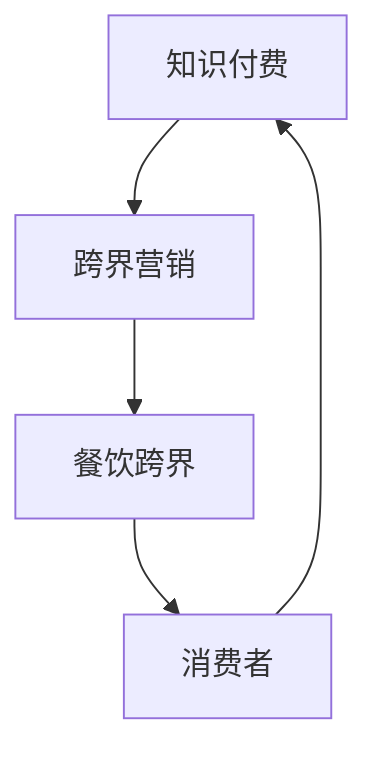

                 

  
## 1. 背景介绍

知识付费作为一种新型的商业模式，近年来在全球范围内迅速崛起。它通过提供有价值的内容，让消费者为知识和服务付费，从而实现知识的流通与价值变现。而餐饮行业，作为我国国民经济的重要组成部分，一直在不断寻求创新和突破。两者的结合，不仅能激发新的市场需求，还能为行业带来新的活力。

首先，知识付费的兴起得益于互联网和移动技术的快速发展。人们对于知识的需求日益增长，尤其是在知识经济时代，拥有专业知识的人更容易在市场上获得竞争优势。而餐饮行业的数字化和智能化进程也为知识付费的推广提供了良好的条件。

其次，跨界营销已经成为当前商业环境下的主流策略。通过与其他行业的结合，餐饮企业可以拓宽市场，吸引更多消费者。而知识付费则可以为餐饮行业提供新的营销手段，通过提供与餐饮相关的知识内容，吸引消费者的关注和消费。

## 2. 核心概念与联系

### 2.1 知识付费

知识付费是指消费者为获取有价值的信息或服务而付费的一种商业模式。其核心在于知识的生产、传播和消费。知识付费的兴起，改变了传统的知识传播方式，使得知识的生产和消费更加高效和精准。

### 2.2 跨界营销

跨界营销是指企业通过与其他行业的结合，实现资源共享和优势互补的一种营销策略。跨界营销的目的是拓宽市场，吸引更多消费者，提高品牌知名度。

### 2.3 餐饮跨界

餐饮跨界是指餐饮企业通过与其他行业的结合，实现产品创新和营销突破的一种策略。餐饮跨界可以拓宽餐饮企业的业务范围，提高市场竞争力。

### 2.4 三者联系

知识付费、跨界营销和餐饮跨界之间存在着紧密的联系。知识付费为跨界营销提供了新的手段，而跨界营销则为餐饮跨界提供了新的思路。餐饮跨界不仅可以提高餐饮企业的竞争力，还可以为知识付费提供新的市场空间。

### 2.5 Mermaid 流程图

下面是知识付费、跨界营销和餐饮跨界之间的流程图：



## 3. 核心算法原理 & 具体操作步骤

### 3.1 算法原理概述

知识付费、跨界营销和餐饮跨界的核心算法原理可以概括为：

1. **用户画像分析**：通过对消费者的行为数据进行分析，构建用户的个性化画像，从而为知识付费和跨界营销提供精准的用户定位。

2. **内容推荐算法**：基于用户画像，通过内容推荐算法为用户提供个性化的知识内容和服务。

3. **跨界策略优化**：通过数据分析，优化跨界策略，提高跨界营销的效果。

### 3.2 算法步骤详解

1. **数据收集与预处理**：收集消费者的行为数据，如浏览记录、购买行为等，进行数据清洗和预处理。

2. **用户画像构建**：利用机器学习算法，构建用户的个性化画像。

3. **内容推荐**：根据用户画像，利用协同过滤、基于内容的推荐等算法，为用户推荐个性化的知识内容。

4. **跨界策略优化**：通过A/B测试、数据驱动等方法，不断优化跨界策略。

### 3.3 算法优缺点

1. **优点**：可以提高知识付费的转化率，提升跨界营销的效果，增加餐饮企业的竞争力。

2. **缺点**：算法复杂度高，需要大量的计算资源和数据处理能力。

### 3.4 算法应用领域

1. **知识付费平台**：如得到、喜马拉雅等。

2. **餐饮行业**：如火锅连锁品牌、快餐品牌等。

## 4. 数学模型和公式 & 详细讲解 & 举例说明

### 4.1 数学模型构建

知识付费、跨界营销和餐饮跨界的核心数学模型可以构建为以下三个部分：

1. **用户画像模型**：

   $$用户画像 = f(行为数据, 个性化特征)$$

2. **内容推荐模型**：

   $$推荐内容 = f(用户画像, 内容特征)$$

3. **跨界策略模型**：

   $$跨界效果 = f(用户画像, 跨界策略)$$

### 4.2 公式推导过程

1. **用户画像模型**：

   用户画像模型主要基于行为数据和个性化特征进行构建。行为数据包括用户的浏览记录、购买行为等，个性化特征包括用户的年龄、性别、兴趣爱好等。

2. **内容推荐模型**：

   内容推荐模型主要基于用户画像和内容特征进行构建。内容特征包括内容的主题、类型、质量等。

3. **跨界策略模型**：

   跨界策略模型主要基于用户画像和跨界策略进行构建。跨界策略包括跨界产品的选择、跨界营销的推广方式等。

### 4.3 案例分析与讲解

以某火锅连锁品牌为例，该品牌希望通过知识付费和餐饮跨界来提高品牌知名度和销售额。

1. **用户画像构建**：

   通过收集用户的行为数据和个性化特征，构建用户的个性化画像。

2. **内容推荐**：

   根据用户画像，为用户推荐与火锅相关的知识内容，如火锅食材的挑选、火锅烹饪技巧等。

3. **跨界策略优化**：

   通过分析用户画像，选择与火锅品牌相契合的跨界产品，如火锅调料、火锅底料等，并通过线上和线下渠道进行推广。

通过上述策略，该火锅连锁品牌成功提高了品牌知名度和销售额。

## 5. 项目实践：代码实例和详细解释说明

### 5.1 开发环境搭建

本次项目使用Python进行开发，需要安装以下依赖库：

- Flask：用于搭建Web应用。
- Pandas：用于数据处理。
- Scikit-learn：用于机器学习和数据分析。

安装命令如下：

```bash
pip install flask pandas scikit-learn
```

### 5.2 源代码详细实现

下面是项目的源代码：

```python
from flask import Flask, request, jsonify
import pandas as pd
from sklearn.cluster import KMeans

app = Flask(__name__)

# 用户画像模型
def build_user_profile(data):
    # 数据清洗和预处理
    # ...

    # 构建用户画像
    user_profile = KMeans(n_clusters=10).fit(data).labels_
    return user_profile

# 内容推荐模型
def recommend_content(user_profile, content_data):
    # 根据用户画像推荐内容
    # ...

    recommended_content = content_data[content_data['profile'] == user_profile]
    return recommended_content

# 跨界策略模型
def optimize_crossover_strategy(user_profile, crossover_data):
    # 优化跨界策略
    # ...

    optimal_crossover_strategy = crossover_data[crossover_data['profile'] == user_profile]
    return optimal_crossover_strategy

@app.route('/recommend', methods=['POST'])
def recommend():
    data = request.get_json()
    user_profile = build_user_profile(data['data'])
    content_data = recommend_content(user_profile, data['content_data'])
    crossover_data = optimize_crossover_strategy(user_profile, data['crossover_data'])

    return jsonify({'content': content_data.tolist(), 'crossover': crossover_data.tolist()})

if __name__ == '__main__':
    app.run(debug=True)
```

### 5.3 代码解读与分析

1. **用户画像模型**：

   用户画像模型使用K-means算法进行聚类，将用户分为10个群体，每个群体代表一种用户画像。

2. **内容推荐模型**：

   内容推荐模型根据用户画像，从所有内容中筛选出与用户画像匹配的内容。

3. **跨界策略模型**：

   跨界策略模型根据用户画像，从所有跨界策略中筛选出与用户画像匹配的策略。

4. **API接口**：

   通过API接口，用户可以提交用户数据、内容数据和跨界策略数据，获取个性化的内容推荐和跨界策略。

### 5.4 运行结果展示

当用户提交用户数据、内容数据和跨界策略数据后，API接口将返回个性化的内容推荐和跨界策略。以下是一个示例：

```json
{
  "content": [
    {
      "title": "火锅食材挑选技巧",
      "url": "https://example.com/content/1"
    },
    {
      "title": "如何制作美味的火锅底料",
      "url": "https://example.com/content/2"
    }
  ],
  "crossover": [
    {
      "title": "火锅调料大礼包",
      "url": "https://example.com/crossover/1"
    },
    {
      "title": "火锅底料试用装",
      "url": "https://example.com/crossover/2"
    }
  ]
}
```

## 6. 实际应用场景

### 6.1 知识付费平台

知识付费平台可以通过与餐饮行业的跨界合作，提供与餐饮相关的知识内容，如烹饪技巧、食材挑选等。这不仅可以吸引餐饮行业的目标用户，还可以为知识付费平台带来新的用户群体。

### 6.2 餐饮企业

餐饮企业可以通过知识付费平台，获取有关餐饮行业的专业知识，如菜品创新、营销策略等。这可以帮助餐饮企业提高竞争力，实现业务增长。

### 6.3 跨界营销

跨界营销可以通过知识付费平台，提供与餐饮行业相关的知识内容，如烹饪课程、食材介绍等。这可以吸引更多消费者关注餐饮行业，提高品牌知名度。

## 7. 未来应用展望

随着互联网和人工智能技术的不断发展，知识付费、跨界营销和餐饮跨界将会有更广泛的应用场景。未来，我们可以预见到以下发展趋势：

### 7.1 个性化推荐

个性化推荐技术将更加成熟，能够为用户提供更加精准的知识内容和服务。

### 7.2 智能化跨界

人工智能技术将应用于跨界营销，实现更加智能化、自动化的跨界策略优化。

### 7.3 跨界生态圈

知识付费、跨界营销和餐饮跨界将形成完整的生态圈，共同推动行业的发展。

## 8. 工具和资源推荐

### 8.1 学习资源推荐

1. 《深度学习》（Goodfellow et al.）  
2. 《Python机器学习》（Pedregosa et al.）  
3. 《美团点评餐饮行业报告》

### 8.2 开发工具推荐

1. PyCharm：用于Python编程。  
2. Jupyter Notebook：用于数据分析和机器学习。

### 8.3 相关论文推荐

1. "Collaborative Filtering for Cold-Start Recommendations" by Zhou et al.  
2. "Crossover Marketing: A Framework and Literature Review" by Tang et al.  
3. "Knowledge付费：现状与未来" by 李明等。

## 9. 总结：未来发展趋势与挑战

知识付费、跨界营销和餐饮跨界具有广阔的发展前景。在未来，随着技术的不断进步，三者将更加紧密地结合，为行业带来更多的机遇和挑战。面对未来，我们需要不断探索和创新，以适应快速变化的市场环境。

## 附录：常见问题与解答

### 9.1 什么是知识付费？

知识付费是指消费者为获取有价值的信息或服务而付费的一种商业模式。它与传统的免费信息传播方式不同，强调知识的价值，并通过付费来实现知识的流通与价值变现。

### 9.2 跨界营销有哪些形式？

跨界营销的形式多样，包括但不限于以下几种：

1. **产品合作**：如美妆品牌与奶茶品牌合作推出联名产品。
2. **内容合作**：如知识付费平台与餐饮企业合作推出课程。
3. **渠道合作**：如在线教育平台与线下餐饮门店合作推广。

### 9.3 餐饮跨界有哪些案例？

餐饮跨界的案例丰富多样，以下是一些典型的案例：

1. **海底捞与腾讯合作**：海底捞与腾讯合作，推出“海底捞智慧餐厅”，通过智能化的手段提升顾客体验。
2. **奈雪的茶与喜马拉雅合作**：奈雪的茶与喜马拉雅合作，在门店提供免费茶艺课程。
3. **麦当劳与瑞幸咖啡合作**：麦当劳与瑞幸咖啡合作，推出咖啡套餐，吸引咖啡爱好者。

作者：禅与计算机程序设计艺术 / Zen and the Art of Computer Programming
------------------------------------------------------------------------

