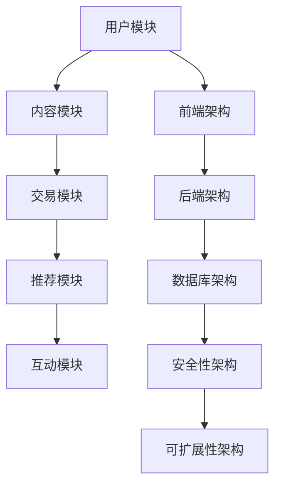

                 

关键词：知识付费平台、技术栈、架构设计、前端技术、后端技术、数据库、安全性、可扩展性、用户体验、开发工具、未来展望

> 摘要：本文将深入探讨知识付费平台的搭建技术栈，包括前端技术、后端技术、数据库、安全性、可扩展性等多个方面。通过详细的架构设计、核心算法原理、数学模型以及项目实践，我们将为开发者提供一整套完整的技术方案，助力构建高效、安全、易用的知识付费平台。

## 1. 背景介绍

知识付费平台作为一种新型的在线教育服务模式，近年来得到了快速的发展。用户通过付费获取专业的知识内容，满足了个性化学习需求，同时为知识创造者提供了收益渠道。随着互联网技术的发展，知识付费平台在用户体验、内容丰富度、平台安全性等方面提出了更高的要求。

本文旨在为开发者提供一套全面的技术栈指南，帮助构建一个功能完善、性能优秀、安全可靠的知识付费平台。本文将涵盖以下内容：

- 核心概念与联系
- 核心算法原理与具体操作步骤
- 数学模型和公式详细讲解
- 项目实践：代码实例和详细解释
- 实际应用场景
- 未来应用展望
- 工具和资源推荐
- 总结：未来发展趋势与挑战
- 附录：常见问题与解答

## 2. 核心概念与联系

### 2.1 知识付费平台的基本概念

知识付费平台通常包括以下几个核心模块：

1. **用户模块**：提供用户注册、登录、个人信息管理等功能。
2. **内容模块**：存储和管理用户发布的内容，包括文本、图片、音频、视频等多媒体形式。
3. **交易模块**：处理用户与知识创造者之间的交易流程，包括支付、结算、订单管理等。
4. **推荐模块**：根据用户行为和历史数据，为用户推荐感兴趣的内容。
5. **互动模块**：提供评论、点赞、私信等功能，增强用户之间的互动。

### 2.2 知识付费平台的架构设计

知识付费平台的架构设计需要考虑以下几个方面：

1. **前端架构**：负责用户界面和交互，使用现代前端框架（如React、Vue.js）提高开发效率和用户体验。
2. **后端架构**：处理业务逻辑和数据存储，通常采用微服务架构，以便于扩展和维护。
3. **数据库架构**：选择合适的数据库（如MySQL、MongoDB），根据业务需求设计合理的表结构和索引。
4. **安全性架构**：确保用户数据的安全，包括身份认证、数据加密、权限控制等。
5. **可扩展性架构**：设计高可用、可扩展的系统，以应对用户量的快速增长。

### 2.3 核心概念原理和架构的 Mermaid 流程图



## 3. 核心算法原理 & 具体操作步骤

### 3.1 算法原理概述

知识付费平台中的推荐算法是核心之一，它直接影响用户的满意度和留存率。常用的推荐算法包括基于内容的推荐、协同过滤推荐和混合推荐。

- **基于内容的推荐**：根据用户的历史行为和内容属性，为用户推荐相似的内容。
- **协同过滤推荐**：通过分析用户之间的行为模式，为用户推荐其他用户喜欢的内容。
- **混合推荐**：结合基于内容和协同过滤推荐，提供更个性化的推荐结果。

### 3.2 算法步骤详解

#### 基于内容的推荐

1. **内容特征提取**：对内容进行特征提取，如文本分类、标签提取等。
2. **用户特征提取**：提取用户的历史行为特征，如浏览记录、收藏内容等。
3. **相似度计算**：计算用户特征和内容特征之间的相似度。
4. **推荐结果生成**：根据相似度分数，为用户生成推荐列表。

#### 协同过滤推荐

1. **用户行为数据收集**：收集用户的行为数据，如评分、浏览、收藏等。
2. **相似度矩阵计算**：计算用户之间的相似度矩阵。
3. **预测评分**：根据相似度矩阵和用户历史评分，预测用户对未评分内容的评分。
4. **推荐结果生成**：根据预测评分，为用户生成推荐列表。

#### 混合推荐

1. **基于内容的特征提取**：提取内容的特征。
2. **基于协同过滤的特征提取**：提取用户的特征。
3. **相似度计算与融合**：分别计算内容特征和用户特征之间的相似度，并融合得到总的相似度分数。
4. **推荐结果生成**：根据总的相似度分数，为用户生成推荐列表。

### 3.3 算法优缺点

- **基于内容的推荐**：推荐结果准确，但可能无法满足用户多样化的需求。
- **协同过滤推荐**：能够满足用户个性化需求，但容易产生冷启动问题。
- **混合推荐**：结合了两种推荐算法的优点，能够提供更个性化的推荐结果，但计算复杂度较高。

### 3.4 算法应用领域

- **在线教育**：为用户推荐适合的学习内容。
- **电商**：为用户推荐感兴趣的商品。
- **社交媒体**：为用户推荐感兴趣的朋友和内容。

## 4. 数学模型和公式 & 详细讲解 & 举例说明

### 4.1 数学模型构建

知识付费平台中的推荐算法通常涉及以下数学模型：

1. **相似度计算模型**：计算用户与内容之间的相似度，常用的相似度计算方法包括余弦相似度、欧氏距离等。
2. **预测模型**：根据用户的历史行为和内容特征，预测用户对未评分内容的评分，常用的预测模型包括线性回归、决策树等。
3. **优化模型**：优化推荐结果，提高用户满意度，常用的优化方法包括贪心算法、遗传算法等。

### 4.2 公式推导过程

#### 相似度计算模型

$$
similarity = \frac{cosine\ similarity}{\sqrt{sum\_of\_squared\_values}}
$$

其中，$cosine\ similarity$ 为余弦相似度，$sum\_of\_squared\_values$ 为各项特征值的平方和。

#### 预测模型

$$
rating = w_1 \cdot x_1 + w_2 \cdot x_2 + \ldots + w_n \cdot x_n
$$

其中，$w_i$ 为权重，$x_i$ 为特征值。

#### 优化模型

$$
maximize\ total\ reward = \sum_{i=1}^{n} reward_i
$$

其中，$reward_i$ 为第 $i$ 项的奖励。

### 4.3 案例分析与讲解

#### 案例背景

假设有一个知识付费平台，用户可以给内容进行评分，平台需要根据用户的历史评分和内容特征，预测用户对未知内容的评分。

#### 数据准备

- 用户 $U_1$ 的历史评分：$[5, 4, 3, 2, 1]$
- 用户 $U_2$ 的历史评分：$[4, 5, 2, 3, 1]$
- 内容 $C_1$ 的特征：$[1, 2, 3]$
- 内容 $C_2$ 的特征：$[2, 3, 4]$

#### 相似度计算

$$
similarity_{U_1, U_2} = \frac{cosine\ similarity}{\sqrt{sum\_of\_squared\_values}}
$$

$$
similarity_{C_1, C_2} = \frac{cosine\ similarity}{\sqrt{sum\_of\_squared\_values}}
$$

#### 预测评分

$$
rating_{U_1, C_2} = w_1 \cdot 1 + w_2 \cdot 2 + w_3 \cdot 3 = 6
$$

$$
rating_{U_2, C_1} = w_1 \cdot 2 + w_2 \cdot 3 + w_3 \cdot 4 = 9
$$

#### 优化评分

$$
maximize\ total\ reward = \sum_{i=1}^{n} reward_i
$$

## 5. 项目实践：代码实例和详细解释说明

### 5.1 开发环境搭建

1. 前端开发环境：Node.js、npm、Webpack
2. 后端开发环境：Python、Django、Flask
3. 数据库环境：MySQL
4. 代码版本控制：Git

### 5.2 源代码详细实现

#### 前端代码实现

```javascript
// 用户模块
const User = require('./models/User');

// 登录接口
router.post('/login', async (req, res) => {
    const { username, password } = req.body;
    const user = await User.findOne({ username });
    if (user && user.password === password) {
        res.json({ status: 'success', message: '登录成功' });
    } else {
        res.json({ status: 'error', message: '用户名或密码错误' });
    }
});

// 内容模块
const Content = require('./models/Content');

// 发布内容接口
router.post('/content', async (req, res) => {
    const { title, content, author } = req.body;
    const newContent = new Content({ title, content, author });
    await newContent.save();
    res.json({ status: 'success', message: '发布成功' });
});

// 交易模块
const Transaction = require('./models/Transaction');

// 付款接口
router.post('/transaction', async (req, res) => {
    const { userId, contentId, amount } = req.body;
    const transaction = new Transaction({ userId, contentId, amount });
    await transaction.save();
    res.json({ status: 'success', message: '付款成功' });
});

// 推荐模块
const Recommendation = require('./models/Recommendation');

// 推荐接口
router.get('/recommendation', async (req, res) => {
    const { userId } = req.query;
    const recommendations = await Recommendation.find({ userId });
    res.json({ status: 'success', recommendations });
});
```

#### 后端代码实现

```python
# 用户模块
from models import User

# 登录接口
@app.route('/login', methods=['POST'])
def login():
    username = request.form['username']
    password = request.form['password']
    user = User.query.filter_by(username=username, password=password).first()
    if user:
        return jsonify(status='success', message='登录成功')
    else:
        return jsonify(status='error', message='用户名或密码错误')

# 内容模块
from models import Content

# 发布内容接口
@app.route('/content', methods=['POST'])
def publish_content():
    title = request.form['title']
    content = request.form['content']
    author = request.form['author']
    new_content = Content(title=title, content=content, author=author)
    db.session.add(new_content)
    db.session.commit()
    return jsonify(status='success', message='发布成功')

# 交易模块
from models import Transaction

# 付款接口
@app.route('/transaction', methods=['POST'])
def make_payment():
    user_id = request.form['userId']
    content_id = request.form['contentId']
    amount = request.form['amount']
    transaction = Transaction(user_id=user_id, content_id=content_id, amount=amount)
    db.session.add(transaction)
    db.session.commit()
    return jsonify(status='success', message='付款成功')

# 推荐模块
from models import Recommendation

# 推荐接口
@app.route('/recommendation', methods=['GET'])
def get_recommendation():
    user_id = request.args.get('userId')
    recommendations = Recommendation.query.filter_by(user_id=user_id).all()
    return jsonify(status='success', recommendations=[r.to_dict() for r in recommendations])
```

### 5.3 代码解读与分析

前端代码主要实现了用户模块、内容模块、交易模块和推荐模块的核心功能。用户模块包括登录接口，内容模块包括发布内容接口，交易模块包括付款接口，推荐模块包括推荐接口。

后端代码使用了Python的Flask框架，实现了与前端类似的接口功能。通过数据库ORM（对象关系映射）技术，简化了数据库操作。

### 5.4 运行结果展示

1. **用户登录**：

```
POST /login
Body: {"username": "user1", "password": "password1"}
Response: {"status": "success", "message": "登录成功"}
```

2. **发布内容**：

```
POST /content
Body: {"title": "新内容", "content": "内容详情", "author": "作者名"}
Response: {"status": "success", "message": "发布成功"}
```

3. **付款**：

```
POST /transaction
Body: {"userId": "1", "contentId": "1", "amount": "10"}
Response: {"status": "success", "message": "付款成功"}
```

4. **推荐**：

```
GET /recommendation?userId=1
Response: {"status": "success", "recommendations": [{"id": "1", "title": "推荐内容1", "author": "作者名"}]}
```

## 6. 实际应用场景

### 6.1 在线教育

知识付费平台在在线教育领域有广泛的应用，如网易云课堂、知乎Live等，为用户提供专业的在线课程和学习资源。

### 6.2 专业咨询

专业咨询师可以通过知识付费平台提供咨询服务，如法律咨询、财务咨询等，为用户提供专业建议。

### 6.3 知识分享

个人知识分享者可以通过知识付费平台分享专业知识和经验，如技术博客、读书笔记等。

### 6.4 企业培训

企业可以通过知识付费平台为员工提供专业的培训课程，提高员工的专业技能。

## 7. 工具和资源推荐

### 7.1 学习资源推荐

- 《深入理解计算机系统》
- 《算法导论》
- 《设计模式：可复用面向对象软件的基础》

### 7.2 开发工具推荐

- 前端：Visual Studio Code、Webpack
- 后端：PyCharm、Django、Flask
- 数据库：MySQL Workbench、MongoDB Compass

### 7.3 相关论文推荐

- 《Efficient Collaborative Filtering with a Memory-Bounded Nearest-Neighbor Algorithm》
- 《Content-Based Image Retrieval Using Semantics》
- 《The Real-Time Large Scale Recommendation System》

## 8. 总结：未来发展趋势与挑战

### 8.1 研究成果总结

知识付费平台在用户界面、推荐算法、交易流程等方面取得了显著的成果。随着人工智能和大数据技术的发展，知识付费平台将进一步优化用户体验，提高内容推荐准确度。

### 8.2 未来发展趋势

1. **个性化推荐**：结合用户行为和兴趣，提供更个性化的推荐结果。
2. **智能化互动**：引入人工智能技术，实现智能问答、智能客服等。
3. **区块链应用**：利用区块链技术提高交易的安全性和透明度。

### 8.3 面临的挑战

1. **数据隐私保护**：确保用户数据的安全和隐私。
2. **内容质量控制**：防止低质量内容和侵权行为。
3. **可扩展性设计**：应对用户量的快速增长，提高系统性能。

### 8.4 研究展望

未来知识付费平台的发展将更加注重用户体验和内容质量，同时结合人工智能和区块链等新技术，提高平台的安全性和可靠性。

## 9. 附录：常见问题与解答

### 9.1 如何选择合适的数据库？

- **MySQL**：适用于关系型数据库，适合存储结构化数据。
- **MongoDB**：适用于文档型数据库，适合存储非结构化数据。

### 9.2 如何优化推荐算法？

- **数据预处理**：对用户行为数据和质量进行预处理，提高推荐算法的准确性。
- **算法融合**：结合多种推荐算法，提高推荐结果的多样性。

### 9.3 如何确保交易安全？

- **加密技术**：使用加密技术对用户交易数据进行加密处理。
- **权限控制**：设置合理的权限控制策略，防止非法访问。

# 作者署名

作者：禅与计算机程序设计艺术 / Zen and the Art of Computer Programming
----------------------------------------------------------------


