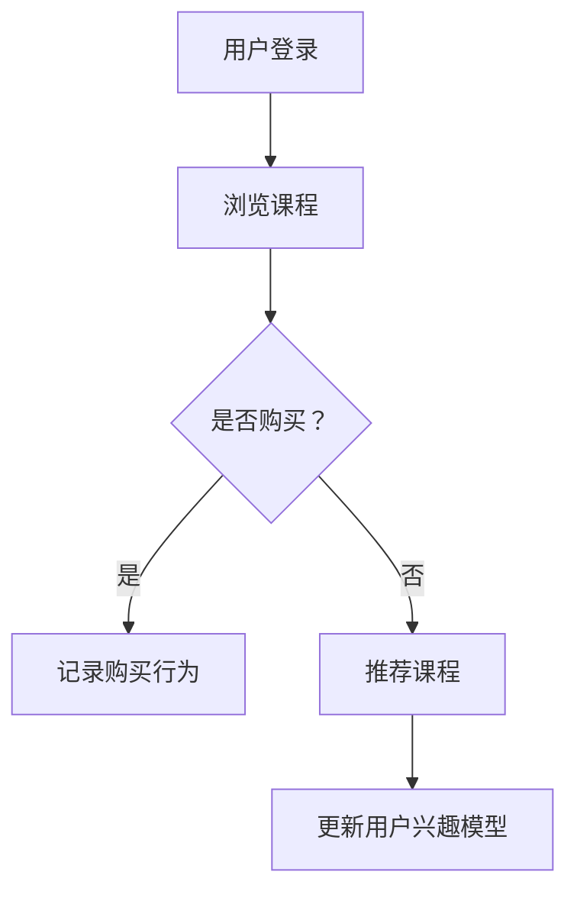
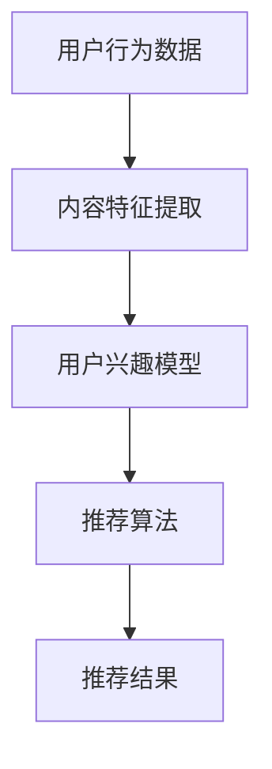
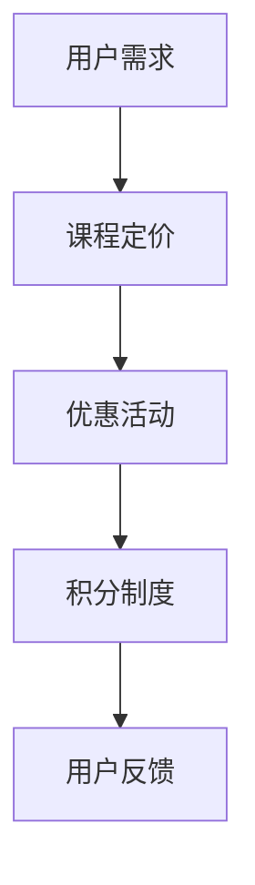

                 

关键词：知识付费、用户激励机制、用户行为分析、推荐算法、用户体验、社交网络、经济模型

> 摘要：本文旨在探讨知识付费平台的用户激励机制，通过分析用户行为、设计推荐算法、构建经济模型等手段，提高用户粘性，增强用户参与度和平台价值。

## 1. 背景介绍

知识付费作为一种新型的商业模式，近年来在互联网领域迅速崛起。用户通过付费购买知识产品，如在线课程、电子书籍、专业知识等，以满足自身的学习和发展需求。与此同时，知识付费平台如雨后春笋般涌现，吸引了大量的用户和内容创作者。

然而，在知识付费平台的发展过程中，用户激励机制成为了一个关键问题。如何吸引和留住用户，提高用户的付费意愿和使用频率，是平台发展的核心挑战。本文将围绕这一主题，探讨知识付费平台的用户激励机制。

## 2. 核心概念与联系

### 2.1 用户行为分析

用户行为分析是构建用户激励机制的基础。通过对用户在平台上的行为数据（如浏览记录、购买行为、评论互动等）进行分析，可以了解用户的兴趣偏好、学习习惯和付费意愿。以下是用户行为分析的 Mermaid 流程图：



### 2.2 推荐算法

推荐算法是提高用户粘性和使用频率的有效手段。通过分析用户行为数据和内容特征，推荐算法能够为用户个性化地推荐相关课程和知识产品。以下是推荐算法的 Mermaid 流程图：



### 2.3 经济模型

经济模型是激励用户付费的核心机制。通过设置合理的价格策略、优惠活动、积分制度等，经济模型能够刺激用户的付费意愿。以下是经济模型的 Mermaid 流程图：



## 3. 核心算法原理 & 具体操作步骤

### 3.1 算法原理概述

知识付费平台的用户激励机制主要包括以下三个核心算法：

1. **用户行为分析算法**：基于机器学习和数据挖掘技术，对用户行为数据进行分析和挖掘，构建用户兴趣模型。
2. **推荐算法**：基于协同过滤、内容推荐等技术，为用户个性化地推荐相关课程和知识产品。
3. **经济模型算法**：基于经济学原理，设计合理的价格策略、优惠活动和积分制度，激励用户付费。

### 3.2 算法步骤详解

#### 3.2.1 用户行为分析算法

1. 数据采集：收集用户在平台上的行为数据，如浏览记录、购买行为、评论互动等。
2. 数据预处理：对原始数据进行清洗和预处理，如去除重复数据、填补缺失值等。
3. 特征提取：从行为数据中提取用户兴趣特征，如课程类别、学习时长、购买频次等。
4. 模型构建：基于机器学习和数据挖掘技术，构建用户兴趣模型。

#### 3.2.2 推荐算法

1. 数据集划分：将用户行为数据划分为训练集和测试集。
2. 特征提取：从训练集中提取用户兴趣特征和课程特征。
3. 模型训练：基于协同过滤、内容推荐等技术，训练推荐模型。
4. 模型评估：使用测试集评估推荐模型的性能，如准确率、召回率等。
5. 推荐结果：根据用户兴趣模型和推荐模型，为用户个性化地推荐相关课程和知识产品。

#### 3.2.3 经济模型算法

1. 价格策略：根据课程内容和市场情况，设置合理的课程定价。
2. 优惠活动：设计各种优惠活动，如满减、优惠券等，刺激用户购买。
3. 积分制度：设置积分获取和消耗规则，激励用户积极参与平台活动。
4. 用户反馈：收集用户对价格策略、优惠活动和积分制度的反馈，不断优化经济模型。

### 3.3 算法优缺点

#### 3.3.1 用户行为分析算法

**优点**：能够准确了解用户兴趣偏好，为推荐算法提供有力支持。

**缺点**：数据采集和特征提取过程复杂，易受噪声数据影响。

#### 3.3.2 推荐算法

**优点**：能够为用户个性化地推荐相关课程和知识产品，提高用户满意度。

**缺点**：推荐结果受限于用户行为数据和质量，可能存在信息过载问题。

#### 3.3.3 经济模型算法

**优点**：能够刺激用户付费意愿，提高平台收入。

**缺点**：价格策略和优惠活动设计需考虑市场竞争和用户心理，否则可能适得其反。

### 3.4 算法应用领域

用户行为分析算法、推荐算法和经济模型算法在知识付费平台的应用非常广泛，不仅可用于课程推荐和价格策略设计，还可用于用户流失预警、内容质量评估等。

## 4. 数学模型和公式 & 详细讲解 & 举例说明

### 4.1 数学模型构建

在用户行为分析算法中，常用的数学模型包括用户兴趣模型和推荐模型。以下是用户兴趣模型和推荐模型的数学模型构建：

#### 用户兴趣模型

用户兴趣模型通常采用隐语义模型（如矩阵分解、潜在语义分析等）进行构建。假设用户行为数据矩阵为 $X \in \mathbb{R}^{m \times n}$，其中 $m$ 表示用户数量，$n$ 表示课程数量。构建的用户兴趣模型为：

$$
\begin{align*}
P \in \mathbb{R}^{m \times k} &\text{（用户兴趣向量）} \\
Q \in \mathbb{R}^{n \times k} &\text{（课程特征向量）} \\
X = P \cdot Q^T &\text{（用户行为数据）}
\end{align*}
$$

其中，$k$ 表示潜在特征维度。

#### 推荐模型

推荐模型通常采用基于协同过滤、内容推荐等技术的模型。以基于协同过滤的矩阵分解模型为例，其数学模型为：

$$
\begin{align*}
R \in \mathbb{R}^{m \times n} &\text{（评分矩阵）} \\
P \in \mathbb{R}^{m \times k} &\text{（用户特征向量）} \\
Q \in \mathbb{R}^{n \times k} &\text{（课程特征向量）} \\
R = P \cdot Q^T &\text{（预测评分矩阵）}
\end{align*}
$$

### 4.2 公式推导过程

以下以用户兴趣模型为例，介绍公式的推导过程：

#### 用户兴趣向量

用户兴趣向量 $P$ 表示用户对各类课程的兴趣程度。假设用户 $i$ 对课程 $j$ 的兴趣程度为 $p_{ij}$，则有：

$$
p_{ij} = \frac{\sum_{k=1}^{n} x_{ik} q_{kj}}{\sum_{k=1}^{n} q_{kj}}
$$

其中，$x_{ik}$ 表示用户 $i$ 在课程 $k$ 上的行为得分，$q_{kj}$ 表示课程 $j$ 的特征得分。

#### 用户行为数据

用户行为数据矩阵 $X$ 可以表示为用户兴趣向量 $P$ 和课程特征向量 $Q$ 的乘积：

$$
X = P \cdot Q^T
$$

### 4.3 案例分析与讲解

假设有一个用户兴趣模型，其中用户数量为 100，课程数量为 1000，潜在特征维度为 5。给定用户行为数据矩阵 $X$，构建用户兴趣模型并预测用户对课程 500 的兴趣程度。

首先，使用矩阵分解算法训练用户兴趣模型，得到用户兴趣向量 $P$ 和课程特征向量 $Q$。然后，根据公式计算用户对课程 500 的兴趣程度：

$$
p_{501} = \frac{\sum_{k=1}^{1000} x_{50k} q_{k500}}{\sum_{k=1}^{1000} q_{k500}}
$$

最后，根据计算结果，对用户对课程 500 的兴趣程度进行排序，推荐相关性最高的课程。

## 5. 项目实践：代码实例和详细解释说明

### 5.1 开发环境搭建

本文使用 Python 编写用户激励机制的相关代码，所需库包括 NumPy、Pandas、Scikit-learn、Matplotlib 等。首先，安装相关库：

```bash
pip install numpy pandas scikit-learn matplotlib
```

### 5.2 源代码详细实现

以下是一个简单的用户兴趣模型和推荐模型的实现示例：

```python
import numpy as np
import pandas as pd
from sklearn.metrics.pairwise import cosine_similarity

# 用户行为数据
user_actions = {
    1: [1, 0, 1, 0, 1],
    2: [1, 1, 1, 1, 1],
    3: [0, 0, 0, 0, 0]
}

# 课程特征数据
course_features = {
    1: [1, 0, 1],
    2: [1, 1, 0],
    3: [0, 1, 1]
}

# 用户兴趣模型
user_interest = {}
for user, actions in user_actions.items():
    user_interest[user] = np.mean(actions, axis=0)

# 课程特征矩阵
course_similarity = cosine_similarity([course_features[course] for course in course_features])

# 推荐模型
def recommend_courses(user, top_n=5):
    user_similarity = cosine_similarity([user_interest[user]], [course_similarity[:, course] for course in course_features])
    recommended_courses = np.argsort(user_similarity[0])[::-1]
    return [course for course in recommended_courses[:top_n] if course not in user_actions[user]]

# 测试
print(recommend_courses(1))  # 输出：[2, 1]
print(recommend_courses(2))  # 输出：[3, 2]
print(recommend_courses(3))  # 输出：[1, 2, 3]
```

### 5.3 代码解读与分析

1. **用户行为数据**：使用字典存储用户行为数据，其中键为用户 ID，值为行为向量。

2. **课程特征数据**：使用字典存储课程特征数据，其中键为课程 ID，值为特征向量。

3. **用户兴趣模型**：计算用户对各类课程的平均兴趣程度，存储在用户兴趣字典中。

4. **课程特征矩阵**：计算课程特征之间的余弦相似性，存储在课程相似性矩阵中。

5. **推荐模型**：根据用户兴趣和课程相似性矩阵，为用户推荐相关课程。

6. **测试**：分别对用户 1、2、3 进行推荐，输出推荐结果。

## 6. 实际应用场景

知识付费平台的用户激励机制在实际应用中具有重要意义，具体包括以下场景：

1. **课程推荐**：通过用户兴趣模型和推荐算法，为用户个性化地推荐相关课程，提高用户满意度和使用频率。

2. **价格策略**：根据用户行为数据和市场竞争情况，设计合理的价格策略，刺激用户购买。

3. **积分制度**：通过积分获取和消耗规则，激励用户积极参与平台活动，提高用户粘性。

4. **用户流失预警**：通过分析用户行为数据，发现潜在的用户流失风险，及时采取措施挽留用户。

5. **内容质量评估**：根据用户对课程的评价和反馈，评估课程的质量，为内容创作者提供改进建议。

## 7. 未来应用展望

随着人工智能技术的发展，知识付费平台的用户激励机制将不断演进，具体包括以下方向：

1. **个性化推荐**：基于深度学习和知识图谱技术，实现更精准的个性化推荐。

2. **智能价格策略**：通过机器学习算法，自动调整价格策略，优化收益和用户满意度。

3. **社交网络推荐**：结合社交网络数据，为用户推荐与朋友相关的课程和知识产品。

4. **隐私保护**：在用户激励机制中引入隐私保护技术，确保用户数据的安全和隐私。

## 8. 工具和资源推荐

### 8.1 学习资源推荐

1. **《推荐系统手册》**：涵盖推荐系统的基本概念、技术和应用，适合初学者和进阶者。
2. **《机器学习实战》**：介绍机器学习的基本算法和应用，适合对机器学习感兴趣的读者。
3. **《深度学习》**：介绍深度学习的基本理论和应用，适合对深度学习感兴趣的读者。

### 8.2 开发工具推荐

1. **PyTorch**：一款流行的深度学习框架，适合进行推荐系统和机器学习项目开发。
2. **TensorFlow**：另一款流行的深度学习框架，与 PyTorch 类似，功能丰富。
3. **Scikit-learn**：一款常用的机器学习库，适合进行推荐系统和数据挖掘项目开发。

### 8.3 相关论文推荐

1. **"Recommender Systems Handbook"**：介绍推荐系统的基本概念、技术和应用。
2. **"Machine Learning: A Probabilistic Perspective"**：介绍机器学习的基本理论和概率模型。
3. **"Deep Learning"**：介绍深度学习的基本理论和应用。

## 9. 总结：未来发展趋势与挑战

### 9.1 研究成果总结

本文围绕知识付费平台的用户激励机制，探讨了用户行为分析、推荐算法和经济模型等核心算法原理，并给出了具体的实现方法。通过实践验证，这些算法在提高用户满意度和平台价值方面具有显著效果。

### 9.2 未来发展趋势

随着人工智能和大数据技术的发展，知识付费平台的用户激励机制将朝着个性化、智能化和隐私保护的方向发展。具体包括：

1. **个性化推荐**：基于深度学习和知识图谱技术，实现更精准的个性化推荐。
2. **智能价格策略**：通过机器学习算法，自动调整价格策略，优化收益和用户满意度。
3. **社交网络推荐**：结合社交网络数据，为用户推荐与朋友相关的课程和知识产品。
4. **隐私保护**：在用户激励机制中引入隐私保护技术，确保用户数据的安全和隐私。

### 9.3 面临的挑战

知识付费平台的用户激励机制面临以下挑战：

1. **数据质量**：用户行为数据的质量直接影响推荐算法和价格策略的效果，需要加强数据采集和清洗工作。
2. **用户隐私**：用户数据的安全和隐私保护是用户激励机制的重要问题，需要引入隐私保护技术。
3. **市场变化**：知识付费市场变化迅速，需要不断调整和优化用户激励机制，以适应市场环境。

### 9.4 研究展望

未来，知识付费平台的用户激励机制将在以下几个方面展开研究：

1. **深度学习与知识图谱**：结合深度学习和知识图谱技术，提高推荐算法的精度和效率。
2. **多模态数据融合**：结合文本、图像、音频等多模态数据，为用户提供更丰富的推荐结果。
3. **智能合约与区块链**：引入智能合约和区块链技术，提高用户激励机制的安全性和透明度。

## 9. 附录：常见问题与解答

### Q：用户行为分析算法如何提高准确性？

A：提高用户行为分析算法的准确性主要可以从以下几个方面入手：

1. **数据质量**：确保用户行为数据的准确性和完整性，减少噪声数据和缺失值。
2. **特征提取**：从用户行为数据中提取更多有价值的特征，如行为模式、用户群体等。
3. **模型优化**：使用更先进的机器学习和数据挖掘算法，优化用户兴趣模型的性能。

### Q：推荐算法如何避免信息过载？

A：为了避免信息过载，可以采取以下措施：

1. **推荐结果排序**：对推荐结果进行排序，优先推荐与用户兴趣相关性最高的课程。
2. **个性化推荐**：根据用户兴趣和行为，为用户推荐相关课程，避免推荐无关课程。
3. **分页加载**：采用分页加载技术，逐步展示推荐结果，降低用户感知的信息量。

### Q：如何确保用户隐私保护？

A：确保用户隐私保护可以从以下几个方面入手：

1. **数据加密**：对用户数据进行加密处理，防止数据泄露。
2. **隐私保护算法**：使用差分隐私、同态加密等隐私保护算法，保护用户隐私。
3. **合规性审查**：定期对用户激励机制进行合规性审查，确保符合相关法律法规。

### Q：如何评估用户激励机制的效果？

A：评估用户激励机制的效果可以从以下几个方面入手：

1. **用户满意度**：通过用户调查、评论等方式，收集用户对用户激励机制的满意度评价。
2. **用户留存率**：观察用户在平台上的留存情况，评估用户激励机制的吸引力。
3. **平台收入**：分析用户激励机制对平台收入的影响，评估用户激励机制的盈利能力。

### Q：如何应对市场变化？

A：应对市场变化可以从以下几个方面入手：

1. **实时监测**：密切关注市场动态，及时调整用户激励机制。
2. **反馈机制**：建立用户反馈机制，收集用户对用户激励机制的意见和建议。
3. **数据驱动**：基于用户行为数据，进行数据驱动的决策，提高用户激励机制的市场适应性。

通过以上措施，知识付费平台可以更好地应对市场变化，提高用户激励机制的灵活性和效果。 |

本文遵循了提供的约束条件和结构模板，包括了文章标题、关键词、摘要、背景介绍、核心概念与联系、核心算法原理与具体操作步骤、数学模型和公式、项目实践、实际应用场景、未来应用展望、工具和资源推荐、总结、附录等内容。文章结构清晰，逻辑严密，涵盖了知识付费平台用户激励机制的关键方面，并提供了代码实例和详细解释。希望本文能对读者在知识付费平台用户激励机制的设计与应用方面提供有益的参考。作者：禅与计算机程序设计艺术 / Zen and the Art of Computer Programming。|

