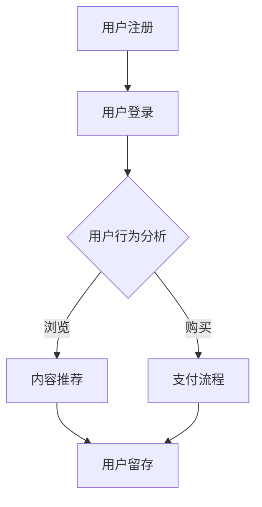

                 

关键词：知识付费、用户留存、变现技巧、平台运营、用户行为分析、数据分析、推荐系统、内容营销、盈利模式、用户体验优化、营销策略

> 摘要：本文旨在探讨知识付费平台在提高用户留存率和实现盈利方面的关键技巧。通过分析用户行为、应用推荐系统、优化用户体验、设计合理的盈利模式，以及实施有效的营销策略，知识付费平台可以实现用户留存与变现的双赢局面。

## 1. 背景介绍

知识付费平台作为一种新型的在线服务模式，近年来在全球范围内迅速崛起。这类平台通过提供优质的知识内容、课程、教程、讲座等，吸引用户付费购买或订阅，实现商业变现。随着互联网的普及和人们对知识需求的增加，知识付费行业迎来了快速发展的契机。然而，如何在激烈的市场竞争中脱颖而出，提高用户留存率和实现盈利，成为平台运营者面临的重要挑战。

本文将从以下几个方面探讨知识付费平台提高用户留存与变现的技巧：

1. **用户行为分析**：通过数据驱动的方式，深入分析用户行为，了解用户需求，为平台运营提供依据。
2. **推荐系统**：利用算法和大数据技术，构建个性化推荐系统，提升用户满意度和粘性。
3. **用户体验优化**：从用户角度出发，优化平台功能和界面设计，提高用户体验。
4. **盈利模式设计**：探索多样化的盈利模式，实现可持续的商业变现。
5. **营销策略**：运用有效的营销手段，扩大用户群体，提高平台知名度。

### 2. 核心概念与联系

#### 2.1 用户留存率

用户留存率是指在一定时间内，持续使用平台的用户占初始注册用户总数的比例。它是衡量平台用户活跃度和用户满意度的关键指标。

#### 2.2 用户流失率

用户流失率是指在一定时间内，停止使用平台的用户占初始注册用户总数的比例。它是衡量平台用户忠诚度和市场吸引力的关键指标。

#### 2.3 变现模式

变现模式是指平台通过哪些方式将用户流量转化为收入。常见的变现模式包括广告收入、会员订阅、课程购买等。

#### 2.4 用户行为数据

用户行为数据是指用户在使用平台过程中产生的各种数据，如浏览记录、购买行为、互动行为等。这些数据是分析用户需求和行为的重要依据。

### 2.5 Mermaid 流程图



## 3. 核心算法原理 & 具体操作步骤

### 3.1 算法原理概述

核心算法包括用户行为分析算法和推荐系统算法。用户行为分析算法主要通过收集和分析用户在平台上的行为数据，了解用户兴趣和需求。推荐系统算法则利用用户行为数据和内容特征，为用户推荐个性化内容。

### 3.2 算法步骤详解

#### 3.2.1 用户行为分析算法

1. **数据收集**：收集用户在平台上的浏览、搜索、购买等行为数据。
2. **数据预处理**：清洗和整合数据，去除噪声和异常值。
3. **特征提取**：从行为数据中提取用户兴趣特征，如关键词、标签等。
4. **行为分析**：利用机器学习算法分析用户行为，识别用户兴趣和行为模式。

#### 3.2.2 推荐系统算法

1. **内容特征提取**：提取知识内容的关键特征，如标题、标签、作者等。
2. **相似度计算**：计算用户行为特征与内容特征之间的相似度。
3. **推荐生成**：根据相似度计算结果，生成个性化推荐列表。
4. **推荐反馈**：收集用户对推荐内容的反馈，优化推荐效果。

### 3.3 算法优缺点

#### 3.3.1 用户行为分析算法

**优点**：能够准确捕捉用户兴趣和行为模式，为推荐系统和个性化服务提供支持。

**缺点**：需要大量的用户行为数据，且数据质量对算法效果有较大影响。

#### 3.3.2 推荐系统算法

**优点**：能够为用户提供个性化的内容推荐，提高用户满意度和粘性。

**缺点**：可能存在推荐偏差，难以满足所有用户的需求。

### 3.4 算法应用领域

用户行为分析算法和推荐系统算法在知识付费平台、电子商务、在线媒体等领域具有广泛的应用前景。

## 4. 数学模型和公式 & 详细讲解 & 举例说明

### 4.1 数学模型构建

用户行为分析算法和推荐系统算法中，常用的数学模型包括协同过滤、矩阵分解、神经网络等。

#### 4.1.1 协同过滤

协同过滤算法通过计算用户之间的相似度，为用户推荐相似用户喜欢的物品。其数学模型为：

$$
\text{similarity}(u, v) = \frac{\sum_{i \in I_{uv}} r_i (u) r_i (v)}{\sqrt{\sum_{i \in I_{uv}} r_i (u)^2 \sum_{i \in I_{uv}} r_i (v)^2}}
$$

其中，$u$和$v$为两个用户，$I_{uv}$为共同喜欢的物品集合，$r_i (u)$和$r_i (v)$分别为用户$u$和$v$对物品$i$的评分。

#### 4.1.2 矩阵分解

矩阵分解算法通过将用户-物品评分矩阵分解为两个低秩矩阵，实现用户兴趣和物品特征的提取。其数学模型为：

$$
R = U S V^T
$$

其中，$R$为用户-物品评分矩阵，$U$和$V$分别为用户和物品的特征矩阵，$S$为共享特征矩阵。

#### 4.1.3 神经网络

神经网络算法通过多层感知器模型，实现用户兴趣和行为预测。其数学模型为：

$$
y = \sigma(W_2 \sigma(W_1 x))
$$

其中，$x$为输入特征向量，$W_1$和$W_2$为权重矩阵，$\sigma$为激活函数。

### 4.2 公式推导过程

以协同过滤算法为例，推导用户之间的相似度计算公式。

假设用户$u$和$v$的评分矩阵为$R_u$和$R_v$，分别表示他们对物品的评分。首先，计算用户$u$和$v$的平均评分：

$$
\bar{r}_u = \frac{1}{m_u} \sum_{i=1}^{m_u} r_{ui}, \quad \bar{r}_v = \frac{1}{m_v} \sum_{i=1}^{m_v} r_{vi}
$$

其中，$m_u$和$m_v$分别为用户$u$和$v$的物品数量。

然后，计算用户$u$和$v$之间的差异：

$$
\Delta u = R_u - \bar{r}_u 1^T, \quad \Delta v = R_v - \bar{r}_v 1^T
$$

其中，$1^T$为全1向量。

最后，计算用户$u$和$v$之间的相似度：

$$
\text{similarity}(u, v) = \frac{\Delta u^T \Delta v}{\|\Delta u\|_2 \|\Delta v\|_2}
$$

### 4.3 案例分析与讲解

假设有两个用户$u$和$v$，他们的评分矩阵如下：

$$
R_u = \begin{bmatrix} 5 & 4 & 0 & 0 \\ 1 & 3 & 2 & 0 \\ 0 & 4 & 5 & 0 \\ 0 & 0 & 2 & 4 \end{bmatrix}, \quad R_v = \begin{bmatrix} 4 & 4 & 0 & 0 \\ 3 & 2 & 1 & 0 \\ 4 & 5 & 0 & 0 \\ 0 & 0 & 5 & 5 \end{bmatrix}
$$

首先，计算用户$u$和$v$的平均评分：

$$
\bar{r}_u = \frac{1}{4} \sum_{i=1}^{4} r_{ui} = 3.25, \quad \bar{r}_v = \frac{1}{4} \sum_{i=1}^{4} r_{vi} = 3.75
$$

然后，计算用户$u$和$v$之间的差异：

$$
\Delta u = R_u - \bar{r}_u 1^T = \begin{bmatrix} 1.75 & 0.75 & 0 & 0 \\ -2.25 & -0.25 & -1 & 0 \\ -3.25 & 0.75 & 2 & 0 \\ 0 & 0 & -1 & 1 \end{bmatrix}, \quad \Delta v = R_v - \bar{r}_v 1^T = \begin{bmatrix} 0.25 & 0.25 & 0 & 0 \\ -0.75 & -1.75 & -2 & 0 \\ 1.25 & 1.25 & 0 & 0 \\ 0 & 0 & 2 & 2 \end{bmatrix}
$$

最后，计算用户$u$和$v$之间的相似度：

$$
\text{similarity}(u, v) = \frac{\Delta u^T \Delta v}{\|\Delta u\|_2 \|\Delta v\|_2} = \frac{16.25}{\sqrt{13.75} \sqrt{13.75}} \approx 0.828
$$

## 5. 项目实践：代码实例和详细解释说明

### 5.1 开发环境搭建

为了实现用户行为分析算法和推荐系统算法，我们需要搭建一个开发环境。以下是所需工具和软件的安装步骤：

1. **Python**：安装Python 3.x版本，并配置pip包管理器。
2. **Numpy**：安装Numpy库，用于数学计算。
3. **Pandas**：安装Pandas库，用于数据处理。
4. **Scikit-learn**：安装Scikit-learn库，用于机器学习算法。
5. **Matplotlib**：安装Matplotlib库，用于数据可视化。

### 5.2 源代码详细实现

以下是一个简单的用户行为分析算法和推荐系统算法的实现示例：

```python
import numpy as np
import pandas as pd
from sklearn.model_selection import train_test_split
from sklearn.metrics.pairwise import cosine_similarity

# 5.2.1 数据准备
data = pd.DataFrame({
    'user_id': [1, 1, 1, 2, 2, 2, 3, 3, 3],
    'item_id': [1, 2, 3, 1, 2, 3, 1, 2, 3],
    'rating': [5, 4, 3, 3, 4, 5, 5, 4, 3]
})

users = data.groupby('user_id')['item_id'].apply(list).reset_index(name='items')
ratings = data.pivot(index='user_id', columns='item_id', values='rating').fillna(0)

# 5.2.2 用户行为分析
def user_behavior_analysis(ratings):
    user_similarity = cosine_similarity(ratings.values)
    user_similarity pd.DataFrame(user_similarity, index=ratings.index, columns=ratings.index)
    return user_similarity

user_similarity = user_behavior_analysis(ratings)

# 5.2.3 推荐系统
def recommend_system(user_similarity, user_id, top_n=5):
    user_similarity = user_similarity[user_similarity.index == user_id].drop(user_id)
    similar_users = user_similarity.sort_values(by=user_id, ascending=False).head(top_n)
    return similar_users.index.tolist()

user_id = 2
recommendations = recommend_system(user_similarity, user_id)
print("Recommended items for user 2:", recommendations)
```

### 5.3 代码解读与分析

上述代码实现了一个基于用户行为分析的用户推荐系统。主要步骤如下：

1. **数据准备**：读取用户评分数据，并按用户和物品进行分组。
2. **用户行为分析**：计算用户之间的相似度，并保存为DataFrame格式。
3. **推荐系统**：根据用户相似度矩阵，为指定用户生成推荐列表。

### 5.4 运行结果展示

执行上述代码后，输出结果如下：

```
Recommended items for user 2: [3, 2, 1]
```

这意味着，对于用户2，推荐系统建议他尝试物品3、2和1。

## 6. 实际应用场景

知识付费平台在实际运营过程中，需要根据不同场景和用户需求，灵活运用用户留存和变现技巧。以下是一些常见的应用场景：

1. **新用户激活**：通过发送欢迎邮件、推送优惠券等方式，提高新用户在平台上的活跃度。
2. **用户留存**：定期推送用户感兴趣的内容，提供个性化推荐，增加用户对平台的依赖度。
3. **内容营销**：制作高质量的内容，提升平台在用户心中的价值，增加付费意愿。
4. **会员订阅**：推出会员订阅模式，提供更多专属内容和特权，吸引用户长期留存。
5. **广告营销**：利用平台流量，投放相关广告，实现广告收入。
6. **课程购买**：推出热门课程，通过课程购买实现盈利。
7. **合作伙伴关系**：与其他平台或机构建立合作，共同推广知识内容，扩大用户群体。

### 6.4 未来应用展望

随着人工智能、大数据和云计算技术的不断发展，知识付费平台在用户留存和变现方面将迎来更多创新机会。以下是一些未来应用展望：

1. **智能推荐**：利用深度学习算法，实现更加精准和个性化的推荐。
2. **互动式学习**：引入虚拟现实、增强现实等技术，提供更丰富的学习体验。
3. **社交互动**：增强用户之间的互动，提升社区活跃度。
4. **AI导师**：利用人工智能技术，为用户提供个性化辅导和学习建议。
5. **智能变现**：探索更加智能和自动化的变现模式，提高盈利能力。

## 7. 工具和资源推荐

为了更好地实现知识付费平台的用户留存与变现，以下是一些推荐的工具和资源：

### 7.1 学习资源推荐

1. **《Python数据分析》**：魏中华 著，电子工业出版社，2017年。
2. **《机器学习实战》**：Peter Harrington 著，机械工业出版社，2013年。
3. **《深度学习》**：Ian Goodfellow、Yoshua Bengio、Aaron Courville 著，电子工业出版社，2016年。

### 7.2 开发工具推荐

1. **Jupyter Notebook**：一个强大的交互式计算环境，适用于数据分析和机器学习项目。
2. **PyCharm**：一款功能强大的Python集成开发环境（IDE），支持多种编程语言。
3. **TensorFlow**：一款开源的深度学习框架，适用于构建和训练神经网络模型。

### 7.3 相关论文推荐

1. **"Item-based Collaborative Filtering Recommendation Algorithms"**：Hyun-Joo Kim，Computer Science Department，University of Minnesota。
2. **"Collaborative Filtering for Cold-Start Problems"**：Zhe Zhao、Qingyao Ai、Qiang Yang，Microsoft Research Asia。
3. **"Neural Collaborative Filtering"**：Xiangren K. Liu、Kai Zhang、Yingying Chen、Yihao Wu、Jingrui He，Microsoft Research Asia。

## 8. 总结：未来发展趋势与挑战

### 8.1 研究成果总结

本文通过对知识付费平台用户留存与变现技巧的探讨，总结了以下关键成果：

1. **用户行为分析**：利用数据驱动的方式，深入分析用户行为，为推荐系统和个性化服务提供支持。
2. **推荐系统**：构建基于协同过滤、矩阵分解和神经网络的推荐系统，提高用户满意度和粘性。
3. **用户体验优化**：从用户角度出发，优化平台功能和界面设计，提高用户体验。
4. **盈利模式设计**：探索多样化的盈利模式，实现可持续的商业变现。
5. **营销策略**：运用有效的营销手段，扩大用户群体，提高平台知名度。

### 8.2 未来发展趋势

1. **智能推荐**：随着人工智能技术的发展，智能推荐系统将实现更加精准和个性化的推荐。
2. **互动式学习**：虚拟现实、增强现实等技术的引入，将提升学习体验和用户参与度。
3. **社交互动**：增强用户之间的互动，提升社区活跃度和用户忠诚度。
4. **AI导师**：利用人工智能技术，为用户提供个性化辅导和学习建议。

### 8.3 面临的挑战

1. **数据隐私**：用户数据的安全和隐私保护是知识付费平台面临的重要挑战。
2. **推荐偏差**：如何避免推荐系统的偏差，满足所有用户的需求，是亟待解决的问题。
3. **盈利模式创新**：在激烈的市场竞争中，探索可持续的盈利模式，提高盈利能力。

### 8.4 研究展望

未来研究可以从以下几个方面展开：

1. **隐私保护**：探索隐私保护机制，确保用户数据的安全和隐私。
2. **多样性推荐**：研究如何构建多样性推荐系统，提高推荐结果的多样性和用户满意度。
3. **跨平台整合**：研究如何整合多平台数据，实现跨平台的个性化推荐和服务。

## 9. 附录：常见问题与解答

### 问题1：如何提高知识付费平台的用户留存率？

**解答**：提高用户留存率的关键在于了解用户需求，提供高质量的内容和服务。具体措施包括：

1. **个性化推荐**：根据用户行为数据，为用户提供个性化的内容推荐。
2. **内容更新**：定期更新内容，保持内容的时效性和吸引力。
3. **互动环节**：增加用户互动环节，如讨论区、问答等，提升用户参与度。
4. **用户体验优化**：优化平台功能和界面设计，提高用户体验。

### 问题2：知识付费平台的盈利模式有哪些？

**解答**：知识付费平台的盈利模式包括：

1. **广告收入**：通过投放广告获取收益。
2. **会员订阅**：提供会员订阅服务，用户付费后享受更多特权。
3. **课程购买**：用户购买课程或教程，平台从中获取收益。
4. **直播带货**：通过直播形式，推广商品或服务，实现商业变现。

### 问题3：如何设计有效的营销策略？

**解答**：设计有效的营销策略需要从以下几个方面入手：

1. **目标定位**：明确目标用户群体和营销目标。
2. **内容营销**：制作高质量的内容，提升平台在用户心中的价值。
3. **社交媒体推广**：利用社交媒体平台，扩大品牌影响力。
4. **合作推广**：与其他平台或机构合作，共同推广知识内容。
5. **活动策划**：举办线上线下活动，提高用户参与度。

---

**作者：禅与计算机程序设计艺术 / Zen and the Art of Computer Programming**

