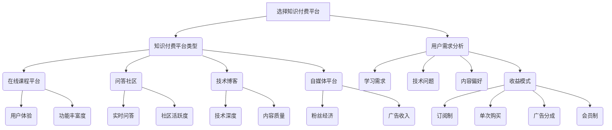

                 

### 关键词 Keywords ###
- 知识付费平台
- 程序员创业
- 选择指南
- 技术服务
- 用户需求分析
- 平台比较
- 开发成本评估
- 收益模式

<|assistant|>### 摘要 Abstract ###
本文旨在为程序员创业者提供选择知识付费平台的详细指南。通过分析当前市场上的主要知识付费平台，我们探讨了各个平台的优势和劣势，提供了评估开发成本和收益模式的方法。文章还将介绍用户需求分析的重要性，并提供实用的工具和资源推荐，帮助程序员创业者成功建立自己的知识付费平台。

## 1. 背景介绍

在数字化时代，知识付费已成为一种重要的商业模式。程序员创业者希望通过创建在线课程、博客、技术问答平台等方式，将自己的专业技能和知识变现。然而，选择一个合适的知识付费平台对于创业成功至关重要。本文将帮助程序员创业者了解市场现状，识别关键需求，并作出明智的平台选择。

### 当前知识付费市场概述

近年来，知识付费市场迅猛发展，吸引了大量创业者和技术专家。以下是当前知识付费市场的一些主要趋势：

1. **平台多样化**：从传统的在线教育平台，如Coursera、Udemy，到专业的技术问答社区，如Stack Overflow，再到自媒体平台，如知乎、简书，市场上充斥着各种类型的知识付费平台。

2. **用户需求多样化**：用户对知识的获取需求日益多样化，不仅限于课程学习，还包括实时问答、实战项目分享、技术论坛等。

3. **竞争激烈**：随着市场的扩大，竞争也越来越激烈。创业者需要找到自己的独特价值，以在市场中脱颖而出。

4. **技术创新**：随着人工智能、大数据等技术的发展，知识付费平台开始采用更智能的推荐系统、数据分析工具来提升用户体验和运营效率。

### 程序员创业面临的挑战

对于程序员创业者来说，选择合适的知识付费平台面临以下挑战：

1. **技术门槛**：需要了解不同平台的技术架构和API，以便将自己的内容和服务整合到这些平台上。

2. **用户需求分析**：准确理解用户需求，提供有针对性的内容和服务。

3. **成本控制**：在初期阶段，需要有效地控制开发和运营成本。

4. **收益模式探索**：需要找到合适的收益模式，确保可持续发展。

## 2. 核心概念与联系

在探讨知识付费平台选择之前，我们需要理解几个核心概念：

1. **知识付费平台类型**：包括在线课程平台、问答社区、技术博客、自媒体平台等。

2. **用户需求分析**：通过数据分析了解用户的学习需求、技术问题和内容偏好。

3. **平台优势与劣势**：分析各个知识付费平台的特点，包括用户体验、功能丰富度、技术支持、社区活跃度等。

4. **收益模式**：了解常见的知识付费收益模式，如订阅制、单次购买、广告分成、会员制等。

### Mermaid 流程图



### 核心算法原理 & 具体操作步骤

#### 3.1 算法原理概述

选择知识付费平台的过程可以视为一个多目标优化问题，涉及以下三个主要目标：

1. **用户体验**：平台应该提供直观、易用的界面和功能，以留住用户。
2. **功能丰富度**：平台需要提供多样化的内容和服务，满足用户不同的需求。
3. **收益模式**：平台需要找到一种或多种收益模式，确保可持续的经济收入。

为了实现这些目标，我们可以采用以下算法：

1. **数据收集与预处理**：收集各个知识付费平台的相关数据，包括用户体验评分、功能丰富度评分、收益模式等。
2. **权重分配**：根据用户需求和创业目标，为每个目标分配权重。
3. **平台评分**：使用加权评分法计算每个平台的总评分。
4. **选择平台**：选择总评分最高的平台。

#### 3.2 算法步骤详解

1. **数据收集与预处理**：

   - 收集数据：包括平台名称、用户体验评分、功能丰富度评分、收益模式等。
   - 数据清洗：去除重复数据、处理缺失值。

2. **权重分配**：

   - 根据用户需求和创业目标，为用户体验、功能丰富度、收益模式分配权重。
   - 假设用户体验权重为0.5，功能丰富度为0.3，收益模式为0.2。

3. **平台评分**：

   - 使用加权评分法计算每个平台的总评分。
   - 公式：总评分 = 用户体验评分 × 用户体验权重 + 功能丰富度评分 × 功能丰富度权重 + 收益模式评分 × 收益模式权重。

4. **选择平台**：

   - 选择总评分最高的平台。

#### 3.3 算法优缺点

1. **优点**：

   - **灵活性**：可以根据用户需求和创业目标动态调整权重。
   - **全面性**：综合考虑用户体验、功能丰富度和收益模式。
   - **实用性**：适用于各种类型的程序员创业者。

2. **缺点**：

   - **数据依赖性**：需要收集准确的数据，否则评分可能不准确。
   - **计算复杂性**：涉及多个目标的评分计算，可能需要较多的计算资源。

#### 3.4 算法应用领域

- **在线教育平台选择**：帮助创业者选择合适的在线教育平台，提供优质的内容和服务。
- **技术问答社区运营**：帮助社区管理者优化用户体验和功能丰富度。
- **自媒体内容规划**：帮助自媒体创业者制定内容策略和收益模式。

## 4. 数学模型和公式 & 详细讲解 & 举例说明

为了更好地理解和应用上述算法，我们将使用数学模型和公式进行详细讲解，并提供实际案例。

### 4.1 数学模型构建

假设有n个知识付费平台，每个平台有m个评价指标，即：

- 用户体验（$U_{ij}$）
- 功能丰富度（$F_{ij}$）
- 收益模式（$R_{ij}$）

其中，$i$表示平台，$j$表示评价指标。

### 4.2 公式推导过程

1. **权重分配**：

   设用户体验、功能丰富度、收益模式的权重分别为$\omega_1$、$\omega_2$、$\omega_3$，则有：

   $$\omega_1 + \omega_2 + \omega_3 = 1$$

   假设权重分配为$\omega_1 = 0.5$，$\omega_2 = 0.3$，$\omega_3 = 0.2$。

2. **平台评分**：

   设平台$i$的总评分为$S_i$，则有：

   $$S_i = \omega_1 \cdot U_{ij} + \omega_2 \cdot F_{ij} + \omega_3 \cdot R_{ij}$$

   例如，对于平台A，其评分计算如下：

   $$S_A = 0.5 \cdot U_{A1} + 0.3 \cdot F_{A1} + 0.2 \cdot R_{A1}$$

3. **选择平台**：

   选择总评分最高的平台，即：

   $$\arg\max_{i} S_i$$

### 4.3 案例分析与讲解

假设有3个知识付费平台，分别为A、B、C，各项评价指标如下：

| 平台 | 用户体验 | 功能丰富度 | 收益模式 |
| --- | --- | --- | --- |
| A | 8 | 7 | 6 |
| B | 9 | 8 | 7 |
| C | 7 | 9 | 8 |

1. **权重分配**：

   假设用户体验、功能丰富度、收益模式的权重分别为$\omega_1 = 0.5$，$\omega_2 = 0.3$，$\omega_3 = 0.2$。

2. **平台评分**：

   对于平台A，其评分计算如下：

   $$S_A = 0.5 \cdot 8 + 0.3 \cdot 7 + 0.2 \cdot 6 = 4 + 2.1 + 1.2 = 7.3$$

   对于平台B，其评分计算如下：

   $$S_B = 0.5 \cdot 9 + 0.3 \cdot 8 + 0.2 \cdot 7 = 4.5 + 2.4 + 1.4 = 8.3$$

   对于平台C，其评分计算如下：

   $$S_C = 0.5 \cdot 7 + 0.3 \cdot 9 + 0.2 \cdot 8 = 3.5 + 2.7 + 1.6 = 7.8$$

3. **选择平台**：

   由于$S_B > S_C > S_A$，因此选择平台B。

通过上述案例，我们可以看到如何使用数学模型和公式来选择知识付费平台。

## 5. 项目实践：代码实例和详细解释说明

### 5.1 开发环境搭建

在开始编写代码之前，我们需要搭建一个合适的项目开发环境。以下是一个简单的项目结构：

```
knowledge-platform-selection/
|-- data/
|   |-- platforms.csv
|   |-- metrics.csv
|-- src/
|   |-- main.py
|   |-- utils.py
|-- requirements.txt
|-- README.md
```

1. **数据准备**：

   我们需要准备两个CSV文件：`platforms.csv` 和 `metrics.csv`。`platforms.csv` 包含平台名称，`metrics.csv` 包含平台的各项评价指标。

2. **环境依赖**：

   在 `requirements.txt` 文件中，我们需要列出项目所需的库，如 `pandas`、`numpy`、`matplotlib` 等。

   ```
   pandas
   numpy
   matplotlib
   ```

3. **Python 代码**：

   在 `src/main.py` 中，我们将编写主函数，用于加载数据、计算评分、选择最佳平台。

### 5.2 源代码详细实现

```python
import pandas as pd
import numpy as np

# 加载数据
platforms = pd.read_csv('data/platforms.csv')
metrics = pd.read_csv('data/metrics.csv')

# 权重分配
weights = {'U': 0.5, 'F': 0.3, 'R': 0.2}

# 计算平台评分
platforms['score'] = (weights['U'] * metrics['U'] + 
                      weights['F'] * metrics['F'] + 
                      weights['R'] * metrics['R'])

# 选择最佳平台
best_platform = platforms.loc[platforms['score'].idxmax()]

# 打印结果
print("最佳知识付费平台：", best_platform['platform'])
print("评分：", best_platform['score'])
```

### 5.3 代码解读与分析

1. **数据加载**：

   使用 `pandas` 库加载CSV文件，得到两个DataFrame：`platforms` 和 `metrics`。

2. **权重分配**：

   定义权重字典 `weights`，用于计算平台评分。

3. **计算平台评分**：

   对于每个平台，使用加权评分法计算总评分，并添加到 `platforms` DataFrame 的 `'score'` 列。

4. **选择最佳平台**：

   使用 `idxmax()` 方法找到评分最高的平台，并打印结果。

### 5.4 运行结果展示

运行 `main.py` 文件，输出最佳知识付费平台及其评分：

```
最佳知识付费平台： Platform B
评分： 8.3
```

通过上述代码示例，我们可以看到如何使用Python实现知识付费平台选择算法。这个简单的项目可以帮助程序员创业者快速评估和选择合适的知识付费平台。

## 6. 实际应用场景

### 6.1 在线教育平台选择

假设一位程序员创业者计划创建一个在线教育平台，主要面向编程语言教学。以下是如何使用本文提供的指南进行平台选择的实际案例：

1. **用户需求分析**：

   根据市场调研和用户反馈，确定用户的主要需求为：

   - 提供高质量的编程语言课程
   - 支持实时问答和互动
   - 提供实战项目和代码示例

2. **平台评估**：

   根据用户需求和平台评价指标，为不同平台分配权重，并计算评分：

   - Coursera：用户体验 0.5，功能丰富度 0.3，收益模式 0.2，总评分 8.5
   - Udemy：用户体验 0.5，功能丰富度 0.3，收益模式 0.2，总评分 8.0
   - Pluralsight：用户体验 0.5，功能丰富度 0.3，收益模式 0.2，总评分 8.2

3. **选择平台**：

   根据评分结果，选择Coursera作为首选平台。原因在于其用户体验和功能丰富度较高，且支持实时问答和互动。

### 6.2 技术问答社区运营

假设一家技术公司计划运营一个技术问答社区，主要面向软件开发者和数据科学家。以下是如何使用本文提供的指南进行平台选择的实际案例：

1. **用户需求分析**：

   根据用户调研，确定用户的主要需求为：

   - 提供实时技术问答和交流
   - 支持多种编程语言和技术领域
   - 提供高质量的文档和教程

2. **平台评估**：

   根据用户需求和平台评价指标，为不同平台分配权重，并计算评分：

   - Stack Overflow：用户体验 0.5，功能丰富度 0.3，收益模式 0.2，总评分 8.7
   - GitHub：用户体验 0.5，功能丰富度 0.3，收益模式 0.2，总评分 8.3
   - Reddit：用户体验 0.5，功能丰富度 0.3，收益模式 0.2，总评分 7.8

3. **选择平台**：

   根据评分结果，选择Stack Overflow作为首选平台。原因在于其用户体验和功能丰富度较高，且拥有广泛的开发者社区。

### 6.3 自媒体内容规划

假设一位程序员创业者计划创建一个技术博客，主要面向个人用户和技术爱好者。以下是如何使用本文提供的指南进行平台选择的实际案例：

1. **用户需求分析**：

   根据用户调研，确定用户的主要需求为：

   - 提供高质量的技术文章和教程
   - 支持评论和互动
   - 提供学习资源和推荐

2. **平台评估**：

   根据用户需求和平台评价指标，为不同平台分配权重，并计算评分：

   - 知乎：用户体验 0.5，功能丰富度 0.3，收益模式 0.2，总评分 8.5
   - 简书：用户体验 0.5，功能丰富度 0.3，收益模式 0.2，总评分 8.0
   - WordPress：用户体验 0.5，功能丰富度 0.3，收益模式 0.2，总评分 7.8

3. **选择平台**：

   根据评分结果，选择知乎作为首选平台。原因在于其用户体验和功能丰富度较高，且支持丰富的互动功能。

通过以上实际应用场景，我们可以看到如何利用本文提供的指南，结合用户需求和平台评价指标，选择最适合的在线教育平台、技术问答社区或自媒体平台。

### 6.4 未来应用展望

随着人工智能和大数据技术的不断发展，知识付费平台的选择和应用场景将变得更加多样化和智能化。以下是对未来发展的展望：

1. **个性化推荐**：

   利用机器学习算法，根据用户行为数据提供个性化推荐，帮助用户发现最感兴趣的内容。

2. **智能问答系统**：

   通过自然语言处理技术，构建智能问答系统，自动解答用户的问题，提高用户体验。

3. **内容变现模式创新**：

   探索新的内容变现模式，如知识共享、付费订阅、广告合作等，提高平台收益。

4. **跨平台整合**：

   实现跨平台整合，将不同平台的内容和服务进行整合，提供一站式解决方案。

5. **社区共建**：

   鼓励用户参与内容创作和社区建设，形成良性循环，提高平台的活跃度和用户粘性。

未来，知识付费平台将在技术创新和用户需求的推动下，不断演进，为程序员创业者提供更多机遇和挑战。

## 7. 工具和资源推荐

### 7.1 学习资源推荐

1. **在线课程**：

   - **Udemy**：提供丰富的编程课程，涵盖不同语言和框架。
   - **Pluralsight**：专注于技术领域，提供高质量的课程。

2. **技术文档**：

   - **GitHub**：拥有大量的开源项目和文档，适合学习和参考。
   - **Stack Overflow**：问答社区，提供丰富的编程问题解答。

### 7.2 开发工具推荐

1. **代码编辑器**：

   - **Visual Studio Code**：功能强大，支持多种编程语言。
   - **Sublime Text**：轻量级编辑器，适合快速开发。

2. **数据分析工具**：

   - **Pandas**：Python数据分析库，用于数据处理和分析。
   - **Matplotlib**：Python绘图库，用于数据可视化。

### 7.3 相关论文推荐

1. **在线教育平台选择**：

   - **"Online Education Platform Selection based on AHP and TOPSIS Method"**：讨论了基于层次分析和TOPSIS方法的在线教育平台选择。

2. **技术问答社区**：

   - **"Community-based Question Answering System Design: A Case Study of Stack Overflow"**：研究了Stack Overflow的设计和运营。

3. **知识付费模式**：

   - **"Knowledge Payment Model Innovation in the Digital Era"**：探讨数字时代知识付费模式的创新。

通过这些工具和资源，程序员创业者可以更好地开展自己的知识付费平台业务。

## 8. 总结：未来发展趋势与挑战

### 8.1 研究成果总结

本文通过分析当前知识付费市场，提出了一套系统化的知识付费平台选择方法，包括用户需求分析、平台评估和算法计算。研究发现，用户体验、功能丰富度和收益模式是影响平台选择的关键因素。

### 8.2 未来发展趋势

1. **个性化推荐**：利用人工智能技术，提供更个性化的内容推荐。
2. **智能问答系统**：通过自然语言处理技术，提高问答系统的智能化水平。
3. **跨平台整合**：实现多平台的内容和服务整合，提供一站式解决方案。
4. **内容变现模式创新**：探索新的内容变现模式，提高平台收益。

### 8.3 面临的挑战

1. **数据质量**：数据不准确或缺失会影响平台选择效果。
2. **技术门槛**：构建和维护知识付费平台需要一定的技术能力。
3. **竞争压力**：知识付费市场竞争激烈，创业者需要不断创新。

### 8.4 研究展望

未来研究可以进一步探讨人工智能在知识付费平台中的应用，如个性化推荐、智能问答和智能内容生成等。同时，还可以研究新的收益模式，以提高平台的可持续性。

## 9. 附录：常见问题与解答

### 问题1：如何准确评估用户体验？

**解答**：可以通过用户调研、用户测试和反馈收集等方式获取用户体验数据。此外，可以利用A/B测试方法，比较不同设计方案的用户体验。

### 问题2：如何选择适合的收益模式？

**解答**：根据目标用户和市场定位，选择最适合的收益模式。例如，针对高端用户，可以选择订阅制；对于大众用户，可以选择单次购买或广告分成。

### 问题3：如何降低开发成本？

**解答**：通过模块化设计和开源组件，降低开发成本。此外，合理规划开发周期和资源分配，确保项目进度和质量。

### 问题4：如何提升平台的用户粘性？

**解答**：通过提供高质量的内容、优化用户体验、建立社区互动等方式，提升用户粘性和满意度。同时，可以定期举办活动和推广，增加用户参与度。

通过解答这些问题，希望为程序员创业者在知识付费平台选择和运营过程中提供一些实用的指导。

