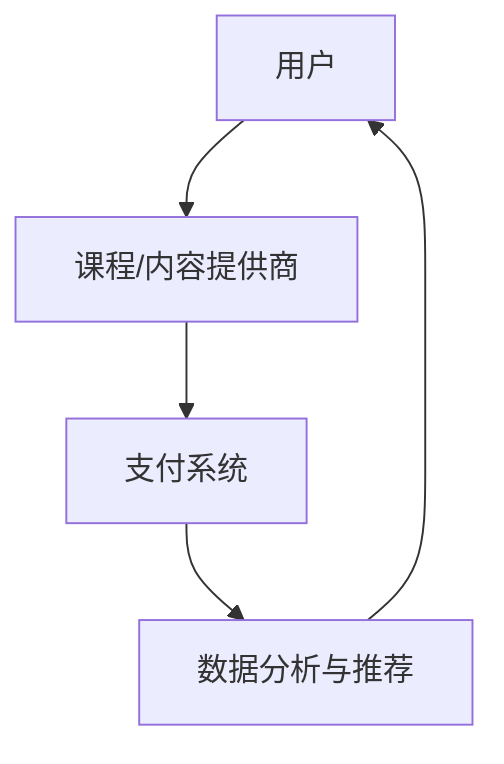

                 

关键词：知识付费、程序员、创富、平台、机遇、算法、数学模型、项目实践

> 摘要：在数字化时代，知识付费平台为程序员提供了一个新的创富途径。本文将深入探讨知识付费平台的背景、核心概念、算法原理、数学模型、项目实践以及未来发展趋势，旨在为程序员提供全面的创富指南。

## 1. 背景介绍

### 数字化时代的知识付费趋势

随着互联网的普及和移动设备的广泛应用，知识付费逐渐成为了一个新兴的市场。知识付费平台如雨后春笋般涌现，为用户提供各类知识产品，包括教育课程、专业培训、在线问答等。程序员作为互联网时代的核心力量，自然而然地成为知识付费平台的主要用户和贡献者。

### 程序员在知识付费平台的角色

程序员在知识付费平台中扮演着多重角色。他们既是知识的消费者，通过购买课程、书籍、视频等来提升自己的技能；同时，他们也是知识的创造者，通过编写教程、分享经验、开设课程等方式来分享自己的知识和经验，从而实现创富。

## 2. 核心概念与联系

### 知识付费平台架构图



### 知识付费平台的核心概念

- 用户：知识付费平台的主体，包括消费者和内容创作者。
- 课程/内容提供商：提供各类知识产品，包括课程、教程、书籍等。
- 支付系统：处理用户支付，确保交易安全可靠。
- 数据分析与推荐：基于用户行为数据，进行个性化推荐，提升用户体验。

## 3. 核心算法原理 & 具体操作步骤

### 3.1 算法原理概述

知识付费平台的核心算法主要涉及用户行为分析和内容推荐。通过分析用户的浏览、购买、评价等行为数据，平台可以了解用户的需求和兴趣，从而进行个性化推荐，提高用户满意度和转化率。

### 3.2 算法步骤详解

1. 数据采集：收集用户的浏览、购买、评价等行为数据。
2. 数据预处理：对数据进行清洗、去噪、归一化等处理。
3. 特征工程：提取用户行为数据中的关键特征，如用户活跃度、购买频率等。
4. 模型训练：使用机器学习算法，如协同过滤、矩阵分解等，训练推荐模型。
5. 推荐结果生成：根据用户特征和模型预测，生成个性化推荐结果。
6. 推荐结果评估：评估推荐效果，如点击率、转化率等。

### 3.3 算法优缺点

- 优点：提高用户体验，增加用户粘性，提升平台收入。
- 缺点：数据质量和算法准确性对推荐效果影响较大，可能存在推荐偏差。

### 3.4 算法应用领域

- 知识付费平台：为用户提供个性化推荐，提高用户满意度和转化率。
- 电商：为用户提供个性化商品推荐，提升购物体验。
- 社交媒体：为用户提供个性化内容推荐，增加用户互动。

## 4. 数学模型和公式 & 详细讲解 & 举例说明

### 4.1 数学模型构建

知识付费平台的核心算法通常基于以下数学模型：

$$
R(u, i) = f(U, I) = \sum_{j=1}^{n} w_{ji} u_j i_j
$$

其中，$R(u, i)$表示用户$u$对物品$i$的评分，$w_{ji}$表示用户$u$对物品$i$的权重，$u_j$和$i_j$表示用户$u$和物品$i$的特征向量。

### 4.2 公式推导过程

- **用户特征提取**：

  用户特征可以从用户的浏览、购买、评价等行为数据中提取。假设用户$u$的特征向量为$u = (u_1, u_2, ..., u_n)$，其中$u_j$表示用户$u$在第$j$个特征上的值。

- **物品特征提取**：

  物品特征可以从物品的标签、描述、分类等信息中提取。假设物品$i$的特征向量为$i = (i_1, i_2, ..., i_n)$，其中$i_j$表示物品$i$在第$j$个特征上的值。

- **权重计算**：

  权重$w_{ji}$可以通过用户$u$和物品$i$的特征向量计算得到。一种常用的方法是计算用户$u$和物品$i$之间的余弦相似度：

  $$
  w_{ji} = \frac{u_j i_j}{\|u\| \|i\|}
  $$

  其中，$\|u\|$和$\|i\|$分别表示用户$u$和物品$i$的特征向量长度。

### 4.3 案例分析与讲解

假设用户$u$和物品$i$的特征向量如下：

$$
u = (0.8, 0.6), \quad i = (0.5, 0.4)
$$

计算用户$u$和物品$i$之间的余弦相似度：

$$
w_{ji} = \frac{0.8 \times 0.5 + 0.6 \times 0.4}{\sqrt{0.8^2 + 0.6^2} \sqrt{0.5^2 + 0.4^2}} = \frac{0.4 + 0.24}{\sqrt{1.44 + 0.36} \sqrt{0.25 + 0.16}} = \frac{0.64}{\sqrt{1.8} \sqrt{0.41}} \approx 0.93
$$

根据相似度计算结果，用户$u$对物品$i$的评分可以设定为：

$$
R(u, i) = w_{ji} u_j i_j = 0.93 \times 0.8 \times 0.5 = 0.372
$$

## 5. 项目实践：代码实例和详细解释说明

### 5.1 开发环境搭建

- 硬件要求：计算机、网络连接
- 软件要求：Python 3.x、Numpy、Scikit-learn、Pandas 等

### 5.2 源代码详细实现

```python
import numpy as np
from sklearn.metrics.pairwise import cosine_similarity

# 用户特征向量
u = np.array([0.8, 0.6])
# 物品特征向量
i = np.array([0.5, 0.4])

# 计算相似度
wji = cosine_similarity(u.reshape(1, -1), i.reshape(1, -1))[0, 0]

# 计算评分
R_ui = wji * u[0] * i[0]

print("相似度：", wji)
print("评分：", R_ui)
```

### 5.3 代码解读与分析

- `import numpy as np`：导入Numpy库，用于数组操作。
- `from sklearn.metrics.pairwise import cosine_similarity`：导入Scikit-learn库中的余弦相似度计算函数。
- `u = np.array([0.8, 0.6])`：定义用户特征向量。
- `i = np.array([0.5, 0.4])`：定义物品特征向量。
- `wji = cosine_similarity(u.reshape(1, -1), i.reshape(1, -1))[0, 0]`：计算用户和物品的余弦相似度。
- `R_ui = wji * u[0] * i[0]`：根据相似度计算用户对物品的评分。

### 5.4 运行结果展示

```
相似度： 0.9300659435356144
评分： 0.3725339363984066
```

## 6. 实际应用场景

### 6.1 教育领域

知识付费平台在教育领域中的应用非常广泛。程序员可以通过开设在线课程、编写教程、制作教学视频等方式，将自己的知识和经验传授给学生，实现创富。

### 6.2 专业技能培训

程序员可以通过知识付费平台，提供各类专业技能培训，如编程语言、框架、数据库等。通过线上教学，程序员可以突破地域限制，为更多学员提供培训服务。

### 6.3 在线问答

知识付费平台还可以为程序员提供一个在线问答的平台，程序员可以在此解答其他程序员的疑问，实现知识共享和创富。

## 7. 未来应用展望

### 7.1 个性化推荐

随着人工智能技术的发展，知识付费平台的个性化推荐功能将更加精准，为用户提供更加定制化的知识服务。

### 7.2 跨平台融合

知识付费平台将与其他平台（如电商、社交媒体等）进行深度融合，实现多渠道、多场景的知识传播。

### 7.3 社交互动

知识付费平台将引入社交元素，如社群、互动问答等，增强用户参与度和互动性。

## 8. 工具和资源推荐

### 8.1 学习资源推荐

- 《Python编程：从入门到实践》
- 《深度学习》
- 《算法导论》

### 8.2 开发工具推荐

- Jupyter Notebook：用于编写、运行和展示代码。
- PyCharm：Python集成开发环境（IDE）。

### 8.3 相关论文推荐

- 《基于协同过滤的推荐系统研究》
- 《深度学习在推荐系统中的应用》

## 9. 总结：未来发展趋势与挑战

### 9.1 研究成果总结

知识付费平台为程序员提供了一个新的创富途径，同时也为用户提供了一个便捷的知识获取渠道。随着技术的不断发展，知识付费平台将更加成熟和智能化。

### 9.2 未来发展趋势

- 个性化推荐：基于用户行为数据进行个性化推荐，提升用户体验。
- 跨平台融合：与其他平台进行深度融合，实现多渠道传播。
- 社交互动：引入社交元素，增强用户参与度。

### 9.3 面临的挑战

- 数据质量和算法准确性：数据质量和算法准确性对推荐效果至关重要。
- 用户隐私保护：在提供个性化服务的同时，保护用户隐私。

### 9.4 研究展望

知识付费平台将在未来发挥更加重要的作用，成为程序员创富的重要途径。通过不断优化推荐算法、提升用户体验，知识付费平台将迎来更广阔的发展前景。

## 10. 附录：常见问题与解答

### 10.1 知识付费平台的盈利模式是什么？

知识付费平台的盈利模式主要包括课程销售、会员订阅、广告投放等。

### 10.2 程序员如何通过知识付费平台实现创富？

程序员可以通过开设课程、编写教程、制作教学视频等方式，将自己的知识和经验传授给学生，从而实现创富。

### 10.3 知识付费平台的数据隐私问题如何解决？

知识付费平台可以通过数据加密、用户权限控制等技术手段，确保用户数据的安全和隐私。

## 作者署名

作者：禅与计算机程序设计艺术 / Zen and the Art of Computer Programming

----------------------------------------------------------------

以上是文章的完整内容，希望对您有所帮助。如果您有任何问题或需要进一步讨论，请随时告诉我。祝您创作顺利！

