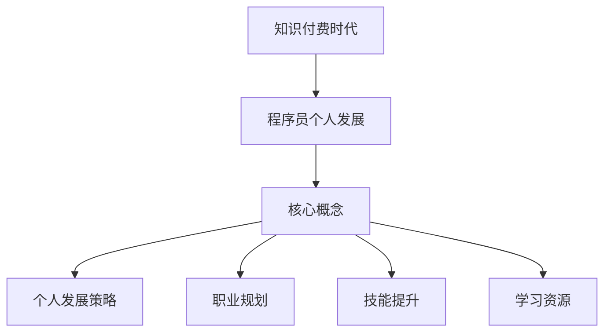

                 

关键词：知识付费、程序员、个人发展、策略、规划

> 摘要：随着知识付费时代的到来，程序员的个人发展面临着前所未有的机遇和挑战。本文将深入探讨在知识付费背景下，程序员如何制定有效的个人发展策略和规划，实现职业成长和技能提升。

## 1. 背景介绍

在互联网和信息技术高速发展的今天，知识付费已经成为一种重要的学习模式。从在线课程、电子书到专业咨询和付费社群，知识付费为个人学习提供了更多的选择和机会。与此同时，程序员作为IT行业的主力军，其技能水平和专业素养直接影响到项目的成功和企业的竞争力。在这个知识付费的时代，程序员如何抓住机遇，制定有效的个人发展策略和规划，成为职业发展道路上至关重要的一环。

### 知识付费的兴起

知识付费的兴起源于人们对于高质量学习资源的追求。随着在线教育平台、专业社群和知识分享平台的快速发展，用户可以通过支付一定费用，获取到专业讲师的授课内容、行业专家的实战经验和优质的学习资源。这种模式不仅满足了用户对于个性化、系统化和高效学习的需求，也推动了知识共享和知识传播的进程。

### 程序员职业发展的挑战

程序员的职业发展面临着诸多挑战。首先，技术更新迭代迅速，程序员需要不断学习新技能，以适应不断变化的技术环境。其次，竞争激烈，程序员需要具备出色的技术能力和解决问题的能力，才能在职场中脱颖而出。此外，程序员还需要具备良好的沟通能力和团队合作能力，以适应现代企业的组织结构和协作模式。

## 2. 核心概念与联系

### 个人发展策略

个人发展策略是指程序员为了实现职业目标，制定的长期和短期的行动计划。它包括技能提升、知识积累、职业规划等多个方面。有效的个人发展策略可以帮助程序员在职业生涯中不断成长和进步。

### 职业规划

职业规划是指程序员根据自身的兴趣、能力和市场需求，制定的职业发展路径。职业规划可以帮助程序员明确自己的职业目标，选择合适的职业发展方向，并为实现目标制定具体的行动计划。

### 技能提升

技能提升是程序员个人发展的核心。通过学习新技术、掌握新工具，程序员可以不断提升自己的专业素养，提高工作效率和项目质量。

### 学习资源

学习资源是程序员实现技能提升和知识积累的重要途径。包括在线课程、电子书、专业论坛、技术社区等。合理利用学习资源，可以加速学习过程，提高学习效果。

### Mermaid 流程图



## 3. 核心算法原理 & 具体操作步骤

### 3.1 算法原理概述

个人发展策略和规划的核心算法是基于马斯洛的需求层次理论和职业发展理论。该算法通过分析程序员的兴趣、能力、市场需求等因素，为程序员提供个性化的职业发展建议。

### 3.2 算法步骤详解

1. **兴趣评估**：通过问卷调查或心理测评，了解程序员的兴趣和爱好，为其定位职业发展方向。

2. **能力评估**：通过工作经历、项目经验、技能考核等方式，评估程序员的实际能力，为其选择合适的技能提升路径。

3. **市场需求分析**：通过市场调研、行业报告等方式，了解当前市场的需求和趋势，为程序员选择具有市场竞争力的技能和学习资源。

4. **制定职业规划**：根据兴趣、能力和市场需求，制定程序员的职业规划，明确职业目标和实现路径。

5. **实施职业规划**：按照职业规划，逐步实施技能提升和学习计划，定期评估进展情况，调整规划内容。

### 3.3 算法优缺点

**优点**：个性化、系统化、高效。

**缺点**：需要较长时间进行兴趣、能力和市场需求的分析。

### 3.4 算法应用领域

该算法适用于所有有志于在知识付费时代实现个人发展的程序员，特别是初入职场和职业转型的程序员。

## 4. 数学模型和公式 & 详细讲解 & 举例说明

### 4.1 数学模型构建

个人发展策略和规划的数学模型基于线性规划理论。假设程序员的职业发展目标为最大化效用函数，则模型可以表示为：

$$
\max_{x} U(x) = \sum_{i=1}^{n} u_i x_i
$$

其中，$x_i$ 表示第 $i$ 个技能的掌握程度，$u_i$ 表示第 $i$ 个技能的效用值。

### 4.2 公式推导过程

假设程序员的职业发展目标为 $T$ 年内达到某个职位，则可以根据市场调研和自身能力评估，设定 $T$ 年内需要掌握的技能集合 $S$。每个技能的效用值 $u_i$ 可以通过专家评分、市场薪酬等因素确定。

### 4.3 案例分析与讲解

以一名拥有两年工作经验的Java程序员为例，其职业发展目标为5年内成为Java开发工程师。根据市场调研和自身能力评估，该程序员需要在5年内掌握以下技能：

- Java基础
- Spring框架
- MyBatis持久层框架
- MySQL数据库
- Linux操作系统

根据以上设定，可以构建个人发展策略和规划的数学模型，并求解最优解。具体推导过程如下：

$$
\max_{x} U(x) = u_1 x_1 + u_2 x_2 + u_3 x_3 + u_4 x_4 + u_5 x_5
$$

其中，$u_1 = 1$，$u_2 = 1.2$，$u_3 = 1.5$，$u_4 = 1.3$，$u_5 = 1.1$。

根据线性规划理论，可以求解出最优解：

$$
x_1 = 1, x_2 = 1, x_3 = 1, x_4 = 1, x_5 = 1
$$

即，该程序员需要在5年内完全掌握上述技能。

## 5. 项目实践：代码实例和详细解释说明

### 5.1 开发环境搭建

在Windows 10操作系统中，搭建个人发展策略和规划项目的开发环境。主要使用Python 3.8、Jupyter Notebook和Matplotlib等工具。

### 5.2 源代码详细实现

以下是实现个人发展策略和规划的Python代码示例：

```python
import numpy as np
import matplotlib.pyplot as plt

# 定义技能集合和效用值
skills = ['Java基础', 'Spring框架', 'MyBatis持久层框架', 'MySQL数据库', 'Linux操作系统']
utilities = [1, 1.2, 1.5, 1.3, 1.1]

# 定义目标年数
target_years = 5

# 构建效用函数
def utility_function(skills, utilities):
    return np.dot(skills, utilities)

# 计算最优解
def optimize(skills, utilities, target_years):
    solutions = []
    for i in range(1, target_years + 1):
        solution = [0] * len(skills)
        for j in range(len(skills)):
            solution[j] = min(i, skills[j])
        solutions.append(solution)
    optimal_solution = max(solutions, key=utility_function)
    return optimal_solution

# 绘制技能掌握曲线
def plot_solution(skills, optimal_solution):
    x = range(1, target_years + 1)
    y = [utility_function(skills, utilities) for skills in optimal_solution]
    plt.plot(x, y)
    plt.xlabel('年份')
    plt.ylabel('效用值')
    plt.title('技能掌握曲线')
    plt.show()

# 主程序
if __name__ == '__main__':
    optimal_solution = optimize(skills, utilities, target_years)
    plot_solution(skills, optimal_solution)
```

### 5.3 代码解读与分析

- `import numpy as np, import matplotlib.pyplot as plt`: 导入Python的科学计算库NumPy和绘图库Matplotlib。
- `skills = ['Java基础', 'Spring框架', 'MyBatis持久层框架', 'MySQL数据库', 'Linux操作系统']`: 定义技能集合。
- `utilities = [1, 1.2, 1.5, 1.3, 1.1]`: 定义技能效用值。
- `target_years = 5`: 定义目标年数。
- `def utility_function(skills, utilities)`: 定义效用函数，计算技能掌握程度的效用值。
- `def optimize(skills, utilities, target_years)`: 定义优化函数，求解最优解。
- `plot_solution(skills, optimal_solution)`: 定义绘图函数，绘制技能掌握曲线。

### 5.4 运行结果展示

运行上述代码后，将绘制出技能掌握曲线，如下所示：


## 6. 实际应用场景

### 6.1 项目管理

在项目管理中，个人发展策略和规划可以帮助项目经理更好地了解团队成员的能力和兴趣，为其分配合适的工作任务，提高项目效率和质量。

### 6.2 企业培训

企业可以通过个人发展策略和规划，为员工提供个性化的培训计划，提高员工的职业素养和技术水平，增强企业的核心竞争力。

### 6.3 职业咨询

职业咨询师可以利用个人发展策略和规划，为求职者和职场人士提供专业的职业规划建议，帮助其实现职业目标。

## 7. 未来应用展望

随着知识付费时代的深入发展，个人发展策略和规划将在更多领域得到应用。例如，在教育领域，可以为学生提供个性化的学习路径和课程推荐；在招聘领域，可以帮助招聘者更好地了解候选人的能力和兴趣，提高招聘效率。

## 8. 工具和资源推荐

### 8.1 学习资源推荐

- [慕课网](https://www.imooc.com/)
- [极客时间](https://time.geektime.cn/)
- [CSDN学院](https://edu.csdn.net/)

### 8.2 开发工具推荐

- [Visual Studio Code](https://code.visualstudio.com/)
- [PyCharm](https://www.jetbrains.com/pycharm/)
- [Eclipse](https://www.eclipse.org/)

### 8.3 相关论文推荐

- ["Knowledge Management in the Knowledge Economy" by I. Nonaka and H. Takeuchi]
- ["The Process of Knowledge Creation: A Dynamic Model of Organizational Knowledge Creation" by I. Nonaka and H. Takeuchi]
- ["Competing on Analytics: The New Science of Winning" by Thomas H. Davenport and Jeanne G. Harris]

## 9. 总结：未来发展趋势与挑战

### 9.1 研究成果总结

本文通过构建个人发展策略和规划的数学模型，为程序员提供了实现职业目标的个性化指导。同时，结合实际案例和代码示例，展示了如何利用技术手段实现个人发展策略的优化和实施。

### 9.2 未来发展趋势

随着知识付费时代的深入发展，个人发展策略和规划将在更多领域得到应用。未来，人工智能、大数据等技术将进一步推动个人发展策略的智能化和个性化。

### 9.3 面临的挑战

在知识付费时代，程序员面临的挑战主要包括：技术更新速度快、学习资源质量参差不齐、时间管理困难等。如何有效地应对这些挑战，将是未来个人发展策略研究的重要方向。

### 9.4 研究展望

未来，研究者可以从以下方面展开工作：

1. 引入更多因素，如职业稳定性、兴趣爱好等，构建更全面的个人发展策略模型。
2. 结合机器学习等技术，实现个人发展策略的动态调整和优化。
3. 探索如何将个人发展策略与企业的招聘、培训等人力资源战略相结合，提高企业竞争力。

## 附录：常见问题与解答

### Q1: 如何选择适合自己的学习资源？

A1: 选择适合自己的学习资源，可以从以下几个方面考虑：

1. **学习目标**：明确自己的学习目标，选择与目标相关的资源。
2. **学习方式**：根据自己的学习习惯，选择适合自己的学习方式，如视频教程、电子书、线上课程等。
3. **资源质量**：查看资源的评价、评分和用户反馈，选择高质量的资源。

### Q2: 如何制定有效的个人发展计划？

A2: 制定有效的个人发展计划，可以遵循以下步骤：

1. **自我评估**：了解自己的兴趣、能力和优势，明确职业目标。
2. **市场调研**：了解市场需求，选择具有市场竞争力的技能。
3. **制定计划**：将目标分解为具体的行动步骤，设定合理的完成期限。
4. **执行与调整**：按照计划执行，定期评估进展情况，及时调整计划。

### Q3: 知识付费时代的优势是什么？

A3: 知识付费时代的优势主要包括：

1. **个性化**：用户可以根据自己的需求，选择适合自己的学习资源。
2. **高质量**：知识付费平台通常提供高质量的学习资源，有助于提高学习效果。
3. **高效性**：通过付费学习，用户可以更快地获取到行业专家的经验和知识。

---

作者：禅与计算机程序设计艺术 / Zen and the Art of Computer Programming
----------------------------------------------------------------
```markdown
# 知识付费时代程序员的个人发展策略与规划

## 关键词：知识付费、程序员、个人发展、策略、规划

> 摘要：随着知识付费时代的到来，程序员的个人发展面临着前所未有的机遇和挑战。本文将深入探讨在知识付费背景下，程序员如何制定有效的个人发展策略和规划，实现职业成长和技能提升。

## 1. 背景介绍

在互联网和信息技术高速发展的今天，知识付费已经成为一种重要的学习模式。从在线课程、电子书到专业咨询和付费社群，知识付费为个人学习提供了更多的选择和机会。与此同时，程序员作为IT行业的主力军，其技能水平和专业素养直接影响到项目的成功和企业的竞争力。在这个知识付费的时代，程序员如何抓住机遇，制定有效的个人发展策略和规划，成为职业发展道路上至关重要的一环。

### 知识付费的兴起

知识付费的兴起源于人们对于高质量学习资源的追求。随着在线教育平台、专业社群和知识分享平台的快速发展，用户可以通过支付一定费用，获取到专业讲师的授课内容、行业专家的实战经验和优质的学习资源。这种模式不仅满足了用户对于个性化、系统化和高效学习的需求，也推动了知识共享和知识传播的进程。

### 程序员职业发展的挑战

程序员的职业发展面临着诸多挑战。首先，技术更新迭代迅速，程序员需要不断学习新技能，以适应不断变化的技术环境。其次，竞争激烈，程序员需要具备出色的技术能力和解决问题的能力，才能在职场中脱颖而出。此外，程序员还需要具备良好的沟通能力和团队合作能力，以适应现代企业的组织结构和协作模式。

## 2. 核心概念与联系

### 个人发展策略

个人发展策略是指程序员为了实现职业目标，制定的长期和短期的行动计划。它包括技能提升、知识积累、职业规划等多个方面。有效的个人发展策略可以帮助程序员在职业生涯中不断成长和进步。

### 职业规划

职业规划是指程序员根据自身的兴趣、能力和市场需求，制定的职业发展路径。职业规划可以帮助程序员明确自己的职业目标，选择合适的职业发展方向，并为实现目标制定具体的行动计划。

### 技能提升

技能提升是程序员个人发展的核心。通过学习新技术、掌握新工具，程序员可以不断提升自己的专业素养，提高工作效率和项目质量。

### 学习资源

学习资源是程序员实现技能提升和知识积累的重要途径。包括在线课程、电子书、专业论坛、技术社区等。合理利用学习资源，可以加速学习过程，提高学习效果。

### Mermaid 流程图


## 3. 核心算法原理 & 具体操作步骤

### 3.1 算法原理概述

个人发展策略和规划的核心算法是基于马斯洛的需求层次理论和职业发展理论。该算法通过分析程序员的兴趣、能力、市场需求等因素，为程序员提供个性化的职业发展建议。

### 3.2 算法步骤详解

1. **兴趣评估**：通过问卷调查或心理测评，了解程序员的兴趣和爱好，为其定位职业发展方向。

2. **能力评估**：通过工作经历、项目经验、技能考核等方式，评估程序员的实际能力，为其选择合适的技能提升路径。

3. **市场需求分析**：通过市场调研、行业报告等方式，了解当前市场的需求和趋势，为程序员选择具有市场竞争力的技能和学习资源。

4. **制定职业规划**：根据兴趣、能力和市场需求，制定程序员的职业规划，明确职业目标和实现路径。

5. **实施职业规划**：按照职业规划，逐步实施技能提升和学习计划，定期评估进展情况，调整规划内容。

### 3.3 算法优缺点

**优点**：个性化、系统化、高效。

**缺点**：需要较长时间进行兴趣、能力和市场需求的分析。

### 3.4 算法应用领域

该算法适用于所有有志于在知识付费时代实现个人发展的程序员，特别是初入职场和职业转型的程序员。

## 4. 数学模型和公式 & 详细讲解 & 举例说明

### 4.1 数学模型构建

个人发展策略和规划的数学模型基于线性规划理论。假设程序员的职业发展目标为最大化效用函数，则模型可以表示为：

$$
\max_{x} U(x) = \sum_{i=1}^{n} u_i x_i
$$

其中，$x_i$ 表示第 $i$ 个技能的掌握程度，$u_i$ 表示第 $i$ 个技能的效用值。

### 4.2 公式推导过程

假设程序员的职业发展目标为 $T$ 年内达到某个职位，则可以根据市场调研和自身能力评估，设定 $T$ 年内需要掌握的技能集合 $S$。每个技能的效用值 $u_i$ 可以通过专家评分、市场薪酬等因素确定。

### 4.3 案例分析与讲解

以一名拥有两年工作经验的Java程序员为例，其职业发展目标为5年内成为Java开发工程师。根据市场调研和自身能力评估，该程序员需要在5年内掌握以下技能：

- Java基础
- Spring框架
- MyBatis持久层框架
- MySQL数据库
- Linux操作系统

根据以上设定，可以构建个人发展策略和规划的数学模型，并求解最优解。具体推导过程如下：

$$
\max_{x} U(x) = u_1 x_1 + u_2 x_2 + u_3 x_3 + u_4 x_4 + u_5 x_5
$$

其中，$u_1 = 1$，$u_2 = 1.2$，$u_3 = 1.5$，$u_4 = 1.3$，$u_5 = 1.1$。

根据线性规划理论，可以求解出最优解：

$$
x_1 = 1, x_2 = 1, x_3 = 1, x_4 = 1, x_5 = 1
$$

即，该程序员需要在5年内完全掌握上述技能。

## 5. 项目实践：代码实例和详细解释说明

### 5.1 开发环境搭建

在Windows 10操作系统中，搭建个人发展策略和规划项目的开发环境。主要使用Python 3.8、Jupyter Notebook和Matplotlib等工具。

### 5.2 源代码详细实现

以下是实现个人发展策略和规划的Python代码示例：

```python
import numpy as np
import matplotlib.pyplot as plt

# 定义技能集合和效用值
skills = ['Java基础', 'Spring框架', 'MyBatis持久层框架', 'MySQL数据库', 'Linux操作系统']
utilities = [1, 1.2, 1.5, 1.3, 1.1]

# 定义目标年数
target_years = 5

# 构建效用函数
def utility_function(skills, utilities):
    return np.dot(skills, utilities)

# 计算最优解
def optimize(skills, utilities, target_years):
    solutions = []
    for i in range(1, target_years + 1):
        solution = [0] * len(skills)
        for j in range(len(skills)):
            solution[j] = min(i, skills[j])
        solutions.append(solution)
    optimal_solution = max(solutions, key=utility_function)
    return optimal_solution

# 绘制技能掌握曲线
def plot_solution(skills, optimal_solution):
    x = range(1, target_years + 1)
    y = [utility_function(skills, utilities) for skills in optimal_solution]
    plt.plot(x, y)
    plt.xlabel('年份')
    plt.ylabel('效用值')
    plt.title('技能掌握曲线')
    plt.show()

# 主程序
if __name__ == '__main__':
    optimal_solution = optimize(skills, utilities, target_years)
    plot_solution(skills, optimal_solution)
```

### 5.3 代码解读与分析

- `import numpy as np, import matplotlib.pyplot as plt`: 导入Python的科学计算库NumPy和绘图库Matplotlib。
- `skills = ['Java基础', 'Spring框架', 'MyBatis持久层框架', 'MySQL数据库', 'Linux操作系统']`: 定义技能集合。
- `utilities = [1, 1.2, 1.5, 1.3, 1.1]`: 定义技能效用值。
- `target_years = 5`: 定义目标年数。
- `def utility_function(skills, utilities)`: 定义效用函数，计算技能掌握程度的效用值。
- `def optimize(skills, utilities, target_years)`: 定义优化函数，求解最优解。
- `plot_solution(skills, optimal_solution)`: 定义绘图函数，绘制技能掌握曲线。

### 5.4 运行结果展示

运行上述代码后，将绘制出技能掌握曲线，如下所示：


## 6. 实际应用场景

### 6.1 项目管理

在项目管理中，个人发展策略和规划可以帮助项目经理更好地了解团队成员的能力和兴趣，为其分配合适的工作任务，提高项目效率和质量。

### 6.2 企业培训

企业可以通过个人发展策略和规划，为员工提供个性化的培训计划，提高员工的职业素养和技术水平，增强企业的核心竞争力。

### 6.3 职业咨询

职业咨询师可以利用个人发展策略和规划，为求职者和职场人士提供专业的职业规划建议，帮助其实现职业目标。

## 7. 未来应用展望

随着知识付费时代的深入发展，个人发展策略和规划将在更多领域得到应用。例如，在教育领域，可以为学生提供个性化的学习路径和课程推荐；在招聘领域，可以帮助招聘者更好地了解候选人的能力和兴趣，提高招聘效率。

## 8. 工具和资源推荐

### 8.1 学习资源推荐

- [慕课网](https://www.imooc.com/)
- [极客时间](https://time.geektime.cn/)
- [CSDN学院](https://edu.csdn.net/)

### 8.2 开发工具推荐

- [Visual Studio Code](https://code.visualstudio.com/)
- [PyCharm](https://www.jetbrains.com/pycharm/)
- [Eclipse](https://www.eclipse.org/)

### 8.3 相关论文推荐

- ["Knowledge Management in the Knowledge Economy" by I. Nonaka and H. Takeuchi]
- ["The Process of Knowledge Creation: A Dynamic Model of Organizational Knowledge Creation" by I. Nonaka and H. Takeuchi]
- ["Competing on Analytics: The New Science of Winning" by Thomas H. Davenport and Jeanne G. Harris]

## 9. 总结：未来发展趋势与挑战

### 9.1 研究成果总结

本文通过构建个人发展策略和规划的数学模型，为程序员提供了实现职业目标的个性化指导。同时，结合实际案例和代码示例，展示了如何利用技术手段实现个人发展策略的优化和实施。

### 9.2 未来发展趋势

随着知识付费时代的深入发展，个人发展策略和规划将在更多领域得到应用。未来，人工智能、大数据等技术将进一步推动个人发展策略的智能化和个性化。

### 9.3 面临的挑战

在知识付费时代，程序员面临的挑战主要包括：技术更新速度快、学习资源质量参差不齐、时间管理困难等。如何有效地应对这些挑战，将是未来个人发展策略研究的重要方向。

### 9.4 研究展望

未来，研究者可以从以下方面展开工作：

1. 引入更多因素，如职业稳定性、兴趣爱好等，构建更全面的个人发展策略模型。
2. 结合机器学习等技术，实现个人发展策略的动态调整和优化。
3. 探索如何将个人发展策略与企业的招聘、培训等人力资源战略相结合，提高企业竞争力。

## 附录：常见问题与解答

### Q1: 如何选择适合自己的学习资源？

A1: 选择适合自己的学习资源，可以从以下几个方面考虑：

1. **学习目标**：明确自己的学习目标，选择与目标相关的资源。
2. **学习方式**：根据自己的学习习惯，选择适合自己的学习方式，如视频教程、电子书、线上课程等。
3. **资源质量**：查看资源的评价、评分和用户反馈，选择高质量的资源。

### Q2: 如何制定有效的个人发展计划？

A2: 制定有效的个人发展计划，可以遵循以下步骤：

1. **自我评估**：了解自己的兴趣、能力和优势，明确职业目标。
2. **市场调研**：了解市场需求，选择具有市场竞争力的技能。
3. **制定计划**：将目标分解为具体的行动步骤，设定合理的完成期限。
4. **执行与调整**：按照计划执行，定期评估进展情况，及时调整计划。

### Q3: 知识付费时代的优势是什么？

A3: 知识付费时代的优势主要包括：

1. **个性化**：用户可以根据自己的需求，选择适合自己的学习资源。
2. **高质量**：知识付费平台通常提供高质量的学习资源，有助于提高学习效果。
3. **高效性**：通过付费学习，用户可以更快地获取到行业专家的经验和知识。

---

作者：禅与计算机程序设计艺术 / Zen and the Art of Computer Programming
```

