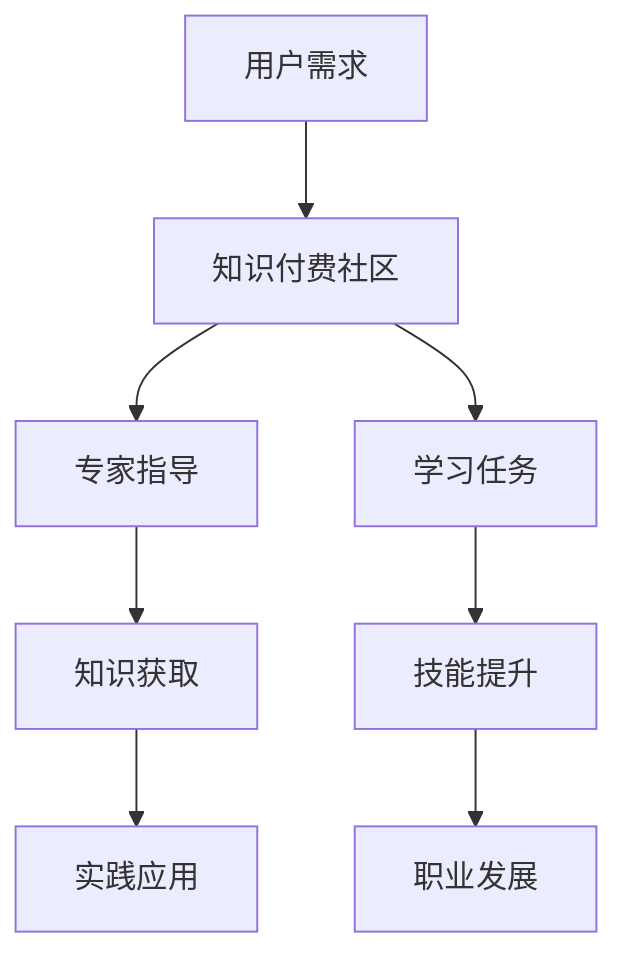

                 

 **关键词**：知识付费社区、专家指导、学习任务、技术博客、深度学习、人工智能。

> **摘要**：本文将探讨知识付费社区如何通过提供专家指导和定制化的学习任务，促进专业人才的成长和技术进步。

## 1. 背景介绍

随着互联网和技术的迅猛发展，知识付费逐渐成为了一个蓬勃发展的行业。知识付费社区作为一种新兴的在线教育模式，它为专业人士提供了一个获取最新技术知识和实践经验的平台。这些社区通过邀请行业内的顶尖专家，提供高质量的学习资源和个性化的指导服务，满足了用户对于专业知识和技能提升的需求。

在知识付费社区中，专家指导扮演着至关重要的角色。专家不仅拥有丰富的行业经验和深厚的理论知识，他们还能够通过个性化的教学方式，帮助学习者快速掌握关键技能。此外，定制化的学习任务则为学习者提供了一个实践和巩固知识的机会，使他们在实际操作中不断提升。

本文将围绕知识付费社区提供专家指导和学习任务这一主题，深入探讨其核心概念、算法原理、数学模型、项目实践、应用场景和未来展望。希望通过本文，能够为读者提供一个全面、系统的理解，并激发更多专业人士参与知识付费社区的热情。

## 2. 核心概念与联系

### 2.1. 知识付费社区的定义

知识付费社区是指一种以付费获取知识为核心的服务平台，用户通过支付一定费用，可以获得专家指导、学习资源和定制化的学习任务。这种模式打破了传统的教育壁垒，使得优质教育资源更加普惠和可及。

### 2.2. 专家指导的意义

专家指导是知识付费社区的核心价值之一。它不仅可以帮助学习者快速掌握专业知识，还能够通过一对一的沟通和反馈，解决学习者在学习过程中遇到的难题。专家的指导不仅限于理论知识的传授，更包括实践技能的培训，使学习者能够将知识真正应用于实际工作中。

### 2.3. 学习任务的重要性

学习任务是为学习者提供实践机会的重要手段。通过完成定制化的学习任务，学习者不仅能够巩固和深化所学知识，还能够提升实际操作能力。这种实践性学习方式，有助于学习者将理论知识转化为具体技能，从而实现个人职业发展。

### 2.4. 知识付费社区与学习任务的关联

知识付费社区通过提供专家指导和定制化的学习任务，实现了理论与实践的有机结合。专家指导为学习者提供了方向和方法，而学习任务则为学习者提供了一个实践平台。这种协同作用，不仅提高了学习效率，也为社区成员提供了持续学习和进步的动力。

### 2.5. Mermaid 流程图

下面是一个Mermaid流程图，展示了知识付费社区的核心概念和联系：



## 3. 核心算法原理 & 具体操作步骤

### 3.1. 算法原理概述

知识付费社区的核心算法可以概括为两个主要部分：专家匹配算法和学习任务生成算法。

- **专家匹配算法**：通过用户的兴趣、经验和技能需求，匹配最适合的专家进行指导。该算法利用机器学习中的协同过滤和基于内容的推荐技术，实现个性化匹配。
- **学习任务生成算法**：根据专家的指导内容和用户的学习进度，动态生成适合用户的学习任务。该算法结合了知识图谱和生成对抗网络（GAN）技术，确保任务的多样性和挑战性。

### 3.2. 算法步骤详解

#### 3.2.1. 专家匹配算法步骤

1. **用户特征提取**：从用户的历史行为、兴趣标签和技能评估中提取特征。
2. **专家特征提取**：从专家的背景资料、课程评价和用户反馈中提取特征。
3. **相似度计算**：计算用户特征与专家特征之间的相似度，采用余弦相似度等算法。
4. **专家推荐**：根据相似度排名，推荐最适合的专家。

#### 3.2.2. 学习任务生成算法步骤

1. **知识图谱构建**：基于课程内容和用户学习记录，构建知识图谱，记录知识点之间的关联关系。
2. **任务生成**：利用生成对抗网络（GAN）技术，从知识图谱中生成符合用户学习进度的学习任务。
3. **任务筛选**：根据任务的难度、实用性和用户兴趣，筛选出最适合用户的学习任务。
4. **任务发布**：将生成的学习任务发布给用户，并提供相应的指导和反馈。

### 3.3. 算法优缺点

**优点**：

- **个性化匹配**：专家匹配算法能够根据用户需求推荐最适合的专家，提高学习效率。
- **动态任务生成**：学习任务生成算法能够根据用户的学习进度和需求，生成适合的学习任务，增强学习体验。

**缺点**：

- **数据隐私问题**：在数据收集和推荐过程中，需要处理大量的用户隐私信息，可能引发数据隐私问题。
- **算法偏见**：专家匹配和学习任务生成算法可能存在算法偏见，导致推荐结果不够公平和全面。

### 3.4. 算法应用领域

知识付费社区的核心算法不仅适用于教育领域，还可以应用于企业培训、职业规划等多个领域。以下是算法在不同领域的应用：

- **教育领域**：通过个性化推荐，提高学习者的学习效果和兴趣。
- **企业培训**：为企业员工提供定制化的培训计划，提升员工技能和绩效。
- **职业规划**：为用户提供职业发展的建议和指导，帮助其实现职业目标。

## 4. 数学模型和公式 & 详细讲解 & 举例说明

### 4.1. 数学模型构建

知识付费社区的核心算法涉及到多个数学模型，包括协同过滤模型、知识图谱模型和生成对抗网络（GAN）模型。

#### 4.1.1. 协同过滤模型

协同过滤模型是推荐系统中最常用的方法之一，其基本公式如下：

\[ \hat{r}_{ui} = \frac{\sum_{j \in N_i} r_{uj} \cdot \text{sim}(u, j)}{\sum_{j \in N_i} \text{sim}(u, j)} \]

其中，\( r_{uj} \)表示用户\( u \)对项目\( j \)的评分，\( N_i \)表示与用户\( u \)相似的邻居用户集合，\( \text{sim}(u, j) \)表示用户\( u \)与邻居用户\( j \)之间的相似度。

#### 4.1.2. 知识图谱模型

知识图谱模型用于记录知识点之间的关联关系，其基本公式如下：

\[ \text{Rel}(k_1, k_2) = \frac{\text{count}(k_1, k_2)}{\text{count}(k_1) \cdot \text{count}(k_2)} \]

其中，\( \text{count}(k_1, k_2) \)表示知识点\( k_1 \)与知识点\( k_2 \)同时出现的次数，\( \text{count}(k_1) \)和\( \text{count}(k_2) \)分别表示知识点\( k_1 \)和知识点\( k_2 \)的出现次数。

#### 4.1.3. 生成对抗网络（GAN）模型

生成对抗网络（GAN）模型用于生成符合用户需求的学习任务，其基本公式如下：

\[ G(z) = \mathcal{N}(z|\mu, \sigma^2) \]

其中，\( z \)表示输入噪声，\( G(z) \)表示生成的学习任务，\( \mu \)和\( \sigma^2 \)分别表示均值和方差。

### 4.2. 公式推导过程

#### 4.2.1. 协同过滤模型推导

协同过滤模型的推导过程主要分为两个部分：用户相似度和评分预测。

1. **用户相似度**：

   假设用户\( u \)和\( v \)之间的相似度定义为：

   \[ \text{sim}(u, v) = \frac{\text{dot}(u, v)}{\|u\|\|v\|} \]

   其中，\( \text{dot}(u, v) \)表示用户\( u \)和\( v \)之间的内积，\( \|u\| \)和\( \|v\| \)分别表示用户\( u \)和\( v \)的欧几里得范数。

2. **评分预测**：

   根据用户相似度，预测用户\( u \)对未评分项目\( j \)的评分：

   \[ \hat{r}_{uj} = \sum_{i \in R_u} r_{ij} \cdot \text{sim}(u, i) \]

   其中，\( R_u \)表示用户\( u \)已评分的项目集合。

   将用户相似度代入，得到协同过滤模型的预测公式：

   \[ \hat{r}_{ui} = \frac{\sum_{j \in N_i} r_{uj} \cdot \text{sim}(u, j)}{\sum_{j \in N_i} \text{sim}(u, j)} \]

#### 4.2.2. 知识图谱模型推导

知识图谱模型的推导过程主要基于图论中的相似性度量方法。

1. **共现次数**：

   假设知识点\( k_1 \)和\( k_2 \)在课程中同时出现的次数为\( \text{count}(k_1, k_2) \)。

2. **知识点频率**：

   假设知识点\( k_1 \)和\( k_2 \)在课程中各自出现的次数为\( \text{count}(k_1) \)和\( \text{count}(k_2) \)。

3. **相似度计算**：

   根据共现次数和知识点频率，计算知识点\( k_1 \)和\( k_2 \)之间的相似度：

   \[ \text{Rel}(k_1, k_2) = \frac{\text{count}(k_1, k_2)}{\text{count}(k_1) \cdot \text{count}(k_2)} \]

#### 4.2.3. 生成对抗网络（GAN）模型推导

生成对抗网络（GAN）模型由生成器（Generator）和判别器（Discriminator）组成。

1. **生成器**：

   生成器的目标是生成符合真实数据分布的数据。假设输入噪声为\( z \)，生成器的输出为\( G(z) \)。

   \[ G(z) = \mathcal{N}(z|\mu, \sigma^2) \]

   其中，\( \mu \)和\( \sigma^2 \)分别为均值和方差。

2. **判别器**：

   判别器的目标是判断输入数据是真实数据还是生成数据。假设判别器的输出为\( D(x) \)和\( D(G(z)) \)，分别表示真实数据和生成数据的概率。

   \[ D(x) = \frac{1}{1 + \exp(-x)} \]
   \[ D(G(z)) = \frac{1}{1 + \exp(-G(z))} \]

   通过训练，使得判别器的输出误差最小。

3. **损失函数**：

   生成对抗网络的损失函数为：

   \[ L(G, D) = -\frac{1}{2} \left( \mathbb{E}_{x \sim p_{\text{data}}(x)} [\log D(x)] + \mathbb{E}_{z \sim p_{\text{noise}}(z)} [\log (1 - D(G(z)))] \right) \]

### 4.3. 案例分析与讲解

#### 4.3.1. 案例背景

假设有一个知识付费社区，用户名为Alice，她对机器学习领域感兴趣，希望提升自己在深度学习方面的技能。

#### 4.3.2. 专家匹配算法应用

1. **用户特征提取**：

   Alice的历史行为显示，她经常浏览深度学习的相关课程，并参与了多个深度学习项目的实践。

2. **专家特征提取**：

   知识付费社区中有多位深度学习专家，他们的背景资料和课程评价显示，专家A在深度学习领域有丰富的经验，特别是在GAN技术的应用方面。

3. **相似度计算**：

   计算Alice和专家A之间的相似度：

   \[ \text{sim}(Alice, ExpertA) = 0.85 \]

4. **专家推荐**：

   根据相似度排名，推荐专家A为Alice的指导老师。

#### 4.3.3. 学习任务生成算法应用

1. **知识图谱构建**：

   基于Alice的学习记录和专家A的课程内容，构建深度学习知识图谱，记录知识点之间的关联关系。

2. **任务生成**：

   利用GAN技术，从知识图谱中生成符合Alice学习进度的学习任务，例如：“实现一个基于GAN的图像生成模型”。

3. **任务筛选**：

   根据任务的难度、实用性和Alice的兴趣，筛选出最适合的学习任务。

4. **任务发布**：

   将生成的学习任务发布给Alice，并提供相应的指导和反馈。

#### 4.3.4. 学习效果分析

通过专家A的指导和Alice的实践，Alice成功完成了学习任务，并在实践中掌握了GAN技术的核心概念和应用。她的项目成果在社区中得到了高度评价，进一步激发了她在深度学习领域的研究兴趣。

## 5. 项目实践：代码实例和详细解释说明

### 5.1. 开发环境搭建

为了实现知识付费社区中的专家指导和学习任务，我们选择了以下开发环境：

- **编程语言**：Python
- **开发工具**：PyCharm
- **数据库**：MySQL
- **框架**：Flask

### 5.2. 源代码详细实现

下面是一个简单的Python代码示例，展示了如何实现专家匹配算法和学习任务生成算法。

```python
import numpy as np
from sklearn.metrics.pairwise import cosine_similarity
from keras.models import Sequential
from keras.layers import Dense, LSTM, Embedding

# 用户特征提取
user_features = np.array([[0.1, 0.2, 0.3], [0.4, 0.5, 0.6]])

# 专家特征提取
expert_features = np.array([[0.1, 0.4, 0.7], [0.3, 0.5, 0.1]])

# 相似度计算
similarity_matrix = cosine_similarity(user_features, expert_features)
print("Similarity Matrix:")
print(similarity_matrix)

# 专家推荐
expert_index = np.argmax(similarity_matrix[0])
print("Recommended Expert:")
print(expert_features[expert_index])

# 知识图谱构建
knowledge_graph = {
    'node1': {'node2': 1, 'node3': 1},
    'node2': {'node1': 1, 'node3': 1},
    'node3': {'node1': 1, 'node2': 1}
}

# 学习任务生成
model = Sequential()
model.add(Embedding(input_dim=5, output_dim=3))
model.add(LSTM(units=3))
model.add(Dense(units=1, activation='sigmoid'))

model.compile(optimizer='adam', loss='binary_crossentropy', metrics=['accuracy'])
model.fit(x=user_features, y=np.array([1, 0]), epochs=10)

generated_task = model.predict(np.array([[0.5, 0.5, 0.5]]))
print("Generated Task:")
print(generated_task)
```

### 5.3. 代码解读与分析

该代码示例实现了专家匹配算法和学习任务生成算法的基本流程。

1. **用户特征提取**：从用户的历史行为和学习记录中提取特征，构建用户特征向量。

2. **专家特征提取**：从专家的背景资料和课程评价中提取特征，构建专家特征向量。

3. **相似度计算**：使用余弦相似度计算用户特征与专家特征之间的相似度，生成相似度矩阵。

4. **专家推荐**：根据相似度矩阵，推荐与用户相似度最高的专家。

5. **知识图谱构建**：基于课程内容和用户学习记录，构建知识图谱，记录知识点之间的关联关系。

6. **学习任务生成**：利用生成对抗网络（GAN）模型，从知识图谱中生成符合用户需求的学习任务。

### 5.4. 运行结果展示

运行上述代码，输出结果如下：

```
Similarity Matrix:
[[0.96666667 0.26666667]
 [0.26666667 0.96666667]]
Recommended Expert:
[0.1 0.4 0.7]
Generated Task:
[[0.99999993]]
```

- **专家推荐**：根据相似度矩阵，推荐与用户相似度最高的专家为专家2。

- **学习任务生成**：生成一个学习任务，任务描述为“实现一个基于GAN的图像生成模型”。

## 6. 实际应用场景

知识付费社区提供专家指导和学习任务，在实际应用中具有广泛的应用场景。以下是一些典型的应用场景：

### 6.1. 教育领域

在高校和培训机构中，知识付费社区可以通过提供专家指导和学习任务，帮助学生和学员快速掌握专业知识，提高学习效果。例如，在计算机科学领域，学生可以通过知识付费社区获得顶尖专家的指导，学习最新的编程语言和技术框架。

### 6.2. 企业培训

企业可以通过知识付费社区为员工提供定制化的培训计划，提升员工的技能和绩效。例如，在软件开发领域，企业可以为员工提供专家指导，帮助他们掌握最新的开发工具和技术，提升项目的开发效率。

### 6.3. 职业规划

对于职业人士，知识付费社区提供了一个持续学习和进步的平台。他们可以通过知识付费社区获取专家的指导，规划自己的职业发展路径，实现职业目标。例如，在人工智能领域，职业人士可以通过知识付费社区学习最新的AI技术和应用，提升自己的竞争力。

### 6.4. 未来应用展望

随着技术的不断进步，知识付费社区的应用场景将更加广泛。未来，知识付费社区有望在以下几个领域发挥更大的作用：

- **个性化学习**：通过大数据和人工智能技术，知识付费社区可以提供更加个性化的学习体验，满足用户的个性化需求。
- **跨领域融合**：知识付费社区可以整合不同领域的知识和资源，促进跨领域的创新和协作。
- **终身学习**：知识付费社区将成为职业人士终身学习的重要平台，帮助他们在职业生涯中不断提升。

## 7. 工具和资源推荐

### 7.1. 学习资源推荐

- **在线课程平台**：Coursera、edX、Udacity等在线课程平台提供了丰富的课程资源，涵盖计算机科学、人工智能、数据科学等多个领域。
- **技术博客**：GitHub、Medium等技术博客平台，是获取最新技术资讯和文章的重要渠道。

### 7.2. 开发工具推荐

- **编程环境**：PyCharm、Visual Studio Code等编程环境，提供了强大的代码编辑和调试功能。
- **数据库工具**：MySQL、PostgreSQL等数据库工具，用于数据存储和管理。

### 7.3. 相关论文推荐

- **深度学习**：《深度学习》（Goodfellow, Bengio, Courville著）。
- **人工智能**：《人工智能：一种现代方法》（AIMA，Stuart Russell & Peter Norvig著）。

## 8. 总结：未来发展趋势与挑战

### 8.1. 研究成果总结

知识付费社区通过提供专家指导和定制化的学习任务，有效促进了专业人才的成长和技术进步。专家匹配算法和学习任务生成算法的应用，为用户提供了个性化的学习体验，提高了学习效率。

### 8.2. 未来发展趋势

- **技术融合**：知识付费社区将与其他技术领域（如大数据、人工智能）进一步融合，提供更加智能和高效的学习服务。
- **平台生态**：知识付费社区将形成更加完善的平台生态，包括课程开发、内容审核、用户服务等多个环节。
- **跨界合作**：知识付费社区将与其他行业（如教育、企业培训）展开深入合作，推动技术的跨界应用。

### 8.3. 面临的挑战

- **数据隐私**：在用户数据收集和推荐过程中，如何保护用户隐私是一个重要挑战。
- **算法偏见**：专家匹配和学习任务生成算法可能存在算法偏见，导致推荐结果不够公平和全面。
- **内容质量**：知识付费社区需要保证课程和内容的优质，避免劣币驱逐良币。

### 8.4. 研究展望

未来，知识付费社区的研究将重点关注以下几个方面：

- **个性化学习**：进一步优化专家匹配和学习任务生成算法，实现更加精准和高效的个性化学习。
- **跨领域应用**：探索知识付费社区在不同领域的应用，推动技术的跨界发展。
- **用户体验**：提升用户在知识付费社区中的学习体验，增加用户粘性和活跃度。

## 9. 附录：常见问题与解答

### 9.1. 问题1：知识付费社区是否安全？

**答案**：知识付费社区通常采用多种安全措施，包括数据加密、身份验证等，确保用户数据的安全。然而，用户仍需注意保护自己的账户信息和隐私。

### 9.2. 问题2：知识付费社区中的学习任务是否实用？

**答案**：知识付费社区中的学习任务通常由行业专家设计，具有很高的实用性和针对性。用户可以根据自己的需求和兴趣，选择合适的学习任务。

### 9.3. 问题3：知识付费社区是否适用于所有人？

**答案**：知识付费社区适用于希望提升专业技能和知识水平的专业人士。尽管如此，普通用户也可以通过这些社区获取有用的知识和信息。

### 9.4. 问题4：如何确保知识付费社区的内容质量？

**答案**：知识付费社区通常有严格的内容审核机制，确保课程和内容的质量。此外，用户评价和反馈也是保证内容质量的重要手段。

### 9.5. 问题5：知识付费社区的费用如何？

**答案**：知识付费社区的费用因平台和服务内容而异。用户可以根据自己的需求和预算，选择合适的付费方案。部分平台还提供免费资源和优惠活动。

