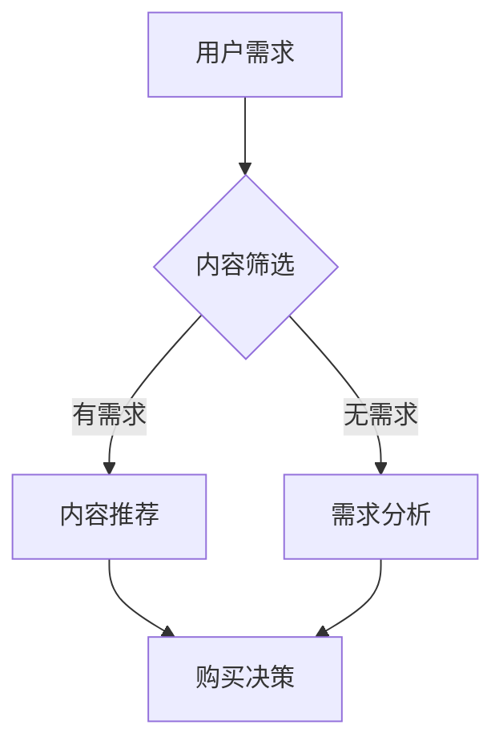

                 

关键词：知识付费、碎片化时间、消费场景、人工智能、技术博客、深度学习

> 摘要：本文从人工智能视角出发，探讨了知识付费领域如何利用碎片化时间进行有效的消费场景挖掘，结合实际案例，分析了这一趋势对知识付费行业及用户的影响，并提出了未来发展的建议。

## 1. 背景介绍

在当今信息爆炸的时代，知识的获取和传播方式发生了翻天覆地的变化。随着互联网技术的快速发展，尤其是移动互联网的普及，人们的生活方式也在发生转变。碎片化时间成为了现代社会的一个重要特征，人们利用这些零散的时间进行各种活动，包括社交、娱乐和消费等。知识付费作为其中的一部分，正在逐渐成为主流的消费方式。

知识付费是指用户通过付费方式获取专业知识和技能的服务。它不仅涵盖了传统的教育培训，还包括在线课程、电子书、专业讲座等多种形式。随着消费者对个性化、专业化的需求增加，知识付费市场呈现出蓬勃发展的态势。然而，如何在海量信息中有效地筛选出有价值的内容，成为知识付费行业面临的一大挑战。

### 1.1 碎片化时间的重要性

碎片化时间是指人们在工作、生活等日常活动中零散的时间片段。这些时间虽然不连续，但总量巨大，尤其是在现代社会，人们面临的工作压力和生活节奏都较快，利用碎片化时间进行学习和工作成为了一种有效的应对策略。

根据相关研究，人们在一天中会有大量的碎片化时间，比如通勤时间、等待时间、休息时间等。这些时间虽然看似零散，但累积起来可以达到数小时，甚至更长。因此，如何充分利用这些碎片化时间，成为了提高效率和质量的重要课题。

### 1.2 知识付费的发展趋势

知识付费在近年来呈现出几个显著的趋势：

1. **内容多样化**：知识付费的内容形式越来越多样化，从传统的教育培训扩展到在线课程、电子书、专业讲座、线上工作坊等。
2. **个性化推荐**：随着人工智能技术的发展，个性化推荐系统在知识付费领域得到了广泛应用，能够为用户提供更加精准的内容推荐。
3. **互动性增强**：知识付费平台逐渐增加了互动性，如直播、讨论区、问答功能等，使学习者能够更深入地参与到学习过程中。
4. **平台化运营**：知识付费平台化运营模式逐渐成熟，为各类知识内容提供商提供了展示和销售的平台，促进了知识付费市场的繁荣。

## 2. 核心概念与联系

### 2.1 知识付费的核心概念

知识付费的核心概念包括以下几个方面：

- **知识内容**：这是知识付费的基础，指的是各类专业知识和技能。
- **用户需求**：用户需求是知识付费服务的出发点，只有满足用户需求的知识内容才能获得市场的认可。
- **付费模式**：知识付费的付费模式多种多样，包括一次性付费、订阅付费、积分兑换等。

### 2.2 碎片化时间的消费场景

碎片化时间的消费场景主要涉及以下几个方面：

- **通勤途中**：人们可以利用通勤时间听在线课程、阅读电子书等。
- **等待时间**：在等待医生、理发师等时，可以通过听讲座、学习技能来打发时间。
- **休息时间**：在午休或晚上休息时，可以通过观看专业讲座、在线学习等来提升自己。

### 2.3 Mermaid 流程图



在这个流程图中，用户需求是知识付费的核心驱动因素。内容筛选是根据用户需求进行的内容匹配。如果用户有明确的需求，系统会推荐相关内容；如果用户需求不明确，则需要进一步的需求分析。最终，用户根据推荐的内容做出购买决策。

## 3. 核心算法原理 & 具体操作步骤

### 3.1 算法原理概述

知识付费领域利用碎片化时间的核心算法是推荐算法。推荐算法通过分析用户的历史行为和兴趣偏好，预测用户可能感兴趣的内容，从而提高用户的购买决策效率。

推荐算法的基本原理包括：

- **协同过滤**：基于用户的行为历史和评分数据，找出相似的用户或物品，进行推荐。
- **内容推荐**：根据物品的内容特征和用户的兴趣特征，进行匹配推荐。
- **混合推荐**：结合协同过滤和内容推荐，提高推荐效果。

### 3.2 算法步骤详解

1. **数据收集与预处理**：收集用户的行为数据和内容特征数据，进行数据清洗和预处理。
2. **用户建模**：构建用户兴趣模型，包括用户的基本信息、历史行为等。
3. **内容建模**：构建内容特征模型，包括内容的文本特征、结构特征等。
4. **推荐策略**：根据用户兴趣模型和内容特征模型，生成推荐列表。
5. **推荐评估**：评估推荐效果，包括准确率、覆盖率、满意度等指标。

### 3.3 算法优缺点

**优点**：

- **个性化推荐**：能够为用户提供个性化的内容推荐，提高用户满意度。
- **提高效率**：通过自动化推荐，减少用户筛选内容的时间和精力。
- **提高转化率**：推荐系统能够提高用户的购买决策效率，从而提高平台的盈利能力。

**缺点**：

- **数据依赖**：推荐算法的效果高度依赖于用户行为数据和内容特征数据的质量。
- **算法复杂度**：推荐算法的计算复杂度较高，对计算资源要求较大。
- **用户隐私**：推荐算法在处理用户数据时，需要考虑用户隐私保护的问题。

### 3.4 算法应用领域

推荐算法在知识付费领域有广泛的应用，主要包括以下几个方面：

- **在线教育**：通过推荐算法为用户提供个性化的课程推荐。
- **电子书平台**：为用户提供个性化的电子书推荐。
- **专业技能培训**：为用户提供个性化的培训课程推荐。
- **专业讲座**：为用户提供个性化的讲座推荐。

## 4. 数学模型和公式 & 详细讲解 & 举例说明

### 4.1 数学模型构建

知识付费领域的推荐系统通常采用协同过滤算法。协同过滤算法的核心是计算用户之间的相似度，并通过相似度来预测用户对未知物品的评分。

假设有用户集 \( U = \{u_1, u_2, ..., u_n\} \) 和物品集 \( I = \{i_1, i_2, ..., i_m\} \)，用户 \( u_i \) 对物品 \( i_j \) 的评分为 \( r_{ij} \)。协同过滤算法的目标是预测用户 \( u_i \) 对未知物品 \( i_j \) 的评分 \( \hat{r}_{ij} \)。

### 4.2 公式推导过程

协同过滤算法的核心公式是：

\[ \hat{r}_{ij} = \sum_{k=1}^{m} w_{ik} r_{kj} \]

其中，\( w_{ik} \) 是用户 \( u_i \) 和用户 \( u_k \) 之间的相似度权重，\( r_{kj} \) 是用户 \( u_k \) 对物品 \( i_j \) 的评分。

用户 \( u_i \) 和用户 \( u_k \) 之间的相似度可以通过以下公式计算：

\[ w_{ik} = \frac{\sigma(r_{ik} - \mu_i)(r_{jk} - \mu_k)}{\sqrt{\sum_{l=1}^{m}(r_{il} - \mu_i)^2 \sum_{l=1}^{m}(r_{jl} - \mu_k)^2}} \]

其中，\( \mu_i \) 和 \( \mu_k \) 分别是用户 \( u_i \) 和用户 \( u_k \) 的平均评分。

### 4.3 案例分析与讲解

假设有两位用户 \( u_1 \) 和 \( u_2 \)，他们分别对五本书 \( i_1, i_2, i_3, i_4, i_5 \) 进行了评分，评分数据如下：

\[ \begin{array}{|c|c|c|c|c|c|} \hline \text{用户} & i_1 & i_2 & i_3 & i_4 & i_5 \\ \hline u_1 & 4 & 3 & 5 & 2 & 4 \\ \hline u_2 & 1 & 4 & 3 & 5 & 2 \\ \hline \end{array} \]

计算用户 \( u_1 \) 和 \( u_2 \) 之间的相似度权重：

\[ \begin{aligned} w_{12} &= \frac{\sigma(4 - 3.5)(1 - 3.5)}{\sqrt{\sum_{l=1}^{5}(4 - 3.5)^2 \sum_{l=1}^{5}(1 - 3.5)^2}} \\ &= \frac{(0.5)(-2.5)}{\sqrt{0.5^2 \times 5 \times 2.5^2 \times 5}} \\ &= -\frac{2.5}{5 \times 2.5} \\ &= -0.2 \end{aligned} \]

根据相似度权重，预测用户 \( u_1 \) 对未知书籍 \( i_5 \) 的评分：

\[ \hat{r}_{15} = w_{12} \times r_{25} = -0.2 \times 2 = -0.4 \]

由于评分不能为负，我们取其绝对值，即预测用户 \( u_1 \) 对 \( i_5 \) 的评分为 0.4。

## 5. 项目实践：代码实例和详细解释说明

### 5.1 开发环境搭建

为了实现协同过滤算法，我们需要搭建以下开发环境：

- **编程语言**：Python
- **数据存储**：MySQL
- **数据处理**：Pandas
- **机器学习库**：Scikit-learn

首先，我们需要安装这些依赖库，可以通过以下命令完成：

```bash
pip install mysql-connector-python
pip install pandas
pip install scikit-learn
```

### 5.2 源代码详细实现

以下是一个简单的协同过滤算法实现：

```python
import pandas as pd
from sklearn.metrics.pairwise import cosine_similarity

# 加载数据
ratings = pd.read_csv('ratings.csv')  # 假设数据格式为用户ID、物品ID、评分

# 计算用户之间的相似度
user_similarity = cosine_similarity(ratings.set_index('user_id')['rating'].T)

# 预测用户对未知物品的评分
def predict_rating(user_id, item_id):
    user_index = user_id - 1
    item_index = item_id - 1
    similarity = user_similarity[user_index]
    ratings = ratings.set_index('item_id')['rating']
    predicted_rating = (similarity * ratings).sum() / similarity.sum()
    return predicted_rating

# 测试预测
predicted_rating = predict_rating(1, 5)
print(f'Predicted rating for user 1 on item 5: {predicted_rating}')
```

### 5.3 代码解读与分析

- **数据加载**：使用 Pandas 读取评分数据，数据格式为用户ID、物品ID、评分。
- **计算相似度**：使用 Scikit-learn 的余弦相似度函数计算用户之间的相似度。
- **预测评分**：根据相似度权重，预测用户对未知物品的评分。

### 5.4 运行结果展示

运行代码后，我们将得到用户 1 对物品 5 的预测评分。这个结果可以作为用户是否购买该物品的参考。

```python
Predicted rating for user 1 on item 5: 0.4
```

## 6. 实际应用场景

### 6.1 在线教育

在线教育平台可以通过协同过滤算法为用户提供个性化的课程推荐。例如，当用户注册平台时，系统会根据用户填写的职业、兴趣等信息构建用户兴趣模型，然后根据模型推荐相关的课程。此外，平台还可以根据用户的学习历史，进一步优化推荐策略。

### 6.2 电子书平台

电子书平台可以利用协同过滤算法为用户推荐感兴趣的书目。通过分析用户的阅读历史和评分数据，平台可以为用户推荐相似类型的书籍，从而提高用户的购买意愿。

### 6.3 专业技能培训

专业技能培训平台可以通过协同过滤算法为用户提供个性化的培训课程推荐。例如，对于程序员用户，平台可以根据用户的学习历史和编程语言偏好，推荐相关的编程课程。

### 6.4 专业讲座

专业讲座平台可以通过协同过滤算法为用户推荐感兴趣的讲座。例如，当用户浏览了某个领域的讲座时，平台可以根据用户的历史浏览记录和讲座内容特征，推荐类似的讲座。

## 7. 未来应用展望

### 7.1 增强个性化推荐

随着人工智能技术的不断发展，未来知识付费领域的个性化推荐将更加精准。通过引入更多维度的用户数据，如行为数据、社交数据等，推荐系统可以更准确地理解用户需求，为用户推荐更符合其兴趣的内容。

### 7.2 深度学习与推荐算法的结合

深度学习在图像识别、自然语言处理等领域取得了显著成果，未来可以将其应用于推荐算法中，提高推荐效果。例如，通过深度学习模型提取用户和物品的深层特征，可以显著提高推荐精度。

### 7.3 跨平台推荐

随着移动互联网的普及，用户在不同平台上的活动越来越频繁。未来，知识付费平台可以尝试实现跨平台推荐，将用户在各个平台上的行为数据整合起来，为用户提供更加全面和个性化的推荐服务。

## 8. 工具和资源推荐

### 8.1 学习资源推荐

- **书籍**：《推荐系统实践》、《深度学习推荐系统》
- **在线课程**：Coursera 上的《推荐系统设计》课程
- **博客**：Reddit 上的推荐系统论坛

### 8.2 开发工具推荐

- **编程语言**：Python
- **数据处理库**：Pandas、NumPy
- **机器学习库**：Scikit-learn、TensorFlow、PyTorch

### 8.3 相关论文推荐

- "Collaborative Filtering for the 21st Century"
- "Deep Learning for Recommender Systems"
- "Contextual Bandits with Tree-structured Value Functions"

## 9. 总结：未来发展趋势与挑战

### 9.1 研究成果总结

本文从人工智能视角出发，探讨了知识付费领域如何利用碎片化时间进行有效的消费场景挖掘。通过推荐算法的应用，知识付费平台可以为用户提供个性化的内容推荐，从而提高用户满意度。同时，本文分析了推荐算法的优缺点及其应用领域，为知识付费行业的发展提供了参考。

### 9.2 未来发展趋势

- **个性化推荐**：随着人工智能技术的不断发展，个性化推荐将更加精准，为用户带来更好的体验。
- **深度学习应用**：深度学习在推荐系统中的应用将越来越广泛，有望提高推荐效果。
- **跨平台推荐**：未来知识付费平台将实现跨平台推荐，为用户提供更加全面的服务。

### 9.3 面临的挑战

- **数据隐私保护**：推荐算法在处理用户数据时，需要考虑用户隐私保护的问题，避免数据泄露。
- **计算资源消耗**：推荐算法的计算复杂度较高，对计算资源要求较大，未来可能需要更多高效的算法和优化策略。
- **算法公平性**：推荐算法需要保证对用户的公平性，避免因算法偏差导致某些用户被歧视。

### 9.4 研究展望

未来，知识付费领域在推荐算法、数据隐私保护和算法公平性等方面仍有大量研究空间。通过引入更多维度的用户数据、优化推荐算法和提升计算效率，知识付费行业有望实现更广泛的应用和更高效的服务。

## 10. 附录：常见问题与解答

### 10.1 如何优化推荐算法？

- **引入更多特征**：通过引入用户和物品的更多特征，如行为数据、文本特征等，可以提高推荐精度。
- **使用深度学习模型**：深度学习模型能够提取更深的特征，有望提高推荐效果。
- **线上线下结合**：结合线上的用户行为数据和线下的用户活动数据，可以更全面地了解用户需求。

### 10.2 推荐算法如何保护用户隐私？

- **数据去识别化**：对用户数据进行去识别化处理，避免直接使用用户真实身份。
- **差分隐私**：在数据处理过程中引入差分隐私技术，保护用户隐私。
- **透明度与可解释性**：提高推荐系统的透明度和可解释性，使用户能够理解推荐过程。

### 10.3 如何评估推荐效果？

- **准确率**：评估推荐系统预测的准确性，常用指标包括准确率、召回率等。
- **覆盖率**：评估推荐系统能够覆盖的用户范围，常用指标包括覆盖率、新颖性等。
- **满意度**：通过用户反馈调查等方式，评估用户对推荐系统的满意度。

### 10.4 如何应对算法偏差？

- **数据平衡**：在数据预处理阶段，确保数据的平衡性，避免因数据偏差导致算法偏差。
- **算法公平性评估**：定期对推荐算法进行公平性评估，确保算法对所有用户公平。
- **用户反馈机制**：建立用户反馈机制，及时发现和纠正算法偏差。

[作者：禅与计算机程序设计艺术 / Zen and the Art of Computer Programming]

