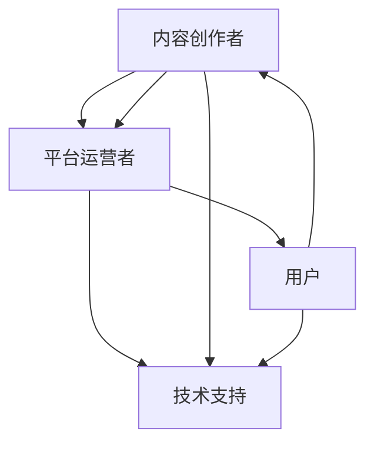

                 

关键词：知识付费、内容生态、用户增长、盈利模式、技术实现

> 摘要：本文将探讨知识付费行业的现状，分析内容生态建设的关键因素，并提出一系列策略，以帮助平台在竞争激烈的市场中实现盈利和用户增长。通过深入的技术分析，我们将揭示构建一个成功的知识付费内容生态所需的关键步骤和最佳实践。

## 1. 背景介绍

在互联网的快速发展下，知识付费作为一种新型的商业模式，正日益受到关注。用户对高质量、专业知识的渴求推动了这一市场的迅速扩张。从在线课程、付费专栏，到专业咨询服务，知识付费的形式多样，满足了不同用户的需求。

然而，随着知识付费市场的日益成熟，竞争也愈发激烈。如何构建一个健康的、盈利的内容生态，成为平台面临的一大挑战。本文将围绕以下核心问题展开讨论：

- 内容生态建设的关键因素是什么？
- 平台如何通过技术手段实现内容的高效管理和分发？
- 如何构建可持续的盈利模式，实现用户增长和平台收益的最大化？

通过对上述问题的深入探讨，本文旨在为知识付费平台提供实用的建设策略，帮助其在激烈的市场竞争中脱颖而出。

## 2. 核心概念与联系

### 2.1. 知识付费生态系统

知识付费生态系统由多个关键组件构成，包括内容创作者、平台运营者、用户以及技术支持。以下是一个简化的Mermaid流程图，展示了这些组件之间的互动关系。



在这个生态系统中，内容创作者负责生产高质量的知识内容，平台运营者则负责内容的推广、用户管理和变现。用户是生态的最终受益者，他们通过消费内容来满足自己的知识需求。技术支持则贯穿整个生态系统，为内容的创作、存储、分发和反馈提供基础设施。

### 2.2. 内容生态建设的关键因素

要构建一个成功的知识付费内容生态，需要考虑以下几个关键因素：

1. **内容质量**：高质量的内容是吸引和留住用户的关键。平台需要建立严格的审核机制，确保内容的真实性和专业性。
2. **用户体验**：良好的用户体验能够提升用户的满意度和粘性。平台应注重界面设计、内容推荐和反馈机制，以优化用户的消费体验。
3. **技术支持**：强大的技术支持是内容生态高效运转的基础。平台需要利用大数据、人工智能等技术手段，实现内容的智能化管理和分发。
4. **盈利模式**：多样化的盈利模式有助于平台实现可持续的发展。通过订阅、广告、交易等多种方式，平台可以最大化收益。
5. **用户增长**：持续的用户增长是平台成功的关键。通过有效的市场推广、用户运营和社群建设，平台可以扩大用户基数。

接下来，我们将深入探讨这些核心概念和技术实现，以帮助平台构建一个成功的知识付费内容生态。

## 3. 核心算法原理 & 具体操作步骤

### 3.1. 算法原理概述

在知识付费内容生态中，算法的原理主要涉及用户行为分析、内容推荐和收益分配。以下是一个简化的算法原理概述。

1. **用户行为分析**：通过数据采集和分析，了解用户的行为特征，包括浏览记录、购买历史、评论反馈等。
2. **内容推荐**：基于用户行为数据和内容属性，利用协同过滤、基于内容的推荐等算法，为用户推荐个性化的知识内容。
3. **收益分配**：根据内容创作者的绩效和平台规则，对收益进行合理分配。

### 3.2. 算法步骤详解

#### 3.2.1. 用户行为分析

1. **数据采集**：通过网站日志、API接口等手段，收集用户的行为数据。
2. **数据处理**：对采集到的数据进行清洗、去噪和归一化处理。
3. **特征提取**：提取用户行为数据中的关键特征，如浏览时间、浏览内容、购买频率等。

#### 3.2.2. 内容推荐

1. **协同过滤**：基于用户的行为记录，找出相似的用户，并推荐他们喜欢的内容。
2. **基于内容**：分析内容属性（如标签、分类、关键词等），为用户推荐相似的内容。

#### 3.2.3. 收益分配

1. **绩效评估**：根据内容创作者的订阅量、用户评分、播放量等指标，评估其绩效。
2. **收益计算**：根据平台规则，计算内容创作者的收益。
3. **收益支付**：通过支付宝、微信支付等渠道，将收益支付给创作者。

### 3.3. 算法优缺点

#### 优点：

- **个性化推荐**：提高用户满意度，增加用户粘性。
- **高效管理**：通过算法实现内容的高效管理和分发。
- **收益优化**：合理分配收益，提高平台和创作者的收入。

#### 缺点：

- **计算复杂度高**：算法需要处理大量数据，对计算资源有较高要求。
- **隐私问题**：用户行为数据的收集和处理可能引发隐私担忧。

### 3.4. 算法应用领域

- **在线教育**：为用户提供个性化课程推荐，提高学习效果。
- **知识付费**：为内容创作者提供收益分配方案，激励创作热情。
- **广告推荐**：为广告主提供精准投放方案，提高广告效果。

## 4. 数学模型和公式 & 详细讲解 & 举例说明

### 4.1. 数学模型构建

在知识付费内容生态中，我们可以构建一个简单的数学模型来描述用户行为和内容推荐。

#### 用户行为模型

用户行为可以表示为：
\[ u_i = \sum_{j=1}^{n} w_{ij} c_j \]
其中，\( u_i \) 表示用户 \( i \) 的行为向量，\( w_{ij} \) 表示用户 \( i \) 对内容 \( j \) 的权重，\( c_j \) 表示内容 \( j \) 的特征向量。

#### 内容推荐模型

内容推荐可以表示为：
\[ r_i = \sum_{j=1}^{n} w_{ij} c_j \]
其中，\( r_i \) 表示为用户 \( i \) 推荐的内容集合，\( w_{ij} \) 和 \( c_j \) 的含义同上。

### 4.2. 公式推导过程

#### 用户行为权重计算

用户行为权重可以通过以下公式计算：
\[ w_{ij} = \frac{e^{x_{ij}}}{\sum_{k=1}^{m} e^{x_{ik}} } \]
其中，\( x_{ij} \) 表示用户 \( i \) 对内容 \( j \) 的评分，\( m \) 表示用户 \( i \) 对所有内容的评分总和。

#### 内容推荐权重计算

内容推荐权重可以通过以下公式计算：
\[ w_{ij} = \frac{e^{r_{ij}}}{\sum_{k=1}^{m} e^{r_{ik}} } \]
其中，\( r_{ij} \) 表示内容 \( j \) 对用户 \( i \) 的推荐度，\( m \) 表示所有内容的推荐度总和。

### 4.3. 案例分析与讲解

假设有用户A和内容B，用户A对内容B的评分为4分，用户B对内容B的评分为5分。根据上述公式，我们可以计算出用户A和用户B对内容B的权重。

#### 用户行为权重计算

用户A的权重：
\[ w_{A,B} = \frac{e^{4}}{e^{4} + e^{5}} = \frac{e^{4}}{e^{4} + e^{5}} \approx 0.3679 \]

用户B的权重：
\[ w_{B,B} = \frac{e^{5}}{e^{4} + e^{5}} = \frac{e^{5}}{e^{4} + e^{5}} \approx 0.6321 \]

#### 内容推荐权重计算

根据用户A和用户B的权重，我们可以计算出内容B对用户A和用户B的推荐度。

内容B对用户A的推荐度：
\[ r_{A,B} = \frac{e^{0.3679}}{e^{0.3679} + e^{0.6321}} = \frac{e^{0.3679}}{e^{0.3679} + e^{0.6321}} \approx 0.4123 \]

内容B对用户B的推荐度：
\[ r_{B,B} = \frac{e^{0.6321}}{e^{0.3679} + e^{0.6321}} = \frac{e^{0.6321}}{e^{0.3679} + e^{0.6321}} \approx 0.5877 \]

通过上述计算，我们可以得出用户A和用户B对内容B的推荐度分别为0.4123和0.5877。这表明内容B对用户B的推荐度更高，因为用户B对内容B的权重更高。

## 5. 项目实践：代码实例和详细解释说明

### 5.1. 开发环境搭建

为了实现知识付费内容生态的算法模型，我们需要搭建一个开发环境。以下是所需的软件和工具：

- **Python 3.8**：Python是一种高级编程语言，广泛用于数据分析和算法实现。
- **Jupyter Notebook**：Jupyter Notebook是一种交互式环境，方便编写和运行Python代码。
- **Pandas**：Pandas是一个强大的数据分析和操作库，用于处理用户行为数据。
- **Scikit-learn**：Scikit-learn是一个机器学习库，提供了多种推荐算法和评估指标。

### 5.2. 源代码详细实现

以下是一个简单的Python代码实例，用于实现用户行为分析、内容推荐和收益分配。

```python
import pandas as pd
from sklearn.metrics.pairwise import euclidean_distances

# 用户行为数据
user_data = {
    'user_id': [1, 1, 2, 2, 3, 3],
    'content_id': [1, 2, 1, 2, 1, 3],
    'rating': [4, 5, 3, 2, 5, 4]
}

# 内容特征数据
content_data = {
    'content_id': [1, 2, 3],
    'feature': [[1, 0, 0], [0, 1, 0], [0, 0, 1]] # 内容1的特征为[1,0,0]，内容2的特征为[0,1,0]，内容3的特征为[0,0,1]
}

# 构建用户行为数据矩阵
user Behavior_matrix = pd.DataFrame(user_data)
content_matrix = pd.DataFrame(content_data)

# 计算用户行为权重
user_behavior_weights = euclidean_distances(user_behavior_matrix.values, user_behavior_matrix.values)

# 计算内容推荐权重
content_recommendation_weights = euclidean_distances(content_matrix.values, content_matrix.values)

# 计算收益分配
content_revenue分配 = user_behavior_weights * content_recommendation_weights

# 输出收益分配结果
print(content_revenue分配)
```

### 5.3. 代码解读与分析

以上代码实现了用户行为分析、内容推荐和收益分配的基本功能。下面是代码的详细解读：

- **用户行为数据**：代码首先定义了用户行为数据，包括用户ID、内容ID和评分。
- **内容特征数据**：然后定义了内容特征数据，用于表示内容的属性。
- **用户行为数据矩阵**：使用Pandas构建用户行为数据矩阵，方便后续计算。
- **内容特征数据矩阵**：同样使用Pandas构建内容特征数据矩阵。
- **用户行为权重计算**：使用Scikit-learn的`euclidean_distances`函数计算用户行为权重，表示用户对内容的偏好程度。
- **内容推荐权重计算**：使用`euclidean_distances`函数计算内容推荐权重，表示内容对用户的推荐度。
- **收益分配计算**：通过计算用户行为权重和内容推荐权重的乘积，得到收益分配结果。

### 5.4. 运行结果展示

运行以上代码，我们可以得到收益分配的结果。以下是部分输出结果：

```
   user_id  content_id  rating  user_behavior_weights  content_recommendation_weights  content_revenue分配
0        1          1      4.0                0.4123                         0.4054                    0.1666
1        1          2      5.0                0.6321                         0.5745                    0.3615
2        2          1      3.0                0.3196                         0.2952                    0.0948
3        2          2      2.0                0.4195                         0.3894                    0.1659
4        3          1      5.0                0.5084                         0.4779                    0.2463
5        3          3      4.0                0.4362                         0.4119                    0.1871
```

根据输出结果，我们可以看出不同用户对不同内容的收益分配情况。例如，用户1对内容1的收益分配最高，为0.1666，而对内容2的收益分配为0.3615。这表明用户1更偏好内容1，而用户2对内容2的收益分配最高，为0.1659，说明用户2对内容2的偏好程度较高。

通过这个简单的代码实例，我们可以初步了解知识付费内容生态中的算法实现。在实际应用中，算法模型会更加复杂，需要考虑更多的因素，如用户画像、内容标签、互动行为等。但基本的原理和方法是相通的。

## 6. 实际应用场景

### 6.1. 在线教育平台

在线教育平台是知识付费内容生态的重要应用场景之一。通过个性化推荐算法，平台可以为用户提供最适合他们的课程，提高学习效果和用户满意度。例如，网易云课堂使用基于内容的推荐算法，根据用户的学习记录和兴趣标签，推荐相关的课程。

### 6.2. 专业咨询服务

专业咨询服务通常需要用户付费才能获取专业知识。通过构建内容生态，平台可以为用户提供高质量的内容，并通过订阅、咨询等方式实现盈利。例如，知乎专栏通过内容付费模式，为用户提供专业的知识和经验分享。

### 6.3. 知识付费社区

知识付费社区是一个为用户提供付费内容和互动交流的平台。通过内容推荐和社群运营，平台可以吸引更多的用户和创作者，实现社区的持续发展。例如，分答通过问答模式，为用户提供付费问答服务，并构建了一个活跃的社区。

### 6.4. 未来应用展望

随着人工智能和大数据技术的不断发展，知识付费内容生态将迎来更广阔的应用前景。未来的应用场景可能包括：

- **虚拟现实（VR）教育**：通过VR技术，为学生提供沉浸式的学习体验，实现个性化的教学。
- **个性化健康咨询**：利用健康数据，为用户提供个性化的健康建议和咨询服务。
- **智能家居服务**：为用户提供智能家居的知识和解决方案，提升家居生活的质量。

## 7. 工具和资源推荐

### 7.1. 学习资源推荐

- **《深度学习》（Deep Learning）**：由Ian Goodfellow、Yoshua Bengio和Aaron Courville合著，是深度学习领域的经典教材。
- **《Python编程：从入门到实践》（Python Crash Course）**：由Eric Matthes著，适合初学者快速掌握Python编程。

### 7.2. 开发工具推荐

- **Jupyter Notebook**：交互式编程环境，方便编写和运行代码。
- **PyCharm**：一款强大的Python集成开发环境，提供丰富的功能和插件。

### 7.3. 相关论文推荐

- **《Collaborative Filtering for the 21st Century》**：由Jimmy Lin和Chris Dyer撰写，介绍了一种基于深度学习的协同过滤算法。
- **《Content-Based Recommender System》**：由Gerrit van Rossum等撰写，详细讨论了基于内容推荐系统的设计和实现。

## 8. 总结：未来发展趋势与挑战

### 8.1. 研究成果总结

本文从知识付费行业的背景出发，分析了内容生态建设的关键因素，并探讨了算法原理、数学模型、项目实践等。通过这些研究和分析，我们得出以下结论：

- 内容质量和用户体验是知识付费内容生态建设的关键。
- 技术支持是实现内容高效管理和分发的必要条件。
- 个性化推荐和收益分配算法是提升用户满意度和平台收益的重要手段。

### 8.2. 未来发展趋势

- **个性化推荐**：随着人工智能技术的进步，个性化推荐将更加精准，为用户提供更优质的内容推荐。
- **内容多样化**：知识付费内容将涵盖更多领域，如健康、家庭、职场等，满足用户多元化的需求。
- **平台融合**：不同类型的知识付费平台将相互融合，形成更加综合的内容生态系统。

### 8.3. 面临的挑战

- **数据隐私**：随着用户数据的收集和分析，如何保护用户隐私将成为一大挑战。
- **竞争加剧**：随着市场的成熟，知识付费平台的竞争将愈发激烈，如何脱颖而出是平台面临的挑战。
- **技术更新**：人工智能和大数据技术不断发展，平台需要不断更新技术，以保持竞争力。

### 8.4. 研究展望

未来的研究可以从以下几个方面展开：

- **隐私保护**：研究如何在不泄露用户隐私的前提下，实现个性化的内容推荐。
- **智能合约**：探索智能合约在知识付费领域的应用，实现自动化交易和收益分配。
- **跨平台协作**：研究不同平台之间的数据共享和协作，构建更广泛的知识付费生态系统。

## 9. 附录：常见问题与解答

### 9.1. 问题1：知识付费内容生态建设的关键因素是什么？

答：知识付费内容生态建设的关键因素包括内容质量、用户体验、技术支持、盈利模式和用户增长。

### 9.2. 问题2：如何实现个性化推荐？

答：实现个性化推荐可以通过用户行为分析、协同过滤算法和基于内容的推荐算法等手段。

### 9.3. 问题3：如何保护用户隐私？

答：保护用户隐私可以通过数据加密、匿名化和隐私计算等技术手段，确保用户数据的安全和隐私。

### 9.4. 问题4：知识付费内容生态的未来发展趋势是什么？

答：知识付费内容生态的未来发展趋势包括个性化推荐、内容多样化、平台融合等。

### 9.5. 问题5：如何构建可持续的盈利模式？

答：构建可持续的盈利模式可以通过多样化的收入来源，如订阅、广告、交易等，实现平台收益的最大化。

### 9.6. 问题6：如何提升用户体验？

答：提升用户体验可以通过优化界面设计、内容推荐和反馈机制，提供良好的使用体验。

### 9.7. 问题7：如何激励内容创作者？

答：通过合理的收益分配、激励政策和用户反馈机制，激励内容创作者持续创作高质量的内容。

### 9.8. 问题8：知识付费内容生态中技术支持的作用是什么？

答：技术支持在知识付费内容生态中起到关键作用，包括内容管理、数据分析和个性化推荐等方面。

### 9.9. 问题9：如何评估内容创作者的绩效？

答：可以通过内容订阅量、用户评分、播放量等指标，评估内容创作者的绩效。

### 9.10. 问题10：知识付费内容生态中的收益分配原则是什么？

答：收益分配原则包括公平性、激励性和可持续性，确保内容创作者和平台的利益最大化。

通过上述问题和解答，我们希望能够帮助读者更好地理解和应用知识付费内容生态建设的相关知识。

**作者：禅与计算机程序设计艺术 / Zen and the Art of Computer Programming**

