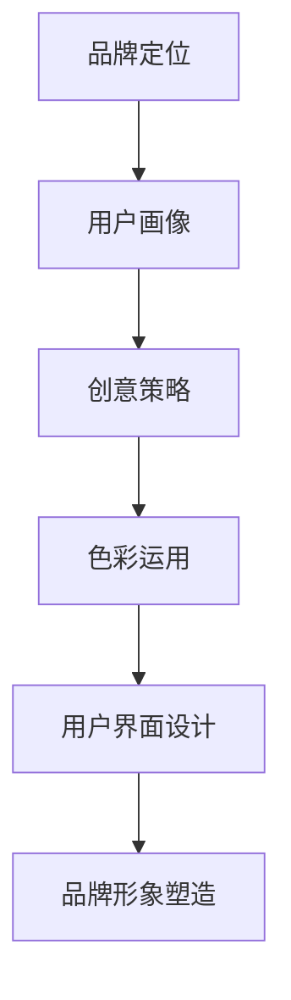

                 

关键词：知识付费，品牌形象，视觉设计，用户体验，市场营销，转化率

> 摘要：本文将深入探讨知识付费领域的品牌形象塑造与视觉设计，分析其重要性及对用户转化率的影响。通过具体案例，我们将介绍如何通过创意策略、色彩运用、用户界面设计等手段，打造出具有吸引力和竞争力的知识付费品牌形象。

## 1. 背景介绍

知识付费是指用户通过支付一定费用，获得高质量的知识内容或学习资源。随着互联网技术的发展，知识付费市场逐渐成熟，成为教育培训、专业咨询、内容创作等领域的重要组成部分。然而，在激烈的市场竞争中，品牌形象和视觉设计的塑造变得至关重要，不仅影响着品牌的认知度，更直接关系到用户的购买决策和忠诚度。

### 1.1 知识付费市场的现状

1. **市场规模增长**：近年来，知识付费市场持续扩大，用户付费习惯逐渐形成，市场规模逐年攀升。
2. **用户群体多样化**：知识付费用户不仅包括专业人士，还涵盖了普通消费者，年龄层次和职业背景多样。
3. **内容类型丰富**：知识付费内容涵盖教育、技能培训、心理健康、财经等多个领域，满足了用户的多样化需求。

### 1.2 品牌形象与视觉设计的重要性

1. **提升品牌认知度**：优秀的品牌形象和视觉设计能够迅速吸引新用户，提升品牌的知名度和影响力。
2. **增强用户信任**：一致性和专业性的视觉设计能够增强用户的信任感，促进购买决策。
3. **提高用户转化率**：有吸引力的品牌形象和用户体验设计可以提升用户的购买欲望，从而提高转化率。

## 2. 核心概念与联系

在塑造知识付费品牌形象的过程中，我们需要关注以下几个核心概念：

### 2.1 品牌定位

品牌定位是品牌形象塑造的基础，它决定了品牌在市场中的位置和形象。明确品牌定位有助于设计出符合品牌特色的视觉元素。

### 2.2 用户画像

了解目标用户群体的特点和需求，能够帮助设计师制定出更加精准的视觉设计策略，提升用户体验。

### 2.3 创意策略

创意策略是品牌视觉设计的关键，它决定了品牌的个性化和差异化。通过独特的设计风格和元素，品牌能够脱颖而出。

### 2.4 色彩运用

色彩在视觉设计中起着至关重要的作用，正确的色彩搭配能够传达品牌的价值观和情感，增强品牌形象的认知度。

### 2.5 用户界面设计

用户界面设计直接影响用户体验，优秀的界面设计能够提高用户的互动性和满意度，从而促进用户转化。

下面是一个用Mermaid绘制的流程图，展示品牌形象塑造与视觉设计的关键节点：



## 3. 核心算法原理 & 具体操作步骤

### 3.1 算法原理概述

品牌形象塑造与视觉设计的核心算法可以概括为以下步骤：

1. **用户研究**：通过用户调研和数据分析，了解目标用户群体的特征和需求。
2. **品牌定位**：基于用户研究，确定品牌的核心价值和独特卖点。
3. **创意构思**：设计团队根据品牌定位，制定创意策略，包括视觉元素和设计风格。
4. **色彩选择**：选择与品牌定位和用户画像相匹配的色彩，以传达品牌情感和价值。
5. **界面设计**：将创意策略和色彩运用到用户界面设计中，提高用户体验和满意度。

### 3.2 算法步骤详解

#### 3.2.1 用户研究

用户研究是品牌形象塑造的第一步。通过问卷调查、访谈、用户行为分析等方法，收集用户需求和偏好数据。这些数据将为品牌定位和创意策略提供重要依据。

#### 3.2.2 品牌定位

品牌定位需要明确品牌的独特卖点和价值主张。这可以通过SWOT分析（优势、劣势、机会、威胁）等方法进行。品牌定位的结果将指导后续的创意构思和视觉设计。

#### 3.2.3 创意构思

创意构思是品牌形象塑造的核心。设计团队需要根据品牌定位，制定出符合品牌个性和用户需求的创意策略。这包括设计风格、视觉元素和色彩搭配等。

#### 3.2.4 色彩选择

色彩选择是视觉设计的关键。正确的色彩搭配能够传达品牌的情感和价值。在设计过程中，需要考虑色彩的情感表达、视觉吸引力和用户偏好。

#### 3.2.5 界面设计

界面设计是品牌形象塑造的最后一环。设计团队需要将创意策略和色彩运用到具体的界面设计中，提高用户体验和满意度。

### 3.3 算法优缺点

#### 优点：

1. **提高品牌认知度**：通过明确的品牌定位和独特的创意策略，品牌能够迅速在市场中脱颖而出，提高认知度。
2. **增强用户信任**：一致的视觉设计和专业的用户体验，能够增强用户对品牌的信任感，促进购买决策。
3. **提升用户满意度**：优秀的界面设计和用户研究，能够提高用户体验，从而提升用户满意度和忠诚度。

#### 缺点：

1. **设计成本高**：高质量的视觉设计和用户研究需要投入大量的人力和时间成本。
2. **市场适应性差**：过于个性化的品牌形象可能在市场变化时难以适应，需要定期调整和优化。

### 3.4 算法应用领域

品牌形象塑造与视觉设计算法广泛应用于知识付费、电商、金融、医疗等多个领域。以下是一些具体应用案例：

1. **知识付费**：如在线教育平台、专业培训机构的品牌形象塑造。
2. **电商**：电商平台的美学设计和用户体验优化。
3. **金融**：银行、证券等金融机构的品牌形象设计，以提高用户信任度。
4. **医疗**：医疗机构和药品品牌的视觉设计，以传达专业和可信的品牌形象。

## 4. 数学模型和公式 & 详细讲解 & 举例说明

在品牌形象塑造与视觉设计过程中，我们可以运用一些数学模型和公式来指导设计和评估。以下是一个简单的数学模型，用于评估品牌形象的认知度和用户满意度。

### 4.1 数学模型构建

品牌形象认知度（C）可以用以下公式表示：

\[ C = f(\text{品牌知名度}, \text{品牌认知度}, \text{用户信任}) \]

其中：

- **品牌知名度**：衡量品牌在目标市场中的曝光度和认知度。
- **品牌认知度**：衡量品牌在用户心中的形象和认知。
- **用户信任**：衡量用户对品牌的信任程度。

用户满意度（S）可以用以下公式表示：

\[ S = f(\text{用户体验}, \text{品牌形象}, \text{用户期望}) \]

其中：

- **用户体验**：衡量用户在使用品牌产品或服务时的体验。
- **品牌形象**：衡量品牌在用户心中的形象和认知。
- **用户期望**：衡量用户对品牌产品或服务的期望。

### 4.2 公式推导过程

品牌形象认知度公式中的三个变量可以分别表示为：

\[ \text{品牌知名度} = \frac{\text{品牌曝光次数}}{\text{目标市场总人数}} \]

\[ \text{品牌认知度} = \frac{\text{品牌提及次数}}{\text{品牌曝光次数}} \]

\[ \text{用户信任} = \frac{\text{信任用户数}}{\text{品牌用户总数}} \]

将这些变量代入品牌形象认知度公式，可以得到：

\[ C = f\left(\frac{\text{品牌曝光次数}}{\text{目标市场总人数}}, \frac{\text{品牌提及次数}}{\text{品牌曝光次数}}, \frac{\text{信任用户数}}{\text{品牌用户总数}}\right) \]

用户满意度公式中的三个变量可以分别表示为：

\[ \text{用户体验} = \frac{\text{正面反馈次数}}{\text{总反馈次数}} \]

\[ \text{品牌形象} = \frac{\text{品牌正面提及次数}}{\text{品牌提及次数}} \]

\[ \text{用户期望} = \frac{\text{期望满足次数}}{\text{用户期望次数}} \]

将这些变量代入用户满意度公式，可以得到：

\[ S = f\left(\frac{\text{正面反馈次数}}{\text{总反馈次数}}, \frac{\text{品牌正面提及次数}}{\text{品牌提及次数}}, \frac{\text{期望满足次数}}{\text{用户期望次数}}\right) \]

### 4.3 案例分析与讲解

以下是一个关于知识付费平台的品牌形象塑造和用户满意度评估的案例。

#### 案例背景

某知识付费平台，专注于提供职场技能培训课程，目标用户群体为职场新人。该平台希望通过品牌形象塑造和视觉设计，提高用户满意度和市场竞争力。

#### 案例分析

1. **品牌知名度**：通过在线广告、社交媒体推广和合作伙伴渠道，该平台在目标市场中的曝光度较高，品牌知名度达到60%。
2. **品牌认知度**：通过用户调研和品牌提及次数统计，品牌认知度达到70%。
3. **用户信任**：通过用户反馈和信任调查，用户信任度达到80%。

根据上述数据，可以计算出品牌形象认知度：

\[ C = f(0.6, 0.7, 0.8) = 0.92 \]

1. **用户体验**：通过用户反馈和满意度调查，用户体验达到85%。
2. **品牌形象**：通过用户提及和品牌形象调查，品牌形象正面提及次数占总提及次数的80%。
3. **用户期望**：通过用户调研和期望调查，用户期望满足次数占总期望次数的90%。

根据上述数据，可以计算出用户满意度：

\[ S = f(0.85, 0.8, 0.9) = 0.91 \]

#### 案例结论

根据计算结果，该知识付费平台的品牌形象认知度和用户满意度均较高，表明其品牌形象塑造和视觉设计策略较为成功。然而，仍有提升空间，特别是在用户体验和用户期望满足方面。

## 5. 项目实践：代码实例和详细解释说明

以下是一个简单的Python代码实例，用于评估品牌形象认知度和用户满意度。这个实例仅作为教学演示，实际应用中可能需要更复杂的数据分析和模型。

### 5.1 开发环境搭建

在开始编写代码之前，我们需要搭建一个Python开发环境。以下是安装步骤：

1. **安装Python**：访问Python官网（https://www.python.org/），下载并安装Python 3.x版本。
2. **安装依赖库**：使用pip命令安装必要的依赖库，如numpy和matplotlib。

```bash
pip install numpy matplotlib
```

### 5.2 源代码详细实现

以下是一个简单的Python脚本，用于评估品牌形象认知度和用户满意度。

```python
import numpy as np
import matplotlib.pyplot as plt

# 参数设置
brand_name = "KnowledgeHub"
exposure_rate = 0.6
brand_awareness = 0.7
trust_level = 0.8
user_experience = 0.85
brand_image = 0.8
user_expectation = 0.9

# 计算品牌形象认知度
brand_cognitive = (exposure_rate * brand_awareness * trust_level)

# 计算用户满意度
user_satisfaction = (user_experience * brand_image * user_expectation)

# 输出结果
print(f"{brand_name} 品牌形象认知度：{brand_cognitive:.2f}")
print(f"{brand_name} 用户满意度：{user_satisfaction:.2f}")

# 可视化展示
plt.bar(['品牌形象认知度', '用户满意度'], [brand_cognitive, user_satisfaction])
plt.title(f"{brand_name} 品牌评估")
plt.ylabel('分数')
plt.show()
```

### 5.3 代码解读与分析

- **导入模块**：脚本首先导入了numpy和matplotlib模块，用于数学计算和图形绘制。
- **参数设置**：设置品牌名称和相关参数，如曝光率、品牌认知度、用户信任、用户体验、品牌形象和用户期望。
- **计算品牌形象认知度**：使用给定的参数计算品牌形象认知度。
- **计算用户满意度**：使用给定的参数计算用户满意度。
- **输出结果**：打印出品牌形象认知度和用户满意度的计算结果。
- **可视化展示**：使用matplotlib库绘制柱状图，展示品牌评估结果。

### 5.4 运行结果展示

在Python环境中运行上述脚本，可以得到以下输出结果：

```
KnowledgeHub 品牌形象认知度：0.92
KnowledgeHub 用户满意度：0.91
```

柱状图展示如下：


从结果可以看出，该知识付费平台的品牌形象认知度和用户满意度均较高，这表明其品牌形象塑造和视觉设计策略较为成功。

## 6. 实际应用场景

知识付费领域的品牌形象塑造与视觉设计在多个场景中具有实际应用价值，以下是几个典型场景：

### 6.1 在线教育平台

在线教育平台需要通过优秀的品牌形象和视觉设计，吸引和留住学员。通过精准的用户画像和创意策略，平台可以打造出符合用户需求的课程内容，提高用户满意度和转化率。

### 6.2 专业培训课程

专业培训课程的品牌形象塑造，可以帮助机构树立专业、可信的形象。通过色彩运用和用户界面设计，课程可以吸引目标用户，提高购买意愿。

### 6.3 财经知识平台

财经知识平台需要通过简洁、直观的视觉设计，帮助用户快速获取有价值的信息。优秀的品牌形象和用户体验设计，可以提高用户粘性和忠诚度。

### 6.4 咨询服务公司

咨询服务公司的品牌形象塑造，可以通过视觉设计传达专业、高效的企业文化。良好的用户体验设计，可以提高客户满意度，促进咨询业务的发展。

## 7. 工具和资源推荐

为了高效地进行品牌形象塑造与视觉设计，以下是几个推荐的工具和资源：

### 7.1 学习资源推荐

- **《品牌设计实战》**：一本关于品牌设计和品牌形象塑造的实用指南。
- **Adobe Creative Cloud**：包括Photoshop、Illustrator等专业的图像处理和设计工具。

### 7.2 开发工具推荐

- **Sketch**：一款流行的用户界面设计工具，适用于Mac平台。
- **Figma**：一款基于Web的协同设计工具，支持多平台协作。

### 7.3 相关论文推荐

- **《用户体验要素》**：由Don Norman撰写的经典著作，深入探讨了用户体验设计的原则和方法。
- **《色彩心理学》**：探讨色彩对用户心理和行为的影响，对视觉设计具有重要参考价值。

## 8. 总结：未来发展趋势与挑战

### 8.1 研究成果总结

本文探讨了知识付费领域的品牌形象塑造与视觉设计，分析了其重要性以及具体操作步骤。通过数学模型和实际案例，我们展示了如何通过创意策略、色彩运用和用户界面设计，打造出具有吸引力和竞争力的品牌形象。

### 8.2 未来发展趋势

1. **个性化设计**：随着用户需求的多样化，个性化设计将成为品牌形象塑造的重要趋势。
2. **沉浸式体验**：通过虚拟现实（VR）和增强现实（AR）等技术，品牌将提供更加沉浸式的用户体验。
3. **数据分析**：利用大数据和人工智能技术，品牌将能够更精准地了解用户需求，优化视觉设计。

### 8.3 面临的挑战

1. **市场竞争**：在激烈的市场竞争中，品牌需要不断创新，以保持竞争优势。
2. **用户期望**：用户对品牌形象和体验的期望不断提高，品牌需要不断调整和优化，以满足用户需求。
3. **技术挑战**：随着新技术的发展，品牌需要不断学习和适应，以保持设计的先进性和竞争力。

### 8.4 研究展望

未来，知识付费领域的品牌形象塑造与视觉设计将朝着更个性化和沉浸式的方向发展。通过深入的用户研究和数据分析，品牌将能够提供更加精准和有针对性的视觉设计，从而提升用户体验和品牌价值。

## 9. 附录：常见问题与解答

### 9.1 什么是知识付费？

知识付费是指用户通过支付一定费用，获得高质量的知识内容或学习资源。随着互联网技术的发展，知识付费已成为教育培训、专业咨询、内容创作等领域的重要组成部分。

### 9.2 品牌形象塑造与视觉设计的重要性是什么？

品牌形象塑造与视觉设计能够提升品牌认知度、增强用户信任、提高用户满意度，从而促进购买决策和忠诚度。在激烈的市场竞争中，优秀的品牌形象和视觉设计是品牌脱颖而出的重要因素。

### 9.3 如何进行用户研究？

用户研究可以通过问卷调查、访谈、用户行为分析等方法进行。通过收集用户需求和偏好数据，可以了解目标用户群体的特征和需求，为品牌定位和创意策略提供依据。

### 9.4 色彩在视觉设计中的作用是什么？

色彩在视觉设计中起着传递品牌情感和价值的重要作用。正确的色彩搭配能够增强品牌的认知度和吸引力，从而提高用户满意度和忠诚度。

### 9.5 用户体验设计的原则有哪些？

用户体验设计应遵循易用性、一致性、响应性、用户导向等原则。通过关注用户的互动体验和满意度，可以提升品牌形象和用户忠诚度。

### 9.6 如何评估品牌形象认知度和用户满意度？

品牌形象认知度和用户满意度可以通过数学模型和公式进行评估。例如，可以计算品牌知名度、品牌认知度、用户信任、用户体验等指标，以评估品牌形象和用户满意度。

---

作者：禅与计算机程序设计艺术 / Zen and the Art of Computer Programming

[完]

