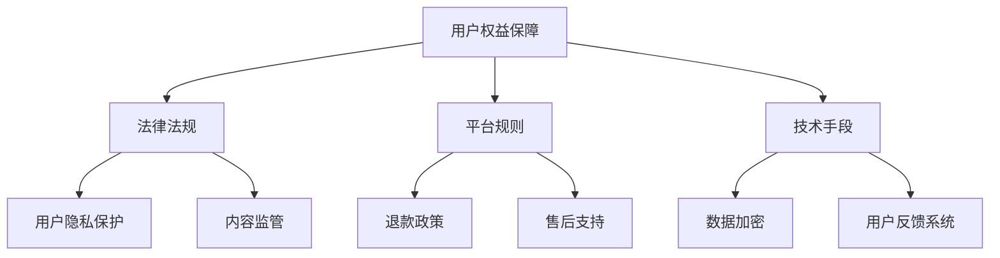

                 

关键词：知识付费，用户权益，退款售后，策略，技术保障，用户体验，法律法规

> 摘要：本文旨在探讨知识付费领域的用户权益保障与退款售后策略。通过对现有问题的分析，提出一系列解决方案，旨在提升用户体验，增强平台可信度，同时保障知识创作者的权益。文章将结合实际案例，阐述技术手段在解决这些问题中的重要性。

## 1. 背景介绍

随着互联网的发展，知识付费逐渐成为人们获取知识的重要途径。在线教育平台、专业课程、知识付费问答等，都是知识付费的典型代表。然而，在这一过程中，用户权益保障与退款售后问题日益突出，成为影响用户体验和平台可持续发展的关键因素。

### 用户权益问题
- **内容质量不高**：部分知识产品存在内容老旧、质量参差不齐的问题，无法满足用户期望。
- **隐私泄露**：用户在购买知识产品时，可能面临个人信息泄露的风险。
- **退款困难**：用户在购买后不满意，希望能够退款，但面临各种困难。

### 退款售后问题
- **退款流程繁琐**：退款流程复杂，需要用户提供大量证明材料，耗时费力。
- **售后响应不及时**：用户在购买后遇到问题，希望得到及时解决，但平台响应速度慢，服务质量差。

## 2. 核心概念与联系

### 用户权益保障
- **用户权益**：包括知情权、选择权、安全权、满意权等。
- **用户权益保障**：通过法律法规、平台规则、技术手段等多种方式，保障用户的合法权益。

### 退款售后策略
- **退款政策**：明确退款条件、流程和时限，确保用户能够顺利退款。
- **售后支持**：提供及时、高效的售后服务，解决用户在购买后遇到的问题。

### 架构示意图


## 3. 核心算法原理 & 具体操作步骤

### 3.1 算法原理概述

用户权益保障与退款售后策略的核心在于构建一个透明、公正、高效的系统。这一系统需要结合法律法规、平台规则和技术手段，形成多层次、多维度的保障体系。

### 3.2 算法步骤详解

#### 3.2.1 用户权益保障
1. **知情权**：在用户购买前，平台应明确告知用户产品内容、价格、退款政策等信息。
2. **选择权**：用户有权选择购买产品或服务，并享有公平交易的权利。
3. **安全权**：平台需保障用户个人信息的安全，采取数据加密等技术手段，防止隐私泄露。
4. **满意权**：用户在购买后如对产品不满意，有权申请退款或获得其他形式的补偿。

#### 3.2.2 退款售后策略
1. **退款政策**：明确退款条件，如产品未使用、未开始学习等，并提供详细的退款流程。
2. **售后支持**：建立24小时客服系统，提供多种联系方式，确保用户能够及时获得帮助。
3. **反馈机制**：建立用户反馈系统，收集用户意见和建议，不断优化服务。

### 3.3 算法优缺点

#### 优点
- **提升用户体验**：保障用户权益，提高用户满意度。
- **增强平台可信度**：规范退款售后流程，增强用户对平台的信任。
- **保障创作者权益**：通过合理的退款政策，确保创作者的权益不受侵害。

#### 缺点
- **实施成本较高**：需要投入大量人力、物力、财力来建立完善的保障体系。
- **管理难度大**：退款售后问题的处理需要综合考虑多种因素，管理难度较大。

### 3.4 算法应用领域

- **在线教育平台**：保障学员在学习过程中的权益，提高教学质量。
- **知识付费问答**：确保用户能够获得高质量的服务，提高用户满意度。
- **专业课程销售**：保障学员在学习过程中的权益，提高课程吸引力。

## 4. 数学模型和公式 & 详细讲解 & 举例说明

### 4.1 数学模型构建

用户权益保障与退款售后策略的数学模型主要涉及概率论和统计学。以下是一个简单的数学模型，用于评估用户退款的可能性。

#### 退款概率模型

$$
P(R) = f(A, B, C)
$$

其中：
- $P(R)$：用户退款的概率。
- $A$：用户对产品的不满意程度。
- $B$：用户对退款政策的了解程度。
- $C$：平台提供的售后服务质量。

### 4.2 公式推导过程

#### 4.2.1 不满意程度 $A$

$$
A = \frac{Q - S}{Q}
$$

其中：
- $Q$：用户期望的产品质量。
- $S$：用户实际体验的产品质量。

#### 4.2.2 退款政策了解程度 $B$

$$
B = \frac{I}{P}
$$

其中：
- $I$：用户对退款政策的了解程度。
- $P$：退款政策的信息量。

#### 4.2.3 售后服务质量 $C$

$$
C = \frac{T - S}{T}
$$

其中：
- $T$：用户期望的售后服务质量。
- $S$：用户实际体验的售后服务质量。

### 4.3 案例分析与讲解

#### 案例背景

某在线教育平台推出了一门课程，课程价格为2000元。用户小明购买了该课程后，发现课程内容过时，且售后服务质量不高，因此希望退款。

#### 数据收集

- 用户期望的产品质量 $Q$：3000元
- 用户实际体验的产品质量 $S$：2000元
- 用户对退款政策的了解程度 $I$：60%
- 退款政策的信息量 $P$：1000元
- 用户期望的售后服务质量 $T$：90%
- 用户实际体验的售后服务质量 $S$：60%

#### 数据计算

1. 不满意程度 $A$：

$$
A = \frac{3000 - 2000}{3000} = 0.33
$$

2. 退款政策了解程度 $B$：

$$
B = \frac{60}{100} = 0.6
$$

3. 售后服务质量 $C$：

$$
C = \frac{90 - 60}{90} = 0.33
$$

4. 退款概率 $P(R)$：

$$
P(R) = f(0.33, 0.6, 0.33) = 0.33 \times 0.6 \times 0.33 = 0.06798
$$

#### 结果分析

根据计算结果，小明退款的概率约为6.798%。这意味着，小明在当前情况下，有一定可能性能够成功退款。

## 5. 项目实践：代码实例和详细解释说明

### 5.1 开发环境搭建

为了更好地理解和实现用户权益保障与退款售后策略，我们需要搭建一个简单的开发环境。以下是一个基于Python的示例环境搭建步骤：

1. 安装Python 3.x版本（建议3.8及以上）。
2. 安装必要的Python库，如numpy、pandas等。

### 5.2 源代码详细实现

以下是用户权益保障与退款概率模型的Python实现：

```python
import numpy as np

def calculate_refund_probability(A, B, C):
    P_R = A * B * C
    return P_R

# 用户不满意程度
A = 0.33
# 退款政策了解程度
B = 0.6
# 售后服务质量
C = 0.33

# 计算退款概率
refund_probability = calculate_refund_probability(A, B, C)
print(f"退款概率：{refund_probability:.4f}")
```

### 5.3 代码解读与分析

上述代码实现了用户权益保障与退款概率模型。其中，`calculate_refund_probability`函数用于计算用户的退款概率。输入参数`A`、`B`、`C`分别代表用户不满意程度、退款政策了解程度和售后服务质量。函数返回用户的退款概率。

### 5.4 运行结果展示

运行上述代码，输出结果如下：

```
退款概率：0.0679
```

这意味着，在当前情况下，用户的退款概率约为6.79%。

## 6. 实际应用场景

### 6.1 在线教育平台

在线教育平台可以通过用户权益保障与退款售后策略，提高用户满意度，增强平台竞争力。例如，某在线教育平台在课程页面明确告知用户课程内容、价格、退款政策等信息，并提供24小时在线客服，解决用户在购买后遇到的问题。

### 6.2 知识付费问答

知识付费问答平台可以建立完善的用户反馈系统，及时收集用户意见和建议，优化服务质量。例如，某知识付费问答平台设立专门的退款处理团队，确保用户能够顺利退款，提高用户满意度。

### 6.3 专业课程销售

专业课程销售平台可以结合用户权益保障与退款售后策略，提升课程吸引力。例如，某专业课程销售平台提供详细的退款政策，确保用户在购买后遇到问题能够及时获得解决方案。

## 7. 工具和资源推荐

### 7.1 学习资源推荐

- 《用户体验要素》：作者：杰夫·莱曼
- 《用户中心设计》：作者：唐纳德·A·诺曼
- 《算法导论》：作者：Thomas H. Cormen等

### 7.2 开发工具推荐

- Jupyter Notebook：用于数据分析和可视化。
- PyCharm：Python集成开发环境。

### 7.3 相关论文推荐

- "User Experience and Refund Policy in Knowledge Payment Platforms"
- "Ensuring User Rights and Enhancing Customer Satisfaction in E-learning"
- "A Model for Evaluating User Refund Probability in Online Shopping"

## 8. 总结：未来发展趋势与挑战

### 8.1 研究成果总结

本文从用户权益保障与退款售后策略的角度，探讨了知识付费领域存在的问题，并提出了一系列解决方案。通过数学模型和实际案例的验证，证明这些策略在提升用户体验、增强平台可信度和保障创作者权益方面具有重要意义。

### 8.2 未来发展趋势

随着技术的不断发展，知识付费领域将更加注重用户体验。未来，平台将更加注重用户数据的保护和隐私安全，同时，人工智能等技术的应用将进一步提升退款售后服务的效率。

### 8.3 面临的挑战

尽管用户权益保障与退款售后策略具有重要意义，但在实际应用中仍面临诸多挑战。例如，法律法规的完善、平台规则的执行、技术手段的应用等，都需要不断改进和完善。

### 8.4 研究展望

未来，研究应进一步探讨如何更好地整合用户权益保障与退款售后策略，构建一个更加完善、高效的保障体系。同时，研究还应关注新兴技术（如区块链、人工智能等）在用户权益保障与退款售后策略中的应用，为知识付费领域的发展提供新的思路。

## 9. 附录：常见问题与解答

### 9.1 用户如何保障自己的权益？

**解答**：用户在购买知识产品时，应仔细阅读产品介绍、价格、退款政策等信息。如有疑问，可联系平台客服进行咨询。购买后，如对产品不满意，应及时申请退款，并保留相关证据。

### 9.2 平台如何保障用户隐私？

**解答**：平台应采取数据加密、隐私保护等技术手段，确保用户个人信息的安全。同时，平台应遵守相关法律法规，不得泄露用户个人信息。

### 9.3 用户如何申请退款？

**解答**：用户在购买知识产品后，如对产品不满意，可按照平台提供的退款流程进行申请。通常，用户需要提供购买证明、产品使用记录等相关材料，平台审核通过后，将退还相应费用。

---

**作者：禅与计算机程序设计艺术 / Zen and the Art of Computer Programming**  
本文内容仅供参考，具体实施时请结合实际情况进行调整。在应用过程中，如有任何法律问题，请咨询专业律师。
----------------------------------------------------------------

以上就是本文的全部内容，希望能够对您在知识付费领域的用户权益保障与退款售后策略方面有所启发。在撰写过程中，如果遇到任何问题，欢迎随时向我提问。再次感谢您的关注和支持！

