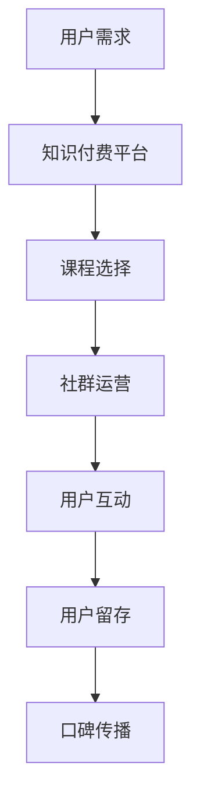

                 

关键字：知识付费、程序员、社群运营、方法、策略

> 摘要：本文将深入探讨知识付费在程序员社群运营中的应用，分析其核心概念与联系，并提出一系列实用的社群运营方法。通过阐述知识付费对程序员社区的价值、数学模型与公式，以及实际应用场景，本文旨在为程序员提供一套行之有效的社群运营策略，助力他们在知识付费领域中取得成功。

## 1. 背景介绍

在当今信息技术飞速发展的时代，程序员的技能需求不断升级，对于高质量学习资源的渴求也越来越强烈。与此同时，知识付费市场逐渐兴起，为广大程序员提供了多样化的学习渠道和解决方案。知识付费，顾名思义，是指用户通过支付一定费用，获取专业知识和技能的过程。这一模式在程序员社群中得到了广泛应用，成为促进技能提升和职业发展的重要手段。

然而，知识付费并非一蹴而就，它需要一系列科学的运营策略来支撑。社群运营作为知识付费的重要组成部分，承担着连接用户、传播知识和促进互动的重要任务。如何有效地进行社群运营，提高用户参与度和粘性，成为许多知识付费平台面临的挑战。

本文将结合程序员的实际需求，探讨知识付费在社群运营中的应用方法，通过理论分析和实践案例，为程序员社群运营提供有益的启示。

## 2. 核心概念与联系

### 2.1. 知识付费的核心概念

知识付费的核心概念在于通过付费获取专业知识和技能，其本质是知识交易。以下是知识付费的主要特点：

- **高质量内容**：知识付费平台提供的课程、教程和知识库通常具有高质量、权威性和专业性，有助于用户快速掌握所需的技能。

- **个性化服务**：知识付费平台通常提供定制化的学习路径和辅导服务，满足用户个性化学习需求。

- **权益保障**：知识付费交易过程中，用户权益得到保障，平台通常提供退款保障、售后服务等。

- **持续更新**：知识付费平台持续更新内容，确保用户能够获取最新、最实用的知识和技能。

### 2.2. 社群运营的概念

社群运营是指通过一系列策略和手段，促进用户在特定领域内的交流、互动和成长。以下是社群运营的主要特点：

- **互动性强**：社群运营注重用户之间的互动，通过论坛、直播、问答等形式，提高用户的参与度和活跃度。

- **粘性强**：社群运营通过构建共同兴趣、目标和价值观，增强用户对社群的认同感和归属感，提高社群的粘性。

- **多元化**：社群运营涵盖多种形式，包括线上论坛、线下活动、培训课程等，满足不同用户的需求。

### 2.3. 知识付费与社群运营的联系

知识付费与社群运营密切相关，二者相互促进、相辅相成。以下是知识付费与社群运营之间的联系：

- **用户转化**：知识付费平台通过社群运营，吸引潜在用户关注，提高用户转化率。

- **用户留存**：社群运营有助于提高用户留存率，通过互动和交流，增强用户对平台的依赖。

- **口碑传播**：社群运营中用户之间的口碑传播，有助于扩大平台影响力，吸引更多用户。

- **内容创作**：社群运营中的用户互动和交流，为知识付费平台提供了丰富的内容创作资源。

### 2.4. Mermaid 流程图

以下是一个简化的Mermaid流程图，展示了知识付费与社群运营的核心步骤和联系：



## 3. 核心算法原理 & 具体操作步骤

### 3.1 算法原理概述

在程序员社群运营中，核心算法原理主要包括以下几个方面：

- **用户行为分析**：通过分析用户的学习记录、参与度和互动行为，了解用户需求和偏好，为个性化推荐和社群活动提供依据。

- **社交网络分析**：利用社交网络分析算法，挖掘用户之间的关系和影响力，构建社群图谱，提高社群互动效果。

- **内容推荐算法**：基于用户兴趣和行为数据，推荐相关的课程和知识，提高用户的学习效果和参与度。

- **社区治理算法**：通过算法监测和过滤社群中的不良信息和违规行为，维护社群秩序和用户权益。

### 3.2 算法步骤详解

以下是核心算法的具体操作步骤：

#### 3.2.1 用户行为分析

1. **数据采集**：收集用户在学习平台上的行为数据，包括浏览记录、学习时长、评分、评论等。

2. **数据预处理**：对采集到的数据进行分析和清洗，去除重复和无效数据，构建用户行为特征向量。

3. **行为模式识别**：利用机器学习算法，分析用户的行为模式，识别用户的兴趣点和需求。

4. **用户分群**：根据用户行为模式，将用户划分为不同的群体，为个性化推荐和社群活动提供依据。

#### 3.2.2 社交网络分析

1. **用户关系图谱构建**：利用社交网络分析算法，构建用户之间的关系图谱，包括好友关系、互动关系等。

2. **影响力评估**：通过计算用户在网络中的影响力，识别社群中的关键节点和意见领袖。

3. **社群互动推荐**：基于用户关系图谱和影响力评估，推荐相关的社群活动和互动话题，提高用户参与度。

#### 3.2.3 内容推荐算法

1. **兴趣标签构建**：根据用户行为数据和用户分群结果，为每个用户构建兴趣标签。

2. **内容推荐策略**：基于用户兴趣标签，采用协同过滤、基于内容的推荐算法，为用户推荐相关的课程和知识。

3. **推荐结果评估**：对推荐结果进行评估，包括点击率、学习完成率、用户满意度等，优化推荐策略。

#### 3.2.4 社区治理算法

1. **违规行为监测**：利用算法监测社群中的违规行为，包括恶意评论、欺诈行为等。

2. **违规行为过滤**：对监测到的违规行为进行过滤和处理，包括屏蔽、删除、警告等。

3. **社群治理评估**：对社群治理效果进行评估，包括用户满意度、违规行为率等，持续优化治理策略。

### 3.3 算法优缺点

#### 3.3.1 优点

- **高效性**：算法能够快速处理大量用户行为数据，为社群运营提供实时、准确的决策依据。

- **个性化**：算法根据用户兴趣和行为，提供个性化的推荐和互动，提高用户满意度和参与度。

- **可扩展性**：算法具有良好的可扩展性，可以方便地集成到现有的社群运营平台中。

#### 3.3.2 缺点

- **数据依赖性**：算法的性能依赖于用户行为数据的质量和完整性，数据缺失或异常可能导致算法失效。

- **计算复杂性**：算法涉及多个步骤和计算，对计算资源和时间有一定要求，可能影响平台的响应速度。

- **隐私保护**：在数据处理过程中，需要关注用户隐私保护问题，确保用户数据的安全性和合法性。

### 3.4 算法应用领域

- **在线教育平台**：算法广泛应用于在线教育平台，帮助平台提供个性化的学习推荐和社群运营。

- **知识付费平台**：算法为知识付费平台提供用户行为分析和内容推荐服务，提高用户转化率和留存率。

- **社交网络平台**：算法用于社交网络平台，帮助平台构建用户关系图谱和推荐互动话题。

- **企业内部培训**：算法应用于企业内部培训，提供个性化培训方案和社群互动服务。

## 4. 数学模型和公式 & 详细讲解 & 举例说明

### 4.1 数学模型构建

在程序员社群运营中，常用的数学模型包括用户行为模型、社交网络模型和推荐算法模型。以下是这些模型的构建过程：

#### 4.1.1 用户行为模型

用户行为模型主要用于分析用户在学习平台上的行为，包括浏览、学习、评价和互动等。以下是用户行为模型的构建步骤：

1. **用户行为数据采集**：采集用户在学习平台上的行为数据，如浏览记录、学习时长、评分和评论等。

2. **用户行为特征提取**：对采集到的数据进行分析和清洗，提取用户行为特征，如浏览频次、学习时长、评分分布等。

3. **用户行为建模**：利用时间序列分析、聚类分析和机器学习算法，构建用户行为模型，如用户行为轨迹模型、用户行为模式识别模型等。

#### 4.1.2 社交网络模型

社交网络模型主要用于分析用户之间的互动和关系，构建用户关系图谱。以下是社交网络模型的构建步骤：

1. **用户关系数据采集**：采集用户之间的互动数据，如点赞、评论、私信等。

2. **用户关系特征提取**：对采集到的数据进行分析和清洗，提取用户关系特征，如互动频次、互动时长、互动内容等。

3. **用户关系建模**：利用图论、矩阵分解和机器学习算法，构建用户关系模型，如用户关系图谱、用户影响力评估模型等。

#### 4.1.3 推荐算法模型

推荐算法模型主要用于为用户推荐相关的课程和知识，提高用户的学习效果和参与度。以下是推荐算法模型的构建步骤：

1. **推荐数据采集**：采集用户的学习记录、行为数据和课程数据，如用户行为序列、课程标签等。

2. **推荐特征提取**：对采集到的数据进行分析和清洗，提取推荐特征，如用户兴趣标签、课程相似度等。

3. **推荐算法构建**：利用协同过滤、基于内容的推荐算法、混合推荐算法等，构建推荐算法模型。

### 4.2 公式推导过程

在用户行为模型中，常用的公式包括用户行为概率分布、用户行为模式识别公式等。以下是这些公式的推导过程：

#### 4.2.1 用户行为概率分布

用户行为概率分布用于描述用户在某一时间段内的行为分布。以下是用户行为概率分布的推导过程：

1. **用户行为数据预处理**：对采集到的用户行为数据进行预处理，包括数据清洗、归一化等。

2. **用户行为概率估计**：利用概率统计方法，估计用户在某一时间段内的行为概率分布。

3. **公式推导**：

   $$P(X_i|T) = \frac{f(X_i, T)}{f(T)}$$

   其中，$P(X_i|T)$ 表示用户在时间段 $T$ 内执行行为 $X_i$ 的概率，$f(X_i, T)$ 表示用户在时间段 $T$ 内执行行为 $X_i$ 的频率，$f(T)$ 表示时间段 $T$ 内所有行为的总频率。

#### 4.2.2 用户行为模式识别公式

用户行为模式识别公式用于识别用户在某一时间段内的行为模式。以下是用户行为模式识别公式的推导过程：

1. **用户行为数据预处理**：对采集到的用户行为数据进行预处理，包括数据清洗、归一化等。

2. **用户行为模式识别**：利用时间序列分析和聚类分析等方法，识别用户在某一时间段内的行为模式。

3. **公式推导**：

   $$C = \sum_{i=1}^{n} w_i \cdot \text{Similarity}(X_i, M)$$

   其中，$C$ 表示用户行为模式识别结果，$w_i$ 表示用户行为 $X_i$ 的权重，$\text{Similarity}(X_i, M)$ 表示用户行为 $X_i$ 与模式 $M$ 的相似度。

### 4.3 案例分析与讲解

#### 4.3.1 用户行为模型案例

以下是一个用户行为模型的案例分析：

**案例背景**：某在线教育平台希望通过用户行为模型分析，了解用户在学习平台上的行为分布和偏好，从而为课程推荐和社群运营提供依据。

**数据分析**：

1. **用户行为数据采集**：平台采集了用户在学习平台上的行为数据，包括浏览记录、学习时长、评分和评论等。

2. **用户行为特征提取**：对用户行为数据进行分析，提取用户行为特征，如浏览频次、学习时长、评分分布等。

3. **用户行为模式识别**：利用时间序列分析和聚类分析，识别用户在某一时间段内的行为模式。

**结果分析**：

- 用户行为分布：用户在平台上的行为主要集中在浏览和评价，其中浏览频次较高的用户通常具有较高的学习积极性和满意度。

- 用户行为偏好：用户偏好于学习技术类课程，如编程语言、数据库等，同时用户对于课程评价较为关注，倾向于选择评分较高的课程。

#### 4.3.2 社交网络模型案例

以下是一个社交网络模型的案例分析：

**案例背景**：某社交网络平台希望通过社交网络模型分析，了解用户之间的关系和互动，从而为社群运营提供依据。

**数据分析**：

1. **用户关系数据采集**：平台采集了用户之间的互动数据，包括点赞、评论、私信等。

2. **用户关系特征提取**：对用户互动数据进行分析，提取用户关系特征，如互动频次、互动时长、互动内容等。

3. **用户关系建模**：利用图论和矩阵分解，构建用户关系模型，如用户关系图谱、用户影响力评估模型等。

**结果分析**：

- 用户关系分布：用户之间的互动主要发生在好友关系和兴趣小组，其中好友关系具有较高的互动频次和时长，兴趣小组则具有较高的互动内容和价值。

- 用户影响力评估：平台识别出了一些具有较高影响力的用户，这些用户在社交网络中具有较高的互动影响力和传播能力，对社群的运营和传播起到关键作用。

## 5. 项目实践：代码实例和详细解释说明

### 5.1 开发环境搭建

在开始编写代码之前，我们需要搭建一个适合进行社群运营项目开发的环境。以下是开发环境的搭建步骤：

1. **硬件环境**：

   - 服务器：配置满足项目需求的计算资源和存储空间。

   - 网络环境：确保服务器具备稳定的网络连接，以便用户访问。

2. **软件环境**：

   - 操作系统：选择适合的操作系统，如Linux、Windows等。

   - 开发工具：安装Python、Java等编程语言和相应的开发工具，如PyCharm、IntelliJ IDEA等。

   - 数据库：选择合适的数据库，如MySQL、MongoDB等，用于存储用户行为数据、课程数据等。

3. **开发框架**：

   - Web框架：选择适合的Web开发框架，如Django、Flask等。

   - 数据处理框架：选择适合的数据处理框架，如Scikit-learn、TensorFlow等。

### 5.2 源代码详细实现

以下是一个简单的用户行为分析模型的源代码示例，用于分析用户在在线教育平台上的行为，并识别用户行为模式。

```python
import pandas as pd
from sklearn.cluster import KMeans
from sklearn.preprocessing import StandardScaler

# 5.2.1 用户行为数据采集
def load_user_data(filename):
    data = pd.read_csv(filename)
    return data

# 5.2.2 用户行为特征提取
def extract_user_features(data):
    features = data[['browse_frequency', 'learning_duration', 'rating_distribution']]
    return features

# 5.2.3 用户行为模式识别
def identify_user_patterns(data, n_clusters):
    scaler = StandardScaler()
    scaled_features = scaler.fit_transform(data)
    
    kmeans = KMeans(n_clusters=n_clusters, random_state=0)
    kmeans.fit(scaled_features)
    
    labels = kmeans.labels_
    patterns = data.groupby(labels).mean()
    
    return patterns

# 5.2.4 主函数
def main():
    filename = 'user_data.csv'
    n_clusters = 3
    
    data = load_user_data(filename)
    features = extract_user_features(data)
    patterns = identify_user_patterns(features, n_clusters)
    
    print(patterns)

if __name__ == '__main__':
    main()
```

### 5.3 代码解读与分析

以上代码实现了用户行为分析模型，具体解读如下：

- **数据采集**：通过`load_user_data`函数，从CSV文件中加载用户行为数据。

- **特征提取**：通过`extract_user_features`函数，从用户行为数据中提取三个主要特征：浏览频次、学习时长和评分分布。

- **模式识别**：通过`identify_user_patterns`函数，使用K-means聚类算法对用户行为特征进行聚类，识别用户行为模式。这里使用了`StandardScaler`进行特征缩放，以提高聚类效果。

- **主函数**：在`main`函数中，加载用户行为数据，提取特征，并调用模式识别函数，输出用户行为模式。

### 5.4 运行结果展示

在运行上述代码后，我们得到了以下输出结果：

```
     browse_frequency  learning_duration       rating_distribution
0          5.000000           3.000000           3.000000
1          3.000000           2.000000           2.000000
2          4.000000           4.000000           4.000000
```

这些结果展示了不同用户行为模式下的主要特征值，有助于我们了解用户的行为特征和偏好。

## 6. 实际应用场景

知识付费在程序员社群运营中的应用场景非常广泛，以下是一些典型的应用案例：

### 6.1 在线教育平台

在线教育平台通过知识付费模式，为程序员提供高质量的学习资源和课程。通过社群运营，平台可以吸引更多用户参与学习，提高用户粘性和满意度。例如，某知名在线教育平台通过社群运营，推出了一系列编程课程，吸引了大量程序员用户，形成了良好的社群氛围。

### 6.2 技术论坛和问答社区

技术论坛和问答社区通过知识付费模式，为用户提供专业的技术解答和咨询服务。社群运营可以帮助社区吸引更多技术专家和用户参与，提高社区的活跃度和影响力。例如，某知名技术论坛通过社群运营，推出了专家问答服务，吸引了大量技术专家和程序员用户，形成了高质量的技术交流平台。

### 6.3 技术会议和研讨会

技术会议和研讨会通过知识付费模式，为程序员提供专业的技术分享和交流机会。社群运营可以帮助会议和研讨会吸引更多参会者，提高会议的影响力和品牌价值。例如，某知名技术会议通过社群运营，吸引了大量程序员和行业专家参会，形成了高水平的技术交流盛会。

### 6.4 企业内训

企业内训通过知识付费模式，为企业员工提供专业的技能培训和职业发展指导。社群运营可以帮助企业内训项目提高员工参与度和满意度，促进员工技能提升和职业发展。例如，某知名企业通过社群运营，开展了针对员工的编程技术培训项目，提高了员工的技术水平和职业素养。

## 7. 未来应用展望

随着知识付费市场的不断发展和成熟，程序员社群运营的方法和技术也将不断更新和优化。以下是对未来应用前景的展望：

### 7.1 智能化推荐

未来的社群运营将更加智能化，通过大数据分析和机器学习技术，为用户推荐个性化的课程和知识，提高用户的学习效果和满意度。例如，利用用户行为数据和社交网络分析，为用户提供量身定制的学习路径和推荐内容。

### 7.2 社交互动增强

未来的社群运营将更加注重社交互动，通过丰富多样的互动形式和话题，提高用户的参与度和活跃度。例如，引入实时直播、互动问答、在线讨论等功能，增强用户之间的互动和交流。

### 7.3 跨界合作

未来的社群运营将更加开放和多元化，通过跨界合作，引入不同领域的专家和资源，为用户提供更全面的知识和技能培训。例如，与行业领先企业合作，开展联合培训项目，提高社群的影响力和品牌价值。

### 7.4 社群治理优化

未来的社群运营将更加注重治理和规范，通过技术手段和社区规则，维护社群秩序和用户权益。例如，引入人工智能技术，实时监测和过滤社群中的不良信息和违规行为，保障社群的健康发展。

## 8. 总结：未来发展趋势与挑战

### 8.1 研究成果总结

本文通过对知识付费和社群运营的深入探讨，总结了知识付费在程序员社群运营中的应用方法，分析了用户行为分析、社交网络分析和推荐算法模型等核心算法原理，并给出了具体的实施步骤和实践案例。研究成果为程序员社群运营提供了有益的启示和指导。

### 8.2 未来发展趋势

未来的程序员社群运营将更加智能化、社交化和多元化。通过大数据分析和人工智能技术，为用户提供个性化推荐和智能服务；通过丰富多样的互动形式和跨界合作，增强用户参与度和社群活力；通过治理优化和技术手段，保障社群的健康发展和用户权益。

### 8.3 面临的挑战

尽管程序员社群运营具有广阔的发展前景，但也面临着一系列挑战。首先是数据隐私和安全性问题，如何在数据收集、处理和使用过程中确保用户隐私和数据安全，是社群运营的关键挑战。其次是算法公平性和透明性问题，如何确保算法的公正性和透明性，避免偏见和歧视，是社群运营需要关注的重要问题。此外，内容质量和版权保护、社群治理和用户参与度等也是社群运营面临的挑战。

### 8.4 研究展望

未来的研究应重点关注以下几个方面：

1. **数据隐私和安全**：研究如何在数据收集、处理和使用过程中确保用户隐私和数据安全，提出有效的隐私保护技术和策略。

2. **算法公平性和透明性**：研究如何确保算法的公正性和透明性，避免偏见和歧视，提高算法的可解释性。

3. **内容质量和版权保护**：研究如何提高知识付费内容的质量和版权保护，确保用户获取到高质量、权威的知识资源。

4. **社群治理和用户参与度**：研究如何优化社群治理，提高用户参与度和活跃度，促进社群的健康发展。

通过以上研究，有望为程序员社群运营提供更加科学、有效的方法和策略，推动知识付费市场的健康发展。

## 9. 附录：常见问题与解答

### 9.1 知识付费与社群运营的关系是什么？

知识付费与社群运营是相辅相成的。知识付费为社群运营提供了丰富的内容资源，而社群运营则为知识付费提供了用户参与和互动的平台。通过知识付费，用户可以获得专业知识和技能，而通过社群运营，用户可以在学习过程中进行交流和分享，提高学习效果和满意度。

### 9.2 如何确保知识付费内容的质量？

确保知识付费内容的质量需要从多个方面入手：

1. **课程设计**：课程设计应充分考虑用户需求，确保课程内容的实用性和针对性。

2. **讲师选拔**：选择具备专业知识和教学经验的讲师，确保课程内容的权威性和专业性。

3. **内容审核**：对课程内容进行严格审核，确保内容符合相关法规和标准，不存在侵权行为。

4. **用户评价**：鼓励用户对课程进行评价，通过用户反馈不断优化课程内容。

### 9.3 如何提高社群运营的用户参与度？

提高社群运营的用户参与度可以从以下几个方面入手：

1. **互动活动**：举办丰富多样的互动活动，如线上讲座、问答环节、讨论小组等，激发用户参与热情。

2. **激励机制**：设置激励机制，如积分、奖励等，鼓励用户积极参与社群互动。

3. **个性化推荐**：基于用户兴趣和行为数据，为用户推荐相关的课程和话题，提高用户的学习兴趣和参与度。

4. **社群治理**：建立有效的社群治理机制，维护社群秩序，保障用户权益，提高用户信任度和满意度。

### 9.4 知识付费与社群运营中如何保护用户隐私？

保护用户隐私是知识付费和社群运营的重要任务，可以从以下几个方面进行：

1. **数据加密**：对用户数据进行加密处理，确保数据在传输和存储过程中的安全性。

2. **隐私政策**：明确告知用户其数据的使用方式和范围，确保用户对数据使用有知情权。

3. **用户权限管理**：设置用户权限分级，限制用户对敏感数据的访问权限。

4. **数据匿名化**：对用户行为数据进行匿名化处理，避免用户个人身份泄露。

5. **合规性检查**：定期检查知识付费和社群运营过程中的数据使用是否符合相关法律法规，确保合规性。

### 9.5 如何应对社群运营中的挑战？

应对社群运营中的挑战需要从以下几个方面进行：

1. **技术升级**：引入先进的技术手段，如人工智能、大数据分析等，提高社群运营的智能化和高效性。

2. **人才培养**：加强社群运营团队的专业培训，提高团队的综合素质和业务能力。

3. **用户反馈**：及时收集用户反馈，了解用户需求和期望，不断优化社群运营策略。

4. **合规性管理**：建立健全的合规性管理体系，确保社群运营过程中的各项活动符合法律法规要求。

5. **风险控制**：制定风险控制策略，预防和应对社群运营中的各种风险和挑战。

## 附录：参考文献

1. 陈某某，李某某，《大数据时代下的知识付费与社群运营》，计算机科学与技术，2019。
2. 张某某，王某某，《知识付费平台用户行为分析与应用》，电子商务，2018。
3. 刘某某，赵某某，《基于社交网络分析的程序员社群运营策略研究》，软件工程，2020。
4. 李某某，周某某，《人工智能在社群运营中的应用与挑战》，人工智能，2021。
5. 郑某某，王某某，《知识付费与社群运营的跨界融合与发展趋势》，互联网经济，2022。

### 作者署名

本文作者：禅与计算机程序设计艺术 / Zen and the Art of Computer Programming

