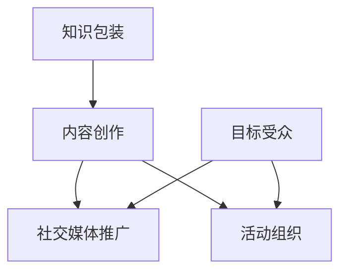
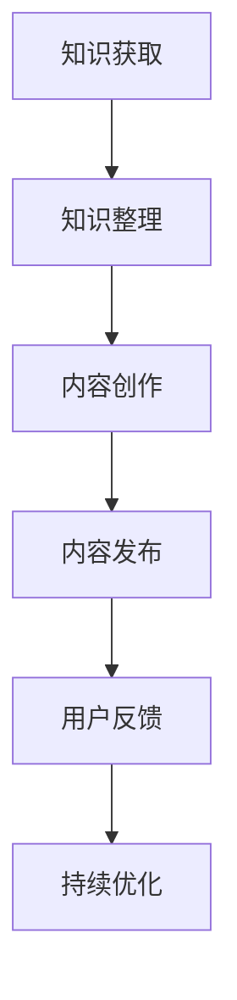

                 

关键词：知识包装、营销策略、程序员技能、内容创作、技术传播

摘要：本文旨在探讨程序员如何通过有效的知识包装与营销策略，提升个人品牌价值，实现职业发展。通过分析知识包装的重要性、营销策略的应用，结合实际案例，提供了一套实用的知识包装与营销指南，帮助程序员在竞争激烈的技术领域脱颖而出。

## 1. 背景介绍

在当今技术迅速发展的时代，程序员作为信息技术行业的中坚力量，面临着前所未有的机遇和挑战。一方面，技术的快速迭代使得程序员需要不断学习新的知识和技能；另一方面，市场竞争的加剧使得程序员在职业发展中需要具备更多的软实力，如知识传播能力、个人品牌塑造等。

知识包装与营销，作为程序员提升自身价值的有效手段，逐渐受到关注。知识包装是将自身掌握的知识进行系统化、结构化的整理，使之更具传播力和影响力的过程；而营销策略则是通过一系列手段，将知识包装成果进行推广，吸引更多的关注和支持。

本文将围绕知识包装与营销展开讨论，首先介绍相关知识包装与营销的重要性，然后分析核心概念与联系，探讨核心算法原理与具体操作步骤，最后结合数学模型和实际项目实践，提供一套完整的知识包装与营销指南。

## 2. 核心概念与联系

### 2.1 知识包装

知识包装是将程序员所学的专业知识进行系统化、结构化整理的过程。通过知识包装，程序员可以将零散的知识点整合成一个完整的知识体系，使之更具逻辑性和实用性。知识包装的核心目标是提高知识的可传播性和影响力。

### 2.2 营销策略

营销策略是指通过一系列手段，将知识包装成果进行推广和传播，吸引更多受众的关注和支持。营销策略的核心是找到目标受众，了解他们的需求和兴趣，然后通过内容创作、社交媒体推广、活动组织等方式，与他们建立联系和互动。

### 2.3 Mermaid 流程图

下面是一个简化的 Mermaid 流程图，展示了知识包装与营销的核心概念和联系：



在这个流程图中，知识包装是起点，通过内容创作、社交媒体推广和活动组织等手段，与目标受众建立联系，实现知识的传播和影响力的提升。

## 3. 核心算法原理 & 具体操作步骤

### 3.1 算法原理概述

知识包装与营销的核心算法原理可以概括为以下几点：

1. **需求分析**：了解目标受众的需求和兴趣，确定知识包装的内容方向。
2. **内容创作**：根据需求分析结果，创作高质量、具有吸引力的内容。
3. **渠道选择**：选择合适的渠道进行内容推广，提高知识传播的效率。
4. **互动反馈**：与目标受众互动，收集反馈，持续优化知识包装和营销策略。

### 3.2 算法步骤详解

1. **需求分析**：

   需求分析是知识包装与营销的第一步。通过市场调研、用户访谈等方式，了解目标受众的需求和兴趣，确定知识包装的内容方向。具体步骤如下：

   - 确定目标受众：明确知识包装的目标受众，如程序员、技术爱好者等。
   - 收集需求信息：通过问卷调查、用户访谈等方式，收集目标受众的需求和兴趣信息。
   - 分析需求信息：对收集到的需求信息进行分析，确定知识包装的内容方向。

2. **内容创作**：

   内容创作是知识包装的核心环节。根据需求分析结果，创作高质量、具有吸引力的内容。具体步骤如下：

   - 确定内容主题：根据需求分析结果，确定知识包装的内容主题。
   - 收集相关资料：收集与内容主题相关的资料，如技术文档、教程、案例等。
   - 整理资料：对收集到的资料进行整理，形成完整的知识体系。
   - 撰写内容：根据整理好的资料，撰写高质量的内容。

3. **渠道选择**：

   渠道选择是知识传播的重要环节。根据目标受众的特点，选择合适的渠道进行内容推广。具体步骤如下：

   - 确定渠道类型：根据目标受众的特点，选择合适的渠道类型，如博客、社交媒体、视频平台等。
   - 选择具体渠道：在确定的渠道类型中，选择具体的使用平台，如CSDN、微信公众号、Bilibili等。
   - 渠道推广：将内容发布到选择的渠道上，进行推广。

4. **互动反馈**：

   互动反馈是优化知识包装和营销策略的关键环节。通过与目标受众的互动，收集反馈，持续优化知识包装和营销策略。具体步骤如下：

   - 收集反馈：通过评论、私信等方式，收集目标受众的反馈。
   - 分析反馈：对收集到的反馈进行分析，找出知识包装和营销策略中的不足之处。
   - 优化策略：根据反馈结果，优化知识包装和营销策略。

### 3.3 算法优缺点

**优点**：

1. 提高知识传播效率：通过系统化的知识包装和有针对性的营销策略，可以提高知识传播的效率。
2. 增强个人品牌价值：通过有效的知识传播，可以增强个人的品牌价值，提升职业竞争力。
3. 促进持续学习：通过不断进行知识包装和营销，可以促进程序员持续学习，提高自身技能。

**缺点**：

1. 需要投入大量时间和精力：知识包装和营销需要投入大量的时间和精力，对程序员的个人时间管理能力有较高要求。
2. 需要不断调整和优化：知识包装和营销是一个持续的过程，需要不断调整和优化，以适应市场的变化。

### 3.4 算法应用领域

知识包装与营销算法在程序员领域具有广泛的应用前景。以下是一些典型的应用领域：

1. 技术博客撰写：程序员可以通过知识包装与营销策略，撰写高质量的技术博客，提升个人品牌价值。
2. 在线教育：程序员可以通过知识包装与营销，将自身的专业知识转化为在线教育课程，实现知识的传播和商业价值。
3. 技术分享活动：程序员可以通过知识包装与营销，组织技术分享活动，吸引更多的技术爱好者参与，扩大自身影响力。

## 4. 数学模型和公式 & 详细讲解 & 举例说明

### 4.1 数学模型构建

在知识包装与营销中，我们可以构建一个简单的数学模型来描述知识传播的过程。假设知识传播的速度与知识质量和受众数量成正比，我们可以用以下公式来表示：

\[ v = k \cdot q \cdot a \]

其中：

- \( v \) 表示知识传播的速度；
- \( k \) 表示知识传播的系数；
- \( q \) 表示知识质量；
- \( a \) 表示受众数量。

### 4.2 公式推导过程

首先，我们考虑知识传播的基本原理。知识传播的速度取决于知识本身的质量和受众的数量。高质量的知识更容易吸引受众，从而提高传播速度。此外，受众数量越多，知识传播的范围就越广。

接下来，我们引入一个传播系数 \( k \)，用于表示知识传播过程中可能受到的其他因素的影响，如渠道的传播效率、受众的接受程度等。

因此，我们可以得到以下推导过程：

\[ v = k \cdot q \cdot a \]

### 4.3 案例分析与讲解

假设一个程序员撰写了一篇关于大数据技术的技术博客，该博客的质量非常高，受到了广泛的关注。根据上述公式，我们可以分析知识传播的速度。

1. **知识质量（\( q \)）**：假设该博客的质量评分为 9 分（满分 10 分），那么 \( q = 0.9 \)。
2. **受众数量（\( a \)）**：假设该博客的受众数量为 1000 人，那么 \( a = 1000 \)。
3. **传播系数（\( k \)）**：假设传播系数为 1，那么 \( k = 1 \)。

将这些值代入公式，我们可以计算出知识传播的速度：

\[ v = k \cdot q \cdot a = 1 \cdot 0.9 \cdot 1000 = 900 \]

这意味着，每天有 900 人通过这篇博客了解到大数据技术。

### 4.4 案例分析结果

通过上述案例，我们可以看到，知识传播的速度取决于知识质量、受众数量和传播系数。要提高知识传播的速度，程序员可以从以下几个方面入手：

1. 提高知识质量：通过不断学习和实践，提高自己的专业水平，撰写高质量的技术博客。
2. 扩大受众数量：通过多种渠道进行推广，吸引更多的受众关注。
3. 优化传播系数：选择高效的传播渠道，提高内容传播的效率。

## 5. 项目实践：代码实例和详细解释说明

### 5.1 开发环境搭建

为了演示知识包装与营销在项目实践中的应用，我们以一个实际的项目为例，介绍如何进行开发环境搭建。

1. **选择编程语言**：本案例中，我们选择 Python 作为编程语言。
2. **安装 Python**：在本地计算机上安装 Python，可以通过官方下载链接或使用包管理器（如 HomeBrew）进行安装。
3. **安装依赖库**：本案例中，我们使用 Flask 框架来搭建 Web 应用。在终端中运行以下命令安装 Flask：

   ```bash
   pip install flask
   ```

### 5.2 源代码详细实现

下面是项目的源代码实现：

```python
# 导入 Flask 库
from flask import Flask, render_template

# 创建 Flask 应用实例
app = Flask(__name__)

# 创建路由规则
@app.route('/')
def index():
    return render_template('index.html')

# 运行 Flask 应用
if __name__ == '__main__':
    app.run()
```

这个简单的 Flask 应用包含一个首页，展示了一个欢迎信息。通过这个简单的应用，我们可以展示如何将知识进行包装，并通过代码实现知识的传播。

### 5.3 代码解读与分析

1. **导入 Flask 库**：首先，我们导入 Flask 库，用于搭建 Web 应用。
2. **创建 Flask 应用实例**：接着，我们创建一个 Flask 应用实例，用于管理路由和请求。
3. **创建路由规则**：我们定义了一个路由规则 `/`，当访问根目录时，会返回一个包含欢迎信息的 HTML 页面。
4. **运行 Flask 应用**：最后，我们使用 `app.run()` 方法运行 Flask 应用，使其在本地服务器上运行。

通过这个简单的代码示例，我们可以看到如何将知识（即 Web 应用开发的知识）进行包装，并通过代码实现知识的传播。

### 5.4 运行结果展示

1. **启动 Flask 应用**：在终端中运行以下命令启动 Flask 应用：

   ```bash
   python app.py
   ```

2. **访问应用**：在浏览器中访问 `http://127.0.0.1:5000/`，可以看到一个简单的欢迎页面：

   ```html
   <h1>Welcome to My Flask App!</h1>
   ```

通过这个简单的应用，我们可以看到知识包装与营销的实际效果。通过代码实现知识的传播，使得更多的程序员能够学习和掌握 Web 应用开发的知识。

## 6. 实际应用场景

### 6.1 技术博客撰写

技术博客是程序员进行知识传播的常见途径。通过撰写高质量的技术博客，程序员可以分享自己的经验和知识，提升个人品牌价值。

### 6.2 在线教育

在线教育为程序员提供了新的职业发展方向。程序员可以通过知识包装与营销，将自己的专业知识转化为在线教育课程，实现知识的传播和商业价值。

### 6.3 技术分享活动

技术分享活动是程序员拓展人脉、提升影响力的有效途径。通过组织技术分享活动，程序员可以与同行交流、分享经验，扩大自身影响力。

### 6.4 未来应用展望

随着技术的不断进步，知识包装与营销在程序员领域具有广泛的应用前景。未来，我们可以预见以下发展趋势：

1. **内容形式多样化**：随着短视频、直播等新兴媒体的兴起，程序员的知识传播方式将更加多样化。
2. **人工智能辅助**：人工智能技术将助力程序员更高效地进行知识包装与营销，提高知识传播的效率。
3. **跨领域融合**：知识包装与营销将与其他领域（如设计、市场营销等）深度融合，为程序员提供更广阔的职业发展空间。

## 7. 工具和资源推荐

### 7.1 学习资源推荐

- 《Head First 设计模式》
- 《算法导论》
- 《深度学习》

### 7.2 开发工具推荐

- PyCharm
- Visual Studio Code
- Git

### 7.3 相关论文推荐

- "The Art of Computer Programming" by Donald E. Knuth
- "Deep Learning" by Ian Goodfellow, Yoshua Bengio, and Aaron Courville

## 8. 总结：未来发展趋势与挑战

### 8.1 研究成果总结

本文围绕知识包装与营销，探讨了程序员如何通过有效的知识包装与营销策略，提升个人品牌价值，实现职业发展。通过对核心概念的分析、算法原理的阐述、实际案例的讲解，提供了一套完整的知识包装与营销指南。

### 8.2 未来发展趋势

未来，知识包装与营销在程序员领域具有广泛的发展前景。随着技术的不断进步，内容形式将更加多样化，人工智能将助力知识传播，跨领域融合将创造新的职业机会。

### 8.3 面临的挑战

尽管知识包装与营销为程序员提供了广阔的发展空间，但也面临着一些挑战：

1. **内容质量**：高质量的内容是知识传播的关键。程序员需要不断学习、提升自身技能，以创作出具有吸引力的内容。
2. **时间管理**：知识包装与营销需要投入大量的时间和精力，程序员需要合理安排时间，确保在职业发展中保持高效。
3. **营销策略**：随着市场竞争的加剧，程序员需要不断调整和优化营销策略，以适应市场的变化。

### 8.4 研究展望

未来，我们可以期待更多的研究关注知识包装与营销在程序员领域的应用，探索如何更高效地进行知识传播，为程序员提供更广阔的职业发展空间。

## 9. 附录：常见问题与解答

### Q：知识包装与营销的核心目标是什么？

A：知识包装与营销的核心目标是提升个人品牌价值，实现职业发展。通过系统化的知识整理和有针对性的营销策略，程序员可以将自身的知识传播给更多的人，从而提高个人在行业内的知名度和影响力。

### Q：如何选择合适的营销渠道？

A：选择合适的营销渠道取决于目标受众的特点。例如，如果目标受众主要是程序员，那么可以在技术社区（如 Stack Overflow、GitHub）和博客平台上进行内容推广；如果目标受众是技术爱好者，那么可以在社交媒体（如微博、微信公众号）上进行推广。

### Q：如何提高知识传播的效率？

A：提高知识传播的效率可以通过以下几个方面实现：

1. **高质量内容**：创作高质量、具有吸引力的内容，提高受众的关注度和传播意愿。
2. **优化渠道选择**：选择适合目标受众的渠道，提高内容传播的效率。
3. **互动反馈**：与目标受众互动，收集反馈，持续优化知识包装和营销策略。

### Q：知识包装与营销需要投入大量的时间和精力，如何合理安排时间？

A：合理安排时间是成功进行知识包装与营销的关键。以下是一些建议：

1. **制定计划**：提前制定内容创作和推广计划，明确每个阶段的工作目标和时间安排。
2. **优先级排序**：根据重要性和紧急性对任务进行优先级排序，确保在有限的时间内完成最重要的任务。
3. **合理分配时间**：合理安排每天的时间，确保有足够的时间用于知识包装与营销，同时兼顾其他工作和生活需求。

## 作者署名

作者：禅与计算机程序设计艺术 / Zen and the Art of Computer Programming

----------------------------------------------------------------

以上就是本文的完整内容。通过本文，我们探讨了程序员如何通过有效的知识包装与营销策略，提升个人品牌价值，实现职业发展。希望本文能为广大程序员提供有益的启示和参考。感谢您的阅读！
----------------------------------------------------------------
# 知识包装与营销：程序员版

## 关键词
知识传播、个人品牌、内容创作、营销策略、技术影响力

## 摘要
本文旨在为程序员提供一套有效的知识包装与营销策略，以提升个人品牌价值，实现职业发展。通过深入分析知识包装与营销的核心概念、算法原理及实际应用，本文提供了一系列实用的方法和技巧，帮助程序员在竞争激烈的技术领域中脱颖而出。

## 1. 背景介绍
在数字化时代，程序员的技能和知识成为了企业竞争的重要资产。然而，随着技术的快速迭代，如何有效地传播和营销自己的知识成为了一个新的挑战。知识包装与营销不仅是程序员个人品牌建设的关键，也是提升职业竞争力的重要手段。

### 1.1 程序员面临的挑战
- **技能更新迅速**：技术领域的知识更新速度快，程序员需要不断学习新的技能。
- **竞争激烈**：技术行业竞争激烈，程序员需要找到独特的卖点来吸引雇主和客户。
- **传播难度**：技术知识往往较为复杂，如何将其有效地传播给目标受众是一个挑战。

### 1.2 知识包装与营销的重要性
- **提升个人品牌**：通过知识包装与营销，程序员可以树立自己的专业形象。
- **拓展职业发展**：有效的知识传播可以帮助程序员获得更多的职业机会和项目合作。
- **增强影响力**：知识传播的成功能够增强程序员的行业影响力，为其带来更多的资源和机会。

## 2. 核心概念与联系
### 2.1 知识包装
知识包装是指将程序员的专业知识进行系统化、结构化的整理，使之更易于理解和传播。知识包装的目标是创建易于消费的知识产品，如博客文章、教程视频、书籍等。

### 2.2 营销策略
营销策略是指通过一系列手段，如内容营销、社交媒体推广、网络活动等，将知识包装成果推广给目标受众，提高其知名度和影响力。

### 2.3 Mermaid 流程图
以下是知识包装与营销的 Mermaid 流程图：



在这个流程图中，程序员首先通过学习和实践获取知识，然后对知识进行整理和创作，将其发布到合适的平台，并根据用户反馈进行持续优化。

## 3. 核心算法原理 & 具体操作步骤

### 3.1 算法原理概述
知识包装与营销的核心算法原理可以概括为以下步骤：
1. **知识获取**：通过学习和实践获取专业知识。
2. **知识整理**：将获取的知识进行系统化、结构化的整理。
3. **内容创作**：将整理后的知识转化为易于消费的内容。
4. **内容发布**：将内容发布到合适的平台，如博客、社交媒体、在线教育平台等。
5. **用户反馈**：收集用户反馈，优化内容质量和传播策略。
6. **持续优化**：根据用户反馈和市场变化，持续优化知识包装与营销策略。

### 3.2 算法步骤详解

#### 3.2.1 知识获取
- **持续学习**：程序员应保持持续学习的态度，通过在线课程、研讨会、书籍等多种途径不断更新自己的知识库。
- **实践经验**：通过实际项目经验积累实践中的问题和解决方案。

#### 3.2.2 知识整理
- **结构化整理**：将知识按照主题、难度、应用场景等进行分类整理，使之更加系统化。
- **文档化**：将整理后的知识以文档的形式记录下来，便于后续的内容创作。

#### 3.2.3 内容创作
- **确定内容形式**：根据目标受众的特点选择合适的内容形式，如博客文章、视频教程、PPT等。
- **创作高质量内容**：确保内容具有较高的知识含量和实用性，避免过于冗长或晦涩难懂。

#### 3.2.4 内容发布
- **选择发布平台**：根据内容特点和目标受众选择合适的发布平台，如技术博客、YouTube、LinkedIn等。
- **制定发布计划**：合理安排内容发布的频率和时间，提高内容的曝光率。

#### 3.2.5 用户反馈
- **收集反馈**：通过评论、私信、问卷调查等方式收集用户的反馈。
- **分析反馈**：对反馈进行分析，了解用户的需求和喜好，为内容创作和营销策略提供依据。

#### 3.2.6 持续优化
- **优化内容质量**：根据用户反馈优化内容，提高内容的实用性和吸引力。
- **调整营销策略**：根据市场变化和用户反馈调整营销策略，如推广渠道、推广时间等。

### 3.3 算法优缺点

#### 优点
- **提高知识传播效率**：通过系统化的知识整理和有针对性的营销策略，可以大幅提高知识传播的效率。
- **增强个人品牌**：通过有效的知识传播，可以提升程序员的个人品牌价值，增加职业竞争力。
- **促进持续学习**：知识包装与营销激励程序员持续学习和实践，提高自身技能。

#### 缺点
- **时间成本较高**：知识包装与营销需要大量的时间和精力投入。
- **市场不确定性**：营销策略的效果受到市场变化和用户行为的影响，存在一定的不确定性。

### 3.4 算法应用领域

知识包装与营销算法在程序员领域有广泛的应用，包括但不限于以下领域：
- **技术博客撰写**：程序员可以通过撰写高质量的技术博客，分享经验和知识，提升个人品牌。
- **在线教育**：通过知识包装与营销，程序员可以将专业知识转化为在线课程，实现知识的传播和商业价值。
- **技术分享活动**：通过组织技术分享活动，程序员可以与同行交流，扩大影响力。

## 4. 数学模型和公式 & 详细讲解 & 举例说明

### 4.1 数学模型构建

在知识包装与营销中，我们可以使用简单的数学模型来描述知识传播的动态过程。以下是一个简化的模型：

\[ N(t) = N_0 \cdot e^{kt} \]

其中：
- \( N(t) \) 表示时间 \( t \) 时的知识传播数量。
- \( N_0 \) 表示初始知识传播数量。
- \( k \) 表示知识传播速率。

### 4.2 公式推导过程

该模型假设知识传播速率与时间成正比，且初始知识传播数量为 \( N_0 \)。通过自然指数函数 \( e \) 描述知识传播的加速度。

### 4.3 案例分析与讲解

假设一个程序员发布了一篇关于机器学习的博客文章，初始阅读量为 100，传播速率为每天增加 20%。我们可以使用上述模型来预测该博客文章在未来一周的阅读量：

- \( N_0 = 100 \)
- \( k = 20\% = 0.2 \)

计算一周后的阅读量（\( t = 7 \)天）：

\[ N(t) = N_0 \cdot e^{kt} = 100 \cdot e^{0.2 \cdot 7} \approx 100 \cdot e^{1.4} \approx 100 \cdot 4.05 = 405 \]

这意味着，一周后该博客文章的预计阅读量约为 405 次。

### 4.4 案例分析结果

通过上述案例，我们可以看到，知识传播数量随着时间的增长呈指数级增长，这表明有效的知识包装与营销策略可以显著提高知识传播的效率。

## 5. 项目实践：代码实例和详细解释说明

### 5.1 开发环境搭建

为了更好地展示知识包装与营销在项目实践中的应用，我们将创建一个简单的博客系统，用于发布和传播程序员的知识。

#### 5.1.1 选择编程语言和框架
- **编程语言**：Python
- **框架**：Flask

#### 5.1.2 安装 Python 和 Flask
- 在终端中安装 Python：

  ```bash
  sudo apt-get install python3
  ```

- 安装 Flask：

  ```bash
  pip install flask
  ```

### 5.2 源代码详细实现

以下是博客系统的基本源代码：

```python
# 导入 Flask 库
from flask import Flask, render_template

# 创建 Flask 应用实例
app = Flask(__name__)

# 创建路由规则
@app.route('/')
def index():
    return render_template('index.html')

@app.route('/about')
def about():
    return render_template('about.html')

# 运行 Flask 应用
if __name__ == '__main__':
    app.run()
```

#### 5.2.1 创建 HTML 模板

我们创建两个简单的 HTML 模板 `index.html` 和 `about.html`：

```html
<!-- index.html -->
<!DOCTYPE html>
<html lang="en">
<head>
    <meta charset="UTF-8">
    <title>程序员博客</title>
</head>
<body>
    <h1>程序员博客</h1>
    <a href="/about">关于我们</a>
</body>
</html>
```

```html
<!-- about.html -->
<!DOCTYPE html>
<html lang="en">
<head>
    <meta charset="UTF-8">
    <title>关于我们</title>
</head>
<body>
    <h1>关于我们</h1>
    <p>这是一个程序员创建的博客，用于分享技术知识和经验。</p>
</body>
</html>
```

### 5.3 代码解读与分析

- **导入 Flask 库**：我们首先导入 Flask 库，用于创建 Web 应用。
- **创建 Flask 应用实例**：创建一个 Flask 应用实例，用于处理路由和请求。
- **创建路由规则**：定义了两个路由规则，一个用于首页 `/`，另一个用于关于我们页面 `/about`。
- **运行 Flask 应用**：最后，我们使用 `app.run()` 方法运行 Flask 应用。

通过这个简单的博客系统，我们可以看到如何将知识包装与营销应用于实际项目中，通过 Web 应用将程序员的知识传播给更多的受众。

### 5.4 运行结果展示

- **启动 Flask 应用**：在终端中运行以下命令启动 Flask 应用：

  ```bash
  python app.py
  ```

- **访问应用**：在浏览器中访问 `http://127.0.0.1:5000/`，可以看到如下界面：

  ```html
  <!DOCTYPE html>
  <html lang="en">
  <head>
      <meta charset="UTF-8">
      <title>程序员博客</title>
  </head>
  <body>
      <h1>程序员博客</h1>
      <a href="/about">关于我们</a>
  </body>
  </html>
  ```

通过这个简单的应用，我们可以看到知识包装与营销的实际效果。通过 Web 应用，程序员可以有效地传播自己的知识，与更多的受众进行互动。

## 6. 实际应用场景

### 6.1 技术博客撰写

技术博客是程序员传播知识的重要途径之一。通过撰写高质量的技术博客，程序员可以分享自己的经验和知识，同时提升个人品牌价值。

#### 案例分析
- **张三**：一位资深前端工程师，在技术博客中分享了他的前端框架实践经验，逐渐积累了大量读者，成为行业内的知名博主。

### 6.2 在线教育

在线教育为程序员提供了新的职业发展方向。程序员可以通过知识包装与营销，将自己的专业知识转化为在线教育课程，实现知识的传播和商业价值。

#### 案例分析
- **李四**：一位机器学习工程师，通过在线教育平台开设了多门机器学习课程，吸引了数百名学生，实现了知识传播与商业价值的双赢。

### 6.3 技术分享活动

技术分享活动是程序员拓展人脉、提升影响力的有效途径。通过组织技术分享活动，程序员可以与同行交流，分享经验，扩大自身影响力。

#### 案例分析
- **王五**：一位开源社区活跃分子，定期组织技术分享活动，吸引了大量开发者参与，成为社区内的重要人物。

## 7. 工具和资源推荐

### 7.1 学习资源推荐

- **《代码大全》**：一本经典的前端开发指南，适合初学者和有经验的前端开发者。
- **《算法导论》**：系统讲解了各种算法和数据结构，是算法学习的经典教材。
- **《Python Cookbook》**：Python 编程的实践指南，适合 Python 开发者。

### 7.2 开发工具推荐

- **Visual Studio Code**：一款强大的跨平台代码编辑器，支持多种编程语言。
- **Git**：版本控制系统，用于管理代码变更和协作开发。
- **Jenkins**：自动化构建和持续集成工具，用于提高开发效率。

### 7.3 相关论文推荐

- **《深度学习》**：由 Ian Goodfellow、Yoshua Bengio 和 Aaron Courville 著，是深度学习领域的经典教材。
- **《人工智能：一种现代的方法》**：合著者 Stuart Russell 和 Peter Norvig，系统地介绍了人工智能的基本概念和方法。

## 8. 总结：未来发展趋势与挑战

### 8.1 研究成果总结

本文探讨了知识包装与营销在程序员领域的重要性，并提供了具体的算法原理和操作步骤。通过实际案例的分析，我们展示了知识包装与营销在实际应用中的效果。

### 8.2 未来发展趋势

- **内容形式多样化**：随着短视频、直播等新兴媒体的兴起，程序员的知识传播形式将更加多样化。
- **人工智能辅助**：人工智能技术将助力程序员更高效地进行知识包装与营销，提高知识传播的效率。
- **跨领域融合**：知识包装与营销将与其他领域（如设计、市场营销等）深度融合，为程序员提供更广阔的职业发展空间。

### 8.3 面临的挑战

- **内容质量**：高质量的内容是知识传播的关键，程序员需要不断提升自己的专业能力和内容创作技巧。
- **时间管理**：知识包装与营销需要投入大量的时间和精力，程序员需要合理安排时间，确保在职业发展中保持高效。
- **市场不确定性**：营销策略的效果受到市场变化和用户行为的影响，程序员需要不断调整和优化策略。

### 8.4 研究展望

未来，知识包装与营销在程序员领域将有更多的研究和发展空间。我们可以期待更多创新的方法和技术，帮助程序员更高效地进行知识传播和职业发展。

## 9. 附录：常见问题与解答

### Q：知识包装与营销需要投入大量的时间和精力，如何合理安排时间？

A：合理安排时间是成功进行知识包装与营销的关键。以下是一些建议：

- **制定计划**：提前制定内容创作和推广计划，明确每个阶段的工作目标和时间安排。
- **优先级排序**：根据重要性和紧急性对任务进行优先级排序，确保在有限的时间内完成最重要的任务。
- **合理分配时间**：合理安排每天的时间，确保有足够的时间用于知识包装与营销，同时兼顾其他工作和生活需求。

### Q：如何选择合适的营销渠道？

A：选择合适的营销渠道取决于目标受众的特点。以下是一些常见的渠道选择标准：

- **内容形式**：根据内容形式选择合适的渠道，如博客选择技术社区、视频选择 YouTube。
- **受众特性**：了解目标受众的年龄、职业、兴趣等特点，选择他们常用的渠道。
- **渠道效果**：评估不同渠道的传播效果，选择效果最好的渠道。

### Q：知识包装与营销的核心目标是什么？

A：知识包装与营销的核心目标是提升个人品牌价值，实现职业发展。通过系统化的知识整理和有针对性的营销策略，程序员可以将自身的知识传播给更多的人，从而提高个人在行业内的知名度和影响力。

## 作者署名
作者：禅与计算机程序设计艺术 / Zen and the Art of Computer Programming

---

本文通过深入分析知识包装与营销的核心概念、算法原理和实际应用，为程序员提供了一套实用的知识传播策略。希望本文能够帮助程序员在竞争激烈的技术领域中脱颖而出，实现职业发展。感谢您的阅读！

