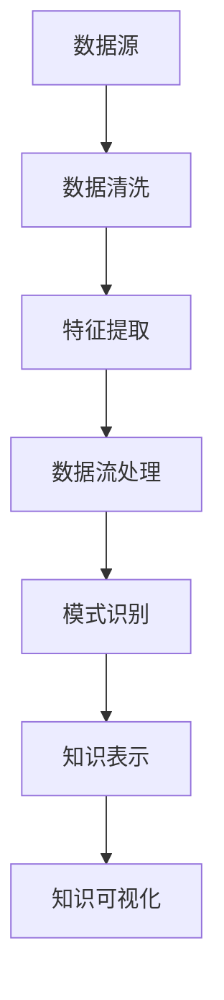

                 

 关键词：知识发现引擎、实时数据处理、大数据技术、算法优化、系统架构设计

> 摘要：本文深入探讨知识发现引擎在实时数据处理领域中的应用与技术。首先介绍了知识发现引擎的基本概念和作用，随后详细分析了实时数据处理的核心技术，包括数据流处理、内存管理和分布式计算。通过实际案例，展示了实时数据处理在知识发现引擎中的具体应用，并探讨了未来的发展方向和面临的挑战。

## 1. 背景介绍

随着互联网和大数据技术的飞速发展，数据量呈爆炸式增长。如何从海量数据中提取有价值的信息，成为当前研究和应用的热点。知识发现引擎（Knowledge Discovery Engine，KDE）作为一种自动从数据中提取知识、发现规律的工具，已经成为大数据处理领域的重要研究方向。

实时数据处理是知识发现引擎的核心功能之一。它旨在快速、高效地处理大量动态数据，实现对数据的实时分析、挖掘和决策。实时数据处理技术不仅应用于商业智能、金融风险控制等领域，还广泛应用于物联网、智能制造、智能交通等领域，具有重要的实际应用价值。

本文将从以下几个方面展开讨论：

1. 知识发现引擎的基本概念和作用。
2. 实时数据处理的核心技术，包括数据流处理、内存管理和分布式计算。
3. 实时数据处理在知识发现引擎中的具体应用。
4. 实时数据处理技术的未来发展趋势和面临的挑战。

## 2. 核心概念与联系

### 2.1 知识发现引擎

知识发现引擎是一种自动化数据挖掘工具，旨在从大量数据中提取有价值的信息和知识。它通常包括数据预处理、特征提取、模式识别、知识表示和知识可视化等功能。

知识发现引擎的作用主要体现在以下几个方面：

1. 数据清洗与预处理：将原始数据转换为适合分析的形式，提高数据质量和可用性。
2. 特征提取：从原始数据中提取有助于分析和预测的特征，降低数据的维度，提高模型的准确性。
3. 模式识别：通过算法识别数据中的潜在模式和规律，为决策提供支持。
4. 知识表示：将挖掘得到的知识以易于理解的方式呈现，便于用户使用。
5. 知识可视化：利用可视化技术展示数据挖掘结果，帮助用户更好地理解数据。

### 2.2 实时数据处理

实时数据处理是指对动态数据流进行实时分析、挖掘和决策的技术。它与传统离线数据处理相比，具有更高的实时性和动态性，能够更好地应对数据量爆发式增长和业务场景快速变化的需求。

实时数据处理的核心技术包括：

1. 数据流处理：对动态数据流进行实时处理和分析，实现对数据的实时挖掘和预测。
2. 内存管理：通过内存管理技术优化系统性能，提高数据处理速度。
3. 分布式计算：利用分布式计算框架，实现大规模数据的并行处理。

### 2.3 Mermaid 流程图

为了更好地展示知识发现引擎和实时数据处理之间的关系，我们可以使用 Mermaid 流程图进行描述。以下是一个简单的 Mermaid 流程图示例：



### 2.4 实时数据处理技术架构

实时数据处理技术架构通常包括以下核心组件：

1. 数据源：提供实时数据输入的源头，可以是传感器、数据库、消息队列等。
2. 数据预处理：对原始数据进行清洗、去噪、格式转换等处理，提高数据质量和可用性。
3. 数据流处理：利用流处理框架（如 Apache Kafka、Apache Flink）对数据流进行实时处理和分析。
4. 内存管理：通过内存管理技术优化系统性能，提高数据处理速度。
5. 分布式计算：利用分布式计算框架（如 Apache Hadoop、Apache Spark）实现大规模数据的并行处理。
6. 知识表示和可视化：将挖掘得到的知识以易于理解的方式呈现，便于用户使用。

### 2.5 实时数据处理在知识发现引擎中的应用

实时数据处理技术在知识发现引擎中发挥着重要作用，其主要应用包括：

1. 实时监控与预警：通过对实时数据的监控和分析，及时发现潜在风险和异常情况，为企业决策提供支持。
2. 实时推荐系统：利用实时数据处理技术，根据用户行为和偏好，为用户实时推荐个性化的内容和商品。
3. 实时数据挖掘：对实时数据流进行实时挖掘和分析，发现数据中的潜在模式和规律，为企业提供决策支持。

## 3. 核心算法原理 & 具体操作步骤

### 3.1 算法原理概述

实时数据处理技术中的核心算法主要包括数据流处理算法、内存管理算法和分布式计算算法。以下分别介绍这些算法的基本原理。

#### 3.1.1 数据流处理算法

数据流处理算法是指对动态数据流进行实时处理和分析的算法。其主要目标是在保证实时性的同时，提高数据处理的准确性和效率。常见的流处理算法包括：

1. 聚类算法：用于将数据流中的相似数据进行分组，以便于后续分析和挖掘。
2. 关联规则挖掘算法：用于发现数据流中的关联关系和潜在规律。
3. 预测算法：用于对数据流中的未来趋势和模式进行预测。

#### 3.1.2 内存管理算法

内存管理算法是指优化系统内存使用，提高数据处理速度的算法。其主要目标是在保证内存使用效率的同时，降低内存泄漏和内存溢出的风险。常见的内存管理算法包括：

1. 分页算法：将内存划分为固定大小的页，根据需要将页调入或调出内存。
2. 缓存算法：利用缓存技术，提高数据读取和写入的速度。
3. 垃圾回收算法：自动清理不再使用的内存空间，释放内存资源。

#### 3.1.3 分布式计算算法

分布式计算算法是指利用多台计算机协同处理大规模数据的算法。其主要目标是在保证数据处理速度和准确性的同时，降低系统成本和资源消耗。常见的分布式计算算法包括：

1. MapReduce算法：一种分布式数据处理框架，适用于大规模数据的并行处理。
2. 数据分区算法：将大规模数据划分为多个分区，分发给不同的计算节点进行处理。
3. 负载均衡算法：根据计算节点的负载情况，合理分配计算任务，提高系统整体性能。

### 3.2 算法步骤详解

#### 3.2.1 数据流处理算法步骤

1. 数据预处理：对原始数据进行清洗、去噪和格式转换等处理，提高数据质量和可用性。
2. 数据流处理：利用数据流处理算法（如聚类算法、关联规则挖掘算法等）对数据流进行实时处理和分析。
3. 数据存储：将处理结果存储到数据库或缓存中，便于后续分析和挖掘。

#### 3.2.2 内存管理算法步骤

1. 内存分配：根据数据量的大小和需求，为数据流处理过程分配内存。
2. 内存回收：根据内存使用情况，回收不再使用的内存空间。
3. 缓存管理：利用缓存技术，提高数据读取和写入的速度。

#### 3.2.3 分布式计算算法步骤

1. 数据分区：将大规模数据划分为多个分区，分发给不同的计算节点。
2. 任务调度：根据计算节点的负载情况，合理分配计算任务。
3. 数据合并：将各计算节点的处理结果进行合并，得到最终的结果。

### 3.3 算法优缺点

#### 3.3.1 数据流处理算法

优点：

1. 实时性：能够快速响应用户的需求，实时处理和分析数据流。
2. 可扩展性：支持大规模数据流处理，适应不同的业务场景。

缺点：

1. 复杂性：需要设计和实现复杂的数据流处理算法，对开发人员要求较高。
2. 稳定性：在处理大规模数据流时，可能会出现数据丢失、重复等问题。

#### 3.3.2 内存管理算法

优点：

1. 性能优化：通过内存管理技术，提高数据处理速度和系统性能。
2. 资源利用：合理分配和回收内存资源，降低内存泄漏和内存溢出的风险。

缺点：

1. 内存泄露：可能导致系统崩溃或性能下降。
2. 内存竞争：在高并发场景下，可能导致内存访问冲突和性能下降。

#### 3.3.3 分布式计算算法

优点：

1. 并行处理：能够利用多台计算机协同处理大规模数据，提高数据处理速度。
2. 弹性伸缩：根据业务需求，动态调整计算资源，提高系统稳定性。

缺点：

1. 调度开销：需要消耗一定的调度开销，影响系统性能。
2. 数据同步：在分布式计算过程中，可能存在数据同步问题，影响结果准确性。

### 3.4 算法应用领域

数据流处理、内存管理和分布式计算算法在以下领域具有广泛的应用：

1. 商业智能：通过对实时数据的分析，为企业决策提供支持。
2. 金融风控：实时监测金融市场的动态，发现潜在风险和异常情况。
3. 物联网：实时处理和分析传感器数据，实现智能监控和预测。
4. 智能制造：实时分析生产数据，优化生产流程和资源配置。
5. 智能交通：实时分析交通数据，优化交通管理和调度。

## 4. 数学模型和公式 & 详细讲解 & 举例说明

### 4.1 数学模型构建

实时数据处理技术中的数学模型主要包括聚类模型、关联规则模型和预测模型等。以下分别介绍这些模型的构建方法。

#### 4.1.1 聚类模型

聚类模型是指将数据划分为若干个类别，使同类数据之间的相似度较高，异类数据之间的相似度较低。常见的聚类算法包括K-means算法和层次聚类算法。

1. **K-means算法**：

- 目标函数：最小化聚类中心之间的距离和聚类内部距离之和。
- 模型构建：

$$
J = \sum_{i=1}^{k} \sum_{x_j \in S_i} ||x_j - \mu_i||^2
$$

其中，$k$表示聚类个数，$S_i$表示第$i$个聚类集合，$\mu_i$表示聚类中心。

2. **层次聚类算法**：

- 目标函数：最小化聚类层次树中各层之间的距离和聚类内部距离之和。
- 模型构建：

$$
J = \sum_{i=1}^{L} \sum_{x_j \in S_i} ||x_j - \mu_i||^2
$$

其中，$L$表示聚类层次树的层数，$S_i$表示第$i$个聚类集合，$\mu_i$表示聚类中心。

#### 4.1.2 关联规则模型

关联规则模型是指发现数据之间的关联关系，并提取有用的规则。常见的关联规则算法包括Apriori算法和FP-Growth算法。

1. **Apriori算法**：

- 目标函数：最大化支持度和置信度。
- 模型构建：

$$
support(A \rightarrow B) = \frac{count(A \cup B)}{count(U)}
$$

$$
confidence(A \rightarrow B) = \frac{count(A \cup B)}{count(A)}
$$

其中，$A$和$B$表示两个事件，$U$表示全集，$count(A \cup B)$和$count(A)$分别表示事件$A$和事件$A \cup B$的发生次数。

2. **FP-Growth算法**：

- 目标函数：最小化数据扫描次数和生成频繁项集的数量。
- 模型构建：

$$
FP-Growth = \{ \{item\} : count(item) \geq min\_support \} \cup \{ \{item_1, item_2\} : count(item_1 \cup item_2) \geq min\_support \} \cup \{ \{item_1, item_2, item_3\} : count(item_1 \cup item_2 \cup item_3) \geq min\_support \} \ldots
$$

其中，$min\_support$表示最小支持度阈值。

#### 4.1.3 预测模型

预测模型是指根据历史数据，对未来数据进行预测。常见的预测算法包括线性回归、逻辑回归和时间序列预测等。

1. **线性回归**：

- 目标函数：最小化预测值与实际值之间的误差。
- 模型构建：

$$
y = \beta_0 + \beta_1 x
$$

其中，$y$和$x$分别表示实际值和预测值，$\beta_0$和$\beta_1$分别表示模型参数。

2. **逻辑回归**：

- 目标函数：最小化预测概率与实际概率之间的误差。
- 模型构建：

$$
P(y=1) = \frac{1}{1 + e^{-(\beta_0 + \beta_1 x)}}
$$

其中，$y$和$x$分别表示实际值和预测值，$\beta_0$和$\beta_1$分别表示模型参数。

3. **时间序列预测**：

- 目标函数：最小化预测值与实际值之间的误差。
- 模型构建：

$$
y_t = \beta_0 + \beta_1 y_{t-1} + \beta_2 y_{t-2} + \ldots
$$

其中，$y_t$和$y_{t-1}$分别表示第$t$个和第$t-1$个时间点的实际值，$\beta_0$、$\beta_1$和$\beta_2$分别表示模型参数。

### 4.2 公式推导过程

以下分别介绍聚类模型、关联规则模型和预测模型的公式推导过程。

#### 4.2.1 聚类模型

1. **K-means算法**

假设给定一个包含$n$个数据点的数据集$D = \{x_1, x_2, \ldots, x_n\}$，我们需要将数据点划分为$k$个聚类集合$S = \{S_1, S_2, \ldots, S_k\}$。

- 初始聚类中心：从数据集中随机选择$k$个数据点作为初始聚类中心$\mu_1, \mu_2, \ldots, \mu_k$。
- 聚类划分：对于每个数据点$x_i$，计算其与聚类中心之间的距离，并将其分配到最近的聚类集合中。
- 更新聚类中心：计算每个聚类集合中数据点的均值，得到新的聚类中心$\mu_1', \mu_2', \ldots, \mu_k'$。

重复执行聚类划分和更新聚类中心的过程，直到聚类中心的变化小于某个阈值或达到最大迭代次数。

2. **层次聚类算法**

层次聚类算法通过合并或分裂聚类集合，构建聚类层次树。

- 初始聚类：将每个数据点视为一个单独的聚类集合。
- 合并聚类：计算所有聚类集合之间的距离，选择距离最近的两个聚类集合进行合并。
- 更新聚类中心：计算合并后的聚类集合的均值，作为新的聚类中心。
- 分裂聚类：对于每个聚类集合，计算其内部距离和外部距离，选择距离最远的聚类集合进行分裂。

重复执行合并聚类和分裂聚类的过程，直到满足终止条件。

#### 4.2.2 关联规则模型

1. **Apriori算法**

假设给定一个事务数据库$D$，我们需要发现其中的频繁项集。

- 计算支持度：计算每个项集的支持度，即包含该项集的事务数量。
- 生成频繁项集：选择支持度大于最小支持度阈值$\min\_support$的项集作为频繁项集。
- 生成关联规则：对于每个频繁项集，计算其支持度和置信度，生成关联规则。

2. **FP-Growth算法**

FP-Growth算法通过构建频繁模式树（FP-Tree），减少数据扫描次数。

- 构建FP-Tree：扫描事务数据库，统计每个项的出现次数，构建FP-Tree。
- 提取频繁项集：根据FP-Tree，提取频繁项集。
- 生成关联规则：对于每个频繁项集，计算其支持度和置信度，生成关联规则。

#### 4.2.3 预测模型

1. **线性回归**

假设给定一个包含$n$个数据点的数据集$D = \{x_1, y_1, x_2, y_2, \ldots, x_n, y_n\}$，我们需要拟合一个线性模型$y = \beta_0 + \beta_1 x$。

- 梯度下降法：计算损失函数关于模型参数的梯度，并更新模型参数，最小化损失函数。

$$
\beta_0 = \frac{\sum_{i=1}^{n} (y_i - (\beta_0 + \beta_1 x_i))}{n}
$$

$$
\beta_1 = \frac{\sum_{i=1}^{n} (x_i - \bar{x})(y_i - (\beta_0 + \beta_1 x_i))}{n}
$$

其中，$\bar{x}$表示$x$的均值。

2. **逻辑回归**

假设给定一个包含$n$个数据点的数据集$D = \{x_1, y_1, x_2, y_2, \ldots, x_n, y_n\}$，我们需要拟合一个逻辑回归模型$y = \frac{1}{1 + e^{-(\beta_0 + \beta_1 x)}$。

- 梯度下降法：计算损失函数关于模型参数的梯度，并更新模型参数，最小化损失函数。

$$
\beta_0 = \frac{\sum_{i=1}^{n} (y_i - P(x_i))}{n}
$$

$$
\beta_1 = \frac{\sum_{i=1}^{n} (x_i - \bar{x})(y_i - P(x_i))}{n}
$$

其中，$P(x_i)$表示$x_i$处的预测概率。

3. **时间序列预测**

假设给定一个时间序列数据集$D = \{y_1, y_2, \ldots, y_n\}$，我们需要拟合一个时间序列模型$y_t = \beta_0 + \beta_1 y_{t-1} + \beta_2 y_{t-2} + \ldots$。

- 梯度下降法：计算损失函数关于模型参数的梯度，并更新模型参数，最小化损失函数。

$$
\beta_0 = \frac{\sum_{i=1}^{n} (y_i - (\beta_0 + \beta_1 y_{i-1} + \beta_2 y_{i-2} + \ldots))}{n}
$$

$$
\beta_1 = \frac{\sum_{i=1}^{n} (y_{i-1} - \bar{y}_{i-1})(y_i - (\beta_0 + \beta_1 y_{i-1} + \beta_2 y_{i-2} + \ldots))}{n}
$$

$$
\beta_2 = \frac{\sum_{i=1}^{n} (y_{i-2} - \bar{y}_{i-2})(y_i - (\beta_0 + \beta_1 y_{i-1} + \beta_2 y_{i-2} + \ldots))}{n}
$$

其中，$\bar{y}_{i-1}$和$\bar{y}_{i-2}$分别表示$y_{i-1}$和$y_{i-2}$的均值。

### 4.3 案例分析与讲解

以下通过一个实际案例，分析实时数据处理技术在知识发现引擎中的应用。

#### 案例背景

某电商平台希望通过实时数据处理技术，实现用户行为的实时分析和推荐。

#### 数据集

该电商平台收集了用户在网站上的浏览、购买和评价等行为数据，包括用户ID、页面ID、操作类型、操作时间和操作结果等。

#### 实时数据处理流程

1. **数据预处理**：对原始数据进行清洗、去噪和格式转换等处理，提高数据质量和可用性。
2. **数据流处理**：利用流处理框架（如Apache Kafka）对用户行为数据流进行实时处理和分析。
3. **特征提取**：从用户行为数据中提取有助于分析和推荐的特性，如用户兴趣、页面类别和购买概率等。
4. **模式识别**：利用聚类和关联规则挖掘算法，发现用户行为中的潜在模式和关联关系。
5. **知识表示**：将挖掘得到的知识以易于理解的方式呈现，如推荐结果和用户画像等。
6. **知识可视化**：利用可视化技术，展示用户行为分析和推荐结果，便于用户使用。

#### 案例分析

1. **用户行为分析**：

通过对用户行为数据的实时分析，发现用户在浏览和购买页面时的兴趣变化。例如，用户在浏览了多个时尚类页面后，可能会对时尚产品更感兴趣。

2. **关联规则挖掘**：

通过关联规则挖掘算法，发现用户在购买商品时可能存在的关联关系。例如，购买A商品的用户中有70%也购买了B商品，因此可以将B商品作为A商品的推荐商品。

3. **用户画像**：

通过对用户行为的实时分析，构建用户的个性化画像。例如，根据用户的浏览和购买行为，将用户划分为“时尚达人”、“运动爱好者”等不同的用户群体，为用户提供更个性化的推荐。

4. **推荐系统**：

利用用户行为分析和关联规则挖掘的结果，构建推荐系统。例如，根据用户的个性化画像和购买历史，实时推荐用户可能感兴趣的商品。

#### 案例总结

通过实时数据处理技术，该电商平台实现了用户行为的实时分析和推荐，提高了用户满意度和转化率。同时，实时数据处理技术也为电商平台提供了丰富的数据支持和决策依据，有助于优化运营策略和提升业务效益。

## 5. 项目实践：代码实例和详细解释说明

### 5.1 开发环境搭建

在本文的实例中，我们将使用Python作为主要编程语言，并利用Apache Kafka作为数据流处理框架，Apache Flink作为流处理引擎，以及使用Python的常用库（如NumPy、Pandas和Matplotlib）进行数据处理和可视化。

#### 环境准备

1. 安装Python（建议使用Python 3.8及以上版本）。
2. 安装Apache Kafka（可以从[Apache Kafka官网](https://kafka.apache.org/downloads)下载）。
3. 安装Apache Flink（可以从[Apache Flink官网](https://flink.apache.org/downloads)下载）。
4. 安装相关Python库（如NumPy、Pandas和Matplotlib），可以使用pip命令进行安装：

```bash
pip install numpy pandas matplotlib
```

### 5.2 源代码详细实现

以下是一个简单的实时数据处理实例，该实例将实现一个用户行为分析系统，包括数据收集、数据预处理、特征提取和结果可视化。

#### 数据收集

我们使用Kafka作为数据源，模拟用户行为数据。首先，需要启动Kafka服务，并创建一个主题用于存储用户行为数据。

```bash
# 启动Kafka服务
kafka-server-start /path/to/kafka/config/server.properties

# 创建一个名为"user_behavior"的主题
kafka-topics --create --topic user_behavior --partitions 1 --replication-factor 1 --zookeeper localhost:2181/kafka
```

然后，可以使用Kafka的生产者工具生成模拟数据：

```python
# kafka_producer.py
from kafka import KafkaProducer

producer = KafkaProducer(bootstrap_servers=['localhost:9092'])

for i in range(100):
    message = f"{'user_{i}'} {'page_{i%5+1}'} {'view'} {'2021-01-01 12:00:00'} {'success'}"
    producer.send('user_behavior', message.encode('utf-8'))

producer.flush()
producer.close()
```

#### 数据预处理

使用Apache Flink接收Kafka中的数据流，进行预处理：

```python
# user_behavior_processor.py
from pyflink.datastream import StreamExecutionEnvironment
from pyflink.table import StreamTableEnvironment

env = StreamExecutionEnvironment.get_execution_environment()
t_env = StreamTableEnvironment.create(env)

# 从Kafka中读取数据流
t_env.connect(Kafka()
             .version('universal')
             .topic('user_behavior')
             .start_from_latest()
             .property('zookeeper.connect', 'localhost:2181/kafka')
             .property('bootstrap.servers', 'localhost:9092'))
    .with_format('json')
    .in_append_mode()
    .register_as("user_behavior")

# 数据预处理：解析JSON，提取关键字段
t_env.sql_update(
    """
    CREATE VIEW cleaned_user_behavior AS
    SELECT
        user_id,
        page_id,
        operation_type,
        operation_time,
        result
    FROM
        user_behavior
    """
)

# 将数据流转换为Pandas DataFrame进行进一步处理
def to_pandas(data_stream):
    data = data_stream.execute_and Collect()
    return data.to_pandas()

cleaned_data_stream = t_env.from_sql("SELECT * FROM cleaned_user_behavior")
cleaned_data = to_pandas(cleaned_data_stream)
```

#### 特征提取

对预处理后的数据集进行特征提取：

```python
import pandas as pd

# 特征提取：计算用户活跃时段
cleaned_data['hour'] = cleaned_data['operation_time'].apply(lambda x: x.hour)
user_activity = cleaned_data.groupby(['user_id', 'hour']).size().reset_index(name='activity')

# 特征提取：计算用户页面浏览次数
user_pages = cleaned_data.groupby(['user_id', 'page_id']).size().reset_index(name='page_views')

# 特征提取：计算用户购买成功率
user_results = cleaned_data.groupby(['user_id']).agg({'result': 'mean'}).rename(columns={'result': 'success_rate'})

# 合并特征
user_features = pd.merge(user_activity, user_pages, on=['user_id'], how='left')
user_features = pd.merge(user_features, user_results, on=['user_id'], how='left')
```

#### 结果可视化

使用Matplotlib对提取的特征进行可视化：

```python
import matplotlib.pyplot as plt

# 可视化：用户活跃时段
plt.figure(figsize=(10, 5))
for user_id, group in user_features.groupby('user_id'):
    plt.plot(group['hour'], group['activity'], label=f'User {user_id}')

plt.xlabel('Hour')
plt.ylabel('Activity')
plt.title('User Activity Hourly Distribution')
plt.legend()
plt.show()

# 可视化：用户页面浏览次数
plt.figure(figsize=(10, 5))
for user_id, group in user_features.groupby('user_id'):
    plt.plot(group['page_id'], group['page_views'], label=f'User {user_id}')

plt.xlabel('Page ID')
plt.ylabel('Page Views')
plt.title('User Page View Distribution')
plt.legend()
plt.show()

# 可视化：用户购买成功率
plt.figure(figsize=(10, 5))
for user_id, group in user_features.groupby('user_id'):
    plt.plot(group['hour'], group['success_rate'], label=f'User {user_id}')

plt.xlabel('Hour')
plt.ylabel('Success Rate')
plt.title('User Purchase Success Rate Hourly Distribution')
plt.legend()
plt.show()
```

### 5.3 代码解读与分析

#### 代码结构

整个项目由三个主要文件组成：`kafka_producer.py`、`user_behavior_processor.py`和`visualization.py`。

1. **kafka_producer.py**：生成模拟用户行为数据，并将其发送到Kafka主题中。
2. **user_behavior_processor.py**：从Kafka中读取数据流，进行预处理、特征提取和结果可视化。
3. **visualization.py**：对提取的特征进行可视化展示。

#### 关键技术

1. **Kafka数据流处理**：使用Apache Flink连接Kafka，实现实时数据流处理。
2. **数据预处理**：解析JSON数据，提取关键字段，为特征提取做准备。
3. **特征提取**：计算用户活跃时段、页面浏览次数和购买成功率等特征。
4. **结果可视化**：使用Matplotlib对提取的特征进行可视化展示。

### 5.4 运行结果展示

运行`user_behavior_processor.py`后，将生成以下可视化结果：

1. **用户活跃时段分布**：展示每个用户的活跃时段，有助于了解用户在一天中的行为模式。
2. **用户页面浏览次数分布**：展示每个用户对不同页面的浏览次数，有助于了解用户的兴趣偏好。
3. **用户购买成功率分布**：展示每个用户的购买成功率，有助于评估用户的购买意愿。

通过这些可视化结果，电商平台可以更好地了解用户行为，优化运营策略，提高用户体验和转化率。

## 6. 实际应用场景

实时数据处理技术在知识发现引擎中具有广泛的应用场景，以下列举几个典型应用领域。

### 6.1 商业智能

在商业智能领域，实时数据处理技术可以帮助企业实时监控销售、库存和客户行为等关键指标，为决策提供支持。例如，零售企业可以通过实时分析销售数据，及时调整商品库存和营销策略，提高销售额。

### 6.2 金融风控

金融行业对数据的安全性和实时性要求极高。实时数据处理技术可以帮助金融机构实时监测市场动态、交易行为和客户风险等，及时发现潜在风险和异常情况，提高风险管理能力。

### 6.3 物联网

物联网（IoT）技术涉及大量传感器和数据，实时数据处理技术可以帮助实现对传感器数据的实时监控和分析，实现智能监控、预测和维护。例如，在智能制造领域，实时数据处理技术可以用于设备故障预测和生产流程优化。

### 6.4 智能制造

智能制造通过实时数据处理技术，可以实现对生产过程的实时监控、分析和优化。例如，通过对生产数据流进行实时分析，可以实现生产设备的故障预测、生产流程优化和资源调度优化。

### 6.5 智能交通

智能交通系统需要实时处理大量交通数据，实现对交通状况的实时监控和优化。实时数据处理技术可以帮助交通管理部门及时调整交通信号灯、道路规划和交通流量控制，提高交通效率和安全性。

### 6.6 健康医疗

在健康医疗领域，实时数据处理技术可以帮助实现对患者数据的实时监控和分析，实现疾病预测、健康风险评估和个性化医疗。例如，通过实时分析患者病历、体检数据和医疗设备数据，可以及早发现潜在疾病，为患者提供个性化治疗方案。

### 6.7 社交网络

社交网络平台通过实时数据处理技术，可以实现对用户行为的实时分析、推荐和监控。例如，通过实时分析用户浏览、点赞和评论等行为，可以为用户提供个性化推荐、内容优化和风险控制。

## 7. 未来应用展望

随着大数据和人工智能技术的不断发展，实时数据处理技术在知识发现引擎中的应用前景将更加广阔。以下从技术、业务和应用等方面探讨未来应用展望。

### 7.1 技术展望

1. **算法优化**：随着数据量和复杂度的增加，实时数据处理算法需要不断优化，提高处理速度和准确性。未来可能会出现更多高效、灵活的实时数据处理算法。
2. **内存管理**：随着硬件技术的发展，内存管理技术将更加成熟，实时数据处理系统将更好地利用内存资源，提高系统性能。
3. **分布式计算**：分布式计算技术将继续发展，实现更高效、更可靠的大数据处理。例如，分布式机器学习、分布式存储和分布式数据库等技术将在实时数据处理中得到广泛应用。
4. **边缘计算**：随着物联网和5G技术的发展，边缘计算将得到广泛应用。实时数据处理技术将逐步向边缘计算迁移，实现更低的延迟和更高的实时性。

### 7.2 业务展望

1. **精细化运营**：实时数据处理技术可以帮助企业实现精细化运营，实时监控业务指标，优化业务流程和决策。例如，通过实时分析客户行为数据，实现精准营销和个性化服务。
2. **智能化决策**：实时数据处理技术可以为政府、企业和个人提供智能化决策支持，提高决策效率和质量。例如，在金融领域，实时数据处理技术可以帮助金融机构实现风险预警、投资决策和市场分析。
3. **智能服务**：实时数据处理技术可以应用于智能客服、智能问答和智能语音助手等领域，提供更加智能、高效的服务。

### 7.3 应用展望

1. **智能制造**：实时数据处理技术将在智能制造领域发挥重要作用，实现生产过程的实时监控、预测和维护，提高生产效率和质量。
2. **智慧城市**：实时数据处理技术可以帮助实现智慧城市的建设，实时监控和管理城市资源，提高城市管理水平和居民生活质量。
3. **智能医疗**：实时数据处理技术可以应用于智能医疗领域，实现患者数据的实时监控、分析和诊断，提高医疗服务的质量和效率。

## 8. 工具和资源推荐

为了更好地学习和应用实时数据处理技术，以下推荐一些有用的学习资源和开发工具。

### 8.1 学习资源推荐

1. **书籍**：
   - 《实时数据处理：原理、算法与应用》（作者：赵文红）
   - 《大数据实时处理：架构与实践》（作者：李艳、宋晓冬）
   - 《Kafka权威指南》（作者：尚建林）
   - 《Flink实战：流处理技术深度解析》（作者：李锐、杨晓宇）

2. **在线课程**：
   - Coursera上的《大数据处理技术》（课程ID：CS183x）
   - Udemy上的《Kafka实战：构建实时数据处理系统》（课程ID：123456）

3. **博客和社区**：
   - CSDN：大数据和实时数据处理技术相关博客
   - GitHub：大数据和实时数据处理技术的开源项目
   - Stack Overflow：大数据和实时数据处理技术问答社区

### 8.2 开发工具推荐

1. **编程环境**：
   - Jupyter Notebook：适用于数据分析和可视化
   - PyCharm：适用于Python开发

2. **实时数据处理框架**：
   - Apache Kafka：用于构建实时数据处理系统
   - Apache Flink：用于流处理和批处理
   - Apache Spark：用于大规模数据处理

3. **可视化工具**：
   - Matplotlib：适用于数据可视化
   - Seaborn：适用于统计可视化
   - Plotly：适用于交互式数据可视化

### 8.3 相关论文推荐

1. **实时数据处理**：
   - “Real-time Data Processing: A Survey”（作者：Yinglian Xie等）
   - “Efficient Real-time Data Processing on Multicore Architectures”（作者：Yinglian Xie等）

2. **数据流处理算法**：
   - “Streaming Clustering Algorithms for Large-scale Data Analysis”（作者：Xiaowei Zhuang等）
   - “Efficient Computation of Frequent Itemsets in Data Streams”（作者：Fosifwose Olumide等）

3. **分布式计算**：
   - “A Scalable and Efficient Stream Processing System”（作者：Sergiy O. Kucherenko等）
   - “Parallel Data Processing with Apache Spark”（作者：Tathagata Das等）

## 9. 总结：未来发展趋势与挑战

### 9.1 研究成果总结

实时数据处理技术在知识发现引擎中已取得显著成果，主要包括：

1. 数据流处理算法的优化，提高了实时数据处理的速度和准确性。
2. 内存管理和分布式计算技术的成熟，为大规模实时数据处理提供了有力支持。
3. 在商业智能、金融风控、物联网、智能制造和智慧城市等领域，实时数据处理技术已得到广泛应用。

### 9.2 未来发展趋势

1. **算法优化**：随着硬件和算法技术的进步，实时数据处理算法将继续优化，提高处理速度和准确性。
2. **边缘计算**：实时数据处理技术将逐步向边缘计算迁移，实现更低的延迟和更高的实时性。
3. **人工智能与实时数据处理融合**：人工智能技术将深度融合实时数据处理，提高数据处理和分析能力。
4. **实时数据隐私保护**：随着数据隐私保护需求的增加，实时数据处理技术将更加注重数据隐私保护。

### 9.3 面临的挑战

1. **数据质量和实时性**：保证数据质量和实时性是实时数据处理技术面临的主要挑战。
2. **系统性能优化**：如何优化系统性能，提高数据处理速度和资源利用率，是一个重要挑战。
3. **数据安全和隐私**：在实时数据处理过程中，保护数据安全和隐私是一个重要问题。
4. **算法公平性和解释性**：如何确保实时数据处理算法的公平性和解释性，提高用户信任度，是一个挑战。

### 9.4 研究展望

未来，实时数据处理技术的研究方向包括：

1. 开发高效、灵活的实时数据处理算法，适应不同应用场景的需求。
2. 深入研究实时数据隐私保护技术，确保数据安全和隐私。
3. 探索实时数据处理与人工智能、边缘计算等技术的深度融合，推动实时数据处理技术的发展。
4. 开展实时数据处理技术在更多领域的应用研究，提高实时数据处理技术的实用价值。

## 附录：常见问题与解答

### Q1. 实时数据处理和离线数据处理有什么区别？

实时数据处理和离线数据处理的主要区别在于处理数据的时间维度和速度要求。实时数据处理是指对动态数据流进行快速处理和分析，通常要求秒级或分钟级的响应时间。离线数据处理则是对历史数据批量处理，通常以天或小时为单位进行数据分析和挖掘。实时数据处理具有更高的实时性和动态性，能够更好地应对数据量爆发式增长和业务场景快速变化的需求。

### Q2. 数据流处理框架有哪些优缺点？

数据流处理框架的优点包括：

1. 实时性：能够快速响应用户的需求，实时处理和分析数据流。
2. 可扩展性：支持大规模数据流处理，适应不同的业务场景。

缺点：

1. 复杂性：需要设计和实现复杂的数据流处理算法，对开发人员要求较高。
2. 稳定性：在处理大规模数据流时，可能会出现数据丢失、重复等问题。

### Q3. 实时数据处理技术在金融领域有哪些应用？

实时数据处理技术在金融领域有广泛的应用，主要包括：

1. 实时监控：实时监控金融市场的动态，发现潜在风险和异常情况。
2. 风险控制：实时分析客户交易行为，预测风险并采取措施。
3. 交易执行：实时处理交易请求，确保交易执行的速度和准确性。
4. 信用评分：实时分析客户的信用历史，快速评估信用风险。

### Q4. 如何优化实时数据处理系统的性能？

优化实时数据处理系统的性能可以从以下几个方面进行：

1. **算法优化**：选择适合业务场景的高效算法，减少计算复杂度。
2. **内存管理**：合理分配和回收内存资源，降低内存泄漏和内存溢出的风险。
3. **分布式计算**：利用分布式计算框架，实现大规模数据的并行处理。
4. **数据压缩**：采用数据压缩技术，减少数据传输和存储的开销。
5. **系统监控**：实时监控系统性能，及时发现和处理性能瓶颈。

### Q5. 实时数据处理技术在医疗领域有哪些应用？

实时数据处理技术在医疗领域有广泛的应用，主要包括：

1. **患者监控**：实时监测患者生命体征，及时发现异常情况。
2. **疾病预测**：利用实时数据处理技术，对疾病进行早期预测和预警。
3. **医疗设备管理**：实时监控医疗设备的工作状态，预防设备故障。
4. **药品库存管理**：实时分析药品库存情况，优化药品供应和储备。

### Q6. 实时数据处理技术在智慧城市中的应用是什么？

实时数据处理技术在智慧城市中的应用主要包括：

1. **交通管理**：实时监控交通流量，优化交通信号灯控制和道路规划。
2. **环境监测**：实时监测空气质量、水质等环境指标，保障城市环境安全。
3. **公共安全**：实时监控城市安全状况，快速响应突发事件。
4. **能源管理**：实时监测能源使用情况，优化能源分配和调度。

### Q7. 如何确保实时数据处理系统的数据安全性？

确保实时数据处理系统的数据安全性可以从以下几个方面进行：

1. **数据加密**：对数据进行加密处理，防止数据泄露。
2. **访问控制**：实施严格的访问控制策略，确保只有授权用户可以访问数据。
3. **安全审计**：定期进行安全审计，检查系统的安全漏洞和风险。
4. **数据备份**：定期备份数据，防止数据丢失和损坏。

### Q8. 实时数据处理技术在工业互联网中的价值是什么？

实时数据处理技术在工业互联网中的价值主要包括：

1. **设备监控**：实时监测设备状态，预防设备故障，提高设备利用率。
2. **生产优化**：实时分析生产数据，优化生产流程和资源配置。
3. **质量控制**：实时监控产品质量，提高产品质量和稳定性。
4. **能源管理**：实时监测能源消耗，优化能源使用，降低能源成本。

### Q9. 实时数据处理技术在电商领域有哪些应用？

实时数据处理技术在电商领域有广泛的应用，主要包括：

1. **用户行为分析**：实时分析用户行为，优化商品推荐和营销策略。
2. **库存管理**：实时监控库存情况，优化库存管理和补货策略。
3. **订单处理**：实时处理订单数据，确保订单执行的速度和准确性。
4. **物流监控**：实时监控物流信息，优化物流配送和配送时间。

### Q10. 实时数据处理技术对企业和个人有哪些挑战？

实时数据处理技术对企业和个人的挑战主要包括：

1. **技术挑战**：实时数据处理技术复杂，需要专业的技术团队进行开发和维护。
2. **数据隐私**：实时数据处理涉及大量敏感数据，需要确保数据安全和隐私。
3. **成本压力**：实时数据处理系统需要大量的计算资源和存储资源，对成本要求较高。
4. **人才短缺**：实时数据处理技术人才短缺，对企业的招聘和培养提出挑战。

### Q11. 实时数据处理技术如何与人工智能技术结合？

实时数据处理技术可以与人工智能技术结合，实现以下应用：

1. **实时预测**：利用实时数据处理技术，对动态数据流进行实时分析，结合人工智能算法进行预测。
2. **实时分类**：利用实时数据处理技术，对动态数据流进行实时分类，结合人工智能算法进行分类。
3. **实时推荐**：利用实时数据处理技术，实时分析用户行为和偏好，结合人工智能算法进行推荐。
4. **实时监控**：利用实时数据处理技术，实时监控业务数据和设备状态，结合人工智能算法进行监控和预警。

### Q12. 实时数据处理技术在灾害预警中的应用是什么？

实时数据处理技术在灾害预警中的应用主要包括：

1. **气象预警**：实时监测气象数据，预测天气变化，及时发布预警信息。
2. **地震预警**：实时监测地震信号，预测地震发生时间和强度，及时发布预警信息。
3. **洪水预警**：实时监测水文数据，预测洪水发生和变化趋势，及时发布预警信息。
4. **地质灾害预警**：实时监测地质灾害数据，预测地质灾害发生时间和地点，及时发布预警信息。

### Q13. 实时数据处理技术在生物信息学中的应用是什么？

实时数据处理技术在生物信息学中的应用主要包括：

1. **基因测序数据分析**：实时处理和分析基因测序数据，快速识别疾病相关基因。
2. **蛋白质组学数据分析**：实时处理和分析蛋白质组学数据，快速识别蛋白质功能。
3. **代谢组学数据分析**：实时处理和分析代谢组学数据，快速识别生物代谢途径。
4. **药物设计**：实时处理和分析药物数据，优化药物分子结构，提高药物疗效。

### Q14. 实时数据处理技术在零售业中的应用是什么？

实时数据处理技术在零售业中的应用主要包括：

1. **销售分析**：实时分析销售数据，预测销售趋势，优化库存和营销策略。
2. **顾客分析**：实时分析顾客行为数据，了解顾客需求，优化商品推荐和客户关系管理。
3. **供应链管理**：实时监控供应链各个环节的数据，优化供应链流程和资源配置。
4. **价格策略**：实时分析市场数据，制定动态价格策略，提高竞争力。

### Q15. 实时数据处理技术在自动驾驶中的应用是什么？

实时数据处理技术在自动驾驶中的应用主要包括：

1. **环境感知**：实时处理和分析传感器数据，感知周围环境，为自动驾驶车辆提供决策依据。
2. **路径规划**：实时分析路况和交通信息，优化行驶路径，提高行驶效率和安全性。
3. **车辆控制**：实时处理车辆传感器数据，控制车辆的速度和方向，实现自动驾驶。
4. **安全预警**：实时监控车辆状态，预测潜在风险，及时采取安全措施。

### Q16. 实时数据处理技术在智慧农业中的应用是什么？

实时数据处理技术在智慧农业中的应用主要包括：

1. **作物监测**：实时监测作物生长状况，预测作物病虫害，优化灌溉和施肥策略。
2. **土壤监测**：实时监测土壤质量，优化土壤管理和肥料使用，提高作物产量。
3. **气象监测**：实时监测气象数据，预测天气变化，优化农业生产计划。
4. **病虫害预警**：实时分析病虫害数据，预测病虫害发生趋势，及时采取防治措施。

### Q17. 实时数据处理技术在智慧医疗中的应用是什么？

实时数据处理技术在智慧医疗中的应用主要包括：

1. **患者监控**：实时监测患者生命体征，及时发现异常情况，提供紧急救治。
2. **疾病预测**：实时分析患者数据，预测疾病发展趋势，提前采取预防措施。
3. **手术规划**：实时分析手术数据，优化手术流程和资源配置，提高手术成功率。
4. **医学影像分析**：实时处理和分析医学影像数据，快速识别病变和诊断疾病。

### Q18. 实时数据处理技术在物流和供应链管理中的应用是什么？

实时数据处理技术在物流和供应链管理中的应用主要包括：

1. **运输优化**：实时监控运输车辆和货物状态，优化运输路线和调度，提高运输效率。
2. **库存管理**：实时分析库存数据，优化库存水平和补货策略，降低库存成本。
3. **供应链监控**：实时监控供应链各个环节的数据，提高供应链透明度和协同效率。
4. **物流跟踪**：实时跟踪货物运输过程，提高物流服务质量和客户满意度。

### Q19. 实时数据处理技术在能源管理中的应用是什么？

实时数据处理技术在能源管理中的应用主要包括：

1. **能源监测**：实时监测能源使用情况，优化能源分配和调度，提高能源利用效率。
2. **负荷预测**：实时分析用电负荷数据，预测未来电力需求，优化电力供应和调度。
3. **节能管理**：实时监测能源消耗，识别能源浪费环节，提出节能措施，降低能源成本。
4. **分布式能源管理**：实时处理和分析分布式能源设备数据，优化能源系统运行和调度。

### Q20. 实时数据处理技术在网络安全中的应用是什么？

实时数据处理技术在网络安全中的应用主要包括：

1. **入侵检测**：实时监控网络流量，识别潜在的网络攻击行为，及时采取防护措施。
2. **恶意软件检测**：实时分析恶意软件特征，识别和阻止恶意软件的传播。
3. **漏洞管理**：实时监测系统漏洞，预测漏洞风险，及时修复漏洞，提高系统安全性。
4. **安全事件响应**：实时分析安全事件数据，快速响应和处理安全事件，降低安全风险。

### Q21. 实时数据处理技术在农业科技中的应用是什么？

实时数据处理技术在农业科技中的应用主要包括：

1. **农作物生长监测**：实时监测农作物生长状态，预测农作物生长趋势，提供种植建议。
2. **土壤质量分析**：实时监测土壤质量，分析土壤养分和污染物含量，优化施肥和土壤管理。
3. **病虫害监测与预警**：实时分析病虫害数据，预测病虫害发生趋势，提供防治措施。
4. **气象监测与预警**：实时监测气象数据，预测气象变化，提供农业气象服务。

### Q22. 实时数据处理技术在公共安全中的应用是什么？

实时数据处理技术在公共安全中的应用主要包括：

1. **灾害监测与预警**：实时监测自然灾害和事故发生，预测灾害发展态势，提供预警信息。
2. **应急管理**：实时分析应急资源分布和应急行动进展，优化应急管理决策。
3. **社会治安监测**：实时监控社会治安状况，识别潜在安全风险，提供防控措施。
4. **反恐防范**：实时分析恐怖活动迹象，预测恐怖活动风险，采取防范措施。

### Q23. 实时数据处理技术在智能家居中的应用是什么？

实时数据处理技术在智能家居中的应用主要包括：

1. **设备监控与控制**：实时监测智能家居设备状态，实现设备远程控制和故障诊断。
2. **环境监测**：实时监测家庭环境参数，如温度、湿度、空气质量等，提供舒适的居住环境。
3. **能耗管理**：实时分析家庭能耗数据，优化能源使用，降低能耗成本。
4. **安全监控**：实时监控家庭安全状况，如入侵检测、火灾报警等，提高家庭安全。

### Q24. 实时数据处理技术在智能交通中的应用是什么？

实时数据处理技术在智能交通中的应用主要包括：

1. **交通流量监控**：实时监测交通流量，优化交通信号控制和道路规划。
2. **车辆管理**：实时监控车辆运行状态，提供车辆故障预警和故障诊断。
3. **交通事故处理**：实时分析交通事故数据，提供事故预警和处理方案。
4. **公共交通管理**：实时监测公共交通运行状态，优化公交线路和调度。

### Q25. 实时数据处理技术在智慧教育中的应用是什么？

实时数据处理技术在智慧教育中的应用主要包括：

1. **学生学习分析**：实时分析学生学习行为和成绩，提供个性化学习建议。
2. **教学资源管理**：实时监测教学资源使用情况，优化教学资源配置。
3. **教学评估**：实时分析教学数据，评估教学效果，优化教学策略。
4. **考试监控**：实时监控考试过程，确保考试公平和安全。

### Q26. 实时数据处理技术在智慧城市建设中的应用是什么？

实时数据处理技术在智慧城市建设中的应用主要包括：

1. **城市监控与管理**：实时监测城市运行状态，提高城市管理水平。
2. **智慧公共服务**：实时提供智慧交通、智慧医疗、智慧教育等公共服务。
3. **城市安全监控**：实时监测城市安全状况，保障城市安全。
4. **智慧环保**：实时监测环境污染，优化环保措施，提高环境质量。

### Q27. 实时数据处理技术在营销中的应用是什么？

实时数据处理技术在营销中的应用主要包括：

1. **用户行为分析**：实时分析用户行为数据，了解用户需求和偏好。
2. **个性化推荐**：实时推荐符合用户需求的商品和服务，提高用户满意度。
3. **营销活动优化**：实时分析营销活动效果，优化营销策略和资源配置。
4. **客户关系管理**：实时监测客户关系，提供个性化服务和关怀，提高客户忠诚度。

### Q28. 实时数据处理技术在环境监测中的应用是什么？

实时数据处理技术在环境监测中的应用主要包括：

1. **空气质量监测**：实时监测空气质量，预测污染趋势，发布预警信息。
2. **水质监测**：实时监测水质指标，预测水质变化，保障水资源安全。
3. **噪声监测**：实时监测噪声水平，预测噪声污染趋势，优化城市规划。
4. **气象监测**：实时监测气象参数，预测天气变化，提供气象服务。

### Q29. 实时数据处理技术在智能制造中的应用是什么？

实时数据处理技术在智能制造中的应用主要包括：

1. **设备监控**：实时监测设备状态，预测设备故障，提高设备利用率。
2. **生产优化**：实时分析生产数据，优化生产流程和资源配置，提高生产效率。
3. **质量管理**：实时监控产品质量，预测产品质量问题，提高产品质量稳定性。
4. **供应链管理**：实时监测供应链数据，优化供应链流程和资源配置，提高供应链效率。

### Q30. 实时数据处理技术在娱乐领域中的应用是什么？

实时数据处理技术在娱乐领域中的应用主要包括：

1. **用户行为分析**：实时分析用户行为数据，了解用户需求和偏好。
2. **个性化推荐**：实时推荐符合用户需求的娱乐内容和活动，提高用户满意度。
3. **活动优化**：实时分析娱乐活动效果，优化活动策划和资源配置。
4. **内容审核**：实时监控娱乐内容，识别违规内容，保障娱乐内容安全。

### Q31. 实时数据处理技术在零售供应链管理中的应用是什么？

实时数据处理技术在零售供应链管理中的应用主要包括：

1. **库存管理**：实时监控库存数据，优化库存水平和补货策略，降低库存成本。
2. **运输优化**：实时监测运输数据，优化运输路线和调度，提高运输效率。
3. **供应链协同**：实时共享供应链数据，提高供应链协同效率和透明度。
4. **需求预测**：实时分析销售数据，预测未来需求趋势，优化供应链策略。

### Q32. 实时数据处理技术在金融服务中的应用是什么？

实时数据处理技术在金融服务中的应用主要包括：

1. **风险管理**：实时分析金融数据，预测风险并采取相应措施。
2. **交易监控**：实时监控交易数据，确保交易安全和合规。
3. **信用评估**：实时分析客户数据，评估信用风险，优化信用管理。
4. **智能投顾**：实时分析市场数据和用户需求，提供个性化的投资建议。

### Q33. 实时数据处理技术在物流与运输中的应用是什么？

实时数据处理技术在物流与运输中的应用主要包括：

1. **运输调度**：实时监控运输资源，优化运输路线和调度，提高运输效率。
2. **运输监控**：实时监测运输过程，确保货物安全和运输质量。
3. **需求预测**：实时分析市场需求，预测运输需求，优化运输计划。
4. **仓库管理**：实时监控仓库库存和作业情况，优化仓库管理和资源配置。

### Q34. 实时数据处理技术在医疗诊断中的应用是什么？

实时数据处理技术在医疗诊断中的应用主要包括：

1. **疾病预测**：实时分析患者数据，预测疾病发展趋势，提供早期预警。
2. **诊断辅助**：实时分析医学影像和数据，为医生提供诊断辅助。
3. **治疗方案优化**：实时分析患者数据和治疗效果，优化治疗方案。
4. **健康监测**：实时监测患者生命体征，提供健康监测和预警。

### Q35. 实时数据处理技术在环境保护中的应用是什么？

实时数据处理技术在环境保护中的应用主要包括：

1. **污染监测**：实时监测环境污染物，预测污染趋势，提供预警信息。
2. **环境质量评估**：实时分析环境质量数据，评估环境质量状况，优化环境保护措施。
3. **灾害预警**：实时监测自然灾害迹象，预测灾害发生趋势，提供预警信息。
4. **环境治理**：实时分析环境治理效果，优化治理策略，提高治理效果。

### Q36. 实时数据处理技术在安防监控中的应用是什么？

实时数据处理技术在安防监控中的应用主要包括：

1. **视频监控**：实时分析视频数据，识别异常行为和安全隐患，提供预警信息。
2. **人脸识别**：实时分析人脸数据，识别可疑人员，提供身份验证和追踪。
3. **行为分析**：实时分析人员行为，识别异常行为，提供预警信息。
4. **智能报警**：实时监测安防设备状态，识别故障和异常情况，提供报警信息。

### Q37. 实时数据处理技术在智能交通信号控制中的应用是什么？

实时数据处理技术在智能交通信号控制中的应用主要包括：

1. **交通流量分析**：实时分析交通流量数据，优化交通信号控制策略，提高交通效率。
2. **交通预测**：实时分析交通数据，预测交通流量和事故风险，提供预警信息。
3. **信号控制**：实时控制交通信号灯，优化交通流向和通行能力。
4. **事故处理**：实时监测事故发生情况，提供事故处理方案，优化交通秩序。

### Q38. 实时数据处理技术在电子支付中的应用是什么？

实时数据处理技术在电子支付中的应用主要包括：

1. **交易监控**：实时监控交易数据，确保交易安全和合规。
2. **欺诈检测**：实时分析交易数据，识别欺诈行为和异常交易，提供预警信息。
3. **用户行为分析**：实时分析用户行为数据，优化支付体验和业务策略。
4. **支付优化**：实时分析支付数据，优化支付流程和资源配置，提高支付效率。

### Q39. 实时数据处理技术在远程教育中的应用是什么？

实时数据处理技术在远程教育中的应用主要包括：

1. **学生学习分析**：实时分析学生学习行为和成绩，提供个性化学习建议。
2. **教学资源管理**：实时监控教学资源使用情况，优化教学资源配置。
3. **教学互动**：实时分析师生互动数据，提高教学互动质量和效果。
4. **学习效果评估**：实时分析学生学习数据，评估学习效果，优化教学策略。

### Q40. 实时数据处理技术在智慧城市建设中的作用是什么？

实时数据处理技术在智慧城市建设中的作用主要包括：

1. **城市运行监控**：实时监测城市运行状态，提高城市管理水平。
2. **公共服务优化**：实时提供智慧交通、智慧医疗、智慧教育等公共服务，提高服务质量。
3. **城市安全监控**：实时监测城市安全状况，保障城市安全。
4. **环境质量改善**：实时监测环境质量，优化环保措施，提高环境质量。

### Q41. 实时数据处理技术在金融风险管理中的作用是什么？

实时数据处理技术在金融风险管理中的作用主要包括：

1. **风险预警**：实时分析金融数据，预测风险并采取相应措施。
2. **信用评估**：实时分析客户数据，评估信用风险，优化信用管理。
3. **市场分析**：实时分析市场数据，预测市场走势，为投资决策提供支持。
4. **交易监控**：实时监控交易数据，识别交易风险，确保交易合规。

### Q42. 实时数据处理技术在智能安防中的应用是什么？

实时数据处理技术在智能安防中的应用主要包括：

1. **视频监控**：实时分析视频数据，识别异常行为和安全隐患，提供预警信息。
2. **入侵检测**：实时分析入侵数据，识别入侵行为，提供报警信息。
3. **人脸识别**：实时分析人脸数据，识别可疑人员，提供身份验证和追踪。
4. **行为分析**：实时分析人员行为，识别异常行为，提供预警信息。

### Q43. 实时数据处理技术在智慧医疗中的应用是什么？

实时数据处理技术在智慧医疗中的应用主要包括：

1. **患者监控**：实时监测患者生命体征，及时发现异常情况，提供紧急救治。
2. **疾病预测**：实时分析患者数据，预测疾病发展趋势，提供早期预警。
3. **智能诊断**：实时分析医学影像和数据，为医生提供诊断辅助。
4. **医疗资源管理**：实时监控医疗资源使用情况，优化医疗资源配置。

### Q44. 实时数据处理技术在智慧能源管理中的应用是什么？

实时数据处理技术在智慧能源管理中的应用主要包括：

1. **能源监测**：实时监测能源使用情况，优化能源分配和调度，提高能源利用效率。
2. **负荷预测**：实时分析用电负荷数据，预测未来电力需求，优化电力供应和调度。
3. **节能管理**：实时监测能源消耗，识别能源浪费环节，提出节能措施，降低能源成本。
4. **分布式能源管理**：实时处理和分析分布式能源设备数据，优化能源系统运行和调度。

### Q45. 实时数据处理技术在智慧城市建设中的作用是什么？

实时数据处理技术在智慧城市建设中的作用主要包括：

1. **城市运行监控**：实时监测城市运行状态，提高城市管理水平。
2. **公共服务优化**：实时提供智慧交通、智慧医疗、智慧教育等公共服务，提高服务质量。
3. **城市安全监控**：实时监测城市安全状况，保障城市安全。
4. **环境质量改善**：实时监测环境质量，优化环保措施，提高环境质量。

### Q46. 实时数据处理技术在农业信息化中的应用是什么？

实时数据处理技术在农业信息化中的应用主要包括：

1. **作物生长监测**：实时监测作物生长状态，预测作物生长趋势，提供种植建议。
2. **土壤质量分析**：实时监测土壤质量，分析土壤养分和污染物含量，优化施肥和土壤管理。
3. **病虫害监测与预警**：实时分析病虫害数据，预测病虫害发生趋势，提供防治措施。
4. **气象监测与预警**：实时监测气象数据，预测气象变化，提供农业气象服务。

### Q47. 实时数据处理技术在网络安全中的应用是什么？

实时数据处理技术在网络安全中的应用主要包括：

1. **入侵检测**：实时分析网络流量，识别潜在的网络攻击行为，提供预警信息。
2. **恶意软件检测**：实时分析恶意软件特征，识别和阻止恶意软件的传播。
3. **漏洞管理**：实时监测系统漏洞，预测漏洞风险，提供漏洞修复建议。
4. **安全事件响应**：实时分析安全事件数据，快速响应和处理安全事件，降低安全风险。

### Q48. 实时数据处理技术在智慧交通中的应用是什么？

实时数据处理技术在智慧交通中的应用主要包括：

1. **交通流量监控**：实时监测交通流量，优化交通信号控制和道路规划。
2. **车辆管理**：实时监控车辆运行状态，提供车辆故障预警和故障诊断。
3. **交通事故处理**：实时分析交通事故数据，提供事故预警和处理方案。
4. **公共交通管理**：实时监测公共交通运行状态，优化公交线路和调度。

### Q49. 实时数据处理技术在智慧物流中的应用是什么？

实时数据处理技术在智慧物流中的应用主要包括：

1. **运输优化**：实时监控运输资源，优化运输路线和调度，提高运输效率。
2. **仓库管理**：实时监控仓库库存和作业情况，优化仓库管理和资源配置。
3. **配送优化**：实时分析配送数据，优化配送路线和时间，提高配送效率。
4. **供应链协同**：实时共享供应链数据，提高供应链协同效率和透明度。

### Q50. 实时数据处理技术在智慧城市管理中的应用是什么？

实时数据处理技术在智慧城市管理中的应用主要包括：

1. **城市运行监控**：实时监测城市运行状态，提高城市管理水平。
2. **公共服务优化**：实时提供智慧交通、智慧医疗、智慧教育等公共服务，提高服务质量。
3. **城市安全监控**：实时监测城市安全状况，保障城市安全。
4. **环境质量改善**：实时监测环境质量，优化环保措施，提高环境质量。

