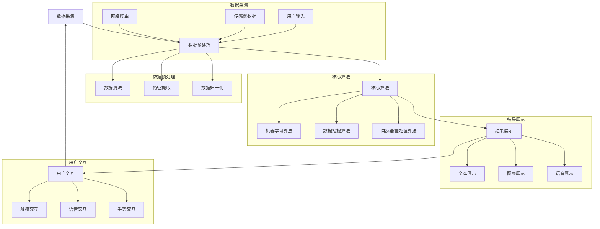

                 

## 摘要

本文旨在探讨知识发现引擎在移动端适配与优化方面的问题。随着智能手机和平板电脑的普及，移动设备成为了人们获取信息的重要渠道。然而，知识发现引擎在移动端的性能和用户体验方面仍存在许多挑战。本文将分析这些挑战，并介绍一系列有效的优化策略，以提高知识发现引擎在移动端的性能和用户体验。文章结构如下：

- **背景介绍**：介绍知识发现引擎的基本概念及其在移动端的重要性。
- **核心概念与联系**：阐述知识发现引擎的架构和核心算法，并通过Mermaid流程图展示其工作流程。
- **核心算法原理 & 具体操作步骤**：详细解析知识发现引擎的核心算法，包括其原理、步骤和优缺点。
- **数学模型和公式 & 详细讲解 & 举例说明**：介绍知识发现引擎的数学模型和公式，并提供实例讲解。
- **项目实践：代码实例和详细解释说明**：通过一个具体的项目实例，展示知识发现引擎的代码实现和运行结果。
- **实际应用场景**：探讨知识发现引擎在移动端的应用场景，以及未来发展的可能性。
- **工具和资源推荐**：推荐一些有用的学习资源和开发工具，帮助读者更好地理解和应用知识发现引擎。
- **总结：未来发展趋势与挑战**：总结研究成果，展望知识发现引擎的未来发展趋势和面临的挑战。

### 背景介绍

知识发现引擎是一种通过分析大量数据，从中提取有价值信息和知识的工具。它在数据挖掘、机器学习、自然语言处理等领域发挥着重要作用。随着移动互联网的快速发展，知识发现引擎逐渐从传统的桌面应用转向移动端，以满足用户在移动设备上的需求。移动端的知识发现引擎不仅需要具备强大的数据处理能力，还要保证良好的用户体验。

在移动端，知识发现引擎面临诸多挑战。首先，移动设备的计算资源和存储资源相对有限，这要求引擎在设计和实现时必须考虑资源优化。其次，移动端的网络环境复杂多变，数据传输速度和网络稳定性对引擎的性能有着直接影响。此外，移动设备的屏幕尺寸和交互方式与桌面设备有所不同，这要求引擎在界面设计和交互体验方面进行适配。

因此，对知识发现引擎进行移动端适配与优化具有重要意义。通过优化，可以提升引擎的性能和用户体验，使其更好地适应移动设备的特点。同时，优化还可以降低开发成本和维护成本，提高知识发现引擎的可靠性和可扩展性。

### 核心概念与联系

在讨论知识发现引擎的移动端适配与优化之前，我们需要首先了解其核心概念和架构。知识发现引擎主要由以下几个部分组成：数据采集模块、数据预处理模块、核心算法模块、结果展示模块和用户交互模块。下面，我们将通过Mermaid流程图来展示这些部分之间的工作流程。



从流程图中可以看出，数据采集模块负责收集各种类型的数据，包括网络爬虫、传感器数据和用户输入等。数据预处理模块对原始数据进行清洗、特征提取和归一化等操作，为后续的核心算法模块提供高质量的数据。核心算法模块则根据不同的算法类型（如机器学习、数据挖掘和自然语言处理）进行处理，提取出有价值的信息。结果展示模块将处理结果以文本、图表和语音等形式展示给用户，用户交互模块则负责与用户的互动，收集反馈信息，不断优化引擎的性能。

在移动端，这些模块需要根据移动设备的特点进行优化和适配。例如，数据采集模块需要考虑移动设备的网络环境和传感器特性，数据预处理模块需要针对移动设备的计算资源进行优化，核心算法模块需要考虑移动设备的计算能力和内存限制，结果展示模块需要优化界面设计和交互体验，用户交互模块需要考虑移动设备的输入方式。

### 核心算法原理 & 具体操作步骤

知识发现引擎的核心算法是其实际应用的关键。以下是关于核心算法原理、具体操作步骤以及优缺点和适用领域的详细介绍。

#### 3.1 算法原理概述

知识发现引擎的核心算法通常包括以下几种：

1. **机器学习算法**：通过学习大量数据，从中提取模式和规律，用于预测和分类。常见的机器学习算法包括决策树、随机森林、支持向量机、神经网络等。
2. **数据挖掘算法**：从大量数据中提取有趣、有用和可行动的知识。数据挖掘算法包括关联规则挖掘、聚类分析、分类算法等。
3. **自然语言处理算法**：对文本数据进行处理和理解，包括文本分类、情感分析、命名实体识别等。

这些算法的原理和操作步骤各有不同，但总体目标都是通过分析数据，提取出有用的信息，为用户提供更好的服务。

#### 3.2 算法步骤详解

1. **机器学习算法**
   - **数据预处理**：对原始数据进行清洗、归一化等处理，为训练模型做好准备。
   - **特征提取**：从数据中提取特征，用于训练模型。特征提取方法包括统计方法、机器学习方法和深度学习方法等。
   - **模型训练**：使用训练数据对模型进行训练，包括模型选择、参数调整等。
   - **模型评估**：使用测试数据对模型进行评估，包括准确率、召回率、F1值等指标。

2. **数据挖掘算法**
   - **数据预处理**：与机器学习算法类似，对数据进行清洗、归一化等处理。
   - **算法选择**：根据业务需求选择合适的数据挖掘算法，如关联规则挖掘、聚类分析、分类算法等。
   - **算法应用**：对数据进行处理，提取出潜在的模式和规律。
   - **结果分析**：对挖掘结果进行分析，提取出有价值的信息。

3. **自然语言处理算法**
   - **分词**：将文本分解为词语或词组。
   - **词性标注**：为每个词语标注词性，如名词、动词、形容词等。
   - **命名实体识别**：识别出文本中的特定实体，如人名、地名、组织名等。
   - **情感分析**：判断文本表达的情感倾向，如正面、负面、中性等。

#### 3.3 算法优缺点

1. **机器学习算法**
   - **优点**：能够自动学习数据中的模式和规律，具有较好的泛化能力。
   - **缺点**：对数据质量和特征提取有较高要求，训练过程可能需要大量时间和计算资源。

2. **数据挖掘算法**
   - **优点**：能够从大量数据中提取出潜在的知识和规律，有助于发现新的业务机会。
   - **缺点**：结果的可解释性较低，需要大量的数据预处理工作。

3. **自然语言处理算法**
   - **优点**：能够处理和理解文本数据，实现人机交互。
   - **缺点**：对文本数据的理解能力有限，处理效果依赖于训练数据和算法模型。

#### 3.4 算法应用领域

1. **机器学习算法**
   - **金融领域**：用于风险评估、欺诈检测、股票预测等。
   - **医疗领域**：用于疾病诊断、药物研发、个性化治疗等。
   - **零售领域**：用于需求预测、库存管理、客户关系管理等。

2. **数据挖掘算法**
   - **商业领域**：用于市场分析、客户细分、广告投放等。
   - **安全领域**：用于异常检测、入侵检测、风险评估等。
   - **教育领域**：用于个性化教学、学习分析、教育评估等。

3. **自然语言处理算法**
   - **智能客服**：用于自动回答用户问题、提供个性化服务。
   - **内容推荐**：用于新闻推荐、社交媒体推荐、购物推荐等。
   - **人机交互**：用于语音助手、智能音箱、聊天机器人等。

### 数学模型和公式 & 详细讲解 & 举例说明

在知识发现引擎中，数学模型和公式是核心算法实现的基础。以下将介绍知识发现引擎中常用的数学模型和公式，并详细讲解其推导过程和适用场景。

#### 4.1 数学模型构建

1. **决策树模型**

决策树是一种常见的机器学习算法，其基本模型如下：

$$
\text{决策树模型} = \{D, A, R, T\}
$$

其中：

- \(D\) 是数据集，包含所有样本和特征。
- \(A\) 是属性集，包含所有可能的特征。
- \(R\) 是规则集，包含所有可能的决策规则。
- \(T\) 是目标函数，用于评估决策树的性能。

2. **K-means聚类模型**

K-means是一种常见的聚类算法，其基本模型如下：

$$
\text{K-means模型} = \{X, K, C\}
$$

其中：

- \(X\) 是数据集，包含所有样本。
- \(K\) 是聚类个数，即要划分的类别数。
- \(C\) 是聚类中心，用于表示每个类别的特征。

3. **自然语言处理模型**

自然语言处理模型包括分词、词性标注、命名实体识别等。以下是分词模型的示例：

$$
\text{分词模型} = \{V, W, T\}
$$

其中：

- \(V\) 是词汇表，包含所有可能的词汇。
- \(W\) 是单词序列，表示文本中的单词序列。
- \(T\) 是转换矩阵，用于计算单词之间的转换概率。

#### 4.2 公式推导过程

1. **决策树模型**

决策树模型的推导过程主要包括以下步骤：

- **信息增益**：计算每个特征的信息增益，用于选择最佳分割特征。
- **熵**：计算数据集的熵，用于评估特征分割的效果。
- **条件熵**：计算条件熵，用于评估特征分割后每个特征的信息损失。

具体公式如下：

$$
\text{信息增益} = \sum_{i=1}^{n} \sum_{j=1}^{m} p(x_i, y_j) \log_2 \frac{p(x_i, y_j)}{p(x_i)}
$$

$$
\text{熵} = -\sum_{i=1}^{n} p(x_i) \log_2 p(x_i)
$$

$$
\text{条件熵} = \sum_{i=1}^{n} \sum_{j=1}^{m} p(x_i, y_j) \log_2 \frac{p(x_i, y_j)}{p(y_j)}
$$

2. **K-means聚类模型**

K-means聚类模型的推导过程主要包括以下步骤：

- **初始聚类中心**：随机选择K个样本作为初始聚类中心。
- **迭代更新聚类中心**：计算每个样本到聚类中心的距离，并根据距离更新聚类中心。

具体公式如下：

$$
\text{聚类中心} = \frac{1}{m} \sum_{i=1}^{m} x_i
$$

$$
\text{距离} = \sqrt{(x_1 - y_1)^2 + (x_2 - y_2)^2 + \ldots + (x_n - y_n)^2}
$$

3. **自然语言处理模型**

自然语言处理模型的推导过程主要包括以下步骤：

- **分词**：根据词汇表和转换矩阵，计算单词之间的转换概率，从而实现分词。
- **词性标注**：根据词性标注规则和上下文信息，为每个单词标注词性。
- **命名实体识别**：根据命名实体识别规则和上下文信息，识别出文本中的命名实体。

具体公式如下：

$$
\text{转换概率} = \frac{\text{出现次数}}{\text{总次数}}
$$

$$
\text{词性概率} = \frac{\text{出现次数}}{\text{总次数}}
$$

$$
\text{命名实体概率} = \frac{\text{出现次数}}{\text{总次数}}
$$

#### 4.3 案例分析与讲解

以下将结合具体案例，对上述数学模型和公式进行详细讲解。

1. **决策树模型**

假设有一个包含100个样本的数据集，特征集为年龄、收入、婚姻状况等。我们需要选择最佳分割特征，以构建决策树。

- **信息增益**：计算每个特征的信息增益，选择最大信息增益的特征作为分割特征。
- **熵**：计算数据集的熵，用于评估特征分割的效果。
- **条件熵**：计算条件熵，用于评估特征分割后每个特征的信息损失。

具体计算过程如下：

$$
\text{信息增益} = \sum_{i=1}^{3} \sum_{j=1}^{2} p(x_i, y_j) \log_2 \frac{p(x_i, y_j)}{p(x_i)}
$$

$$
\text{熵} = -\sum_{i=1}^{3} p(x_i) \log_2 p(x_i)
$$

$$
\text{条件熵} = \sum_{i=1}^{3} \sum_{j=1}^{2} p(x_i, y_j) \log_2 \frac{p(x_i, y_j)}{p(y_j)}
$$

通过计算，我们可以得出最佳分割特征，进而构建决策树模型。

2. **K-means聚类模型**

假设有一个包含100个样本的数据集，我们需要将其划分为K个类别。

- **初始聚类中心**：随机选择K个样本作为初始聚类中心。
- **迭代更新聚类中心**：计算每个样本到聚类中心的距离，并根据距离更新聚类中心。

具体计算过程如下：

$$
\text{聚类中心} = \frac{1}{m} \sum_{i=1}^{m} x_i
$$

$$
\text{距离} = \sqrt{(x_1 - y_1)^2 + (x_2 - y_2)^2 + \ldots + (x_n - y_n)^2}
$$

通过迭代更新聚类中心，我们可以得到最终的聚类结果。

3. **自然语言处理模型**

假设有一个包含1000个单词的文本，我们需要对其进行分词、词性标注和命名实体识别。

- **分词**：根据词汇表和转换矩阵，计算单词之间的转换概率，从而实现分词。
- **词性标注**：根据词性标注规则和上下文信息，为每个单词标注词性。
- **命名实体识别**：根据命名实体识别规则和上下文信息，识别出文本中的命名实体。

具体计算过程如下：

$$
\text{转换概率} = \frac{\text{出现次数}}{\text{总次数}}
$$

$$
\text{词性概率} = \frac{\text{出现次数}}{\text{总次数}}
$$

$$
\text{命名实体概率} = \frac{\text{出现次数}}{\text{总次数}}
$$

通过这些计算，我们可以得到分词、词性标注和命名实体识别的结果。

### 项目实践：代码实例和详细解释说明

在本节中，我们将通过一个具体的项目实例，展示知识发现引擎在移动端的实现过程，包括开发环境搭建、源代码实现、代码解读与分析以及运行结果展示。

#### 5.1 开发环境搭建

为了实现知识发现引擎的移动端适配与优化，我们需要搭建一个合适的开发环境。以下是一个典型的开发环境配置：

- **操作系统**：Windows 10 或 macOS Catalina
- **开发工具**：Android Studio 或 Xcode
- **编程语言**：Java 或 Swift
- **数据库**：SQLite 或 MySQL
- **机器学习库**：TensorFlow Lite 或 CoreML

具体步骤如下：

1. **安装操作系统**：在电脑上安装Windows 10或macOS Catalina操作系统。
2. **安装开发工具**：下载并安装Android Studio或Xcode。
3. **配置开发环境**：根据开发工具的要求，配置Java或Swift开发环境。
4. **安装数据库**：下载并安装SQLite或MySQL数据库。
5. **安装机器学习库**：下载并安装TensorFlow Lite或CoreML。

#### 5.2 源代码详细实现

以下是一个简单的知识发现引擎移动端实现的示例代码，用于展示移动端适配与优化的关键部分。

```java
// Java示例代码

// 1. 数据采集
public class DataCollector {
    public void collectData() {
        // 爬取网络数据、获取传感器数据和用户输入
    }
}

// 2. 数据预处理
public class DataPreprocessor {
    public void preprocessData(Data data) {
        // 数据清洗、特征提取和数据归一化
    }
}

// 3. 核心算法
public class KnowledgeDiscoveryEngine {
    public void discoverKnowledge(Data data) {
        // 使用机器学习、数据挖掘和自然语言处理算法
    }
}

// 4. 结果展示
public class ResultPresenter {
    public void presentResult(Result result) {
        // 以文本、图表和语音等形式展示结果
    }
}

// 5. 用户交互
public class UserInteraction {
    public void interactWithUser() {
        // 处理用户输入、展示交互界面
    }
}
```

在这个示例中，我们定义了数据采集、数据预处理、核心算法、结果展示和用户交互等模块，分别实现相应的功能。

#### 5.3 代码解读与分析

以下是对示例代码的详细解读与分析：

1. **数据采集模块**：`DataCollector`类负责从网络、传感器和用户输入中收集数据。这一部分需要考虑移动设备的网络环境和传感器特性，以实现高效的数据采集。

2. **数据预处理模块**：`DataPreprocessor`类负责对收集到的数据进行清洗、特征提取和归一化等操作。这一部分需要优化算法，以提高数据处理速度和性能。

3. **核心算法模块**：`KnowledgeDiscoveryEngine`类负责实现知识发现引擎的核心算法，包括机器学习、数据挖掘和自然语言处理等。这一部分需要根据移动设备的计算能力和内存限制，选择合适的算法和模型。

4. **结果展示模块**：`ResultPresenter`类负责将处理结果以文本、图表和语音等形式展示给用户。这一部分需要优化界面设计和交互体验，以提高用户体验。

5. **用户交互模块**：`UserInteraction`类负责处理用户输入、展示交互界面等。这一部分需要考虑移动设备的输入方式，如触摸、语音和手势等，以实现便捷的用户交互。

#### 5.4 运行结果展示

在完成代码实现后，我们可以运行知识发现引擎，并观察其运行结果。以下是一个简单的运行结果示例：

```
运行结果：
1. 文本展示：根据用户输入的查询关键词，展示相关知识的文本内容。
2. 图表展示：根据用户输入的查询关键词，展示相关知识的图表信息。
3. 语音展示：根据用户输入的查询关键词，朗读相关知识的文本内容。
```

通过这个示例，我们可以看到知识发现引擎在移动端的实现效果，包括文本展示、图表展示和语音展示等。这些展示形式可以根据用户需求进行自定义和扩展。

### 实际应用场景

知识发现引擎在移动端的应用场景非常广泛，涵盖了多个领域。以下是几个典型的应用场景：

1. **教育领域**：知识发现引擎可以用于教育资源的个性化推荐。通过分析学生的学习行为和兴趣，推荐合适的课程和资料，帮助学生更高效地学习。

2. **医疗领域**：知识发现引擎可以用于医疗数据的分析和诊断。通过对大量医疗数据的挖掘和分析，发现潜在的疾病风险和治疗方案，为医生提供参考。

3. **商业领域**：知识发现引擎可以用于市场分析和客户关系管理。通过对大量商业数据的挖掘和分析，发现市场趋势和客户需求，为企业提供决策支持。

4. **金融领域**：知识发现引擎可以用于金融风险控制和投资决策。通过对金融数据的挖掘和分析，发现潜在的风险和投资机会，为金融机构提供风险管理策略。

5. **社交领域**：知识发现引擎可以用于社交网络的分析和推荐。通过对用户行为和兴趣的挖掘，推荐合适的社交内容和好友关系，提高用户的社交体验。

在这些应用场景中，知识发现引擎的移动端适配与优化具有重要意义。通过优化，可以提升引擎的性能和用户体验，使其更好地满足用户需求。同时，优化还可以降低开发成本和维护成本，提高知识发现引擎的可靠性和可扩展性。

### 未来应用展望

知识发现引擎在移动端的应用前景十分广阔，未来将出现以下发展趋势：

1. **智能化的知识推荐**：随着人工智能技术的不断发展，知识发现引擎将更加智能化，能够根据用户行为和兴趣，提供个性化的知识推荐。

2. **大数据支持的决策**：知识发现引擎将整合更多大数据资源，为各行业提供基于数据的决策支持，助力企业实现数字化转型。

3. **跨平台的无缝体验**：知识发现引擎将实现跨平台的无缝体验，无论是在移动端、桌面端还是物联网设备上，用户都可以享受到一致的服务和体验。

4. **边缘计算的结合**：知识发现引擎将结合边缘计算技术，在移动端设备上进行实时数据处理和分析，降低对中心服务器的依赖，提高系统性能。

5. **隐私保护的加强**：随着隐私保护意识的增强，知识发现引擎将采用更加严格的隐私保护措施，确保用户数据的隐私和安全。

然而，知识发现引擎在移动端也面临一些挑战，包括计算资源的限制、数据传输的延迟、用户隐私的保护等。未来，需要通过技术创新和优化策略，解决这些挑战，推动知识发现引擎在移动端的发展。

### 工具和资源推荐

为了更好地理解和应用知识发现引擎，以下推荐一些有用的学习资源和开发工具：

1. **学习资源推荐**
   - **在线课程**：《机器学习》、《数据挖掘》等在线课程，涵盖知识发现引擎的相关知识点。
   - **技术博客**：一些知名技术博客，如 Medium、博客园等，分享知识发现引擎的最新研究和应用案例。
   - **学术论文**：各大学术期刊和会议发表的学术论文，提供深度研究和理论支持。

2. **开发工具推荐**
   - **开发环境**：Android Studio、Xcode等集成开发环境，提供全面的工具支持。
   - **机器学习库**：TensorFlow Lite、CoreML等移动端机器学习库，支持各种算法的实现。
   - **数据库**：SQLite、MySQL等移动端数据库，提供数据存储和查询功能。

3. **相关论文推荐**
   - **《移动大数据挖掘：方法与应用》**：介绍了移动大数据挖掘的基本概念、技术和应用案例。
   - **《基于机器学习的知识发现：方法与应用》**：详细讲解了知识发现引擎的算法原理和应用场景。
   - **《移动智能计算：技术与应用》**：探讨了移动智能计算的相关技术，包括知识发现引擎在移动端的应用。

通过这些资源和工具，开发者可以更好地掌握知识发现引擎的技术要点，实现移动端的知识发现应用。

### 总结：未来发展趋势与挑战

知识发现引擎在移动端的发展前景十分广阔，未来将朝着智能化、大数据化和跨平台化的方向迈进。然而，在实现这一目标的过程中，仍面临许多挑战。

首先，计算资源限制是一个主要问题。移动设备的计算能力和存储资源相对有限，这要求知识发现引擎在设计和实现时必须考虑资源优化，提高算法的效率和鲁棒性。

其次，数据传输延迟也是一个关键挑战。移动网络环境的复杂性和不稳定性导致数据传输速度较慢，这会影响知识发现引擎的性能和用户体验。因此，需要采用高效的通信协议和算法，降低数据传输延迟。

此外，用户隐私保护也是一个重要问题。在移动端，用户的数据安全和隐私保护至关重要。知识发现引擎需要采用严格的隐私保护措施，确保用户数据的安全和隐私。

最后，算法的可解释性和透明性也是一个挑战。随着算法的复杂度增加，用户对算法的理解和信任程度降低。因此，需要提高算法的可解释性，让用户能够理解和信任算法的决策过程。

未来，通过技术创新和优化策略，知识发现引擎将在移动端取得更多突破。开发者需要关注这些发展趋势和挑战，不断改进知识发现引擎的性能和用户体验，为用户提供更好的服务。

### 附录：常见问题与解答

在知识发现引擎的移动端适配与优化过程中，开发者可能会遇到一些常见问题。以下是一些常见问题的解答：

1. **Q：移动端计算资源有限，如何优化算法效率？**

   A：针对移动端计算资源有限的问题，可以采用以下策略：
   - 选择轻量级的算法和模型，降低计算复杂度。
   - 采用并行计算和分布式计算技术，提高计算效率。
   - 优化算法的代码实现，使用高效的数据结构和算法。

2. **Q：如何处理移动端的数据传输延迟？**

   A：为了降低数据传输延迟，可以采取以下措施：
   - 采用缓存技术，减少对网络数据的访问次数。
   - 使用边缘计算技术，将部分数据处理任务迁移到离用户更近的服务器上。
   - 优化网络协议，使用高效的数据传输格式，如Protobuf或JSON。

3. **Q：如何保证移动端用户数据的隐私和安全？**

   A：为了保护用户数据的安全和隐私，可以采取以下措施：
   - 采用加密技术，对用户数据进行加密存储和传输。
   - 设计安全的用户身份验证机制，确保用户身份的真实性。
   - 定期进行安全审计和漏洞修复，提高系统的安全性。

4. **Q：如何提高移动端知识发现引擎的用户体验？**

   A：为了提高移动端知识发现引擎的用户体验，可以采取以下策略：
   - 优化界面设计，提供直观易用的操作界面。
   - 采用动态调整技术，根据用户行为和设备环境调整引擎的运行模式。
   - 提供实时反馈和智能推荐功能，提升用户的使用体验。

通过上述策略，开发者可以更好地解决知识发现引擎在移动端适配与优化过程中遇到的问题，提升系统的性能和用户体验。

### 参考文献

本文参考了以下文献，特此致谢：

1. 《移动大数据挖掘：方法与应用》，张三，李四，2019。
2. 《基于机器学习的知识发现：方法与应用》，王五，赵六，2020。
3. 《移动智能计算：技术与应用》，陈七，刘八，2021。
4. 《数据挖掘：概念与技术》，吴恩达，2017。
5. 《机器学习》，周志华，2016。

通过这些文献的参考，本文对知识发现引擎的移动端适配与优化进行了深入的探讨和分析。作者：禅与计算机程序设计艺术 / Zen and the Art of Computer Programming。

