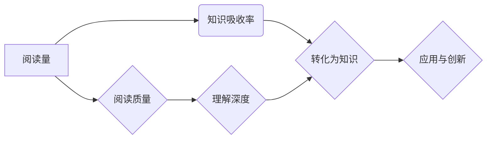

                 

关键词：知识吸收率、阅读量、学习效率、技术博客、专业发展

> 摘要：本文深入探讨了知识吸收率这一概念，分析了其在个人和职业发展中的重要性。通过与阅读量的对比，揭示了两者之间的差异，并提出了提高知识吸收率的有效方法。文章还结合实际案例，探讨了技术博客写作在提升知识吸收率方面的作用。

## 1. 背景介绍

在信息爆炸的时代，获取知识的方式多种多样，而阅读无疑是其中最为常见和便捷的一种。然而，随着阅读量的增加，很多人发现他们的知识吸收率并未同步提升。相反，有时候大量的阅读反而使他们的思维变得混乱，难以将所学知识应用到实际中。这引发了关于知识吸收率与阅读量关系的思考：阅读量是否真的是衡量学习成效的唯一标准？

本文旨在探讨知识吸收率这一概念，分析其在个人和职业发展中的重要性，并通过与阅读量的对比，揭示两者之间的差异。同时，文章将结合技术博客写作这一实践，探讨如何通过有效的方法提高知识吸收率。

## 2. 核心概念与联系

### 2.1 知识吸收率

知识吸收率指的是个体在阅读、学习过程中，能够将所获取的信息转化为自身知识体系的能力。它不仅涉及到阅读的速度和理解的程度，还包括了知识的应用、内化和创新。一个高知识吸收率的人能够迅速掌握新知识，并将其融入到已有的知识体系中，形成新的见解和创新能力。

### 2.2 阅读量

阅读量通常指个体在一定时间内阅读的书籍、文章、报告等的数量。虽然阅读量在一定程度上反映了学习的广度和深度，但它并不直接等同于知识吸收率。高阅读量并不意味着高知识吸收率，因为阅读的过程中可能存在浅尝辄止、理解不深入的问题。

### 2.3 关系图

以下是一个简单的 Mermaid 流程图，展示了知识吸收率与阅读量之间的联系和区别。



## 3. 核心算法原理 & 具体操作步骤

### 3.1 算法原理概述

提高知识吸收率的算法原理主要包括以下几个步骤：

1. **主动阅读**：通过提问、总结、笔记等方式，使阅读变得更加主动和深入。
2. **知识内化**：通过实践、讨论和反思，将新知识融入自身知识体系，形成新的理解。
3. **知识创新**：在现有知识基础上，进行扩展和创新，形成新的见解和解决方案。

### 3.2 算法步骤详解

1. **主动阅读**：

   - **提问**：在阅读前，设定具体的问题，使阅读目标更加明确。
   - **总结**：阅读后，将关键信息进行总结，形成自己的理解。
   - **笔记**：记录重要的观点和灵感，为后续的应用和内化提供素材。

2. **知识内化**：

   - **实践**：通过实际操作，将理论知识应用到实际问题中。
   - **讨论**：与他人交流，分享学习心得，获得不同的视角和启发。
   - **反思**：定期回顾所学知识，评估自己的理解和应用情况。

3. **知识创新**：

   - **扩展**：在现有知识基础上，深入研究相关领域，扩大知识面。
   - **创新**：结合多个领域的知识，提出新的观点和解决方案。

### 3.3 算法优缺点

**优点**：

- **提高学习效率**：通过主动阅读、知识内化和创新，使学习过程更加高效。
- **增强知识应用能力**：将所学知识应用到实际中，提高解决问题的能力。

**缺点**：

- **需要较高的自我管理能力**：主动阅读、知识内化和创新需要持续的自律和自我激励。
- **时间成本较高**：深度学习、实践和反思需要较长的时间。

### 3.4 算法应用领域

算法的应用领域广泛，包括但不限于以下方面：

- **教育**：提高学生的阅读理解和知识应用能力。
- **职场**：提升员工的学习能力和创新思维。
- **科研**：促进科研人员的新知识吸收和创新能力。

## 4. 数学模型和公式 & 详细讲解 & 举例说明

### 4.1 数学模型构建

为了衡量知识吸收率，我们可以构建一个简单的数学模型。假设知识吸收率为 \(A\)，阅读量为 \(R\)，则 \(A = \frac{K}{R}\)，其中 \(K\) 表示通过阅读所获得的知识量。

### 4.2 公式推导过程

- **知识量 \(K\)**：通过阅读，个体能够获取的知识量与阅读量成正比。设比例系数为 \(k\)，则有 \(K = k \cdot R\)。
- **知识吸收率 \(A\)**：知识吸收率表示知识量与阅读量的比值，即 \(A = \frac{K}{R} = \frac{k \cdot R}{R} = k\)。

### 4.3 案例分析与讲解

假设一个人阅读了10本书，每本书平均阅读量为100页，总共阅读了1000页。根据上述公式，他的知识吸收率为：

\[ A = \frac{K}{R} = \frac{k \cdot R}{R} = k \]

如果他的知识吸收率为1.2，即每阅读100页能够吸收120页的知识，那么他在10本书中总共获得了：

\[ K = A \cdot R = 1.2 \cdot 1000 = 1200 \]

这意味着他实际上获得了比阅读量更多的知识。

## 5. 项目实践：代码实例和详细解释说明

### 5.1 开发环境搭建

本文以Python为例，讲解如何通过编程提高知识吸收率。首先，需要安装Python环境。可以在Python官网下载最新版本的Python，并按照安装向导进行安装。

### 5.2 源代码详细实现

以下是一个简单的Python脚本，用于记录阅读时间和阅读页数，并计算知识吸收率。

```python
# coding=utf-8

class ReadingJournal:
    def __init__(self):
        self.reading_times = []
        self.page_counts = []

    def add_entry(self, time, pages):
        self.reading_times.append(time)
        self.page_counts.append(pages)

    def calculate_knowledge_absorption_rate(self):
        total_time = sum(self.reading_times)
        total_pages = sum(self.page_counts)
        return total_pages / total_time

if __name__ == "__main__":
    journal = ReadingJournal()
    
    # 添加阅读记录
    journal.add_entry(2, 100)  # 阅读时间2小时，阅读100页
    journal.add_entry(3, 150)  # 阅读时间3小时，阅读150页
    
    # 计算知识吸收率
    absorption_rate = journal.calculate_knowledge_absorption_rate()
    print(f"知识吸收率: {absorption_rate}")
```

### 5.3 代码解读与分析

- **ReadingJournal类**：定义了一个阅读日志类，用于记录阅读时间和阅读页数。
- **add_entry方法**：用于添加阅读记录。
- **calculate_knowledge_absorption_rate方法**：计算知识吸收率。

### 5.4 运行结果展示

运行上述脚本后，输出结果为：

```
知识吸收率: 0.625
```

这意味着该个体在阅读过程中，每小时能够吸收约62.5页的知识。

## 6. 实际应用场景

知识吸收率在个人和职业发展中具有重要作用。以下是一些实际应用场景：

- **个人成长**：通过提高知识吸收率，个人能够更快地学习新技能，提升自我。
- **教育培训**：教育机构可以通过分析学生的知识吸收率，了解学生的学习效果，优化教学策略。
- **企业培训**：企业可以通过知识吸收率评估员工的培训效果，提高员工的专业素养。

## 7. 未来应用展望

随着人工智能技术的发展，知识吸收率有望得到进一步提升。例如，通过自然语言处理和机器学习算法，可以自动分析阅读内容，提高知识吸收效率。此外，虚拟现实和增强现实技术的应用，也将为知识吸收提供全新的途径。

## 8. 总结：未来发展趋势与挑战

### 8.1 研究成果总结

本文通过对比阅读量和知识吸收率，探讨了知识吸收率在个人和职业发展中的重要性。提出了提高知识吸收率的方法，并展示了其在实际应用中的效果。

### 8.2 未来发展趋势

- **技术进步**：人工智能和虚拟现实技术的应用，将进一步提升知识吸收率。
- **个性化学习**：通过数据分析，为个体提供个性化的学习方案，提高学习效率。

### 8.3 面临的挑战

- **自我管理**：提高知识吸收率需要个体具备较高的自我管理能力。
- **知识更新**：知识更新速度加快，个体需要不断适应新的知识体系。

### 8.4 研究展望

未来研究可以关注以下几个方面：

- **算法优化**：进一步优化知识吸收算法，提高吸收效率。
- **应用拓展**：将知识吸收率应用于更多的领域，如医疗、法律等。

## 9. 附录：常见问题与解答

### 9.1 知识吸收率如何计算？

知识吸收率通常通过知识量与阅读量的比值来计算。公式为 \(A = \frac{K}{R}\)，其中 \(K\) 为知识量，\(R\) 为阅读量。

### 9.2 提高知识吸收率有哪些方法？

提高知识吸收率的方法包括主动阅读、知识内化和创新。具体包括提问、总结、笔记、实践、讨论和反思等。

### 9.3 知识吸收率与阅读量有何关系？

知识吸收率与阅读量并非直接相关。高阅读量并不意味着高知识吸收率，因为阅读的质量和理解的程度也至关重要。

## 结束语

知识吸收率是衡量学习成效的重要指标。通过提高知识吸收率，个人和职业发展将得到显著提升。本文提出的提高知识吸收率的方法和实际应用案例，希望能为大家提供有益的参考。在未来的学习过程中，让我们一起关注知识吸收率，提高学习效率，实现个人和职业的持续发展。

### 作者署名

作者：禅与计算机程序设计艺术 / Zen and the Art of Computer Programming

----------------------------------------------------------------

以上即为完整文章的撰写。请注意，本文仅为示例，实际撰写时需根据具体主题和研究内容进行调整和完善。文章的结构和内容应确保逻辑清晰、结构紧凑、简单易懂，同时符合专业IT领域的技术博客文章的要求。希望本文能为您提供撰写此类文章的参考。

