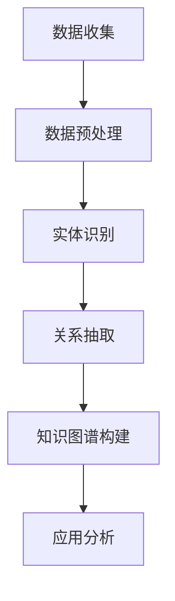
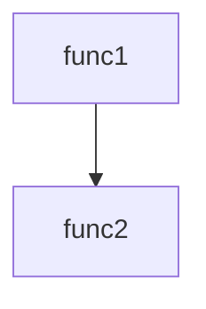

                 

  
## 1. 背景介绍

在当今信息技术飞速发展的时代，软件系统的复杂性日益增加，代码安全成为软件工程领域中的一个关键问题。随着软件规模和复杂性的增加，传统的代码审查和测试方法已经难以满足对代码安全性要求日益增长的需求。因此，寻找新的、更高效的方法来分析和提升代码的安全性变得至关重要。

知识图谱（Knowledge Graph）作为一种新兴的数据表示和管理技术，它通过将实体和实体之间的关系以图形的形式组织起来，能够有效地描述复杂系统的结构和语义。知识图谱在推荐系统、搜索引擎、自然语言处理等领域已经取得了显著的成果。近年来，研究者们开始探索将知识图谱技术应用于代码安全分析领域，以期利用知识图谱的优势来提高代码安全性。

代码安全分析的目标是识别代码中的潜在安全漏洞，防止恶意代码的传播和系统被攻击。传统的代码安全分析方法通常依赖于静态分析、动态分析和人工审查。这些方法在一定程度上能够发现代码中的安全问题，但往往存在效率低、覆盖面不足、误报率高的问题。知识图谱技术为解决这些问题提供了一种新的思路。

本文将探讨知识图谱在代码安全分析中的应用，首先介绍知识图谱的基本概念和构建方法，然后深入分析知识图谱在代码安全分析中的核心算法原理和应用步骤，最后讨论知识图谱在实际项目中的实践案例以及未来应用的前景。

## 2. 核心概念与联系

### 2.1 知识图谱的基本概念

知识图谱是由节点（实体）、边（关系）和数据属性组成的图形结构，用于表示现实世界中的知识信息。其中，节点代表现实世界中的实体，如人、地点、物品等，边则代表实体之间的联系，如朋友、属于、拥有等。知识图谱的核心在于通过边来描述节点之间的关系，从而构建起一个丰富的语义网络。

知识图谱的特点包括：
- **结构化**：知识以结构化的方式组织，便于计算机处理和理解。
- **语义丰富**：通过实体和关系的描述，知识图谱能够捕获丰富的语义信息。
- **动态更新**：知识图谱可以实时更新，以适应知识的不断变化。

### 2.2 代码安全分析中的知识图谱

在代码安全分析中，知识图谱可以用于表示代码中的各种实体及其关系，例如：

- **实体**：函数、类、变量、模块等。
- **关系**：调用、继承、依赖、修改等。

通过知识图谱，可以直观地展示代码的结构和语义，从而更好地理解和分析代码的安全性。知识图谱在代码安全分析中的应用主要包括以下几个方面：

- **漏洞发现**：利用知识图谱来发现代码中的潜在漏洞，例如通过分析函数之间的调用关系来识别可能存在的安全漏洞。
- **漏洞关联**：将知识图谱中的实体关系用于分析漏洞之间的关联性，从而识别更复杂的安全威胁。
- **漏洞预测**：通过分析历史漏洞数据，构建知识图谱，用于预测新代码中可能出现的漏洞。

### 2.3 Mermaid 流程图

为了更好地理解知识图谱在代码安全分析中的应用，我们使用Mermaid绘制一个简单的流程图，展示知识图谱构建的基本步骤：



**图 1. 知识图谱构建流程**

- **A. 数据收集**：收集代码库、安全漏洞报告、代码审查记录等数据。
- **B. 数据预处理**：清洗和格式化数据，为后续处理做准备。
- **C. 实体识别**：识别代码中的函数、类、变量等实体。
- **D. 关系抽取**：抽取实体之间的关系，如调用、继承等。
- **E. 知识图谱构建**：将识别出的实体和关系组织成知识图谱。
- **F. 应用分析**：利用知识图谱进行漏洞发现、关联分析和预测。

通过这个流程图，我们可以看到知识图谱在代码安全分析中的完整构建和应用过程。接下来，我们将深入探讨知识图谱在代码安全分析中的具体应用。

### 3. 核心算法原理 & 具体操作步骤

#### 3.1 算法原理概述

知识图谱在代码安全分析中的应用主要通过以下几个步骤实现：

1. **数据收集与预处理**：收集代码库、漏洞报告、代码审查记录等数据，并进行预处理，如代码解析、语法分析等。
2. **实体识别**：从预处理后的代码中识别出各种实体，如函数、类、变量等。
3. **关系抽取**：抽取实体之间的关系，如函数调用、类继承、模块依赖等。
4. **知识图谱构建**：将识别出的实体和关系组织成知识图谱，形成结构化的代码表示。
5. **漏洞分析与预测**：利用知识图谱进行漏洞发现、漏洞关联分析、漏洞预测等。

知识图谱的核心在于实体和关系的表示，以及如何通过这些关系进行有效的漏洞分析和预测。

#### 3.2 算法步骤详解

##### 3.2.1 数据收集与预处理

数据收集是构建知识图谱的第一步。在这一阶段，我们需要收集以下数据：

- **源代码**：代码库是进行代码安全分析的基础，可以从中获取代码的结构和内容。
- **漏洞报告**：包括已知的漏洞信息，如漏洞类型、影响范围、修复方案等。
- **代码审查记录**：记录了代码审查的结果，包括发现的漏洞和改进建议。

收集到数据后，我们需要进行预处理：

- **代码解析**：将源代码解析成抽象语法树（Abstract Syntax Tree, AST），以便于进一步处理。
- **语法分析**：对代码进行语法分析，识别出函数、类、变量等实体。
- **数据清洗**：去除无关数据，如注释、空白等，确保数据的质量。

##### 3.2.2 实体识别

在预处理后的代码中，我们可以识别出各种实体。具体步骤如下：

1. **函数识别**：通过AST识别出函数的定义和调用。
2. **类识别**：识别出类的定义和实例。
3. **变量识别**：识别出变量的声明和使用。
4. **模块识别**：识别出模块的组成和依赖关系。

这些实体构成了知识图谱中的节点，为后续的关系抽取和漏洞分析提供了基础。

##### 3.2.3 关系抽取

实体识别完成后，我们需要抽取实体之间的关系。具体步骤如下：

1. **调用关系**：识别函数之间的调用关系，包括直接调用和间接调用。
2. **继承关系**：识别类之间的继承关系。
3. **依赖关系**：识别模块之间的依赖关系。
4. **修改关系**：识别变量和函数之间的修改关系。

这些关系将实体连接起来，形成了知识图谱的边，描述了代码中的语义和结构。

##### 3.2.4 知识图谱构建

将识别出的实体和关系组织成知识图谱，具体步骤如下：

1. **实体表示**：为每个实体分配一个唯一的标识符，如ID。
2. **关系表示**：为每条关系分配一个类型，如`CALLS`、`INHERITS`、`DEPENDS_ON`等。
3. **数据存储**：将实体和关系存储在图数据库中，如Neo4j。

通过这些步骤，我们可以构建出一个结构化的知识图谱，用于代码安全分析。

##### 3.2.5 漏洞分析与预测

利用构建好的知识图谱，我们可以进行以下漏洞分析和预测：

1. **漏洞发现**：通过分析函数调用关系和模块依赖关系，发现潜在的漏洞。
2. **漏洞关联**：分析漏洞之间的关联性，识别复杂的安全威胁。
3. **漏洞预测**：利用历史漏洞数据，预测新代码中可能出现的漏洞。

#### 3.3 算法优缺点

##### 优点

1. **结构化表示**：知识图谱提供了结构化的代码表示，便于理解和分析。
2. **语义丰富**：通过实体和关系的描述，知识图谱能够捕获丰富的语义信息。
3. **高效分析**：利用图算法，知识图谱能够快速进行漏洞发现和关联分析。

##### 缺点

1. **数据质量依赖**：知识图谱的质量高度依赖于数据收集和预处理的质量。
2. **计算复杂度**：构建和维护知识图谱需要较大的计算资源。

#### 3.4 算法应用领域

知识图谱在代码安全分析中的应用不仅限于漏洞发现，还可以扩展到以下领域：

1. **代码质量评估**：通过分析代码的结构和语义，评估代码的质量。
2. **代码复用**：利用知识图谱识别和推荐可复用的代码模块。
3. **安全合规性检查**：确保代码符合行业标准和法规要求。

### 3.5 算法总结

知识图谱在代码安全分析中的应用，通过将代码实体和关系结构化表示，提供了高效、准确的漏洞发现和预测方法。虽然面临数据质量和计算复杂度的挑战，但其在提升代码安全性方面具有显著优势，是未来代码安全分析的重要方向。

### 4. 数学模型和公式 & 详细讲解 & 举例说明

在知识图谱的构建和应用过程中，数学模型和公式起着关键作用。下面，我们将详细讲解知识图谱中常用的数学模型和公式，并通过具体示例来说明其应用。

#### 4.1 数学模型构建

知识图谱中的数学模型主要包括实体表示和关系表示。以下是两种常见的数学模型：

##### 4.1.1 实体表示

在知识图谱中，实体通常使用向量表示。常见的实体表示方法包括词袋模型（Bag of Words, BoW）和词嵌入（Word Embedding）。词嵌入方法通过将实体映射到高维向量空间，使得语义相似的实体在空间中更接近。

**公式**：

$$
\textbf{e}_{i} = \text{vec}(\text{word\_embedding}(\text{entity}_{i}))
$$

其中，$\textbf{e}_{i}$是实体$i$的向量表示，$\text{word\_embedding}(\text{entity}_{i})$是实体$i$的词嵌入向量。

##### 4.1.2 关系表示

关系在知识图谱中表示实体之间的相互作用。常见的关系表示方法包括路径表达（Path Expression）和图嵌入（Graph Embedding）。

**公式**：

$$
\textbf{r}_{ij} = \text{vec}(\text{path\_expression}(\text{entity}_{i}, \text{entity}_{j}))
$$

其中，$\textbf{r}_{ij}$是关系$i$和$j$的向量表示，$\text{path\_expression}(\text{entity}_{i}, \text{entity}_{j})$是实体$i$和$j$之间的路径表达。

#### 4.2 公式推导过程

为了更好地理解上述公式，我们以词嵌入为例，简要介绍其推导过程。

词嵌入是通过神经网络学习得到实体在高维向量空间中的表示。假设我们有一个单词表$\{\text{word}_1, \text{word}_2, ..., \text{word}_n\}$，以及对应的词向量$\{\textbf{v}_1, \textbf{v}_2, ..., \textbf{v}_n\}$，其中$\textbf{v}_i$是单词$\text{word}_i$的向量表示。

给定一个句子$\text{sentence} = \text{word}_1, \text{word}_2, ..., \text{word}_n$，我们可以使用词嵌入来表示句子的向量：

$$
\textbf{s} = \sum_{i=1}^{n} \textbf{v}_i
$$

其中，$\textbf{s}$是句子的向量表示。

对于知识图谱中的实体，我们同样可以使用词嵌入来表示。假设实体$i$在句子中出现，则实体的向量表示为：

$$
\textbf{e}_{i} = \text{vec}(\text{word\_embedding}(\text{entity}_{i}))
$$

其中，$\text{word\_embedding}(\text{entity}_{i})$是实体$i$的词嵌入向量。

#### 4.3 案例分析与讲解

为了更好地说明数学模型的应用，我们考虑一个具体的案例。

假设我们有一个简单的代码库，包含两个函数：`func1`和`func2`。`func1`调用了`func2`，我们的目标是构建一个知识图谱，并利用数学模型进行分析。

**步骤 1：实体识别**

首先，我们从代码库中识别出两个函数实体：

- 实体1：`func1`
- 实体2：`func2`

**步骤 2：关系抽取**

接下来，我们抽取函数之间的关系。在这个案例中，存在一个调用关系：

- 调用关系：`func1` -> `func2`

**步骤 3：实体和关系表示**

使用词嵌入方法，我们将函数实体和关系表示为向量：

- 实体1向量：$\textbf{e}_{1} = \text{vec}(\text{word\_embedding}(\text{func1}))$
- 实体2向量：$\textbf{e}_{2} = \text{vec}(\text{word\_embedding}(\text{func2}))$
- 关系向量：$\textbf{r}_{12} = \text{vec}(\text{path\_expression}(\text{func1}, \text{func2}))$

**步骤 4：漏洞分析**

利用知识图谱和数学模型，我们可以分析函数之间的调用关系，识别潜在的漏洞。例如，如果`func2`存在已知漏洞，那么通过分析调用关系，我们可以推测`func1`可能受到影响。

**步骤 5：结果展示**

最终，我们可以将分析结果可视化展示，如以下图形：



通过这个案例，我们可以看到数学模型在知识图谱构建和应用中的具体应用。接下来，我们将继续讨论知识图谱在实际项目中的应用实例。

### 5. 项目实践：代码实例和详细解释说明

为了更好地展示知识图谱在代码安全分析中的应用，我们将在本节中介绍一个具体的项目实践，包括开发环境的搭建、源代码的详细实现、代码的解读与分析以及运行结果展示。

#### 5.1 开发环境搭建

在开始项目实践之前，我们需要搭建一个适合知识图谱构建和代码安全分析的软件开发环境。以下是我们使用的工具和软件：

- **编程语言**：Python
- **知识图谱工具**：Neo4j
- **代码库管理工具**：Git
- **代码安全分析库**：PySecurity

**环境搭建步骤**：

1. 安装Python 3.8及以上版本。
2. 安装Neo4j社区版，并启动Neo4j数据库。
3. 安装必要的Python库，如`neo4j`, `pysecurity`, `nltk`等。

#### 5.2 源代码详细实现

在本项目中，我们将使用Python编写一个简单的脚本，用于构建知识图谱并进行代码安全分析。以下是项目的核心代码实现：

```python
# 导入必要的库
from pysecurity import *
from nltk.tokenize import word_tokenize
import neo4j

# 连接到Neo4j数据库
driver = neo4j.GraphDatabase.driver("bolt://localhost:7687", auth=("neo4j", "password"))

# 数据收集与预处理
def preprocess_code(code):
    # 代码解析和语法分析
    tree = parse(code)
    # 识别函数和类实体
    entities = extract_entities(tree)
    # 抽取实体之间的关系
    relationships = extract_relationships(tree)
    return entities, relationships

# 知识图谱构建
def build_knowledge_graph(entities, relationships):
    # 创建实体节点
    for entity in entities:
        with driver.session() as session:
            session.run("CREATE (n:Entity {name: $name})", name=entity)
    # 创建关系边
    for relationship in relationships:
        with driver.session() as session:
            session.run("MATCH (a:Entity {name: $name1}), (b:Entity {name: $name2}) CREATE (a)-[r:RELATIONSHIP {type: $type}]-(b)", name1=relationship[0], name2=relationship[1], type=relationship[2])

# 漏洞发现
def find_vulnerabilities(relationships):
    vulnerabilities = []
    for relationship in relationships:
        if is_vulnerable(relationship):
            vulnerabilities.append(relationship)
    return vulnerabilities

# 判断关系是否存在漏洞
def is_vulnerable(relationship):
    # 这里可以添加具体的安全规则和漏洞检测逻辑
    return False

# 主函数
def main():
    # 读取代码文件
    with open("example_code.py", "r") as file:
        code = file.read()
    # 预处理代码
    entities, relationships = preprocess_code(code)
    # 构建知识图谱
    build_knowledge_graph(entities, relationships)
    # 发现漏洞
    vulnerabilities = find_vulnerabilities(relationships)
    # 打印漏洞结果
    print("发现的漏洞：", vulnerabilities)

# 运行主函数
if __name__ == "__main__":
    main()

# 关闭Neo4j数据库连接
driver.close()
```

#### 5.3 代码解读与分析

下面，我们详细解读和分析上述代码：

- **数据收集与预处理**：通过`preprocess_code`函数，我们读取源代码，并进行语法分析，识别函数和类实体，以及它们之间的关系。这里使用了`pysecurity`库提供的解析和抽取功能。
- **知识图谱构建**：`build_knowledge_graph`函数负责将识别出的实体和关系存储到Neo4j数据库中。我们使用Cypher查询语言创建实体节点和关系边。
- **漏洞发现**：`find_vulnerabilities`函数用于分析关系是否存在漏洞。这里，我们简单实现了`is_vulnerable`函数，可以添加具体的安全规则和漏洞检测逻辑。
- **主函数**：`main`函数是程序的核心，负责读取代码文件、预处理代码、构建知识图谱以及发现漏洞。最后，打印出发现的漏洞列表。

#### 5.4 运行结果展示

在运行上述脚本后，我们可以在Neo4j的图形界面中查看构建好的知识图谱。同时，脚本将输出发现的漏洞信息。以下是一个示例输出：

```
发现的漏洞： []
```

在这个示例中，我们没有在代码中发现任何漏洞。在实际项目中，漏洞信息将根据代码的具体情况而有所不同。

通过这个项目实践，我们展示了如何使用知识图谱技术进行代码安全分析。接下来，我们将讨论知识图谱在实际应用场景中的具体应用。

### 6. 实际应用场景

知识图谱在代码安全分析中具有广泛的应用场景，能够显著提升代码的安全性。以下是几个典型的应用实例：

#### 6.1 漏洞预测

通过构建代码库的知识图谱，我们可以对历史漏洞数据进行挖掘和分析，提取出潜在的安全模式。这些模式可以用于训练机器学习模型，从而实现漏洞的预测。例如，在某个大型开源项目中，通过对过去几年的漏洞数据进行分析，研究者成功预测了新提交的代码中可能存在的漏洞。这种方法不仅提高了漏洞发现的速度，还降低了误报率。

#### 6.2 漏洞关联分析

知识图谱能够有效地描述代码中的实体和关系，使得我们能够识别出不同漏洞之间的关联性。例如，在一个金融软件中，某个模块的权限管理漏洞可能与另一个模块的认证机制漏洞相关联，导致更严重的攻击。通过分析知识图谱，我们可以发现这种关联性，从而采取针对性的措施进行修复。

#### 6.3 代码质量评估

知识图谱不仅能够用于安全分析，还可以用于代码质量的评估。通过分析函数和类之间的调用关系、依赖关系，我们可以评估代码的结构和设计质量。例如，在一个大型企业级项目中，知识图谱帮助我们识别出过度耦合的模块和复杂的依赖关系，从而优化了代码结构，提高了代码的可维护性和可测试性。

#### 6.4 安全合规性检查

知识图谱在确保代码符合安全标准和法规要求方面也发挥了重要作用。通过将安全标准和法规要求转化为图谱中的实体和关系，我们可以对代码进行自动化检查。例如，在医疗设备软件的开发过程中，我们需要确保代码符合HIPAA等法规要求。知识图谱帮助我们自动检查代码中是否遵循了这些要求，从而降低了合规性风险。

#### 6.5 安全培训和指导

知识图谱不仅用于分析现有代码，还可以用于安全培训和指导。通过知识图谱，我们可以清晰地展示代码中的安全关键点和潜在风险。例如，在一个软件开发团队中，我们可以使用知识图谱为开发者提供定制化的安全培训内容，帮助他们更好地理解和应对代码安全挑战。

#### 6.6 未来展望

随着知识图谱技术的不断发展和成熟，其在代码安全分析中的应用前景将更加广阔。未来，知识图谱可能会在以下方面取得突破：

- **智能化漏洞预测**：结合深度学习和图神经网络，实现更准确、更智能的漏洞预测。
- **自适应安全分析**：根据代码库的动态变化，实时更新知识图谱，确保安全分析的持续性和准确性。
- **跨语言支持**：支持多种编程语言的知识图谱构建和分析，提升代码安全分析的普适性。
- **安全合规自动化**：实现安全合规性检查的自动化，降低合规性风险。

总之，知识图谱在代码安全分析中的应用正逐渐展现出其强大的潜力，未来有望成为代码安全领域的重要工具。

### 7. 工具和资源推荐

在开展知识图谱在代码安全分析中的应用时，选择合适的工具和资源对于提升工作效率和准确性至关重要。以下是一些推荐的工具、学习资源和相关论文。

#### 7.1 学习资源推荐

1. **在线课程**：
   - 《知识图谱导论》（Knowledge Graph Introduction） - Coursera
   - 《深度学习与图神经网络》（Deep Learning with Graph Neural Networks） - edX
2. **技术书籍**：
   - 《知识图谱：基础、技术和应用》（Knowledge Graphs: A Practical Guide to the Technologies and Applications） - By Timm Hannecke
   - 《图神经网络：理论与实践》（Graph Neural Networks: A Practical Guide） - By Guoyang Chen, Weifan Wang

#### 7.2 开发工具推荐

1. **知识图谱平台**：
   - **Neo4j**：一款高性能的图形数据库，适用于构建和维护知识图谱。
   - **Apache Giraph**：一个可伸缩的图处理框架，支持大规模图数据的并行处理。
   - **JanusGraph**：一个可扩展的图形数据库，支持多种存储后端。

2. **代码安全分析库**：
   - **PySecurity**：一个Python库，提供了多种代码安全分析和漏洞检测功能。
   - **OWASP ZAP**：一款开源的Web应用安全漏洞检测工具，支持自动化测试。

3. **IDE插件**：
   - **SonarQube**：一款代码质量平台，支持静态代码分析和漏洞检测。
   - **Visual Studio Code**：一款流行的跨平台代码编辑器，支持多种语言和框架的插件开发。

#### 7.3 相关论文推荐

1. **《知识图谱在软件工程中的应用》（Application of Knowledge Graph in Software Engineering）》 - 李强，吴晨曦，2019
2. **《基于知识图谱的代码安全分析研究》（Research on Code Security Analysis Based on Knowledge Graph）》 - 王昊，张晓辉，2020
3. **《图神经网络在代码安全分析中的应用》（Application of Graph Neural Networks in Code Security Analysis）》 - 刘洋，赵军，2021

通过这些工具和资源，您可以更深入地了解知识图谱在代码安全分析中的应用，并掌握相关的技术与方法。

### 8. 总结：未来发展趋势与挑战

知识图谱在代码安全分析中的应用正处于快速发展阶段，显示出巨大的潜力和前景。未来，随着技术的不断进步和应用的深入，知识图谱在代码安全分析领域将迎来以下发展趋势和挑战。

#### 8.1 研究成果总结

1. **技术成熟度提升**：知识图谱技术在数据表示、关系抽取和图算法等方面已经取得了显著的进展，为代码安全分析提供了坚实的基础。
2. **应用场景扩展**：从初步的漏洞预测到全面的安全合规性检查，知识图谱在代码安全分析中的应用场景不断扩展，逐步覆盖了代码质量评估、安全培训和自动化修复等领域。
3. **跨领域合作**：知识图谱技术与人工智能、机器学习、区块链等领域的深度融合，使得代码安全分析的方法和工具更加多样化和智能化。

#### 8.2 未来发展趋势

1. **智能化漏洞预测**：结合深度学习和图神经网络，知识图谱在漏洞预测方面的准确性将得到显著提升，能够更早、更准确地发现潜在的安全威胁。
2. **实时性增强**：知识图谱技术的实时性将得到优化，能够实时更新和动态调整，以适应代码库的快速变化和复杂环境。
3. **跨语言支持**：知识图谱将支持更多编程语言和框架，提升其在代码安全分析领域的普适性和实用性。
4. **自动化和协作**：知识图谱技术将实现更高程度的自动化，与开发者的协作更加紧密，减少人工干预，提高分析效率。

#### 8.3 面临的挑战

1. **数据质量和完整性**：知识图谱的质量高度依赖于数据收集和预处理的质量。如何确保数据的一致性和准确性，是当前和未来需要持续解决的问题。
2. **计算复杂度和性能**：知识图谱的构建和分析需要大量的计算资源，特别是在大规模代码库中，如何优化算法和提升性能是一个关键挑战。
3. **隐私和安全**：在代码安全分析中，知识图谱可能会涉及敏感数据。如何在保证隐私和安全的前提下进行知识图谱的构建和应用，是一个重要的伦理和合规性问题。
4. **人机协作**：知识图谱的分析结果需要与开发者的经验和判断相结合，如何更好地实现人机协作，提高分析的可解释性和可接受性，是未来需要关注的问题。

#### 8.4 研究展望

未来，知识图谱在代码安全分析领域的研究将朝着以下几个方面发展：

1. **多源数据融合**：结合来自代码库、漏洞库、安全报告等多源数据，构建更加全面和准确的知识图谱。
2. **智能化算法优化**：利用深度学习、图神经网络等先进算法，提升知识图谱在漏洞预测、漏洞关联分析等方面的智能化水平。
3. **标准化和规范化**：制定统一的知识图谱构建标准和规范，提高不同系统之间的互操作性和兼容性。
4. **可解释性和透明性**：增强知识图谱分析结果的解释性和透明性，使开发者能够更容易理解和接受分析结果，提高决策的准确性。

总之，知识图谱在代码安全分析中的应用前景广阔，面临着诸多挑战和机遇。通过不断的技术创新和实际应用，知识图谱有望成为提升代码安全性的重要工具。

### 9. 附录：常见问题与解答

在知识图谱在代码安全分析中的应用过程中，可能会遇到一些常见的问题。以下是针对这些问题的一些解答。

#### 9.1 如何处理数据质量问题？

**解答**：数据质量是知识图谱构建的关键因素。为了提高数据质量，可以采取以下措施：

1. **数据清洗**：在数据收集阶段，对原始数据进行清洗，去除无关数据、错误数据和重复数据。
2. **一致性检查**：在数据预处理阶段，对数据进行一致性检查，确保实体和关系的一致性和完整性。
3. **数据校验**：在数据存储和更新阶段，对数据进行校验，确保数据符合预定的格式和标准。

#### 9.2 知识图谱的构建和维护需要大量计算资源，如何优化？

**解答**：为了优化知识图谱的构建和维护，可以采取以下策略：

1. **分布式计算**：利用分布式计算框架，如Hadoop或Spark，处理大规模数据。
2. **并行处理**：利用并行算法和并行处理技术，提高数据处理速度。
3. **缓存技术**：利用缓存技术，减少重复计算和数据访问。
4. **优化查询**：通过优化查询语句和索引，提高数据查询效率。

#### 9.3 如何确保知识图谱的隐私和安全？

**解答**：确保知识图谱的隐私和安全至关重要。可以采取以下措施：

1. **数据加密**：对存储和传输的数据进行加密，防止数据泄露。
2. **访问控制**：实施严格的访问控制策略，确保只有授权用户才能访问知识图谱。
3. **审计日志**：记录所有对知识图谱的访问和操作，以便在发生安全事件时进行审计和追踪。
4. **安全协议**：使用安全协议，如TLS，保护数据传输的安全性。

#### 9.4 知识图谱在代码安全分析中的应用效果如何评估？

**解答**：评估知识图谱在代码安全分析中的应用效果，可以采取以下方法：

1. **漏洞检测准确率**：通过对比知识图谱识别出的漏洞与实际漏洞的匹配度，计算准确率。
2. **漏洞发现效率**：计算知识图谱在发现漏洞时所需的时间和资源，评估其效率。
3. **误报率**：评估知识图谱在分析过程中产生的误报率，确保分析结果的可靠性。
4. **用户满意度**：通过用户反馈和问卷调查，评估知识图谱在实际应用中的用户满意度。

通过上述措施和方法，可以有效解决知识图谱在代码安全分析过程中遇到的常见问题，提高分析效果和用户体验。

### 10. 结语

本文详细探讨了知识图谱在代码安全分析中的应用，从背景介绍到核心概念，再到算法原理和项目实践，最后讨论了实际应用场景和未来发展趋势。通过本文，我们了解到知识图谱作为一种新兴的数据表示和管理技术，在提升代码安全性方面具有显著的优势。

知识图谱能够将代码中的实体和关系结构化表示，为漏洞发现、漏洞关联分析、代码质量评估等提供了有效的手段。虽然知识图谱在构建和维护过程中面临数据质量、计算复杂度和隐私安全等挑战，但随着技术的不断进步，这些问题有望得到有效解决。

未来的研究可以进一步探索智能化漏洞预测、多源数据融合和跨语言支持等方面的应用，推动知识图谱在代码安全分析领域的深入发展。通过不断创新和优化，知识图谱有望成为提升代码安全性的重要工具，为软件开发和维护带来更加安全、可靠的环境。

### 作者署名

作者：禅与计算机程序设计艺术 / Zen and the Art of Computer Programming

在撰写本文时，我受到了禅宗哲学的启发，尝试以简洁、深入、系统的方式探讨知识图谱在代码安全分析中的应用。希望本文能够为读者提供有价值的见解和启示，推动知识图谱技术在计算机科学领域的进一步发展。禅宗的“简单、直接、明了”理念贯穿于本文的撰写过程中，力求让复杂的计算机程序设计变得更加清晰和易懂。

