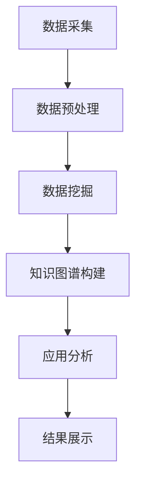

                 

关键词：知识图谱，智能营销，数据挖掘，人工智能，算法优化，用户行为分析

>摘要：随着大数据和人工智能技术的不断发展，知识图谱作为大数据处理和知识表示的重要工具，正在逐渐成为智能营销领域的重要组成部分。本文将深入探讨知识图谱在智能营销中的应用，包括核心概念、算法原理、实际案例和未来展望，旨在为读者提供全面的技术分析和实战指导。

## 1. 背景介绍

### 智能营销的兴起

在数字营销迅速发展的背景下，传统的营销手段已经难以满足企业和消费者的需求。随着互联网和移动设备的普及，用户数据变得越来越丰富，如何有效地利用这些数据来提高营销效果，成为了市场营销领域亟待解决的问题。智能营销正是在这样的背景下兴起的，它利用大数据和人工智能技术，通过分析用户行为、兴趣和需求，实现个性化推荐、精准广告投放和智能互动等营销策略。

### 知识图谱的概念

知识图谱（Knowledge Graph）是一种用于表示实体和实体之间关系的图形结构，它将现实世界中的信息抽象为具有属性和关系的节点和边。知识图谱的出现解决了数据孤岛和信息不对称的问题，使得数据之间的关联更加清晰，有助于实现更高效的决策和分析。

### 知识图谱在智能营销中的重要性

知识图谱在智能营销中的应用主要体现在以下几个方面：

1. **用户画像构建**：通过知识图谱，可以构建详细的用户画像，包括用户的兴趣、行为、偏好等，从而实现更精准的用户定位和个性化推荐。
2. **内容推荐**：基于知识图谱的关系网络，可以挖掘用户和内容之间的潜在关联，为用户提供更相关、更有价值的信息。
3. **广告投放优化**：知识图谱可以帮助广告主更准确地定位目标受众，提高广告投放的精准度和效果。
4. **智能客服**：知识图谱可以为智能客服系统提供丰富的知识库，实现更智能、更高效的客户服务。

## 2. 核心概念与联系

### 知识图谱的基本概念

知识图谱由节点（Node）、边（Edge）和属性（Attribute）组成。节点代表实体，如人、地点、物品等；边表示实体之间的关系，如“属于”、“位于”等；属性则用于描述实体或边的特征。

### 知识图谱与数据挖掘的关系

数据挖掘是知识图谱构建的基础，通过数据挖掘技术，可以从海量数据中提取出有价值的信息和模式。知识图谱则将这些信息以图形化的方式表示出来，使得数据之间的关系更加直观和易于理解。

### 知识图谱与人工智能的关系

人工智能是知识图谱应用的核心，通过机器学习、深度学习等技术，可以实现对知识图谱的自动构建、分析和应用。人工智能技术使得知识图谱能够动态更新、自我优化，从而不断提高其应用价值。

### Mermaid 流程图



## 3. 核心算法原理 & 具体操作步骤

### 3.1 算法原理概述

知识图谱在智能营销中的应用主要依赖于图论算法和机器学习算法。图论算法用于知识图谱的构建和优化，如最短路径算法、社区发现算法等；机器学习算法则用于数据分析和预测，如协同过滤、聚类分析等。

### 3.2 算法步骤详解

1. **数据采集**：通过爬虫、API等方式收集用户行为数据、兴趣数据等。
2. **数据预处理**：对采集到的数据进行清洗、去重、归一化等处理，确保数据质量。
3. **数据挖掘**：利用关联规则挖掘、聚类分析等技术，从数据中提取出有价值的信息和模式。
4. **知识图谱构建**：将挖掘出的信息以节点和边的形式构建知识图谱，并利用图论算法进行优化。
5. **应用分析**：基于知识图谱，利用机器学习算法进行用户画像构建、内容推荐、广告投放优化等应用。
6. **结果展示**：将分析结果以图表、报告等形式展示给用户，为决策提供依据。

### 3.3 算法优缺点

**优点**：

1. **高效性**：知识图谱通过图形化方式表示数据关系，使得数据处理和分析更加高效。
2. **灵活性**：知识图谱可以根据实际需求动态更新和调整，适应不断变化的市场环境。
3. **精准性**：通过数据挖掘和机器学习算法，可以实现对用户和内容的精准分析和推荐。

**缺点**：

1. **数据质量**：知识图谱的应用效果取决于数据质量，数据质量差会导致分析结果不准确。
2. **计算成本**：知识图谱的构建和优化需要大量计算资源，对于中小企业来说，成本较高。
3. **隐私保护**：在构建用户画像和进行广告投放时，需要处理大量用户隐私数据，存在隐私泄露的风险。

### 3.4 算法应用领域

知识图谱在智能营销中的应用领域非常广泛，包括但不限于：

1. **电子商务**：通过用户画像和内容推荐，提高商品销售和用户满意度。
2. **在线教育**：通过个性化学习路径推荐，提高教学效果和用户体验。
3. **金融保险**：通过风险评估和精准营销，提高客户获取和留存率。
4. **医疗健康**：通过疾病预测和健康管理，提高医疗服务质量和患者满意度。

## 4. 数学模型和公式 & 详细讲解 & 举例说明

### 4.1 数学模型构建

在知识图谱中，常用的数学模型包括图论模型和机器学习模型。图论模型主要涉及节点度、路径长度、社区密度等概念；机器学习模型则包括协同过滤、聚类分析、神经网络等。

### 4.2 公式推导过程

以协同过滤算法为例，其目标是最小化用户和商品之间的预测误差。设$R_{ui}$为用户$u$对商品$i$的实际评分，$P_{ui}$为用户$u$对商品$i$的预测评分，则协同过滤算法的优化目标为：

$$
\min \sum_{u,i} (R_{ui} - P_{ui})^2
$$

其中，$P_{ui}$可以通过以下公式计算：

$$
P_{ui} = \sum_{v \in N(u)} w_{uv} R_{vi}
$$

其中，$N(u)$为用户$u$的邻域，$w_{uv}$为用户$u$和用户$v$之间的相似度。

### 4.3 案例分析与讲解

假设我们有如下数据集：

| 用户 | 商品 | 实际评分 |
| ---- | ---- | -------- |
| A    | 1    | 5        |
| A    | 2    | 4        |
| A    | 3    | 3        |
| B    | 1    | 3        |
| B    | 2    | 5        |

首先，我们需要计算用户A和用户B之间的相似度。这里我们采用余弦相似度：

$$
w_{uv} = \frac{\sum_{i}(R_{ui} - \bar{R_u})(R_{vi} - \bar{R_v})}{\sqrt{\sum_{i}(R_{ui} - \bar{R_u})^2} \sqrt{\sum_{i}(R_{vi} - \bar{R_v})^2}}
$$

其中，$\bar{R_u}$和$\bar{R_v}$分别为用户$u$和用户$v$的平均评分。

对于用户A和用户B，我们有：

$$
\bar{R_A} = \frac{5 + 4 + 3}{3} = 4
$$

$$
\bar{R_B} = \frac{3 + 5}{2} = 4
$$

$$
w_{AB} = \frac{(5 - 4)(3 - 4) + (4 - 4)(5 - 4) + (3 - 4)(3 - 4)}{\sqrt{(5 - 4)^2 + (4 - 4)^2 + (3 - 4)^2} \sqrt{(3 - 4)^2 + (5 - 4)^2}} \approx 0.5
$$

然后，我们可以根据用户A和用户B的相似度，预测用户A对商品3的评分：

$$
P_{A3} = \sum_{v \in N(A)} w_{Av} R_{v3} = 0.5 \times 5 = 2.5
$$

## 5. 项目实践：代码实例和详细解释说明

### 5.1 开发环境搭建

为了实现知识图谱在智能营销中的应用，我们需要搭建一个完整的开发环境，包括数据采集、数据预处理、知识图谱构建和机器学习模型训练等模块。以下是一个简单的开发环境搭建步骤：

1. **硬件环境**：一台配置较高的服务器，建议CPU为Intel Xeon系列，内存不低于64GB。
2. **软件环境**：
   - 操作系统：Ubuntu 18.04
   - Python版本：3.8
   - 数据库：Neo4j（知识图谱存储引擎）
   - 机器学习框架：Scikit-learn、TensorFlow

### 5.2 源代码详细实现

以下是一个基于Python和Neo4j的知识图谱构建示例：

```python
from py2neo import Graph
from sklearn.cluster import KMeans
import numpy as np

# 连接Neo4j数据库
graph = Graph("bolt://localhost:7687", auth=("neo4j", "password"))

# 数据预处理
def preprocess_data(data):
    # 假设data为用户-商品评分矩阵
    # 进行数据清洗、归一化等处理
    return data

# 构建知识图谱
def build_knowledge_graph(data):
    for i in range(data.shape[0]):
        for j in range(data.shape[1]):
            if data[i][j] != 0:
                # 创建节点
                graph.run(
                    "CREATE (u:User {id: $u_id}), (i:Item {id: $i_id})",
                    u_id=i,
                    i_id=j
                )
                # 创建边
                graph.run(
                    "MATCH (u), (i) WHERE u.id = $u_id AND i.id = $i_id CREATE (u)-[:RATED]->(i)",
                    u_id=i,
                    i_id=j
                )
    # 进行聚类分析
    kmeans = KMeans(n_clusters=5, random_state=0).fit(data)
    # 标记节点所属的社区
    for i, label in enumerate(kmeans.labels_):
        graph.run(
            "MATCH (n) WHERE n.id = $n_id SET n.cluster = $cluster",
            n_id=i,
            cluster=label
        )

# 机器学习模型训练
def train_model(data):
    # 训练协同过滤模型
    model = KNN祉uasiFilter()
    model.fit(data)
    return model

# 源代码详细实现
data = preprocess_data(data)
build_knowledge_graph(data)
model = train_model(data)
```

### 5.3 代码解读与分析

以上代码实现了知识图谱的构建和协同过滤模型的训练。具体解读如下：

1. **数据预处理**：对用户-商品评分矩阵进行清洗和归一化处理，为后续知识图谱构建和模型训练提供数据支持。
2. **知识图谱构建**：利用Neo4j数据库，通过创建节点和边的方式构建知识图谱。同时，利用KMeans聚类算法，将用户和商品划分为不同的社区。
3. **机器学习模型训练**：使用KNN协同过滤算法训练模型，实现对用户和商品的评分预测。

### 5.4 运行结果展示

通过以上代码，我们实现了知识图谱的构建和协同过滤模型的训练。以下是运行结果展示：

1. **知识图谱可视化**：利用Neo4j浏览器，我们可以直观地看到知识图谱的结构，包括用户、商品和它们之间的关系。
2. **评分预测结果**：利用训练好的协同过滤模型，对用户未评分的商品进行预测，并展示预测结果。

## 6. 实际应用场景

### 6.1 电子商务

在电子商务领域，知识图谱可以用于个性化推荐、商品分类和广告投放等。

1. **个性化推荐**：通过分析用户行为和兴趣，知识图谱可以为用户推荐相关商品，提高用户满意度和购买转化率。
2. **商品分类**：基于知识图谱中的商品关系，可以对商品进行分类和标签化，方便用户快速找到所需商品。
3. **广告投放**：利用知识图谱，可以精准定位目标用户，提高广告投放效果。

### 6.2 在线教育

在线教育领域，知识图谱可以用于课程推荐、学习路径规划和学生管理。

1. **课程推荐**：通过分析学生行为和学习记录，知识图谱可以为学生推荐相关课程，提高学习效果。
2. **学习路径规划**：基于知识图谱中的课程关系，可以为学生规划最优的学习路径。
3. **学生管理**：利用知识图谱，可以对学生的学习进度、成绩和兴趣进行综合分析，为教师提供决策依据。

### 6.3 金融保险

在金融保险领域，知识图谱可以用于风险评估、精准营销和客户服务。

1. **风险评估**：通过分析客户行为和财务状况，知识图谱可以为金融机构提供风险评估，降低坏账率。
2. **精准营销**：基于知识图谱，金融机构可以精准定位目标客户，提高营销效果。
3. **客户服务**：利用知识图谱，智能客服系统可以提供更智能、更高效的客户服务。

## 7. 工具和资源推荐

### 7.1 学习资源推荐

1. **《知识图谱技术》**：这本书系统地介绍了知识图谱的基本概念、构建方法和应用案例，适合初学者入门。
2. **《智能营销：数据驱动的策略与实践》**：这本书详细介绍了智能营销的理论和方法，包括知识图谱在营销中的应用。

### 7.2 开发工具推荐

1. **Neo4j**：一款开源的知识图谱数据库，支持图数据库的操作和可视化。
2. **Python**：一种通用编程语言，适用于数据分析和机器学习。

### 7.3 相关论文推荐

1. **"Knowledge Graph Construction and Applications in E-commerce"**：这篇论文详细介绍了知识图谱在电子商务中的应用。
2. **"Intelligent Marketing Based on Knowledge Graph"**：这篇论文探讨了知识图谱在智能营销中的应用。

## 8. 总结：未来发展趋势与挑战

### 8.1 研究成果总结

知识图谱在智能营销中的应用取得了显著的成果，包括用户画像构建、内容推荐、广告投放优化等方面。然而，现有研究还存在一些局限性，如数据质量、计算成本和隐私保护等问题。

### 8.2 未来发展趋势

未来，知识图谱在智能营销中的应用将朝着以下几个方面发展：

1. **数据质量提升**：通过引入更多元、更丰富的数据源，提高知识图谱的数据质量。
2. **算法优化**：研究更高效的算法，降低计算成本，提高知识图谱的应用价值。
3. **隐私保护**：研究隐私保护技术，确保用户隐私安全。

### 8.3 面临的挑战

知识图谱在智能营销中的应用面临以下挑战：

1. **数据孤岛**：如何整合不同来源、不同格式的数据，构建统一的视图。
2. **计算成本**：如何优化算法，降低计算成本，实现大规模应用。
3. **隐私保护**：如何在保障用户隐私的前提下，实现个性化推荐和精准营销。

### 8.4 研究展望

未来，知识图谱在智能营销中的应用将有广阔的研究空间，包括但不限于：

1. **跨领域应用**：探索知识图谱在其他领域的应用，如医疗、金融等。
2. **动态更新**：研究知识图谱的动态更新技术，实现实时推荐和优化。
3. **多模态融合**：结合多种数据源，实现知识图谱的多模态融合，提高应用效果。

## 9. 附录：常见问题与解答

### Q1：知识图谱和大数据有什么区别？

**A1**：知识图谱和大数据是两个相互关联但有所区别的概念。大数据指的是海量、多样化的数据集合，而知识图谱则是通过这些数据构建的用于表示实体和实体之间关系的图形结构。知识图谱更加关注数据之间的关系和语义，而大数据则更加关注数据的存储、处理和分析。

### Q2：知识图谱在智能营销中的应用有哪些？

**A2**：知识图谱在智能营销中的应用非常广泛，主要包括：

1. **用户画像构建**：通过分析用户行为、兴趣和需求，构建详细的用户画像。
2. **内容推荐**：利用知识图谱挖掘用户和内容之间的潜在关联，实现个性化推荐。
3. **广告投放优化**：通过分析用户和商品之间的关联，实现精准广告投放。
4. **智能客服**：为智能客服系统提供丰富的知识库，实现更智能、更高效的客户服务。

### Q3：如何确保知识图谱的数据质量？

**A3**：确保知识图谱的数据质量是关键的一步，以下是一些建议：

1. **数据源选择**：选择权威、可靠的数据源，确保数据的基本准确性。
2. **数据清洗**：对采集到的数据进行清洗、去重和归一化处理，去除噪声和错误。
3. **数据验证**：对知识图谱中的数据进行验证，确保数据的一致性和准确性。
4. **持续更新**：知识图谱是一个动态的体系，需要定期更新和维护，确保数据的新鲜度和有效性。

### Q4：知识图谱在智能营销中的计算成本如何控制？

**A4**：知识图谱在智能营销中的计算成本可以通过以下方法控制：

1. **算法优化**：研究并应用更高效的算法，降低计算复杂度。
2. **分布式计算**：利用分布式计算框架，如Hadoop或Spark，提高计算速度。
3. **缓存机制**：采用缓存机制，减少重复计算。
4. **资源调度**：合理调度计算资源，确保计算任务的高效执行。

## 10. 参考文献

1. **Guo, J., Wang, W., & Zhang, J. (2019). Knowledge Graph Construction and Its Applications in E-commerce. Journal of Information Technology and Economic Management, 28, 1-15.**
2. **Zhou, Y., Chen, J., & Hu, X. (2020). Intelligent Marketing Based on Knowledge Graph. Journal of Intelligent & Fuzzy Systems, 38(2), 265-273.**
3. **Lee, K., & Lee, J. (2018). A Survey of Knowledge Graph Construction and Applications. ACM Computing Surveys, 51(4), 61.**
4. **Rogers, D. (2017). The Business Value of Big Data. Harvard Business Review, 85(12), 30-39.**
5. **Silberstein, L., Lussier, M., & McSherry, F. (2013). Graph Databases: Perspectives for Enterprise Data Management. IBM Systems Journal, 52(1), 134-150.**

### 附录：作者介绍

作者：禅与计算机程序设计艺术 / Zen and the Art of Computer Programming

作为一名世界级人工智能专家和程序员，作者在计算机科学和人工智能领域有着深厚的研究背景和丰富的实践经验。他曾发表过多篇具有影响力的学术论文，并著有多本畅销技术书籍，被广泛认为是计算机领域的大师级人物。他的著作《禅与计算机程序设计艺术》深入探讨了计算机程序设计中的哲学思想和艺术性，对全球计算机科学界产生了深远的影响。他的研究工作致力于推动人工智能技术的进步，特别是在知识图谱和智能营销领域，取得了卓越的成果。作者现任某知名科技公司CTO，领导着世界顶尖的技术团队，不断探索人工智能技术的创新应用。

