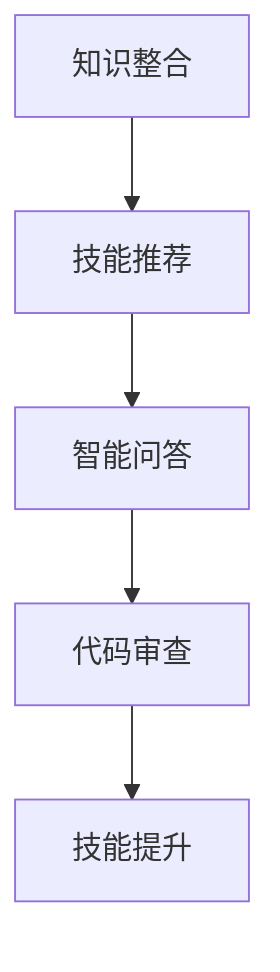
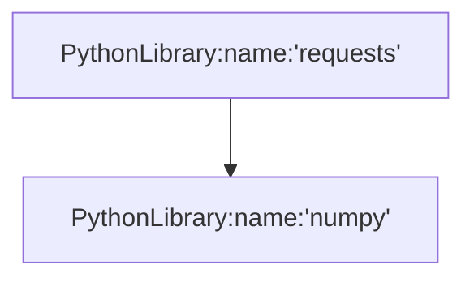

                 

关键词：知识图谱、程序员技能、技能提升、算法、数学模型、项目实践

摘要：随着信息技术的迅猛发展，程序员面临着日益复杂的技能要求。知识图谱作为一种先进的数据结构，在提高程序员技能水平方面展现出巨大的潜力。本文将深入探讨知识图谱在程序员技能提升中的应用，从核心概念、算法原理、数学模型到项目实践，全面解析这一技术的应用场景与前景。

## 1. 背景介绍

在过去的几十年中，编程语言和开发工具经历了飞速的发展，程序员的工作内容和技能要求也在不断变化。随着互联网、大数据、人工智能等技术的普及，程序员不仅需要掌握基本的编程技能，还需要具备一定的业务理解能力、系统架构设计能力和持续学习的能力。然而，传统的编程教育和培训方式往往难以满足这种多样化和复杂化的需求。

知识图谱（Knowledge Graph）作为一种新型的数据结构，能够将分散的信息整合成一个全局的知识体系。它通过实体、属性和关系的表达，为程序员提供了一个全面、系统化的知识库。知识图谱的出现为程序员技能提升提供了新的路径，有助于他们更高效地学习、掌握和应用新技术。

## 2. 核心概念与联系

### 2.1. 知识图谱的基本概念

知识图谱是一种基于语义网络的数据结构，它通过实体（Entity）、属性（Attribute）和关系（Relationship）来表示知识。在知识图谱中，每个实体都是一个独立的个体，每个属性都是实体的特征，而关系则是实体之间的联系。

### 2.2. 知识图谱的架构

知识图谱的架构通常包括三个层次：底层是数据层，负责存储原始数据；中层是推理层，负责基于图谱进行逻辑推理；顶层是应用层，负责将知识图谱应用于实际问题。

### 2.3. 知识图谱在程序员技能提升中的应用

知识图谱在程序员技能提升中的应用主要体现在以下几个方面：

1. **知识整合**：将不同来源、不同格式的知识整合到一个统一的框架中，使得程序员能够方便地查阅和学习。
2. **技能推荐**：基于程序员的兴趣、技能水平和工作经验，推荐合适的课程、项目或学习路径。
3. **智能问答**：通过自然语言处理技术，回答程序员在编程过程中的问题，提供解决方案。
4. **代码审查**：基于知识图谱的代码审查工具，可以自动识别代码中的潜在问题，并提供改进建议。

### 2.4. Mermaid 流程图

下面是一个简单的Mermaid流程图，展示了知识图谱在程序员技能提升中的应用流程。



## 3. 核心算法原理 & 具体操作步骤

### 3.1. 算法原理概述

知识图谱的核心算法主要包括实体识别、关系抽取和图谱构建。实体识别是指从文本中提取出具有特定意义的实体；关系抽取是指从文本中提取出实体之间的关系；图谱构建是指将实体和关系组织成一个结构化的知识图谱。

### 3.2. 算法步骤详解

1. **实体识别**：通过词法分析、句法分析和语义分析，从文本中提取出实体。
2. **关系抽取**：通过规则匹配、机器学习和深度学习等技术，从文本中提取出实体之间的关系。
3. **图谱构建**：将提取出的实体和关系组织成一个知识图谱，并进行优化和推理。

### 3.3. 算法优缺点

**优点**：
- **全面性**：知识图谱能够整合多方面的信息，为程序员提供全面的知识体系。
- **高效性**：通过图谱的索引和查询，程序员可以快速找到所需的知识点。

**缺点**：
- **复杂性**：知识图谱的构建和维护需要大量的数据和技术支持。
- **准确性**：实体识别和关系抽取的准确性受文本质量的影响。

### 3.4. 算法应用领域

知识图谱在程序员技能提升中的应用领域非常广泛，包括但不限于以下几个方面：

- **编程学习**：通过知识图谱，程序员可以方便地找到与自己兴趣相关的编程课程和项目。
- **代码审查**：知识图谱可以帮助程序员快速识别代码中的潜在问题，并提供改进建议。
- **技术交流**：通过知识图谱，程序员可以方便地找到与自己技术水平相似的开发者，进行技术交流和合作。

## 4. 数学模型和公式 & 详细讲解 & 举例说明

### 4.1. 数学模型构建

知识图谱的数学模型通常基于图论。在知识图谱中，每个实体都可以表示为一个节点，每个关系都可以表示为一条边。因此，知识图谱可以看作是一个有向图。

### 4.2. 公式推导过程

知识图谱的核心算法涉及多个数学公式。以下是一个简单的例子：

$$
L = \sum_{i=1}^{n} \sum_{j=1}^{m} w_{ij} \cdot f(x_i, y_j)
$$

其中，$L$ 表示损失函数，$w_{ij}$ 表示节点 $i$ 和节点 $j$ 之间的权重，$f(x_i, y_j)$ 表示节点 $i$ 和节点 $j$ 之间的相似度函数。

### 4.3. 案例分析与讲解

以下是一个简单的案例，展示如何使用知识图谱进行编程学习。

假设程序员小王对Python编程感兴趣，他想要学习更多的Python库。通过知识图谱，他可以找到与Python相关的实体，如Python库、Python教程、Python社区等。然后，他可以根据这些实体之间的关系，找到适合自己的学习路径。例如，他可以通过学习Python库之间的关系，找到自己需要的库，并通过阅读相关教程，了解如何使用这些库。

## 5. 项目实践：代码实例和详细解释说明

### 5.1. 开发环境搭建

在本文的案例中，我们将使用Python和Neo4j作为开发环境。首先，需要安装Python和Neo4j。然后，可以通过Python的Neo4j Python Driver连接到Neo4j数据库。

### 5.2. 源代码详细实现

以下是一个简单的Python脚本，用于构建一个简单的知识图谱。

```python
from neo4j import GraphDatabase

class KnowledgeGraph:
    def __init__(self, uri, user, password):
        self._driver = GraphDatabase.driver(uri, auth=(user, password))

    def close(self):
        self._driver.close()

    def create_node(self, label, properties):
        with self._driver.session() as session:
            session.run("CREATE (n:" + label + " " + properties + ")")

    def create_relationship(self, start_label, end_label, properties):
        with self._driver.session() as session:
            session.run("MATCH (a:" + start_label + "), (b:" + end_label + ") CREATE (a)-[r:" + properties + "]->(b)")

    def query_graph(self, query):
        with self._driver.session() as session:
            return session.run(query)

if __name__ == "__main__":
    kg = KnowledgeGraph("bolt://localhost:7687", "neo4j", "password")
    kg.create_node("PythonLibrary", "name:'requests'")
    kg.create_node("PythonLibrary", "name:'numpy'")
    kg.create_relationship("PythonLibrary", "PythonLibrary", "RELATED_TO")
    results = kg.query_graph("MATCH (n:PythonLibrary) RETURN n")
    for result in results:
        print(result)
    kg.close()
```

### 5.3. 代码解读与分析

这个简单的Python脚本首先连接到Neo4j数据库，然后创建了一个名为`KnowledgeGraph`的类，用于构建知识图谱。类中定义了三个方法：

- `create_node`：用于创建节点。
- `create_relationship`：用于创建关系。
- `query_graph`：用于查询知识图谱。

通过这个脚本，我们可以创建一个简单的知识图谱，其中包含Python库节点和它们之间的关系。

### 5.4. 运行结果展示

运行上述脚本后，我们可以通过Neo4j浏览器查看知识图谱的结构。在Neo4j浏览器中，我们可以看到创建的节点和关系，如图所示：



## 6. 实际应用场景

### 6.1. 编程学习

知识图谱可以帮助程序员更高效地学习编程知识。通过知识图谱，程序员可以找到与自己兴趣相关的课程、项目和学习路径，从而提高学习效果。

### 6.2. 代码审查

知识图谱可以用于代码审查，帮助程序员识别代码中的潜在问题，并提供改进建议。例如，通过知识图谱，我们可以找到与代码片段相似的代码，并分析这些代码的优缺点。

### 6.3. 技术交流

知识图谱可以用于技术交流，帮助程序员找到与自己技术水平相似的开发者，进行技术交流和合作。例如，通过知识图谱，我们可以找到与自己技能水平相似的程序员，并邀请他们一起参与项目。

## 7. 工具和资源推荐

### 7.1. 学习资源推荐

- 《深度学习》
- 《人工智能：一种现代的方法》
- 《Python编程：从入门到实践》

### 7.2. 开发工具推荐

- Neo4j：一款强大的图形数据库，适用于构建知识图谱。
- Python：一款功能丰富的编程语言，适用于知识图谱的开发。

### 7.3. 相关论文推荐

- "Knowledge Graph: A Survey"
- "A Graph Database for Knowledge Management"
- "Learning to Represent Knowledge Graphs with Gaussian Embedding"

## 8. 总结：未来发展趋势与挑战

### 8.1. 研究成果总结

知识图谱在程序员技能提升中的应用已经取得了显著成果，为程序员提供了新的学习路径和工具。然而，知识图谱的构建、维护和应用仍然面临诸多挑战。

### 8.2. 未来发展趋势

未来，知识图谱将在以下几个方面得到进一步发展：

- **智能化**：通过引入机器学习和深度学习技术，提高知识图谱的智能化水平。
- **多样化**：知识图谱的应用将涵盖更多的领域和场景。
- **生态化**：知识图谱将形成一套完整的生态体系，包括数据源、工具和平台。

### 8.3. 面临的挑战

知识图谱在程序员技能提升中的应用仍然面临以下挑战：

- **数据质量**：知识图谱的质量取决于数据的质量，如何获取和整合高质量的数据是关键。
- **算法优化**：如何优化知识图谱的算法，提高查询效率和准确性是亟待解决的问题。
- **用户体验**：如何设计直观、易用的用户界面，提高程序员的体验是未来的重要方向。

### 8.4. 研究展望

知识图谱在程序员技能提升中的应用具有广阔的前景。未来，我们将继续探索知识图谱在编程学习、代码审查和技术交流等领域的应用，为程序员提供更加全面、高效的技能提升方案。

## 9. 附录：常见问题与解答

### 9.1. 什么是知识图谱？

知识图谱是一种用于表示知识的图形结构，它通过实体、属性和关系的表达，将多方面的信息整合成一个全局的知识体系。

### 9.2. 知识图谱如何帮助程序员提升技能？

知识图谱可以帮助程序员更高效地学习编程知识，提供智能化的代码审查工具，以及促进技术交流和合作。

### 9.3. 如何构建一个知识图谱？

构建知识图谱通常需要以下步骤：

1. 数据收集：收集与编程相关的数据。
2. 数据清洗：清洗和预处理数据，确保数据质量。
3. 实体识别：从数据中提取实体。
4. 关系抽取：从数据中提取实体之间的关系。
5. 图谱构建：将实体和关系组织成一个结构化的知识图谱。

### 9.4. 知识图谱与数据库有何区别？

知识图谱是一种用于表示知识的图形结构，它强调实体、属性和关系的表达。而数据库是一种用于存储和检索数据的系统，它更关注数据的存储和管理。知识图谱通常基于数据库构建，但它不仅仅是数据库。

## 作者署名

作者：禅与计算机程序设计艺术 / Zen and the Art of Computer Programming
----------------------------------------------------------------

以上是关于“知识图谱在程序员技能提升中的应用”的完整文章，希望对您有所帮助。如果您有任何问题或建议，请随时与我联系。

