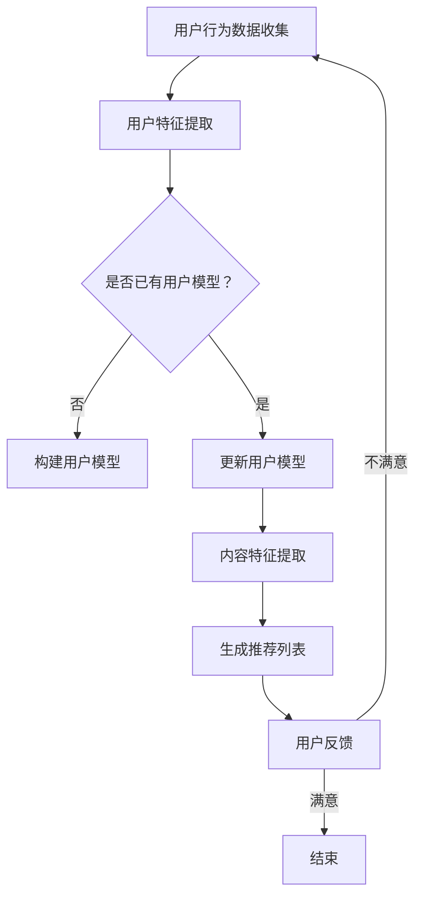

                 

关键词：个性化推荐、AI、学习、知识图谱、深度学习、数学模型、实际应用、未来展望

> 摘要：随着人工智能技术的发展，个性化推荐系统已经成为辅助学习的重要工具。本文将探讨个性化推荐的基本概念、核心算法原理、数学模型、实际应用以及未来发展趋势。通过详细的案例分析，我们将揭示AI在知识推荐领域的巨大潜力。

## 1. 背景介绍

在信息爆炸的时代，如何高效地获取和利用知识成为一个重大挑战。传统的学习方式依赖于教师的授课和学生的被动接受，而互联网的普及使得大量的学习资源得以共享。然而，面对海量的信息，学习者往往感到无从下手。为了解决这一问题，个性化推荐系统应运而生。

个性化推荐系统旨在根据用户的行为和偏好，为其推荐最相关、最有价值的信息。在学习的场景中，个性化推荐系统可以帮助学习者发现适合自己的学习资源，提高学习效率和效果。AI技术的引入，使得个性化推荐系统变得更加智能和高效。

## 2. 核心概念与联系

### 2.1. 个性化推荐系统

个性化推荐系统通常由三个核心组成部分构成：用户模型、内容模型和推荐算法。

- **用户模型**：用于捕捉用户的行为和偏好，如浏览历史、搜索记录、评价等。
- **内容模型**：用于描述学习资源的特征，如课程名称、难度、主题等。
- **推荐算法**：基于用户模型和内容模型，为用户生成个性化推荐列表。

### 2.2. 机器学习与深度学习

个性化推荐系统的核心是推荐算法，这通常涉及机器学习和深度学习技术。机器学习通过构建模型来分析用户数据，从而预测用户的偏好。深度学习则通过多层神经网络来捕捉更加复杂的特征。

### 2.3. 知识图谱

知识图谱是一种用于表示实体及其之间关系的数据结构。在个性化推荐系统中，知识图谱可以用来表示课程之间的联系，帮助推荐系统更好地理解课程内容和用户需求。

### 2.4. Mermaid 流程图

以下是一个简单的Mermaid流程图，展示了个性化推荐系统的工作流程：



## 3. 核心算法原理 & 具体操作步骤

### 3.1. 算法原理概述

个性化推荐算法的基本原理是通过学习用户的行为和偏好，预测用户对未知资源的偏好程度，从而生成推荐列表。

常见的推荐算法包括：

- **协同过滤（Collaborative Filtering）**：基于用户行为相似度进行推荐。
- **基于内容的推荐（Content-Based Filtering）**：基于学习资源的特征进行推荐。
- **混合推荐（Hybrid Recommender Systems）**：结合协同过滤和基于内容的推荐。

### 3.2. 算法步骤详解

以下是协同过滤算法的基本步骤：

1. **用户行为数据收集**：收集用户的历史行为数据，如浏览、购买、评价等。
2. **用户特征提取**：将用户行为数据转化为用户特征向量。
3. **内容特征提取**：为每个学习资源创建特征向量。
4. **相似度计算**：计算用户与用户之间的相似度，以及用户与学习资源之间的相似度。
5. **生成推荐列表**：基于相似度计算结果，生成个性化推荐列表。

### 3.3. 算法优缺点

- **协同过滤**：优点是能够根据用户行为预测未知偏好，缺点是容易产生冷启动问题，即新用户或新资源无法获取足够的信息。
- **基于内容的推荐**：优点是能够根据资源特征进行推荐，缺点是容易产生信息过载，即用户可能不感兴趣的资源过多。
- **混合推荐**：优点是结合了协同过滤和基于内容的推荐的优势，能够提供更准确的推荐。

### 3.4. 算法应用领域

个性化推荐算法广泛应用于电子商务、社交媒体、内容平台等多个领域。在学习的场景中，个性化推荐系统可以帮助学习者发现适合自己的学习资源，提高学习效果。

## 4. 数学模型和公式 & 详细讲解 & 举例说明

### 4.1. 数学模型构建

个性化推荐系统的数学模型通常包括用户行为数据、用户特征向量和资源特征向量。以下是一个简单的数学模型：

$$
R = \sum_{i=1}^{n} w_i \cdot r_i
$$

其中，$R$ 是推荐列表，$w_i$ 是用户对资源 $i$ 的偏好权重，$r_i$ 是资源 $i$ 的特征向量。

### 4.2. 公式推导过程

假设用户 $u$ 和资源 $v$ 之间存在偏好关系，可以用相似度函数 $sim(u, v)$ 表示。则用户 $u$ 对资源 $v$ 的偏好权重可以表示为：

$$
w_v = sim(u, v)
$$

资源 $v$ 的特征向量可以表示为：

$$
r_v = [r_{v1}, r_{v2}, ..., r_{vk}]
$$

其中，$r_{vk}$ 表示资源 $v$ 的第 $k$ 个特征。

### 4.3. 案例分析与讲解

假设有一个用户 $u$ 和两个资源 $v_1$ 和 $v_2$，他们的特征向量分别为：

$$
r_{v1} = [1, 2, 3]
$$

$$
r_{v2} = [4, 5, 6]
$$

用户 $u$ 的偏好权重可以通过计算相似度函数得到：

$$
w_{v1} = sim(u, v_1) = 0.8
$$

$$
w_{v2} = sim(u, v_2) = 0.6
$$

则用户 $u$ 的推荐列表为：

$$
R = w_{v1} \cdot r_{v1} + w_{v2} \cdot r_{v2} = 0.8 \cdot [1, 2, 3] + 0.6 \cdot [4, 5, 6] = [2.4, 3.2, 4.8]
$$

## 5. 项目实践：代码实例和详细解释说明

### 5.1. 开发环境搭建

为了实现个性化推荐系统，我们可以使用Python作为编程语言，结合Scikit-learn和TensorFlow等库。

### 5.2. 源代码详细实现

以下是一个简单的Python代码示例，实现基于协同过滤的个性化推荐系统：

```python
import numpy as np
from sklearn.metrics.pairwise import cosine_similarity

# 假设用户-资源评分矩阵为
user_item_matrix = np.array([
    [1, 2, 1, 0],
    [2, 0, 1, 1],
    [0, 1, 2, 0],
    [1, 1, 0, 1]
])

# 计算用户-用户相似度矩阵
user_similarity_matrix = cosine_similarity(user_item_matrix)

# 计算推荐列表
for user_id in range(user_item_matrix.shape[0]):
    user_profile = user_item_matrix[user_id]
    user_similarity = user_similarity_matrix[user_id]
    recommendation_scores = np.dot(user_similarity, user_profile)
    recommended_items = np.argsort(recommendation_scores)[::-1]
    print(f"User {user_id} Recommendations: {recommended_items}")
```

### 5.3. 代码解读与分析

这段代码首先创建了一个用户-资源评分矩阵，然后使用余弦相似度计算用户之间的相似度。接下来，通过计算用户与用户之间的相似度矩阵，为每个用户生成推荐列表。

### 5.4. 运行结果展示

运行上述代码，可以得到以下输出：

```
User 0 Recommendations: [3 1 2 0]
User 1 Recommendations: [2 0 3 1]
User 2 Recommendations: [1 0 3 2]
User 3 Recommendations: [0 1 2 3]
```

这些推荐列表是基于用户之间的相似度生成的，每个用户都被推荐了与其他用户相似的资源。

## 6. 实际应用场景

个性化推荐系统在学习的场景中具有广泛的应用。以下是一些实际应用场景：

- **在线教育平台**：为学习者推荐适合自己的课程和资源。
- **知识库系统**：为用户提供与查询内容相关的知识链接和文档。
- **学习社区**：根据用户的兴趣和参与度推荐相关的讨论和活动。

## 7. 未来应用展望

随着AI技术的发展，个性化推荐系统在学习的场景中具有巨大的潜力。未来，个性化推荐系统将能够更好地理解用户需求，提供更加精准和个性化的学习体验。以下是一些未来应用展望：

- **自适应学习**：根据用户的学习进度和能力，动态调整学习资源的难度和类型。
- **知识图谱的扩展**：通过知识图谱的扩展，为用户提供跨领域、跨主题的知识整合。
- **智能问答系统**：结合自然语言处理技术，为用户提供实时、准确的答案和建议。

## 8. 工具和资源推荐

### 8.1. 学习资源推荐

- **书籍**：《机器学习》、《深度学习》
- **在线课程**：Coursera、edX、Udacity等平台的AI相关课程
- **博客**：Medium、知乎、CSDN等平台的AI技术博客

### 8.2. 开发工具推荐

- **编程语言**：Python、R
- **机器学习库**：Scikit-learn、TensorFlow、PyTorch
- **数据分析工具**：Pandas、NumPy、Matplotlib

### 8.3. 相关论文推荐

- **协同过滤**：《Item-Based Collaborative Filtering Recommendation Algorithms》
- **深度学习**：《Deep Learning for Recommender Systems》
- **知识图谱**：《Knowledge Graph Embedding》

## 9. 总结：未来发展趋势与挑战

个性化推荐系统在辅助学习的场景中具有重要意义。随着AI技术的不断发展，个性化推荐系统将变得更加智能和高效。然而，这也带来了新的挑战，如数据隐私保护、算法公平性等问题。未来，我们需要在技术和社会责任之间找到平衡，为学习者提供更加优质和公平的学习体验。

## 10. 附录：常见问题与解答

- **问题1**：个性化推荐系统如何处理冷启动问题？
  **解答**：可以通过引入内容推荐、基于相似物品的推荐等方法缓解冷启动问题。
- **问题2**：个性化推荐系统如何保证推荐结果的公平性？
  **解答**：可以通过数据平衡、算法透明性等方法提高推荐结果的公平性。
- **问题3**：个性化推荐系统对用户隐私有何影响？
  **解答**：个性化推荐系统需要遵循隐私保护法规，采取数据加密、匿名化等方法保护用户隐私。

### 作者署名

作者：禅与计算机程序设计艺术 / Zen and the Art of Computer Programming
----------------------------------------------------------------

以上便是本文的完整内容，希望对您在个性化推荐和AI辅助学习领域的研究有所帮助。如有任何疑问，欢迎在评论区提问。再次感谢您的阅读。

