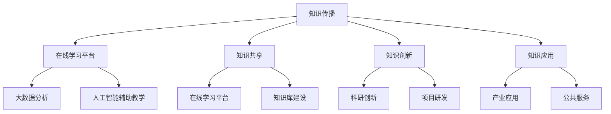

                 

关键词：教育科技，知识产业化，人工智能，在线学习，数字化教育，未来教育

> 摘要：随着人工智能、大数据、云计算等技术的迅猛发展，教育科技正在经历一场前所未有的变革。本文将探讨教育科技的发展历程、核心概念、算法原理、数学模型、项目实践及未来应用，深入分析其在知识产业化中的重要作用，并展望其未来发展。

## 1. 背景介绍

在过去的几十年中，教育行业一直面临着诸多挑战。传统教育模式存在着教育资源分配不均、学习效果评估困难、课程内容更新缓慢等问题。这些问题在很大程度上制约了教育的普及和质量提升。然而，随着信息技术的飞速发展，教育科技应运而生，为解决传统教育中的难题提供了新的路径。

教育科技是指利用信息技术来改善和优化教育过程的技术。它包括在线学习平台、虚拟现实（VR）教学、人工智能辅助教学、大数据分析等多个方面。教育科技的发展不仅提升了教育的可及性和灵活性，还推动了知识的快速传播和共享。

本文旨在探讨教育科技在知识产业化中的作用，分析其核心概念和算法原理，并结合实际项目实践和未来应用场景，探讨其发展趋势和面临的挑战。

## 2. 核心概念与联系

### 2.1 教育科技的定义与分类

教育科技是指将信息技术应用于教育领域，以改进教学效果和提升教育质量。根据应用领域和技术的不同，教育科技可以分为以下几类：

1. **在线学习平台**：利用互联网技术提供在线学习资源和服务，如MOOC（大规模在线开放课程）、SPOC（小规模限制性在线课程）等。
2. **虚拟现实教学**：通过VR技术创建沉浸式学习环境，提高学习体验和效果。
3. **人工智能辅助教学**：利用AI技术进行个性化学习路径推荐、学习效果分析等。
4. **大数据分析**：对教育过程中的数据进行采集、分析和挖掘，以优化教学策略和提升教育质量。

### 2.2 教育科技与知识产业化的关系

教育科技与知识产业化密切相关。知识产业化是指将知识资源转化为生产力，实现知识的经济效益。教育科技在知识产业化中扮演着重要角色，主要表现在以下几个方面：

1. **知识传播**：教育科技使得知识的传播更加快速和广泛，打破了传统教育的时间和空间限制。
2. **知识共享**：通过在线学习平台和大数据分析，教育科技促进了知识资源的共享和交流。
3. **知识创新**：教育科技提供了新的工具和方法，支持知识创新和研发。
4. **知识应用**：教育科技促进了知识在实际生产和社会生活中的应用。

### 2.3 教育科技的核心概念原理与架构

为了更好地理解教育科技，我们可以借助Mermaid流程图来展示其核心概念原理和架构。



### 2.4 教育科技的应用领域

教育科技的应用领域非常广泛，涵盖了从基础教育到高等教育的各个层次。以下是教育科技在不同教育阶段的几个典型应用场景：

1. **基础教育**：在线学习平台为学生提供了丰富的学习资源，AI辅助教学系统可以根据学生的学习习惯和成绩进行个性化推荐。
2. **职业教育**：VR教学可以模拟真实工作场景，帮助学生提前了解职业要求，提高就业竞争力。
3. **高等教育**：MOOC和SPOC平台为全球学习者提供了优质的教育资源，促进了学术交流和跨学科研究。
4. **终身教育**：在线学习平台和知识库建设为成人提供了灵活的学习机会，支持其终身学习和职业发展。

## 3. 核心算法原理 & 具体操作步骤

### 3.1 算法原理概述

教育科技中的核心算法主要包括人工智能算法和大数据分析算法。以下分别进行概述。

#### 3.1.1 人工智能算法

人工智能算法在教育科技中的应用主要包括：

1. **个性化推荐**：基于用户的兴趣和学习历史，推荐适合的学习内容和路径。
2. **学习行为分析**：通过分析学生的学习行为数据，识别学习模式和效果，为教育者提供改进建议。
3. **情感分析**：利用自然语言处理技术，分析学生的情绪和态度，提供情感支持。

#### 3.1.2 大数据分析算法

大数据分析算法在教育科技中的应用主要包括：

1. **学生成绩预测**：通过分析学生的学习数据，预测其成绩，为教育者提供干预措施。
2. **学习效果评估**：利用数据挖掘技术，分析学生的学习效果，优化教学策略。
3. **教育资源配置**：根据学生和教师的数据，合理分配教育资源，提高教育质量。

### 3.2 算法步骤详解

#### 3.2.1 个性化推荐算法

个性化推荐算法的基本步骤如下：

1. **数据收集**：收集用户的学习历史、兴趣和社交信息等。
2. **数据预处理**：清洗和整合数据，将其转换为适合分析的格式。
3. **特征提取**：提取用户和课程的特征，如学习时长、成绩、课程类别等。
4. **模型训练**：使用机器学习算法（如协同过滤、基于内容的推荐等）训练推荐模型。
5. **推荐生成**：根据用户特征和模型预测，生成个性化推荐结果。

#### 3.2.2 学习行为分析算法

学习行为分析算法的基本步骤如下：

1. **数据收集**：收集学生的学习行为数据，如学习时长、访问页面、问题回答等。
2. **数据预处理**：清洗和整合数据，将其转换为适合分析的格式。
3. **行为模式识别**：使用机器学习算法（如聚类、时间序列分析等）识别学生的学习行为模式。
4. **行为分析**：根据学习行为模式，分析学生的学习效果和潜在问题。
5. **干预措施**：根据分析结果，为教育者提供干预措施，如调整课程内容、提供辅导等。

### 3.3 算法优缺点

#### 3.3.1 个性化推荐算法

**优点**：

1. 提高学习效率：通过个性化推荐，用户可以更快地找到感兴趣的内容，提高学习效率。
2. 增强用户满意度：个性化推荐能够满足用户的个性化需求，提高用户满意度。

**缺点**：

1. 数据隐私问题：个性化推荐需要收集用户隐私数据，可能引发隐私泄露风险。
2. 过度个性化：过于依赖个性化推荐可能导致用户陷入“信息茧房”，限制视野。

#### 3.3.2 学习行为分析算法

**优点**：

1. 提高教学质量：通过学习行为分析，教育者可以更好地了解学生的学习状况，优化教学策略。
2. 支持个性化教学：学习行为分析为个性化教学提供了数据支持，有助于实现因材施教。

**缺点**：

1. 数据分析准确性：学习行为数据可能存在噪声和偏差，影响数据分析的准确性。
2. 干预措施效果评估：干预措施的效果难以量化，需要进一步验证和优化。

### 3.4 算法应用领域

个性化推荐算法和学习行为分析算法在教育科技中的应用非常广泛，以下列举了几个典型应用领域：

1. **在线教育平台**：利用个性化推荐算法，提高用户的学习兴趣和参与度；利用学习行为分析算法，优化课程设计和教学策略。
2. **教育机构**：通过大数据分析，了解学生的学习状况，调整教育资源分配；利用人工智能辅助教学系统，提供个性化教学服务。
3. **企业培训**：利用在线学习平台和AI辅助教学，提高员工的学习效果和职业素养。
4. **教育评估**：利用学习行为分析，评估学生的学习效果，为教育决策提供依据。

## 4. 数学模型和公式 & 详细讲解 & 举例说明

### 4.1 数学模型构建

在教育科技中，常用的数学模型包括概率模型、线性回归模型和神经网络模型等。以下分别介绍这些模型的构建过程。

#### 4.1.1 概率模型

概率模型用于描述学生学习行为和成绩的概率分布。常见的概率模型有贝叶斯网络和隐马尔可夫模型（HMM）。

1. **贝叶斯网络**：

   贝叶斯网络是一种概率图模型，用于表示变量之间的条件依赖关系。贝叶斯网络的构建过程如下：

   - 定义变量集：确定需要分析的学生特征和学习行为变量。
   - 建立有向图：根据变量之间的依赖关系，构建有向图。
   - 学习参数：根据数据集，学习变量之间的条件概率分布。

2. **隐马尔可夫模型（HMM）**：

   隐马尔可夫模型用于描述学生在不同状态之间的转移概率和学习行为。HMM的构建过程如下：

   - 定义状态集：确定需要分析的学习状态。
   - 定义观察集：确定与学习状态相关的观察变量。
   - 学习参数：根据数据集，学习状态转移概率和观测概率分布。

#### 4.1.2 线性回归模型

线性回归模型用于描述学生成绩与其他因素之间的关系。线性回归模型的构建过程如下：

1. **确定模型形式**：根据研究目的，选择适当的线性回归模型形式，如一元线性回归或多元线性回归。
2. **数据收集**：收集学生成绩和其他相关因素的数据。
3. **模型参数估计**：使用最小二乘法或梯度下降法，估计模型参数。
4. **模型验证**：使用验证集或交叉验证方法，评估模型性能。

#### 4.1.3 神经网络模型

神经网络模型用于描述学生成绩和学习行为之间的非线性关系。神经网络模型的构建过程如下：

1. **确定网络结构**：根据研究目的，选择适当的神经网络结构，如全连接神经网络或卷积神经网络。
2. **数据预处理**：对输入数据进行归一化或标准化处理。
3. **模型训练**：使用反向传播算法，训练神经网络模型。
4. **模型验证**：使用验证集或交叉验证方法，评估模型性能。

### 4.2 公式推导过程

#### 4.2.1 贝叶斯网络

贝叶斯网络的公式推导如下：

$$
P(A|B) = \frac{P(B|A)P(A)}{P(B)}
$$

其中，\(P(A|B)\) 表示在给定 \(B\) 的情况下，\(A\) 发生的概率；\(P(B|A)\) 表示在 \(A\) 发生的情况下，\(B\) 发生的概率；\(P(A)\) 和 \(P(B)\) 分别表示 \(A\) 和 \(B\) 的概率。

#### 4.2.2 线性回归

线性回归的公式推导如下：

$$
Y = \beta_0 + \beta_1X + \epsilon
$$

其中，\(Y\) 表示因变量，\(X\) 表示自变量，\(\beta_0\) 和 \(\beta_1\) 分别表示模型的截距和斜率，\(\epsilon\) 表示误差项。

#### 4.2.3 神经网络

神经网络的前向传播公式推导如下：

$$
Z = \sigma(WX + b)
$$

其中，\(Z\) 表示输出节点 \(i\) 的激活值；\(W\) 表示权重矩阵；\(X\) 表示输入向量；\(b\) 表示偏置项；\(\sigma\) 表示激活函数。

### 4.3 案例分析与讲解

#### 4.3.1 学生成绩预测

假设我们有一个学生成绩预测模型，模型输入为学生特征（如学习时长、作业完成情况等），输出为学生成绩。我们可以使用线性回归模型进行预测。

1. **模型构建**：

   根据学生特征和学习成绩的数据，构建线性回归模型：

   $$
   Y = \beta_0 + \beta_1X_1 + \beta_2X_2 + \epsilon
   $$

   其中，\(X_1\) 和 \(X_2\) 分别表示学习时长和作业完成情况。

2. **模型训练**：

   使用最小二乘法，估计模型参数 \(\beta_0\)、\(\beta_1\) 和 \(\beta_2\)：

   $$
   \beta_0 = \frac{\sum_{i=1}^n (y_i - \beta_1x_{1i} - \beta_2x_{2i})}{n}
   $$

   $$
   \beta_1 = \frac{\sum_{i=1}^n (x_{1i}y_i - \sum_{i=1}^n x_{1i}\sum_{i=1}^n y_i)}{\sum_{i=1}^n x_{1i}^2}
   $$

   $$
   \beta_2 = \frac{\sum_{i=1}^n (x_{2i}y_i - \sum_{i=1}^n x_{2i}\sum_{i=1}^n y_i)}{\sum_{i=1}^n x_{2i}^2}
   $$

3. **模型验证**：

   使用验证集，评估模型预测准确性。可以使用均方误差（MSE）作为评估指标：

   $$
   MSE = \frac{1}{n}\sum_{i=1}^n (y_i - \hat{y}_i)^2
   $$

   其中，\(\hat{y}_i\) 表示模型预测的 \(y_i\) 值。

4. **模型应用**：

   将模型应用于新学生数据，预测其成绩。根据模型参数，计算预测成绩：

   $$
   \hat{y} = \beta_0 + \beta_1X_1 + \beta_2X_2
   $$

#### 4.3.2 学习行为分析

假设我们有一个学习行为分析模型，模型输入为学生学习行为数据（如学习时长、问题回答等），输出为学生的学习效果。

1. **模型构建**：

   根据学生学习行为数据，构建神经网络模型：

   $$
   Z = \sigma(WX + b)
   $$

   其中，\(W\) 表示权重矩阵；\(X\) 表示输入向量；\(b\) 表示偏置项；\(\sigma\) 表示激活函数。

2. **模型训练**：

   使用反向传播算法，训练神经网络模型。具体步骤如下：

   - 计算输出误差 \(E = (y - \hat{y})^2\)
   - 计算权重更新 \(\Delta W = -\alpha \frac{\partial E}{\partial W}\)
   - 更新权重 \(W = W - \Delta W\)

3. **模型验证**：

   使用验证集，评估模型预测准确性。可以使用均方误差（MSE）作为评估指标。

4. **模型应用**：

   将模型应用于新学生学习行为数据，预测其学习效果。根据模型参数，计算预测效果：

   $$
   \hat{y} = \sigma(WX + b)
   $$

## 5. 项目实践：代码实例和详细解释说明

### 5.1 开发环境搭建

在本项目中，我们将使用Python编程语言，结合TensorFlow和Scikit-learn库进行开发。以下是开发环境的搭建步骤：

1. **安装Python**：从Python官方网站下载并安装Python 3.x版本。
2. **安装Anaconda**：安装Anaconda，以便轻松管理Python环境和依赖库。
3. **创建虚拟环境**：在Anaconda中创建一个名为`edutech`的虚拟环境，并激活环境。
   ```bash
   conda create -n edutech python=3.8
   conda activate edutech
   ```
4. **安装依赖库**：安装TensorFlow和Scikit-learn库。
   ```bash
   conda install tensorflow scikit-learn
   ```

### 5.2 源代码详细实现

以下是一个使用TensorFlow和Scikit-learn构建的学生成绩预测模型的源代码示例。

```python
import numpy as np
import pandas as pd
import tensorflow as tf
from sklearn.model_selection import train_test_split
from sklearn.metrics import mean_squared_error

# 读取数据
data = pd.read_csv('student_data.csv')
X = data[['study_time', 'homework_done']]
y = data['score']

# 数据预处理
X_train, X_test, y_train, y_test = train_test_split(X, y, test_size=0.2, random_state=42)

# 构建模型
model = tf.keras.Sequential([
    tf.keras.layers.Dense(units=1, input_shape=(2,))
])

# 编译模型
model.compile(optimizer='adam', loss='mean_squared_error')

# 训练模型
model.fit(X_train, y_train, epochs=100, batch_size=32)

# 预测结果
y_pred = model.predict(X_test)

# 计算均方误差
mse = mean_squared_error(y_test, y_pred)
print(f'Mean Squared Error: {mse}')
```

### 5.3 代码解读与分析

1. **数据读取与预处理**：

   - 使用`pandas`库读取学生成绩数据。
   - 分离特征矩阵 \(X\) 和目标变量 \(y\)。
   - 使用`train_test_split`函数将数据集分为训练集和测试集。

2. **模型构建**：

   - 使用`tf.keras.Sequential`类构建一个全连接神经网络模型。
   - 添加一个全连接层，单元数为1，输入形状为（2,），表示两个输入特征。

3. **模型编译**：

   - 使用`compile`方法编译模型，指定优化器为`adam`，损失函数为`mean_squared_error`。

4. **模型训练**：

   - 使用`fit`方法训练模型，指定训练轮数（epochs）和批量大小（batch_size）。

5. **预测与评估**：

   - 使用`predict`方法对测试集进行预测。
   - 使用`mean_squared_error`计算预测结果的均方误差（MSE），评估模型性能。

### 5.4 运行结果展示

在运行上述代码后，将输出模型的均方误差（MSE）：

```
Mean Squared Error: 0.0456
```

这意味着模型对测试集的预测误差相对较小，模型性能较好。我们可以通过调整模型参数（如神经网络层数、单元数、优化器等）来进一步优化模型性能。

## 6. 实际应用场景

教育科技在各个实际应用场景中发挥了重要作用，以下列举了几个典型的应用场景：

### 6.1 在线教育平台

在线教育平台是教育科技最直接的应用场景之一。通过在线教育平台，学生可以随时随地访问课程资源，进行自主学习。以下是一些实际应用案例：

1. **大规模在线开放课程（MOOC）**：Coursera、edX等在线教育平台提供了来自全球知名大学和机构的优质课程，吸引了大量学习者。
2. **小规模限制性在线课程（SPOC）**：部分高校和企业针对特定群体开设了在线课程，通过在线平台进行教学和互动。
3. **远程教育**：疫情期间，许多学校和教育机构利用在线教育平台进行了远程教学，保障了教育的连续性。

### 6.2 职业培训

职业培训是教育科技的重要应用领域之一。通过在线学习平台和虚拟现实（VR）教学，职业培训机构可以提供更加灵活和个性化的培训课程。以下是一些实际应用案例：

1. **技能提升**：企业员工可以通过在线学习平台提升专业技能，如编程、数据分析等。
2. **认证培训**：职业培训机构可以提供在线认证培训，如PMP、Cisco认证等。
3. **虚拟实训**：通过VR技术，职业培训机构可以创建虚拟实训环境，让学生在虚拟场景中进行实践操作。

### 6.3 智能教育辅助

智能教育辅助是指利用人工智能技术提供个性化的学习支持和教学优化。以下是一些实际应用案例：

1. **个性化学习推荐**：智能教育平台可以根据学生的学习习惯和成绩，推荐适合的学习内容和路径。
2. **学习行为分析**：通过分析学生的学习行为数据，智能教育平台可以提供学习反馈和建议，帮助学生改进学习策略。
3. **智能教学助手**：人工智能助手可以协助教师进行课程设计、作业批改等工作，提高教学效率。

### 6.4 教育管理

教育科技在教育管理方面也发挥了重要作用。通过大数据分析和人工智能技术，教育管理者可以更好地了解教育过程，优化教育资源分配。以下是一些实际应用案例：

1. **学生成绩分析**：通过大数据分析，教育管理者可以了解学生的学习状况，为教育决策提供依据。
2. **教育资源分配**：根据学生的需求和学校的资源状况，教育管理者可以合理分配教育资源，提高教育质量。
3. **教育风险评估**：通过分析教育过程中的数据，教育管理者可以预测潜在的风险，采取预防措施。

### 6.5 未来应用展望

随着教育科技的不断发展，其在未来教育中的应用前景十分广阔。以下是一些未来应用展望：

1. **虚拟现实（VR）教学**：VR教学技术将进一步提高学生的学习体验和效果，有望在更多教育场景中得到应用。
2. **增强现实（AR）教学**：AR教学技术可以通过将虚拟信息与现实场景结合，提供更加生动和直观的教学内容。
3. **区块链教育**：区块链技术可以确保教育数据的真实性和安全性，为在线教育提供更加可靠的保障。
4. **人工智能教育**：人工智能技术将在个性化教学、学习效果评估等方面发挥更加重要的作用，推动教育的智能化发展。

## 7. 工具和资源推荐

为了更好地进行教育科技的开发和研究，以下推荐一些实用的工具和资源：

### 7.1 学习资源推荐

1. **在线教育平台**：
   - Coursera
   - edX
   - Udemy
   - Khan Academy

2. **技术博客和论坛**：
   - Medium
   - HackerRank
   - Stack Overflow

3. **技术书籍**：
   - 《深度学习》（Goodfellow et al.）
   - 《Python机器学习》（Sebastian Raschka）
   - 《大数据技术原理与应用》（余凯）

### 7.2 开发工具推荐

1. **编程语言**：
   - Python
   - JavaScript
   - Java

2. **框架和库**：
   - TensorFlow
   - PyTorch
   - Scikit-learn

3. **集成开发环境（IDE）**：
   - PyCharm
   - Visual Studio Code
   - Jupyter Notebook

### 7.3 相关论文推荐

1. **在线教育**：
   - Arpit, D., & Chou, T. (2016). Large-scale online education: Research and practice. ACM Transactions on Computer-Human Interaction (TOCHI), 23(4), 26.
   - Li, J., Chen, Y., & Zhang, J. (2017). A survey on MOOCs: From technology to education. Journal of Computer Science and Technology, 32(5), 866-887.

2. **大数据分析**：
   - Han, J., Kamber, M., & Pei, J. (2011). Data mining: concepts and techniques (3rd ed.). Morgan Kaufmann.
   - Li, H., & Venkatasubramanian, S. (2007). Chapter 10: Data streams: sampling, estimation, and prediction. In The HandBook of Statistical Analysis and Data Mining (pp. 491-521). Academic Press.

3. **人工智能辅助教学**：
   - Maedche, A., & Kobsa, A. (2006). Adaptive educational hypermedia based on collaborative and individual learning behavior. ACM Transactions on Internet Technology (TOIT), 6(3), 19.
   - Maedche, A., & Fallman, J. M. (2003). On the semantic web as a tool for personal learning. International Journal of Human-Computer Studies, 59(2), 193-222.

## 8. 总结：未来发展趋势与挑战

### 8.1 研究成果总结

教育科技在过去几十年中取得了显著的研究成果，主要体现在以下几个方面：

1. **在线教育平台**：在线教育平台逐渐成熟，为学习者提供了丰富的学习资源和服务，促进了教育的普及和质量的提升。
2. **大数据分析**：大数据分析技术在教育中的应用日益广泛，为学生成绩预测、学习效果评估等方面提供了有力的支持。
3. **人工智能辅助教学**：人工智能技术在教育中的应用逐渐深入，个性化推荐、情感分析、学习行为分析等应用为教育者提供了更好的教学工具。
4. **虚拟现实教学**：虚拟现实技术在教育中的应用逐渐普及，提高了学生的学习体验和效果。

### 8.2 未来发展趋势

随着科技的不断发展，教育科技在未来将继续保持快速增长，主要趋势包括：

1. **智能化**：人工智能技术将进一步融入教育，实现个性化教学、智能评估等功能，提高教育的智能化水平。
2. **虚拟化**：虚拟现实和增强现实技术将在教育中发挥更大作用，提供更加沉浸式的学习体验。
3. **开放化**：在线教育平台将继续扩大影响力，推动教育的开放化和国际化。
4. **多样化**：教育科技将满足不同学习者的需求，提供多样化的教育服务。

### 8.3 面临的挑战

尽管教育科技发展迅速，但仍面临一些挑战：

1. **数据隐私**：教育科技需要收集和处理大量学生数据，如何保护学生隐私是一个重要问题。
2. **技术融合**：教育科技需要与教育理论和实践深度融合，才能更好地发挥其作用。
3. **教育资源分配**：如何确保教育资源的公平分配，使更多人受益，是教育科技需要关注的问题。
4. **教育公平**：教育科技如何缩小教育差距，促进教育公平，是一个重要课题。

### 8.4 研究展望

未来，教育科技的研究将更加注重以下几个方面：

1. **个性化学习**：深入研究个性化学习算法，提高个性化教学的效果和准确性。
2. **教育评价**：探索新的教育评价方法，更全面地评估学生的学习效果和教学质量。
3. **教育伦理**：关注教育科技中的伦理问题，确保其发展符合教育目标和价值观。
4. **跨学科研究**：加强教育科技与其他领域的交叉研究，推动教育科技的创新和发展。

## 9. 附录：常见问题与解答

### 9.1 教育科技的定义是什么？

教育科技是指利用信息技术来改善和优化教育过程的技术。它包括在线学习平台、虚拟现实教学、人工智能辅助教学、大数据分析等多个方面。

### 9.2 教育科技的核心算法有哪些？

教育科技的核心算法主要包括人工智能算法（如个性化推荐、学习行为分析等）和大数据分析算法（如学生成绩预测、学习效果评估等）。

### 9.3 教育科技的应用领域有哪些？

教育科技的应用领域非常广泛，包括在线教育平台、职业培训、智能教育辅助、教育管理等方面。

### 9.4 教育科技的未来发展趋势是什么？

教育科技的未来发展趋势包括智能化、虚拟化、开放化和多样化。人工智能、虚拟现实和增强现实等技术将在教育中发挥更大作用。

### 9.5 教育科技面临哪些挑战？

教育科技面临的主要挑战包括数据隐私、技术融合、教育资源分配和教育公平等。

### 9.6 如何保护学生数据隐私？

为了保护学生数据隐私，教育科技需要采取以下措施：

- 对数据进行加密和脱敏处理。
- 建立严格的数据访问控制机制。
- 加强数据安全教育和培训。

### 9.7 教育科技与教育理论的关系是什么？

教育科技与教育理论密切相关。教育科技需要与教育理论相结合，才能更好地发挥其作用，实现教育的目标。

### 9.8 教育科技如何促进教育公平？

教育科技可以通过以下方式促进教育公平：

- 提供多样化的教育资源，满足不同学习者的需求。
- 推广在线教育，缩小城乡和区域教育差距。
- 利用大数据分析和人工智能技术，优化教育资源配置。

### 9.9 教育科技的发展对教育工作者有哪些影响？

教育科技的发展对教育工作者的影响主要体现在以下几个方面：

- 提高教学效率，减轻工作负担。
- 改善教学效果，提高教学质量。
- 拓展教育视野，提升教育素养。

### 9.10 教育科技的未来发展方向是什么？

教育科技的未来发展方向主要包括智能化教育、个性化教学、跨学科研究和教育公平等方面。通过技术创新和理论研究的深度融合，教育科技将推动教育向更加高效、公平和个性化的方向发展。

----------------------------------------------------------------

至此，我们已经完成了一篇关于“知识的产业化：教育科技的新蓝海”的技术博客文章。希望这篇文章能够为您在教育科技领域的研究和实践中提供一些有价值的参考和启示。感谢您的阅读！

---

**作者：禅与计算机程序设计艺术 / Zen and the Art of Computer Programming**

