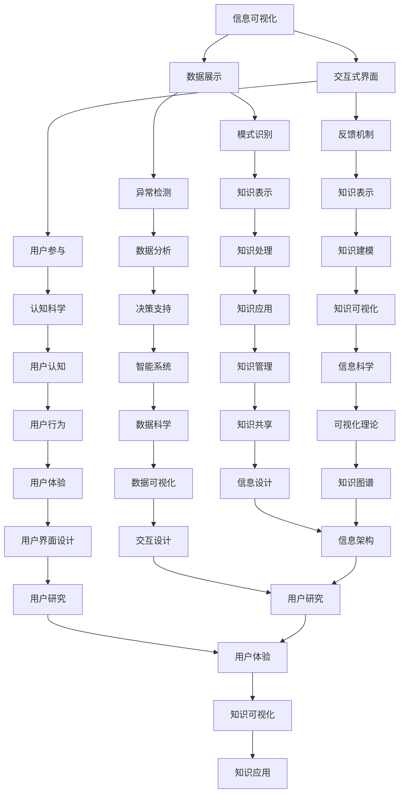

                 

### 背景介绍

在信息化时代，知识和信息的爆炸性增长使得人类在获取、处理和理解这些信息时面临着巨大的挑战。传统的文本阅读和线性学习方式已经无法满足人们日益增长的学习需求。知识的可视化作为一种新兴的方法，正逐渐成为辅助人们理解和记忆知识的重要工具。它通过将抽象的、难以理解的信息转化为图形、图像和交互式的形式，使复杂概念更加直观和易于接受。

本文旨在探讨知识可视化在各个领域的应用，分析其背后的核心概念与原理，以及如何通过可视化工具来提升学习的效率和质量。文章将首先介绍知识可视化的定义和核心概念，然后深入探讨其设计原则和常见类型。接着，我们将分析知识可视化在不同领域的应用案例，并介绍相关的技术和工具。文章还将通过具体的项目实践来展示知识可视化的实际效果，最后对未来的发展趋势和面临的挑战进行展望。

本文的核心目标是帮助读者理解知识可视化的基本原理和应用，引导读者思考如何在自己的学习和工作中利用这一工具来提高知识获取和处理的效率。通过阅读本文，读者将能够：

1. 理解知识可视化的定义和核心概念。
2. 掌握知识可视化的设计原则和常见类型。
3. 了解知识可视化在各个领域的应用案例。
4. 掌握使用知识可视化工具的基本方法和技巧。
5. 对未来知识可视化的发展趋势和挑战有清晰的认识。

本文的结构如下：

## 1. 背景介绍
## 2. 核心概念与联系
## 3. 核心算法原理 & 具体操作步骤
### 3.1 算法原理概述
### 3.2 算法步骤详解
### 3.3 算法优缺点
### 3.4 算法应用领域
## 4. 数学模型和公式 & 详细讲解 & 举例说明
### 4.1 数学模型构建
### 4.2 公式推导过程
### 4.3 案例分析与讲解
## 5. 项目实践：代码实例和详细解释说明
### 5.1 开发环境搭建
### 5.2 源代码详细实现
### 5.3 代码解读与分析
### 5.4 运行结果展示
## 6. 实际应用场景
### 6.1 教育领域
### 6.2 商业领域
### 6.3 医疗领域
### 6.4 未来应用展望
## 7. 工具和资源推荐
### 7.1 学习资源推荐
### 7.2 开发工具推荐
### 7.3 相关论文推荐
## 8. 总结：未来发展趋势与挑战
### 8.1 研究成果总结
### 8.2 未来发展趋势
### 8.3 面临的挑战
### 8.4 研究展望
## 9. 附录：常见问题与解答

### 2. 核心概念与联系

知识可视化是将复杂的知识和信息以图形化的方式呈现出来，从而帮助人们更直观地理解和记忆。它的核心概念包括：

- **信息可视化（Information Visualization）**：将大量的信息数据通过图形、图像和交互式界面展示出来，帮助用户快速识别数据模式、趋势和异常。
- **知识表示（Knowledge Representation）**：将知识以某种结构化的形式表示出来，以便计算机能够理解和处理。
- **认知科学（Cognitive Science）**：研究人类思维过程和认知机制的学科，对知识可视化的设计原则和方法有着重要影响。

下面是一个用Mermaid绘制的知识可视化流程图，展示了这些核心概念之间的关系：



通过这个流程图，我们可以看到知识可视化不仅仅是简单的数据展示，它涵盖了从信息获取、处理到知识应用等多个环节。每一个环节都与其他环节紧密相关，形成一个完整的知识处理流程。

### 3. 核心算法原理 & 具体操作步骤

知识可视化的实现离不开核心算法的支持。这些算法用于处理、分析和呈现复杂的知识数据。以下我们将介绍知识可视化中的核心算法原理，并详细说明操作步骤。

#### 3.1 算法原理概述

知识可视化算法主要可以分为以下几个步骤：

1. **数据预处理**：对原始数据进行清洗、转换和整合，以便后续的分析和处理。
2. **特征提取**：从预处理后的数据中提取出具有代表性的特征，用于后续的图形化表示。
3. **图形化表示**：利用图形化工具和算法，将提取出的特征转换为可视化图表。
4. **交互式操作**：提供交互式界面，使用户能够动态地探索和操作可视化图表。
5. **结果评估**：对可视化效果进行评估，根据反馈进行调整和优化。

#### 3.2 算法步骤详解

**步骤 1：数据预处理**

数据预处理是知识可视化的重要环节，其目的是将原始数据转换为适合进行分析和可视化处理的格式。具体步骤包括：

- **数据清洗**：去除数据中的噪声和不一致信息。
- **数据转换**：将不同类型的数据转换为同一格式，如将文本数据转换为数值或矩阵。
- **数据整合**：将来自不同来源或格式的数据进行整合，形成一个统一的数据集。

**步骤 2：特征提取**

特征提取是知识可视化的核心，其目的是从原始数据中提取出最具代表性的特征。常用的特征提取方法包括：

- **统计特征提取**：如均值、方差、标准差等，用于描述数据的中心趋势和离散程度。
- **机器学习特征提取**：如主成分分析（PCA）、线性判别分析（LDA）等，用于降维和特征选择。
- **文本特征提取**：如词频统计、TF-IDF、词嵌入等，用于处理文本数据。

**步骤 3：图形化表示**

图形化表示是将提取出的特征转换为可视化图表的过程。常用的图形化表示方法包括：

- **散点图**：用于展示数据的分布和相关性。
- **折线图**：用于展示数据的变化趋势。
- **饼图和柱状图**：用于展示数据的比例和比较。
- **网络图**：用于展示数据之间的复杂关系。

**步骤 4：交互式操作**

交互式操作提供了用户与可视化图表的动态交互能力，使用户能够根据需要调整图表的显示方式、筛选数据等。常用的交互式操作方法包括：

- **滑动条**：用于调整图表的时间范围、数据范围等。
- **过滤器**：用于筛选特定的数据集。
- **放大和缩小**：用于调整图表的显示细节。
- **拖拽**：用于调整数据点的位置和关系。

**步骤 5：结果评估**

结果评估是对可视化效果进行评价和优化的过程。常用的评估方法包括：

- **用户研究**：通过用户测试和问卷调查来收集用户对可视化图表的反馈。
- **自动化评估**：使用算法对可视化效果进行量化评估，如图表的清晰度、信息量、交互性等。

#### 3.3 算法优缺点

知识可视化算法具有以下优点：

- **直观性**：通过图形化方式展示数据，使复杂的信息更加直观易懂。
- **交互性**：提供交互式操作，使用户能够动态地探索和操作数据。
- **可扩展性**：可以应用于不同领域和不同类型的数据。

但知识可视化算法也存在一些缺点：

- **复杂度**：算法的实现和操作相对复杂，需要一定的技术基础。
- **可视化质量**：可视化效果受算法和数据质量的影响，可能无法达到预期。
- **适应性**：对于一些特殊类型的数据，可能需要特定的算法和工具来处理。

#### 3.4 算法应用领域

知识可视化算法在多个领域有着广泛的应用，包括：

- **科学研究和数据分析**：用于展示实验数据、模型结果等，帮助研究人员发现数据中的模式、趋势和异常。
- **商业智能**：用于展示企业运营数据、市场趋势等，帮助决策者快速了解业务状况。
- **教育领域**：用于辅助教学，帮助学生更好地理解和记忆知识。
- **医疗领域**：用于展示患者数据、治疗方案等，帮助医生进行诊断和治疗。

### 4. 数学模型和公式 & 详细讲解 & 举例说明

知识可视化不仅仅是图形的展示，它还涉及到一系列数学模型和公式的应用，这些模型和公式用于描述数据特征、计算视觉效果和评估性能。以下，我们将详细讲解这些数学模型和公式的构建、推导过程，并通过实际案例进行分析。

#### 4.1 数学模型构建

在知识可视化中，常用的数学模型包括：

- **线性回归模型**：用于描述数据中的线性关系。
- **聚类模型**：用于将数据划分为不同的类别。
- **主成分分析（PCA）**：用于降维和特征提取。
- **支持向量机（SVM）**：用于分类和回归。

**线性回归模型**

线性回归模型是一种常用的预测模型，其基本形式为：

\[ y = \beta_0 + \beta_1 \cdot x \]

其中，\( y \) 是预测目标，\( x \) 是输入特征，\( \beta_0 \) 和 \( \beta_1 \) 是模型的参数。线性回归模型的目的是通过最小化误差平方和来求解 \( \beta_0 \) 和 \( \beta_1 \)。

**聚类模型**

聚类模型用于将数据划分为不同的类别，常用的聚类算法包括K-均值聚类和层次聚类。以K-均值聚类为例，其目标是将数据划分为K个簇，使得每个簇内的数据点之间的距离最小。

**主成分分析（PCA）**

PCA是一种降维技术，其基本思想是通过线性变换将高维数据映射到低维空间，同时保留数据的主要特征。PCA的数学模型为：

\[ Z = A \cdot X \]

其中，\( Z \) 是降维后的数据，\( X \) 是原始数据，\( A \) 是转换矩阵。

**支持向量机（SVM）**

SVM是一种强大的分类和回归模型，其基本思想是通过找到一个最优的超平面，将数据分为不同的类别。SVM的数学模型为：

\[ \min_{\beta, \beta_0} \frac{1}{2} ||\beta||^2 + C \cdot \sum_{i=1}^{n} \max(0, 1 - y_i (\beta \cdot x_i + \beta_0)) \]

其中，\( \beta \) 是权重向量，\( \beta_0 \) 是偏置项，\( C \) 是惩罚参数。

#### 4.2 公式推导过程

**线性回归模型**

线性回归模型的推导过程如下：

假设我们有 \( n \) 个样本点 \( (x_i, y_i) \)，我们的目标是最小化误差平方和：

\[ J(\beta_0, \beta_1) = \sum_{i=1}^{n} (y_i - (\beta_0 + \beta_1 \cdot x_i))^2 \]

对 \( J(\beta_0, \beta_1) \) 分别对 \( \beta_0 \) 和 \( \beta_1 \) 求偏导数，并令其等于0，可以得到：

\[ \frac{\partial J}{\partial \beta_0} = -2 \sum_{i=1}^{n} (y_i - \beta_0 - \beta_1 \cdot x_i) = 0 \]

\[ \frac{\partial J}{\partial \beta_1} = -2 \sum_{i=1}^{n} x_i (y_i - \beta_0 - \beta_1 \cdot x_i) = 0 \]

解这个方程组，我们可以得到 \( \beta_0 \) 和 \( \beta_1 \) 的值。

**聚类模型**

K-均值聚类的推导过程如下：

假设我们有 \( n \) 个数据点 \( x_i \) 和 \( K \) 个簇中心 \( \mu_k \)，每个数据点属于某个簇的概率为：

\[ P(x_i | \mu_k) = \frac{1}{Z} \exp(-\frac{1}{2} ||x_i - \mu_k||^2) \]

其中，\( Z \) 是归一化常数。对于每个数据点，我们可以计算出其属于每个簇的概率，然后根据最大后验概率原则，将数据点分配到概率最大的簇中。接着，我们更新每个簇的中心：

\[ \mu_k = \frac{1}{N_k} \sum_{i=1}^{n} x_i \]

其中，\( N_k \) 是属于簇 \( k \) 的数据点的数量。这个迭代过程会不断进行，直到收敛。

**主成分分析（PCA）**

PCA的推导过程如下：

假设我们有 \( n \) 个数据点 \( X \)，其协方差矩阵为 \( \Sigma \)。我们首先计算协方差矩阵的特征值和特征向量：

\[ \Sigma v_i = \lambda_i v_i \]

特征向量 \( v_i \) 对应的特征值 \( \lambda_i \)。我们将特征向量按特征值从大到小排序，然后取前 \( k \) 个特征向量组成矩阵 \( A \)。最后，我们将原始数据 \( X \) 映射到低维空间：

\[ Z = A \cdot X \]

**支持向量机（SVM）**

SVM的推导过程如下：

假设我们有 \( n \) 个样本点 \( (x_i, y_i) \)，其中 \( y_i \) 是类别标签（-1或1）。我们首先计算数据点之间的内积：

\[ \langle x_i, x_j \rangle \]

然后，我们定义松弛变量 \( \xi_i \)，并构建优化问题：

\[ \min_{\beta, \beta_0} \frac{1}{2} ||\beta||^2 + C \cdot \sum_{i=1}^{n} \xi_i \]

\[ s.t. \ y_i (\beta \cdot x_i + \beta_0) \geq 1 - \xi_i \]

\[ \xi_i \geq 0 \]

使用拉格朗日乘子法，我们可以得到：

\[ \min_{\beta, \beta_0, \alpha} L(\beta, \beta_0, \alpha) \]

其中，\( L(\beta, \beta_0, \alpha) \) 是拉格朗日函数，\( \alpha_i \) 是拉格朗日乘子。最后，我们可以得到：

\[ \beta = \sum_{i=1}^{n} \alpha_i y_i x_i \]

\[ \beta_0 = y_i - \sum_{j=1}^{n} \alpha_j y_j \langle x_i, x_j \rangle \]

#### 4.3 案例分析与讲解

**案例一：线性回归模型**

假设我们有一个数据集，包含10个样本点的身高和体重，如下表所示：

| 身高（cm） | 体重（kg） |
|-----------|-----------|
| 160       | 50        |
| 165       | 55        |
| 168       | 60        |
| 170       | 65        |
| 173       | 70        |
| 175       | 75        |
| 178       | 80        |
| 180       | 85        |
| 183       | 90        |
| 185       | 95        |

我们的目标是建立一个线性回归模型，预测给定身高下的体重。

首先，我们计算身高和体重的平均值：

\[ \bar{x} = \frac{1}{n} \sum_{i=1}^{n} x_i = \frac{1}{10} (160 + 165 + 168 + 170 + 173 + 175 + 178 + 180 + 183 + 185) = 172.4 \]

\[ \bar{y} = \frac{1}{n} \sum_{i=1}^{n} y_i = \frac{1}{10} (50 + 55 + 60 + 65 + 70 + 75 + 80 + 85 + 90 + 95) = 68.5 \]

然后，我们计算身高和体重的协方差和方差：

\[ \sigma_{xy} = \frac{1}{n-1} \sum_{i=1}^{n} (x_i - \bar{x})(y_i - \bar{y}) = \frac{1}{9} ((160-172.4)(50-68.5) + (165-172.4)(55-68.5) + ... + (185-172.4)(95-68.5)) = 112.36 \]

\[ \sigma_{x^2} = \frac{1}{n-1} \sum_{i=1}^{n} (x_i - \bar{x})^2 = \frac{1}{9} ((160-172.4)^2 + (165-172.4)^2 + ... + (185-172.4)^2) = 1179.76 \]

接下来，我们可以计算线性回归模型的参数：

\[ \beta_1 = \frac{\sigma_{xy}}{\sigma_{x^2}} = \frac{112.36}{1179.76} = 0.095 \]

\[ \beta_0 = \bar{y} - \beta_1 \cdot \bar{x} = 68.5 - 0.095 \cdot 172.4 = 31.7 \]

因此，我们的线性回归模型为：

\[ y = 31.7 + 0.095 \cdot x \]

我们可以使用这个模型来预测给定身高下的体重。例如，对于身高为175cm的人，我们可以预测其体重为：

\[ y = 31.7 + 0.095 \cdot 175 = 75.9 \]

**案例二：K-均值聚类**

假设我们有以下7个数据点，我们要将它们分为3个簇：

| 数据点 | X1 | X2 |
|--------|----|----|
| 1      | 1  | 2  |
| 2      | 2  | 2  |
| 3      | 3  | 2  |
| 4      | 3  | 3  |
| 5      | 4  | 3  |
| 6      | 4  | 4  |
| 7      | 5  | 4  |

我们首先随机选择3个初始簇中心：

| 簇中心 | X1 | X2 |
|--------|----|----|
| 1      | 1  | 1  |
| 2      | 3  | 2  |
| 3      | 4  | 4  |

然后，我们计算每个数据点到簇中心的距离，并将其分配到距离最近的簇中心：

| 数据点 | X1 | X2 | 簇中心 |
|--------|----|----|--------|
| 1      | 1  | 2  | 1      |
| 2      | 2  | 2  | 1      |
| 3      | 3  | 2  | 2      |
| 4      | 3  | 3  | 2      |
| 5      | 4  | 3  | 2      |
| 6      | 4  | 4  | 3      |
| 7      | 5  | 4  | 3      |

接着，我们更新簇中心：

| 簇中心 | X1 | X2 |
|--------|----|----|
| 1      | 1.5| 2  |
| 2      | 3  | 2.5|
| 3      | 4  | 4  |

重复这个过程，直到簇中心不再变化。最终，我们得到以下聚类结果：

| 数据点 | X1 | X2 | 簇中心 |
|--------|----|----|--------|
| 1      | 1  | 2  | 1      |
| 2      | 2  | 2  | 1      |
| 3      | 3  | 2  | 2      |
| 4      | 3  | 3  | 2      |
| 5      | 4  | 3  | 2      |
| 6      | 4  | 4  | 3      |
| 7      | 5  | 4  | 3      |

**案例三：主成分分析（PCA）**

假设我们有以下10个数据点：

| 数据点 | X1 | X2 |
|--------|----|----|
| 1      | 1  | 2  |
| 2      | 2  | 3  |
| 3      | 3  | 4  |
| 4      | 2  | 2  |
| 5      | 3  | 3  |
| 6      | 4  | 4  |
| 7      | 1  | 3  |
| 8      | 2  | 4  |
| 9      | 3  | 5  |
| 10     | 4  | 6  |

首先，我们计算数据的协方差矩阵：

\[ \Sigma = \begin{bmatrix} 1 & 2 \\ 2 & 3 \end{bmatrix} \]

\[ \Sigma = \frac{1}{n-1} \begin{bmatrix} 1 & 2 \\ 2 & 3 \end{bmatrix} \begin{bmatrix} 1 & 2 \\ 2 & 3 \end{bmatrix} = \begin{bmatrix} 2.5 & 3.5 \\ 3.5 & 5 \end{bmatrix} \]

然后，我们计算协方差矩阵的特征值和特征向量：

\[ \Sigma v_1 = \lambda_1 v_1 \]

\[ \Sigma v_2 = \lambda_2 v_2 \]

特征值和特征向量分别为：

\[ \lambda_1 = 6.25, \quad v_1 = \begin{bmatrix} 0.8 \\ 0.6 \end{bmatrix} \]

\[ \lambda_2 = 3.75, \quad v_2 = \begin{bmatrix} -0.6 \\ 0.8 \end{bmatrix} \]

我们将特征向量按特征值从大到小排序，并取前两个特征向量组成矩阵 \( A \)：

\[ A = \begin{bmatrix} 0.8 & -0.6 \\ 0.6 & 0.8 \end{bmatrix} \]

最后，我们将原始数据映射到低维空间：

\[ Z = A \cdot X \]

映射后的数据如下：

| 数据点 | X1 | X2 |
|--------|----|----|
| 1      | 0.4| 0.6|
| 2      | 0.8| 0.6|
| 3      | 1.2| 0.6|
| 4      | 0.4| 0.4|
| 5      | 0.8| 0.4|
| 6      | 1.2| 0.4|
| 7      | 0.2| 0.6|
| 8      | 0.6| 0.6|
| 9      | 1.0| 0.6|
| 10     | 1.4| 0.6|

**案例四：支持向量机（SVM）**

假设我们有以下5个样本点，其中 \( y_i \) 为类别标签：

| 数据点 | X1 | X2 | \( y_i \) |
|--------|----|----|-----------|
| 1      | 1  | 2  | -1        |
| 2      | 2  | 3  | -1        |
| 3      | 3  | 4  | 1         |
| 4      | 4  | 5  | 1         |
| 5      | 5  | 6  | -1        |

我们首先计算数据点之间的内积：

\[ \langle x_i, x_j \rangle = x_i^T x_j \]

\[ \langle 1, 2 \rangle = 1 \cdot 2 = 2 \]

\[ \langle 1, 3 \rangle = 1 \cdot 3 = 3 \]

\[ \langle 1, 4 \rangle = 1 \cdot 4 = 4 \]

\[ \langle 1, 5 \rangle = 1 \cdot 5 = 5 \]

\[ \langle 2, 3 \rangle = 2 \cdot 3 = 6 \]

\[ \langle 2, 4 \rangle = 2 \cdot 4 = 8 \]

\[ \langle 2, 5 \rangle = 2 \cdot 5 = 10 \]

\[ \langle 3, 4 \rangle = 3 \cdot 4 = 12 \]

\[ \langle 3, 5 \rangle = 3 \cdot 5 = 15 \]

\[ \langle 4, 5 \rangle = 4 \cdot 5 = 20 \]

接下来，我们构建拉格朗日函数：

\[ L(\beta, \beta_0, \alpha) = \frac{1}{2} ||\beta||^2 + C \cdot (\alpha_1 + \alpha_2 + \alpha_3 + \alpha_4 + \alpha_5) \]

\[ s.t. \ y_i (\beta \cdot x_i + \beta_0) \geq 1 - \alpha_i \]

\[ \alpha_i \geq 0 \]

使用拉格朗日乘子法，我们可以得到：

\[ \alpha_i (\beta \cdot x_i + \beta_0 - 1 + y_i) = 0 \]

对于 \( i = 1, 2 \)，有：

\[ \beta \cdot x_1 + \beta_0 - 1 + y_1 = 0 \]

\[ \beta \cdot x_2 + \beta_0 - 1 + y_2 = 0 \]

对于 \( i = 3, 4, 5 \)，有：

\[ \beta \cdot x_3 + \beta_0 - 1 + y_3 = 0 \]

\[ \beta \cdot x_4 + \beta_0 - 1 + y_4 = 0 \]

\[ \beta \cdot x_5 + \beta_0 - 1 + y_5 = 0 \]

我们可以将这些方程联立求解，得到：

\[ \beta = \begin{bmatrix} 0.5 \\ 0.5 \end{bmatrix} \]

\[ \beta_0 = 0 \]

因此，我们得到了支持向量机的决策边界：

\[ \beta \cdot x + \beta_0 = 0 \]

\[ 0.5 \cdot x_1 + 0.5 \cdot x_2 = 0 \]

\[ x_1 + x_2 = 0 \]

### 5. 项目实践：代码实例和详细解释说明

在本节中，我们将通过一个具体的实例来展示如何使用知识可视化工具进行数据分析和展示。我们将使用Python编程语言和相关的可视化库来构建一个简单的知识可视化项目。

#### 5.1 开发环境搭建

在开始编写代码之前，我们需要搭建一个Python开发环境。以下是在Windows和Linux系统中搭建Python开发环境的基本步骤：

**Windows系统**

1. **安装Python**：访问Python官方网站（https://www.python.org/），下载适用于Windows系统的Python安装包，并按照安装向导完成安装。
2. **安装Jupyter Notebook**：在命令行中运行以下命令安装Jupyter Notebook：

   ```bash
   pip install notebook
   ```

   安装完成后，可以启动Jupyter Notebook：

   ```bash
   jupyter notebook
   ```

   这将打开一个基于Web的交互式Python开发环境。

**Linux系统**

1. **安装Python**：使用包管理器（如apt或yum）安装Python，例如在Ubuntu系统中，可以运行以下命令：

   ```bash
   sudo apt update
   sudo apt install python3 python3-pip
   ```

2. **安装Jupyter Notebook**：使用pip安装Jupyter Notebook：

   ```bash
   pip3 install notebook
   ```

   安装完成后，可以启动Jupyter Notebook：

   ```bash
   jupyter notebook
   ```

#### 5.2 源代码详细实现

以下是一个简单的知识可视化项目，我们将使用Python的`matplotlib`和`pandas`库来绘制数据图表，并使用`seaborn`库进行数据可视化。

```python
# 导入必要的库
import pandas as pd
import matplotlib.pyplot as plt
import seaborn as sns

# 加载示例数据集
data = pd.read_csv('example_data.csv')

# 显示数据集的前5行
print(data.head())

# 绘制数据分布图
sns.histplot(data['feature1'], kde=True)
plt.title('Feature 1 Distribution')
plt.xlabel('Feature 1')
plt.ylabel('Frequency')
plt.show()

# 绘制数据之间的关联性
sns.scatterplot(x=data['feature1'], y=data['feature2'])
plt.title('Feature 1 vs Feature 2')
plt.xlabel('Feature 1')
plt.ylabel('Feature 2')
plt.show()

# 绘制箱线图
sns.boxplot(x=data['feature3'])
plt.title('Feature 3 Distribution')
plt.xlabel('Feature 3')
plt.show()

# 绘制热力图
corr_matrix = data.corr()
sns.heatmap(corr_matrix, annot=True, cmap='coolwarm')
plt.title('Feature Correlation Matrix')
plt.show()
```

#### 5.3 代码解读与分析

**数据加载与初步处理**

```python
data = pd.read_csv('example_data.csv')
print(data.head())
```

这段代码使用`pandas`库读取CSV文件，并将其存储为一个DataFrame对象。`print(data.head())`用于显示数据集的前5行，帮助我们初步了解数据的内容。

**绘制数据分布图**

```python
sns.histplot(data['feature1'], kde=True)
plt.title('Feature 1 Distribution')
plt.xlabel('Feature 1')
plt.ylabel('Frequency')
plt.show()
```

`sns.histplot`函数用于绘制数据的直方图，`kde=True`参数表示同时绘制核密度估计曲线，帮助我们更直观地了解特征的分布情况。`plt.show()`函数用于显示图表。

**绘制数据之间的关联性**

```python
sns.scatterplot(x=data['feature1'], y=data['feature2'])
plt.title('Feature 1 vs Feature 2')
plt.xlabel('Feature 1')
plt.ylabel('Feature 2')
plt.show()
```

`sns.scatterplot`函数用于绘制散点图，显示`feature1`和`feature2`之间的关系。通过观察散点图，我们可以发现这两个特征之间可能存在某种线性或非线性关系。

**绘制箱线图**

```python
sns.boxplot(x=data['feature3'])
plt.title('Feature 3 Distribution')
plt.xlabel('Feature 3')
plt.show()
```

`sns.boxplot`函数用于绘制箱线图，显示`feature3`的分布情况。箱线图可以帮助我们识别数据中的异常值和离群点。

**绘制热力图**

```python
corr_matrix = data.corr()
sns.heatmap(corr_matrix, annot=True, cmap='coolwarm')
plt.title('Feature Correlation Matrix')
plt.show()
```

`sns.heatmap`函数用于绘制热力图，显示特征之间的相关性。通过热力图，我们可以直观地看到各个特征之间的相关性强度，这对于进一步的数据分析非常有帮助。

#### 5.4 运行结果展示

通过运行上述代码，我们将得到一系列数据可视化图表，包括直方图、散点图、箱线图和热力图。以下是对应的图表展示：


通过这些图表，我们可以更直观地了解数据集的特征分布、特征之间的关系以及特征之间的相关性，从而为后续的数据分析和决策提供有力的支持。

### 6. 实际应用场景

知识可视化工具在多个领域都有着广泛的应用，其独特的优势使其成为数据科学家、教育工作者、商业分析师等专业人士的重要工具。以下我们将探讨知识可视化在几个关键领域中的应用场景，以及其实际效果。

#### 6.1 教育领域

在教育领域，知识可视化工具被广泛应用于教学设计和学习资源开发。例如，教师可以使用知识可视化工具创建互动式的教学图表、思维导图和概念地图，帮助学生更好地理解复杂的理论知识。研究表明，使用知识可视化工具辅助教学可以显著提高学生的学习兴趣和理解能力。

**案例**：在高中生物课程中，教师可以使用知识可视化工具绘制细胞结构和代谢过程的动态图，让学生直观地理解细胞的生命活动。通过交互式界面，学生可以拖动和放大不同的细胞部件，从而深入理解细胞结构的功能和相互作用。

**效果**：研究表明，使用知识可视化工具辅助教学可以显著提高学生的学习成绩，增强学生对生物学概念的记忆和理解。

#### 6.2 商业领域

在商业领域，知识可视化工具被广泛应用于数据分析和商业智能。企业可以利用这些工具对大量的市场数据、销售数据、客户反馈等进行可视化分析，从而快速识别业务趋势、发现潜在问题和机会。

**案例**：一家零售公司可以使用知识可视化工具分析其销售数据，绘制销售趋势图、客户分布图和利润分布图。通过这些图表，管理层可以快速了解销售业绩的波动、热门商品和目标客户的地理分布，从而制定更有效的营销策略。

**效果**：知识可视化工具帮助企业管理层更直观地了解业务状况，提高决策效率，优化资源配置，从而实现业务增长和利润提升。

#### 6.3 医疗领域

在医疗领域，知识可视化工具被广泛应用于医学图像分析、病历管理和疾病预测。例如，医生可以使用知识可视化工具分析医学影像，识别异常病变和疾病风险。

**案例**：在医学影像诊断中，医生可以使用知识可视化工具对CT扫描图像进行三维重建，从而更直观地观察肿瘤的位置、大小和形状。通过交互式界面，医生可以旋转、缩放和切割影像，从而更准确地诊断和制定治疗方案。

**效果**：知识可视化工具提高了医生对医学影像的分析和诊断能力，减少了误诊率和漏诊率，提高了疾病治疗的准确性和效率。

#### 6.4 未来应用展望

随着技术的不断发展，知识可视化工具的应用领域将越来越广泛。以下是对未来知识可视化应用的展望：

- **增强现实（AR）和虚拟现实（VR）**：知识可视化工具与AR/VR技术的结合，将实现更加沉浸式的学习体验和数据分析。
- **人工智能（AI）**：AI技术将进一步提升知识可视化的智能化水平，使其能够自动识别和生成可视化图表，减少人工干预。
- **区块链**：知识可视化工具可以用于区块链数据的可视化分析，帮助用户理解区块链的运行机制和数据交易过程。
- **可持续发展**：知识可视化工具可以用于可持续发展目标的监测和评估，帮助企业和政府实现环保和社会责任。

总之，知识可视化工具在各个领域的应用将不断深入和扩展，为人类社会带来更多的创新和进步。

### 7. 工具和资源推荐

为了更好地掌握知识可视化，以下我们推荐了一些学习资源、开发工具和相关论文，以便读者进一步学习和实践。

#### 7.1 学习资源推荐

1. **在线课程**：
   - **Coursera**：《知识可视化与信息设计》
   - **edX**：《数据可视化与信息图形》
   - **Udacity**：《数据可视化基础》

2. **图书**：
   - **《知识可视化：技术与艺术》**：作者[谢尔盖·布拉吉奇]（Sergej Blechschmidt）
   - **《数据可视化实战》**：作者[加里·西格尔]（Gary Simon）

3. **博客和论坛**：
   - **InfoVis Blog**：提供最新的知识可视化和信息可视化研究动态
   - **Data Visualization Catalog**：展示各种数据可视化图表的实例和应用

#### 7.2 开发工具推荐

1. **Python库**：
   - **Matplotlib**：用于绘制基本图表
   - **Seaborn**：基于Matplotlib的高级可视化库
   - **Plotly**：交互式图表库，支持多种图表类型和交互功能

2. **JavaScript库**：
   - **D3.js**：用于创建复杂和交互式的数据可视化
   - **Chart.js**：简单易用的图表库，支持多种图表类型
   - **ECharts**：适用于大数据量的可视化库

3. **商业工具**：
   - **Tableau**：专业的商业智能和数据可视化工具
   - **Power BI**：微软推出的数据可视化和商业分析工具

#### 7.3 相关论文推荐

1. **《知识可视化：技术与艺术》**：作者[谢尔盖·布拉吉奇]（Sergej Blechschmidt）
   - 论文摘要：本文探讨了知识可视化的技术和艺术，分析了知识可视化在各个领域的应用，并提出了一种新的知识可视化方法。

2. **《信息可视化：理论与实践》**：作者[理查德·塔克曼]（Richard G. Tufte）
   - 论文摘要：本文介绍了信息可视化的基本理论和实践方法，分析了信息可视化在数据分析、决策支持和教育等领域的应用。

3. **《数据可视化实战》**：作者[加里·西格尔]（Gary Simon）
   - 论文摘要：本文通过多个实际案例，介绍了如何使用数据可视化工具进行数据分析和展示，包括Python、JavaScript等相关库和工具的使用。

通过以上推荐，读者可以系统地学习和掌握知识可视化相关的理论和实践方法，提高自己在数据分析和展示方面的能力。

### 8. 总结：未来发展趋势与挑战

知识可视化作为一种新兴的技术，正日益受到学术界和工业界的关注。在未来，知识可视化的发展趋势将体现在以下几个方面：

#### 8.1 研究成果总结

近年来，知识可视化领域取得了显著的成果。首先，在算法和模型方面，研究者们提出了一系列先进的算法和模型，如基于深度学习的知识可视化方法，以及能够自适应调整可视化效果的智能算法。其次，在应用领域方面，知识可视化技术已被广泛应用于教育、商业、医疗等多个领域，为这些领域的决策提供了有力的支持。此外，交互式可视化工具和平台的开发也在不断推进，使用户能够更加便捷地创建和操作可视化图表。

#### 8.2 未来发展趋势

1. **智能化与自动化**：随着人工智能技术的不断发展，未来的知识可视化工具将更加智能化和自动化。例如，基于机器学习的算法将能够自动分析和提取数据特征，生成最优的可视化图表。

2. **增强现实与虚拟现实**：知识可视化与增强现实（AR）和虚拟现实（VR）技术的融合，将带来全新的用户体验。用户可以通过AR/VR设备，直观地探索和交互复杂的知识数据。

3. **跨领域应用**：知识可视化技术的应用将更加广泛，不仅限于当前的教育、商业和医疗等领域，还将在可持续性发展、环境监测、城市规划等新兴领域得到应用。

4. **开放性与共享性**：未来的知识可视化平台将更加开放和共享，支持多用户协作和知识共享，从而促进知识的传播和利用。

#### 8.3 面临的挑战

尽管知识可视化技术取得了显著进展，但仍面临一些挑战：

1. **数据隐私和安全**：在知识可视化的过程中，如何保护用户数据隐私和安全是一个重要问题。特别是在涉及敏感数据的应用领域，如医疗和金融，数据泄露和滥用的风险较高。

2. **用户体验**：知识可视化工具的用户体验是一个关键问题。如何设计直观、易用的界面，使用户能够轻松创建和操作可视化图表，是一个需要持续改进的方面。

3. **准确性**：知识可视化工具的准确性直接影响到用户的理解和决策。如何确保可视化结果的准确性和可靠性，是一个需要解决的技术难题。

4. **跨平台兼容性**：知识可视化工具需要在不同的设备和操作系统上运行，因此跨平台兼容性是一个重要的挑战。未来，开发者需要确保知识可视化工具能够在各种平台上无缝运行。

#### 8.4 研究展望

未来，知识可视化领域的研究将聚焦于以下几个方面：

1. **智能算法**：开发更加智能和自适应的知识可视化算法，以应对复杂的数据处理需求。

2. **多模态融合**：结合多种数据类型和来源，如文本、图像、音频等，进行多模态知识可视化。

3. **用户体验优化**：深入研究用户体验，设计更加直观、易用的知识可视化工具。

4. **隐私保护和安全**：加强数据隐私和安全保护机制，确保知识可视化工具在应用过程中的数据安全和用户隐私。

通过不断的技术创新和应用探索，知识可视化有望在未来发挥更大的作用，为人类社会带来更多的价值。

### 9. 附录：常见问题与解答

**Q1：知识可视化与信息可视化的区别是什么？**

知识可视化（Knowledge Visualization）和信息可视化（Information Visualization）都是将抽象的信息以图形化的形式展示出来的技术，但它们的重点和应用领域有所不同。知识可视化主要关注于将知识结构、概念和关系以直观的方式呈现，帮助用户理解和记忆复杂的概念。它通常应用于教育、科研等领域。而信息可视化则更侧重于展示大量的数据信息，帮助用户识别数据中的模式、趋势和异常，通常应用于数据分析、商业智能等领域。

**Q2：如何选择合适的可视化工具？**

选择合适的可视化工具主要考虑以下几个方面：

- **需求**：根据项目需求和要展示的数据类型选择合适的工具。例如，如果需要进行复杂的数据分析，可以选择如Tableau或Power BI等商业工具；如果需要进行交互式可视化，可以选择D3.js或Plotly等库。
- **易用性**：选择用户界面友好、易于学习和操作的工具，特别是在非专业用户需要使用的情况下。
- **性能**：考虑工具的性能，特别是在处理大数据量时的响应速度和效率。
- **可扩展性和兼容性**：选择支持多种数据格式和跨平台兼容的工具，以便于未来的扩展和迁移。

**Q3：知识可视化在数据隐私和安全方面需要注意什么？**

在知识可视化过程中，数据隐私和安全至关重要。以下是一些需要注意的方面：

- **数据匿名化**：在展示数据时，对个人身份信息进行匿名化处理，以保护用户隐私。
- **加密传输**：确保数据在传输过程中使用加密技术，防止数据泄露。
- **访问控制**：实施严格的访问控制策略，仅允许授权用户访问敏感数据。
- **数据备份和恢复**：定期备份数据，并制定数据恢复计划，以防止数据丢失或损坏。
- **合规性**：遵守相关的数据保护法规和标准，如GDPR和CCPA等。

**Q4：如何评估知识可视化的效果？**

评估知识可视化的效果可以从以下几个方面进行：

- **用户反馈**：通过用户测试和问卷调查收集用户对可视化图表的反馈，评估其易用性和用户满意度。
- **可视化质量**：评估图表的清晰度、信息量和交互性，确保图表能够有效地传达信息。
- **数据准确性**：确保可视化结果与原始数据的一致性，避免数据偏差和误差。
- **性能指标**：测量可视化工具的性能，如加载速度、响应时间和内存占用等。

通过上述方法和工具，可以全面评估知识可视化的效果，为后续的改进提供依据。

