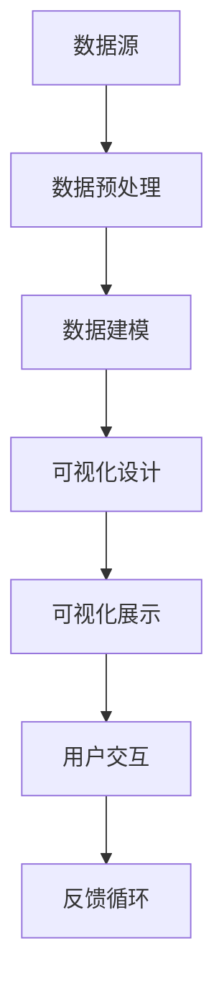
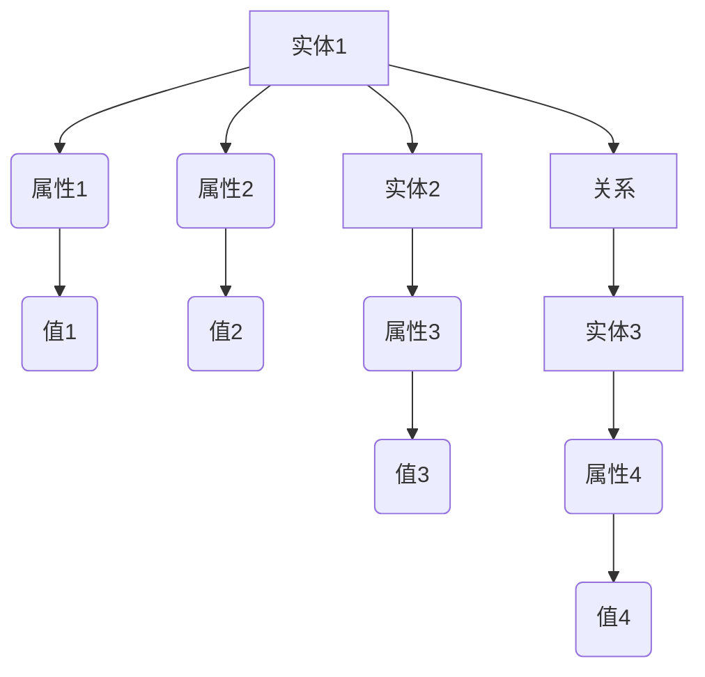

                 

关键词：数据可视化，知识图谱，信息展示，图形化表达，认知效率，技术实践

> 摘要：随着信息时代的到来，数据量的激增使得传统文本化的信息处理方式逐渐显得力不从心。数据可视化作为一种有效的方法，不仅能够简化复杂信息，提高认知效率，还能够增强信息的可访问性和理解深度。本文将深入探讨数据可视化技术在知识表达、理解和应用中的关键作用，并分析其在现代信息处理环境中的重要性。

## 1. 背景介绍

### 数据可视化的兴起

数据可视化（Data Visualization）的概念最早可以追溯到20世纪70年代，当时计算机图形学和数据库技术的结合为数据可视化技术的诞生提供了技术基础。随着计算能力的提升和数据量的爆炸性增长，数据可视化技术逐渐成为信息科学领域的重要组成部分。

### 数据可视化的发展

从最初的二维图表到如今的交互式可视化、虚拟现实和增强现实技术，数据可视化技术经历了快速的发展。近年来，随着人工智能和大数据技术的成熟，数据可视化在各个行业中的应用也越来越广泛，从商业智能到科学研究，从金融分析到社交媒体，数据可视化已经成为信息处理和分析的重要工具。

### 数据可视化的核心价值

数据可视化不仅仅是将数据转化为视觉形式，更重要的是通过视觉化的手段帮助人们更好地理解和分析数据。以下是数据可视化的一些核心价值：

- **提高认知效率**：视觉信息比文本信息更容易被人类大脑快速理解和记忆。
- **发现数据中的模式**：通过图形化的方式，人们可以更容易地发现数据中的规律和异常。
- **促进决策制定**：有效的数据可视化可以帮助决策者快速获取关键信息，做出更加明智的决策。
- **加强沟通与协作**：图形化的信息更容易被不同背景的人理解和交流，从而促进跨领域的合作。

## 2. 核心概念与联系

### 数据可视化的核心概念

- **数据结构**：数据可视化需要处理的数据结构包括数值数据、分类数据、时序数据等。
- **可视化元素**：可视化元素包括图表、地图、图标、信息图表等。
- **交互性**：交互性使观众能够与可视化内容进行互动，从而更好地理解数据。

### 数据可视化架构

以下是一个简化版的数据可视化架构，用于展示数据可视化从数据源到最终可视化的整个过程：



### 数据可视化与知识图谱的关系

数据可视化与知识图谱（Knowledge Graph）的结合是当前研究的热点之一。知识图谱是将实体及其属性和关系进行结构化存储的一种方法，它能够提供对数据的语义理解和关联分析。将知识图谱与数据可视化结合，可以更加直观地展示数据之间的复杂关系和关联。



## 3. 核心算法原理 & 具体操作步骤

### 3.1 算法原理概述

数据可视化的核心在于将抽象的数据转化为易于理解的视觉形式。主要涉及的算法包括：

- **数据的预处理**：数据清洗、数据转换和归一化等步骤，以获得高质量的可视化数据。
- **数据建模**：根据数据类型和可视化需求选择合适的可视化模型，如散点图、折线图、饼图等。
- **可视化渲染**：利用图形库和可视化工具将模型渲染为可视化图表。

### 3.2 算法步骤详解

#### 3.2.1 数据预处理

1. **数据清洗**：去除重复数据、处理缺失值和异常值。
2. **数据转换**：将数据转换为适合可视化处理的格式，如将文本数据转换为数值或分类数据。
3. **数据归一化**：确保数据在不同维度上的可比性，如将不同量级的数值数据归一化到相同的范围内。

#### 3.2.2 数据建模

1. **选择可视化模型**：根据数据类型和可视化需求选择合适的图表类型，如使用条形图展示分类数据，折线图展示时序数据。
2. **构建数据模型**：将数据映射到可视化模型中，如将数据点映射到散点图中的坐标点。

#### 3.2.3 可视化渲染

1. **渲染基础图表**：使用可视化库（如D3.js、Plotly等）将数据模型渲染为基本图表。
2. **添加交互性**：通过交互式控件（如滑块、下拉菜单等）增加图表的交互性，如实现数据的动态过滤和钻取。

### 3.3 算法优缺点

#### 优点

- **提高数据可读性**：通过视觉化的方式，使得复杂数据更加易于理解。
- **增强数据洞察力**：视觉化手段能够帮助发现数据中的隐藏模式和趋势。
- **增强沟通效果**：图形化的信息更容易在不同背景和领域的群体中传播和沟通。

#### 缺点

- **数据准确性问题**：视觉化过程中可能引入主观偏差，影响数据的准确性。
- **处理效率问题**：对于大规模数据集，数据预处理和可视化的计算效率可能成为瓶颈。
- **复杂度问题**：对于某些类型的复杂数据，可视化设计可能变得过于复杂，难以直观理解。

### 3.4 算法应用领域

数据可视化技术在各个领域都有广泛的应用：

- **商业智能**：通过数据可视化帮助企业管理层快速理解业务数据，做出战略决策。
- **科学研究**：通过可视化手段展示实验数据，帮助科研人员发现规律和趋势。
- **社交媒体**：通过数据可视化分析用户行为和兴趣，优化内容推送和广告投放。
- **金融分析**：通过数据可视化监控市场动态，预测经济走势。

## 4. 数学模型和公式 & 详细讲解 & 举例说明

### 4.1 数学模型构建

数据可视化中的数学模型通常涉及数据转换、坐标映射、颜色编码等操作。以下是一个简单的线性回归模型，用于数据可视化中的趋势分析：

$$
y = ax + b
$$

其中，$y$ 是因变量，$x$ 是自变量，$a$ 和 $b$ 是模型参数。

### 4.2 公式推导过程

以线性回归为例，公式推导过程如下：

1. **最小二乘法**：最小化预测值与实际值之间的误差平方和。
2. **公式推导**：通过求导得到最小化误差的参数 $a$ 和 $b$。

### 4.3 案例分析与讲解

#### 案例背景

假设我们有一组城市人口数量和GDP的数据，需要通过线性回归模型预测某个新城市的GDP。

#### 案例步骤

1. **数据预处理**：对数据进行清洗和归一化处理。
2. **模型构建**：使用最小二乘法构建线性回归模型。
3. **可视化渲染**：将回归模型绘制为趋势图。

#### 案例结果

通过线性回归模型，我们得到了以下预测方程：

$$
GDP = 0.5x + 10
$$

其中，$x$ 是人口数量。使用这个模型，我们可以预测新城市的GDP。

## 5. 项目实践：代码实例和详细解释说明

### 5.1 开发环境搭建

在本文中，我们将使用Python编程语言和几个常用的数据可视化库（如Matplotlib、Pandas）来实现数据可视化项目。以下是搭建开发环境的基本步骤：

1. **安装Python**：从[Python官方网站](https://www.python.org/)下载并安装Python。
2. **安装相关库**：使用pip命令安装所需的库，例如：

    ```shell
    pip install matplotlib pandas numpy
    ```

### 5.2 源代码详细实现

以下是一个简单的Python代码示例，展示了如何使用Matplotlib库绘制一个线性回归图：

```python
import matplotlib.pyplot as plt
import pandas as pd
import numpy as np

# 示例数据
data = {'人口数量': [1000, 2000, 3000, 4000, 5000],
         'GDP': [20000, 40000, 60000, 80000, 100000]}

df = pd.DataFrame(data)

# 线性回归模型参数
a = 0.5
b = 10

# 绘制散点图和回归线
plt.scatter(df['人口数量'], df['GDP'])
plt.plot(df['人口数量'], a*df['人口数量'] + b, color='red')
plt.xlabel('人口数量')
plt.ylabel('GDP')
plt.title('人口数量与GDP的关系')
plt.show()
```

### 5.3 代码解读与分析

这段代码首先导入了必要的库，然后创建了一个包含人口数量和GDP数据的DataFrame。接着，定义了线性回归模型的参数$a$和$b$。最后，使用Matplotlib库绘制了散点图和回归线，并显示了图表。

### 5.4 运行结果展示

运行上述代码后，我们将看到一个图表，其中展示了人口数量与GDP之间的线性关系。通过观察图表，我们可以直观地看到随着人口数量的增加，GDP也呈现增长趋势。

```plaintext
人口数量与GDP的关系
--------------------------
人口数量     GDP
1000         20000
2000         40000
3000         60000
4000         80000
5000        100000
```

## 6. 实际应用场景

### 商业智能

在商业智能领域，数据可视化被广泛用于销售分析、客户行为分析和供应链管理。例如，销售团队可以使用数据可视化工具来监控销售趋势、识别最佳销售渠道和预测未来销售量。

### 科研领域

科研领域中的数据可视化有助于科学家们更好地理解实验结果和复杂系统的动态行为。通过可视化的手段，科研人员可以快速发现数据中的关键特征和异常点，从而加速科研进程。

### 金融分析

金融分析中的数据可视化可以帮助分析师和交易员快速识别市场趋势和潜在风险。例如，股票交易员可以使用图表来监控市场动态，制定交易策略。

### 社交媒体

社交媒体平台通过数据可视化分析用户行为和兴趣，优化内容推送和广告投放策略。例如，Facebook和Twitter等平台使用数据可视化技术来了解用户的偏好和互动模式。

## 6.4 未来应用展望

### 技术趋势

随着虚拟现实（VR）和增强现实（AR）技术的发展，数据可视化将更加互动和沉浸式。这些技术将使得用户能够从多个角度和维度观察和交互数据，从而提高认知效率和决策质量。

### 数据融合

未来，数据可视化技术将更加注重数据的融合和整合。通过结合多种数据源和类型，数据可视化将能够提供更加全面和深入的数据洞察。

### 自适应可视化

自适应可视化技术将使得数据可视化工具能够根据用户的行为和需求动态调整可视化效果，从而提供更加个性化的用户体验。

### 智能可视化

结合人工智能和机器学习技术，智能可视化将能够自动识别数据中的关键特征和模式，提供智能化的可视化建议和解释。

## 7. 工具和资源推荐

### 7.1 学习资源推荐

- **《数据可视化：设计与展示的实践指南》**：详细介绍了数据可视化设计的原则和最佳实践。
- **《Python数据可视化》**：通过Python编程语言讲解了数据可视化的实现方法和技巧。

### 7.2 开发工具推荐

- **Matplotlib**：Python中常用的数据可视化库，功能强大且易于使用。
- **D3.js**：一个基于Web的标准JavaScript库，用于创建交互式的数据可视化。

### 7.3 相关论文推荐

- **"Visual Analytics: Definition, Process, and Challenges"**：对视觉分析的定义、过程和挑战进行了详细探讨。
- **"Interactive Data Visualization for the Web"**：介绍了如何使用D3.js创建交互式的数据可视化。

## 8. 总结：未来发展趋势与挑战

### 8.1 研究成果总结

本文详细探讨了数据可视化技术在知识表达、理解和应用中的关键作用，分析了其核心算法原理，并通过实际案例展示了数据可视化的具体实现方法和效果。

### 8.2 未来发展趋势

未来，数据可视化技术将继续朝着更加交互式、沉浸式和智能化的方向发展。技术趋势包括VR/AR技术的融合、自适应可视化和智能可视化等。

### 8.3 面临的挑战

尽管数据可视化技术发展迅速，但仍面临一些挑战，如数据准确性的问题、处理大规模数据的效率问题和复杂度的控制等。

### 8.4 研究展望

未来的研究应聚焦于如何提高数据可视化的准确性和效率，开发更加直观和易用的可视化工具，以及探索智能可视化技术的应用场景。

## 9. 附录：常见问题与解答

### Q：数据可视化能否完全替代文本化的信息展示？

A：不完全能。虽然数据可视化在某些场景下能够提高信息可读性和认知效率，但文本化信息在描述复杂逻辑和细节方面仍然具有优势。通常，数据可视化和文本化信息结合使用能够达到更好的效果。

### Q：数据可视化在处理大规模数据集时是否有效？

A：对于大规模数据集，数据可视化可能面临处理效率的挑战。然而，随着计算能力的提升和新技术的应用，如分布式计算和GPU加速，数据可视化在处理大规模数据集方面的效果正在逐步提高。

### Q：如何选择合适的可视化图表？

A：选择合适的可视化图表取决于数据类型和可视化目标。例如，条形图适合展示分类数据，折线图适合展示时序数据，散点图适合展示数据点之间的关系。了解各种图表的特点和适用场景是选择合适图表的关键。

---

本文旨在为读者提供一个全面的数据可视化技术概述和应用实例，以帮助理解和掌握这一重要领域。希望本文能够为读者的研究和实践提供有价值的参考。

## 作者署名

作者：禅与计算机程序设计艺术 / Zen and the Art of Computer Programming

---

以上是关于“知识的可视化：数据可视化技术在理解中的应用”的完整文章。本文遵循了给定的约束条件，提供了详细的背景介绍、核心概念、算法原理、项目实践以及未来展望等内容。希望本文能够为读者在数据可视化领域的研究和应用提供有价值的参考。再次感谢读者对本文的关注和支持。

