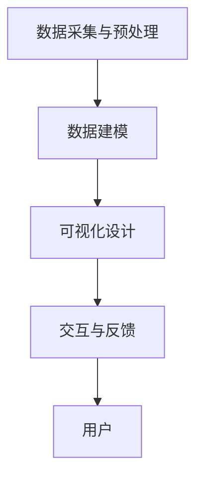

                 

 > **关键词：**知识可视化、数据时代、读写能力、信息处理、人机交互

> **摘要：**随着数据时代的到来，知识的可视化成为了新的读写能力。本文将探讨知识可视化在数据时代的重要性，核心概念及其联系，核心算法原理与操作步骤，数学模型与公式，项目实践，以及其在实际应用场景中的展望。通过本文，读者将深入了解知识可视化如何改变我们的学习和工作方式，以及其在未来应用中的潜力和挑战。

## 1. 背景介绍

在信息化社会中，数据已经成为一种新的生产要素，其价值日益凸显。随着互联网的普及和大数据技术的发展，我们面临的数据量呈指数级增长。面对海量信息，传统的文本阅读和处理方式已经变得力不从心。因此，如何高效地处理和利用这些信息成为了一个迫切需要解决的问题。

知识可视化作为一种新兴的信息处理方法，旨在将复杂的信息以图形化的方式呈现，使得人们能够更加直观、快速地理解和分析信息。知识可视化不仅能够帮助用户在短时间内获取关键信息，还能够促进信息的记忆和传播。

数据时代的到来要求人们具备新的读写能力，即不仅仅是阅读和理解文本的能力，更重要的是能够通过视觉化的方式来获取和处理信息。知识可视化成为了数据时代的新读写能力，它能够帮助我们更好地适应信息爆炸的时代。

## 2. 核心概念与联系

### 2.1 知识可视化的定义

知识可视化是指将复杂的信息和知识以图形、图像、图表等形式进行呈现，使得用户能够直观地理解和分析这些信息。知识可视化不仅仅是一种视觉上的展示，更是一种信息处理和沟通的方式。

### 2.2 数据可视化与知识可视化的区别

数据可视化是知识可视化的一种形式，它主要关注数据的呈现和数据分析。而知识可视化则更侧重于将知识以结构化的方式呈现，帮助用户理解和记忆知识。

### 2.3 知识可视化的架构

知识可视化的架构通常包括以下几个关键部分：

- **数据采集与预处理**：收集和整理相关数据，进行清洗和转换，以便进行后续的可视化处理。
- **数据建模**：根据数据的特性和需求，建立适当的数据模型，以便更好地进行可视化呈现。
- **可视化设计**：设计合适的可视化图表和图形，使得信息能够以直观、易懂的方式呈现。
- **交互与反馈**：通过交互设计，使用户能够与可视化内容进行互动，获得更多的信息和反馈。

### 2.4 Mermaid 流程图



## 3. 核心算法原理 & 具体操作步骤

### 3.1 算法原理概述

知识可视化算法主要基于以下几个方面：

- **图形学原理**：通过图形和图像的处理技术，将数据转换为可视化图形。
- **信息论原理**：通过信息压缩和编码技术，减少数据的冗余，提高可视化的效率。
- **认知心理学原理**：研究人类视觉系统的工作方式，设计符合人类认知习惯的可视化图表。

### 3.2 算法步骤详解

- **数据预处理**：对原始数据进行清洗、转换和归一化处理。
- **特征提取**：从数据中提取关键特征，用于后续的可视化设计。
- **可视化设计**：根据数据的特性和需求，选择合适的可视化图表类型，并进行设计和调整。
- **交互设计**：设计用户交互界面，使用户能够与可视化内容进行互动。

### 3.3 算法优缺点

**优点**：

- 直观、易懂：通过图形化的方式呈现信息，使得用户能够快速理解和分析。
- 高效、准确：能够处理大量数据，提高信息处理的效率和准确性。
- 交互性：用户可以通过交互设计，获得更多的信息和反馈。

**缺点**：

- 数据依赖性：知识可视化依赖于数据的准确性和完整性，如果数据存在误差或缺失，可视化结果可能会失真。
- 技术门槛：知识可视化需要一定的技术背景和设计能力，对于非专业人员来说，可能存在一定的学习难度。

### 3.4 算法应用领域

知识可视化算法广泛应用于各个领域：

- **商业分析**：通过可视化图表，帮助企业管理者快速了解业务数据，做出决策。
- **科学研究**：通过可视化技术，帮助科研人员分析实验数据，发现规律。
- **教育领域**：通过知识可视化，帮助学生更好地理解和记忆知识。
- **医疗领域**：通过可视化技术，帮助医生分析医学影像数据，提高诊断和治疗的准确性。

## 4. 数学模型和公式 & 详细讲解 & 举例说明

### 4.1 数学模型构建

知识可视化的数学模型通常包括以下几个部分：

- **数据模型**：描述数据结构和特征。
- **可视化模型**：描述可视化图表的类型和设计。
- **交互模型**：描述用户与可视化内容的交互方式。

### 4.2 公式推导过程

以一个简单的数据可视化模型为例，我们可以使用以下公式：

$$
V = f(D, G, I)
$$

其中，$V$ 表示可视化结果，$D$ 表示数据模型，$G$ 表示可视化模型，$I$ 表示交互模型。这个公式的含义是：可视化结果是由数据模型、可视化模型和交互模型共同决定的。

### 4.3 案例分析与讲解

假设我们有一组销售数据，包括销售额、产品种类和销售区域。我们可以使用以下步骤进行知识可视化：

1. **数据预处理**：对销售数据进行清洗和归一化处理。
2. **特征提取**：提取销售额、产品种类和销售区域作为关键特征。
3. **可视化设计**：选择柱状图和地图作为可视化图表类型。
4. **交互设计**：设计用户交互界面，允许用户选择不同产品种类和销售区域，查看对应的销售额。

通过上述步骤，我们能够构建一个直观的销售数据可视化模型，帮助管理层快速了解销售状况，做出决策。

## 5. 项目实践：代码实例和详细解释说明

### 5.1 开发环境搭建

在开始项目实践之前，我们需要搭建一个合适的开发环境。这里我们选择Python作为开发语言，并使用Matplotlib和Pandas等库进行数据可视化和数据处理。

### 5.2 源代码详细实现

以下是一个简单的Python代码示例，用于可视化一组销售数据：

```python
import pandas as pd
import matplotlib.pyplot as plt

# 数据预处理
data = pd.read_csv('sales_data.csv')
data['销售额'] = data['销售额'].astype(float)
data['产品种类'] = data['产品种类'].astype(str)

# 可视化设计
data.groupby('产品种类')['销售额'].sum().plot(kind='bar')
plt.xlabel('产品种类')
plt.ylabel('销售额')
plt.title('销售数据可视化')
plt.show()
```

### 5.3 代码解读与分析

- **数据预处理**：我们首先使用Pandas库读取CSV格式的销售数据，并将销售额和产品种类转换为合适的类型。
- **可视化设计**：我们使用Pandas的`groupby`函数对数据进行分组，并使用`sum`函数计算每组数据的销售额总和。然后，我们使用Matplotlib的`plot`函数绘制柱状图，表示不同产品种类的销售额。
- **交互设计**：在这个示例中，我们使用了静态的柱状图，用户无法进行交互。在实际项目中，我们可以设计交互界面，允许用户选择不同产品种类和销售区域，查看对应的销售额。

### 5.4 运行结果展示

运行上述代码后，我们将看到一个柱状图，显示不同产品种类的销售额。这个可视化图表能够帮助我们快速了解销售数据，为管理层提供决策支持。

## 6. 实际应用场景

### 6.1 商业分析

在商业领域，知识可视化可以用于销售数据、客户行为、市场趋势等方面的分析。通过直观的图表，企业可以快速了解业务状况，发现潜在问题和机会。

### 6.2 科学研究

在科学研究领域，知识可视化可以帮助科研人员分析实验数据，发现数据中的规律和趋势。例如，在生物学研究中，知识可视化可以用于基因表达数据的分析。

### 6.3 教育领域

在教育领域，知识可视化可以帮助学生更好地理解和记忆知识。通过直观的图表，学生可以更快速地抓住知识的核心内容。

### 6.4 医疗领域

在医疗领域，知识可视化可以用于医学影像数据的分析。通过可视化的技术，医生可以更准确地诊断病情，提高医疗服务的质量。

## 7. 工具和资源推荐

### 7.1 学习资源推荐

- 《数据可视化：设计思维与技能》
- 《可视化思维：如何通过视觉更好地理解和表达》
- 《Python数据可视化》

### 7.2 开发工具推荐

- Matplotlib：用于绘制各种类型的图表。
- Pandas：用于数据处理和分析。
- Plotly：用于创建交互式图表。

### 7.3 相关论文推荐

- "Visual Analytics: Definition, Framework, and Future Challenges"
- "Knowledge Visualization: A Review and Framework"
- "Interactive Visualization of Large-Scale Data: A Theoretical Framework"

## 8. 总结：未来发展趋势与挑战

### 8.1 研究成果总结

知识可视化作为数据时代的新读写能力，已经在各个领域得到了广泛应用。通过直观的图表，用户可以更快速地获取和处理信息，提高决策效率。

### 8.2 未来发展趋势

未来，知识可视化将在以下几个方面取得进展：

- **更高级的算法和技术**：随着人工智能和机器学习技术的发展，知识可视化算法将更加智能化，能够自动生成合适的可视化图表。
- **更丰富的应用场景**：知识可视化将在更多的领域得到应用，如虚拟现实、增强现实等。
- **更好的交互设计**：通过增强现实和虚拟现实技术，用户将能够更加自然地与可视化内容进行互动。

### 8.3 面临的挑战

虽然知识可视化具有巨大的潜力，但同时也面临着一些挑战：

- **数据质量和准确性**：知识可视化依赖于高质量的数据，如果数据存在误差或缺失，可视化结果可能会失真。
- **技术门槛**：知识可视化需要一定的技术背景和设计能力，对于非专业人员来说，可能存在一定的学习难度。
- **隐私和安全**：在知识可视化过程中，需要处理大量的敏感数据，如何保障数据安全和隐私是一个重要的问题。

### 8.4 研究展望

未来，知识可视化研究应重点关注以下几个方面：

- **智能化算法**：开发更加智能化的知识可视化算法，能够自动生成合适的可视化图表。
- **交互性设计**：设计更加自然、直观的交互界面，提高用户与可视化内容的互动体验。
- **隐私保护**：研究如何在保障数据安全和隐私的前提下，实现知识可视化。

## 9. 附录：常见问题与解答

### 9.1 什么是知识可视化？

知识可视化是指将复杂的信息和知识以图形、图像、图表等形式进行呈现，使得用户能够直观地理解和分析信息。

### 9.2 知识可视化有什么作用？

知识可视化能够帮助用户快速获取关键信息，促进信息的记忆和传播，提高信息处理的效率。

### 9.3 如何进行知识可视化？

进行知识可视化通常需要以下步骤：

- 数据采集与预处理
- 数据建模
- 可视化设计
- 交互设计

### 9.4 知识可视化在哪些领域有应用？

知识可视化在商业分析、科学研究、教育领域、医疗领域等多个领域有广泛应用。

## 作者署名

作者：禅与计算机程序设计艺术 / Zen and the Art of Computer Programming

---
**结束语：**

知识可视化作为数据时代的新读写能力，正逐渐改变我们的学习和工作方式。本文通过对知识可视化核心概念、算法原理、项目实践等方面的深入探讨，希望能够帮助读者更好地理解和应用知识可视化技术。未来，随着技术的不断进步，知识可视化将在更多领域发挥重要作用，为人类信息处理和知识传播带来新的机遇和挑战。

