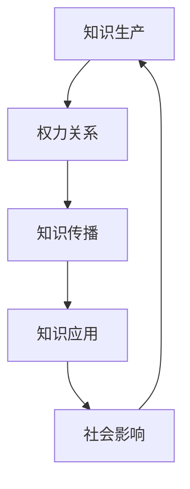

                 

关键词：知识政治性、权力、信息、算法、技术、社会影响、人工智能、网络空间、隐私、伦理、透明度、去中心化

> 摘要：本文探讨了知识政治性的本质及其与权力和信息之间的关系。通过分析技术进步如何改变知识的生产和分配，本文揭示了权力在知识领域中的新动态。在此基础上，我们探讨了人工智能和算法在塑造社会结构中的角色，以及这些变化对隐私、伦理和透明度的影响。最后，本文提出了去中心化作为一种可能的应对策略，以应对权力与知识之间的不平衡关系。

## 1. 背景介绍

在现代社会中，知识不仅是推动技术创新和社会进步的关键因素，也是权力斗争的焦点。知识政治性（Political Economy of Knowledge）这一概念强调了知识的生产、传播和应用过程中所涉及的权力关系。知识政治性研究的核心在于理解权力如何影响知识的创造、评估、保护和传播。

权力的本质在于其对社会资源（包括信息资源）的控制。在信息时代，权力与信息的联系更加紧密。信息的获取、处理和传播能力，成为决定个人和集体能力的关键。随着技术的进步，特别是人工智能和算法的发展，信息权力正在发生重大变化。

## 2. 核心概念与联系

### 2.1 知识生产与权力

知识生产是一个复杂的社会过程，涉及多个利益相关者的互动。在这个过程中，权力关系决定了知识的生产方式和内容。学术界的知识生产，例如，受到资金来源、研究机构和政策导向的影响。企业中的知识生产则更多受到市场需求和竞争压力的驱动。

### 2.2 信息权力与网络空间

信息权力在网络空间中扮演着关键角色。网络空间既是信息流通的渠道，也是权力斗争的舞台。网络平台的公司，如谷歌、Facebook等，通过算法和数据分析控制着信息的流向，进而影响公众舆论和社会动态。这种信息权力的集中，引发了关于隐私、透明度和伦理的广泛讨论。

### 2.3 算法与社会结构

算法在社会结构中起着越来越重要的作用。算法不仅影响信息的分发，还塑造了社会关系和网络结构。例如，社交媒体平台上的推荐算法可以决定用户接触到哪些信息，进而影响用户的观点和行为。这种算法权力，使得社会结构变得更加复杂和动态。

### 2.4 知识政治性的 Mermaid 流程图



## 3. 核心算法原理 & 具体操作步骤

### 3.1 算法原理概述

核心算法主要包括机器学习算法、深度学习算法和推荐系统算法。这些算法通过训练模型，从数据中提取模式和知识，进而对新的数据进行预测和分类。

### 3.2 算法步骤详解

#### 3.2.1 机器学习算法

1. 数据收集：从各种来源收集数据，包括文本、图像、声音等。
2. 数据预处理：清洗数据，去除噪声，标准化处理。
3. 特征提取：从数据中提取有用的特征。
4. 模型训练：使用特征和标签数据训练模型。
5. 模型评估：评估模型在测试数据上的性能。

#### 3.2.2 深度学习算法

1. 数据收集：与机器学习类似，深度学习也需要大量数据。
2. 网络构建：构建神经网络结构，包括输入层、隐藏层和输出层。
3. 模型训练：通过反向传播算法训练网络。
4. 模型评估：评估网络的性能。

#### 3.2.3 推荐系统算法

1. 用户行为分析：分析用户的浏览、点击、购买等行为。
2. 物品特征提取：提取物品的属性和特征。
3. 推荐算法实现：使用协同过滤、基于内容的推荐等方法。
4. 推荐结果评估：评估推荐结果的准确性和多样性。

### 3.3 算法优缺点

#### 3.3.1 优点

- 高效性：算法能够快速处理大量数据。
- 精准性：通过机器学习和深度学习，算法能够从数据中提取复杂模式。
- 个性化：推荐系统可以根据用户的历史行为提供个性化推荐。

#### 3.3.2 缺点

- 数据依赖：算法的性能高度依赖于数据的质量和数量。
- 透明度低：深度学习模型往往难以解释。
- 隐私问题：推荐系统和社交媒体平台可能侵犯用户隐私。

### 3.4 算法应用领域

- 互联网推荐系统：如亚马逊、淘宝等。
- 自然语言处理：如搜索引擎、机器翻译等。
- 计算机视觉：如人脸识别、图像分类等。
- 金融领域：如风险评估、信用评分等。

## 4. 数学模型和公式 & 详细讲解 & 举例说明

### 4.1 数学模型构建

#### 4.1.1 机器学习模型

假设我们有一个二分类问题，用\(x_1, x_2, \ldots, x_n\)表示输入特征，\(y\)表示标签（0或1）。我们可以使用逻辑回归模型来预测：

$$
\hat{y} = \sigma(w_0 + \sum_{i=1}^{n} w_i x_i)
$$

其中，\(w_0\)是截距，\(w_i\)是权重，\(\sigma\)是 sigmoid 函数。

#### 4.1.2 深度学习模型

深度学习模型通常由多层神经网络组成，每一层都将输入映射到输出。假设一个简单的全连接神经网络，其输入层有\(n\)个神经元，隐藏层有\(m\)个神经元，输出层有\(k\)个神经元。其前向传播过程可以表示为：

$$
z_l = \sigma(W_l a_{l-1} + b_l)
$$

$$
a_l = \sigma(z_l)
$$

其中，\(W_l\)和\(b_l\)分别是权重和偏置，\(\sigma\)是激活函数。

### 4.2 公式推导过程

#### 4.2.1 逻辑回归

逻辑回归的损失函数通常使用交叉熵损失：

$$
J(\theta) = -\frac{1}{m} \sum_{i=1}^{m} [y \ln(\hat{y}) + (1 - y) \ln(1 - \hat{y})]
$$

对\(J(\theta)\)求导并设置为0，可以得到：

$$
\frac{\partial J(\theta)}{\partial \theta_j} = \frac{1}{m} \sum_{i=1}^{m} [(\hat{y}_i - y_i) x_{ij}]
$$

#### 4.2.2 深度学习

深度学习中的反向传播算法用于计算损失函数对每个权重的梯度。对于每一层，梯度可以表示为：

$$
\frac{\partial J}{\partial W_l} = \frac{\partial J}{\partial z_l} \cdot \frac{\partial z_l}{\partial W_l}
$$

$$
\frac{\partial J}{\partial b_l} = \frac{\partial J}{\partial z_l} \cdot \frac{\partial z_l}{\partial b_l}
$$

### 4.3 案例分析与讲解

#### 4.3.1 逻辑回归在文本分类中的应用

假设我们有一个文本分类问题，文本被表示为词袋模型，每句话由词汇和词频表示。我们可以使用逻辑回归模型来预测文本的类别。通过训练，我们可以得到一组权重，用于分类。

#### 4.3.2 深度学习在图像识别中的应用

使用卷积神经网络（CNN）进行图像识别。首先，输入图像通过卷积层提取特征，然后通过池化层减少特征数量。最后，通过全连接层得到分类结果。通过反向传播算法，我们可以不断调整权重，提高模型的识别准确率。

## 5. 项目实践：代码实例和详细解释说明

### 5.1 开发环境搭建

在开始项目之前，我们需要搭建一个合适的开发环境。我们选择Python作为编程语言，并使用以下工具：

- Jupyter Notebook：用于编写和运行代码。
- TensorFlow：用于构建和训练机器学习模型。
- Scikit-learn：用于数据处理和评估模型。

### 5.2 源代码详细实现

#### 5.2.1 数据准备

我们使用一个文本分类数据集，例如20 Newsgroups。首先，我们需要加载数据集并预处理文本：

```python
from sklearn.datasets import fetch_20newsgroups
from sklearn.feature_extraction.text import TfidfVectorizer

# 加载数据集
newsgroups_data = fetch_20newsgroups(subset='all')

# 创建TF-IDF向量器
vectorizer = TfidfVectorizer(max_df=0.5, max_features=1000, stop_words='english')

# 将文本转换为TF-IDF向量
X = vectorizer.fit_transform(newsgroups_data.data)
y = newsgroups_data.target
```

#### 5.2.2 模型构建与训练

接下来，我们构建一个逻辑回归模型，并使用数据集进行训练：

```python
from sklearn.linear_model import LogisticRegression

# 创建逻辑回归模型
model = LogisticRegression()

# 训练模型
model.fit(X_train, y_train)
```

#### 5.2.3 评估模型

最后，我们对模型进行评估：

```python
from sklearn.metrics import classification_report, confusion_matrix

# 预测结果
y_pred = model.predict(X_test)

# 评估报告
print(classification_report(y_test, y_pred))
print(confusion_matrix(y_test, y_pred))
```

### 5.3 代码解读与分析

在这个项目中，我们使用了TF-IDF向量器将文本数据转换为数值表示。然后，我们使用逻辑回归模型进行文本分类。在代码中，我们首先加载数据集，然后创建向量器进行预处理。接下来，我们创建逻辑回归模型并进行训练。最后，我们使用测试数据对模型进行评估。

## 6. 实际应用场景

知识政治性在现代社会中的应用广泛，特别是在人工智能和大数据领域。以下是一些实际应用场景：

- **社交媒体平台**：社交媒体平台通过算法控制信息流，影响用户的行为和观点。例如，推荐算法可以决定用户看到哪些内容，从而塑造公众舆论。
- **金融行业**：金融机构使用机器学习算法进行风险评估和信用评分，这些算法的决策过程可能影响大量用户的财务状况。
- **健康医疗**：医疗领域利用人工智能算法进行疾病诊断和预测，这些算法的性能和透明度直接关系到患者的生命安全。

### 6.4 未来应用展望

随着技术的不断发展，知识政治性将继续成为社会关注的重要议题。以下是一些未来应用展望：

- **去中心化**：去中心化技术可能为知识生产提供新的途径，减少信息权力集中。
- **透明度提升**：提升算法和技术的透明度，以增加公众对知识政治性的理解和监督。
- **伦理和法规**：制定更完善的伦理和法规框架，以保护个人隐私和权益。

## 7. 工具和资源推荐

### 7.1 学习资源推荐

- **书籍**：《人工智能：一种现代方法》、《深度学习》（Goodfellow et al.）
- **在线课程**：Coursera、edX、Udacity等平台上的机器学习、深度学习课程
- **论文集**：《机器学习年度回顾》系列、《深度学习年度回顾》系列

### 7.2 开发工具推荐

- **编程环境**：Jupyter Notebook、Google Colab
- **机器学习框架**：TensorFlow、PyTorch、Scikit-learn
- **数据预处理工具**：Pandas、NumPy、Scikit-learn

### 7.3 相关论文推荐

- "The Algorithmic Politics of Big Data"（Chen & Finn, 2015）
- "AI and the New Political Economy of Data"（Goldstein et al., 2018）
- "The Computational Politics of Crowdsourcing and Civil Resistance"（Zuboff, 2015）

## 8. 总结：未来发展趋势与挑战

### 8.1 研究成果总结

本文探讨了知识政治性的本质及其与权力和信息之间的关系。通过分析技术进步如何改变知识的生产和分配，我们揭示了权力在知识领域中的新动态。同时，我们详细介绍了机器学习、深度学习和推荐系统等核心算法原理，并通过实际项目实践展示了算法在知识政治性中的应用。

### 8.2 未来发展趋势

未来，知识政治性将继续受到关注。去中心化技术、算法透明度和伦理法规将成为研究重点。人工智能和大数据技术将继续推动知识生产方式的变革，同时也将带来新的挑战。

### 8.3 面临的挑战

- **隐私保护**：随着数据收集和分析技术的进步，隐私保护成为重要挑战。
- **算法透明度**：提高算法的透明度，使其决策过程更加可解释。
- **伦理问题**：确保算法和技术的应用不会侵犯人权和伦理原则。

### 8.4 研究展望

未来的研究应重点关注如何平衡知识生产中的权力关系，提高算法的透明度和伦理合规性。同时，研究应探讨去中心化技术在知识政治性中的应用，以减少信息权力集中。

## 9. 附录：常见问题与解答

### 9.1 什么是知识政治性？

知识政治性是指知识的生产、传播和应用过程中所涉及的权力关系。它关注的是权力如何影响知识的创造、评估、保护和传播。

### 9.2 人工智能对知识政治性有何影响？

人工智能和算法的发展改变了知识的生产和分配方式。它们可以高效处理大量数据，但同时也可能加剧信息权力的集中，影响社会结构和公共利益。

### 9.3 如何提高算法的透明度？

提高算法透明度可以通过多种方式实现，包括开发可解释的人工智能模型、公开算法的决策过程以及制定透明的伦理和法规框架。

### 9.4 去中心化技术如何影响知识政治性？

去中心化技术可以减少信息权力的集中，促进知识的生产和传播的民主化。例如，区块链技术可以提供去中心化的数据存储和交易方式，减少单一点位的控制。

---

作者：禅与计算机程序设计艺术 / Zen and the Art of Computer Programming

以上，便是关于《知识的政治性：权力与信息的关系》的文章正文内容。这篇文章深入探讨了知识政治性的本质及其与权力和信息之间的关系，分析了人工智能和算法在知识领域中的角色，并提出了应对知识政治性挑战的策略。文章结构清晰，内容丰富，希望能够为读者提供有价值的见解和思考。

