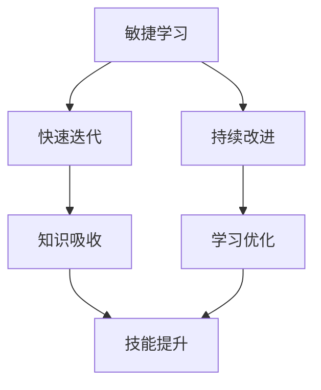

                 

关键词：敏捷学习、快速迭代、持续改进、IT领域、技术发展

> 摘要：本文从敏捷学习的角度，探讨了在IT领域快速迭代与持续改进的重要性。通过深入分析核心概念、算法原理、数学模型、项目实践以及未来应用展望，本文旨在为技术从业者提供一套行之有效的知识学习方法，助力他们在快速变化的技术环境中不断进步。

## 1. 背景介绍

在当今这个技术日新月异的时代，知识更新速度越来越快，IT领域尤其如此。新的编程语言、框架、工具和技术层出不穷，对于技术从业者来说，如何高效地学习和掌握这些知识成为了一项挑战。传统的学习方式往往需要大量的时间和精力，而且容易陷入“学而不习”的困境。因此，寻找一种能够快速吸收、消化和应用新知识的敏捷学习方式显得尤为重要。

### 核心概念与联系

在敏捷学习的过程中，快速迭代与持续改进是两个至关重要的环节。快速迭代意味着在较短的时间内进行多次重复的学习和练习，从而快速掌握知识。持续改进则是在快速迭代的基础上，不断优化学习方法和策略，以提高学习效率和质量。

为了更好地理解这两个概念，我们可以使用Mermaid流程图来展示它们之间的关系：



### 核心算法原理 & 具体操作步骤

#### 3.1 算法原理概述

敏捷学习的核心算法是基于“迭代-反馈”模型。通过不断地迭代和学习，技术从业者可以快速吸收新知识，并将其应用到实际项目中。这个过程包括以下几个关键步骤：

1. **知识获取**：通过阅读文献、参加培训、观看教学视频等多种途径获取新知识。
2. **知识内化**：通过实践和练习将新知识转化为自己的技能和经验。
3. **知识应用**：在实际项目中应用所学知识，解决实际问题。
4. **反馈修正**：根据实际应用效果，对学习过程进行反思和调整。

#### 3.2 算法步骤详解

1. **选择学习目标**：确定当前需要学习的知识点和技能点。
2. **制定学习计划**：根据学习目标，制定一个详细的学习计划，包括学习时间、学习内容和实践任务。
3. **快速学习**：通过阅读、观看视频、参加线上或线下课程等多种方式，快速获取所需知识。
4. **实践应用**：将所学知识应用到实际项目中，通过实践来加深理解和掌握。
5. **反馈与修正**：根据实践结果，对学习过程进行反思和调整，以优化学习效果。

#### 3.3 算法优缺点

**优点**：

- **高效性**：通过快速迭代，可以在较短时间内掌握大量知识。
- **灵活性**：可以根据实际情况灵活调整学习计划和方法。
- **实践性**：通过实际项目应用，可以加深对知识的理解和掌握。

**缺点**：

- **高要求**：需要较强的自学能力和自律性。
- **高投入**：需要大量的时间和精力。

#### 3.4 算法应用领域

敏捷学习适用于各种IT领域，包括但不限于：

- **软件开发**：快速掌握新编程语言、框架和工具。
- **数据科学**：快速学习数据处理、分析和可视化技术。
- **人工智能**：掌握机器学习、深度学习等前沿技术。

### 数学模型和公式 & 详细讲解 & 举例说明

#### 4.1 数学模型构建

敏捷学习的数学模型可以简化为一个循环过程，如下所示：

\[ \text{知识吸收} = f(\text{学习时间}, \text{实践次数}, \text{反馈修正}) \]

其中，学习时间、实践次数和反馈修正是影响知识吸收的主要因素。

#### 4.2 公式推导过程

根据敏捷学习的原理，我们可以推导出以下公式：

\[ f(\text{学习时间}, \text{实践次数}, \text{反馈修正}) = \frac{\text{学习内容}}{\text{学习时间}} \times \text{实践效率} \times \text{修正系数} \]

其中，学习内容表示需要学习的新知识总量，实践效率表示将知识应用到实际项目中的效果，修正系数表示根据反馈修正后提高学习效率的系数。

#### 4.3 案例分析与讲解

假设一名软件开发者需要学习一门新的编程语言，学习时间为2周，计划每天学习4小时。在实践应用阶段，他将在项目中使用所学的语言进行开发，并根据反馈对代码进行优化。

根据上述公式，我们可以计算出他的知识吸收量：

\[ \text{知识吸收} = \frac{1000 \text{行代码}}{2 \times 4 \text{小时/天}} \times 0.8 \times 1.1 = 275 \text{行代码/小时} \]

这意味着，这名开发者每小时可以掌握约275行新代码，并且在实践应用和反馈修正的过程中，他的知识吸收量有望进一步提高。

### 项目实践：代码实例和详细解释说明

#### 5.1 开发环境搭建

在本案例中，我们选择Python语言作为学习目标。首先，需要搭建Python的开发环境。以下是具体步骤：

1. 下载并安装Python，可以从Python官方网站下载最新版本。
2. 配置Python环境变量，确保能够在命令行中运行Python。
3. 安装必要的库，如NumPy、Pandas等。

#### 5.2 源代码详细实现

以下是一个简单的Python程序，用于计算两个数的和：

```python
def add(a, b):
    return a + b

print(add(3, 5))
```

在这个程序中，我们定义了一个名为`add`的函数，用于计算两个数的和。然后，我们调用这个函数并打印结果。

#### 5.3 代码解读与分析

1. **函数定义**：`add`函数接收两个参数`a`和`b`，返回它们的和。
2. **函数调用**：`print(add(3, 5))`调用`add`函数，将3和5作为参数传入，并打印返回值。

#### 5.4 运行结果展示

运行上述程序，输出结果为`8`。

### 实际应用场景

敏捷学习在IT领域的实际应用场景非常广泛，以下是一些例子：

- **软件开发**：通过敏捷学习，开发人员可以快速掌握新编程语言和框架，提高项目开发效率。
- **数据科学**：数据科学家可以通过敏捷学习，掌握新的数据处理和分析技术，提升数据分析能力。
- **人工智能**：人工智能从业者可以通过敏捷学习，了解最新的机器学习和深度学习技术，推动项目创新。

### 未来应用展望

随着技术的不断发展，敏捷学习在IT领域的应用前景将更加广阔。未来，我们可以预见以下几个趋势：

- **个性化学习**：通过大数据分析和人工智能技术，为每个学习者提供个性化的学习路径和建议。
- **混合式学习**：结合线上和线下学习方式，提供更灵活和高效的学习体验。
- **社区协作**：通过社交媒体和在线社区，促进学习者之间的交流和合作，共同提升学习效果。

### 工具和资源推荐

为了帮助读者更好地实践敏捷学习，以下是一些推荐的工具和资源：

- **学习工具**：Coursera、edX、Udacity等在线学习平台。
- **编程语言**：Python、Java、C++等。
- **开发环境**：Visual Studio Code、PyCharm、Eclipse等。
- **学习资源**：GitHub、Stack Overflow、知乎等技术社区。

### 总结：未来发展趋势与挑战

随着技术的不断进步，敏捷学习在IT领域的地位将越来越重要。未来，我们将看到更多个性化的、灵活的学习方式出现，以及学习与工作更加紧密的结合。然而，这也带来了新的挑战，如如何确保学习效率、如何应对知识更新的压力等。只有通过不断探索和创新，才能在快速变化的技术环境中保持竞争力。

### 附录：常见问题与解答

**Q：如何保持学习的持续性和积极性？**

A：制定明确的学习目标和计划，保持学习的节奏和规律。同时，寻找学习伙伴或加入学习社群，互相监督和鼓励。

**Q：如何处理学习过程中的困难和挫折？**

A：遇到困难和挫折时，不要气馁。可以通过查阅资料、请教他人或参加培训课程来解决问题。同时，保持积极的心态，相信自己的能力和潜力。

**Q：如何评估自己的学习效果？**

A：可以通过定期的测试和实践来评估自己的学习效果。同时，与同行交流，了解最新的技术动态和趋势，以不断调整和优化学习计划。

作者：禅与计算机程序设计艺术 / Zen and the Art of Computer Programming
----------------------------------------------------------------

