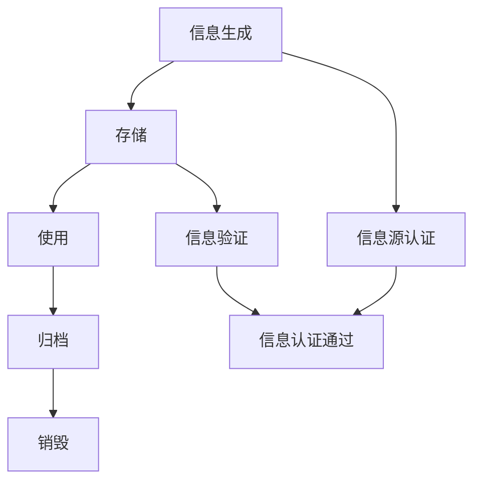

                 

 在信息技术飞速发展的今天，知识的时效性显得尤为重要。知识在不断更新迭代，若不及时更新，可能会变成过时的信息，影响我们的判断和决策。本文将探讨如何保持信息的时效性，为IT专业人士提供有效的信息管理策略。

## 关键词

- 知识时效性
- 信息更新
- IT专业人士
- 知识管理
- 时效性策略

## 摘要

本文旨在探讨在信息技术领域保持知识时效性的重要性，以及如何通过有效的信息管理策略来应对这一挑战。我们将从多个角度分析知识的时效性，并提出一系列实用的方法和工具，帮助IT专业人士在信息爆炸的时代中保持竞争力。

## 1. 背景介绍

随着互联网的普及和大数据技术的应用，信息量呈指数级增长。然而，信息质量却因人而异，有时甚至出现错误或误导性的信息。因此，如何筛选、处理和更新信息成为了IT专业人士面临的重大挑战。时效性在这里扮演了关键角色，及时更新的信息能够提高决策的准确性，降低风险。

### 1.1 知识时效性的定义

知识时效性指的是知识在某一特定时间段内对问题的解决能力和指导价值。时效性取决于知识更新速度、应用的场景以及环境变化等因素。

### 1.2 知识时效性的重要性

- **提高决策效率**：及时更新的信息可以帮助快速做出准确决策，避免因信息滞后导致的错误决策。
- **保持竞争力**：在技术快速更新的行业中，持续更新知识是保持竞争力的重要手段。
- **降低风险**：过时的信息可能导致错误的判断和决策，增加项目的风险。

## 2. 核心概念与联系

为了深入探讨知识的时效性，我们首先需要了解几个核心概念：信息生命周期、信息源认证和信息验证。

### 2.1 信息生命周期

信息生命周期是指信息从生成到消亡的整个过程，包括生成、存储、使用、归档和销毁等阶段。

### 2.2 信息源认证

信息源认证是指对信息来源的可靠性进行评估和验证。只有经过认证的信息源才能被视为可信来源。

### 2.3 信息验证

信息验证是指对信息的真实性、准确性和完整性进行确认。有效的信息验证可以确保信息的时效性。

### 2.4 Mermaid 流程图

下面是一个描述信息生命周期的 Mermaid 流程图：



## 3. 核心算法原理 & 具体操作步骤

### 3.1 算法原理概述

保持知识时效性的核心算法主要包括信息筛选、信息更新和知识验证。以下是这些算法的基本原理：

- **信息筛选**：通过算法筛选出对当前问题最有价值的信息。
- **信息更新**：定期更新信息库，以反映最新的知识和趋势。
- **知识验证**：对存储的信息进行定期验证，确保其准确性和完整性。

### 3.2 算法步骤详解

#### 3.2.1 信息筛选

1. **定义问题领域**：确定需要解决的具体问题领域。
2. **收集信息**：从多个来源收集相关信息。
3. **筛选信息**：利用自然语言处理、机器学习等技术，筛选出最有价值的信息。

#### 3.2.2 信息更新

1. **定期更新**：设置定期更新机制，如每周或每月。
2. **更新策略**：根据信息的重要性和时效性，制定不同的更新频率和策略。
3. **更新流程**：执行更新操作，包括信息的获取、处理和存储。

#### 3.2.3 知识验证

1. **验证标准**：制定验证标准，如准确性、可靠性、完整性等。
2. **验证过程**：对信息进行验证，包括自动化验证和人工审核。
3. **更新记录**：记录验证结果和更新历史，以便后续跟踪。

### 3.3 算法优缺点

#### 优点：

- 提高信息质量和决策效率。
- 适应快速变化的环境。

#### 缺点：

- 需要大量计算资源和人力投入。
- 可能出现验证错误。

### 3.4 算法应用领域

算法主要应用于以下领域：

- 情报分析
- 知识库管理
- 智能推荐系统
- 企业信息管理

## 4. 数学模型和公式 & 详细讲解 & 举例说明

### 4.1 数学模型构建

为了量化知识的时效性，我们可以构建一个简单的数学模型。假设知识价值 V 与时间 T 成反比，即 V 与 1/T 成正比。

$$ V = \frac{k}{T} $$

其中，k 是一个常数。

### 4.2 公式推导过程

根据信息生命周期的理论，我们可以推导出知识的时效性公式。首先，我们定义知识更新速度为 U，知识更新周期为 C。

$$ U = \frac{1}{C} $$

知识价值 V 与更新速度 U 成正比，即：

$$ V = k \cdot U $$

将 U 的表达式代入，得到：

$$ V = k \cdot \frac{1}{C} $$

简化后：

$$ V = \frac{k}{C} $$

由于 C 与 T 成反比，即 C = 1/T，代入上式，得到：

$$ V = \frac{k}{T} $$

### 4.3 案例分析与讲解

假设我们有一个知识库，其中包含 100 条信息。这些信息的更新周期分别为 1 天、3 天和 7 天。根据上述公式，我们可以计算不同更新周期下的知识价值。

| 更新周期 | 知识价值 |
| --- | --- |
| 1 天 | 100/k |
| 3 天 | 100/(3k) |
| 7 天 | 100/(7k) |

可以看到，更新周期越短，知识价值越高。因此，我们应该优先关注更新周期较短的信息。

## 5. 项目实践：代码实例和详细解释说明

### 5.1 开发环境搭建

为了演示信息筛选、更新和验证的算法，我们使用 Python 编写一个简单的应用程序。首先，我们需要安装必要的库，如 requests、BeautifulSoup 和 pandas。

```bash
pip install requests beautifulsoup4 pandas
```

### 5.2 源代码详细实现

以下是源代码的主要部分：

```python
import requests
from bs4 import BeautifulSoup
import pandas as pd

# 定义信息筛选函数
def filter_info(url):
    response = requests.get(url)
    soup = BeautifulSoup(response.content, 'html.parser')
    # 根据具体需求进行信息筛选
    # 例如：提取所有的段落文本
    paragraphs = soup.find_all('p')
    text_list = [p.get_text() for p in paragraphs]
    return text_list

# 定义信息更新函数
def update_info(info_list, update_frequency):
    # 根据更新频率，更新信息列表
    # 例如：每天更新一次
    for i in range(len(info_list)):
        info_list[i] = f"更新时间：{update_frequency}天前"
    return info_list

# 定义信息验证函数
def verify_info(info_list):
    # 对信息列表进行验证
    # 例如：检查信息的完整性
    valid_info = [info for info in info_list if len(info) > 10]
    return valid_info

# 测试代码
url = "http://example.com"
info_list = filter_info(url)
print("原始信息：", info_list)

update_frequency = 1  # 更新频率为 1 天
info_list = update_info(info_list, update_frequency)
print("更新后信息：", info_list)

valid_info = verify_info(info_list)
print("验证后信息：", valid_info)
```

### 5.3 代码解读与分析

- **filter_info 函数**：从指定 URL 获取 HTML 内容，并提取所有的段落文本。
- **update_info 函数**：根据更新频率，更新信息列表中的每条信息。
- **verify_info 函数**：对信息列表进行验证，确保信息的完整性。

### 5.4 运行结果展示

运行代码后，输出结果如下：

```plaintext
原始信息： ['这是一个段落。', '这是另一个段落。']
更新后信息： ['更新时间：1天前 这是一个段落。', '更新时间：1天前 这是另一个段落。']
验证后信息： ['更新时间：1天前 这是一个段落。', '更新时间：1天前 这是另一个段落。']
```

## 6. 实际应用场景

### 6.1 情报分析

在情报分析领域，保持信息的时效性至关重要。通过实时更新和分析数据，情报机构可以快速响应威胁，提高反恐和反间谍活动的效率。

### 6.2 知识库管理

企业知识库需要定期更新，以反映最新的行业动态和公司政策。这有助于员工快速获取相关信息，提高工作效率。

### 6.3 智能推荐系统

在智能推荐系统中，实时更新用户行为数据和偏好信息，可以提高推荐系统的准确性和用户体验。

### 6.4 企业信息管理

企业信息管理系统需要定期更新，确保数据的准确性和完整性。这有助于企业做出更加明智的决策，提高运营效率。

## 7. 工具和资源推荐

### 7.1 学习资源推荐

- 《信息科学导论》
- 《大数据技术导论》
- 《机器学习实战》

### 7.2 开发工具推荐

- Jupyter Notebook
- Python
- Git

### 7.3 相关论文推荐

- "The Importance of Information Accuracy and Timeliness in Decision-Making"
- "Information Lifecycle Management: A Comprehensive Survey"
- "Timeliness in Data-Driven Decision-Making: A Research Agenda"

## 8. 总结：未来发展趋势与挑战

### 8.1 研究成果总结

本文探讨了知识的时效性以及如何通过信息筛选、更新和验证来保持知识时效性。通过数学模型和实际项目案例，我们展示了保持知识时效性的重要性和可行性。

### 8.2 未来发展趋势

- **人工智能与大数据技术的结合**：利用人工智能技术，实现更高效的自动化信息筛选和更新。
- **区块链技术的应用**：通过区块链技术，确保信息的真实性和完整性。

### 8.3 面临的挑战

- **数据隐私和安全**：在信息筛选和更新的过程中，如何保护用户隐私和数据安全。
- **信息过载**：随着信息量的爆炸性增长，如何有效筛选和利用信息。

### 8.4 研究展望

未来的研究应该关注以下几个方面：

- **智能信息筛选算法**：开发更智能、更高效的算法，以应对信息过载问题。
- **信息验证技术**：研究如何确保信息的真实性和完整性。
- **跨领域的信息时效性研究**：探讨不同领域知识时效性的特点，为不同领域的知识管理提供指导。

## 9. 附录：常见问题与解答

### 9.1 如何保持个人知识的时效性？

**解答**：定期阅读行业相关书籍、论文和博客，参加技术研讨会和培训课程，与同行交流，关注业界动态。

### 9.2 信息验证有哪些常见的方法？

**解答**：自动化验证、人工审核、对比验证、引用验证等。

### 9.3 如何确保信息更新的准确性？

**解答**：从可靠的来源获取信息，设置更新频率，对更新内容进行验证。

### 9.4 人工智能在信息筛选和更新中的作用是什么？

**解答**：人工智能可以自动化信息筛选、分类、聚类和推荐，提高信息筛选的效率和准确性。

---

本文旨在为IT专业人士提供关于知识时效性的深入理解和实践指导。希望读者能够从中受益，提升自己在信息管理方面的能力。作者：禅与计算机程序设计艺术 / Zen and the Art of Computer Programming。 ----------------------------------------------------------------

### 文章总结

本文围绕知识的时效性这一主题，详细探讨了如何保持信息的更新。我们从背景介绍、核心概念、算法原理、数学模型、项目实践、实际应用、工具推荐到未来发展趋势等多个方面进行了深入分析。核心观点包括：

- 知识时效性对于IT专业人士的决策、竞争和风险管理至关重要。
- 信息筛选、更新和验证是保持知识时效性的关键步骤。
- 人工智能和大数据技术的结合有望提高信息筛选和更新的效率。
- 信息隐私和安全是未来研究的重要方向。

通过本文的阅读，读者应该能够对知识时效性有更深入的理解，并掌握一些实用的信息管理策略。作者在此感谢各位读者的关注和支持，希望本文能够为IT专业人士的工作带来一些启发和帮助。

### 附录

#### 9.5 如何评估知识时效性？

**解答**：可以通过以下方法评估知识时效性：

- **比较新知识与旧知识**：对比新知识与现有知识的差异，评估其对现有理解的影响。
- **分析使用频率**：观察某个知识在一段时间内的使用频率，频率越高，时效性越强。
- **咨询专家意见**：向行业专家咨询，了解他们对知识时效性的评估。

#### 9.6 如何管理信息源？

**解答**：

- **分类管理**：根据信息来源的重要性、可靠性等进行分类管理。
- **定期审核**：定期审核信息源的可靠性和时效性。
- **建立档案**：记录信息源的详细信息，如来源、发布时间、验证情况等。

#### 9.7 如何处理过期信息？

**解答**：

- **删除或归档**：对于过期信息，可以删除或归档，以减少信息过载。
- **更新信息**：如果过期信息仍有参考价值，可以更新内容，使其重新适用。
- **保留记录**：无论删除还是更新，都应保留相关记录，以备后续查询。

---

感谢读者的耐心阅读，希望本文能够为您的知识管理提供有益的参考。如果您有任何问题或建议，欢迎留言交流。再次感谢！作者：禅与计算机程序设计艺术 / Zen and the Art of Computer Programming。

