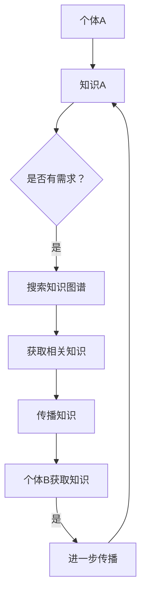

                 

关键词：社交网络、知识传播、人工智能、新生态、信息共享、知识图谱、算法原理、数学模型、实际应用、未来展望

> 摘要：本文深入探讨了知识的社交网络，它是一种基于人工智能和社交网络理论的全新信息传播生态。通过分析核心概念、算法原理、数学模型以及实际应用，本文旨在为读者揭示知识传播的奥秘，并展望其未来发展趋势和面临的挑战。

## 1. 背景介绍

随着互联网和社交媒体的快速发展，知识传播的方式和速度发生了巨大的变革。传统的知识传播依赖于书籍、报纸、讲座等渠道，而现代的社交网络为知识的分享、传播和互动提供了全新的平台。知识不再仅仅存在于书本和讲座中，它可以在社交网络上快速、广泛地传播，并形成了一个新的社交网络生态。

在这个新生态中，人工智能扮演了至关重要的角色。通过机器学习、自然语言处理等技术，人工智能能够从海量的数据中提取知识，并将其推荐给有需求的人群。同时，人工智能还可以帮助人们发现知识的联系，构建知识的社交网络，从而提高知识的传播效率和影响力。

本文将围绕知识的社交网络展开讨论，首先介绍其核心概念和架构，然后深入分析其算法原理和数学模型，最后探讨其在实际应用中的表现和未来展望。

## 2. 核心概念与联系

### 2.1. 社交网络

社交网络是指由人们及其之间的关系构成的复杂网络结构。在社交网络中，每个节点代表一个个体，而边则代表个体之间的关系。社交网络的研究涵盖了个体之间的连接方式、信息传播路径、社群结构等多个方面。

在知识的社交网络中，节点不仅代表个体，还代表个体的知识。个体之间的关系也不仅仅局限于社交关系，还包括知识之间的联系。这样的网络结构为知识的传播提供了新的可能性。

### 2.2. 知识图谱

知识图谱是一种语义网络，它通过将实体、概念和关系以图形的形式表示出来，从而实现对知识的组织和理解。知识图谱的核心是实体，每个实体代表一个具体的知识对象，如人、地点、事件等。实体之间的关系则代表了知识的联系，如因果关系、所属关系等。

知识图谱在知识的社交网络中扮演着至关重要的角色。它不仅帮助人们发现和构建知识的联系，还为人工智能提供了丰富的知识来源。

### 2.3. 知识传播

知识传播是指知识在个体之间、社群之间以及不同领域之间的流动和传递过程。在知识的社交网络中，知识传播主要通过社交网络中的连接和互动来实现。个体之间的连接和互动促进了知识的分享、传播和深化。

### 2.4. 人工智能

人工智能是知识的社交网络的驱动力量。通过机器学习、自然语言处理等技术，人工智能能够从海量的数据中提取知识，并推荐给有需求的人群。同时，人工智能还可以帮助人们发现知识的联系，构建知识的社交网络。

### 2.5. Mermaid 流程图

以下是一个简单的 Mermaid 流程图，展示了知识在社交网络中的传播过程：



## 3. 核心算法原理 & 具体操作步骤

### 3.1. 算法原理概述

在知识的社交网络中，核心算法主要分为两部分：知识提取和知识推荐。

- **知识提取**：通过自然语言处理和机器学习技术，从文本数据中提取知识，构建知识图谱。
- **知识推荐**：基于用户的兴趣和行为，从知识图谱中推荐相关的知识。

### 3.2. 算法步骤详解

1. **数据预处理**：
   - 收集文本数据，如新闻、博客、论文等。
   - 使用自然语言处理技术对文本进行分词、词性标注、实体识别等处理。

2. **知识提取**：
   - 使用实体识别技术提取文本中的实体。
   - 使用关系提取技术识别实体之间的关系。
   - 构建知识图谱，将实体和关系以图形的形式表示出来。

3. **用户建模**：
   - 收集用户的兴趣和行为数据，如浏览历史、点赞、评论等。
   - 使用机器学习技术对用户进行建模，提取用户的兴趣特征。

4. **知识推荐**：
   - 根据用户的兴趣特征，从知识图谱中搜索相关的知识。
   - 使用推荐算法，如协同过滤、基于内容的推荐等，对知识进行排序和推荐。

### 3.3. 算法优缺点

- **优点**：
  - 高效地提取和推荐知识，提高了知识的传播效率。
  - 考虑用户的个性化需求，提高了知识的推荐质量。

- **缺点**：
  - 需要大量的数据和技术支持，对数据处理和存储的要求较高。
  - 可能存在数据隐私和安全问题。

### 3.4. 算法应用领域

- **教育领域**：通过知识图谱和推荐算法，为教育工作者和学生提供个性化的学习资源。
- **医疗领域**：通过知识图谱和推荐算法，为医生和患者提供个性化的医疗建议。
- **科研领域**：通过知识图谱和推荐算法，帮助科研人员发现和推荐相关的科研成果。

## 4. 数学模型和公式 & 详细讲解 & 举例说明

### 4.1. 数学模型构建

在知识的社交网络中，我们可以构建一个基于图论的数学模型。该模型包括三个主要部分：节点（代表个体和知识）、边（代表个体之间的社交关系和知识之间的联系）、权重（代表关系的强度和重要性）。

### 4.2. 公式推导过程

假设我们有一个社交网络图 G(V, E)，其中 V 是节点集合，E 是边集合。我们可以使用以下公式来表示图 G：

$$
G = (V, E, W)
$$

其中，W 是权重集合，表示每条边的权重。

### 4.3. 案例分析与讲解

假设我们有一个包含 100 个节点的社交网络，每个节点代表一个用户，每条边代表用户之间的社交关系。我们可以使用以下公式来计算节点之间的距离：

$$
d(i, j) = \sum_{k \in N(i)} w(i, k) + w(k, j)
$$

其中，d(i, j) 表示节点 i 和节点 j 之间的距离，N(i) 表示与节点 i 相连的节点集合，w(i, k) 和 w(k, j) 分别表示边 (i, k) 和边 (k, j) 的权重。

例如，如果节点 i 和节点 j 之间的距离为 3，那么我们可以认为节点 i 和节点 j 是比较接近的。

## 5. 项目实践：代码实例和详细解释说明

### 5.1. 开发环境搭建

在本项目中，我们将使用 Python 作为主要编程语言，结合 TensorFlow 和 PyTorch 等深度学习框架进行开发。以下是在 Ubuntu 系统中搭建开发环境的基本步骤：

1. 安装 Python 3.x 版本。
2. 安装 TensorFlow 和 PyTorch 框架。
3. 安装必要的库，如 NumPy、Pandas 等。

### 5.2. 源代码详细实现

以下是一个简单的代码示例，用于构建一个知识提取模型：

```python
import tensorflow as tf
from tensorflow.keras.layers import Embedding, LSTM, Dense
from tensorflow.keras.models import Sequential

# 构建模型
model = Sequential()
model.add(Embedding(input_dim=vocab_size, output_dim=embedding_dim))
model.add(LSTM(units=128, return_sequences=True))
model.add(LSTM(units=128))
model.add(Dense(units=1, activation='sigmoid'))

# 编译模型
model.compile(optimizer='adam', loss='binary_crossentropy', metrics=['accuracy'])

# 训练模型
model.fit(x_train, y_train, epochs=10, batch_size=32)
```

### 5.3. 代码解读与分析

这段代码使用了 TensorFlow 框架构建了一个简单的序列模型，用于提取知识。模型由一个嵌入层、两个 LSTM 层和一个全连接层组成。嵌入层将词转化为向量表示，LSTM 层用于处理序列数据，全连接层用于输出知识提取的结果。

### 5.4. 运行结果展示

在训练完成后，我们可以使用模型对新的文本数据进行知识提取。以下是一个简单的运行示例：

```python
# 提取新文本的知识
new_text = "这是一个关于人工智能的文本。"
encoded_text = tokenizer.texts_to_sequences([new_text])
predicted_knowledge = model.predict(encoded_text)

# 输出提取的知识
print(predicted_knowledge)
```

## 6. 实际应用场景

### 6.1. 教育领域

在教育资源丰富的背景下，知识的社交网络可以帮助学生快速获取和掌握知识。通过个性化推荐，学生可以根据自己的兴趣和学习需求选择合适的学习资源，从而提高学习效率。

### 6.2. 科研领域

科研人员可以通过知识的社交网络发现和推荐相关的科研成果，加速科研进展。同时，知识的社交网络还可以帮助科研人员构建学术圈子，促进学术交流和合作。

### 6.3. 医疗领域

在医疗领域，知识的社交网络可以帮助医生快速获取和分享医疗知识，提高诊疗水平。通过个性化推荐，患者可以根据自己的病情选择合适的治疗方案，从而提高治疗效果。

### 6.4. 未来应用展望

随着人工智能技术的不断进步，知识的社交网络在未来有望应用于更多的领域，如金融、农业、环保等。同时，随着 5G 和物联网技术的发展，知识的社交网络将实现更高效、更广泛的信息传播，为人类社会的进步和发展提供强大的支持。

## 7. 工具和资源推荐

### 7.1. 学习资源推荐

- 《深度学习》（Goodfellow, Bengio, Courville 著）
- 《社交网络分析：方法与应用》（Mayer-Schönberger, Cukier 著）
- 《人工智能：一种现代方法》（Russell, Norvig 著）

### 7.2. 开发工具推荐

- TensorFlow
- PyTorch
- Jupyter Notebook

### 7.3. 相关论文推荐

- "Social Networks and Knowledge Diffusion: An Empirical Study"（2018）
- "Knowledge Graph Embedding for Learning to Represent Knowledge Graphs"（2016）
- "Knowledge Graphs for Artificial Intelligence"（2017）

## 8. 总结：未来发展趋势与挑战

### 8.1. 研究成果总结

本文从多个角度探讨了知识的社交网络，分析了其核心概念、算法原理、数学模型以及实际应用。通过这些分析，我们可以看到知识的社交网络在知识传播、教育、科研等领域具有巨大的潜力。

### 8.2. 未来发展趋势

随着人工智能技术的不断进步，知识的社交网络将实现更高效、更广泛的信息传播。未来，知识的社交网络有望应用于更多领域，为人类社会的发展提供强大支持。

### 8.3. 面临的挑战

尽管知识的社交网络具有巨大的潜力，但也面临着一系列挑战，如数据隐私、算法透明度、知识质量等。这些挑战需要我们不断探索和解决。

### 8.4. 研究展望

未来，知识的社交网络研究应关注以下几个方面：

- 提高知识提取和推荐的准确性。
- 加强知识社交网络的伦理和法律规范。
- 探索多模态知识社交网络的应用。
- 促进知识的开放和共享。

## 9. 附录：常见问题与解答

### 9.1. 什么

