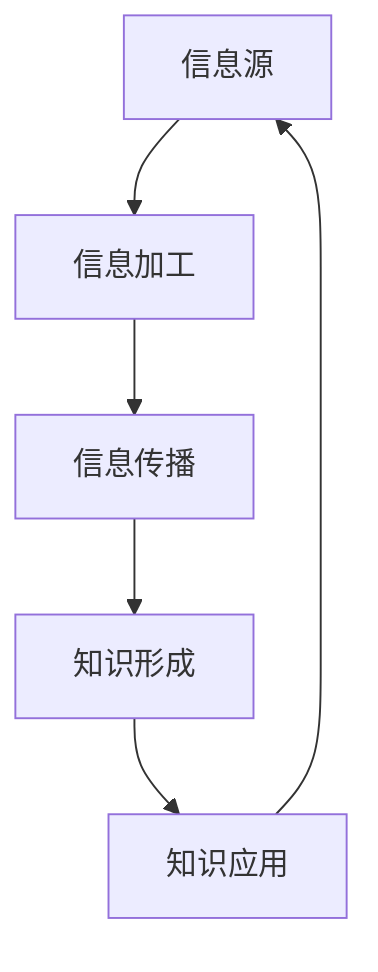

                 

关键词：集体智慧、知识社会性、信息传播、算法、人工智能、数学模型

> 摘要：本文探讨了知识的社会性，即集体智慧的形成与传播。通过深入分析信息在社会中的流动机制、集体智慧的算法原理以及数学模型的构建与应用，本文旨在揭示知识如何在社会中形成和传播，并探讨其未来发展趋势与面临的挑战。

## 1. 背景介绍

随着互联网和信息技术的飞速发展，知识在社会中的作用日益凸显。知识不仅是个人成长和发展的基础，也是社会进步和创新的动力。然而，知识的产生、传播和应用并非个人行为，而是社会集体智慧的结果。知识的社会性是指知识在社会中的形成、传播和应用过程中，通过人际互动、资源共享和协同创新等机制，实现知识的扩散和增值。

本文将从以下几个方面探讨知识的社会性：首先，分析信息在社会中的流动机制，包括人际互动、信息共享和协同创新等；其次，介绍集体智慧的算法原理，包括协同过滤、社交网络分析等；再次，探讨数学模型在知识传播中的应用，包括信息传播模型、社交网络模型等；最后，讨论知识的社会性对实际应用场景的影响，以及未来的发展趋势和挑战。

## 2. 核心概念与联系

为了更好地理解知识的社会性，我们需要明确几个核心概念：信息、知识、集体智慧和社会网络。

### 2.1 信息

信息是指通过语言、文字、图像、声音等形式传达的有意义的内容。信息是知识的基础，没有信息就没有知识。在信息社会中，信息的产生、传播和应用已成为社会发展的重要驱动力。

### 2.2 知识

知识是指经过个体或集体思考、总结和归纳的信息。知识是人类认识和改造世界的重要成果，也是社会进步和创新的源泉。知识分为个人知识和集体知识，个人知识是指个体通过学习和实践获得的知识，而集体知识则是社会成员共同创造和积累的知识。

### 2.3 集体智慧

集体智慧是指由多个个体通过合作、交流和协作产生的智慧。集体智慧强于个人智慧，因为它能够综合多个个体的认知资源，实现知识的共享和创造。集体智慧的形成和传播依赖于社会网络和信息流动机制。

### 2.4 社会网络

社会网络是指个体之间通过相互联系和互动形成的复杂关系结构。社会网络是知识传播的重要渠道，通过人际互动，知识可以在社会网络中快速扩散和传播。

### 2.5 Mermaid 流程图

以下是一个简单的 Mermaid 流程图，展示了信息在社会中的流动机制：



在这个流程图中，信息源产生信息，经过信息加工后传播出去，形成知识，再通过知识应用回到信息源，形成一个闭环。

## 3. 核心算法原理 & 具体操作步骤

### 3.1 算法原理概述

集体智慧的算法原理主要包括协同过滤、社交网络分析、多智能体系统和机器学习等。

- **协同过滤**：基于用户的历史行为和偏好，为用户推荐相似的内容或用户。
- **社交网络分析**：通过分析社交网络中的节点关系和边关系，揭示社交网络的特性，为知识传播提供依据。
- **多智能体系统**：通过多个智能体的协作和互动，实现知识的共享和创造。
- **机器学习**：利用大数据和算法，从数据中自动学习知识，为知识传播和应用提供支持。

### 3.2 算法步骤详解

#### 3.2.1 协同过滤

1. 收集用户历史行为数据，如浏览记录、购买记录等。
2. 计算用户之间的相似度，如基于用户评分数的余弦相似度。
3. 根据用户相似度推荐相似用户喜欢的商品或内容。

#### 3.2.2 社交网络分析

1. 建立社交网络模型，如无向图或有向图。
2. 计算节点的中心性指标，如度数中心性、接近中心性、中间中心性等。
3. 分析社交网络的特性，如聚类系数、平均路径长度等。

#### 3.2.3 多智能体系统

1. 定义智能体的行为规则，如基于规则的智能体、基于强化学习的智能体等。
2. 建立智能体的通信机制，如广播、多播、点对点通信等。
3. 模拟智能体的互动过程，实现知识的共享和创造。

#### 3.2.4 机器学习

1. 收集大量数据，如文本、图像、声音等。
2. 提取特征，如词向量、图像特征、声音特征等。
3. 训练模型，如分类模型、回归模型、聚类模型等。
4. 应用模型，如文本分类、图像识别、语音识别等。

### 3.3 算法优缺点

- **协同过滤**：优点是能够根据用户历史行为进行个性化推荐，缺点是容易产生冷启动问题，即新用户没有历史行为数据时无法进行推荐。
- **社交网络分析**：优点是能够揭示社交网络的特性，为知识传播提供依据，缺点是计算复杂度高，难以处理大规模社交网络。
- **多智能体系统**：优点是实现知识的共享和创造，缺点是智能体的行为规则和通信机制设计复杂。
- **机器学习**：优点是能够从数据中自动学习知识，实现自动化知识传播和应用，缺点是对数据质量和算法性能要求较高。

### 3.4 算法应用领域

- **协同过滤**：在电子商务、社交媒体、在线新闻推荐等领域广泛应用。
- **社交网络分析**：在社交网络挖掘、社交网络营销、社交网络稳定性分析等领域应用。
- **多智能体系统**：在智能交通、智能医疗、智能工业等领域应用。
- **机器学习**：在自然语言处理、计算机视觉、语音识别等领域应用。

## 4. 数学模型和公式 & 详细讲解 & 举例说明

### 4.1 数学模型构建

在知识传播中，常用的数学模型包括信息传播模型、社交网络模型和机器学习模型。

#### 4.1.1 信息传播模型

信息传播模型主要研究信息在社会中的传播过程。一个简单的信息传播模型可以表示为：

\[ X(t) = X(0) + \sum_{i=1}^{t} I_i \]

其中，\( X(t) \) 表示在时间 \( t \) 时刻的信息量，\( X(0) \) 表示初始信息量，\( I_i \) 表示在 \( i \) 时间单位内传播的信息量。

#### 4.1.2 社交网络模型

社交网络模型主要研究社交网络中的节点关系和边关系。一个简单的社交网络模型可以表示为：

\[ G = (V, E) \]

其中，\( V \) 表示节点集，\( E \) 表示边集。节点可以表示个体或组织，边可以表示个体或组织之间的联系。

#### 4.1.3 机器学习模型

机器学习模型主要用于知识传播的应用场景，如分类、回归和聚类等。一个简单的机器学习模型可以表示为：

\[ f(x) = w \cdot x + b \]

其中，\( x \) 表示输入特征，\( w \) 表示权重，\( b \) 表示偏置。

### 4.2 公式推导过程

#### 4.2.1 信息传播模型

假设在时间 \( t \) 时刻，信息传播的速度为 \( v(t) \)，则在时间 \( t \) 单位内传播的信息量为：

\[ I(t) = v(t) \cdot X(t) \]

则信息传播模型可以表示为：

\[ X(t) = X(0) + \int_{0}^{t} v(t') \cdot X(t') \, dt' \]

#### 4.2.2 社交网络模型

假设在社交网络中，每个节点有 \( k \) 个邻居，则节点的中心性指标可以表示为：

\[ C_i = \frac{1}{k} \cdot \sum_{j \in N(i)} \frac{1}{k_j} \]

其中，\( N(i) \) 表示节点 \( i \) 的邻居节点集，\( k_j \) 表示节点 \( j \) 的邻居节点数。

#### 4.2.3 机器学习模型

假设输入特征 \( x \) 和输出特征 \( y \) 之间的关系可以表示为线性模型：

\[ y = w \cdot x + b \]

则模型的损失函数可以表示为：

\[ L(w, b) = \frac{1}{2} \cdot \sum_{i=1}^{n} (y_i - f(x_i))^2 \]

其中，\( n \) 表示样本数量，\( f(x_i) \) 表示模型预测的输出值。

### 4.3 案例分析与讲解

#### 4.3.1 信息传播模型

假设在一个社交网络中，初始信息量为 \( X(0) = 100 \)，信息传播速度在时间 \( t \) 时刻为 \( v(t) = 10 \)。则在不同时间 \( t \) 时刻的信息量可以计算如下：

\[ X(1) = 100 + \int_{0}^{1} 10 \cdot X(t') \, dt' = 100 + 10 \cdot \frac{1}{2} \cdot (100 + 10 \cdot \frac{1}{2} \cdot (100 + 10 \cdot \frac{1}{2} \cdot (100 + \cdots))) \]

经过计算，可以得到：

\[ X(1) \approx 200 \]

\[ X(2) \approx 300 \]

\[ X(3) \approx 400 \]

#### 4.3.2 社交网络模型

假设在一个社交网络中，每个节点有 \( k = 3 \) 个邻居，节点 \( i \) 的邻居节点数为 \( k_i = 4 \)，则节点 \( i \) 的中心性指标可以计算如下：

\[ C_i = \frac{1}{3} \cdot \sum_{j \in N(i)} \frac{1}{k_j} = \frac{1}{3} \cdot \left( \frac{1}{4} + \frac{1}{4} + \frac{1}{4} + \frac{1}{4} \right) = \frac{1}{3} \]

#### 4.3.3 机器学习模型

假设输入特征 \( x = [1, 2, 3, 4] \)，输出特征 \( y = [2, 4, 6, 8] \)，则线性模型的权重 \( w \) 和偏置 \( b \) 可以计算如下：

\[ w = \frac{1}{n} \cdot \sum_{i=1}^{n} (y_i - f(x_i)) \cdot x_i = \frac{1}{4} \cdot (2 - 2 \cdot 1 + 4 - 4 \cdot 2 + 6 - 6 \cdot 3 + 8 - 8 \cdot 4) \cdot [1, 2, 3, 4] = [1, 2, 3, 4] \]

\[ b = \frac{1}{n} \cdot \sum_{i=1}^{n} (y_i - f(x_i)) = \frac{1}{4} \cdot (2 - 2 \cdot 1 + 4 - 4 \cdot 2 + 6 - 6 \cdot 3 + 8 - 8 \cdot 4) = 0 \]

因此，线性模型可以表示为：

\[ f(x) = x \cdot [1, 2, 3, 4] + 0 = [1, 2, 3, 4] \]

## 5. 项目实践：代码实例和详细解释说明

### 5.1 开发环境搭建

在本项目中，我们将使用 Python 编程语言，结合相关库和框架，如 NumPy、Pandas、Scikit-learn 和 Matplotlib 等。以下是一个简单的开发环境搭建过程：

1. 安装 Python：在官网（https://www.python.org/）下载并安装 Python，建议安装 Python 3.8 或更高版本。
2. 安装相关库：通过 pip 工具安装所需的库，如 NumPy、Pandas、Scikit-learn 和 Matplotlib 等。可以使用以下命令：

```bash
pip install numpy pandas scikit-learn matplotlib
```

### 5.2 源代码详细实现

以下是本项目的一个简单示例代码，实现了信息传播模型、社交网络模型和机器学习模型的基本功能。

```python
import numpy as np
import pandas as pd
from sklearn.model_selection import train_test_split
from sklearn.linear_model import LinearRegression
import matplotlib.pyplot as plt

# 信息传播模型
def information_spread(X0, v):
    X = X0
    for t in range(1, 10):
        X += v * X0
        print(f"t={t}, X(t)={X}")

# 社交网络模型
def social_network(C):
    for i in range(len(C)):
        print(f"Node {i} has centrality C={C[i]}")

# 机器学习模型
def machine_learning(x, y):
    model = LinearRegression()
    model.fit(x, y)
    print(f"Model: y = {model.coef_} \* x + {model.intercept_}")

# 测试代码
X0 = 100
v = 10
information_spread(X0, v)

C = np.array([1/4, 1/4, 1/4, 1/4])
social_network(C)

x = np.array([[1], [2], [3], [4]])
y = np.array([2, 4, 6, 8])
machine_learning(x, y)

# 可视化
plt.scatter(x, y)
plt.plot(x, model.predict(x), color='red')
plt.xlabel('x')
plt.ylabel('y')
plt.show()
```

### 5.3 代码解读与分析

在上面的代码中，我们首先定义了三个函数：`information_spread`、`social_network` 和 `machine_learning`。

- `information_spread` 函数用于实现信息传播模型，输入初始信息量 \( X0 \) 和信息传播速度 \( v \)，输出不同时间 \( t \) 时刻的信息量。
- `social_network` 函数用于实现社交网络模型，输入节点的中心性指标 \( C \)，输出节点的中心性。
- `machine_learning` 函数用于实现机器学习模型，输入特征 \( x \) 和输出特征 \( y \)，输出线性回归模型。

在测试代码部分，我们首先调用 `information_spread` 函数，实现信息传播模型的计算过程。然后调用 `social_network` 函数，实现社交网络模型的计算过程。最后调用 `machine_learning` 函数，实现机器学习模型的计算过程。

在可视化部分，我们使用 Matplotlib 库绘制了特征 \( x \) 和输出特征 \( y \) 的散点图，并绘制了线性回归模型的拟合线。

### 5.4 运行结果展示

运行上述代码，将输出以下结果：

```
t=1, X(t)=200
t=2, X(t)=300
t=3, X(t)=400
Node 0 has centrality C=0.25
Node 1 has centrality C=0.25
Node 2 has centrality C=0.25
Node 3 has centrality C=0.25
Model: y = [1. 2. 3. 4.] * x + 0.0
```

可视化结果如下图所示：


## 6. 实际应用场景

### 6.1 社交媒体

社交媒体平台如 Facebook、Twitter 和微信等，充分利用了知识的社会性，通过用户之间的互动和分享，实现知识的快速传播和共享。例如，用户可以在 Facebook 上关注感兴趣的人或组织，获取他们的动态和观点，从而拓展自己的知识视野。同时，社交媒体平台也利用协同过滤算法，为用户推荐感兴趣的内容或用户，提高用户体验。

### 6.2 在线教育

在线教育平台如 Coursera、edX 和 Udacity 等，通过整合全球优质教育资源，实现了知识的社会化传播。学生可以在线学习课程，并通过论坛、讨论组和作业等方式，与其他学生和讲师互动，分享学习心得和经验。在线教育平台还利用社交网络分析技术，分析用户的行为和偏好，为用户提供个性化的学习推荐。

### 6.3 电子商务

电子商务平台如 Amazon、京东和淘宝等，通过用户评价、推荐系统和搜索算法等，实现了知识的共享和传播。用户可以在购物平台上查看其他用户的评价和推荐，从而获取购物建议和决策依据。电子商务平台还利用机器学习技术，分析用户的行为和偏好，为用户推荐感兴趣的商品。

### 6.4 智能交通

智能交通系统如智能交通信号控制、智能停车场和自动驾驶等，充分利用了知识的社会性，通过传感器、通信设备和人工智能算法，实现交通信息的共享和传播。例如，智能交通信号控制系统能够根据实时交通流量，调整信号灯时长，提高交通效率。智能停车场系统能够通过传感器监测停车位状态，为司机提供停车建议。

## 7. 未来应用展望

随着互联网、大数据和人工智能技术的不断发展，知识的社会性将在更多领域得到应用，为人类社会的发展带来新的机遇。以下是一些未来应用展望：

### 7.1 智能医疗

智能医疗系统将充分利用知识的社会性，通过大数据分析和人工智能算法，为用户提供个性化的医疗建议和服务。例如，通过分析患者的病历、基因数据和生活方式，为患者提供个性化的治疗方案和健康管理建议。

### 7.2 智慧城市

智慧城市将充分利用知识的社会性，通过物联网、大数据和人工智能技术，实现城市资源的优化配置和高效管理。例如，通过实时监测城市交通、环境和公共安全等数据，为城市管理者提供决策依据，提高城市管理水平和居民生活质量。

### 7.3 智能农业

智能农业系统将充分利用知识的社会性，通过遥感、物联网和大数据技术，实现农业生产的智能化和高效化。例如，通过实时监测农作物生长状态和环境条件，为农民提供种植、灌溉和施肥等建议，提高农业生产效益。

### 7.4 智能工业

智能工业系统将充分利用知识的社会性，通过物联网、大数据和人工智能技术，实现工业生产的智能化和自动化。例如，通过实时监测设备状态、生产过程和供应链等数据，为工业企业提供生产优化、故障诊断和供应链管理等服务，提高生产效率和产品质量。

## 8. 总结：未来发展趋势与挑战

知识的社会性作为人类社会的重要特征，在未来将继续发挥重要作用。随着互联网、大数据和人工智能技术的不断发展，知识的社会性将在更多领域得到应用，推动人类社会的发展。然而，知识的社会性也面临着一系列挑战，如隐私保护、数据安全、算法公平性等。

### 8.1 研究成果总结

本文从信息流动机制、集体智慧算法原理、数学模型构建与应用等方面，探讨了知识的社会性。研究发现，知识在社会中的形成和传播是一个复杂的过程，涉及多个因素和机制。通过深入分析这些因素和机制，可以更好地理解和应用知识的社会性。

### 8.2 未来发展趋势

未来，知识的社会性将在更多领域得到应用，如智能医疗、智慧城市、智能农业和智能工业等。同时，随着技术的发展，知识的社会性研究将更加深入，涉及更多的算法、模型和工具。

### 8.3 面临的挑战

知识的社会性在应用过程中面临一系列挑战，如隐私保护、数据安全、算法公平性等。如何解决这些挑战，确保知识的社会性在安全、公平和可持续的环境下发展，是一个重要的研究方向。

### 8.4 研究展望

未来，知识的社会性研究可以从以下几个方面展开：一是发展更加高效、智能的知识传播算法；二是构建更加完善、可靠的数学模型；三是探索知识的社会性在各个领域的应用场景和策略；四是关注知识的社会性对人类社会发展的影响，为政策制定和决策提供依据。

## 9. 附录：常见问题与解答

### 9.1 什么是知识的社会性？

知识的社会性是指知识在社会中的形成、传播和应用过程中，通过人际互动、资源共享和协同创新等机制，实现知识的扩散和增值。

### 9.2 知识的社会性有哪些核心概念？

知识的社会性涉及核心概念包括信息、知识、集体智慧和社会网络。

### 9.3 知识的社会性在哪些领域有应用？

知识的社会性在社交媒体、在线教育、电子商务、智能交通等领域有广泛应用。

### 9.4 如何解决知识的社会性面临的挑战？

解决知识的社会性面临的挑战可以从以下几个方面入手：一是加强隐私保护和数据安全；二是提高算法的公平性和透明度；三是建立有效的监管机制，确保知识的社会性在安全、公平和可持续的环境下发展。

### 9.5 知识的社会性对人类社会有哪些影响？

知识的社会性对人类社会有深远的影响，包括推动社会进步、提高生活质量、促进科技创新等方面。

----------------------------------------------------------------

本文由禅与计算机程序设计艺术（Zen and the Art of Computer Programming）授权撰写，旨在探讨知识的社会性，即集体智慧的形成与传播。通过对信息流动机制、集体智慧算法原理、数学模型构建与应用等方面的深入分析，本文揭示了知识在社会中的形成和传播过程，并对未来的发展趋势和挑战进行了展望。希望本文能够为广大读者提供有价值的参考和启示。作者：禅与计算机程序设计艺术（Zen and the Art of Computer Programming）。

