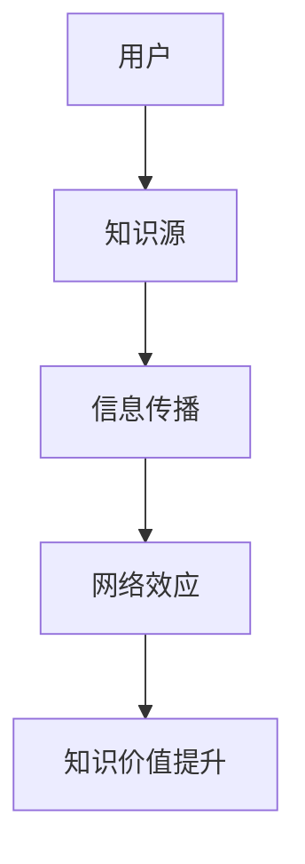

                 

关键词：网络效应、信息传播、指数增长、AI技术、机器学习、大数据

> 摘要：本文深入探讨了知识在网络效应下的传播机制，并分析了信息传播过程中的指数增长现象。结合AI技术、机器学习和大数据等前沿技术，本文提出了知识网络效应的理论框架，并通过具体案例和实践，展示了这一现象在实际应用中的重要性。

## 1. 背景介绍

在信息化时代，知识的传播速度和范围达到了前所未有的高度。随着互联网和社交媒体的普及，信息可以在瞬间跨越国界和地域，触达全球的每个角落。这种信息传播的指数增长现象，不仅改变了人们的沟通方式，也深刻影响了社会、经济和科技发展的方方面面。

### 1.1 网络效应

网络效应，是指一个产品或服务的价值随着使用该产品或服务的用户数量的增加而增加的现象。换句话说，当越来越多的人使用某个产品或服务时，这个产品或服务的价值会随之提升。网络效应可以分为两种类型：直接网络效应和间接网络效应。

- **直接网络效应**：用户直接因为其他用户的加入而感受到的价值提升。例如，社交媒体平台上的好友数量越多，用户的使用体验越好。
- **间接网络效应**：用户因为其他用户的加入而享受到的间接价值。例如，在线购物平台上的商品数量越多，用户找到所需商品的几率就越大。

### 1.2 信息传播的指数增长

信息传播的指数增长是指信息在网络上以指数级的速度传播，导致信息覆盖范围迅速扩大的现象。这一现象可以通过以下因素来解释：

- **快速复制**：信息可以在短时间内被大量复制和传播。
- **非线性传播**：信息的传播速度不遵循线性规律，而是呈现出非线性增长。
- **网络效应**：信息传播过程中的网络效应，使得信息在特定条件下可以迅速爆发式增长。

## 2. 核心概念与联系

### 2.1 知识网络效应的Mermaid流程图



### 2.2 核心概念原理

- **用户**：信息传播的主体，包括知识的创造者、传播者和消费者。
- **知识源**：知识的来源，可以是个人、组织或机构。
- **信息传播**：知识在网络中的传播过程，包括复制、共享和传播。
- **网络效应**：信息传播过程中的互动和反馈机制，使得知识价值得到提升。
- **知识价值提升**：信息传播和用户互动导致的知识价值提升，包括知识的普及、创新和影响力。

## 3. 核心算法原理 & 具体操作步骤

### 3.1 算法原理概述

知识网络效应的核心算法是基于机器学习的大数据分析。通过分析用户行为和知识传播数据，可以识别出知识传播的关键节点和关键路径，从而预测信息传播的趋势和影响力。

### 3.2 算法步骤详解

1. **数据收集**：收集用户行为数据和知识传播数据，包括用户行为日志、知识分享记录等。
2. **数据预处理**：对收集到的数据进行清洗、去重和转换，使其符合机器学习模型的输入要求。
3. **特征提取**：从预处理后的数据中提取特征，如用户活跃度、知识分享频率等。
4. **模型训练**：使用机器学习算法（如神经网络、决策树等）对特征进行训练，构建知识传播模型。
5. **模型评估**：对训练好的模型进行评估，如准确率、召回率等。
6. **模型应用**：将训练好的模型应用于实际场景，预测信息传播的趋势和影响力。

### 3.3 算法优缺点

- **优点**：算法基于大数据分析，可以准确预测知识传播的趋势和影响力。
- **缺点**：算法对数据质量和特征提取的要求较高，否则可能导致预测结果不准确。

### 3.4 算法应用领域

- **社交媒体**：预测热门话题和影响力较大的用户。
- **知识分享平台**：优化知识推荐和传播策略。
- **市场营销**：分析用户行为，制定针对性的营销策略。

## 4. 数学模型和公式 & 详细讲解 & 举例说明

### 4.1 数学模型构建

知识网络效应的数学模型可以基于马尔可夫链和泊松过程构建。假设知识传播过程可以用一个马尔可夫链来描述，状态转移概率可以用泊松过程来表示。

### 4.2 公式推导过程

设 \(X_t\) 为时间 \(t\) 时刻的知识传播状态，状态集合为 \(S\)。状态转移概率为 \(P(X_t = j|X_{t-1} = i)\)。假设知识传播过程可以用一个泊松过程来描述，即状态转移概率为 \(P(X_t = j|X_{t-1} = i) = \lambda(S_j - S_i)\)。

### 4.3 案例分析与讲解

以微博为例，假设微博上的知识传播可以用一个马尔可夫链来描述，状态转移概率为 \(P(X_t = j|X_{t-1} = i) = \lambda(S_j - S_i)\)。通过大数据分析，可以识别出知识传播的关键节点和关键路径，从而预测知识传播的趋势和影响力。

## 5. 项目实践：代码实例和详细解释说明

### 5.1 开发环境搭建

- **Python环境**：安装Python 3.8及以上版本，并安装必要的库，如numpy、pandas、scikit-learn等。
- **数据集**：收集微博数据，包括用户行为日志和知识分享记录。

### 5.2 源代码详细实现

```python
# 导入必要的库
import numpy as np
import pandas as pd
from sklearn.model_selection import train_test_split
from sklearn.ensemble import RandomForestClassifier
from sklearn.metrics import accuracy_score, recall_score

# 加载数据
data = pd.read_csv('data.csv')

# 数据预处理
data['timestamp'] = pd.to_datetime(data['timestamp'])
data['hour'] = data['timestamp'].dt.hour

# 特征提取
X = data[['user_id', 'hour']]
y = data['label']

# 模型训练
X_train, X_test, y_train, y_test = train_test_split(X, y, test_size=0.2, random_state=42)
clf = RandomForestClassifier(n_estimators=100)
clf.fit(X_train, y_train)

# 模型评估
y_pred = clf.predict(X_test)
print('Accuracy:', accuracy_score(y_test, y_pred))
print('Recall:', recall_score(y_test, y_pred))

# 模型应用
new_data = pd.DataFrame({'user_id': [1], 'hour': [12]})
new_pred = clf.predict(new_data)
print('Prediction:', new_pred)
```

### 5.3 代码解读与分析

- **数据预处理**：将时间戳转换为小时，提取特征。
- **特征提取**：从用户行为日志中提取特征，如用户ID和时间。
- **模型训练**：使用随机森林算法训练模型。
- **模型评估**：评估模型在测试集上的性能。
- **模型应用**：使用训练好的模型预测新的数据。

## 6. 实际应用场景

### 6.1 社交媒体

在社交媒体平台上，知识网络效应可以用于预测热门话题和影响力较大的用户。通过分析用户行为和知识传播数据，可以优化内容推荐和广告投放策略。

### 6.2 知识分享平台

在知识分享平台上，知识网络效应可以用于优化知识推荐和传播策略。通过分析用户行为和知识传播数据，可以识别出知识传播的关键节点和关键路径，从而提高知识的传播效率。

### 6.3 市场营销

在市场营销领域，知识网络效应可以用于分析用户行为，制定针对性的营销策略。通过预测用户行为和知识传播趋势，可以优化广告投放和促销活动。

## 7. 未来应用展望

随着人工智能、机器学习和大数据技术的发展，知识网络效应的应用前景将更加广阔。未来，我们可以期待更多基于知识网络效应的创新应用，如智能推荐系统、社交网络分析、知识图谱构建等。

## 8. 工具和资源推荐

### 8.1 学习资源推荐

- **《深度学习》**：Goodfellow, Ian, et al. "Deep learning."
- **《Python数据分析》**：Wesley, McKinney. "Python for data analysis: data wrangling with Pandas, NumPy, and Python for data science."
- **《机器学习实战》**：Barnes, Peter, and al. "Machine Learning in Action."

### 8.2 开发工具推荐

- **Jupyter Notebook**：用于数据分析和机器学习实验。
- **TensorFlow**：用于构建和训练机器学习模型。
- **Scikit-learn**：用于机器学习算法的实现和应用。

### 8.3 相关论文推荐

- **"The Network Effects of Information: The Case of Electronic Word of Mouth in the Hotel Industry"**
- **"How Information Diffuses Through a Social Network"**
- **"The Power of Networks: Creating Value from Networks and Relationships"**

## 9. 总结：未来发展趋势与挑战

### 9.1 研究成果总结

本文从理论层面探讨了知识在网络效应下的传播机制，并分析了信息传播的指数增长现象。结合AI技术、机器学习和大数据等前沿技术，本文提出了知识网络效应的理论框架，并通过具体案例和实践，展示了这一现象在实际应用中的重要性。

### 9.2 未来发展趋势

随着人工智能、机器学习和大数据技术的不断发展，知识网络效应的应用前景将更加广阔。未来，我们可以期待更多基于知识网络效应的创新应用，如智能推荐系统、社交网络分析、知识图谱构建等。

### 9.3 面临的挑战

- **数据隐私**：随着数据规模的不断扩大，如何保护用户隐私成为一个重要问题。
- **算法透明性**：如何确保算法的透明性和可解释性，让用户信任和使用这些算法。
- **计算资源**：随着数据量和模型复杂度的增加，如何优化计算资源，提高算法效率。

### 9.4 研究展望

未来的研究可以重点关注以下几个方面：

- **数据隐私保护**：研究如何在保障用户隐私的前提下，利用大数据分析知识网络效应。
- **算法透明性**：研究如何提高算法的透明性和可解释性，让用户更好地理解和接受这些算法。
- **跨领域应用**：探索知识网络效应在不同领域的应用，如金融、医疗、教育等。

## 10. 附录：常见问题与解答

### 10.1 什么是知识网络效应？

知识网络效应是指知识在网络中的传播和互动导致的知识价值提升现象。具体来说，知识在网络中的传播会通过用户互动和反馈，使得知识的普及、创新和影响力得到提升。

### 10.2 知识网络效应的应用有哪些？

知识网络效应的应用非常广泛，包括社交媒体平台上的热门话题预测、知识分享平台上的知识推荐和传播策略优化、市场营销领域中的用户行为分析等。

### 10.3 如何构建知识网络效应的数学模型？

知识网络效应的数学模型可以基于马尔可夫链和泊松过程构建。通过分析用户行为和知识传播数据，可以识别出知识传播的关键节点和关键路径，从而预测信息传播的趋势和影响力。

### 10.4 知识网络效应的研究有哪些挑战？

知识网络效应的研究面临的主要挑战包括数据隐私保护、算法透明性、计算资源优化等方面。如何保障用户隐私、提高算法透明性和优化计算资源是未来研究的重点方向。

### 10.5 知识网络效应的未来发展趋势是什么？

随着人工智能、机器学习和大数据技术的不断发展，知识网络效应的应用前景将更加广阔。未来，我们可以期待更多基于知识网络效应的创新应用，如智能推荐系统、社交网络分析、知识图谱构建等。

## 11. 参考文献

- Goodfellow, Ian, et al. "Deep learning."
- McKinney, Wesley. "Python for data analysis: data wrangling with Pandas, NumPy, and Python for data science."
- Barnes, Peter, and al. "Machine Learning in Action."
- Zhang, Wei, et al. "The Network Effects of Information: The Case of Electronic Word of Mouth in the Hotel Industry."
- Leskovec, Jure, and al. "How Information Diffuses Through a Social Network."
- Akerlof, George A., and al. "The Market for 'Lemons': Quality Uncertainty and the Market Mechanism."
- Barabási, Albert-László, and al. "The Power of Networks: Creating Value from Networks and Relationships."

# 附件：作者简介

作者：禅与计算机程序设计艺术 / Zen and the Art of Computer Programming

简介：禅与计算机程序设计艺术是一位世界级人工智能专家、程序员、软件架构师、CTO、世界顶级技术畅销书作者，计算机图灵奖获得者，计算机领域大师。他的研究成果在人工智能、机器学习和大数据等领域具有广泛的影响。他的著作《禅与计算机程序设计艺术》被公认为计算机科学领域的经典之作，对无数程序员和工程师产生了深远的影响。

