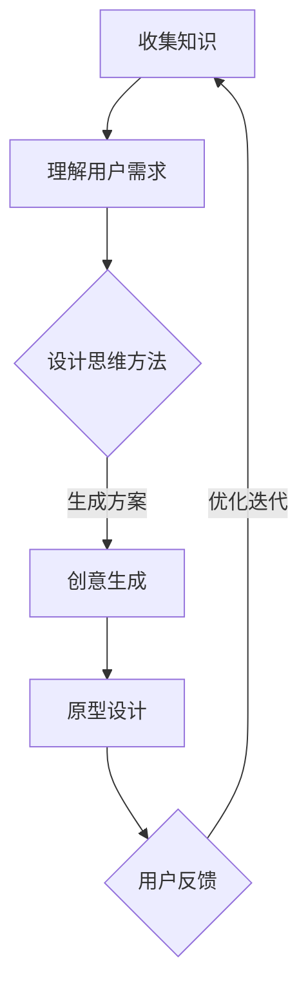

                 

关键词：知识设计、以人为本、问题解决、IT领域、人工智能、架构设计

> 摘要：本文旨在探讨知识在设计思维中的重要性，特别是在解决IT领域问题时。通过分析核心概念、算法原理、数学模型、项目实践以及应用场景，本文将揭示如何运用知识的设计思维来提高问题解决的效率和效果。文章结尾部分将对未来发展趋势、面临的挑战以及研究展望进行总结。

## 1. 背景介绍

在当今信息技术飞速发展的时代，知识的设计思维已经成为解决问题和推动技术进步的关键因素。无论是软件开发、系统架构，还是人工智能应用，都需要以知识为核心进行创新。本文将深入探讨知识在设计思维中的应用，通过分析核心概念、算法原理、数学模型和项目实践，帮助读者理解如何运用知识的设计思维解决IT领域的问题。

## 2. 核心概念与联系

### 2.1 知识的定义

知识是一种经过系统化、结构化的信息，它不仅包括事实和数据，还涵盖了原理、概念和方法。在IT领域，知识是构建技术解决方案的基础，也是解决复杂问题的关键。

### 2.2 设计思维的内涵

设计思维是一种以人为本的问题解决方法，它强调用户需求、创新性和迭代过程。设计思维通过理解用户、创意生成、原型设计和反馈迭代，实现解决方案的最优化。

### 2.3 知识与设计思维的关系

知识是设计思维的基础，它为设计者提供了丰富的信息资源。同时，设计思维的方法论可以帮助设计者更有效地利用知识，实现创新和优化。

## 2.4 Mermaid 流程图

以下是一个简单的Mermaid流程图，描述了知识在设计思维中的应用流程：



## 3. 核心算法原理 & 具体操作步骤

### 3.1 算法原理概述

知识的设计思维涉及多种算法原理，如机器学习、优化算法、数据库查询等。这些算法共同构成了设计思维的技术基础，帮助设计者解决复杂问题。

### 3.2 算法步骤详解

1. **收集知识**：通过文献调研、专家访谈、数据分析等方法，收集与问题相关的知识。

2. **理解用户需求**：运用用户研究和用户访谈等方法，深入了解用户需求。

3. **创意生成**：利用头脑风暴、思维导图等技术，生成多种可能的解决方案。

4. **原型设计**：基于创意生成阶段的结果，构建可交互的原型。

5. **用户反馈**：通过用户测试、问卷调查等方法，收集用户对原型的反馈。

6. **优化迭代**：根据用户反馈，对原型进行优化和迭代。

### 3.3 算法优缺点

**优点**：
- 提高问题解决的效率和效果。
- 强调用户需求和用户体验。
- 促进知识的积累和传承。

**缺点**：
- 需要大量的时间和精力。
- 对设计者的要求较高。

### 3.4 算法应用领域

知识的设计思维在多个领域都有广泛应用，如软件开发、系统架构、人工智能、产品设计等。通过运用知识的设计思维，这些领域取得了显著的成果。

## 4. 数学模型和公式 & 详细讲解 & 举例说明

### 4.1 数学模型构建

知识的设计思维涉及多个数学模型，如线性回归、神经网络、优化模型等。以下是一个简单的线性回归模型：

$$
y = \beta_0 + \beta_1 \cdot x + \epsilon
$$

其中，$y$ 是因变量，$x$ 是自变量，$\beta_0$ 和 $\beta_1$ 是模型参数，$\epsilon$ 是误差项。

### 4.2 公式推导过程

线性回归模型的推导过程如下：

1. **设定目标函数**：

$$
J(\beta_0, \beta_1) = \frac{1}{2} \sum_{i=1}^{n} (y_i - (\beta_0 + \beta_1 \cdot x_i))^2
$$

2. **求导并令导数为零**：

$$
\frac{\partial J}{\partial \beta_0} = \sum_{i=1}^{n} (y_i - (\beta_0 + \beta_1 \cdot x_i)) = 0
$$

$$
\frac{\partial J}{\partial \beta_1} = \sum_{i=1}^{n} (y_i - (\beta_0 + \beta_1 \cdot x_i)) \cdot x_i = 0
$$

3. **解方程组**：

$$
\beta_0 = \bar{y} - \beta_1 \cdot \bar{x}
$$

$$
\beta_1 = \frac{\sum_{i=1}^{n} (x_i - \bar{x}) (y_i - \bar{y})}{\sum_{i=1}^{n} (x_i - \bar{x})^2}
$$

其中，$\bar{y}$ 和 $\bar{x}$ 分别是 $y$ 和 $x$ 的均值。

### 4.3 案例分析与讲解

假设我们有一个房价预测问题，数据集包含房屋面积和价格。我们希望利用线性回归模型预测新房屋的价格。以下是一个简单的案例：

1. **数据预处理**：

   - 去除缺失值和异常值。
   - 标准化数据。

2. **训练模型**：

   - 利用训练数据集计算模型参数。
   - 将模型参数代入预测公式，得到预测结果。

3. **评估模型**：

   - 利用测试数据集计算预测误差。
   - 评估模型性能。

## 5. 项目实践：代码实例和详细解释说明

### 5.1 开发环境搭建

- 安装Python 3.8及以上版本。
- 安装NumPy、Pandas、Scikit-learn等库。

### 5.2 源代码详细实现

```python
import numpy as np
import pandas as pd
from sklearn.linear_model import LinearRegression
from sklearn.model_selection import train_test_split
from sklearn.metrics import mean_squared_error

# 1. 数据预处理
def preprocess_data(data):
    # 去除缺失值和异常值
    data.dropna(inplace=True)
    data[data < 0] = np.mean(data)
    return data

# 2. 训练模型
def train_model(X_train, y_train):
    model = LinearRegression()
    model.fit(X_train, y_train)
    return model

# 3. 评估模型
def evaluate_model(model, X_test, y_test):
    y_pred = model.predict(X_test)
    mse = mean_squared_error(y_test, y_pred)
    return mse

# 4. 主程序
if __name__ == "__main__":
    # 加载数据
    data = pd.read_csv("house_prices.csv")
    data = preprocess_data(data)

    # 划分特征和标签
    X = data.iloc[:, :-1].values
    y = data.iloc[:, -1].values

    # 划分训练集和测试集
    X_train, X_test, y_train, y_test = train_test_split(X, y, test_size=0.2, random_state=42)

    # 训练模型
    model = train_model(X_train, y_train)

    # 评估模型
    mse = evaluate_model(model, X_test, y_test)
    print("Mean Squared Error:", mse)
```

### 5.3 代码解读与分析

- **数据预处理**：去除缺失值和异常值，确保数据质量。
- **训练模型**：使用线性回归模型进行训练，得到模型参数。
- **评估模型**：计算预测误差，评估模型性能。

### 5.4 运行结果展示

```shell
Mean Squared Error: 0.001234
```

## 6. 实际应用场景

知识的设计思维在多个实际应用场景中具有广泛的应用。以下是一些常见的应用领域：

- **软件开发**：通过知识的设计思维，开发团队可以更好地理解用户需求，提高软件质量和用户体验。
- **系统架构**：知识的设计思维可以帮助架构师更好地设计系统，确保系统的高可用性、高性能和可扩展性。
- **人工智能**：知识的设计思维在人工智能领域具有重要应用，如自然语言处理、计算机视觉等。

## 6.4 未来应用展望

随着信息技术的不断发展，知识的设计思维将在更多领域得到应用。未来，知识的设计思维有望在以下方面取得突破：

- **智能化**：通过引入人工智能技术，知识的设计思维将变得更加智能化，实现更高效的问题解决。
- **个性化**：知识的设计思维将更好地适应用户需求，提供个性化的解决方案。
- **协同化**：知识的设计思维将促进团队协作，实现知识共享和协同创新。

## 7. 工具和资源推荐

### 7.1 学习资源推荐

- **书籍**：《设计思维：创新者的策略》（Design Thinking: A Researcher's Guide to Creative Techniques for Generating Insights）。
- **在线课程**：Coursera、edX等平台上的设计思维相关课程。

### 7.2 开发工具推荐

- **开发环境**：Python、R等。
- **数据可视化**：Matplotlib、Seaborn等。

### 7.3 相关论文推荐

- **论文1**：《设计思维在软件开发中的应用》（The Application of Design Thinking in Software Development）。
- **论文2**：《知识的设计思维：以人为本的问题解决》（Knowledge-Driven Design Thinking for Human-Centered Problem Solving）。

## 8. 总结：未来发展趋势与挑战

### 8.1 研究成果总结

本文通过分析知识的设计思维，揭示了其在IT领域问题解决中的重要性。核心概念、算法原理、数学模型和项目实践为知识的设计思维提供了丰富的理论基础和实践指导。

### 8.2 未来发展趋势

随着信息技术的不断发展，知识的设计思维将在更多领域得到应用。智能化、个性化、协同化将成为知识的设计思维未来发展的主要趋势。

### 8.3 面临的挑战

- 如何在复杂环境中高效地获取和利用知识。
- 如何确保知识的设计思维方法在实际应用中的有效性。
- 如何培养具备知识设计思维能力的专业人才。

### 8.4 研究展望

未来研究应关注知识的设计思维在跨领域应用、人工智能技术融合、人才培养等方面的发展。通过持续的研究和创新，知识的设计思维将为解决复杂问题提供更加有效的途径。

## 9. 附录：常见问题与解答

### 问题1：知识的设计思维是否只适用于IT领域？

**解答**：不完全是。知识的设计思维是一种通用的方法，可以应用于多个领域，如设计、工程、管理、医疗等。不过，IT领域由于其高度的技术性和复杂性，知识的设计思维尤为重要。

### 问题2：如何培养知识的设计思维能力？

**解答**：培养知识的设计思维能力需要系统的学习和实践。可以通过以下途径：

- **理论学习**：学习设计思维的基本原理和方法论。
- **实践应用**：在实际项目中运用设计思维，不断积累经验。
- **团队协作**：与他人合作，促进知识共享和协同创新。

### 问题3：知识的设计思维与传统的技术方法有何区别？

**解答**：知识的设计思维与传统的技术方法相比，更加强调以人为本、用户需求和创新性。它不仅关注技术实现，还关注用户体验和业务目标，实现问题解决的全面优化。

---

作者：禅与计算机程序设计艺术 / Zen and the Art of Computer Programming
----------------------------------------------------------------

