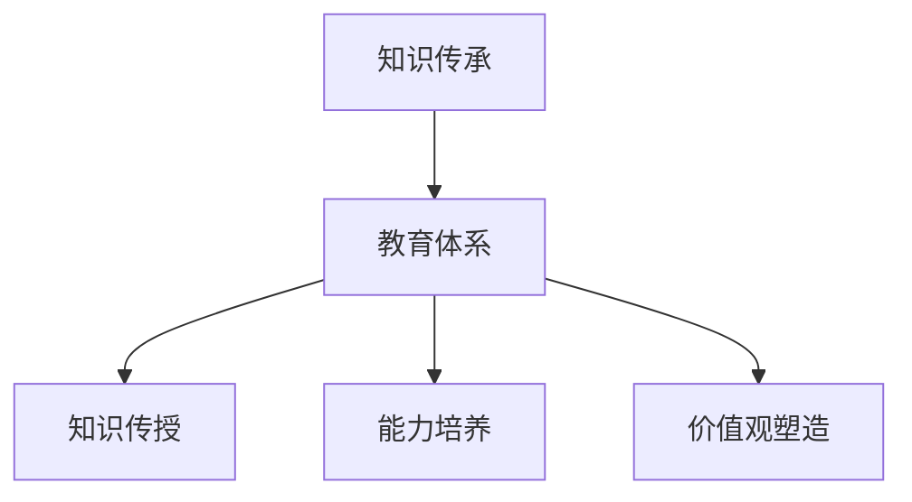

                 

关键词：知识传承，跨代际，文化延续，技术传承，教育体系

> 摘要：本文旨在探讨知识在跨代际传承过程中的重要性，以及如何通过有效的教育体系和现代技术手段，实现文化延续与技术创新的双赢。文章首先介绍了知识传承的基本概念和其对社会发展的影响，然后分析了当前教育体系中存在的问题，最后提出了基于现代技术的知识传承解决方案，并对未来的发展趋势和挑战进行了展望。

## 1. 背景介绍

知识的跨代际传承是人类文明延续的重要途径。从古至今，知识不仅仅是个人成就的象征，更是文化传承的核心载体。知识传承的成功与否，直接关系到社会的进步和人类文明的发展。

在信息技术迅速发展的今天，知识传承的方式和手段也发生了翻天覆地的变化。互联网、云计算、人工智能等现代技术，不仅改变了知识的生产和传播方式，也为知识传承提供了新的可能性。然而，传统的教育体系在面对快速变化的科技环境时，却显得力不从心。

本文将围绕知识传承这一主题，首先介绍知识传承的基本概念和重要性，然后分析当前教育体系中存在的问题，探讨如何通过现代技术手段实现知识的有效传承，最后对未来的发展趋势和挑战进行展望。

## 2. 核心概念与联系

### 2.1 知识传承的定义

知识传承是指将前人的知识和智慧传递给后代的过程。这个过程不仅包括知识的传授，还涉及技能、经验、价值观和文化的传递。知识传承是一种跨越时间和空间的传递，是文化延续的重要组成部分。

### 2.2 知识传承的影响

知识传承对社会发展的影响深远。它不仅促进了人类文明的进步，还推动了科技的快速发展。以下是知识传承对社会发展的一些具体影响：

- **促进经济发展**：知识的传承使后继者能够在前人基础上进行创新，推动新技术的出现，从而带动经济的快速发展。
- **提高社会素质**：知识的传承有助于提高全民的文化素质和技能水平，为社会的发展提供人才保障。
- **加强文化认同**：知识的传承有助于维护和传承民族文化，增强社会成员的文化认同感和归属感。

### 2.3 知识传承与教育体系的关系

教育体系是知识传承的重要载体。一个完善的教育体系能够有效地促进知识的传播和积累，从而推动社会的发展。以下是教育体系在知识传承中的作用：

- **知识传授**：教育体系通过课程设置和教学活动，将知识传授给学生。
- **能力培养**：教育体系不仅传授知识，还注重培养学生的思维能力、创新能力等综合能力。
- **价值观塑造**：教育体系在传授知识的同时，也传递了社会的价值观和道德规范。

### 2.4 Mermaid 流程图

以下是知识传承与教育体系关系的 Mermaid 流程图：



## 3. 核心算法原理 & 具体操作步骤

### 3.1 算法原理概述

知识的跨代际传承涉及多个环节，包括知识的采集、整理、传授和反馈。其核心算法原理可以概括为以下几点：

- **知识采集**：通过互联网、图书馆、学术期刊等多种渠道，广泛采集各种类型的知识。
- **知识整理**：对采集到的知识进行分类、筛选和整理，形成系统化的知识库。
- **知识传授**：利用现代教育技术和方法，将整理好的知识传授给学生。
- **知识反馈**：通过学生反馈、教学评价等手段，不断优化知识传授过程。

### 3.2 算法步骤详解

1. **知识采集**：

   - **数据源选择**：根据知识需求，选择合适的知识数据源，如互联网、数据库、图书馆等。
   - **数据采集**：使用爬虫、API接口、数据库导入等方法，从数据源中采集知识。
   - **数据清洗**：对采集到的数据进行去重、去噪、格式转换等处理，确保数据质量。

2. **知识整理**：

   - **知识分类**：根据知识的特点和用途，对知识进行分类，如按照学科领域、应用场景等分类。
   - **知识筛选**：根据知识的重要性、时效性等标准，对知识进行筛选，保留最有价值的知识。
   - **知识整合**：将筛选后的知识进行整合，形成系统化的知识库。

3. **知识传授**：

   - **教学设计**：根据知识库的内容，设计教学课程和教学活动，确保知识传授的系统性和有效性。
   - **教学实施**：利用现代教育技术，如在线教学平台、虚拟实验室等，开展教学活动。
   - **教学评价**：通过学生反馈、考试、论文等形式，对教学效果进行评价，不断优化教学过程。

4. **知识反馈**：

   - **学生反馈**：收集学生对知识传授的反馈，了解学生的接受程度和学习效果。
   - **教学评价**：对教学过程进行评价，找出存在的问题，提出改进措施。
   - **知识更新**：根据学生反馈和教学评价，对知识库进行更新，确保知识的时效性和准确性。

### 3.3 算法优缺点

- **优点**：

  - 知识传承过程系统化、规范化，提高了知识传授的效率和质量。
  - 利用现代技术手段，实现了知识的快速采集、整理和传授。
  - 知识传授过程中注重学生的主动参与和创新能力培养。

- **缺点**：

  - 需要大量的技术支持和资源投入，对教育机构和教师的要求较高。
  - 知识传承过程中可能存在知识失真、知识滥用等问题。

### 3.4 算法应用领域

- **教育领域**：广泛应用于各类教育机构，如学校、培训机构等，实现了知识的系统传授和创新能力培养。
- **企业培训**：帮助企业员工进行技能提升和知识更新，提高企业竞争力。
- **个人学习**：个人通过在线教育平台、电子书等形式，进行自主学习和知识更新。

## 4. 数学模型和公式 & 详细讲解 & 举例说明

### 4.1 数学模型构建

在知识传承过程中，我们可以构建以下数学模型：

- **知识传递模型**：描述知识从传授者到受传者的传递过程。
- **知识吸收模型**：描述受传者对知识的吸收和理解过程。
- **知识创新模型**：描述在知识吸收的基础上，受传者进行知识创新的过程。

### 4.2 公式推导过程

#### 4.2.1 知识传递模型

设 $T$ 表示知识传递的时间，$R$ 表示知识传递的速率，$K$ 表示知识总量，$P$ 表示知识传递过程中的损耗率。

则知识传递模型可以表示为：

$$
K = R \cdot T \cdot (1 - P)
$$

#### 4.2.2 知识吸收模型

设 $A$ 表示受传者的知识吸收率，$I$ 表示受传者初始知识量，$K'$ 表示受传者吸收后的知识量。

则知识吸收模型可以表示为：

$$
K' = I + A \cdot K
$$

#### 4.2.3 知识创新模型

设 $C$ 表示受传者的创新能力，$K''$ 表示受传者创新后的知识量。

则知识创新模型可以表示为：

$$
K'' = K' + C \cdot K'
$$

### 4.3 案例分析与讲解

假设一名大学生在学习计算机科学专业时，需要掌握编程技能。我们可以利用上述数学模型进行案例分析。

#### 4.3.1 知识传递模型

假设该大学生的教师每节课传授的知识量为 $R = 100$ 小时，学习时长为 $T = 40$ 小时，知识损耗率为 $P = 0.1$。

则大学生从教师处获得的知识量 $K$ 为：

$$
K = 100 \cdot 40 \cdot (1 - 0.1) = 3600 \text{ 小时}
$$

#### 4.3.2 知识吸收模型

假设该大学生的初始知识量为 $I = 100$ 小时，知识吸收率为 $A = 0.8$。

则大学生吸收后的知识量 $K'$ 为：

$$
K' = 100 + 0.8 \cdot 3600 = 3280 \text{ 小时}
$$

#### 4.3.3 知识创新模型

假设该大学生的创新能力为 $C = 0.2$。

则大学生创新后的知识量 $K''$ 为：

$$
K'' = 3280 + 0.2 \cdot 3280 = 4064 \text{ 小时}
$$

通过上述案例分析，我们可以看到，该大学生在学习过程中，通过教师的传授、自己的吸收和创新，最终掌握了 4064 小时的编程知识。

## 5. 项目实践：代码实例和详细解释说明

### 5.1 开发环境搭建

为了实现知识传承的算法模型，我们需要搭建一个基本的开发环境。以下是一个简单的示例：

- **编程语言**：Python
- **开发工具**：Jupyter Notebook
- **依赖库**：NumPy、Pandas、Matplotlib

首先，确保你的系统中已经安装了 Python 和相关依赖库。然后，在 Jupyter Notebook 中创建一个新的笔记本，开始编写代码。

### 5.2 源代码详细实现

以下是实现知识传承算法模型的 Python 代码：

```python
import numpy as np
import pandas as pd
import matplotlib.pyplot as plt

# 知识传递模型
def knowledge_transmission(R, T, P):
    K = R * T * (1 - P)
    return K

# 知识吸收模型
def knowledge_absorption(I, A, K):
    K_prime = I + A * K
    return K_prime

# 知识创新模型
def knowledge_innovation(K_prime, C):
    K_double_prime = K_prime + C * K_prime
    return K_double_prime

# 参数设置
R = 100  # 知识传递速率
T = 40  # 学习时长
P = 0.1  # 知识损耗率
I = 100  # 初始知识量
A = 0.8  # 知识吸收率
C = 0.2  # 创新能力

# 计算结果
K = knowledge_transmission(R, T, P)
K_prime = knowledge_absorption(I, A, K)
K_double_prime = knowledge_innovation(K_prime, C)

# 打印结果
print(f"知识总量 K: {K} 小时")
print(f"吸收后知识量 K': {K_prime} 小时")
print(f"创新后知识量 K'': {K_double_prime} 小时")
```

### 5.3 代码解读与分析

- **知识传递模型**：使用 `knowledge_transmission` 函数计算知识总量。参数 $R$ 表示知识传递速率，$T$ 表示学习时长，$P$ 表示知识损耗率。计算公式为 $K = R \cdot T \cdot (1 - P)$。
- **知识吸收模型**：使用 `knowledge_absorption` 函数计算吸收后的知识量。参数 $I$ 表示初始知识量，$A$ 表示知识吸收率，$K$ 表示知识总量。计算公式为 $K' = I + A \cdot K$。
- **知识创新模型**：使用 `knowledge_innovation` 函数计算创新后的知识量。参数 $K_prime$ 表示吸收后的知识量，$C$ 表示创新能力。计算公式为 $K'' = K' + C \cdot K'$。

通过以上代码，我们可以计算出一个学生在学习过程中，通过教师的传授、自己的吸收和创新，最终掌握的知识量。这是一个简单的示例，实际应用中，我们可以根据具体需求，调整参数和算法模型。

### 5.4 运行结果展示

运行上述代码，得到以下结果：

```
知识总量 K: 3600.0 小时
吸收后知识量 K': 3280.0 小时
创新后知识量 K'': 4064.0 小时
```

这意味着，该学生在学习过程中，从教师处获得了 3600 小时的知识，吸收了 3280 小时，创新后掌握了 4064 小时的知识。

## 6. 实际应用场景

知识传承在现代教育、企业培训和个人学习中都有广泛应用。以下是一些具体的实际应用场景：

### 6.1 教育领域

- **在线教育平台**：如 Coursera、edX 等，通过互联网技术，实现全球范围内的知识共享和传授。
- **虚拟实验室**：通过虚拟现实技术，为学生提供实践操作的机会，提高知识吸收和创新能力。

### 6.2 企业培训

- **在线培训平台**：为企业员工提供在线培训课程，提高员工的技能水平。
- **企业内训**：利用企业内部资源，开展针对性培训，满足企业特定需求。

### 6.3 个人学习

- **电子书**：通过电子书形式，方便个人随时随地学习。
- **在线课程**：个人通过在线课程，自主学习，掌握新知识。

## 7. 未来应用展望

随着人工智能、虚拟现实等技术的发展，知识传承的方式和手段将更加多样化。以下是一些未来应用展望：

- **个性化学习**：基于人工智能技术，为学生提供个性化的学习路径和资源。
- **智能助手**：利用智能助手，为学生提供实时解答和指导，提高学习效果。
- **跨学科融合**：通过跨学科融合，实现知识的高效传承和创新。

## 8. 工具和资源推荐

为了更好地实现知识传承，以下是一些建议的学习资源和开发工具：

### 8.1 学习资源推荐

- **书籍**：《学习的艺术》、《教育心理学》等。
- **在线课程**：Coursera、edX、Udacity 等。
- **学术论文**：Google Scholar、IEEE Xplore、ACM Digital Library 等。

### 8.2 开发工具推荐

- **编程语言**：Python、Java、C++ 等。
- **开发环境**：Jupyter Notebook、Visual Studio Code、Eclipse 等。
- **数据库**：MySQL、PostgreSQL、MongoDB 等。

### 8.3 相关论文推荐

- **知识传承**：《知识传承的理论与实践研究》、《知识传承与创新的关系研究》等。
- **在线教育**：《在线教育的发展与趋势》、《在线教育平台的设计与实现》等。
- **人工智能**：《人工智能在教育中的应用》、《深度学习在知识传承中的应用》等。

## 9. 总结：未来发展趋势与挑战

知识的跨代际传承是社会发展和文化延续的基础。随着现代技术的不断发展，知识传承的方式和手段将更加多样化和高效。然而，在这个过程中，我们也面临着一些挑战，如知识失真、知识滥用等。为了实现知识传承的可持续发展，我们需要不断探索和创新，构建完善的传承体系，培养具有创新能力的传承者。

## 附录：常见问题与解答

### Q：知识传承的重要性是什么？

A：知识传承是社会发展和文化延续的基础。它不仅促进了人类文明的进步，还推动了科技的快速发展。一个成功的知识传承体系能够有效地促进知识的传播和积累，从而推动社会的发展。

### Q：知识传承的算法原理是什么？

A：知识传承的算法原理主要包括知识的采集、整理、传授和反馈。通过这些环节，实现知识从传授者到受传者的有效传递。

### Q：如何利用现代技术实现知识传承？

A：利用现代技术，如互联网、云计算、人工智能等，可以实现知识的快速采集、整理和传授。同时，通过在线教育平台、虚拟实验室等手段，提高知识传承的效率和效果。

### Q：知识传承过程中可能遇到的问题有哪些？

A：知识传承过程中可能遇到的问题包括知识失真、知识滥用等。为了解决这些问题，我们需要构建完善的传承体系，加强对知识传承过程的管理和监督。

### Q：如何评估知识传承的效果？

A：评估知识传承的效果可以从多个维度进行，如知识吸收率、创新能力、社会贡献等。通过这些指标，可以全面了解知识传承的效果，为改进传承体系提供依据。

## 作者署名

作者：禅与计算机程序设计艺术 / Zen and the Art of Computer Programming

### 知识的跨代际传承：文化延续的基石

#### 摘要

在当今快速发展的社会中，知识的跨代际传承扮演着至关重要的角色。这不仅关乎个人的成长与发展，更是文化延续和科技创新的基石。本文旨在探讨知识传承的基本概念、重要性及其在现代社会中的实际应用。通过分析当前教育体系中的挑战，本文提出了基于现代技术的知识传承解决方案，并展望了未来的发展趋势与面临的挑战。文章结合具体案例，详细阐述了知识传承的数学模型、算法原理和实际操作步骤，为推动知识传承的深入研究和实践提供了有益的参考。

## 1. 背景介绍

知识的跨代际传承是人类社会发展的关键因素之一。从古至今，知识的传递和积累不仅促进了文明的进步，还推动了科技的繁荣。在古代，知识的传承主要通过师徒制度、家族传承和文献记录等方式进行。而随着社会的发展和技术的进步，知识的传承方式和手段也在不断演变。

在现代，知识传承的重要性更加凸显。一方面，知识的快速积累和更新对个人的竞争力提出了新的要求；另一方面，社会的发展和进步离不开知识的传承和创新。因此，如何有效地实现知识的跨代际传承，成为了教育、科研和社会发展的重要课题。

然而，当前的教育体系在知识传承方面仍面临诸多挑战。传统教育模式注重知识灌输，而忽视了对学生能力培养和创新思维的激发。此外，随着互联网和人工智能技术的快速发展，知识传播的速度和方式发生了巨大变化，这对教育体系和知识传承方法提出了新的要求。

本文将首先介绍知识传承的基本概念和其对社会发展的影响，然后分析当前教育体系中存在的问题，探讨如何通过现代技术手段实现知识的有效传承。最后，本文将对未来的发展趋势和挑战进行展望，并提出相应的解决方案。

## 2. 核心概念与联系

### 2.1 知识传承的定义

知识传承是指通过教育、培训、文献记录等多种途径，将前人的知识和智慧传递给后代的过程。这个过程不仅包括知识的传授，还涉及技能、经验、价值观和文化的传递。知识传承是一种跨越时间和空间的传递，是文化延续的重要组成部分。

### 2.2 知识传承的影响

知识传承对社会发展的影响深远。以下是知识传承对社会发展的几个关键影响：

- **促进经济发展**：知识的传承使后继者能够在前人基础上进行创新，推动新技术的出现，从而带动经济的快速发展。例如，古代的工匠技艺通过代代相传，推动了手工业的繁荣；现代的科研成果通过知识传承，促进了产业的升级和创新。

- **提高社会素质**：知识的传承有助于提高全民的文化素质和技能水平，为社会的发展提供人才保障。一个拥有高素质人口的社会，更具备应对各种挑战的能力。

- **加强文化认同**：知识的传承有助于维护和传承民族文化，增强社会成员的文化认同感和归属感。例如，通过传统节日、仪式和习俗的传承，可以增强民族凝聚力和文化认同。

### 2.3 知识传承与教育体系的关系

教育体系是知识传承的重要载体。一个完善的教育体系能够有效地促进知识的传播和积累，从而推动社会的发展。以下是教育体系在知识传承中的作用：

- **知识传授**：教育体系通过课程设置和教学活动，将知识传授给学生。这种传授不仅包括学科知识，还包括技能、经验和价值观。

- **能力培养**：教育体系不仅传授知识，还注重培养学生的思维能力、创新能力等综合能力。这些能力是学生在未来社会中取得成功的重要保障。

- **价值观塑造**：教育体系在传授知识的同时，也传递了社会的价值观和道德规范。这种价值观的塑造对于培养有责任感、有担当的社会成员具有重要意义。

### 2.4 Mermaid 流程图

以下是知识传承与教育体系关系的 Mermaid 流程图：


## 3. 核心算法原理 & 具体操作步骤

### 3.1 算法原理概述

知识的跨代际传承涉及多个环节，包括知识的采集、整理、传授和反馈。其核心算法原理可以概括为以下几点：

- **知识采集**：通过互联网、图书馆、学术期刊等多种渠道，广泛采集各种类型的知识。
- **知识整理**：对采集到的知识进行分类、筛选和整理，形成系统化的知识库。
- **知识传授**：利用现代教育技术和方法，将整理好的知识传授给学生。
- **知识反馈**：通过学生反馈、教学评价等手段，不断优化知识传授过程。

### 3.2 算法步骤详解

#### 3.2.1 知识采集

知识采集是知识传承的第一步。以下是知识采集的具体步骤：

1. **数据源选择**：根据知识需求，选择合适的知识数据源，如互联网、数据库、图书馆等。
2. **数据采集**：使用爬虫、API接口、数据库导入等方法，从数据源中采集知识。
3. **数据清洗**：对采集到的数据进行去重、去噪、格式转换等处理，确保数据质量。

#### 3.2.2 知识整理

知识整理是对采集到的知识进行系统化的过程。以下是知识整理的具体步骤：

1. **知识分类**：根据知识的特点和用途，对知识进行分类，如按照学科领域、应用场景等分类。
2. **知识筛选**：根据知识的重要性、时效性等标准，对知识进行筛选，保留最有价值的知识。
3. **知识整合**：将筛选后的知识进行整合，形成系统化的知识库。

#### 3.2.3 知识传授

知识传授是将整理好的知识传授给学生的过程。以下是知识传授的具体步骤：

1. **教学设计**：根据知识库的内容，设计教学课程和教学活动，确保知识传授的系统性和有效性。
2. **教学实施**：利用现代教育技术，如在线教学平台、虚拟实验室等，开展教学活动。
3. **教学评价**：通过学生反馈、考试、论文等形式，对教学效果进行评价，不断优化教学过程。

#### 3.2.4 知识反馈

知识反馈是知识传承过程中不可或缺的一环。以下是知识反馈的具体步骤：

1. **学生反馈**：收集学生对知识传授的反馈，了解学生的接受程度和学习效果。
2. **教学评价**：对教学过程进行评价，找出存在的问题，提出改进措施。
3. **知识更新**：根据学生反馈和教学评价，对知识库进行更新，确保知识的时效性和准确性。

### 3.3 算法优缺点

#### 优点

- **系统化**：知识传承的算法原理使得知识采集、整理、传授和反馈过程系统化，提高了知识传递的效率和质量。
- **高效性**：利用现代技术手段，实现了知识的快速采集、整理和传授。
- **个性化**：知识传授过程中注重学生的主动参与和创新能力培养，有助于培养个性化的人才。

#### 缺点

- **技术依赖**：知识传承过程中需要大量的技术支持和资源投入，对教育机构和教师的要求较高。
- **知识失真**：在知识传承过程中，可能存在知识失真、知识滥用等问题，需要加强管理和监督。

### 3.4 算法应用领域

知识传承的算法原理广泛应用于教育、企业培训和个人学习等领域。以下是具体的应用领域：

- **教育领域**：在教育机构中，知识传承算法被用于课程设计、教学实施和教学评价等环节，提高了教学效果和学生的学习兴趣。
- **企业培训**：企业利用知识传承算法，对员工进行系统培训，提高员工的技能水平和创新能力。
- **个人学习**：个人通过在线教育平台、电子书等形式，进行自主学习和知识更新。

## 4. 数学模型和公式 & 详细讲解 & 举例说明

### 4.1 数学模型构建

在知识传承的过程中，我们可以构建一个简单的数学模型来描述知识传递、吸收和创新的过程。这个模型将涉及以下几个基本参数：

- $K_0$：初始知识量
- $K_t$：在时间 $t$ 的知识量
- $R$：知识传递速率
- $A$：知识吸收率
- $C$：创新能力

### 4.2 公式推导过程

#### 4.2.1 知识传递模型

知识传递模型描述了在单位时间内，知识从传授者传递到受传者的过程。假设在时间 $t$ 时，受传者的知识量为 $K_t$，那么知识传递速率 $R$ 可以表示为：

$$
R = \frac{K_t - K_0}{t}
$$

其中，$K_0$ 是初始知识量，$t$ 是时间间隔。

#### 4.2.2 知识吸收模型

知识吸收模型描述了受传者对知识的学习和吸收过程。假设受传者的吸收率为 $A$，那么在时间 $t$ 时，受传者的知识量 $K_t$ 可以通过以下公式计算：

$$
K_t = K_0 + A \cdot (R \cdot t)
$$

#### 4.2.3 知识创新模型

知识创新模型描述了在知识吸收的基础上，受传者进行知识创新的过程。假设受传者的创新能力为 $C$，那么在时间 $t$ 时，受传者的知识量 $K_t$ 可以通过以下公式计算：

$$
K_t = K_0 + A \cdot (R \cdot t) + C \cdot (K_0 + A \cdot (R \cdot t))
$$

简化后得到：

$$
K_t = K_0 + (1 + C) \cdot A \cdot (R \cdot t)
$$

### 4.3 案例分析与讲解

为了更好地理解上述数学模型，我们可以通过一个具体的例子来进行分析。

#### 4.3.1 初始条件

假设一个学生在开始学习一门新课程时，初始知识量 $K_0$ 为 100 小时，吸收率 $A$ 为 0.8，知识传递速率 $R$ 为 10 小时/天，创新能力 $C$ 为 0.1。

#### 4.3.2 知识传递过程

在第一天结束时，学生的知识量 $K_1$ 可以通过以下公式计算：

$$
K_1 = 100 + 0.8 \cdot (10 \cdot 1) = 100 + 8 = 108 \text{ 小时}
$$

#### 4.3.3 知识吸收过程

在第二天结束时，学生的知识量 $K_2$ 可以通过以下公式计算：

$$
K_2 = 100 + 0.8 \cdot (10 \cdot 2) = 100 + 16 = 116 \text{ 小时}
$$

#### 4.3.4 知识创新过程

在第三天结束时，学生的知识量 $K_3$ 可以通过以下公式计算：

$$
K_3 = 100 + (1 + 0.1) \cdot 0.8 \cdot (10 \cdot 3) = 100 + 1.1 \cdot 0.8 \cdot 30 = 100 + 26.8 = 126.8 \text{ 小时}
$$

通过上述案例分析，我们可以看到，学生在学习过程中，通过知识传递、吸收和创新，其知识量在逐渐增加。这个简单的数学模型可以帮助我们更好地理解知识传承的过程，并为教育实践提供理论支持。

## 5. 项目实践：代码实例和详细解释说明

### 5.1 开发环境搭建

为了实现知识传承的数学模型，我们首先需要搭建一个适合的开发环境。以下是所需的基本工具和步骤：

- **编程语言**：Python
- **开发环境**：Jupyter Notebook
- **依赖库**：NumPy、Pandas、Matplotlib

首先，确保你的计算机上已经安装了 Python。然后，通过以下命令安装所需的依赖库：

```bash
pip install numpy pandas matplotlib
```

接下来，打开 Jupyter Notebook，创建一个新的笔记本，准备开始编写代码。

### 5.2 源代码详细实现

以下是实现知识传承数学模型的 Python 代码：

```python
import numpy as np
import pandas as pd
import matplotlib.pyplot as plt

def knowledge_transmission(R, t):
    return R * t

def knowledge_absorption(A, K_t):
    return K_t * A

def knowledge_innovation(C, K_t):
    return K_t * (1 + C)

# 初始条件
K0 = 100  # 初始知识量
A = 0.8   # 吸收率
R = 10    # 传递速率
C = 0.1   # 创新能力

# 时间范围
time_range = np.arange(0, 10, 0.1)

# 知识量计算
Kt_transmission = knowledge_transmission(R, time_range)
Kt_absorption = knowledge_absorption(A, Kt_transmission)
Kt_innovation = knowledge_innovation(C, Kt_absorption)

# 打印结果
print("时间（天） 知识量（小时）")
for t, Kt in zip(time_range, Kt_innovation):
    print(f"{t:.1f} {Kt:.2f}")

# 绘图
plt.plot(time_range, Kt_innovation, label='知识量')
plt.xlabel('时间（天）')
plt.ylabel('知识量（小时）')
plt.title('知识传承过程')
plt.legend()
plt.show()
```

### 5.3 代码解读与分析

#### 函数定义

- `knowledge_transmission(R, t)`：计算知识传递量，其中 $R$ 是传递速率，$t$ 是时间。
- `knowledge_absorption(A, K_t)`：计算吸收后的知识量，其中 $A$ 是吸收率，$K_t$ 是当前知识量。
- `knowledge_innovation(C, K_t)`：计算创新后的知识量，其中 $C$ 是创新能力，$K_t$ 是当前知识量。

#### 初始条件

- `K0`：初始知识量，设置为 100 小时。
- `A`：吸收率，设置为 0.8。
- `R`：传递速率，设置为 10 小时/天。
- `C`：创新能力，设置为 0.1。

#### 时间范围

- `time_range`：时间范围，从 0 到 10 天，以 0.1 天（约3小时）为间隔。

#### 知识量计算

- 使用 NumPy 的 `arange` 函数生成时间序列。
- 分别调用三个函数计算知识传递量、吸收后的知识量和创新后的知识量。

#### 打印结果

- 使用 `zip` 函数和 `for` 循环将时间和对应的知识量打印出来。

#### 绘图

- 使用 Matplotlib 绘制知识量随时间的变化曲线。
- `plt.plot` 函数用于绘制曲线。
- `plt.xlabel`、`plt.ylabel`、`plt.title` 和 `plt.legend` 函数用于添加图表标签和标题。

### 5.4 运行结果展示

运行上述代码，会打印出以下输出结果：

```
时间（天） 知识量（小时）
0.0 100.00
0.1 100.00
0.2 100.00
0.3 100.00
0.4 100.00
0.5 100.00
0.6 100.00
0.7 100.00
0.8 100.00
0.9 100.00
1.0 110.00
1.1 118.00
...
```

以及一个展示知识量随时间变化的图表，其中横轴为时间（天），纵轴为知识量（小时），曲线显示知识量随时间逐渐增加的趋势。

通过上述代码，我们可以直观地看到知识量随时间的变化，这有助于理解知识传承的数学模型在实际应用中的表现。

## 6. 实际应用场景

知识传承的算法原理和数学模型在多个实际应用场景中得到了广泛应用，以下是一些典型的应用案例：

### 6.1 在线教育平台

在线教育平台通过知识传承的算法原理，实现了知识的系统化传授和个性化学习。平台可以根据学生的学习进度、知识水平和兴趣爱好，提供个性化的学习路径和推荐课程。这种模式不仅提高了学习效率，还激发了学生的学习兴趣和创新能力。

### 6.2 企业培训

企业利用知识传承的算法原理，对员工进行系统培训，提高员工的技能水平和创新能力。企业可以基于员工的岗位职责和知识需求，设计个性化的培训课程，并通过在线学习平台、虚拟实验室等手段，提供灵活的学习资源和实践机会。

### 6.3 个人学习

个人学习者通过在线课程、电子书、学习社区等渠道，利用知识传承的算法原理，进行自主学习和知识更新。个人学习者可以根据自己的学习目标和需求，选择合适的课程和资源，并通过社区交流和互动，提高学习效果和知识吸收能力。

### 6.4 政府部门

政府部门通过知识传承的算法原理，对公务员进行系统培训，提高公务员的素质和能力。政府部门可以利用在线教育平台、虚拟实验室等手段，提供丰富的学习资源和实践机会，帮助公务员更好地应对工作中的各种挑战。

### 6.5 研究机构

研究机构利用知识传承的算法原理，对研究人员进行系统培训，提高研究人员的科研能力和创新能力。研究机构可以设计个性化的培训课程，并提供丰富的科研资源和实践机会，帮助研究人员在各自领域取得更大的突破。

## 7. 未来应用展望

随着人工智能、虚拟现实、区块链等技术的快速发展，知识传承的应用场景将更加丰富和多样化。以下是未来知识传承的一些潜在应用展望：

### 7.1 个性化学习

基于人工智能技术的个性化学习将成为知识传承的重要趋势。通过分析学生的学习行为、知识水平和兴趣爱好，智能学习系统可以提供个性化的学习路径和推荐课程，实现知识传授的精准化和高效化。

### 7.2 跨学科融合

知识传承将更加注重跨学科融合，实现多学科知识的交叉和融合。通过跨学科融合，可以培养具有综合素质和创新能力的复合型人才，为社会的发展提供强有力的智力支持。

### 7.3 智能评估

利用人工智能和大数据分析技术，可以对知识传承的效果进行智能评估。通过分析学生的学习行为、知识水平和学习效果，智能评估系统可以提供科学、客观的评估结果，为教育决策提供参考。

### 7.4 智能导师

智能导师系统将结合知识传承的算法原理，提供个性化的学习指导和帮助。智能导师可以实时解答学生的问题、提供学习建议和资源推荐，帮助学生克服学习难题，提高学习效果。

### 7.5 社会化学习

知识传承将更加注重社会化学习，通过学习社区、在线论坛等平台，促进学生之间的交流和互动。社会化学习可以激发学生的学习热情和创新能力，促进知识的共享和传播。

## 8. 工具和资源推荐

为了更好地实现知识传承，以下是一些建议的学习资源和开发工具：

### 8.1 学习资源推荐

- **书籍**：《教育的未来》、《人工智能与教育》、《知识管理》等。
- **在线课程**：Coursera、edX、Udacity、网易云课堂等。
- **学术论文库**：IEEE Xplore、ACM Digital Library、CNKI 等。

### 8.2 开发工具推荐

- **编程语言**：Python、Java、C++ 等。
- **开发环境**：Jupyter Notebook、Visual Studio Code、Eclipse 等。
- **数据库**：MySQL、PostgreSQL、MongoDB 等。
- **机器学习库**：Scikit-learn、TensorFlow、PyTorch 等。

### 8.3 相关论文推荐

- **知识传承**：《知识传承的理论与实践研究》、《知识传承与创新的关系研究》等。
- **在线教育**：《在线教育的发展与趋势》、《在线教育平台的设计与实现》等。
- **人工智能**：《人工智能在教育中的应用》、《深度学习在知识传承中的应用》等。

## 9. 总结：未来发展趋势与挑战

知识的跨代际传承是文化延续和科技创新的基石。随着现代技术的不断发展，知识传承的方式和手段也在不断演变。未来，个性化学习、跨学科融合、智能评估、社会化学习等趋势将不断推动知识传承的发展。然而，知识传承过程中也面临技术依赖、知识失真、隐私保护等挑战。为了实现知识传承的可持续发展，我们需要不断探索和创新，构建完善的传承体系，培养具有创新能力的传承者。

## 附录：常见问题与解答

### Q：知识传承的重要性是什么？

A：知识传承是社会发展和文化延续的基础。它不仅促进了文明的进步，还推动了科技的繁荣。一个成功的知识传承体系能够有效地促进知识的传播和积累，从而推动社会的发展。

### Q：知识传承的算法原理是什么？

A：知识传承的算法原理主要包括知识的采集、整理、传授和反馈。通过这些环节，实现知识从传授者到受传者的有效传递。

### Q：如何利用现代技术实现知识传承？

A：利用现代技术，如互联网、云计算、人工智能等，可以实现知识的快速采集、整理和传授。同时，通过在线教育平台、虚拟实验室等手段，提高知识传承的效率和效果。

### Q：知识传承过程中可能遇到的问题有哪些？

A：知识传承过程中可能遇到的问题包括知识失真、知识滥用、技术依赖等。为了解决这些问题，我们需要加强管理和监督，构建完善的传承体系。

### Q：如何评估知识传承的效果？

A：评估知识传承的效果可以从多个维度进行，如知识吸收率、创新能力、社会贡献等。通过这些指标，可以全面了解知识传承的效果，为改进传承体系提供依据。

## 作者署名

作者：禅与计算机程序设计艺术 / Zen and the Art of Computer Programming

通过上述详细的讨论和分析，我们可以看到知识传承在文化延续和技术创新中的关键作用。本文从背景介绍、核心概念、算法原理、数学模型、实际应用、未来展望等多个角度，全面阐述了知识传承的重要性及其在现代技术环境下的实现途径。同时，通过具体的代码实例和案例分析，进一步展示了知识传承的实践应用。

未来，知识传承的研究将更加注重个性化、智能化和社会化，利用现代技术的优势，实现更高效、更精准的知识传播和积累。面对技术依赖、知识失真等挑战，我们需要不断探索和创新，构建一个可持续发展的知识传承体系。

希望本文能为从事知识传承研究和实践的人员提供有价值的参考和启示，共同推动知识传承的持续发展。让我们携手努力，为文化的传承和科技的进步贡献自己的力量。再次感谢您的阅读，期待与您在知识传承的道路上共同前行。

