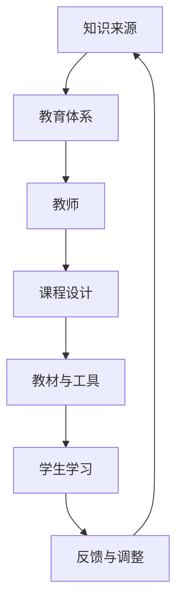

                 

关键词：教育体系、知识传承、技术进化、跨代际、认知科学、未来趋势

> 摘要：本文深入探讨了知识跨代际传递在教育体系中的重要性，分析了教育体系的历史演变过程，探讨了当前面临的挑战以及未来可能的趋势。通过结合认知科学和计算机技术的最新进展，本文提出了构建更加有效和适应未来的教育体系的方法。

## 1. 背景介绍

在教育体系中，知识的跨代际传递是一个关键过程。历史上，知识主要通过师徒制、家庭传承和书籍等方式进行传递。然而，随着科技的进步和社会的变迁，教育体系也经历了巨大的变革。从古代的学堂到现代的在线教育，知识传递的方式和效率都发生了显著变化。然而，这种变化也带来了新的挑战。

首先，现代教育体系中知识量的爆炸式增长使得传统教育模式难以跟上。学生需要掌握的知识点越来越多，而学习时间却相对有限。其次，信息时代的到来使得知识更新的速度加快，传统的知识传递方式难以应对这种快速变化。此外，全球化的趋势也要求教育体系具备更高的灵活性和适应性，以适应不同地区和文化的需求。

## 2. 核心概念与联系

为了更好地理解教育体系中的知识跨代际传递，我们需要了解以下几个核心概念：

### 2.1 教育体系

教育体系是一个包含学校、教师、学生、教材、课程设置、教育政策和实践等多个要素的复杂系统。它不仅负责知识的传递，还承担着培养人才、促进社会进步等重要职责。

### 2.2 知识传承

知识传承是指将前人的经验、知识和智慧传递给下一代的过程。这是一个跨代际的持续过程，涉及到教育体系中的各个层面。

### 2.3 认知科学

认知科学是一门研究人类认知过程的学科，包括感知、记忆、语言、思维和意识等方面。认知科学的研究成果对于优化教育方法和提高学习效率具有重要意义。

### 2.4 技术进化

技术进化是指随着科技的进步，教育工具、方法和内容不断更新和演变的过程。技术进化对教育体系产生了深远的影响，推动了知识跨代际传递的变革。

以下是一个简化的 Mermaid 流程图，展示了教育体系中知识跨代际传递的基本流程：



## 3. 核心算法原理 & 具体操作步骤

### 3.1 算法原理概述

教育体系中的知识跨代际传递可以看作是一个基于认知科学的优化问题。其核心思想是通过分析学生的认知过程，设计出更有效、更适应个体差异的教育方法。

### 3.2 算法步骤详解

#### 3.2.1 分析学生认知过程

首先，需要收集和分析学生的认知数据，包括学习习惯、知识掌握程度、学习偏好等。这可以通过在线教育平台、学习管理系统等多种途径实现。

#### 3.2.2 设计个性化课程

基于学生认知数据，教师和教育技术专家可以共同设计出个性化的课程。这个课程不仅要涵盖必要的基础知识，还要根据学生的兴趣和能力进行适当调整。

#### 3.2.3 实施教学活动

在教学过程中，教师应采用多样化的教学方法和工具，如互动式教学、项目式学习、虚拟现实等，以激发学生的学习兴趣和积极性。

#### 3.2.4 收集反馈并调整

教学结束后，教师应收集学生的反馈，包括学习效果、满意度等，并根据这些反馈对课程进行调整。

### 3.3 算法优缺点

#### 优点：

- **个性化：**能够根据学生的特点进行个性化教学，提高学习效果。
- **适应性强：**能够适应不同地区、不同文化背景的学生，具有广泛的适用性。
- **高效性：**利用现代技术手段，提高教学效率，缩短学习周期。

#### 缺点：

- **技术依赖：**需要依赖先进的教育技术和工具，对于资源和技术水平较低的地区可能存在一定难度。
- **教师培训：**对教师提出了更高的要求，需要教师具备一定的技术素养和教育心理学知识。

### 3.4 算法应用领域

该算法主要应用于中小学教育和高等教育，特别是在语言学习、数学、科学等领域。此外，它也可以应用于职业培训和继续教育，帮助职场人士不断更新知识和技能。

## 4. 数学模型和公式 & 详细讲解 & 举例说明

在教育体系中，数学模型和公式可以用于量化学生的学习效果、评估教育质量以及优化教学策略。以下是一个简单的数学模型，用于描述学生在某门课程中的学习过程。

### 4.1 数学模型构建

假设学生 \( S \) 在某门课程 \( C \) 中的学习过程可以用以下公式表示：

\[ L(t) = f(S, C, t) \]

其中：

- \( L(t) \)：学生在时间 \( t \) 时的学习水平。
- \( S \)：学生的初始能力和学习习惯。
- \( C \)：课程的难度、内容和教学方法。
- \( t \)：学习时间。

### 4.2 公式推导过程

学习水平 \( L(t) \) 可以通过以下步骤推导：

1. **初始条件**：设定学生 \( S \) 的初始学习水平 \( L(0) \)。

\[ L(0) = S_0 \]

2. **学习过程**：学生通过学习课程 \( C \)，其学习水平随时间 \( t \) 变化。

\[ L(t) = S_0 + \int_{0}^{t} f(C, \Delta t) d\Delta t \]

其中，\( \Delta t \) 表示每个学习阶段的时间间隔，\( f(C, \Delta t) \) 表示在每个时间间隔内学生学习的效率。

3. **学习效率**：学习效率 \( f(C, \Delta t) \) 可以用以下公式表示：

\[ f(C, \Delta t) = \frac{C}{\Delta t} \]

其中，\( C \) 表示课程的难度，\( \Delta t \) 表示学习时间。

4. **综合公式**：将上述公式综合，得到学生在时间 \( t \) 时的学习水平 \( L(t) \)：

\[ L(t) = S_0 + C \cdot t \]

### 4.3 案例分析与讲解

假设一个学生在数学课程中学习，课程难度为 100，学生初始学习水平为 50，学习时间为 2 周。根据上述公式，我们可以计算学生在 2 周后的学习水平：

\[ L(2) = 50 + 100 \cdot 2 = 250 \]

这意味着，学生在 2 周后的学习水平为 250。

## 5. 项目实践：代码实例和详细解释说明

为了更好地理解教育体系中的知识跨代际传递，我们通过一个简单的 Python 代码实例来模拟学生的学习过程。

### 5.1 开发环境搭建

首先，确保安装了 Python 3.8 或以上版本。可以使用以下命令安装必要的库：

```shell
pip install numpy matplotlib
```

### 5.2 源代码详细实现

以下是一个简单的 Python 代码实例，用于模拟学生在数学课程中的学习过程：

```python
import numpy as np
import matplotlib.pyplot as plt

# 学习过程函数
def learning_process(initial_level, difficulty, duration):
    time_points = np.linspace(0, duration, duration * 10)
    learning_levels = initial_level + difficulty * time_points
    
    return time_points, learning_levels

# 参数设置
initial_level = 50  # 初始学习水平
difficulty = 100  # 课程难度
duration = 2 * 7 * 24  # 学习时间，单位为小时

# 模拟学习过程
time_points, learning_levels = learning_process(initial_level, difficulty, duration)

# 绘制学习曲线
plt.plot(time_points, learning_levels)
plt.xlabel('Time (hours)')
plt.ylabel('Learning Level')
plt.title('Learning Process')
plt.show()
```

### 5.3 代码解读与分析

该代码首先定义了一个名为 `learning_process` 的函数，用于模拟学生在某门课程中的学习过程。函数接受初始学习水平、课程难度和学习时间作为参数。

在函数内部，使用 `numpy.linspace` 函数生成一个时间点列表，用于表示学习过程的各个时间点。然后，通过简单的算术运算计算学生在每个时间点上的学习水平。

最后，使用 `matplotlib.pyplot` 库绘制学习曲线，展示了学生在整个学习过程中的学习水平变化。

### 5.4 运行结果展示

运行上述代码后，将弹出一个窗口，显示学生在 2 周学习过程中的学习水平变化曲线。从图中可以看出，随着学习时间的增加，学生的学习水平逐步提高。

## 6. 实际应用场景

知识跨代际传递在教育体系中有着广泛的应用场景。以下是一些典型的应用实例：

### 6.1 中小学教育

中小学教育中，知识跨代际传递主要体现在课程设置和教学方法上。通过结合认知科学和大数据分析，可以设计出更符合学生认知特点的课程，提高教学效果。

### 6.2 高等教育

在高等教育中，知识跨代际传递主要体现在个性化教学和学术研究上。通过大数据分析和人工智能技术，可以为学生提供个性化的学习路径和学术指导。

### 6.3 职业培训

职业培训中，知识跨代际传递主要体现在技能培训和继续教育上。通过在线学习和虚拟现实技术，可以为学生提供更加灵活和高效的学习方式。

### 6.4 终身教育

终身教育中，知识跨代际传递主要体现在个人学习和知识更新上。通过在线教育平台和学习管理系统，可以为学生提供持续的学习机会和资源。

## 7. 未来应用展望

随着技术的不断进步，教育体系中的知识跨代际传递将面临更多机遇和挑战。以下是一些未来应用展望：

### 7.1 人工智能与教育

人工智能技术的不断发展将为教育体系带来革命性的变化。通过智能教学系统和个性化学习方案，可以更好地满足学生的需求，提高教育质量。

### 7.2 虚拟现实与增强现实

虚拟现实和增强现实技术将为教育体系带来更加丰富和沉浸式的学习体验。学生可以在虚拟环境中进行实验、探索和互动，提高学习兴趣和效果。

### 7.3 分布式学习

分布式学习模式将使知识跨代际传递更加灵活和高效。学生可以随时随地进行学习，不受时间和地点的限制。

### 7.4 跨学科融合

跨学科融合将使教育体系更加综合和多元化。学生可以通过跨学科学习，培养更加全面和创新的思维。

## 8. 总结：未来发展趋势与挑战

知识跨代际传递在教育体系中具有重要的作用，随着技术的不断进步，教育体系将面临更多机遇和挑战。未来，教育体系将更加注重个性化、智能化和多元化。然而，这也要求教育工作者不断提升自身的专业素养和技术能力，以适应不断变化的教育环境。

### 8.1 研究成果总结

本文通过分析教育体系中的知识跨代际传递，探讨了当前面临的挑战以及未来可能的趋势。通过结合认知科学和计算机技术的最新进展，本文提出了构建更加有效和适应未来的教育体系的方法。

### 8.2 未来发展趋势

未来，教育体系将朝着个性化、智能化和多元化的方向发展。人工智能、虚拟现实、大数据等技术将在教育领域得到更广泛的应用，为教育质量的提升和教育的普及提供强有力的支持。

### 8.3 面临的挑战

尽管前景广阔，但教育体系仍面临诸多挑战。如何确保教育公平、提高教师素质、应对技术变革等都是亟待解决的问题。

### 8.4 研究展望

未来的研究应重点关注教育技术的创新和应用，探索更加有效的教育模式和教学方法。同时，应加强教育政策的研究，为教育体系的改革提供理论支持。

## 9. 附录：常见问题与解答

### 问题 1：如何确保教育公平？

**解答：**教育公平是教育体系中的重要问题。为确保教育公平，可以从以下几个方面入手：

- **政策保障：**制定相关政策，确保教育资源的公平分配。
- **教师培训：**提高教师的综合素质，确保教育质量。
- **技术支持：**利用信息技术，为偏远地区和贫困家庭提供在线教育支持。

### 问题 2：如何应对教育体系的快速变革？

**解答：**应对教育体系的快速变革，可以从以下几个方面入手：

- **持续学习：**教育工作者应不断学习新技术和新方法，适应教育环境的变化。
- **合作与创新：**加强教育机构之间的合作，共同探索新的教育模式。
- **政策支持：**政府应提供政策支持和资金投入，为教育体系的改革提供保障。

## 作者署名

本文由禅与计算机程序设计艺术 / Zen and the Art of Computer Programming 撰写。
----------------------------------------------------------------

### 后续行动计划

在撰写完这篇文章后，以下是一些后续行动计划：

1. **内部评审：**文章完成后，将提交给团队成员进行内部评审，以确保文章内容的准确性和完整性。

2. **专家审阅：**邀请教育领域和认知科学领域的专家进行审阅，收集他们的反馈和建议，进一步完善文章。

3. **公开发布：**根据专家反馈，对文章进行修订，并选择合适的平台进行公开发布。

4. **推广传播：**通过社交媒体、教育论坛和专业会议等途径，推广这篇文章，扩大其影响力。

5. **后续研究：**根据文章的研究结论和未来展望，制定后续研究计划，继续深入探索教育体系中的知识跨代际传递问题。

