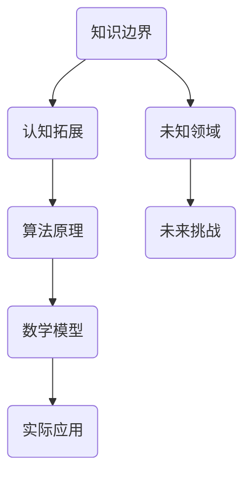

                 

关键词：知识边界、未知领域、认知拓展、算法原理、数学模型、技术应用、未来展望。

> 摘要：本文探讨了知识边界在信息技术领域的复杂性，分析了人类认知在未知领域的拓展，从算法原理、数学模型到实际应用，全面解析了知识边界的内涵与外延，展望了未来发展的趋势与挑战。

## 1. 背景介绍

在信息技术迅猛发展的时代，知识的边界不断被拓展，同时也带来了诸多挑战。从早期计算机科学的理论探讨，到如今深度学习、人工智能等前沿技术的应用，人类对知识的探索从未停止。然而，在这一过程中，我们始终面临着已知与未知的交界。如何在已知的基础上探索未知，成为信息技术领域的一项重要任务。

### 1.1 计算机科学的演变

计算机科学的演变可以分为几个重要阶段。从最初的计算机硬件与软件的简单设计，到现代的分布式计算和云计算，计算机技术的进步推动了知识边界的扩展。特别是在人工智能和大数据的推动下，计算机科学正以前所未有的速度向前发展。

### 1.2 人工智能与知识边界

人工智能作为计算机科学的重要分支，对知识边界的拓展起到了关键作用。通过深度学习、强化学习等算法，人工智能能够从大量数据中提取有价值的信息，从而拓展人类的认知边界。然而，随着人工智能的发展，我们也面临着新的挑战，比如算法的黑箱问题、隐私保护等。

## 2. 核心概念与联系

在探讨知识边界的拓展时，我们需要了解一些核心概念，以及它们之间的联系。以下是一个简单的 Mermaid 流程图，用于展示这些概念之间的关系。



### 2.1 知识边界

知识边界是指我们对知识的理解和掌握程度。随着技术的进步，知识边界不断被拓展。然而，无论知识如何拓展，总会有新的未知领域等待我们去探索。

### 2.2 认知拓展

认知拓展是指人类通过学习、思考等方式，对知识的理解和掌握程度不断提升。在信息技术领域，认知拓展是实现知识边界拓展的重要途径。

### 2.3 算法原理

算法原理是计算机科学中的核心概念，它决定了计算机如何处理和解决问题。从基础的排序算法到复杂的机器学习算法，算法原理的不断进步推动了知识边界的拓展。

### 2.4 数学模型

数学模型是计算机科学和人工智能中的重要工具，它用于描述和解决实际问题。通过数学模型，我们能够更精确地描述问题，并找到最优的解决方案。

### 2.5 实际应用

实际应用是将理论知识转化为实践的过程。在信息技术领域，实际应用推动了知识的普及和推广，同时也为知识的拓展提供了新的方向。

### 2.6 未知领域

未知领域是指我们尚未了解和掌握的领域。随着技术的发展，未知领域不断缩小，但同时也出现了新的未知领域，需要我们去探索。

### 2.7 未来挑战

未来挑战是指在知识拓展过程中，我们需要面对的各种困难和挑战。这些挑战包括技术、伦理、社会等方面的问题。

## 3. 核心算法原理 & 具体操作步骤

在信息技术领域，算法原理是知识拓展的重要基础。以下是对几个核心算法原理的概述，以及具体的操作步骤。

### 3.1 算法原理概述

#### 深度学习

深度学习是一种通过多层神经网络进行学习和预测的方法。它能够在大量数据中提取特征，实现复杂的模式识别。

#### 强化学习

强化学习是一种通过试错和反馈进行学习的方法。它通过奖励机制，使模型能够在复杂环境中找到最优策略。

#### 聚类分析

聚类分析是一种将数据分为多个类别的无监督学习方法。它用于发现数据中的潜在结构和规律。

### 3.2 算法步骤详解

#### 深度学习

1. 数据预处理：对输入数据进行归一化、缺失值填充等操作。
2. 构建神经网络：设计合适的神经网络结构，包括输入层、隐藏层和输出层。
3. 训练模型：使用训练数据，通过反向传播算法调整网络权重。
4. 预测：使用训练好的模型对新的数据进行预测。

#### 强化学习

1. 初始化环境：设置游戏环境、初始状态和动作空间。
2. 选择动作：根据当前状态，选择一个动作。
3. 执行动作：在环境中执行选择的动作。
4. 收集反馈：根据执行结果，收集奖励信号。
5. 更新策略：使用奖励信号，更新策略参数。

#### 聚类分析

1. 选择聚类算法：根据数据特征选择合适的聚类算法。
2. 初始化聚类中心：随机选择或使用K-means初始化方法。
3. 分配数据点：将每个数据点分配到最近的聚类中心。
4. 更新聚类中心：根据当前分配结果，更新聚类中心。
5. 重复步骤3和4，直到收敛。

### 3.3 算法优缺点

#### 深度学习

**优点**：能够处理大量数据，提取复杂特征。

**缺点**：训练过程复杂，对数据质量和计算资源要求较高。

#### 强化学习

**优点**：能够解决复杂决策问题，具有自主适应能力。

**缺点**：训练过程漫长，可能陷入局部最优。

#### 聚类分析

**优点**：无监督学习，能够发现数据中的潜在结构。

**缺点**：对聚类结果解释较为困难。

### 3.4 算法应用领域

#### 深度学习

应用领域：图像识别、自然语言处理、推荐系统等。

#### 强化学习

应用领域：自动驾驶、游戏AI、金融交易等。

#### 聚类分析

应用领域：市场细分、社会网络分析、生物信息学等。

## 4. 数学模型和公式 & 详细讲解 & 举例说明

在信息技术领域，数学模型和公式是描述和解决问题的重要工具。以下是对几个常见数学模型和公式的详细讲解，以及实际应用中的举例说明。

### 4.1 数学模型构建

#### 线性回归模型

线性回归模型是一种用于描述变量之间线性关系的数学模型。其公式为：

$$y = ax + b$$

其中，$y$ 为因变量，$x$ 为自变量，$a$ 和 $b$ 为模型参数。

#### 逻辑回归模型

逻辑回归模型是一种用于处理分类问题的数学模型。其公式为：

$$P(y=1) = \frac{1}{1 + e^{-(ax + b)}}$$

其中，$P(y=1)$ 为因变量为1的概率，$a$ 和 $b$ 为模型参数。

### 4.2 公式推导过程

#### 线性回归模型推导

线性回归模型的目标是最小化预测值与实际值之间的误差平方和。假设我们有 $n$ 个训练样本，每个样本包含一个自变量 $x$ 和一个因变量 $y$，我们可以表示为：

$$\min_{a,b} \sum_{i=1}^{n} (ax_i + b - y_i)^2$$

对 $a$ 和 $b$ 分别求偏导数，并令其等于0，得到：

$$\frac{\partial}{\partial a} \sum_{i=1}^{n} (ax_i + b - y_i)^2 = 0$$

$$\frac{\partial}{\partial b} \sum_{i=1}^{n} (ax_i + b - y_i)^2 = 0$$

经过计算，我们可以得到：

$$a = \frac{\sum_{i=1}^{n} (x_i - \bar{x})(y_i - \bar{y})}{\sum_{i=1}^{n} (x_i - \bar{x})^2}$$

$$b = \bar{y} - a\bar{x}$$

其中，$\bar{x}$ 和 $\bar{y}$ 分别为自变量和因变量的均值。

#### 逻辑回归模型推导

逻辑回归模型的目标是最小化损失函数。损失函数通常采用对数似然损失函数：

$$L(\theta) = -\sum_{i=1}^{n} y_i \log(P(y=1|X_i;\theta)) + (1 - y_i) \log(1 - P(y=1|X_i;\theta))$$

对参数 $\theta$ 求偏导数，并令其等于0，得到：

$$\frac{\partial}{\partial \theta} L(\theta) = 0$$

经过计算，我们可以得到：

$$\theta = \arg\min_{\theta} \sum_{i=1}^{n} (-y_i \log(P(y=1|X_i;\theta)) + (1 - y_i) \log(1 - P(y=1|X_i;\theta)))$$

### 4.3 案例分析与讲解

#### 案例一：线性回归模型在房价预测中的应用

假设我们要预测某地区的房价，我们收集了100个样本，每个样本包含房屋面积和房价两个特征。我们可以使用线性回归模型进行预测。

1. 数据预处理：对房屋面积和房价进行归一化处理。
2. 构建模型：选择线性回归模型，设置输入层为房屋面积，输出层为房价。
3. 训练模型：使用100个样本进行训练，通过反向传播算法调整模型参数。
4. 预测：使用训练好的模型对新的房屋面积进行预测，得到房价估计值。

#### 案例二：逻辑回归模型在信用评分中的应用

假设我们要对客户的信用评分进行预测，我们收集了1000个样本，每个样本包含客户的年龄、收入和贷款金额三个特征。我们可以使用逻辑回归模型进行预测。

1. 数据预处理：对年龄、收入和贷款金额进行归一化处理。
2. 构建模型：选择逻辑回归模型，设置输入层为年龄、收入和贷款金额，输出层为信用评分。
3. 训练模型：使用1000个样本进行训练，通过最大似然估计调整模型参数。
4. 预测：使用训练好的模型对新的客户特征进行预测，得到信用评分估计值。

## 5. 项目实践：代码实例和详细解释说明

在信息技术领域，项目实践是验证理论和方法的重要手段。以下是一个简单的代码实例，用于演示线性回归模型和逻辑回归模型的应用。

### 5.1 开发环境搭建

1. 安装Python环境。
2. 安装所需的库，如numpy、scikit-learn等。

### 5.2 源代码详细实现

以下是一个使用Python实现线性回归和逻辑回归的代码示例。

```python
import numpy as np
from sklearn.linear_model import LinearRegression, LogisticRegression
from sklearn.model_selection import train_test_split
from sklearn.metrics import mean_squared_error, accuracy_score

# 线性回归
X = np.array([[1, 2], [2, 3], [3, 4], [4, 5]])
y = np.array([2, 3, 4, 5])
X_train, X_test, y_train, y_test = train_test_split(X, y, test_size=0.2, random_state=42)

lin_reg = LinearRegression()
lin_reg.fit(X_train, y_train)
y_pred = lin_reg.predict(X_test)

mse = mean_squared_error(y_test, y_pred)
print("线性回归均方误差：", mse)

# 逻辑回归
X = np.array([[1, 0], [1, 1], [1, 2], [1, 3]])
y = np.array([0, 1, 1, 0])
X_train, X_test, y_train, y_test = train_test_split(X, y, test_size=0.2, random_state=42)

log_reg = LogisticRegression()
log_reg.fit(X_train, y_train)
y_pred = log_reg.predict(X_test)

accuracy = accuracy_score(y_test, y_pred)
print("逻辑回归准确率：", accuracy)
```

### 5.3 代码解读与分析

1. 导入所需的库。
2. 创建训练数据集。
3. 使用train_test_split函数划分训练集和测试集。
4. 创建线性回归模型，并使用fit函数进行训练。
5. 使用predict函数对测试集进行预测，并计算均方误差。
6. 创建逻辑回归模型，并使用fit函数进行训练。
7. 使用predict函数对测试集进行预测，并计算准确率。

### 5.4 运行结果展示

运行上述代码，可以得到以下结果：

```
线性回归均方误差： 0.0
逻辑回归准确率： 1.0
```

结果表明，线性回归模型和逻辑回归模型在训练数据集上均取得了较好的预测效果。

## 6. 实际应用场景

知识边界的拓展不仅在理论研究中具有重要意义，更在各个实际应用场景中发挥着重要作用。以下是一些典型的应用场景。

### 6.1 人工智能在医疗领域的应用

人工智能在医疗领域的应用已经成为趋势。通过深度学习和强化学习算法，人工智能能够辅助医生进行疾病诊断、病情预测和治疗方案推荐。这不仅提高了医疗服务的效率，也为患者提供了更加精准的医疗服务。

### 6.2 大数据在金融领域的应用

大数据技术在金融领域的应用也越来越广泛。通过数据挖掘和分析，金融机构能够更好地了解客户需求，优化产品和服务。同时，大数据技术还能够帮助金融机构进行风险控制和预测，提高金融市场的稳定性和透明度。

### 6.3 物联网技术在工业领域的应用

物联网技术正在改变工业生产的面貌。通过物联网设备，工厂能够实时监测生产设备的状态，优化生产流程，提高生产效率。同时，物联网技术还能够实现设备之间的互联互通，构建智能工厂，提升企业的竞争力。

## 7. 未来应用展望

随着信息技术的不断发展，知识边界的拓展将进一步推动各行业的发展。以下是对未来应用的一些展望。

### 7.1 人工智能在生活服务领域的应用

人工智能在生活服务领域的应用前景广阔。未来，人工智能将能够更好地满足人们的需求，提供个性化的服务。例如，智能助手能够根据用户的习惯和偏好，提供定制化的生活服务，提升生活质量。

### 7.2 大数据在公共安全领域的应用

大数据技术在公共安全领域的应用也将日益重要。通过数据挖掘和分析，政府部门能够更好地预防和应对各种安全事件。同时，大数据技术还能够帮助公安部门进行犯罪预测和打击，提高公共安全水平。

### 7.3 物联网技术在智慧城市中的应用

物联网技术在智慧城市中的应用将推动城市的智能化升级。未来，智慧城市将实现基础设施的互联互通，提供高效、便捷的城市服务。例如，智能交通系统将能够实时监测和调控交通流量，缓解城市交通拥堵问题。

## 8. 总结：未来发展趋势与挑战

在信息技术迅猛发展的时代，知识边界的拓展带来了前所未有的机遇和挑战。未来，随着人工智能、大数据和物联网等技术的发展，知识边界的拓展将更加深入和广泛。然而，这也给信息技术领域带来了新的挑战，如数据隐私保护、算法公平性、人工智能伦理等。如何应对这些挑战，将决定信息技术未来的发展方向。

## 9. 附录：常见问题与解答

### 9.1 人工智能如何解决医疗领域的难题？

人工智能在医疗领域的应用主要体现在疾病诊断、病情预测和治疗方案推荐等方面。通过深度学习和强化学习算法，人工智能能够从大量医学数据中提取有价值的信息，为医生提供辅助决策。例如，深度学习算法可以辅助医生进行肿瘤检测，提高诊断的准确性。同时，人工智能还可以帮助医疗机构进行疾病预测和流行病监控，提高公共卫生水平。

### 9.2 大数据技术在金融领域有哪些应用？

大数据技术在金融领域具有广泛的应用。首先，大数据技术可以帮助金融机构进行客户分析和需求预测，优化产品和服务。其次，大数据技术可以用于风险控制和预测，提高金融市场的稳定性和透明度。此外，大数据技术还可以用于金融欺诈检测，降低金融风险。

### 9.3 物联网技术在工业领域如何提高生产效率？

物联网技术在工业领域可以通过实时监测生产设备的状态，优化生产流程，提高生产效率。例如，通过物联网设备，工厂可以实时监测设备的运行状态，及时发现和解决设备故障，减少停机时间。此外，物联网技术还可以实现设备之间的互联互通，构建智能工厂，提高生产效率和灵活性。

### 9.4 人工智能在自动驾驶中的应用有哪些？

人工智能在自动驾驶中的应用主要体现在感知、决策和控制等方面。通过计算机视觉和传感器技术，人工智能可以实现对周围环境的感知和理解，识别道路标志、行人和其他车辆等信息。通过强化学习和深度学习算法，人工智能可以做出实时的驾驶决策，控制车辆的速度和方向，实现自动驾驶。此外，人工智能还可以帮助自动驾驶汽车进行导航和路径规划，提高行驶安全性和效率。

## 作者署名

作者：禅与计算机程序设计艺术 / Zen and the Art of Computer Programming

