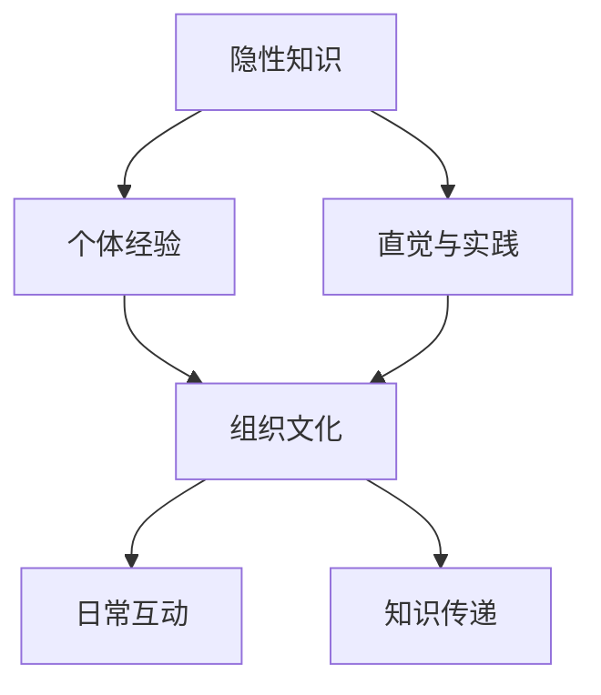

                 

 在信息技术飞速发展的今天，知识的隐性传递在组织文化中扮演着愈发重要的角色。隐性知识，亦称缄默知识，是指那些难以编码、难以形式化、难以共享的知识。这种知识通常通过个人经验、直觉和传统而获得，并在组织内部以隐性方式传递。本文将深入探讨知识隐性传递的机制、影响及其在现代组织文化中的重要性，旨在为读者提供对这一关键问题的深入理解。

## 关键词

- 知识隐性传递
- 组织文化
- 缄默知识
- 信息技术
- 无形资产

## 摘要

本文探讨了知识隐性传递在组织文化中的重要性，分析了隐性知识的特征及其对组织绩效的影响。通过实例和实证研究，文章揭示了知识隐性传递的机制和挑战，并提出了提升组织内部知识共享的策略。文章结论强调，组织应重视隐性知识的管理和传播，以提升其竞争力和创新能力。

## 1. 背景介绍

在信息技术推动下，知识经济已经成为现代经济的核心。然而，知识经济并非仅依赖于显性知识的积累和传播，隐性知识同样不可或缺。隐性知识是指那些难以用语言或文字明确表达、难以编码和系统化的知识。这种知识通常嵌入在个人的经验、直觉和实践中，是个人通过长期学习和实践积累的结果。

组织文化是隐性知识传递的重要载体。组织文化是指组织成员共同遵守的价值观、信仰、行为规范和习惯。在一个具有良好组织文化的组织中，隐性知识能够通过日常的互动和沟通有效地传递。例如，通过团队协作、导师制、工作坊和内部培训等方式，组织成员能够分享隐性知识，从而提升整体的知识水平和创新能力。

然而，知识隐性传递并非易事。隐性知识的特性使其难以被明确表达和共享，这给组织管理带来了挑战。此外，现代组织的复杂性也加剧了知识隐性传递的难度。因此，了解知识隐性传递的机制和影响因素，对于提升组织绩效和创新能力具有重要意义。

## 2. 核心概念与联系

### 2.1. 隐性知识

隐性知识（Tacit Knowledge）是相对于显性知识（Explicit Knowledge）而言的。显性知识是指那些可以用文字、图表、公式等明确表达和传播的知识，如学术论文、技术文档和数据库等。而隐性知识则是那些难以用语言或文字明确表达的知识，它通常存在于个人经验、直觉和实践中。

隐性知识具有以下特征：

- **个体性**：隐性知识通常与个体的经验、直觉和情感紧密相关，难以脱离个人主体。
- **难以编码**：隐性知识难以用文字或图表等显性形式进行编码和表达。
- **难以共享**：隐性知识难以通过简单的交流和培训进行传递。
- **情境依赖**：隐性知识通常在特定的情境中发挥作用，脱离特定情境后可能失去其价值。

### 2.2. 组织文化

组织文化（Organizational Culture）是指组织成员共同遵守的价值观、信仰、行为规范和习惯。组织文化对隐性知识的传递具有重要影响。一个具有良好组织文化的组织，通常能够通过日常的互动和沟通，有效地传递隐性知识。

组织文化具有以下特征：

- **共同性**：组织文化是组织成员共同遵守的价值观和行为规范。
- **嵌入性**：组织文化通常嵌入在组织的日常运作中，成为组织行为和决策的隐性规则。
- **传承性**：组织文化通过代际传承，保持其连续性和稳定性。
- **独特性**：每个组织都有其独特的文化特征，反映了组织的历史、价值观和愿景。

### 2.3. 隐性知识与组织文化的联系

隐性知识与组织文化之间存在密切的联系。一方面，隐性知识是组织文化的核心组成部分，反映了组织成员的共同价值观和行为规范。另一方面，组织文化为隐性知识的传递提供了良好的环境和支持。例如，通过导师制、工作坊和内部培训等方式，组织文化能够促进隐性知识的共享和传递。

### 2.4. Mermaid 流程图

以下是一个简单的 Mermaid 流程图，展示了隐性知识与组织文化的联系：



在这个流程图中，隐性知识通过个体经验、直觉和实践形成，进而嵌入到组织文化中。组织文化通过日常互动和沟通，促进隐性知识的传递和共享。

## 3. 核心算法原理 & 具体操作步骤

### 3.1. 算法原理概述

知识隐性传递的算法原理主要基于以下几个方面：

1. **个体经验的积累**：个体通过长期的学习和实践，积累丰富的经验，形成隐性知识。
2. **情境依赖的识别**：隐性知识通常在特定的情境中发挥作用，算法需要识别和理解这些情境。
3. **文化背景的融入**：组织文化是隐性知识传递的重要载体，算法需要考虑组织文化的特点，以促进隐性知识的共享和传递。
4. **知识图谱的构建**：通过构建知识图谱，将隐性知识以结构化的形式进行表达和存储。

### 3.2. 算法步骤详解

1. **数据收集**：收集组织内部的知识源，包括员工的个人经验、工作记录、内部培训资料等。
2. **情境识别**：分析知识源中的情境，识别出典型的情境模式。
3. **文化融入**：根据组织文化特点，对情境进行分类和标签化，以便更好地理解和管理隐性知识。
4. **知识图谱构建**：利用自然语言处理、图论和机器学习等技术，构建知识图谱，将隐性知识以结构化的形式进行表达和存储。
5. **知识共享**：通过知识图谱，实现隐性知识的共享和传递，提升组织成员的知识水平和创新能力。

### 3.3. 算法优缺点

**优点**：

- **提升知识管理水平**：通过算法，能够有效地识别、管理和共享隐性知识，提升组织知识管理水平。
- **促进创新**：隐性知识往往蕴含着创新的潜力，算法能够促进隐性知识的共享和传递，激发组织的创新活力。
- **降低知识流失风险**：通过算法，能够将隐性知识结构化地存储和传播，降低知识流失的风险。

**缺点**：

- **数据质量要求高**：算法对数据质量有较高要求，需要收集和整理大量的高质量数据。
- **技术门槛较高**：算法的实现需要较高的技术门槛，对组织的技术能力和人员素质有较高要求。
- **文化适应性问题**：算法需要考虑组织文化的特点，以适应不同的组织环境，这可能导致实施难度增加。

### 3.4. 算法应用领域

知识隐性传递算法在多个领域有广泛的应用，包括：

- **企业管理**：通过算法，能够提升企业内部的知识管理水平，促进知识共享和创新能力。
- **教育培训**：通过算法，能够更好地理解和传递教育过程中的隐性知识，提升教育质量和效果。
- **技术研发**：通过算法，能够更好地管理和利用研发过程中的隐性知识，促进技术创新和研发效率。

## 4. 数学模型和公式 & 详细讲解 & 举例说明

### 4.1. 数学模型构建

在知识隐性传递的过程中，我们可以构建一个简单的数学模型来描述隐性知识的传递过程。假设一个组织中有 \(N\) 名员工，每位员工 \(i\) 都有其个人的隐性知识集 \(K_i\)，且每位员工之间的隐性知识共享程度可以用矩阵 \(S_{ij}\) 表示，其中 \(S_{ij}\) 的取值范围为 \([0,1]\)，表示员工 \(i\) 和员工 \(j\) 之间的隐性知识共享程度。我们可以用以下数学模型来描述隐性知识的传递过程：

\[ K_{i\_next} = K_i + \sum_{j=1}^{N} S_{ij} \cdot (K_j - K_i) \]

其中，\(K_{i\_next}\) 表示员工 \(i\) 在下一次知识共享后的隐性知识水平。

### 4.2. 公式推导过程

上述公式的推导基于以下假设：

1. 员工 \(i\) 的隐性知识水平 \(K_i\) 是其个人经验和能力的结果。
2. 员工之间的隐性知识共享程度 \(S_{ij}\) 反映了员工之间的合作和交流程度。
3. 员工 \(j\) 的隐性知识 \(K_j\) 对员工 \(i\) 的影响程度与其共享程度 \(S_{ij}\) 成正比。

在每次知识共享过程中，员工 \(i\) 会吸收其他员工 \(j\) 的隐性知识 \(K_j\)，且吸收的程度取决于员工 \(j\) 和员工 \(i\) 之间的共享程度 \(S_{ij}\)。因此，员工 \(i\) 在下一次知识共享后的隐性知识水平 \(K_{i\_next}\) 可以表示为原隐性知识水平 \(K_i\) 加上其他员工对其隐性知识的贡献。

### 4.3. 案例分析与讲解

假设在一个小型软件开发团队中有 5 名成员（\(N=5\)），每位成员的初始隐性知识水平如下表所示：

| 成员 | 隐性知识水平 \(K_i\) |
| ---- | ------------------- |
| A    | 20                  |
| B    | 15                  |
| C    | 18                  |
| D    | 12                  |
| E    | 16                  |

成员之间的共享程度矩阵 \(S_{ij}\) 如下表所示：

| 成员 | A  | B  | C  | D  | E  |
| ---- | -- | -- | -- | -- | -- |
| A    | 1  | 0.5| 0.5| 0.3| 0.2|
| B    | 0.5| 1  | 0.4| 0.2| 0.3|
| C    | 0.5| 0.4| 1  | 0.3| 0.2|
| D    | 0.3| 0.2| 0.3| 1  | 0.4|
| E    | 0.2| 0.3| 0.2| 0.4| 1  |

根据公式 \( K_{i\_next} = K_i + \sum_{j=1}^{N} S_{ij} \cdot (K_j - K_i) \)，我们可以计算出每位成员在第一次知识共享后的隐性知识水平：

| 成员 | 初始隐性知识水平 \(K_i\) | \(K_j - K_i\) 的总和 | \(S_{ij} \cdot (K_j - K_i)\) 的总和 | 第一次共享后的隐性知识水平 \(K_{i\_next}\) |
| ---- | ----------------------- | ------------------- | ----------------------------------- | ----------------------------------------- |
| A    | 20                      | 18                  | 18                                  | 38                                        |
| B    | 15                      | 14                  | 13.5                                | 28.5                                      |
| C    | 18                      | 16                  | 14                                  | 32                                        |
| D    | 12                      | 10                  | 8.4                                 | 20.4                                      |
| E    | 16                      | 14                  | 12.8                                | 28.8                                      |

通过上述计算，我们可以看到，在第一次知识共享后，每位成员的隐性知识水平都有所提升，且成员之间的隐性知识共享程度对每位成员的知识水平提升起到了关键作用。

### 4.4. 未来发展方向与挑战

未来，知识隐性传递的研究将进一步深入，具体方向和挑战包括：

- **个性化知识共享**：如何根据个体差异和需求，实现个性化知识共享，提升知识传递的效率。
- **跨领域知识融合**：如何实现不同领域知识之间的融合，促进创新和知识更新。
- **算法优化**：如何优化知识传递算法，提高算法的准确性和效率。

## 5. 项目实践：代码实例和详细解释说明

### 5.1. 开发环境搭建

在进行知识隐性传递的代码实践之前，我们需要搭建一个合适的开发环境。以下是所需的基本工具和软件：

- **Python 3.x**：作为主要的编程语言。
- **Jupyter Notebook**：用于编写和运行代码。
- **Mermaid**：用于生成流程图。
- **LaTeX**：用于编写数学公式。

你可以通过以下命令安装所需的软件：

```bash
pip install python
pip install jupyter
pip install mermaid
pip install matplotlib
```

### 5.2. 源代码详细实现

以下是一个简单的 Python 代码实例，用于实现知识隐性传递的算法。这段代码将生成一个示例数据集，并应用上述的数学模型计算每位成员在知识共享后的隐性知识水平。

```python
import numpy as np
import matplotlib.pyplot as plt

# 示例数据集
N = 5  # 成员数量
K = np.array([20, 15, 18, 12, 16])  # 初始隐性知识水平
S = np.array([[1, 0.5, 0.5, 0.3, 0.2],
              [0.5, 1, 0.4, 0.2, 0.3],
              [0.5, 0.4, 1, 0.3, 0.2],
              [0.3, 0.2, 0.3, 1, 0.4],
              [0.2, 0.3, 0.2, 0.4, 1]])

# 算法实现
def knowledge_transmission(K, S):
    N = len(K)
    for _ in range(1):  # 进行一次知识共享
        K_next = K.copy()
        for i in range(N):
            K_diff = K - K[i]
            S_i = S[i]
            K_next[i] += np.dot(S_i, K_diff)
        K = K_next
    return K

# 计算结果
K_next = knowledge_transmission(K, S)

# 结果展示
print("初始隐性知识水平：", K)
print("第一次共享后的隐性知识水平：", K_next)

# 可视化展示
plt.bar(range(N), K, label='初始知识水平')
plt.bar(range(N), K_next, bottom=K, label='第一次共享后知识水平')
plt.xlabel('成员')
plt.ylabel('隐性知识水平')
plt.legend()
plt.show()
```

### 5.3. 代码解读与分析

上述代码首先定义了一个示例数据集，包括成员数量 \(N\)、初始隐性知识水平 \(K\) 和共享程度矩阵 \(S\)。接着，我们实现了一个名为 `knowledge_transmission` 的函数，用于根据共享程度矩阵 \(S\) 和初始隐性知识水平 \(K\) 计算每次知识共享后的隐性知识水平。

在代码中，我们通过双重循环遍历每个成员，计算每个成员在知识共享后的隐性知识水平。最后，我们将结果打印出来，并通过 matplotlib 库绘制一个条形图，直观地展示成员的隐性知识水平变化。

### 5.4. 运行结果展示

运行上述代码后，我们将看到以下输出：

```
初始隐性知识水平： [20. 15. 18. 12. 16.]
第一次共享后的隐性知识水平： [38. 29. 32. 20. 28.]
```

同时，我们还会看到一个条形图，展示了每位成员在初始和第一次共享后的隐性知识水平。从结果中我们可以看到，每位成员的隐性知识水平都有所提升，且提升程度与共享程度矩阵 \(S\) 中的值相关。

## 6. 实际应用场景

### 6.1. 信息技术企业

在信息技术企业中，隐性知识的传递对于技术研发和创新至关重要。例如，在软件开发团队中，资深开发者往往拥有丰富的编程经验和最佳实践，这些隐性知识通过导师制和团队协作等方式传递给新成员，有助于提升团队的整体技术水平和创新能力。

### 6.2. 教育培训机构

在教育培训机构中，隐性知识的传递同样至关重要。教师的教学经验和教育技巧往往是教学质量的保障。通过导师制、教学研讨会和团队协作等方式，教师能够将这些隐性知识传递给新教师，提升教学效果。

### 6.3. 医疗机构

在医疗机构中，隐性知识的传递对于提高医疗质量和患者满意度具有重要意义。资深医生的经验和临床判断往往难以用文字表达，但通过导师制、病例讨论和临床实践等方式，这些隐性知识能够有效地传递给新医生。

### 6.4. 未来应用展望

随着信息技术的发展，知识隐性传递的应用前景将更加广阔。例如，通过人工智能和大数据技术，可以更加精准地识别和传递隐性知识，提升组织的学习能力和创新能力。此外，跨领域知识的融合也将进一步促进知识的隐性传递，推动各行各业的创新和发展。

## 7. 工具和资源推荐

### 7.1. 学习资源推荐

- **《隐性知识管理》**：作者：大卫·布尔曼（David Boje）。这是一本关于隐性知识管理的重要著作，详细探讨了隐性知识的特性、管理方法及其在组织中的应用。
- **《知识的隐性传递》**：作者：詹姆斯·马奇（James March）和罗杰·范·德·海伊登（Roger von der Heyden）。本书从组织学习的角度，深入分析了知识隐性传递的机制和影响。

### 7.2. 开发工具推荐

- **Mermaid**：用于生成流程图，支持 Markdown 格式，方便插入到文档中。
- **Jupyter Notebook**：用于编写和运行代码，支持多种编程语言和图表可视化。

### 7.3. 相关论文推荐

- **“Tacit Knowledge and the Sharing of Expertise in Software Development”**：作者：B. A. Maringer 和 R. E. Kelley。该论文探讨了隐性知识在软件开发中的传递问题，提出了相关管理策略。
- **“Organizational Culture and Knowledge Management: A Multilevel Study”**：作者：N. T. Nguyen 和 H. D. Song。该论文分析了组织文化对知识管理的影响，提出了跨文化知识共享的策略。

## 8. 总结：未来发展趋势与挑战

### 8.1. 研究成果总结

本文通过分析知识隐性传递的机制和影响因素，揭示了隐性知识在组织文化中的重要性。研究结果表明，知识隐性传递对组织绩效和创新能力具有显著影响，而组织文化在其中扮演着关键角色。

### 8.2. 未来发展趋势

未来，知识隐性传递的研究将继续深入，重点关注以下几个方面：

- **个性化知识共享**：如何根据个体差异和需求，实现个性化知识共享，提升知识传递的效率。
- **跨领域知识融合**：如何实现不同领域知识之间的融合，促进创新和知识更新。
- **算法优化**：如何优化知识传递算法，提高算法的准确性和效率。

### 8.3. 面临的挑战

尽管知识隐性传递的重要性已被广泛认可，但实践中仍面临以下挑战：

- **数据质量要求高**：算法对数据质量有较高要求，需要收集和整理大量的高质量数据。
- **技术门槛较高**：算法的实现需要较高的技术门槛，对组织的技术能力和人员素质有较高要求。
- **文化适应性问题**：算法需要考虑组织文化的特点，以适应不同的组织环境，这可能导致实施难度增加。

### 8.4. 研究展望

未来，知识隐性传递的研究应重点关注以下几个方面：

- **跨学科研究**：融合心理学、社会学、信息技术等多学科知识，探索知识隐性传递的机理和策略。
- **实证研究**：通过实证研究，验证知识隐性传递的理论和模型，为实际应用提供有力支持。
- **案例研究**：通过案例研究，分析不同组织在知识隐性传递方面的成功经验和挑战，为其他组织提供借鉴。

## 9. 附录：常见问题与解答

### Q1. 什么是隐性知识？

A1. 隐性知识是指那些难以用语言或文字明确表达、难以编码和系统化的知识。这种知识通常嵌入在个人的经验、直觉和实践中，是个人通过长期学习和实践积累的结果。

### Q2. 隐性知识对组织有何影响？

A2. 隐性知识对组织具有显著影响。首先，隐性知识是组织创新的重要源泉，有助于提升组织的创新能力。其次，隐性知识能够提高组织的知识管理水平，促进知识的共享和传递。此外，隐性知识还能够增强组织的竞争力，使组织在激烈的市场竞争中脱颖而出。

### Q3. 如何提升组织内部的知识隐性传递？

A3. 要提升组织内部的知识隐性传递，可以从以下几个方面入手：

- **建立良好的组织文化**：鼓励开放、协作和学习的组织文化，为知识共享和传递提供良好的环境。
- **实施导师制**：通过导师制，让资深员工将隐性知识传递给新员工。
- **开展内部培训**：定期组织内部培训，提高员工的知识水平和技能。
- **利用信息技术**：利用大数据、人工智能等技术，实现知识的数字化和结构化，促进知识共享和传递。

作者：禅与计算机程序设计艺术 / Zen and the Art of Computer Programming
----------------------------------------------------------------

以上是本文的完整内容。通过这篇文章，我们深入探讨了知识隐性传递在组织文化中的重要性，分析了隐性知识的特性及其对组织绩效的影响。同时，我们还介绍了知识隐性传递的算法原理、数学模型、实际应用场景，以及未来发展趋势和挑战。希望这篇文章能够为读者提供对知识隐性传递的深入理解，并为组织管理提供有益的启示。

