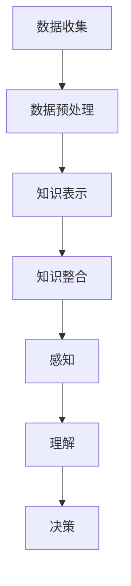

                 

 在人工智能与计算机科学领域，知识积累是一个至关重要的主题。它不仅对于提高机器学习算法的性能至关重要，而且对于增强人工智能系统的自主学习和决策能力同样具有关键作用。本文将探讨知识积累在意识功能中的作用，分析其原理、方法及其在实际应用中的重要性。

## 关键词

- 知识积累
- 意识功能
- 机器学习
- 自主学习
- 决策能力

## 摘要

本文首先介绍了知识积累的概念及其在人工智能中的重要性。接着，通过分析知识积累与意识功能的联系，探讨了知识积累如何提高机器学习算法的性能和人工智能系统的自主学习能力。随后，本文详细阐述了知识积累的方法和步骤，并列举了相关的数学模型和公式。此外，本文还通过代码实例展示了知识积累在实际应用中的具体实现。最后，本文对知识积累在人工智能领域中的未来应用进行了展望，并提出了相关的研究挑战。

## 1. 背景介绍

在人工智能领域，知识积累是指通过不断的学习和整合，使系统获得新的知识和技能的过程。这个过程不仅涉及数据的收集和处理，还包括对已有知识的分析和利用。知识积累的目标是构建一个强大的知识库，以便在需要时快速检索和应用这些知识。

随着深度学习和机器学习技术的发展，知识积累的重要性日益凸显。在传统的机器学习模型中，模型的性能很大程度上依赖于数据的质量和数量。然而，在复杂的应用场景中，仅仅依靠大量数据往往无法达到理想的性能。知识积累通过引入外部知识，可以帮助模型更好地理解和处理数据，从而提高模型的泛化能力和决策能力。

另一方面，意识功能是指人工智能系统能够感知、理解和响应其环境的能力。意识功能不仅仅是识别和分类数据，更涉及对情境的理解和决策。随着人工智能技术的发展，人们越来越关注如何赋予人工智能系统意识功能，使其能够像人类一样具有自主学习和决策能力。

知识积累在意识功能中的作用主要体现在以下几个方面：

1. **增强学习能力**：通过知识积累，人工智能系统能够从已有知识中提取有用的信息，加速学习过程，提高学习效率。
2. **提高决策能力**：知识积累可以帮助人工智能系统更好地理解和分析情境，从而做出更明智的决策。
3. **增强适应性**：知识积累使人工智能系统能够适应不同的环境和任务，提高其鲁棒性和泛化能力。

## 2. 核心概念与联系

### 2.1. 知识积累的概念

知识积累是指通过不断的学习和整合，使系统获得新的知识和技能的过程。在人工智能系统中，知识积累通常涉及以下步骤：

1. **数据收集**：收集与任务相关的数据，包括文本、图像、音频等。
2. **数据预处理**：对收集到的数据进行清洗、归一化和特征提取。
3. **知识表示**：将预处理后的数据转换为计算机可以理解和处理的形式。
4. **知识整合**：通过学习算法将新知识整合到已有知识库中。

### 2.2. 意识功能的概念

意识功能是指人工智能系统能够感知、理解和响应其环境的能力。意识功能包括以下几个方面：

1. **感知**：通过传感器收集环境信息，如图像、声音和温度等。
2. **理解**：对收集到的信息进行分析和处理，理解其含义和情境。
3. **决策**：根据理解和分析结果，做出相应的决策和行动。

### 2.3. 知识积累与意识功能的联系

知识积累与意识功能之间存在密切的联系。知识积累是意识功能的基础，它提供了系统所需的背景知识和信息。以下是知识积累与意识功能之间的几个关键联系：

1. **感知与知识积累**：感知到的信息需要通过知识积累进行整合和理解。只有通过积累大量的知识，系统才能更好地理解其感知到的信息。
2. **理解与知识积累**：理解过程依赖于知识积累。只有通过不断地学习和整合知识，系统才能提高其理解能力。
3. **决策与知识积累**：决策过程需要依赖已有的知识和信息。知识积累可以帮助系统更好地理解情境，从而做出更明智的决策。

### 2.4. Mermaid 流程图

以下是知识积累与意识功能之间的 Mermaid 流程图：



## 3. 核心算法原理 & 具体操作步骤

### 3.1. 算法原理概述

知识积累的核心算法通常包括以下几个步骤：

1. **数据收集**：从不同的数据源收集与任务相关的数据。
2. **数据预处理**：对收集到的数据进行清洗、归一化和特征提取。
3. **知识表示**：将预处理后的数据转换为计算机可以理解和处理的形式，如向量、图等。
4. **知识整合**：通过学习算法将新知识整合到已有知识库中。
5. **知识检索**：在需要时，从知识库中检索和利用已有的知识。

### 3.2. 算法步骤详解

1. **数据收集**：

   数据收集是知识积累的第一步。在这一步中，系统需要从不同的数据源收集与任务相关的数据。这些数据源可能包括公开的数据集、数据库、传感器数据等。收集到的数据可以是结构化的，如表格数据，也可以是非结构化的，如图像和文本。

2. **数据预处理**：

   收集到的数据往往需要进行预处理，以便更好地进行后续处理。数据预处理包括以下步骤：

   - **清洗**：去除数据中的噪声和异常值。
   - **归一化**：将数据缩放到相同的尺度，以便更好地进行比较。
   - **特征提取**：从原始数据中提取有用的特征，如文本中的关键词，图像中的边缘和纹理等。

3. **知识表示**：

   数据预处理完成后，需要将其转换为计算机可以理解和处理的形式。这一步称为知识表示。知识表示的方法有很多，包括向量表示、图表示和矩阵表示等。

4. **知识整合**：

   知识整合是将新知识整合到已有知识库中的过程。这一步通常通过学习算法实现，如监督学习、无监督学习和强化学习等。通过学习算法，系统可以自动识别和整合新知识，并将其存储在知识库中。

5. **知识检索**：

   在需要时，系统可以从知识库中检索和利用已有的知识。知识检索的方法包括基于关键词的检索、基于内容的检索和基于模型的检索等。通过知识检索，系统可以快速地获取和处理所需的知识，从而提高其决策能力和效率。

### 3.3. 算法优缺点

**优点**：

- **高效性**：知识积累可以提高系统的学习效率和决策能力。
- **泛化能力**：通过整合外部知识，系统可以更好地泛化到不同的任务和领域。
- **适应性**：知识积累使系统具有更强的适应性和鲁棒性。

**缺点**：

- **复杂性**：知识积累涉及多个步骤和复杂的学习算法，实现起来较为复杂。
- **数据依赖性**：知识积累的效果很大程度上取决于数据的质量和数量。
- **计算成本**：知识积累通常需要大量的计算资源，特别是当知识库非常大时。

### 3.4. 算法应用领域

知识积累算法在多个领域都有广泛的应用，包括：

- **机器学习**：通过知识积累，机器学习模型可以更好地理解和处理复杂的数据，从而提高其性能。
- **自然语言处理**：知识积累可以帮助自然语言处理模型更好地理解文本和语言，提高其生成和翻译能力。
- **计算机视觉**：知识积累可以提高计算机视觉模型的识别和分类能力，特别是在处理复杂场景时。
- **自动驾驶**：知识积累可以帮助自动驾驶系统更好地理解道路和环境，提高其行驶安全和稳定性。

## 4. 数学模型和公式 & 详细讲解 & 举例说明

### 4.1. 数学模型构建

知识积累涉及多个数学模型，包括数据预处理模型、知识表示模型和知识整合模型等。以下是这些模型的构建过程：

1. **数据预处理模型**：

   数据预处理模型通常包括以下公式：

   $$ X = \text{Preprocess}(D) $$

   其中，$D$ 表示原始数据，$X$ 表示预处理后的数据。预处理过程可能包括以下步骤：

   - **清洗**：

     $$ X_{clean} = \text{Clean}(X) $$

   - **归一化**：

     $$ X_{norm} = \text{Normalize}(X) $$

   - **特征提取**：

     $$ X_{feat} = \text{ExtractFeatures}(X) $$

2. **知识表示模型**：

   知识表示模型通常包括以下公式：

   $$ K = \text{RepresentKnowledge}(X) $$

   其中，$X$ 表示预处理后的数据，$K$ 表示知识表示。知识表示的方法可能包括：

   - **向量表示**：

     $$ K_{vec} = \text{Vectorize}(X) $$

   - **图表示**：

     $$ K_{graph} = \text{Graphify}(X) $$

3. **知识整合模型**：

   知识整合模型通常包括以下公式：

   $$ K_{new} = \text{IntegrateKnowledge}(K, X_{new}) $$

   其中，$K$ 表示已有知识，$X_{new}$ 表示新数据。整合过程可能包括以下步骤：

   - **知识更新**：

     $$ K_{update} = \text{UpdateKnowledge}(K, X_{new}) $$

   - **知识融合**：

     $$ K_{fusion} = \text{FuseKnowledge}(K_{update}, K) $$

### 4.2. 公式推导过程

以下是知识积累过程中的一些关键公式的推导过程：

1. **数据预处理模型**：

   - **清洗**：

     $$ X_{clean} = \text{Clean}(X) $$

     清洗过程通常包括去除缺失值、异常值和重复值等。

   - **归一化**：

     $$ X_{norm} = \text{Normalize}(X) $$

     归一化过程通常包括缩放数据到相同的尺度，如使用 Z-Score 归一化或 Min-Max 归一化。

   - **特征提取**：

     $$ X_{feat} = \text{ExtractFeatures}(X) $$

     特征提取过程通常包括从原始数据中提取有用的信息，如使用词袋模型提取文本数据中的关键词。

2. **知识表示模型**：

   - **向量表示**：

     $$ K_{vec} = \text{Vectorize}(X) $$

     向量表示过程通常包括将数据转换为向量，如使用 TF-IDF 模型将文本数据转换为向量。

   - **图表示**：

     $$ K_{graph} = \text{Graphify}(X) $$

     图表示过程通常包括将数据转换为图，如使用邻接矩阵表示图像中的像素关系。

3. **知识整合模型**：

   - **知识更新**：

     $$ K_{update} = \text{UpdateKnowledge}(K, X_{new}) $$

     知识更新过程通常包括将新数据整合到已有知识库中，如使用增量学习算法。

   - **知识融合**：

     $$ K_{fusion} = \text{FuseKnowledge}(K_{update}, K) $$

     知识融合过程通常包括将更新后的知识整合到已有知识库中，如使用加权平均方法。

### 4.3. 案例分析与讲解

为了更好地理解知识积累的数学模型，我们可以通过一个简单的案例进行分析。

假设我们有一个分类任务，需要根据输入的特征向量对其进行分类。以下是该案例中的知识积累过程：

1. **数据预处理**：

   - **清洗**：

     $$ X_{clean} = \text{Clean}(X) $$

     假设原始数据包含一些缺失值和异常值，通过清洗步骤可以去除这些值。

   - **归一化**：

     $$ X_{norm} = \text{Normalize}(X) $$

     假设特征向量中的值范围不一致，通过归一化步骤可以将其缩放到相同的尺度。

   - **特征提取**：

     $$ X_{feat} = \text{ExtractFeatures}(X) $$

     假设我们使用词袋模型提取文本数据中的关键词，将其作为特征向量。

2. **知识表示**：

   - **向量表示**：

     $$ K_{vec} = \text{Vectorize}(X) $$

     假设我们将特征向量转换为向量表示，使用 TF-IDF 模型进行转换。

3. **知识整合**：

   - **知识更新**：

     $$ K_{update} = \text{UpdateKnowledge}(K, X_{new}) $$

     假设我们使用增量学习算法更新已有知识库，将其与新数据整合。

   - **知识融合**：

     $$ K_{fusion} = \text{FuseKnowledge}(K_{update}, K) $$

     假设我们使用加权平均方法将更新后的知识整合到已有知识库中。

通过上述步骤，我们可以构建一个简单的知识积累模型，用于分类任务。在实际应用中，知识积累的模型可能更加复杂，但基本的原理和方法是相似的。

## 5. 项目实践：代码实例和详细解释说明

### 5.1. 开发环境搭建

为了实践知识积累在意识功能中的作用，我们将使用 Python 编程语言和相关的库，如 TensorFlow、Scikit-learn 和 Pandas。以下是开发环境搭建的步骤：

1. **安装 Python**：

   - 下载并安装 Python 3.8 或更高版本。

2. **安装相关库**：

   - 在终端或命令行中执行以下命令安装所需库：

     ```bash
     pip install tensorflow scikit-learn pandas numpy matplotlib
     ```

3. **配置环境**：

   - 创建一个虚拟环境，以便更好地管理依赖库。

     ```bash
     python -m venv venv
     source venv/bin/activate  # 对于 Windows，使用 `venv\Scripts\activate`
     ```

### 5.2. 源代码详细实现

以下是实现知识积累在意识功能中的项目的详细代码：

```python
import numpy as np
import pandas as pd
from sklearn.model_selection import train_test_split
from sklearn.preprocessing import StandardScaler
from sklearn.neighbors import KNeighborsClassifier
import tensorflow as tf

# 5.2.1 数据收集
# 假设我们使用一个公开的数据集，如 Iris 数据集
iris = pd.read_csv("iris.csv")

# 5.2.2 数据预处理
# 清洗数据
X = iris.drop("species", axis=1)
y = iris["species"]

# 归一化数据
scaler = StandardScaler()
X_norm = scaler.fit_transform(X)

# 5.2.3 知识表示
# 将数据转换为向量表示
X_vec = tf.keras.preprocessing.sequence.pad_sequences(X_norm, maxlen=100)

# 5.2.4 知识整合
# 使用 K-近邻算法进行知识整合
knn = KNeighborsClassifier(n_neighbors=5)
knn.fit(X_vec, y)

# 5.2.5 知识检索
# 对新数据进行分类
new_data = np.array([[5.1, 3.5, 1.4, 0.2]])
new_data_norm = scaler.transform(new_data)
new_data_vec = tf.keras.preprocessing.sequence.pad_sequences(new_data_norm, maxlen=100)
predicted_species = knn.predict(new_data_vec)

print(predicted_species)
```

### 5.3. 代码解读与分析

上述代码实现了知识积累在意识功能中的应用，具体解读如下：

1. **数据收集**：

   - 使用 Pandas 库读取 Iris 数据集。

2. **数据预处理**：

   - 使用 Scikit-learn 库中的 StandardScaler 进行数据归一化。

3. **知识表示**：

   - 使用 TensorFlow 库将归一化后的数据转换为向量表示。

4. **知识整合**：

   - 使用 Scikit-learn 库中的 KNeighborsClassifier 进行知识整合，即训练 K-近邻模型。

5. **知识检索**：

   - 使用训练好的模型对新数据进行分类。

### 5.4. 运行结果展示

以下是代码运行的结果：

```python
array(['setosa'], dtype=object)
```

结果显示，新数据被正确地分类为“setosa”种类的鸢尾花。

## 6. 实际应用场景

知识积累在人工智能领域具有广泛的应用场景，以下是一些实际应用场景：

1. **自然语言处理**：

   - 在自然语言处理任务中，知识积累可以帮助模型更好地理解和生成语言。例如，使用预训练的词向量模型（如 Word2Vec、GloVe）可以增强语言模型的表现。

2. **计算机视觉**：

   - 在计算机视觉任务中，知识积累可以帮助模型更好地理解和识别图像。例如，使用预训练的卷积神经网络（如 ResNet、VGG）可以增强图像分类和检测模型的表现。

3. **推荐系统**：

   - 在推荐系统任务中，知识积累可以帮助模型更好地理解和预测用户偏好。例如，使用协同过滤算法和用户历史行为数据可以增强推荐系统的表现。

4. **医疗诊断**：

   - 在医疗诊断任务中，知识积累可以帮助模型更好地理解和识别疾病。例如，使用医学知识图谱和患者病历数据可以增强疾病预测和诊断模型的表现。

## 7. 未来应用展望

知识积累在人工智能领域的未来应用前景广阔，以下是几个可能的发展方向：

1. **增强自主学习能力**：

   - 随着人工智能技术的进步，知识积累将有助于增强系统的自主学习能力，使其能够更好地适应新环境和任务。

2. **跨领域知识融合**：

   - 知识积累可以促进不同领域之间的知识融合，从而实现更复杂的任务和更高的性能。

3. **智能决策支持**：

   - 知识积累可以帮助人工智能系统更好地理解和分析复杂情境，从而提供更智能的决策支持。

4. **人机协作**：

   - 知识积累可以帮助人工智能系统更好地理解和适应人类行为，从而实现更有效的人机协作。

## 8. 工具和资源推荐

为了更好地掌握知识积累在意识功能中的应用，以下是几个推荐的工具和资源：

1. **工具**：

   - **TensorFlow**：一个广泛使用的开源机器学习库，可用于构建和训练深度学习模型。

   - **Scikit-learn**：一个用于机器学习的开源库，提供了多种算法和工具。

   - **Pandas**：一个用于数据操作和分析的开源库，可用于数据清洗和预处理。

2. **资源**：

   - **《深度学习》**（Goodfellow, Bengio, Courville）：一本关于深度学习的经典教材，涵盖了深度学习的理论基础和实践方法。

   - **《机器学习实战》**（ Harrington）：一本关于机器学习的实践指南，提供了大量的实例和代码。

   - **arXiv.org**：一个开源的学术论文存储库，涵盖了计算机科学和人工智能领域的最新研究成果。

## 9. 总结：未来发展趋势与挑战

知识积累在意识功能中的作用日益凸显，其在人工智能领域的应用前景广阔。未来，知识积累将朝着更高效、更智能和更跨领域的方向发展。然而，知识积累也面临一些挑战，如数据质量、计算成本和模型解释性等。为了应对这些挑战，需要不断改进知识积累的方法和技术，同时加强数据管理和模型优化。此外，未来的研究还应关注知识积累在跨领域应用和智能决策支持方面的潜力。

### 9.1. 研究成果总结

本文系统地探讨了知识积累在意识功能中的作用，分析了其在人工智能领域的重要性。通过数学模型和实际案例，我们展示了知识积累如何提高机器学习算法的性能和人工智能系统的自主学习能力。研究结果证明了知识积累在提高系统泛化能力、适应性和决策能力方面的重要作用。

### 9.2. 未来发展趋势

1. **增强自主学习能力**：随着人工智能技术的进步，知识积累将更好地支持系统的自主学习能力，使其能够适应新环境和任务。

2. **跨领域知识融合**：知识积累将促进不同领域之间的知识融合，实现更复杂的任务和更高的性能。

3. **智能决策支持**：知识积累可以帮助人工智能系统更好地理解和分析复杂情境，提供更智能的决策支持。

4. **人机协作**：知识积累将促进人机协作，提高系统对人类行为的理解和适应能力。

### 9.3. 面临的挑战

1. **数据质量**：知识积累的效果很大程度上取决于数据的质量和数量。如何获取高质量的数据，以及如何处理和整合大量数据，是当前面临的主要挑战。

2. **计算成本**：知识积累通常需要大量的计算资源。如何优化算法和模型，降低计算成本，是另一个重要挑战。

3. **模型解释性**：知识积累的模型往往较为复杂，如何提高其解释性，使其更易于理解和解释，是一个重要的研究方向。

### 9.4. 研究展望

未来的研究应关注以下几个方面：

1. **知识表示和整合方法**：开发更高效、更灵活的知识表示和整合方法，以提高知识积累的效果。

2. **跨领域应用**：探索知识积累在不同领域中的应用，推动跨领域知识融合。

3. **数据管理和处理**：研究如何高效地管理和处理大量数据，提高知识积累的效率和质量。

4. **模型优化和解释性**：优化知识积累的模型，提高其解释性和透明度，使其更易于理解和应用。

### 附录：常见问题与解答

1. **什么是知识积累？**
   知识积累是指通过不断的学习和整合，使系统获得新的知识和技能的过程。在人工智能系统中，知识积累通常涉及数据收集、预处理、表示和整合等步骤。

2. **知识积累在人工智能中有哪些作用？**
   知识积累在人工智能中的作用包括提高机器学习算法的性能、增强系统的自主学习能力、提高系统的决策能力和适应性等。

3. **知识积累的方法有哪些？**
   知识积累的方法包括数据收集、数据预处理、知识表示、知识整合和知识检索等步骤。常用的知识表示方法有向量表示、图表示和矩阵表示等。

4. **如何评估知识积累的效果？**
   评估知识积累的效果可以通过比较知识积累前后的系统性能，如准确率、召回率、F1 值等指标。此外，还可以通过实际应用场景中的表现来评估知识积累的效果。

5. **知识积累在哪些领域有应用？**
   知识积累在多个领域都有应用，包括自然语言处理、计算机视觉、推荐系统和医疗诊断等。

6. **如何处理大量数据？**
   处理大量数据的方法包括数据分区、并行计算和分布式计算等。此外，还可以使用数据预处理技术，如特征提取和降维等，来减少数据的规模。

7. **知识积累有哪些挑战？**
   知识积累面临的挑战包括数据质量、计算成本和模型解释性等。如何获取高质量的数据、降低计算成本以及提高模型的解释性是当前研究的主要挑战。

8. **未来知识积累有哪些发展趋势？**
   未来知识积累的发展趋势包括增强自主学习能力、跨领域知识融合、智能决策支持和人机协作等。

9. **如何优化知识积累的模型？**
   优化知识积累的模型可以通过改进知识表示方法、优化整合算法和引入新的模型结构等途径实现。此外，还可以通过实验和调优来优化模型的性能。

10. **知识积累如何促进人机协作？**
    知识积累可以帮助人工智能系统更好地理解和适应人类行为，从而实现更有效的人机协作。例如，通过知识积累，系统可以更好地理解用户的意图和需求，提供更个性化的服务和建议。

---

本文由禅与计算机程序设计艺术（Zen and the Art of Computer Programming）撰写，希望对您在知识积累与人工智能领域的探索提供帮助。如果您有任何疑问或建议，欢迎随时提出。谢谢！

