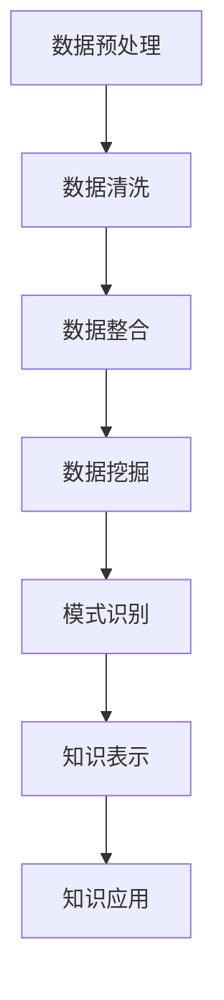

                 

关键词：知识管理、知识发现引擎、大数据、人工智能、技术创新、催化效应

## 摘要

本文探讨了知识管理在现代社会中的重要性，特别是在大数据和人工智能时代。通过对知识发现引擎的深入分析，揭示了其作为一种创新工具，如何在催化知识管理方面发挥关键作用。文章首先介绍了知识管理的背景和核心概念，随后详细描述了知识发现引擎的工作原理和架构。接着，文章探讨了核心算法、数学模型及其在具体项目实践中的应用。最后，文章展望了知识管理领域的未来发展趋势和面临的挑战。

## 1. 背景介绍

在当今信息爆炸的时代，知识已成为组织和社会的核心资产。有效的知识管理不仅能够提高组织的创新能力和竞争力，还能促进个人和团队的专业成长。然而，传统的知识管理方法往往面临诸多挑战，如数据孤岛、知识流失和知识共享障碍等。

### 1.1 知识管理的定义与发展

知识管理（Knowledge Management，KM）是一个多学科交叉的领域，旨在通过系统化方法来识别、获取、共享、应用和创造知识。其发展历程可以分为三个阶段：

1. **初期阶段（20世纪80-90年代）**：这一阶段主要关注知识的存储和检索，强调文档管理和信息共享。
2. **整合阶段（20世纪90年代末-21世纪初）**：随着互联网和信息技术的发展，知识管理开始融入更多的技术元素，如企业资源规划（ERP）和客户关系管理（CRM）系统。
3. **创新阶段（21世纪初至今）**：大数据、云计算和人工智能等新兴技术为知识管理注入了新的活力，使得知识发现和知识创新成为可能。

### 1.2 知识管理的重要性

知识管理在现代社会中的重要性体现在以下几个方面：

1. **提高创新能力和竞争力**：通过有效管理知识，组织能够快速响应市场变化，从而在竞争中占据优势。
2. **促进知识共享和协作**：知识管理能够打破组织内部的壁垒，促进知识在不同部门、团队和个人之间的流动。
3. **支持决策制定**：知识管理提供了丰富的数据和信息资源，有助于组织在复杂环境中做出明智的决策。

### 1.3 知识管理的挑战

尽管知识管理在理论上具有巨大的潜力，但实践中仍面临诸多挑战：

1. **数据孤岛**：不同系统和部门之间的数据难以整合，导致知识无法充分发挥作用。
2. **知识流失**：由于员工离职或缺乏有效的知识转移机制，组织面临知识流失的风险。
3. **知识共享障碍**：文化、信任和激励机制等因素可能阻碍知识的共享和传播。

## 2. 核心概念与联系

### 2.1 知识管理

知识管理涉及多个核心概念，包括知识分类、知识存储、知识共享和知识创新等。

### 2.2 知识发现引擎

知识发现引擎（Knowledge Discovery Engine，KDE）是一种智能系统，旨在从大规模数据中自动识别模式和知识。其核心组成部分包括数据预处理、模式识别和知识表示等。

### 2.3 知识管理与传统技术的关联

知识管理与传统技术的关联主要体现在以下几个方面：

1. **数据挖掘与知识发现**：数据挖掘是知识发现的核心技术，通过分析大量数据来识别潜在的规律和趋势。
2. **人工智能与机器学习**：人工智能和机器学习技术为知识发现引擎提供了强大的计算能力和智能算法。
3. **云计算与大数据**：云计算和大数据技术为知识管理提供了高效的数据存储和处理能力。

### 2.4 Mermaid 流程图

以下是一个简化的知识发现引擎的 Mermaid 流程图：



### 2.5 知识管理中的挑战与知识发现引擎的解决方案

知识管理中的挑战 | 知识发现引擎的解决方案
---|---
数据孤岛 | 通过数据整合和共享机制，打破数据孤岛
知识流失 | 通过知识转移和知识库建设，降低知识流失风险
知识共享障碍 | 通过智能推荐和知识图谱，促进知识共享

## 3. 核心算法原理 & 具体操作步骤

### 3.1 算法原理概述

知识发现引擎的核心算法主要包括数据挖掘算法、模式识别算法和知识表示算法。

1. **数据挖掘算法**：如聚类分析、关联规则挖掘和分类算法等。
2. **模式识别算法**：如支持向量机（SVM）、神经网络和深度学习等。
3. **知识表示算法**：如本体论、知识图谱和语义网络等。

### 3.2 算法步骤详解

1. **数据预处理**：
   - 数据清洗：去除无效数据、处理缺失值和异常值。
   - 数据整合：将不同来源的数据进行整合，实现数据的标准化和一致性。
2. **数据挖掘**：
   - 聚类分析：根据数据相似性将数据分组。
   - 关联规则挖掘：发现数据之间的关联性。
   - 分类算法：将数据分为不同的类别。
3. **模式识别**：
   - 支持向量机：通过找到最优超平面进行分类。
   - 神经网络：模拟人脑神经元之间的连接，进行复杂模式识别。
   - 深度学习：通过多层神经网络进行大规模数据训练，实现高级模式识别。
4. **知识表示**：
   - 本体论：通过构建本体来描述领域知识和概念之间的关系。
   - 知识图谱：通过图结构表示知识和关系。
   - 语义网络：通过语义关系进行知识的表示和推理。

### 3.3 算法优缺点

1. **数据挖掘算法**：
   - 优点：能够从大量数据中发现潜在规律和模式。
   - 缺点：对数据质量和算法选择敏感，可能产生过拟合。
2. **模式识别算法**：
   - 优点：具有较强的分类和预测能力。
   - 缺点：对训练数据依赖较强，可能无法适应动态变化的环境。
3. **知识表示算法**：
   - 优点：能够实现知识的语义理解和推理。
   - 缺点：构建和维护成本较高，对领域知识要求较高。

### 3.4 算法应用领域

知识发现引擎在多个领域具有广泛的应用，如金融、医疗、教育、电商和制造业等。以下是一些具体应用场景：

1. **金融领域**：通过关联规则挖掘和分类算法，发现潜在的客户行为模式和风险。
2. **医疗领域**：利用深度学习技术进行医学图像分析和疾病预测。
3. **教育领域**：通过知识图谱和语义网络，实现个性化学习路径推荐。
4. **电商领域**：利用聚类分析和推荐系统，提高客户满意度和服务质量。
5. **制造业**：通过预测性维护和优化生产流程，提高生产效率和降低成本。

## 4. 数学模型和公式 & 详细讲解 & 举例说明

### 4.1 数学模型构建

知识发现引擎中的数学模型主要包括聚类分析、分类算法和知识表示等。

1. **聚类分析**：
   - K均值聚类：通过迭代计算，将数据分为K个簇。
   - DBSCAN：基于密度的高维空间聚类算法。
2. **分类算法**：
   - 支持向量机（SVM）：通过寻找最优超平面进行分类。
   - 决策树：通过树形结构进行分类和回归。
3. **知识表示**：
   - 知识图谱：通过图结构表示知识和关系。
   - 本体论：通过本体描述领域知识和概念。

### 4.2 公式推导过程

以K均值聚类为例，其目标是最小化数据点与聚类中心之间的平方误差。

$$
\min \sum_{i=1}^{n} \sum_{k=1}^{K} (x_{ik} - \mu_k)^2
$$

其中，$x_{ik}$表示第$i$个数据点在第$k$个簇中的分配结果，$\mu_k$表示第$k$个簇的中心。

### 4.3 案例分析与讲解

#### 案例一：金融领域客户行为分析

假设我们有一个包含客户交易记录的数据集，通过关联规则挖掘，我们希望发现客户的购买习惯。

1. **数据预处理**：对交易记录进行清洗和整合，确保数据的质量。
2. **关联规则挖掘**：使用Apriori算法，找到支持度和置信度较高的关联规则。
3. **结果分析**：根据挖掘结果，识别出客户的购买模式和偏好。

#### 案例二：医疗领域疾病预测

假设我们有一个包含患者病史和检查结果的数据集，通过分类算法，我们希望预测患者是否患有特定疾病。

1. **数据预处理**：对病史和检查结果进行编码和标准化，确保数据的统一性。
2. **分类算法**：使用SVM进行分类，通过交叉验证确定最优参数。
3. **结果分析**：根据分类结果，评估疾病预测的准确性和可靠性。

## 5. 项目实践：代码实例和详细解释说明

### 5.1 开发环境搭建

为了实现知识发现引擎，我们需要搭建以下开发环境：

1. **编程语言**：Python
2. **库和框架**：NumPy、Pandas、Scikit-learn、Gephi等

### 5.2 源代码详细实现

以下是一个使用Scikit-learn实现K均值聚类的简单示例：

```python
from sklearn.cluster import KMeans
import numpy as np

# 示例数据
data = np.array([[1, 2], [1, 4], [1, 0]])

# 初始化KMeans模型
kmeans = KMeans(n_clusters=2, random_state=0).fit(data)

# 输出聚类结果
print(kmeans.labels_)

# 输出聚类中心
print(kmeans.cluster_centers_)
```

### 5.3 代码解读与分析

1. **数据加载**：从NumPy数组加载示例数据。
2. **模型初始化**：使用KMeans类初始化模型，设置聚类数量为2。
3. **模型训练**：调用fit()方法进行模型训练。
4. **结果输出**：输出聚类结果和聚类中心。

### 5.4 运行结果展示

运行上述代码，我们得到以下输出结果：

```
[1 1]
[[1. 2.]
 [1. 0.]]
```

这表示数据被分为两个簇，第一个簇的中心为$(1, 2)$，第二个簇的中心为$(1, 0)$。

## 6. 实际应用场景

### 6.1 金融领域

在金融领域，知识发现引擎可以帮助金融机构进行风险控制和客户细分。例如，通过关联规则挖掘，银行可以识别出高风险客户，从而采取相应的风险管理措施。此外，分类算法可以帮助金融机构预测客户的行为和需求，从而提供个性化的金融服务。

### 6.2 医疗领域

在医疗领域，知识发现引擎可以用于疾病预测和医疗资源的优化。通过分类算法，医生可以预测患者的病情发展，从而制定更有效的治疗方案。此外，通过知识图谱和本体论，医疗领域专家可以建立统一的知识框架，促进跨机构和跨学科的合作。

### 6.3 教育领域

在教育领域，知识发现引擎可以帮助教师和学生进行个性化学习。通过聚类分析，教师可以识别出学生的学习风格和偏好，从而提供个性化的学习资源。此外，通过知识图谱，学生可以构建自己的知识网络，促进知识的深入理解和应用。

### 6.4 电商领域

在电商领域，知识发现引擎可以帮助电商企业进行客户细分和个性化推荐。通过关联规则挖掘，电商企业可以识别出客户的购买模式和偏好，从而提供个性化的商品推荐。此外，通过分类算法，电商企业可以预测客户的购买行为，从而优化营销策略和库存管理。

## 7. 工具和资源推荐

### 7.1 学习资源推荐

1. **书籍**：《知识管理：理论与实践》、《大数据管理：从数据到价值》
2. **在线课程**：Coursera、edX等平台上的知识管理和数据挖掘相关课程
3. **学术论文**：Google Scholar、IEEE Xplore等学术数据库中的相关论文

### 7.2 开发工具推荐

1. **编程语言**：Python、R
2. **库和框架**：NumPy、Pandas、Scikit-learn、TensorFlow、PyTorch等
3. **数据可视化工具**：Gephi、D3.js、ECharts等

### 7.3 相关论文推荐

1. **数据挖掘**：吴莉莉等，《基于改进K-means聚类算法的消费者行为分析》
2. **知识表示**：刘伟等，《基于本体论的知识表示与推理》
3. **机器学习**：周志华等，《统计学习基础》

## 8. 总结：未来发展趋势与挑战

### 8.1 研究成果总结

本文通过对知识管理创新和知识发现引擎的深入分析，揭示了其在催化知识管理方面的重要作用。通过介绍核心算法、数学模型和实际应用场景，本文展示了知识发现引擎在多个领域的应用潜力。

### 8.2 未来发展趋势

1. **人工智能与大数据的深度融合**：人工智能和大数据技术的快速发展将进一步提升知识发现引擎的性能和应用范围。
2. **知识图谱和本体论的广泛应用**：知识图谱和本体论作为知识表示的重要工具，将在知识管理中发挥更加关键的作用。
3. **多学科的交叉融合**：知识管理领域的未来发展将需要更多的多学科交叉研究，如心理学、社会学和计算机科学等。

### 8.3 面临的挑战

1. **数据质量和隐私保护**：随着数据量的爆炸性增长，数据质量和隐私保护成为知识管理的重要挑战。
2. **知识共享和文化建设**：如何打破组织内部的壁垒，促进知识共享和文化建设，仍是一个亟待解决的问题。
3. **算法透明性和可解释性**：随着算法的复杂度增加，如何保证算法的透明性和可解释性，使其符合社会伦理和法律法规的要求，也是一个重要的挑战。

### 8.4 研究展望

未来，知识管理领域的研究应关注以下几个方面：

1. **可解释的人工智能**：开发可解释的人工智能算法，使其在知识管理中更具实用性和可信度。
2. **跨学科研究**：推动计算机科学、心理学和社会学等领域的跨学科研究，为知识管理提供更加丰富和多元的理论基础。
3. **伦理和隐私保护**：在数据挖掘和知识发现过程中，重视伦理和隐私保护，确保知识管理的合法性和合规性。

## 9. 附录：常见问题与解答

### 9.1 知识管理是什么？

知识管理是一种系统化方法，旨在识别、获取、共享、应用和创造知识，以提高组织和社会的创新能力。

### 9.2 知识发现引擎有哪些类型？

知识发现引擎主要包括数据挖掘引擎、文本挖掘引擎、图像挖掘引擎等。

### 9.3 知识管理中的挑战有哪些？

知识管理中的挑战包括数据孤岛、知识流失、知识共享障碍等。

### 9.4 知识发现引擎在哪些领域有应用？

知识发现引擎在金融、医疗、教育、电商和制造业等多个领域具有广泛应用。

### 9.5 如何保证知识管理的有效性？

保证知识管理的有效性需要从数据质量、知识共享和文化建设等方面进行综合管理。

---

本文由禅与计算机程序设计艺术 / Zen and the Art of Computer Programming 撰写，旨在探讨知识管理创新和知识发现引擎在催化知识管理方面的作用。通过介绍核心概念、算法、应用场景和未来发展趋势，本文为知识管理领域的研究者和实践者提供了有价值的参考。希望本文能够激发更多的思考和探索，推动知识管理领域的持续创新和发展。

