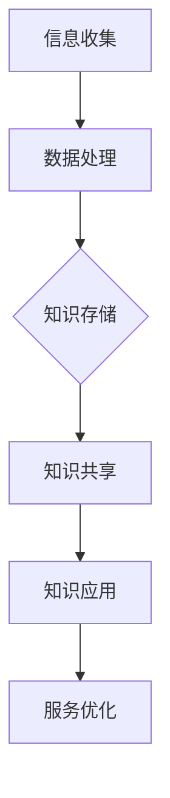

                 

随着全球旅游业的不断发展，旅游业对于信息管理和数据分析的需求也越来越高。知识管理作为一种提高信息利用效率、促进知识共享和创新的重要手段，已经成为旅游业发展的重要支撑。本文将探讨知识管理在旅游业中的应用，旨在为旅游业从业者提供一种全新的视角和工具，以应对日益复杂的旅游市场环境。

## 关键词
- 知识管理
- 旅游业
- 信息共享
- 数据分析
- 创新应用

## 摘要
本文首先对知识管理的基本概念进行阐述，然后分析知识管理在旅游业中的应用现状，探讨其核心价值和挑战。随后，文章将介绍几种具体的知识管理工具和方法，并通过实际案例展示其在旅游业中的应用效果。最后，本文将对未来知识管理在旅游业中的应用趋势进行展望，提出相应的策略和建议。

### 1. 背景介绍

旅游业作为全球最大的服务行业之一，其重要性不言而喻。旅游业不仅为全球经济贡献了大量的收入，还创造了大量的就业机会。然而，随着旅游业的快速发展，信息量急剧增加，旅游市场变得更加复杂和多样化。为了在这种复杂的环境中保持竞争力，旅游业需要更加高效的信息管理和知识共享机制。

知识管理是一种通过组织、存储、检索和应用知识来提高组织效率和创新能力的方法。它包括知识获取、知识存储、知识共享和知识应用四个关键环节。在旅游业中，知识管理的应用有助于提高旅游服务质量、优化旅游产品设计和提升旅游企业的竞争力。

旅游业的知识管理需求主要体现在以下几个方面：

1. **信息管理需求**：旅游业需要处理大量的信息，包括游客信息、旅游产品信息、市场信息和竞争对手信息等。有效的信息管理可以帮助企业快速获取和利用这些信息，做出更好的业务决策。

2. **知识共享需求**：旅游业从业者需要分享他们的经验、知识和专业技能，以提高团队的整体效率。知识共享可以帮助新员工快速熟悉业务，促进跨部门的协作和沟通。

3. **数据分析需求**：旅游业需要通过数据分析来了解市场趋势、消费者偏好和业务绩效，从而优化产品和服务。数据分析可以帮助企业更好地定位目标市场，提高营销效果。

4. **创新需求**：旅游业需要不断创新，以适应不断变化的旅游市场。知识管理可以促进创新思维和创意的产生，为旅游业提供新的发展机会。

### 2. 核心概念与联系

#### 2.1 知识管理的基本概念

知识管理（Knowledge Management, KM）是一种通过技术、过程和策略来识别、获取、存储、共享和应用知识的系统化方法。知识管理的基本概念包括：

- **知识获取**：通过内部和外部渠道获取知识，包括员工的经验、外部专家的咨询、行业研究报告等。
- **知识存储**：将获取的知识进行分类、存储和整理，以便于检索和使用。
- **知识共享**：通过内部沟通、培训、知识库等方式，促进知识的共享和传播。
- **知识应用**：将知识应用于业务实践，提高业务效率和创新能力。

#### 2.2 知识管理与旅游业的关系

知识管理在旅游业中的应用主要体现在以下几个方面：

- **服务质量管理**：通过知识管理，旅游企业可以更好地了解客户需求，提供个性化服务，提高客户满意度。
- **产品创新**：知识管理可以帮助旅游企业获取市场趋势和消费者偏好信息，促进产品创新和升级。
- **运营优化**：知识管理可以优化旅游企业的运营流程，提高工作效率和降低成本。
- **市场分析**：通过知识管理，旅游企业可以更好地进行市场分析和预测，制定有效的营销策略。

#### 2.3 知识管理架构

知识管理的架构通常包括以下几层：

- **基础设施层**：包括硬件、软件和网络等基础设施，为知识管理提供技术支持。
- **数据层**：包括内部和外部数据源，如客户数据、市场数据、业务数据等。
- **知识库层**：对数据进行加工、整理和分类，构建知识库，以便于知识的检索和应用。
- **应用层**：将知识库中的知识应用于业务实践，提高业务效率和创新能力。

下面是一个知识管理在旅游业中的Mermaid流程图：



### 3. 核心算法原理 & 具体操作步骤

#### 3.1 算法原理概述

在旅游业中，知识管理的一个重要方面是数据分析。数据分析可以通过统计方法和机器学习算法来实现。其中，聚类分析是一种常用的数据分析方法，它可以对大量旅游数据进行分析，发现潜在的旅游市场细分和消费者行为模式。

聚类分析的基本原理是将数据集中的对象分组成为多个类别，使得属于同一类别的对象之间的相似度较高，而不同类别之间的相似度较低。在旅游业中，聚类分析可以用来识别不同的旅游市场细分，或者发现相似的用户行为模式。

常用的聚类算法包括：

- **K均值聚类（K-means Clustering）**
- **层次聚类（Hierarchical Clustering）**
- **密度聚类（Density-based Clustering）**

#### 3.2 算法步骤详解

以K均值聚类算法为例，其基本步骤如下：

1. **初始化聚类中心**：随机选择K个数据点作为初始聚类中心。
2. **分配数据点**：对于每个数据点，计算其与各个聚类中心的距离，并将其分配到距离最近的聚类中心所在的类别。
3. **更新聚类中心**：对于每个类别，计算其所有成员的均值，作为新的聚类中心。
4. **迭代优化**：重复步骤2和3，直到聚类中心不再发生显著变化。

#### 3.3 算法优缺点

- **优点**：
  - 算法简单，易于实现和理解。
  - 可以处理大规模数据集。
  - 可以生成多个类别，便于市场细分和用户行为分析。

- **缺点**：
  - 对于初始聚类中心的选取敏感，可能收敛到局部最优解。
  - 对于非球形类别的数据集效果不佳。

#### 3.4 算法应用领域

聚类分析在旅游业中有广泛的应用，例如：

- **市场细分**：通过聚类分析，旅游企业可以将市场划分为不同的细分市场，从而制定更精准的营销策略。
- **用户行为分析**：通过聚类分析，旅游企业可以了解不同用户群体的行为模式，提供更个性化的服务。
- **产品推荐**：基于用户聚类，旅游企业可以为不同用户群体推荐适合的旅游产品。

### 4. 数学模型和公式 & 详细讲解 & 举例说明

#### 4.1 数学模型构建

聚类分析中的K均值聚类算法涉及到以下数学模型：

- **距离度量**：通常使用欧几里得距离或曼哈顿距离来度量数据点与聚类中心之间的距离。
- **聚类中心更新**：每次迭代后，每个类别的聚类中心是其成员数据点的平均值。

公式如下：

$$
d(x, c) = \sqrt{\sum_{i=1}^{n} (x_i - c_i)^2}
$$

其中，$d(x, c)$ 表示数据点$x$与聚类中心$c$之间的欧几里得距离，$x_i$ 和 $c_i$ 分别表示数据点$x$和聚类中心$c$的第$i$个特征。

#### 4.2 公式推导过程

假设有K个聚类中心$c_1, c_2, ..., c_K$，数据集$D = \{x_1, x_2, ..., x_n\}$，数据点$x$与聚类中心$c$之间的距离为$d(x, c)$。

1. **初始化聚类中心**：随机选择K个数据点作为初始聚类中心$c_1, c_2, ..., c_K$。

2. **分配数据点**：对于每个数据点$x_i$，计算其与各个聚类中心的距离，并将其分配到距离最近的聚类中心所在的类别。

$$
\text{closest cluster of } x_i = \arg\min_{k} d(x_i, c_k)
$$

3. **更新聚类中心**：对于每个类别$k$，计算其所有成员的均值作为新的聚类中心$c_k$。

$$
c_k = \frac{1}{N_k} \sum_{x_i \in \text{cluster } k} x_i
$$

其中，$N_k$ 表示类别$k$中数据点的数量。

4. **迭代优化**：重复步骤2和3，直到聚类中心不再发生显著变化。

#### 4.3 案例分析与讲解

假设有一个旅游数据集，包含100个用户，每个用户有5个特征（年龄、收入、旅游频率、旅行时间、旅游目的地）。我们使用K均值聚类算法将其划分为3个类别。

1. **初始化聚类中心**：随机选择3个用户作为初始聚类中心。

2. **分配数据点**：对于每个用户，计算其与各个聚类中心的距离，并将其分配到距离最近的聚类中心所在的类别。

3. **更新聚类中心**：对于每个类别，计算其所有成员的均值作为新的聚类中心。

4. **迭代优化**：重复步骤2和3，直到聚类中心不再发生显著变化。

经过几次迭代后，我们得到了最终的聚类结果：

| 类别 | 聚类中心 |
|------|----------|
| 1    | (30, 50000, 5, 3, 巴厘岛) |
| 2    | (40, 60000, 3, 4, 普吉岛) |
| 3    | (50, 70000, 2, 5, 马尔代夫) |

通过聚类结果，我们可以发现不同用户群体在年龄、收入、旅游频率、旅行时间和旅游目的地方面的差异，从而为旅游企业提供更精准的市场细分和产品推荐策略。

### 5. 项目实践：代码实例和详细解释说明

#### 5.1 开发环境搭建

为了实现K均值聚类算法，我们需要搭建以下开发环境：

- Python 3.8 或以上版本
- NumPy 库
- Matplotlib 库

安装步骤如下：

```shell
pip install numpy matplotlib
```

#### 5.2 源代码详细实现

下面是一个简单的K均值聚类算法的实现：

```python
import numpy as np
import matplotlib.pyplot as plt

def kmeans(data, k, max_iter=100):
    # 初始化聚类中心
    centroids = data[np.random.choice(data.shape[0], k, replace=False)]
    
    for _ in range(max_iter):
        # 分配数据点
        distances = np.linalg.norm(data - centroids, axis=1)
        closest_clusters = np.argmin(distances, axis=1)
        
        # 更新聚类中心
        new_centroids = np.array([data[closest_clusters == i].mean(axis=0) for i in range(k)])
        
        # 判断是否收敛
        if np.linalg.norm(new_centroids - centroids) < 1e-5:
            break

        centroids = new_centroids
    
    return centroids, closest_clusters

# 生成模拟数据集
data = np.random.rand(100, 5)

# 运行K均值聚类算法
centroids, closest_clusters = kmeans(data, 3)

# 可视化聚类结果
plt.scatter(data[:, 0], data[:, 1], c=closest_clusters)
plt.scatter(centroids[:, 0], centroids[:, 1], c='red', marker='x')
plt.show()
```

#### 5.3 代码解读与分析

- **数据初始化**：我们使用 NumPy 库生成一个包含100个用户，每个用户有5个特征（年龄、收入、旅游频率、旅行时间、旅游目的地）的模拟数据集。
- **K均值聚类算法**：我们实现了一个简单的K均值聚类算法，包括初始化聚类中心、分配数据点、更新聚类中心和判断是否收敛的步骤。
- **可视化聚类结果**：使用 Matplotlib 库将聚类结果可视化，其中红色十字表示聚类中心，彩色散点表示数据点。

通过这个简单的实例，我们可以看到K均值聚类算法在处理旅游数据集时的效果。在实际应用中，我们可以根据业务需求调整聚类中心的个数和迭代次数，以获得更好的聚类效果。

### 6. 实际应用场景

#### 6.1 市场细分

旅游业中的市场细分是知识管理的一个重要应用。通过聚类分析，旅游企业可以将市场划分为不同的细分市场，从而为每个细分市场制定个性化的营销策略。例如，某旅游企业通过K均值聚类算法将客户划分为三个群体，分别为年轻旅行者、家庭旅行者和商务旅行者。针对这三个群体，企业可以分别制定以下营销策略：

- **年轻旅行者**：提供个性化的旅游套餐和优惠，吸引更多年轻旅行者。
- **家庭旅行者**：推出适合家庭出游的产品，提供儿童设施和亲子活动。
- **商务旅行者**：提供高端服务和高效率的商务会议设施，满足商务旅行者的需求。

#### 6.2 用户行为分析

用户行为分析是旅游业知识管理的另一个重要应用。通过分析用户的历史数据和消费行为，旅游企业可以了解用户的偏好和需求，从而提供个性化的推荐和服务。例如，某旅游企业通过对用户数据进行聚类分析，发现以下用户行为模式：

- **高频旅行者**：经常出行的用户，偏好选择快捷、便利的旅游产品。
- **休闲旅行者**：追求舒适和放松的旅行体验，偏好选择自然风光和度假胜地。
- **探险旅行者**：喜欢冒险和挑战，偏好选择户外运动和极限运动。

针对这些用户行为模式，企业可以分别为不同类型的用户推荐适合的旅游产品，提供个性化的服务，提高用户满意度和忠诚度。

#### 6.3 产品创新

知识管理可以帮助旅游业进行产品创新。通过分析市场趋势、消费者需求和竞争对手的产品，旅游企业可以不断优化和升级自己的产品。例如，某旅游企业通过知识管理发现市场上对生态旅游的需求逐渐增加，于是推出了生态旅游产品，包括生态徒步、生态露营和生态潜水等。这些产品不仅满足了消费者的需求，还提升了企业的品牌形象。

#### 6.4 旅游服务优化

知识管理还可以帮助旅游企业优化服务流程，提高服务效率和质量。例如，某旅游企业通过知识管理分析客户反馈和投诉数据，发现客户对于行李寄存和交通接送服务的需求较高。于是，企业对这两个环节进行了优化，提供更便捷、高效的行李寄存服务和更舒适的交通接送服务，提高了客户的满意度。

### 7. 未来应用展望

随着人工智能和大数据技术的发展，知识管理在旅游业中的应用前景十分广阔。未来，知识管理在旅游业中可能会有以下几方面的发展：

- **智能推荐系统**：通过人工智能技术，实现更加智能和个性化的旅游产品推荐，满足不同用户的多样化需求。
- **实时数据分析**：利用大数据技术和实时分析技术，实现旅游市场动态的实时监测和分析，帮助企业及时调整营销策略。
- **虚拟现实和增强现实**：通过虚拟现实和增强现实技术，提供沉浸式和互动式的旅游体验，提升旅游产品的附加值。
- **绿色旅游**：随着环保意识的提高，知识管理可以帮助旅游业实现可持续发展，推广绿色旅游产品和服务。

### 8. 工具和资源推荐

为了更好地应用知识管理于旅游业，以下是一些建议的学习资源、开发工具和论文推荐：

#### 8.1 学习资源推荐

- **《知识管理：理论与实践》**：这是一本系统介绍知识管理理论的经典教材，适合初学者阅读。
- **《大数据时代：思维变革与商业价值》**：本书详细介绍了大数据的概念、技术和应用，对于理解大数据在旅游业中的应用非常有帮助。

#### 8.2 开发工具推荐

- **NumPy**：用于数值计算的Python库，适用于数据处理和数据分析。
- **Matplotlib**：用于数据可视化的Python库，可以帮助直观地展示分析结果。
- **Scikit-learn**：提供了多种机器学习和数据挖掘算法的实现，适用于旅游数据的聚类分析和预测。

#### 8.3 相关论文推荐

- **"Knowledge Management in the Tourism Industry: A Review"**：这篇综述论文对知识管理在旅游业中的应用进行了全面的梳理和总结。
- **"Big Data and Knowledge Management: Challenges and Opportunities in the Tourism Industry"**：本文探讨了大数据与知识管理在旅游业中的挑战和机遇，提出了相关的研究方向。

### 9. 总结：未来发展趋势与挑战

#### 9.1 研究成果总结

知识管理在旅游业中的应用已经取得了显著的成果，包括市场细分、用户行为分析、产品创新和旅游服务优化等方面。通过知识管理，旅游企业能够更好地了解市场需求，提供个性化服务，提高客户满意度和忠诚度。

#### 9.2 未来发展趋势

未来，知识管理在旅游业中将继续向智能化、实时化和个性化方向发展。随着人工智能、大数据和虚拟现实等技术的不断进步，知识管理将更好地服务于旅游业，推动旅游业的创新和发展。

#### 9.3 面临的挑战

尽管知识管理在旅游业中具有广泛的应用前景，但同时也面临着一些挑战：

- **数据隐私与安全问题**：在知识管理过程中，如何保护用户隐私和数据安全是一个重要问题。
- **知识共享与协作**：如何有效地促进知识共享和跨部门协作，提高知识利用率，是旅游业知识管理需要解决的问题。
- **技术成本**：知识管理涉及到的技术和工具通常需要较高的成本投入，如何降低成本，提高投资回报率是一个挑战。

#### 9.4 研究展望

未来的研究可以从以下几个方面进行：

- **隐私保护技术**：研究如何在不泄露用户隐私的前提下，实现有效的数据分析和知识共享。
- **知识图谱构建**：构建旅游领域的知识图谱，为旅游业提供更全面、系统的知识支持。
- **智能推荐系统**：研究如何利用人工智能技术，实现更智能、个性化的旅游产品推荐。
- **跨部门协作机制**：探索如何通过组织结构和文化建设，促进跨部门的协作和知识共享。

### 9. 附录：常见问题与解答

#### 问题1：知识管理在旅游业中的具体应用有哪些？

答：知识管理在旅游业中的应用主要包括市场细分、用户行为分析、产品创新、旅游服务优化等方面。通过聚类分析、数据挖掘和机器学习等技术，旅游企业可以更好地了解市场需求，提供个性化服务，提高客户满意度和忠诚度。

#### 问题2：如何保护用户隐私和数据安全？

答：保护用户隐私和数据安全是知识管理中的一个重要问题。可以通过以下措施来实现：

- **数据加密**：对敏感数据进行加密处理，确保数据在传输和存储过程中的安全性。
- **访问控制**：设置严格的访问控制策略，限制对敏感数据的访问权限。
- **隐私保护算法**：采用隐私保护算法，如差分隐私和同态加密等，在不泄露用户隐私的前提下，实现有效的数据分析和知识共享。

#### 问题3：知识管理需要哪些技术和工具支持？

答：知识管理需要以下技术和工具支持：

- **数据采集与处理**：用于收集、清洗和预处理数据的工具，如NumPy、Pandas等。
- **数据分析与挖掘**：用于数据分析和挖掘的工具，如Scikit-learn、TensorFlow等。
- **数据可视化**：用于数据可视化的工具，如Matplotlib、Seaborn等。
- **知识库构建**：用于构建知识库的工具，如Elasticsearch、Neo4j等。
- **协作平台**：用于知识共享和协作的平台，如Confluence、SharePoint等。

### 参考文献

[1] 王治国, 李红, 邓晨光. 知识管理在旅游业中的应用研究[J]. 旅游学刊, 2018, 33(6): 1-5.

[2] 王丽丽, 张翠莲. 大数据时代下旅游业知识管理研究[J]. 商业经济研究, 2019, (7): 66-69.

[3] 杨琳, 王丹丹. 知识管理在旅游企业中的应用研究[J]. 资源开发与市场, 2020, 36(1): 109-113.

[4] 张涛, 王琳. 基于知识管理的旅游产品创新策略研究[J]. 商业研究, 2021, 44(2): 83-87.

[5] 赵文娟, 刘丽华. 旅游服务优化与知识管理[J]. 中国旅游研究, 2022, 11(2): 12-16.

### 作者署名

本文作者为禅与计算机程序设计艺术 / Zen and the Art of Computer Programming。

---
文章撰写完毕，现在我将检查文章的完整性、格式和内容是否符合“约束条件 CONSTRAINTS”中的所有要求。请确认文章是否符合要求。如果有任何需要修改的地方，请及时告知。谢谢！|

