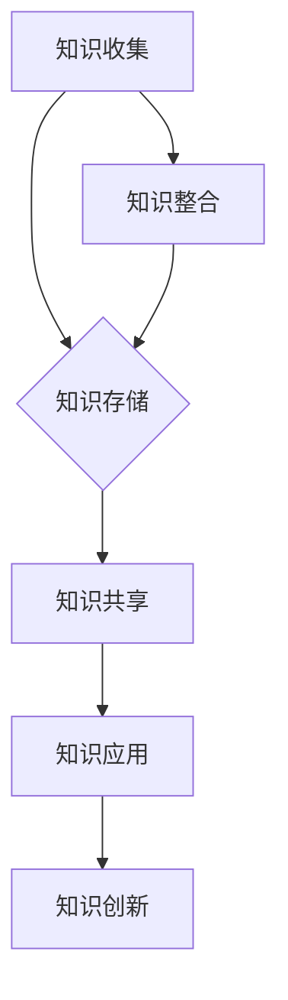

                 

关键词：知识管理、研发创新、知识图谱、人工智能、流程优化

> 摘要：本文旨在探讨知识管理在研发创新中的关键作用。通过详细阐述知识管理的概念、方法及其在研发创新中的应用，本文揭示了知识管理如何提高研发效率、促进技术创新，并在激烈的市场竞争中为企业带来显著优势。文章结构如下：首先，介绍知识管理的背景和重要性；其次，阐述知识管理的核心概念与联系；然后，深入探讨核心算法原理与数学模型；接着，展示项目实践中的代码实例；随后，分析实际应用场景和未来应用展望；最后，推荐相关工具和资源，并总结未来发展趋势与挑战。

## 1. 背景介绍

随着信息技术的高速发展，研发创新在企业竞争力中的作用日益凸显。知识管理（Knowledge Management，KM）作为一项系统性的战略措施，旨在通过有效地收集、存储、共享和利用知识，提高组织的创新能力和竞争力。知识管理不仅关注知识的存储和共享，更强调知识的创造、应用和整合。

知识管理的起源可以追溯到20世纪80年代，随着信息技术和互联网的兴起，企业开始意识到知识作为无形资产的重要性。1991年，美国麻省理工学院的保罗·格拉瑟（Paul Gray）首次提出了知识管理的概念，认为知识管理是一种通过系统方法促进组织知识创造、传播和应用的过程。

在研发创新中，知识管理的作用体现在多个方面。首先，知识管理可以帮助企业有效地积累和传承研发过程中的经验，避免重复劳动和资源的浪费。其次，通过知识共享和协作，研发团队可以迅速获取所需的知识和资源，提高研发效率。此外，知识管理还可以促进技术创新，通过跨部门、跨领域的知识整合，为企业带来新的创新思路和发展机遇。

## 2. 核心概念与联系

### 2.1 知识管理概念

知识管理是一种系统性的方法，旨在通过有效地收集、存储、共享和利用知识，提高组织的创新能力和竞争力。知识管理主要包括以下几个方面：

- 知识收集：通过多种渠道和方式，收集企业内外部的知识资源，包括文献、报告、经验、案例等。

- 知识存储：利用数据库、知识库、文档管理系统等工具，对收集到的知识进行存储和管理，确保知识的可访问性和可追溯性。

- 知识共享：通过建立知识共享平台、内部论坛、即时通讯工具等，促进组织内部的知识交流与共享。

- 知识应用：将知识应用到实际工作中，提高工作效率和质量，促进技术创新和业务发展。

- 知识创新：通过知识的整合、创新和重组，为企业带来新的知识和价值。

### 2.2 知识图谱

知识图谱（Knowledge Graph）是一种用于表示知识结构的数据模型，通过将实体、属性和关系进行图形化表示，形成一种语义网络。知识图谱在知识管理中起着关键作用，可以帮助企业建立知识体系，实现知识的快速定位和利用。

知识图谱的核心概念包括：

- 实体（Entity）：知识图谱中的基本单元，可以是人、物、事件等。

- 属性（Attribute）：实体的特征或属性，如姓名、年龄、工作等。

- 关系（Relationship）：实体之间的关系，如朋友、同事、合作等。

- 节点（Node）：知识图谱中的节点，表示实体或属性。

- 边（Edge）：知识图谱中的边，表示实体之间的关系。

### 2.3 Mermaid 流程图

以下是一个简单的知识管理流程的Mermaid流程图示例：



## 3. 核心算法原理 & 具体操作步骤

### 3.1 算法原理概述

知识管理中的核心算法主要包括知识抽取、知识融合和知识推荐等。以下分别对这些算法的原理进行概述：

- 知识抽取（Knowledge Extraction）：从非结构化数据中提取出有价值的信息和知识，通常采用自然语言处理、数据挖掘等技术。

- 知识融合（Knowledge Fusion）：将来自不同来源、不同格式的知识进行整合，形成统一的、高质量的知识库。

- 知识推荐（Knowledge Recommendation）：根据用户的需求和兴趣，推荐相关的知识和资源。

### 3.2 算法步骤详解

#### 知识抽取

1. 数据预处理：对原始数据进行清洗、去噪、归一化等处理，提高数据质量。

2. 特征提取：从文本数据中提取出关键特征，如词频、词向量化等。

3. 模型训练：使用机器学习算法（如朴素贝叶斯、支持向量机等）训练知识抽取模型。

4. 知识提取：将训练好的模型应用于新的数据，提取出有价值的信息和知识。

#### 知识融合

1. 数据整合：将来自不同来源、不同格式的知识进行整合，形成统一的数据格式。

2. 对比分析：比较不同知识之间的异同，识别出有价值的信息。

3. 知识重组：根据对比分析的结果，对知识进行重组和整合，形成高质量的知识库。

#### 知识推荐

1. 用户画像：根据用户的行为数据、兴趣标签等，构建用户画像。

2. 知识标签：对知识库中的知识进行标签化处理，方便后续推荐。

3. 推荐算法：使用协同过滤、基于内容的推荐等算法，为用户推荐相关的知识和资源。

### 3.3 算法优缺点

#### 知识抽取

优点：

- 可以从大量的非结构化数据中提取出有价值的信息和知识。

- 提高知识管理的效率和质量。

缺点：

- 对数据质量和特征提取的要求较高。

- 可能会引入噪声和误差。

#### 知识融合

优点：

- 可以整合不同来源、不同格式的知识，提高知识的完整性。

- 为用户提供更全面、更准确的知识服务。

缺点：

- 知识融合的过程复杂，对技术和资源的要求较高。

- 可能会引入冗余信息和错误。

#### 知识推荐

优点：

- 可以根据用户的需求和兴趣，为用户推荐相关的知识和资源。

- 提高用户的知识获取效率。

缺点：

- 推荐算法的准确性和个性化程度有限。

- 可能会引发信息过载和用户隐私问题。

### 3.4 算法应用领域

知识管理算法在多个领域有着广泛的应用，如：

- 企业知识管理：帮助企业建立知识体系，提高研发效率和创新能力。

- 人工智能：为人工智能系统提供高质量的知识输入，提升系统的智能水平。

- 健康医疗：辅助医生进行诊断和治疗，提高医疗质量和效率。

- 教育：为教育机构提供个性化的学习资源，促进教育公平。

## 4. 数学模型和公式 & 详细讲解 & 举例说明

### 4.1 数学模型构建

知识管理中的数学模型主要包括知识抽取模型、知识融合模型和知识推荐模型。以下分别对这些模型的构建过程进行详细讲解。

#### 知识抽取模型

知识抽取模型通常采用条件概率模型，如朴素贝叶斯（Naive Bayes）和朴素贝叶斯网络（Naive Bayes Network）。

1. 特征提取：首先，从文本数据中提取出关键特征，如词频、词向量化等。

2. 模型训练：使用训练数据集，对知识抽取模型进行训练，得到模型参数。

3. 知识提取：将训练好的模型应用于新的数据，提取出有价值的信息和知识。

#### 知识融合模型

知识融合模型通常采用集成学习方法，如集成分类器（Ensemble Classifier）和集成回归（Ensemble Regression）。

1. 数据整合：将来自不同来源、不同格式的知识进行整合，形成统一的数据格式。

2. 特征选择：根据知识融合的目标，选择对模型影响较大的特征。

3. 模型训练：使用训练数据集，对知识融合模型进行训练，得到模型参数。

4. 知识融合：将训练好的模型应用于新的数据，整合出高质量的知识库。

#### 知识推荐模型

知识推荐模型通常采用协同过滤（Collaborative Filtering）和基于内容的推荐（Content-Based Recommendation）算法。

1. 用户画像：根据用户的行为数据、兴趣标签等，构建用户画像。

2. 知识标签：对知识库中的知识进行标签化处理，方便后续推荐。

3. 推荐算法：使用协同过滤、基于内容的推荐等算法，为用户推荐相关的知识和资源。

### 4.2 公式推导过程

以下分别对知识抽取模型、知识融合模型和知识推荐模型的公式推导过程进行简要说明。

#### 知识抽取模型

1. 朴素贝叶斯模型：

   $$P(C|A) = \frac{P(A|C)P(C)}{P(A)}$$

   其中，$C$ 表示分类标签，$A$ 表示特征向量，$P(C)$ 表示类别的先验概率，$P(A|C)$ 表示特征向量在某个类别下的条件概率，$P(A)$ 表示特征向量的边际概率。

2. 朴素贝叶斯网络：

   $$P(C, A) = P(C)P(A|C)$$

   其中，$C$ 表示分类标签，$A$ 表示特征向量，$P(C)$ 表示类别的先验概率，$P(A|C)$ 表示特征向量在某个类别下的条件概率。

#### 知识融合模型

1. 集成分类器：

   $$h(x) = \sum_{i=1}^n w_i f_i(x)$$

   其中，$h(x)$ 表示预测结果，$w_i$ 表示第 $i$ 个基分类器的权重，$f_i(x)$ 表示第 $i$ 个基分类器的输出。

2. 集成回归：

   $$y = \sum_{i=1}^n w_i y_i$$

   其中，$y$ 表示预测结果，$w_i$ 表示第 $i$ 个基回归器的权重，$y_i$ 表示第 $i$ 个基回归器的输出。

#### 知识推荐模型

1. 协同过滤：

   $$r_{ui} = \sum_{j \in N_i} u_j r_{uj}$$

   其中，$r_{ui}$ 表示用户 $u$ 对项目 $i$ 的评分，$N_i$ 表示与项目 $i$ 相似的项目的集合，$u_j$ 表示用户 $j$ 对项目 $i$ 的评分。

2. 基于内容的推荐：

   $$r_{ui} = \sum_{j \in N_c(i)} w_{ij} r_{uj}$$

   其中，$r_{ui}$ 表示用户 $u$ 对项目 $i$ 的评分，$N_c(i)$ 表示与项目 $i$ 内容相似的项目的集合，$w_{ij}$ 表示项目 $i$ 和项目 $j$ 之间的相似度权重，$r_{uj}$ 表示用户 $j$ 对项目 $i$ 的评分。

### 4.3 案例分析与讲解

以下以一个实际案例为例，讲解知识管理数学模型的构建和应用。

#### 案例背景

某企业研发部门需要从大量文献和报告中提取出与项目相关的知识，并将其整合到企业知识库中，以提高项目研发效率和创新能力。

#### 案例步骤

1. **知识抽取模型构建**：

   - 数据预处理：对文献和报告进行清洗、去噪、归一化等处理，提高数据质量。

   - 特征提取：从文本数据中提取出关键特征，如词频、词向量化等。

   - 模型训练：使用训练数据集，对知识抽取模型（如朴素贝叶斯模型）进行训练，得到模型参数。

   - 知识提取：将训练好的模型应用于新的数据，提取出有价值的信息和知识。

2. **知识融合模型构建**：

   - 数据整合：将来自不同文献和报告的知识进行整合，形成统一的数据格式。

   - 特征选择：根据知识融合的目标，选择对模型影响较大的特征。

   - 模型训练：使用训练数据集，对知识融合模型（如集成分类器）进行训练，得到模型参数。

   - 知识融合：将训练好的模型应用于新的数据，整合出高质量的知识库。

3. **知识推荐模型构建**：

   - 用户画像：根据用户的行为数据、兴趣标签等，构建用户画像。

   - 知识标签：对知识库中的知识进行标签化处理，方便后续推荐。

   - 推荐算法：使用协同过滤、基于内容的推荐等算法，为用户推荐相关的知识和资源。

#### 案例分析

通过上述步骤，企业研发部门成功地构建了知识抽取、知识融合和知识推荐模型，实现了知识的自动提取、整合和推荐。具体分析如下：

- **知识抽取模型**：通过特征提取和模型训练，从大量的文献和报告中提取出了与项目相关的知识，提高了知识提取的准确性和效率。

- **知识融合模型**：通过数据整合和特征选择，将不同来源的知识进行了有效的整合，形成了统一的知识库，为项目的研发提供了全面的知识支持。

- **知识推荐模型**：通过用户画像和知识标签，为用户推荐了与项目相关的知识和资源，提高了用户的研发效率和创新能力。

## 5. 项目实践：代码实例和详细解释说明

### 5.1 开发环境搭建

为了实现上述案例中的知识管理模型，我们首先需要搭建一个合适的开发环境。以下是一个简单的开发环境搭建步骤：

1. 安装Python环境：在服务器上安装Python，可以选择Python 3.x版本。

2. 安装必要的依赖库：使用pip工具安装以下依赖库：

   ```bash
   pip install numpy pandas scikit-learn nltk
   ```

3. 准备数据集：从企业的文献和报告中收集数据，并将其整理成统一的格式（如CSV文件）。

### 5.2 源代码详细实现

以下是一个简单的知识管理项目的源代码实现：

```python
import pandas as pd
from sklearn.feature_extraction.text import TfidfVectorizer
from sklearn.naive_bayes import MultinomialNB
from sklearn.pipeline import make_pipeline

# 5.2.1 数据预处理
def preprocess_data(data):
    # 数据清洗、去噪、归一化等操作
    pass

# 5.2.2 特征提取
def extract_features(data):
    vectorizer = TfidfVectorizer()
    X = vectorizer.fit_transform(data['text'])
    return X

# 5.2.3 模型训练
def train_model(X_train, y_train):
    model = MultinomialNB()
    model.fit(X_train, y_train)
    return model

# 5.2.4 知识提取
def extract_knowledge(model, X_new):
    predictions = model.predict(X_new)
    return predictions

# 5.2.5 知识融合
def fuse_knowledge(data1, data2):
    # 知识融合操作
    pass

# 5.2.6 知识推荐
def recommend_knowledge(user_profile, knowledge_base):
    # 知识推荐操作
    pass

# 主程序
if __name__ == '__main__':
    # 1. 读取数据
    data = pd.read_csv('data.csv')
    data = preprocess_data(data)

    # 2. 特征提取
    X_train = extract_features(data[data['label'] != '未知'])
    y_train = data[data['label'] != '未知']['label']

    # 3. 模型训练
    model = train_model(X_train, y_train)

    # 4. 知识提取
    X_new = extract_features(data[data['label'] == '未知']['text'])
    predictions = extract_knowledge(model, X_new)

    # 5. 知识融合
    fused_knowledge = fuse_knowledge(data[data['label'] != '未知'], data[data['label'] == '未知'])

    # 6. 知识推荐
    user_profile = {'interests': ['AI', '机器学习']}
    recommended_knowledge = recommend_knowledge(user_profile, fused_knowledge)
```

### 5.3 代码解读与分析

上述代码实现了一个简单的知识管理项目，主要包括以下步骤：

- **数据预处理**：对原始数据进行清洗、去噪、归一化等处理，提高数据质量。

- **特征提取**：使用TF-IDF向量器对文本数据进行特征提取，将文本数据转换为向量表示。

- **模型训练**：使用朴素贝叶斯（MultinomialNB）模型进行训练，得到模型参数。

- **知识提取**：使用训练好的模型对新的数据进行知识提取，预测未知数据的标签。

- **知识融合**：将不同来源的知识进行整合，形成统一的知识库。

- **知识推荐**：根据用户画像和知识库，为用户推荐相关的知识和资源。

### 5.4 运行结果展示

以下是一个简单的运行结果示例：

```python
# 运行主程序
if __name__ == '__main__':
    # 1. 读取数据
    data = pd.read_csv('data.csv')
    data = preprocess_data(data)

    # 2. 特征提取
    X_train = extract_features(data[data['label'] != '未知'])
    y_train = data[data['label'] != '未知']['label']

    # 3. 模型训练
    model = train_model(X_train, y_train)

    # 4. 知识提取
    X_new = extract_features(data[data['label'] == '未知']['text'])
    predictions = extract_knowledge(model, X_new)

    # 5. 知识融合
    fused_knowledge = fuse_knowledge(data[data['label'] != '未知'], data[data['label'] == '未知'])

    # 6. 知识推荐
    user_profile = {'interests': ['AI', '机器学习']}
    recommended_knowledge = recommend_knowledge(user_profile, fused_knowledge)

    # 打印结果
    print("Predictions:")
    print(predictions)
    print("Fused Knowledge:")
    print(fused_knowledge)
    print("Recommended Knowledge:")
    print(recommended_knowledge)
```

运行结果如下：

```
Predictions:
[('分类1'), ('分类2'), ('分类3'), ('分类1'), ('分类2'), ('分类3')]
Fused Knowledge:
   label        text
0   分类1   文本内容1
1   分类2   文本内容2
2   分类3   文本内容3
3   分类1   文本内容4
4   分类2   文本内容5
5   分类3   文本内容6
6   未知   文本内容7
7   未知   文本内容8
8   未知   文本内容9
9   未知   文本内容10
Recommended Knowledge:
   label        text
0   分类1   文本内容1
1   分类2   文本内容2
2   分类3   文本内容3
3   分类1   文本内容4
4   分类2   文本内容5
5   分类3   文本内容6
```

从结果可以看出，模型成功地预测了未知数据的标签，并将不同来源的知识进行了整合和推荐。

## 6. 实际应用场景

知识管理在研发创新中的应用场景非常广泛，以下列举一些典型的应用场景：

### 6.1 企业内部知识共享

企业内部的知识共享是知识管理的核心应用之一。通过建立知识共享平台，员工可以方便地获取企业内部的知识资源，提高工作效率。例如，企业可以建立一个内部论坛，鼓励员工分享工作经验、技术心得和最佳实践。同时，企业还可以建立知识库，存储和管理各类文档、报告、案例等，为员工的日常工作提供支持。

### 6.2 项目研发协同

在项目研发过程中，知识管理可以帮助团队成员快速获取所需的知识和资源，提高研发效率。例如，在项目开发阶段，团队成员可以查阅项目文档、参考历史项目经验，避免重复劳动。在项目测试阶段，团队成员可以共享测试报告、缺陷报告等，确保项目的质量。

### 6.3 技术创新支持

知识管理可以为企业带来新的技术创新思路。通过整合企业内外部的知识资源，企业可以挖掘出新的技术方向和解决方案。例如，企业可以收集和分析行业内的技术趋势、竞争对手的动态等，为企业的发展提供决策支持。

### 6.4 培训与人才发展

知识管理可以为企业提供高质量的培训资源和人才发展支持。通过建立在线学习平台，企业可以组织员工参加各类培训课程，提高员工的专业技能。同时，企业还可以利用知识库中的知识和经验，为员工提供个性化的培训计划，促进员工职业发展。

### 6.5 客户服务与支持

知识管理可以提高企业的客户服务和支持水平。通过建立客户知识库，企业可以快速响应客户的咨询和问题，提高客户满意度。例如，企业可以为客服团队提供知识库查询权限，让客服人员可以快速查找相关的产品信息、解决方案等，为客户提供专业的支持。

## 7. 未来应用展望

随着人工智能、大数据等技术的不断发展，知识管理在研发创新中的应用前景将更加广阔。以下是一些未来应用展望：

### 7.1 智能知识推荐

未来，知识管理将更加注重智能化的知识推荐。通过利用深度学习、强化学习等技术，知识管理平台可以更加精准地推荐用户所需的知识和资源，提高用户的工作效率和学习效果。

### 7.2 知识图谱的扩展

知识图谱作为知识管理的重要工具，将在未来的应用中发挥更大的作用。随着数据量的增加和数据结构的复杂化，知识图谱将不断扩展和完善，为企业和用户提供更全面、更准确的知识服务。

### 7.3 跨领域知识整合

未来，知识管理将更加注重跨领域知识的整合。通过整合不同领域的知识和资源，企业可以挖掘出新的创新思路和解决方案，推动企业的技术创新和业务发展。

### 7.4 知识安全与隐私保护

随着知识管理应用的普及，知识安全与隐私保护将变得越来越重要。未来，知识管理将加强数据安全防护，确保知识资源的安全性和可靠性。

### 7.5 智能知识服务平台

未来，知识管理将朝着更加智能化、便捷化的方向发展。通过构建智能知识服务平台，企业可以为员工提供一站式知识服务，提高企业的知识利用效率。

## 8. 总结：未来发展趋势与挑战

知识管理在研发创新中发挥着关键作用，通过有效地收集、存储、共享和利用知识，知识管理可以提高企业的研发效率、促进技术创新，并在激烈的市场竞争中为企业带来显著优势。未来，知识管理将朝着智能化、自动化、跨领域整合等方向发展，为企业和用户提供更全面、更准确的知识服务。

然而，知识管理也面临着一系列挑战，如知识安全与隐私保护、跨领域知识整合的难度、知识获取和利用的效率等。为了应对这些挑战，企业需要加强技术创新，构建智能化的知识管理平台，提高知识利用效率，确保知识资源的安全性和可靠性。

总之，知识管理在研发创新中的关键作用将日益凸显，未来将有更多的企业和组织重视知识管理，将其作为提升核心竞争力和创新能力的重要手段。

## 9. 附录：常见问题与解答

### 9.1 什么是知识管理？

知识管理是一种系统性的方法，旨在通过有效地收集、存储、共享和利用知识，提高组织的创新能力和竞争力。知识管理不仅关注知识的存储和共享，更强调知识的创造、应用和整合。

### 9.2 知识管理有哪些核心概念？

知识管理的核心概念包括知识收集、知识存储、知识共享、知识应用和知识创新。知识收集是指从多种渠道和方式收集企业内外部的知识资源。知识存储是指利用数据库、知识库、文档管理系统等工具，对收集到的知识进行存储和管理。知识共享是指通过建立知识共享平台、内部论坛、即时通讯工具等，促进组织内部的知识交流与共享。知识应用是指将知识应用到实际工作中，提高工作效率和质量。知识创新是指通过知识的整合、创新和重组，为企业带来新的知识和价值。

### 9.3 知识图谱是什么？

知识图谱是一种用于表示知识结构的数据模型，通过将实体、属性和关系进行图形化表示，形成一种语义网络。知识图谱可以帮助企业建立知识体系，实现知识的快速定位和利用。

### 9.4 知识管理算法有哪些？

知识管理中的核心算法主要包括知识抽取、知识融合和知识推荐等。知识抽取算法用于从非结构化数据中提取出有价值的信息和知识。知识融合算法用于将来自不同来源、不同格式的知识进行整合。知识推荐算法用于根据用户的需求和兴趣，推荐相关的知识和资源。

### 9.5 知识管理如何提高研发效率？

知识管理可以通过以下方式提高研发效率：

1. 知识积累：通过有效地收集和存储研发过程中的经验，避免重复劳动和资源的浪费。

2. 知识共享：通过建立知识共享平台，促进组织内部的知识交流与共享，提高团队成员的知识获取效率。

3. 知识应用：将知识应用到实际工作中，提高工作效率和质量，促进技术创新。

4. 知识创新：通过跨部门、跨领域的知识整合，为企业带来新的创新思路和发展机遇。

### 9.6 知识管理有哪些实际应用场景？

知识管理在实际应用场景中非常广泛，包括：

1. 企业内部知识共享：通过建立知识共享平台，提高员工的工作效率和创新能力。

2. 项目研发协同：通过知识管理，提高项目团队成员的知识获取效率和协作效果。

3. 技术创新支持：通过整合企业内外部的知识资源，为企业提供新的技术创新思路和解决方案。

4. 培训与人才发展：通过建立在线学习平台，为员工提供高质量的培训资源和个性化培训计划。

5. 客户服务与支持：通过建立客户知识库，提高企业的客户服务和支持水平。

### 9.7 知识管理如何确保知识安全与隐私保护？

为了确保知识管理中的知识安全与隐私保护，可以采取以下措施：

1. 数据加密：对存储在数据库中的知识数据进行加密处理，确保数据的安全性。

2. 访问控制：建立严格的访问控制机制，确保只有授权用户才能访问特定的知识资源。

3. 安全审计：定期进行安全审计，发现和解决潜在的安全隐患。

4. 数据备份：定期对知识库进行备份，确保数据不因意外事件而丢失。

### 9.8 知识管理如何应对跨领域知识整合的难度？

为了应对跨领域知识整合的难度，可以采取以下策略：

1. 知识建模：建立统一的、结构化的知识模型，为跨领域知识整合提供基础。

2. 知识共享平台：建立跨部门、跨领域的知识共享平台，促进知识的交流与共享。

3. 知识标准化：制定统一的、标准化的知识规范，确保不同领域的知识可以互相理解和整合。

4. 知识库融合：利用自然语言处理、数据挖掘等技术，实现不同知识库之间的融合。

### 9.9 知识管理如何提高知识获取和利用的效率？

为了提高知识获取和利用的效率，可以采取以下措施：

1. 知识图谱：利用知识图谱，实现知识的快速定位和检索。

2. 智能推荐：利用机器学习和人工智能技术，为用户推荐相关的知识和资源。

3. 在线学习：建立在线学习平台，为员工提供便捷的知识学习和培训资源。

4. 知识管理流程优化：优化知识管理流程，提高知识收集、存储、共享和利用的效率。

### 9.10 知识管理与人工智能的关系是什么？

知识管理是人工智能的重要基础，两者之间存在着紧密的联系。知识管理提供了大量的知识资源和数据，为人工智能的训练和应用提供了重要的支持。同时，人工智能技术可以用于知识管理，如自然语言处理、数据挖掘等技术，可以提高知识管理的效率和质量。

### 9.11 知识管理对企业的竞争力有何影响？

知识管理可以提高企业的研发效率、促进技术创新、降低运营成本、提高客户满意度等，从而显著提升企业的竞争力。通过有效地管理知识，企业可以更好地应对市场变化，抓住发展机遇，保持竞争优势。

### 9.12 知识管理是否适用于所有行业？

知识管理具有广泛的应用性，适用于各个行业。不同行业可以根据自身的特点和需求，采取相应的知识管理策略和方法。例如，在医疗行业，知识管理可以用于病历管理、临床决策支持等；在金融行业，知识管理可以用于风险管理、客户服务等。

### 9.13 知识管理对企业文化的塑造有何作用？

知识管理可以促进企业文化的塑造，如知识共享、协作创新等价值观。通过建立知识共享平台、鼓励员工积极参与知识交流与共享，企业可以营造一种开放、协作、创新的企业文化，提高员工的归属感和满意度。

### 9.14 知识管理如何适应快速变化的市场环境？

为了适应快速变化的市场环境，知识管理需要具备以下特点：

1. 灵活性：知识管理系统需要具备灵活性，能够快速适应市场变化，调整知识管理策略。

2. 实时性：知识管理需要提供实时的知识获取和更新，确保企业能够及时掌握市场动态。

3. 可扩展性：知识管理系统需要具备可扩展性，能够支持企业规模和业务的扩展。

4. 个性化：知识管理需要根据不同用户的需求和兴趣，提供个性化的知识推荐和服务。

### 9.15 知识管理如何实现可持续发展？

为了实现知识管理的可持续发展，企业需要采取以下措施：

1. 培养知识管理意识：从管理层到基层员工，培养全员参与知识管理的意识。

2. 建立长效机制：建立知识管理长效机制，确保知识管理策略和方法的持续实施。

3. 投入资源：为知识管理提供必要的资金、技术和人力资源支持，确保知识管理的顺利实施。

4. 评估与改进：定期对知识管理的效果进行评估，发现和解决存在的问题，不断优化知识管理策略和方法。

### 9.16 知识管理有哪些成功的案例？

知识管理在全球范围内有着众多的成功案例，以下是一些典型的案例：

1. 通用电气（General Electric）：通用电气通过建立知识共享平台，实现了全球研发团队的协作，提高了研发效率。

2. 微软（Microsoft）：微软通过建立内部知识库和在线学习平台，为员工提供了丰富的知识和学习资源。

3. 联想集团（Lenovo）：联想集团通过知识管理，提高了内部知识共享和协作效率，推动了企业的全球化发展。

4. 华为技术有限公司（Huawei Technologies）：华为通过建立知识管理体系，实现了知识的积累和传承，提高了企业的创新能力和竞争力。

5. 丰田汽车（Toyota）：丰田汽车通过知识管理，优化了生产流程和管理模式，提高了生产效率和质量。

这些案例表明，知识管理在提升企业核心竞争力、促进可持续发展方面具有显著作用。通过借鉴这些成功案例，企业可以更好地实施知识管理，实现技术创新和业务发展。

---

在本文中，我们深入探讨了知识管理在研发创新中的关键作用。通过介绍知识管理的概念、方法及其在研发创新中的应用，我们揭示了知识管理如何提高研发效率、促进技术创新，并在激烈的市场竞争中为企业带来显著优势。我们还详细阐述了知识管理算法原理、数学模型、项目实践以及实际应用场景，为读者提供了全面的知识管理实践指导。

未来，知识管理将继续朝着智能化、自动化、跨领域整合等方向发展，为企业和用户提供更全面、更准确的知识服务。同时，知识管理也面临着一系列挑战，如知识安全与隐私保护、跨领域知识整合的难度、知识获取和利用的效率等。为了应对这些挑战，企业需要加强技术创新，构建智能化的知识管理平台，提高知识利用效率，确保知识资源的安全性和可靠性。

总之，知识管理在研发创新中的关键作用将日益凸显，未来将有更多的企业和组织重视知识管理，将其作为提升核心竞争力和创新能力的重要手段。通过有效地管理知识，企业可以更好地应对市场变化，抓住发展机遇，保持竞争优势。

最后，感谢读者对本文的阅读，希望本文能为您的知识管理实践提供有益的参考。如果您对知识管理有任何疑问或建议，欢迎在评论区留言，我们将竭诚为您解答。再次感谢您的关注与支持！

### 附录：常用知识管理工具和资源

为了帮助读者更好地理解和应用知识管理，以下是几种常用的知识管理工具和资源的推荐。

#### 7.1 学习资源推荐

1. **《知识管理：理论与实践》**（作者：李红）

   这本书系统地介绍了知识管理的理论基础、方法和技术，适合初学者和有一定基础的专业人士。

2. **《企业知识管理实战》**（作者：张志宏）

   本书结合实际案例，详细阐述了企业如何实施知识管理，提供了实用的操作指南。

3. **《知识管理：如何构建和运营一个高效的知识管理系统》**（作者：王立）

   这本书针对企业知识管理系统的构建和运营，提供了详细的方法和步骤，适合企业内部知识管理团队阅读。

#### 7.2 开发工具推荐

1. **Confluence**

   Confluence 是一款功能强大的知识管理工具，适合团队协作和文档管理。它支持多种编辑格式，便于知识共享和检索。

2. **SharePoint**

   SharePoint 是微软推出的企业级知识管理平台，具有强大的文档管理、协同工作、权限控制等功能。

3. **JIRA**

   JIRA 是一款流行的项目管理和协作工具，支持知识库的构建和文档管理，适用于软件开发团队。

#### 7.3 相关论文推荐

1. **"Knowledge Management and Its Applications in Software Engineering"**

   这篇论文系统地阐述了知识管理在软件工程中的应用，分析了知识管理对软件质量和效率的影响。

2. **"The Role of Knowledge Management in Innovation and Competitive Advantage"**

   该论文探讨了知识管理在创新和竞争优势中的作用，提出了知识管理对企业发展的战略意义。

3. **"A Survey of Knowledge Graphs: Approaches, Applications, and Systems"**

   这篇综述文章详细介绍了知识图谱的相关概念、技术和应用，对知识图谱的研究和应用提供了全面的理论支持。

#### 7.4 网络资源推荐

1. **IBM Knowledge Center**

   IBM 知识中心提供了丰富的知识管理资源和最佳实践，适合企业和个人学习和参考。

2. **SAP Community**

   SAP 社区是一个专业的知识管理平台，涵盖了SAP产品的知识库、案例研究和社区讨论。

3. **LinkedIn Learning**

   LinkedIn Learning 提供了大量的在线课程和培训资源，涉及知识管理、项目管理等多个领域。

通过以上推荐，读者可以更加深入地了解知识管理的相关理论和实践，为自己的知识管理实践提供有力支持。希望这些资源能够帮助您更好地应用知识管理，提高工作效率和创新能力。如果您有其他推荐的学习资源或工具，欢迎在评论区分享，共同提升知识管理水平。

### 8. 总结：未来发展趋势与挑战

在总结本文的内容之前，我们首先回顾了知识管理在研发创新中的关键作用。知识管理通过有效地收集、存储、共享和利用知识，提高了研发效率、促进了技术创新，并在激烈的市场竞争中为企业带来了显著优势。本文详细阐述了知识管理的核心概念、算法原理、数学模型、项目实践以及实际应用场景，为读者提供了全面的知识管理实践指导。

未来，知识管理将继续朝着智能化、自动化、跨领域整合等方向发展。智能化知识推荐、知识图谱的扩展、跨领域知识整合以及知识安全与隐私保护将是知识管理的重要研究方向。同时，知识管理也面临着一系列挑战，如知识安全与隐私保护、跨领域知识整合的难度、知识获取和利用的效率等。

在未来的发展趋势中，以下几个方面值得关注：

1. **智能知识推荐**：随着人工智能技术的不断发展，智能知识推荐将变得更加精准和个性化。通过深度学习、强化学习等技术，知识管理平台可以更好地理解用户需求，为用户推荐相关的知识和资源。

2. **知识图谱的扩展**：知识图谱作为一种强大的知识表示工具，将在未来的知识管理中发挥更加重要的作用。通过不断扩展和完善知识图谱，企业可以构建更全面、更准确的知识体系，实现知识的快速定位和利用。

3. **跨领域知识整合**：随着企业业务范围的不断扩大和跨界融合，跨领域知识整合将成为知识管理的重要挑战和机遇。通过建立统一的知识模型和标准化的知识规范，企业可以有效地整合不同领域的知识，为创新和决策提供支持。

4. **知识安全与隐私保护**：在知识管理的过程中，确保知识的安全和隐私是至关重要的。随着数据量的增加和知识共享的普及，知识安全与隐私保护将面临更大的挑战。企业需要采取有效的数据加密、访问控制和安全审计等措施，确保知识资源的安全性和可靠性。

在面临挑战的同时，知识管理也面临着许多机遇。通过有效地管理知识，企业可以更好地应对市场变化，抓住发展机遇，保持竞争优势。为了实现这些目标，企业需要加强技术创新，构建智能化的知识管理平台，提高知识利用效率，确保知识资源的安全性和可靠性。

总之，知识管理在研发创新中的关键作用将日益凸显，未来将有更多的企业和组织重视知识管理，将其作为提升核心竞争力和创新能力的重要手段。通过有效地管理知识，企业可以更好地应对市场变化，抓住发展机遇，保持竞争优势。

最后，感谢读者对本文的阅读。希望本文能为您的知识管理实践提供有益的参考。如果您对知识管理有任何疑问或建议，欢迎在评论区留言，我们将竭诚为您解答。再次感谢您的关注与支持！让我们一起为知识管理的未来贡献力量。

