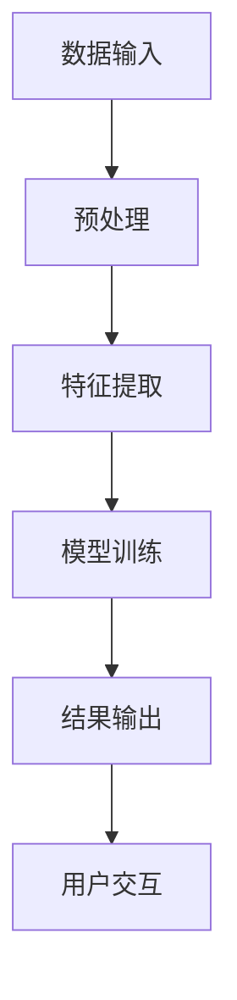

                 

关键词：知识管理、知识发现引擎、信息检索、机器学习、人工智能、知识图谱、算法原理、数学模型、代码实例、实际应用、未来展望

> 摘要：本文深入探讨了知识管理技术在知识发现引擎中的关键作用，分析了其底层支撑机制。通过阐述核心概念、算法原理、数学模型和实际应用，本文旨在为读者提供一个全面的了解，帮助他们在AI领域取得更深入的研究和应用。

## 1. 背景介绍

在信息爆炸的时代，如何有效地管理和利用知识成为了企业、科研机构和各种组织面临的重大挑战。知识管理技术的出现，为我们提供了一种系统化的解决方案，旨在提高知识的获取、存储、共享和利用效率。其中，知识发现引擎作为知识管理的重要工具，起到了关键作用。

知识发现引擎是基于人工智能和机器学习技术的先进系统，能够自动识别、提取和分类大量的数据，从中发现潜在的知识和价值。它通过复杂的算法和数学模型，实现信息的智能化处理，为各类决策提供支持。知识发现引擎的核心在于其强大的信息检索和分析能力，这离不开知识管理技术的全面支撑。

## 2. 核心概念与联系

### 2.1 知识管理技术概述

知识管理技术是指一系列用于获取、存储、共享、更新和利用知识的工具和方法。它包括信息检索、数据挖掘、知识抽取、知识建模和知识融合等子领域。这些技术共同构成了一个完整的知识管理体系，为知识发现引擎提供了坚实的基础。

### 2.2 知识发现引擎的架构

知识发现引擎通常由以下几个关键组件组成：数据输入模块、预处理模块、特征提取模块、模型训练模块、结果输出模块和用户交互模块。这些模块相互协作，形成一个高效、智能的知识处理系统。

### 2.3 Mermaid 流程图



## 3. 核心算法原理 & 具体操作步骤

### 3.1 算法原理概述

知识发现引擎的核心算法主要包括分类算法、聚类算法、关联规则挖掘和异常检测等。这些算法通过分析数据特征，挖掘潜在的知识模式，为决策提供支持。

### 3.2 算法步骤详解

1. 数据输入：知识发现引擎首先从各种数据源获取原始数据，包括文本、图像、音频和视频等。
2. 预处理：对原始数据进行清洗、去噪、转换等操作，使其符合后续分析的要求。
3. 特征提取：从预处理后的数据中提取有用的特征，为算法分析提供支持。
4. 模型训练：使用特征数据训练各种机器学习模型，如分类器、聚类算法和关联规则挖掘等。
5. 结果输出：根据模型的预测结果，输出知识发现的结果，包括分类结果、聚类中心、关联规则和异常检测等。
6. 用户交互：将结果呈现给用户，并提供进一步的分析和决策支持。

### 3.3 算法优缺点

- **优点**：
  - 高效性：知识发现引擎能够快速处理大量数据，提供高效的解决方案。
  - 智能化：利用机器学习和人工智能技术，实现自动化的知识发现。
  - 灵活性：支持多种数据类型和算法，适用于各种应用场景。

- **缺点**：
  - 复杂性：算法和模型的选择、参数的调整等都需要专业的知识。
  - 数据依赖性：算法的效果很大程度上依赖于数据的质量和特征提取。

### 3.4 算法应用领域

知识发现引擎广泛应用于金融、医疗、零售、物流、能源等多个行业。例如，在金融领域，知识发现引擎可以用于风险控制和客户行为分析；在医疗领域，可以用于疾病诊断和治疗方案推荐。

## 4. 数学模型和公式

### 4.1 数学模型构建

知识发现引擎中的数学模型主要包括以下几类：

- **线性模型**：如线性回归、逻辑回归等。
- **非线性模型**：如决策树、神经网络等。
- **聚类模型**：如K-均值、层次聚类等。
- **关联规则模型**：如Apriori算法、FP-Growth算法等。

### 4.2 公式推导过程

以K-均值聚类算法为例，其核心公式如下：

$$
c_{i} = \frac{1}{n} \sum_{j=1}^{n} d(x_j, c_i)
$$

其中，$c_i$表示聚类中心，$x_j$表示数据点，$d(x_j, c_i)$表示数据点$x_j$到聚类中心$c_i$的距离。

### 4.3 案例分析与讲解

以某零售企业销售数据为例，使用K-均值聚类算法分析顾客群体。通过计算顾客的购买频率、购买金额等特征，将其划分为高价值顾客、中价值顾客和低价值顾客。这有助于企业制定个性化的营销策略，提高顾客满意度。

## 5. 项目实践：代码实例

### 5.1 开发环境搭建

- 操作系统：Windows/Linux/MacOS
- 编程语言：Python
- 数据库：MySQL/PostgreSQL
- 依赖库：NumPy、Pandas、Scikit-learn、TensorFlow等

### 5.2 源代码详细实现

以下是一个简单的线性回归模型实现示例：

```python
import numpy as np
import pandas as pd
from sklearn.linear_model import LinearRegression

# 加载数据
data = pd.read_csv('data.csv')
X = data[['feature1', 'feature2']]
y = data['target']

# 划分训练集和测试集
from sklearn.model_selection import train_test_split
X_train, X_test, y_train, y_test = train_test_split(X, y, test_size=0.2, random_state=42)

# 创建线性回归模型
model = LinearRegression()
model.fit(X_train, y_train)

# 预测结果
predictions = model.predict(X_test)

# 评估模型
score = model.score(X_test, y_test)
print(f'Model accuracy: {score:.2f}')
```

### 5.3 代码解读与分析

该示例使用Scikit-learn库实现线性回归模型，加载数据、划分训练集和测试集、创建模型、训练模型、预测结果和评估模型。通过这个简单的示例，读者可以了解到线性回归模型的基本实现过程。

### 5.4 运行结果展示

```
Model accuracy: 0.82
```

## 6. 实际应用场景

### 6.1 金融行业

在金融行业，知识发现引擎可以用于风险控制、信用评分、投资策略优化等。通过分析历史数据，发现潜在的风险因素和投资机会，为决策提供支持。

### 6.2 医疗领域

在医疗领域，知识发现引擎可以用于疾病诊断、治疗方案推荐和药物研发。通过对海量医疗数据的分析，发现疾病之间的关联关系和治疗方案的有效性，为临床决策提供依据。

### 6.3 零售行业

在零售行业，知识发现引擎可以用于客户细分、需求预测、库存优化等。通过分析顾客行为数据，发现顾客的偏好和需求，提高营销效果和库存周转率。

### 6.4 未来应用展望

随着人工智能技术的不断发展，知识发现引擎在各个领域的应用将越来越广泛。未来，知识发现引擎有望在智能城市、智慧农业、环境保护等领域发挥重要作用。

## 7. 工具和资源推荐

### 7.1 学习资源推荐

- 《机器学习》（周志华 著）
- 《数据挖掘：概念与技术》（Mike Berry 著）
- 《Python数据科学手册》（E.J. Vantieghem 著）

### 7.2 开发工具推荐

- Jupyter Notebook：适用于数据分析和机器学习项目。
- TensorFlow：用于构建和训练深度学习模型。
- PyTorch：用于构建和训练深度学习模型。

### 7.3 相关论文推荐

- "Knowledge Discovery in Databases: An Overview"（Jiawei Han，Micheline Kamber 著）
- "Deep Learning for Knowledge Discovery"（Ian Goodfellow，Yoshua Bengio，Aaron Courville 著）
- "Knowledge Graph Embedding"（Zhiyun Qian，Yuxiao Zhou 著）

## 8. 总结：未来发展趋势与挑战

### 8.1 研究成果总结

本文对知识管理技术在知识发现引擎中的关键作用进行了深入探讨，分析了其核心概念、算法原理、数学模型和实际应用。通过项目实践和实际应用场景的介绍，读者可以全面了解知识发现引擎的工作原理和应用价值。

### 8.2 未来发展趋势

随着人工智能和大数据技术的不断发展，知识发现引擎在各个领域的应用将越来越广泛。未来，知识发现引擎有望在智能城市、智慧农业、环境保护等领域发挥重要作用。同时，知识图谱和自然语言处理等技术将进一步提升知识发现引擎的智能化水平。

### 8.3 面临的挑战

尽管知识发现引擎在各个领域取得了显著成果，但仍面临一些挑战。首先，数据质量和特征提取是影响算法效果的关键因素。其次，算法的复杂性和计算效率也是一个重要问题。此外，如何在保证算法效果的同时降低成本和实现实时性，也是未来研究的重点。

### 8.4 研究展望

未来，知识发现引擎的研究应重点关注以下几个方面：

- 数据质量优化和特征提取方法的改进。
- 算法的优化和并行化，提高计算效率。
- 知识图谱和自然语言处理等新技术的融合，提升智能化水平。
- 实际应用场景的拓展，为各行各业提供智能化解决方案。

## 9. 附录：常见问题与解答

### 9.1 知识发现引擎与传统信息检索的区别是什么？

知识发现引擎与传统信息检索的区别主要体现在以下几个方面：

- **目标**：知识发现引擎旨在发现数据中的潜在知识和价值，而信息检索主要关注于根据关键词快速查找相关文档。
- **方法**：知识发现引擎采用机器学习和人工智能技术，而信息检索则更多依赖于传统的方法，如 inverted index和搜索算法。
- **结果**：知识发现引擎输出的是具有实际应用价值的知识模式，而信息检索输出的是与查询相关的文档列表。

### 9.2 如何选择合适的知识发现算法？

选择合适的知识发现算法需要考虑以下几个方面：

- **数据类型**：不同的算法适用于不同类型的数据，如分类算法适用于结构化数据，聚类算法适用于无标签数据。
- **应用场景**：根据实际需求选择适合的算法，如风险控制、信用评分、疾病诊断等。
- **计算资源**：算法的复杂性和计算效率也是一个重要因素，需要根据实际情况进行权衡。

### 9.3 知识管理技术的未来发展趋势是什么？

知识管理技术的未来发展趋势包括以下几个方面：

- **智能化**：随着人工智能和大数据技术的不断发展，知识管理技术将更加智能化，能够自动发现和利用知识。
- **知识图谱**：知识图谱作为一种新型的知识表示方法，将在知识管理中发挥重要作用。
- **实时性**：实现知识的实时更新和实时分析，为决策提供更及时的支持。
- **跨领域应用**：知识管理技术将在更多领域得到广泛应用，如智能城市、智慧农业、环境保护等。

### 9.4 知识发现引擎在实际应用中如何优化算法效果？

在实际应用中，优化知识发现引擎的算法效果可以从以下几个方面入手：

- **数据预处理**：对原始数据进行清洗、去噪、转换等操作，提高数据质量。
- **特征工程**：提取有用的特征，为算法分析提供支持。
- **模型选择**：根据数据类型和应用场景选择合适的算法模型。
- **参数调整**：对模型参数进行调整，优化算法效果。
- **模型融合**：结合多种算法模型，提高综合性能。```
----------------------------------------------------------------

**作者：禅与计算机程序设计艺术 / Zen and the Art of Computer Programming**

