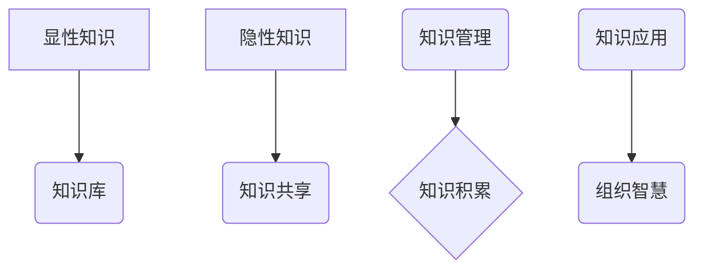
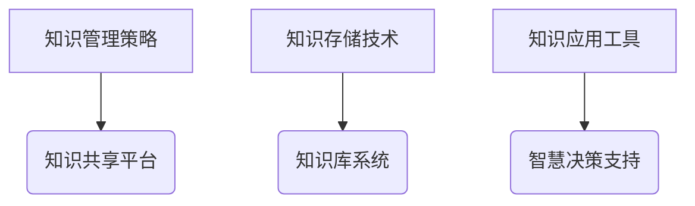
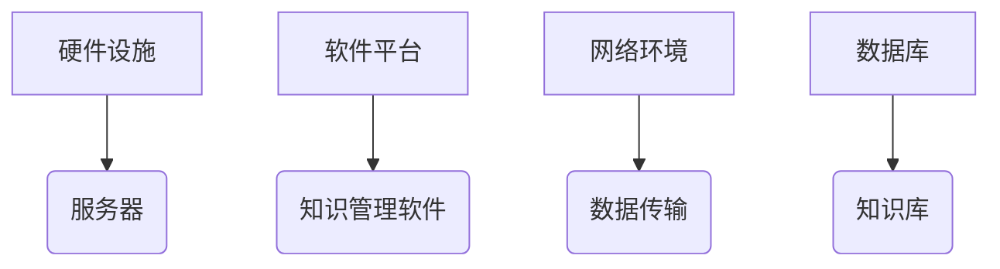
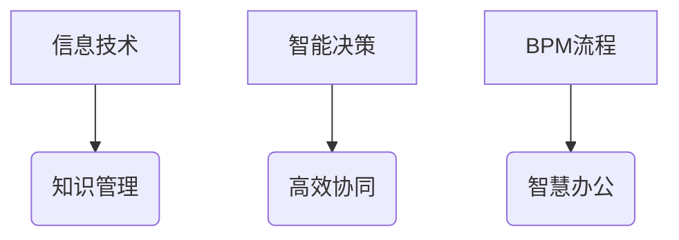
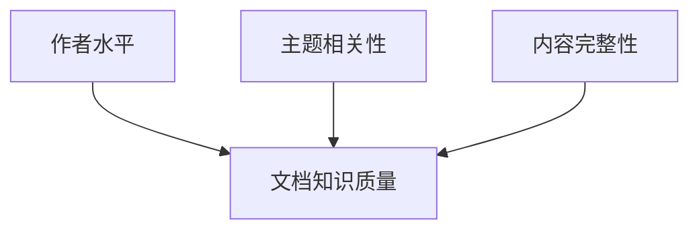

                 

 > **关键词：** 知识管理、信息系统、智慧组织、人工智能、数据治理

> **摘要：** 本文将深入探讨知识管理系统的定义、核心概念、构建方法、应用场景以及未来发展趋势。通过分析知识管理系统的原理和数学模型，结合项目实践中的具体案例，本文旨在为读者提供一个全面且深入的理解，并展望其在组织智慧中的重要作用。

## 1. 背景介绍

在信息化时代，知识已经成为组织的核心竞争力。然而，如何有效地管理和利用这些知识，以提高组织的创新能力、决策效率和业务绩效，成为企业管理者面临的一大挑战。知识管理系统（Knowledge Management System，简称KMS）作为一种新兴的信息技术，应运而生。

知识管理系统是指通过信息技术手段，对组织内部的各类知识资源进行收集、存储、组织、共享和利用的系统。它不仅包括技术层面的工具和平台，还涵盖了组织文化、管理流程和人员培训等软性要素。知识管理系统的目标是实现知识的积累、传播和应用，进而提升组织的整体智慧和竞争力。

本文将围绕知识管理系统的核心概念、构建方法、应用场景和未来发展趋势进行深入探讨，旨在为读者提供一个全面、系统的理解。

### 1.1 知识管理系统的起源与发展

知识管理系统起源于20世纪80年代的商业管理理论。当时，企业管理者开始意识到知识作为一种无形资产，对于企业竞争力的重要性。因此，如何有效地管理和利用知识成为企业管理的重要课题。

1986年，彼得·德鲁克（Peter Drucker）提出了“知识工人”的概念，强调了知识型员工在企业中的重要性。随后，知识管理理论逐渐成熟，形成了一套完整的知识管理体系。

进入21世纪，随着信息技术的飞速发展，知识管理系统得到了广泛的应用和推广。现代知识管理系统不仅涵盖了传统的文档管理、知识库建设等功能，还集成了人工智能、大数据分析等先进技术，实现了知识的自动化收集、分析和共享。

### 1.2 知识管理系统的重要性

知识管理系统在组织中的作用日益凸显。首先，它能够有效地积累和存储组织内部的知识资源，避免知识流失。其次，通过知识的共享和传播，可以提升员工的技能水平和创新能力。此外，知识管理系统还可以为组织决策提供数据支持，提高决策的准确性和效率。

总之，知识管理系统是组织实现智慧化转型的关键工具，对于提升组织的核心竞争力具有重要作用。

## 2. 核心概念与联系

知识管理系统涉及多个核心概念，包括知识、知识管理、信息系统、智慧组织等。为了更好地理解这些概念之间的关系，我们通过Mermaid流程图进行展示。

### 2.1 知识

知识是知识管理系统的核心。知识可以分为显性知识和隐性知识。显性知识是可以通过语言、文字、图像等表现形式进行明确表述的知识，如文档、报告、数据等。隐性知识则是深藏在个体经验、技能和思维模式中的知识，难以通过语言进行准确表达。



### 2.2 知识管理

知识管理是指通过一系列策略、方法和工具，对组织内部的显性知识和隐性知识进行有效的收集、存储、共享和应用的过程。知识管理的目标是提高组织的知识水平和创新能力，从而提升组织的竞争力。



### 2.3 信息系统

信息系统是知识管理系统的基础。它包括硬件、软件和网络等基础设施，用于支持知识的收集、存储、共享和应用。信息系统的建设质量直接影响知识管理系统的性能和效果。



### 2.4 智慧组织

智慧组织是指通过信息技术和知识管理手段，实现组织智慧化转型的组织。智慧组织具有知识驱动、智能决策、高效协同等特征，能够更好地适应复杂多变的市场环境。



通过以上Mermaid流程图，我们可以清晰地看到知识、知识管理、信息系统和智慧组织之间的关系。知识是基础，知识管理是核心，信息系统是支撑，智慧组织是目标。这些概念相互联系，共同构成了知识管理系统的理论框架。

## 3. 核心算法原理 & 具体操作步骤

### 3.1 算法原理概述

知识管理系统的核心算法主要包括知识提取、知识融合、知识推荐和知识应用等。这些算法通过信息处理技术和人工智能技术，实现对知识的自动化处理和智能应用。

- **知识提取**：通过自然语言处理、数据挖掘等技术，从文本、图像、音频等多种形式的信息中提取出有价值的知识。
- **知识融合**：将不同来源、不同格式的知识进行整合和统一，形成结构化、标准化的知识库。
- **知识推荐**：基于用户行为、知识需求等，为用户推荐相关知识和信息，提高知识的利用效率。
- **知识应用**：将知识应用于组织决策、业务流程优化、创新设计等，实现知识的实际价值。

### 3.2 算法步骤详解

#### 3.2.1 知识提取

知识提取是知识管理系统的基础步骤。具体操作步骤如下：

1. 数据采集：从内部系统和外部网络收集各种形式的信息，如文档、报告、新闻、博客等。
2. 预处理：对采集到的数据进行清洗、去重、分词等预处理操作，为后续的提取做准备。
3. 知识提取：使用自然语言处理、数据挖掘等技术，从预处理后的数据中提取出有价值的知识。
4. 知识分类：将提取出的知识按照类别进行分类，便于后续的知识管理和应用。

#### 3.2.2 知识融合

知识融合是将不同来源、不同格式的知识进行整合和统一。具体操作步骤如下：

1. 知识标准化：将不同格式的知识转化为统一的格式，如XML、JSON等。
2. 知识映射：将不同来源的知识进行映射，找出其共性和差异。
3. 知识整合：将映射后的知识进行整合，形成结构化、标准化的知识库。
4. 知识更新：定期对知识库进行更新，保持知识的时效性和准确性。

#### 3.2.3 知识推荐

知识推荐是基于用户行为和需求，为用户推荐相关知识和信息。具体操作步骤如下：

1. 用户画像：通过分析用户的行为数据，构建用户的兴趣模型和需求模型。
2. 知识标签：为知识库中的知识打上标签，便于后续的推荐。
3. 推荐算法：使用协同过滤、内容推荐等算法，为用户推荐相关的知识和信息。
4. 推荐反馈：收集用户对推荐内容的反馈，优化推荐算法和推荐结果。

#### 3.2.4 知识应用

知识应用是将知识应用于组织决策、业务流程优化、创新设计等。具体操作步骤如下：

1. 知识建模：将知识转化为可操作的模型，如决策支持模型、流程优化模型等。
2. 应用场景：根据组织的需求，确定知识应用的具体场景，如项目评估、风险分析、市场预测等。
3. 知识应用：将知识模型应用于实际业务，提供决策支持、流程优化等服务。
4. 应用反馈：收集知识应用的效果反馈，不断优化知识应用方案。

### 3.3 算法优缺点

#### 3.3.1 知识提取

优点：能够从大量数据中提取出有价值的信息，提高知识的利用率。

缺点：对数据质量和处理技术的依赖较高，容易出现误提取和漏提取。

#### 3.3.2 知识融合

优点：能够整合不同来源、不同格式的知识，形成统一的知识库，便于管理和应用。

缺点：知识融合过程中容易出现冲突和冗余，影响知识库的准确性。

#### 3.3.3 知识推荐

优点：能够根据用户需求和行为，提供个性化的知识和信息，提高用户体验。

缺点：推荐算法的准确性和效果受到用户数据质量和推荐算法的依赖。

#### 3.3.4 知识应用

优点：能够将知识应用于实际业务，提供决策支持、流程优化等服务，提升组织效能。

缺点：知识应用的效果受到知识质量和应用场景的限制。

### 3.4 算法应用领域

知识管理系统算法的应用领域非常广泛，包括但不限于以下方面：

1. 企业内部知识共享：通过知识提取和知识融合，实现企业内部知识的积累和共享，提高员工的技能水平和创新能力。
2. 个性化信息服务：通过知识推荐，为用户提供个性化的知识和信息，提升用户体验。
3. 决策支持系统：通过知识建模和应用，为组织提供决策支持，优化决策过程。
4. 业务流程优化：通过知识应用，优化业务流程，提高业务效率和效果。
5. 创新设计：通过知识应用，为创新设计提供知识支持，促进新产品的开发。

## 4. 数学模型和公式 & 详细讲解 & 举例说明

### 4.1 数学模型构建

在知识管理系统中，数学模型的应用非常广泛。以下介绍几种常用的数学模型及其构建方法。

#### 4.1.1 贝叶斯网络

贝叶斯网络是一种概率图模型，用于表示变量之间的条件依赖关系。其构建方法如下：

1. **定义变量**：首先，确定知识管理系统中需要表示的变量，如知识质量、用户兴趣等。
2. **确定条件概率**：根据变量之间的依赖关系，确定各个变量的条件概率分布。例如，假设知识质量受用户兴趣的影响，可以根据历史数据计算用户兴趣与知识质量之间的条件概率。
3. **构建贝叶斯网络**：将变量及其条件概率分布表示为有向无环图（DAG），即为贝叶斯网络。

#### 4.1.2 支持向量机

支持向量机（SVM）是一种常用的分类算法，其核心思想是在高维空间中寻找一个最优分类面。其构建方法如下：

1. **特征选择**：从原始数据中提取特征，并进行特征选择，以降低数据的维度。
2. **训练模型**：使用训练数据集，通过优化目标函数，训练出支持向量机模型。
3. **分类决策**：将训练好的模型应用于测试数据，进行分类预测。

#### 4.1.3 马尔可夫模型

马尔可夫模型是一种用于描述变量状态转移概率的数学模型。其构建方法如下：

1. **定义状态**：首先，确定知识管理系统中需要描述的状态，如知识状态、用户状态等。
2. **确定状态转移概率**：根据历史数据，计算各个状态之间的转移概率。
3. **构建马尔可夫模型**：将状态及其转移概率表示为一个状态转移矩阵。

### 4.2 公式推导过程

以下以贝叶斯网络为例，介绍其公式的推导过程。

设 \( X_1, X_2, \ldots, X_n \) 是一组随机变量，\( P(X_1), P(X_2), \ldots, P(X_n) \) 分别是各个变量的概率分布。在贝叶斯网络中，任意两个变量之间的条件独立性可以通过贝叶斯公式来描述。

对于变量 \( X_i \) 和 \( X_j \)，如果它们在给定另一个变量 \( X_k \) 的情况下是条件独立的，即：

$$ P(X_i | X_j, X_k) = P(X_i | X_k) $$

则可以得到以下贝叶斯公式：

$$ P(X_i | X_j) = \frac{P(X_i, X_j)}{P(X_j)} $$

根据条件独立性，我们可以将 \( P(X_i, X_j) \) 分解为：

$$ P(X_i, X_j) = P(X_i | X_j)P(X_j) = P(X_i | X_k)P(X_j | X_k)P(X_k) $$

结合贝叶斯公式，我们可以得到：

$$ P(X_i | X_j) = \frac{P(X_i | X_k)P(X_j | X_k)P(X_k)}{P(X_j)} $$

这就是贝叶斯网络的公式推导过程。

### 4.3 案例分析与讲解

以下通过一个实际案例，讲解贝叶斯网络的构建和运用。

假设我们有一个知识管理系统，需要评估一篇文档的知识质量。文档的质量受作者水平、主题相关性和内容完整性等因素的影响。我们可以使用贝叶斯网络来建模这个问题。

#### 4.3.1 定义变量

定义以下变量：

- \( A \)：作者水平
- \( T \)：主题相关性
- \( C \)：内容完整性
- \( Q \)：文档知识质量

#### 4.3.2 确定条件概率

根据历史数据，我们可以得到各个变量之间的条件概率分布。例如：

- \( P(A | Q) = 0.8 \)：作者水平高，文档质量高的概率为0.8。
- \( P(T | Q) = 0.9 \)：主题相关性高，文档质量高的概率为0.9。
- \( P(C | Q) = 0.7 \)：内容完整性高，文档质量高的概率为0.7。

#### 4.3.3 构建贝叶斯网络

根据以上条件概率，我们可以构建一个贝叶斯网络，如下图所示：



#### 4.3.4 应用贝叶斯网络

假设我们得到一篇新文档，已知其作者水平为高、主题相关性为高，我们需要预测其知识质量。

根据贝叶斯网络，我们可以计算出文档知识质量高的概率：

$$ P(Q | A, T) = \frac{P(A | Q)P(T | Q)P(Q)}{P(A)P(T)} $$

根据条件概率，我们可以得到：

$$ P(Q | A, T) = \frac{0.8 \times 0.9 \times P(Q)}{P(A) \times P(T)} $$

通过计算，我们可以得到文档知识质量高的概率为0.9，即预测这篇文档的知识质量为高。

通过以上案例，我们可以看到贝叶斯网络在知识管理系统中的应用价值。它可以帮助我们预测文档的质量、评估知识贡献者的水平，从而为知识管理提供有效的决策支持。

## 5. 项目实践：代码实例和详细解释说明

### 5.1 开发环境搭建

在本节中，我们将介绍如何搭建一个知识管理系统项目所需的开发环境。以下是一个基本的步骤指南：

#### 5.1.1 硬件环境

- **服务器**：一台具有较高处理能力和存储能力的服务器，用于运行应用程序和存储数据。
- **网络**：确保服务器具备稳定的互联网连接。

#### 5.1.2 软件环境

- **操作系统**：选择一个适合的操作系统，如Linux或Windows Server。
- **数据库**：选择一个适合的数据库管理系统，如MySQL或PostgreSQL。
- **开发工具**：安装集成开发环境（IDE），如Visual Studio或Eclipse。

#### 5.1.3 开发语言

- **后端**：选择一种后端开发语言，如Java、Python或Node.js。
- **前端**：选择一种前端开发语言，如HTML、CSS、JavaScript。

### 5.2 源代码详细实现

在本节中，我们将介绍一个简单的知识管理系统项目的源代码实现，包括后端和前端部分。

#### 5.2.1 后端

以下是一个使用Python和Flask框架实现的后端代码示例：

```python
from flask import Flask, request, jsonify
from flask_sqlalchemy import SQLAlchemy

app = Flask(__name__)
app.config['SQLALCHEMY_DATABASE_URI'] = 'sqlite:///knowledge.db'
db = SQLAlchemy(app)

class Document(db.Model):
    id = db.Column(db.Integer, primary_key=True)
    title = db.Column(db.String(100))
    content = db.Column(db.Text)

@app.route('/documents', methods=['POST'])
def add_document():
    data = request.json
    document = Document(title=data['title'], content=data['content'])
    db.session.add(document)
    db.session.commit()
    return jsonify({'message': 'Document added successfully'})

@app.route('/documents', methods=['GET'])
def get_documents():
    documents = Document.query.all()
    return jsonify([{'id': doc.id, 'title': doc.title, 'content': doc.content} for doc in documents])

if __name__ == '__main__':
    db.create_all()
    app.run(debug=True)
```

#### 5.2.2 前端

以下是一个使用HTML、CSS和JavaScript实现的前端页面示例：

```html
<!DOCTYPE html>
<html>
<head>
    <title>Knowledge Management System</title>
    <style>
        body {
            font-family: Arial, sans-serif;
        }
        form {
            width: 50%;
            margin: 0 auto;
        }
        input, button {
            display: block;
            margin: 10px 0;
        }
    </style>
</head>
<body>
    <h1>Knowledge Management System</h1>
    <form id="document-form">
        <label for="title">Title:</label>
        <input type="text" id="title" required>
        <label for="content">Content:</label>
        <textarea id="content" required></textarea>
        <button type="submit">Submit</button>
    </form>
    <div id="document-list">
        <!-- Document list will be populated here -->
    </div>

    <script>
        document.getElementById('document-form').onsubmit = function(event) {
            event.preventDefault();
            const title = document.getElementById('title').value;
            const content = document.getElementById('content').value;

            fetch('/documents', {
                method: 'POST',
                headers: {
                    'Content-Type': 'application/json'
                },
                body: JSON.stringify({ title, content })
            })
            .then(response => response.json())
            .then(data => {
                alert('Document added successfully');
                document.getElementById('document-form').reset();
            });
        };

        fetch('/documents')
            .then(response => response.json())
            .then(data => {
                const list = document.getElementById('document-list');
                data.forEach(doc => {
                    const item = document.createElement('div');
                    item.innerHTML = `<h2>${doc.title}</h2><p>${doc.content}</p>`;
                    list.appendChild(item);
                });
            });
    </script>
</body>
</html>
```

### 5.3 代码解读与分析

#### 5.3.1 后端解读

后端代码使用了Flask框架，通过简单的路由定义实现了文档的添加和获取功能。

- **数据库模型**：使用了SQLAlchemy作为ORM工具，定义了`Document`模型，用于表示文档数据。
- **API接口**：定义了两个API接口：
  - `/documents`（POST方法）：用于添加新文档。
  - `/documents`（GET方法）：用于获取所有文档。

#### 5.3.2 前端解读

前端代码使用HTML、CSS和JavaScript实现了用户界面和基本的交互逻辑。

- **表单**：通过一个表单页面，允许用户输入文档标题和内容。
- **交互逻辑**：使用JavaScript向后端发送POST请求，添加新文档，并使用GET请求获取文档列表，动态更新页面内容。

### 5.4 运行结果展示

当用户在表单中输入文档信息并提交后，后端接收请求，将文档信息存储到数据库中，并返回一个成功消息。前端接收到后端的消息后，重置表单并更新文档列表显示最新的文档。


通过以上示例，我们可以看到知识管理系统项目的基本实现流程。在实际应用中，可以根据需求进一步扩展功能，如用户身份验证、文档搜索、权限管理等。

## 6. 实际应用场景

知识管理系统在各个领域都有广泛的应用，以下是几个典型的应用场景：

### 6.1 企业知识共享

在企业内部，知识管理系统可以帮助企业实现知识的积累、共享和应用。通过知识管理系统，员工可以方便地获取企业内部的各种知识资源，如文档、报告、项目经验等。同时，知识管理系统还可以为员工提供知识共享平台，促进知识交流和创新。

### 6.2 教育培训

在教育领域，知识管理系统可以用于课程资料管理、学生学习情况跟踪等。教师可以通过知识管理系统上传教学资料，学生可以方便地获取课程资源并进行学习。此外，知识管理系统还可以为教育机构提供数据分析工具，帮助教育者了解学生的学习情况，优化教学策略。

### 6.3 科研创新

在科研领域，知识管理系统可以帮助科研团队实现知识的积累和共享，提高科研效率。通过知识管理系统，科研人员可以方便地获取同行的研究成果、实验数据等，进行科研合作和创新。知识管理系统还可以为科研团队提供知识挖掘和推荐功能，帮助科研人员发现潜在的合作机会和科研方向。

### 6.4 政府公共服务

在政府公共服务领域，知识管理系统可以用于政策法规管理、政府决策支持等。政府可以通过知识管理系统实现政策法规的集中存储和检索，提高政务透明度和决策效率。同时，知识管理系统还可以为政府提供数据分析工具，支持政府决策的科学化和智能化。

### 6.5 医疗健康

在医疗健康领域，知识管理系统可以用于医学知识库建设、医疗数据分析等。通过知识管理系统，医务人员可以方便地获取医学知识、诊疗方案等，提高医疗服务质量。同时，知识管理系统还可以为医疗机构提供数据分析工具，支持疾病预测、流行病监控等。

## 7. 工具和资源推荐

为了更好地进行知识管理系统的构建和应用，以下是一些推荐的工具和资源：

### 7.1 学习资源推荐

- **《知识管理：理论与实践》**：本书详细介绍了知识管理的概念、方法和技术，适合初学者阅读。
- **《智慧组织：信息技术与知识管理的融合》**：本书探讨了知识管理在组织中的应用，以及如何实现智慧化转型。
- **《数据挖掘：实用工具和技术》**：本书介绍了数据挖掘的基本概念和方法，包括知识提取、知识融合等。

### 7.2 开发工具推荐

- **Eclipse**：一款强大的集成开发环境，支持多种编程语言。
- **Visual Studio**：微软开发的集成开发环境，适用于Windows平台。
- **Docker**：一款容器化技术，用于简化应用程序的部署和运行。
- **Kubernetes**：一款用于容器编排和管理的开源平台，用于自动化部署和管理容器化应用程序。

### 7.3 相关论文推荐

- **"Knowledge Management Systems: A Review of Current Trends and Challenges"**：本文综述了知识管理系统的发展现状、挑战和趋势。
- **"A Framework for Evaluating the Performance of Knowledge Management Systems"**：本文提出了一种评价知识管理系统性能的框架。
- **"Knowledge Management in Healthcare: A Systematic Review"**：本文系统性地分析了知识管理在医疗健康领域的应用。

## 8. 总结：未来发展趋势与挑战

### 8.1 研究成果总结

知识管理系统作为组织智慧的重要载体，已经取得了显著的成果。通过知识提取、知识融合、知识推荐等核心算法，知识管理系统实现了知识的自动化处理和智能应用。同时，知识管理系统在各个领域的实际应用中，也展示了其提升组织效能和竞争力的潜力。

### 8.2 未来发展趋势

1. **智能化**：随着人工智能技术的发展，知识管理系统将更加智能化，实现自动化的知识提取、知识融合和知识推荐。
2. **个性化**：知识管理系统将更加注重个性化服务，根据用户需求和行为，提供定制化的知识和信息服务。
3. **协同化**：知识管理系统将更加注重协同合作，实现跨部门、跨组织的知识共享和协同工作。
4. **平台化**：知识管理系统将向平台化发展，成为组织数字化转型的核心平台。

### 8.3 面临的挑战

1. **数据质量问题**：知识管理系统依赖于高质量的数据，数据质量直接影响知识管理的效果。
2. **用户接受度**：知识管理系统需要得到用户的认可和参与，提高用户接受度是关键。
3. **隐私保护**：在知识管理过程中，需要保护用户的隐私和数据安全，避免数据泄露和滥用。

### 8.4 研究展望

未来的研究应重点关注以下几个方面：

1. **数据挖掘和知识发现**：深入研究数据挖掘和知识发现技术，提高知识的提取和融合效率。
2. **智能推荐算法**：优化智能推荐算法，提高知识推荐的准确性和用户体验。
3. **跨组织知识管理**：研究跨组织知识管理的方法和策略，实现更大范围的知识共享和协同。
4. **知识治理**：探索知识治理的理论和实践，构建科学、有效的知识管理体系。

总之，知识管理系统在组织智慧中的作用日益凸显，未来发展趋势充满机遇和挑战。通过持续的研究和创新，知识管理系统有望成为组织数字化转型的重要引擎。

## 9. 附录：常见问题与解答

### 9.1 知识管理系统的核心功能是什么？

知识管理系统的核心功能包括知识提取、知识融合、知识共享、知识推荐和知识应用。这些功能旨在实现知识的自动化处理和智能应用，提高组织的知识水平和创新能力。

### 9.2 知识管理系统与传统信息系统的区别是什么？

知识管理系统与传统信息系统的主要区别在于其关注点不同。传统信息系统主要关注数据存储和检索，而知识管理系统则更加注重知识的提取、融合和智能应用，以提高组织的知识水平和创新能力。

### 9.3 知识管理系统在哪些领域有应用？

知识管理系统在多个领域有广泛应用，包括企业内部知识共享、教育培训、科研创新、政府公共服务和医疗健康等。通过知识管理系统，这些领域可以实现知识的积累、共享和应用，提升组织效能和竞争力。

### 9.4 如何确保知识管理系统的数据质量？

确保知识管理系统的数据质量需要从数据采集、数据清洗、数据存储和数据分析等环节入手。具体措施包括：选择高质量的数据源、采用严格的数据清洗和预处理方法、建立标准化的数据存储和索引机制、定期进行数据质量评估和优化。

### 9.5 知识管理系统的发展趋势是什么？

知识管理系统的发展趋势包括智能化、个性化、协同化和平台化。随着人工智能、大数据分析等技术的不断发展，知识管理系统将更加智能化，实现自动化的知识提取、知识融合和知识推荐。同时，知识管理系统将更加注重个性化服务，根据用户需求和行为，提供定制化的知识和信息服务。此外，知识管理系统将更加注重协同合作，实现跨部门、跨组织的知识共享和协同工作。最后，知识管理系统将向平台化发展，成为组织数字化转型的重要引擎。

