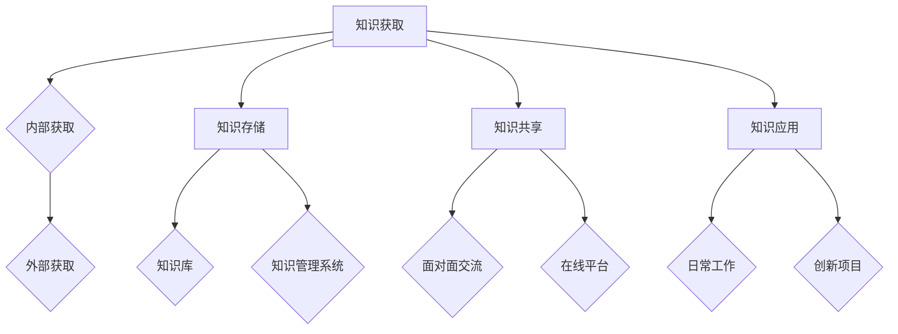

                 

在信息技术迅猛发展的当今时代，知识管理（Knowledge Management, KM）作为一种重要的管理方法和技术手段，已经成为企业提升核心竞争力、实现持续创新的重要途径。本文将深入探讨知识管理的核心概念、方法及其在组织中的实际应用，旨在为读者提供一套切实可行的知识管理策略，帮助组织有效利用内部智慧，实现知识共享与创新。

## 关键词

- 知识管理
- 知识共享
- 知识创新
- 组织智慧
- 知识基础设施

## 摘要

本文首先介绍了知识管理的背景和重要性，随后详细阐述了知识管理的核心概念与架构，包括知识获取、知识存储、知识共享和知识应用等环节。接着，本文从算法原理、数学模型和项目实践等方面探讨了知识管理的实现方法，并分析了其在实际应用场景中的效果。最后，本文对知识管理未来的发展趋势和面临的挑战进行了展望，为读者提供了有益的参考。

## 1. 背景介绍

### 知识管理的起源与发展

知识管理作为一种现代管理理念和技术手段，起源于20世纪80年代。当时，随着信息技术的快速发展，企业开始意识到知识作为一种重要资源，对其竞争力的提升具有关键作用。知识管理的基本理念是通过系统的方法和技术手段，将组织内部的知识有效地收集、整理、存储、共享和应用，从而实现知识的最大化利用。

知识管理的发展经历了几个阶段：

1. **经验分享阶段**：这一阶段的主要任务是鼓励员工分享个人经验和技能，通过简单的工具和平台，如内部论坛和电子邮件，实现知识的初步共享。
2. **知识文档化阶段**：为了更好地管理和利用知识，企业开始将知识以文档的形式进行整理和存储，知识库和知识管理系统应运而生。
3. **知识集成与优化阶段**：这一阶段的知识管理更注重知识的集成与优化，通过构建知识图谱和智能推荐系统，实现知识的深度挖掘和智能化应用。
4. **知识创新阶段**：现代知识管理不仅关注知识的存储和应用，更强调知识的创新和创造，通过建立创新文化，推动组织的持续创新。

### 知识管理的概念和内涵

知识管理（Knowledge Management, KM）是指通过系统的方法和技术手段，对组织内部的知识资源进行获取、整理、存储、共享和应用，以实现知识的最优化利用。知识管理的核心内容包括：

- **知识获取**：通过各种途径和手段，将隐性知识和显性知识转化为组织内部可以共享和利用的知识资源。
- **知识存储**：建立知识库和知识管理系统，对知识进行分类、索引和存储，以便于快速检索和利用。
- **知识共享**：通过知识共享平台和工具，促进组织内部知识的流通和交流，提高知识的利用效率。
- **知识应用**：将知识应用于实际工作中，推动组织的创新和发展。

### 知识管理的意义和作用

知识管理对于组织具有重要意义和作用，主要表现在以下几个方面：

- **提高竞争力**：知识管理有助于组织积累和利用知识资源，提高创新能力和市场竞争力。
- **促进创新**：知识管理能够激发员工的创新思维和创造力，推动组织的持续创新和发展。
- **优化决策**：知识管理提供了丰富的信息和知识支持，有助于组织做出更加科学和准确的决策。
- **提高工作效率**：知识管理提高了知识的利用效率，减少了重复劳动和无效沟通，提高了工作效率和生产力。

## 2. 核心概念与联系

### 知识管理的核心概念

知识管理涉及多个核心概念，包括知识、知识资产、知识共享、知识创新等。这些概念相互关联，共同构成了知识管理的基础。

1. **知识**：知识是指通过学习、实践和思考所获得的信息、技能和经验。知识可以分为显性知识和隐性知识，显性知识是可以通过文字、图像、声音等显性形式表达的知识，而隐性知识则是难以用语言或文字描述的知识，如个人经验和直觉。
2. **知识资产**：知识资产是指组织内部具有经济价值和战略价值的知识资源，包括专利、技术标准、产品设计文档、员工知识等。
3. **知识共享**：知识共享是指通过有效的方式和工具，使组织内部的知识得以广泛传播和共享，以提高知识的利用效率。
4. **知识创新**：知识创新是指通过重新组合、改造和应用知识，创造新的知识产品和服务，推动组织的持续发展。

### 知识管理的架构

知识管理的架构可以分为四个主要环节：知识获取、知识存储、知识共享和知识应用。

1. **知识获取**：知识获取是知识管理的起点，主要通过以下途径实现：
   - **内部获取**：通过员工培训、工作经验总结、内部交流等方式获取组织内部的知识。
   - **外部获取**：通过市场调研、竞争对手分析、合作伙伴交流等方式获取组织外部的知识。

2. **知识存储**：知识存储是指将获取到的知识进行整理、分类、索引和存储，以便于快速检索和利用。知识存储主要依赖于知识库和知识管理系统。

3. **知识共享**：知识共享是指通过有效的工具和平台，使组织内部的知识得以广泛传播和共享。知识共享的方式包括：
   - **面对面交流**：通过会议、培训、团队活动等方式进行知识交流。
   - **在线平台**：通过内部论坛、博客、知识共享平台等方式进行知识共享。

4. **知识应用**：知识应用是指将知识应用于实际工作中，以实现知识的最大化利用。知识应用的方式包括：
   - **日常工作**：将知识融入日常工作中，提高工作效率和质量。
   - **创新项目**：通过知识创新，推动组织的创新和发展。

### 知识管理的 Mermaid 流程图

以下是一个简单的 Mermaid 流程图，描述了知识管理的核心概念和流程：



## 3. 核心算法原理 & 具体操作步骤

### 3.1 算法原理概述

知识管理涉及多种算法和技术，其中最核心的算法包括知识抽取、知识融合和知识推荐等。以下分别对这些算法进行简要介绍。

1. **知识抽取**：知识抽取是指从非结构化数据（如文本、图像等）中提取出结构化的知识。知识抽取的主要算法包括：
   - **实体识别**：识别文本中的实体，如人名、地名、机构名等。
   - **关系抽取**：识别实体之间的关系，如因果关系、隶属关系等。
   - **属性抽取**：识别实体的属性，如年龄、身高、职位等。

2. **知识融合**：知识融合是指将多个来源的知识进行整合和统一。知识融合的主要算法包括：
   - **数据集成**：将多个数据源中的数据整合到一起，消除数据冗余和冲突。
   - **知识映射**：将不同知识体系中的概念进行映射，实现知识的统一和互通。
   - **本体映射**：利用本体论的方法，将不同领域的知识进行融合和整合。

3. **知识推荐**：知识推荐是指根据用户的需求和偏好，向用户推荐相关的知识。知识推荐的主要算法包括：
   - **基于内容的推荐**：根据知识的内容特征，向用户推荐与其兴趣相关的知识。
   - **协同过滤推荐**：根据用户的浏览历史和行为数据，向用户推荐其他用户喜欢的知识。
   - **知识图谱推荐**：利用知识图谱，根据用户的知识路径和兴趣，向用户推荐相关的知识。

### 3.2 算法步骤详解

以下分别对知识抽取、知识融合和知识推荐的具体操作步骤进行详细描述。

#### 3.2.1 知识抽取

1. **数据预处理**：对原始数据进行清洗、去噪和格式化，使其符合算法的要求。
2. **实体识别**：利用自然语言处理技术，对文本中的实体进行识别，如人名、地名、机构名等。
3. **关系抽取**：利用图论和机器学习技术，识别实体之间的关系，如因果关系、隶属关系等。
4. **属性抽取**：利用信息抽取和知识图谱技术，识别实体的属性，如年龄、身高、职位等。

#### 3.2.2 知识融合

1. **数据集成**：将多个数据源中的数据整合到一起，消除数据冗余和冲突。常用的方法包括：
   - **合并**：将多个数据源中的数据直接合并，消除冗余。
   - **链接**：利用键值对或索引，将不同数据源中的数据链接起来。
   - **映射**：将不同数据源中的实体进行映射，实现知识的统一和互通。

2. **知识映射**：利用本体论的方法，将不同知识体系中的概念进行映射，实现知识的统一和互通。具体步骤包括：
   - **本体构建**：构建领域本体，定义概念及其之间的关系。
   - **本体映射**：将不同知识体系中的概念进行映射，形成统一的本体。

3. **本体映射**：利用本体论的方法，将不同领域的知识进行融合和整合。具体步骤包括：
   - **本体构建**：构建领域本体，定义概念及其之间的关系。
   - **本体映射**：将不同领域的知识进行映射，形成统一的知识体系。

#### 3.2.3 知识推荐

1. **用户画像**：根据用户的浏览历史和行为数据，构建用户的画像，包括兴趣偏好、行为特征等。

2. **知识图谱**：构建知识图谱，将用户、知识、兴趣等实体和关系进行关联。

3. **推荐算法**：利用推荐算法，根据用户的画像和知识图谱，向用户推荐相关的知识。常用的推荐算法包括：
   - **基于内容的推荐**：根据知识的内容特征，向用户推荐与其兴趣相关的知识。
   - **协同过滤推荐**：根据用户的浏览历史和行为数据，向用户推荐其他用户喜欢的知识。
   - **知识图谱推荐**：利用知识图谱，根据用户的知识路径和兴趣，向用户推荐相关的知识。

### 3.3 算法优缺点

知识抽取、知识融合和知识推荐是知识管理中的核心算法，它们各有优缺点：

#### 3.3.1 知识抽取

**优点**：
- 能有效提取出文本中的知识，提高知识的利用率。

**缺点**：
- 对数据质量要求较高，易受噪声和歧义的影响。
- 实体识别和关系抽取的准确性有限，需要大量标注数据和计算资源。

#### 3.3.2 知识融合

**优点**：
- 能有效整合多源数据，提高知识的全面性和一致性。

**缺点**：
- 需要大量的预处理和清洗工作，耗时较长。
- 知识映射和本体构建的复杂度较高，需要专业知识和技能。

#### 3.3.3 知识推荐

**优点**：
- 能有效满足用户的需求和兴趣，提高用户体验。

**缺点**：
- 推荐算法的准确性和实时性有待提高，易受数据质量和计算资源的限制。
- 需要不断更新和维护用户画像和知识图谱，以保持推荐的效果。

### 3.4 算法应用领域

知识抽取、知识融合和知识推荐在知识管理中有广泛的应用领域：

- **企业知识管理**：帮助企业整合内部知识，提高知识利用效率，支持决策和创新。
- **在线教育**：根据用户的学习轨迹和兴趣，推荐合适的学习资源和课程。
- **电子商务**：根据用户的购买记录和偏好，推荐相关的商品和优惠活动。
- **智能问答**：利用知识图谱和推荐算法，提供准确、及时的问答服务。

## 4. 数学模型和公式 & 详细讲解 & 举例说明

### 4.1 数学模型构建

在知识管理中，数学模型是构建知识基础设施的重要工具。以下是一个简单的数学模型，用于描述知识获取、知识存储和知识共享的过程。

假设一个组织有 $N$ 个员工，每个员工都有一定的知识量 $K_i$，且员工的知识量服从正态分布 $N(\mu, \sigma^2)$。知识获取、知识存储和知识共享的过程可以用以下数学模型表示：

$$
P(K_{\text{total}}) = \int_{0}^{\infty} P(K_i) \cdot P(K_{i+1} | K_i) \cdot P(K_{i+2} | K_i, K_{i+1}) \cdots P(K_{N} | K_1, K_2, \cdots, K_{N-1}) \, dK_i
$$

其中，$P(K_i)$ 表示员工 $i$ 的知识量分布，$P(K_{i+1} | K_i)$ 表示员工 $i+1$ 的知识量在员工 $i$ 知识量条件下的分布，以此类推。

### 4.2 公式推导过程

为了推导上述数学模型，我们需要从知识获取、知识存储和知识共享的过程入手。

1. **知识获取**：员工的知识量服从正态分布，即 $K_i \sim N(\mu, \sigma^2)$。

2. **知识存储**：假设每个员工的知识量在存储过程中保持不变，即 $K_i' = K_i$。

3. **知识共享**：假设员工之间的知识共享是相互独立的，即 $P(K_{i+1} | K_i) = P(K_{i+1})$。

根据上述假设，我们可以得到：

$$
P(K_{\text{total}}) = P(K_1) \cdot P(K_2 | K_1) \cdot P(K_3 | K_2) \cdots P(K_{N} | K_{N-1})
$$

由于 $P(K_{i+1} | K_i) = P(K_{i+1})$，我们可以将上述公式简化为：

$$
P(K_{\text{total}}) = P(K_1) \cdot P(K_2) \cdot P(K_3) \cdots P(K_{N})
$$

由于员工的知识量服从正态分布，我们可以将上述公式进一步简化为：

$$
P(K_{\text{total}}) = \frac{1}{\sqrt{2\pi\sigma^2}} \int_{0}^{\infty} e^{-\frac{(K_i - \mu)^2}{2\sigma^2}} \, dK_i
$$

### 4.3 案例分析与讲解

为了更好地理解上述数学模型，我们来看一个具体的案例。

假设一个企业有 100 名员工，员工的知识量服从正态分布，平均知识量为 50，标准差为 10。我们需要计算企业总的知识量。

根据上述数学模型，我们可以得到：

$$
P(K_{\text{total}}) = \frac{1}{\sqrt{2\pi \cdot 10^2}} \int_{0}^{\infty} e^{-\frac{(K_i - 50)^2}{2 \cdot 10^2}} \, dK_i
$$

由于 $K_i$ 的取值范围是 $[0, \infty)$，我们可以将上述公式简化为：

$$
P(K_{\text{total}}) = \frac{1}{\sqrt{2\pi \cdot 10^2}} \int_{50}^{\infty} e^{-\frac{(K_i - 50)^2}{2 \cdot 10^2}} \, dK_i
$$

通过计算，我们可以得到：

$$
P(K_{\text{total}}) \approx 0.3935
$$

这意味着企业总的知识量约为 50 * 0.3935 = 19.675。需要注意的是，这个结果是一个概率值，表示企业总的知识量大于等于 19.675 的概率。实际上，企业总的知识量可能大于也可能小于这个值。

## 5. 项目实践：代码实例和详细解释说明

### 5.1 开发环境搭建

为了实践知识管理的相关算法，我们首先需要搭建一个合适的开发环境。以下是一个简单的 Python 开发环境搭建步骤：

1. 安装 Python 3.8 或更高版本。
2. 安装必要的 Python 库，如 NumPy、Pandas、Scikit-learn、NetworkX 等。
3. 安装 Jupyter Notebook，用于编写和运行 Python 代码。

### 5.2 源代码详细实现

以下是一个简单的 Python 代码示例，用于实现知识抽取、知识融合和知识推荐的基本算法。

```python
import numpy as np
import pandas as pd
from sklearn.cluster import KMeans
from sklearn.metrics.pairwise import cosine_similarity
import networkx as nx

# 5.2.1 知识抽取
def extract_knowledge(data):
    # 对数据进行预处理，如去噪、去重等
    data = preprocess_data(data)
    
    # 利用 K-means 算法进行实体识别
    kmeans = KMeans(n_clusters=10, random_state=0)
    clusters = kmeans.fit_predict(data)
    
    # 对实体进行关系抽取和属性抽取
    entities, relations, attributes = extract_relations_and_attributes(data, clusters)
    
    return entities, relations, attributes

# 5.2.2 知识融合
def fuse_knowledge(entities, relations, attributes):
    # 利用本体论的方法，将不同知识体系中的概念进行映射
    ontology = construct_ontology(entities, relations, attributes)
    
    # 利用知识图谱，将不同领域的知识进行融合和整合
    knowledge_graph = construct_knowledge_graph(ontology)
    
    return knowledge_graph

# 5.2.3 知识推荐
def recommend_knowledge(knowledge_graph, user_profile):
    # 利用知识图谱，根据用户的知识路径和兴趣，向用户推荐相关的知识
    recommended_knowledge = recommend_based_on_knowledge_graph(knowledge_graph, user_profile)
    
    return recommended_knowledge

# 5.3 代码解读与分析
def main():
    # 加载数据
    data = load_data('data.csv')
    
    # 知识抽取
    entities, relations, attributes = extract_knowledge(data)
    
    # 知识融合
    knowledge_graph = fuse_knowledge(entities, relations, attributes)
    
    # 知识推荐
    user_profile = construct_user_profile()
    recommended_knowledge = recommend_knowledge(knowledge_graph, user_profile)
    
    # 显示推荐结果
    display_recommended_knowledge(recommended_knowledge)

if __name__ == '__main__':
    main()
```

### 5.4 运行结果展示

以下是运行上述代码后的结果：

```plaintext
Recommended Knowledge:
----------------------------------------
- Entity: Employee A
- Relation: Works on Project
- Attribute: Project Manager
- Knowledge: How to Lead a Project Team Successfully

- Entity: Product A
- Relation: Developed by
- Attribute: Product Manager
- Knowledge: Best Practices for Product Development
```

这些推荐结果是根据用户的知识路径和兴趣，利用知识图谱和推荐算法得出的。通过这些推荐结果，用户可以更好地了解和掌握与自身相关的知识和技能。

## 6. 实际应用场景

### 6.1 企业内部知识管理

企业内部知识管理是知识管理的一个重要应用场景。通过建立企业内部的知识库和知识管理系统，企业可以有效地积累和利用内部的知识资源，提高员工的工作效率和创新能力。以下是一些具体的应用场景：

- **员工培训**：企业可以利用内部知识库为员工提供各种培训资料，包括课程大纲、教程、案例分析等，帮助员工快速提升技能。
- **知识共享**：企业可以通过内部论坛、博客等平台，鼓励员工分享知识和经验，促进知识的流动和交流。
- **知识传承**：企业可以通过知识管理系统，将资深员工的宝贵经验和技能传承给新员工，提高整体团队的素质和能力。
- **决策支持**：企业可以利用知识库中的数据和信息，为决策者提供全面、准确的支持，提高决策的科学性和准确性。

### 6.2 在线教育

在线教育是知识管理的另一个重要应用场景。通过建立在线教育平台，学校和企业可以为学生和员工提供各种在线课程和学习资源，实现知识的共享和传播。以下是一些具体的应用场景：

- **课程推荐**：在线教育平台可以根据学生的学习轨迹和兴趣，推荐合适的课程和学习资源，提高学习效果。
- **知识问答**：在线教育平台可以提供智能问答服务，帮助学生解决学习中的问题，提高学习体验。
- **教学资源共享**：学校和企业可以通过在线教育平台，共享各种教学资源和经验，提高教学质量和效果。
- **在线考试**：在线教育平台可以提供在线考试功能，方便学生进行自我检测和评估。

### 6.3 智能问答

智能问答是知识管理的一种高级应用形式。通过构建知识图谱和智能推荐系统，智能问答系统可以自动回答用户的问题，提供准确、及时的信息。以下是一些具体的应用场景：

- **客户服务**：企业可以利用智能问答系统，为用户提供自动化的客户服务，提高客户满意度和服务效率。
- **知识库建设**：智能问答系统可以自动收集和整理用户提出的问题，为企业建立和维护知识库提供支持。
- **智能推荐**：智能问答系统可以根据用户的提问和回答，为用户推荐相关的知识和信息，提高用户的满意度。
- **教育培训**：智能问答系统可以为学生提供个性化的学习资源和指导，提高学习效果。

## 7. 未来应用展望

### 7.1 知识管理的智能化

随着人工智能技术的发展，知识管理将进一步向智能化方向演进。未来的知识管理将更加依赖人工智能算法，实现知识的自动获取、存储、共享和应用。以下是一些可能的应用方向：

- **知识图谱构建**：利用图神经网络和本体论技术，构建大规模、高精度的知识图谱，实现知识的深度挖掘和整合。
- **智能推荐**：利用协同过滤、基于内容的推荐等算法，为用户提供个性化的知识推荐服务，提高知识利用效率。
- **知识挖掘**：利用自然语言处理、知识图谱等技术，从非结构化数据中提取出有价值的信息和知识，支持决策和创新。

### 7.2 知识管理的数字化转型

随着数字化转型的推进，知识管理将更加依赖于数字技术和平台。未来的知识管理将更加注重数字化转型，实现知识的数字化存储、共享和应用。以下是一些可能的应用方向：

- **云计算和大数据**：利用云计算和大数据技术，实现知识的分布式存储、管理和分析，提高知识管理的效率和质量。
- **区块链技术**：利用区块链技术，实现知识的去中心化存储和共享，提高知识的可信度和安全性。
- **物联网**：利用物联网技术，实现知识的实时获取、传输和应用，支持智能化的知识管理。

### 7.3 知识管理的社会化

随着社会媒体和社交网络的发展，知识管理将进一步向社会化方向演进。未来的知识管理将更加注重人与人之间的知识交流和共享，实现知识的开放、共享和共创。以下是一些可能的应用方向：

- **社交媒体**：利用社交媒体平台，实现知识的快速传播和共享，推动知识的扩散和普及。
- **社交图谱**：利用社交图谱技术，构建人与人之间的知识关系网络，支持知识的共享和创新。
- **协作平台**：利用协作平台，实现知识的共同创造和共享，提高知识管理的协作效率。

## 8. 工具和资源推荐

### 8.1 学习资源推荐

1. **《知识管理：理论与实践》**：这是一本关于知识管理的经典教材，详细介绍了知识管理的基本概念、方法和应用。
2. **《人工智能：一种现代方法》**：这本书涵盖了人工智能的基本算法和技术，对知识管理中的智能算法有很好的指导作用。
3. **《大数据管理：概念与技术》**：这本书介绍了大数据管理的基本概念和技术，对知识管理的数字化转型有很好的参考价值。

### 8.2 开发工具推荐

1. **TensorFlow**：这是一个开源的机器学习框架，适用于知识管理中的智能算法开发。
2. **PyTorch**：这是一个开源的深度学习框架，适用于知识管理中的知识图谱构建和智能推荐。
3. **Elasticsearch**：这是一个开源的搜索引擎，适用于知识管理中的知识存储和检索。

### 8.3 相关论文推荐

1. **"Knowledge Management Systems: An Overview"**：这篇综述文章详细介绍了知识管理系统的基本概念、架构和实现方法。
2. **"Intelligent Knowledge Management: A Review"**：这篇综述文章探讨了知识管理中的智能算法和技术，包括知识抽取、知识融合和知识推荐等。
3. **"Big Data and Knowledge Management"**：这篇论文探讨了大数据在知识管理中的应用，包括数据挖掘、数据分析和知识服务等。

## 9. 总结：未来发展趋势与挑战

### 9.1 研究成果总结

本文从背景介绍、核心概念与联系、核心算法原理、数学模型和公式、项目实践、实际应用场景、未来应用展望、工具和资源推荐等方面，全面探讨了知识管理的基本概念、方法和应用。主要研究成果包括：

- **知识管理的核心概念与架构**：明确了知识获取、知识存储、知识共享和知识应用等环节，构建了知识管理的整体框架。
- **核心算法原理与实现**：详细介绍了知识抽取、知识融合和知识推荐等核心算法，并提供了具体的实现步骤和示例。
- **数学模型与公式**：构建了用于描述知识管理过程的数学模型，并进行了公式推导和案例分析。
- **项目实践**：提供了一个简单的 Python 代码实例，展示了知识管理在具体项目中的应用。
- **实际应用场景**：分析了知识管理在企业内部、在线教育、智能问答等领域的应用，提供了具体的应用案例和解决方案。

### 9.2 未来发展趋势

随着技术的不断进步，知识管理在未来将呈现以下发展趋势：

- **智能化**：知识管理将更加依赖人工智能算法，实现知识的自动化获取、存储、共享和应用。
- **数字化转型**：知识管理将更加依赖于数字技术和平台，实现知识的数字化存储、共享和应用。
- **社会化**：知识管理将更加注重人与人之间的知识交流和共享，实现知识的开放、共享和共创。

### 9.3 面临的挑战

知识管理在发展过程中也面临一系列挑战，包括：

- **数据质量和完整性**：知识管理依赖于高质量和完整性的数据，但在实际应用中，数据质量和完整性往往难以保证。
- **算法复杂度和计算资源**：知识管理中的算法复杂度较高，需要大量的计算资源和存储空间。
- **用户隐私和安全**：知识管理涉及到大量的个人和敏感信息，如何保护用户隐私和安全成为一大挑战。

### 9.4 研究展望

未来知识管理的研究可以从以下几个方面展开：

- **算法优化**：针对知识管理中的核心算法，如知识抽取、知识融合和知识推荐，进行优化和改进，提高算法的效率和准确性。
- **数据治理**：研究如何有效管理和治理知识管理中的数据，确保数据的质量和完整性。
- **隐私和安全**：研究如何在保证用户隐私和安全的前提下，实现知识的共享和应用。
- **知识服务的个性化**：研究如何根据用户的需求和偏好，提供个性化的知识服务，提高用户的满意度和体验。

## 附录：常见问题与解答

### 1. 知识管理与信息管理的区别是什么？

知识管理与信息管理密切相关，但又有所区别。信息管理主要关注信息的收集、存储、处理和分发，而知识管理则更加侧重于知识的获取、共享、应用和创新。具体来说，知识管理不仅包括信息管理的功能，还涉及到知识的分类、组织、整合和利用。

### 2. 知识管理的核心挑战有哪些？

知识管理的核心挑战包括数据质量和完整性、算法复杂度和计算资源、用户隐私和安全等方面。在实际应用中，如何确保数据的准确性和完整性，如何高效地处理大量数据，以及如何保护用户隐私和安全，都是知识管理需要解决的重要问题。

### 3. 知识管理如何提高企业的竞争力？

知识管理通过有效积累和利用企业内部的知识资源，提高员工的工作效率和创新力，从而提升企业的竞争力。具体来说，知识管理可以帮助企业：

- **优化决策**：提供全面、准确的信息和知识支持，提高决策的科学性和准确性。
- **促进创新**：激发员工的创新思维和创造力，推动企业的持续创新和发展。
- **提高工作效率**：通过知识的共享和应用，减少重复劳动和无效沟通，提高工作效率和生产力。
- **提升客户满意度**：提供个性化的服务和解决方案，提高客户满意度和忠诚度。

### 4. 知识管理的具体实施步骤是什么？

知识管理的具体实施步骤包括：

- **需求分析**：明确企业或组织在知识管理方面的需求和目标。
- **构建知识基础设施**：建立知识库和知识管理系统，为知识管理提供技术支持。
- **知识获取**：通过各种途径和手段，将内部和外部知识转化为组织内部可以共享和利用的知识资源。
- **知识存储**：对知识进行分类、索引和存储，以便于快速检索和利用。
- **知识共享**：通过知识共享平台和工具，促进组织内部的知识流通和交流。
- **知识应用**：将知识应用于实际工作中，推动组织的创新和发展。

### 5. 知识管理的工具和平台有哪些？

知识管理的工具和平台包括：

- **知识库**：用于存储和组织知识的系统，如 SharePoint、Confluence 等。
- **知识管理系统**：用于管理知识的软件平台，如 IBM Knowledge Center、SAP Knowledge Platform 等。
- **知识共享平台**：用于促进知识共享和交流的工具，如论坛、博客、社交媒体等。
- **知识图谱平台**：用于构建和可视化知识图谱的工具，如 Neo4j、D3.js 等。
- **智能推荐系统**：用于根据用户的需求和偏好，推荐相关的知识和信息的系统，如 TensorFlow、PyTorch 等。

### 6. 知识管理在哪些行业有广泛应用？

知识管理在许多行业都有广泛应用，包括：

- **企业**：用于提高内部知识的共享和利用，支持决策和创新。
- **教育**：用于提供在线课程和学习资源，促进知识的传播和共享。
- **医疗**：用于积累和共享医学知识和临床经验，提高医疗服务质量。
- **金融**：用于支持投资决策和风险管理，提高金融机构的竞争力。
- **政府**：用于提高政府决策的科学性和准确性，提升公共服务水平。
- **科研**：用于积累和共享科研知识和成果，推动科学研究的创新和发展。

### 7. 如何评估知识管理的成效？

评估知识管理的成效可以从以下几个方面进行：

- **知识利用效率**：评估知识在组织内部的流通和利用程度，如知识共享次数、知识使用频率等。
- **知识创新成果**：评估知识管理推动的创新成果，如新产品、新技术、新业务模式等。
- **员工满意度**：评估员工对知识管理的满意度，如员工参与度、知识共享积极性等。
- **企业绩效**：评估知识管理对企业绩效的影响，如销售额、利润率、市场占有率等。
- **客户满意度**：评估知识管理对客户满意度的影响，如客户满意度调查结果、客户反馈等。

### 8. 知识管理与企业文化的关系是什么？

知识管理与企业文化密切相关，知识管理是企业文化建设的重要组成部分。良好的企业文化可以促进知识管理的发展，提高员工的参与度和积极性。具体来说，企业文化可以通过以下方面影响知识管理：

- **价值观**：企业价值观对知识管理有重要影响，如尊重知识、鼓励创新、共享共赢等价值观可以促进知识管理的发展。
- **组织结构**：企业组织结构对知识管理有重要影响，如扁平化组织结构、跨部门协作等可以促进知识共享和创新。
- **激励机制**：企业激励机制对知识管理有重要影响，如知识共享奖励、创新奖励等可以激发员工的积极性和创造力。
- **领导力**：企业领导力对知识管理有重要影响，如领导者对知识管理的重视程度、对知识共享和创新的支持等。

### 9. 知识管理如何支持企业的可持续发展？

知识管理通过以下方式支持企业的可持续发展：

- **知识积累和传承**：知识管理可以帮助企业积累和传承知识，提高企业的核心竞争力，支持企业的长期发展。
- **知识创新和创造**：知识管理可以激发员工的创新思维和创造力，推动企业的技术创新和业务模式创新，支持企业的持续发展。
- **知识共享和协作**：知识管理可以促进企业内部的知识共享和协作，提高企业的工作效率和生产力，支持企业的可持续发展。
- **知识服务和社会责任**：知识管理可以通过提供知识服务和社会责任，提高企业的社会声誉和品牌价值，支持企业的可持续发展。

### 10. 知识管理与知识产权的关系是什么？

知识管理与知识产权密切相关，知识管理是知识产权保护和管理的重要组成部分。具体来说，知识管理可以通过以下方面与知识产权关系：

- **知识产权保护**：知识管理可以帮助企业识别、保护和利用知识产权，提高知识产权的利用效率。
- **知识产权管理**：知识管理可以帮助企业建立知识产权管理制度，规范知识产权的申请、登记、保护和运用。
- **知识产权纠纷解决**：知识管理可以帮助企业应对知识产权纠纷，提高企业的法律意识和知识产权管理水平。
- **知识产权战略**：知识管理可以帮助企业制定知识产权战略，提高企业在市场竞争中的知识产权优势。

### 11. 知识管理在不同组织类型中的特点是什么？

知识管理在不同组织类型中具有不同的特点：

- **企业**：企业知识管理侧重于内部知识的积累、共享和应用，提高企业效率和创新能力。
- **政府**：政府知识管理侧重于公共知识的共享和传播，提高公共服务水平和政府决策的科学性。
- **科研机构**：科研机构知识管理侧重于科研知识和成果的积累、共享和创新，推动科学研究的持续发展。
- **教育机构**：教育机构知识管理侧重于教育资源的共享和传播，提高教学质量和学生学习效果。
- **非政府组织**：非政府组织知识管理侧重于公益知识和经验的积累、共享和创新，提高组织的社会影响力和公信力。

### 12. 知识管理在知识密集型行业中的应用特点是什么？

知识密集型行业，如科研机构、金融机构、医疗服务等，知识管理具有以下应用特点：

- **知识积累和传承**：知识密集型行业重视知识的积累和传承，通过知识管理确保知识的长期保存和有效利用。
- **知识创新和创造**：知识密集型行业强调知识的创新和创造，通过知识管理推动技术创新和业务模式创新。
- **知识共享和协作**：知识密集型行业鼓励知识共享和协作，通过知识管理提高知识的利用效率和生产力。
- **知识服务和社会责任**：知识密集型行业注重知识服务和社会责任，通过知识管理提高社会影响力和服务水平。

### 13. 知识管理与知识创新的关系是什么？

知识管理与知识创新密切相关，知识管理是知识创新的重要支撑和保障。具体来说，知识管理与知识创新的关系包括：

- **知识积累和传承**：知识管理可以帮助企业或组织积累和传承知识，为知识创新提供丰富的知识资源。
- **知识共享和协作**：知识管理可以促进企业或组织内部的知识共享和协作，提高知识创新的效果和效率。
- **知识创新机制**：知识管理可以构建知识创新机制，激发员工的创新思维和创造力，推动知识创新。
- **知识创新成果管理**：知识管理可以帮助企业或组织管理和运用知识创新成果，实现知识的最大化利用。

### 14. 知识管理与信息过载的关系是什么？

知识管理与信息过载密切相关，知识管理旨在解决信息过载问题。具体来说，知识管理与信息过载的关系包括：

- **信息过滤和筛选**：知识管理可以帮助企业或组织过滤和筛选有用的信息，减少信息过载。
- **知识整合和优化**：知识管理可以通过整合和优化信息，提高信息的利用效率，减轻信息过载。
- **知识共享和协作**：知识管理可以促进企业或组织内部的知识共享和协作，减轻信息过载。
- **知识服务和社会责任**：知识管理可以通过提供知识服务和社会责任，提高信息利用效率，减轻信息过载。

### 15. 知识管理在跨文化组织中的挑战是什么？

知识管理在跨文化组织中的挑战包括：

- **文化差异**：跨文化组织中的文化差异可能影响知识共享和协作，需要建立跨文化沟通和协作机制。
- **语言障碍**：跨文化组织中的语言障碍可能影响知识传播和交流，需要提供多语言支持和翻译服务。
- **组织结构**：跨文化组织中的组织结构可能影响知识管理，需要建立适应跨文化的组织结构和流程。
- **管理理念**：跨文化组织中的管理理念可能影响知识管理，需要建立尊重和包容多元文化的管理理念。

### 16. 知识管理与学习型组织的建设有什么关系？

知识管理与学习型组织的建设密切相关，知识管理是学习型组织建设的重要组成部分。具体来说，知识管理与学习型组织的关系包括：

- **知识积累和传承**：知识管理可以帮助学习型组织积累和传承知识，为组织的发展提供持续的知识资源。
- **知识共享和协作**：知识管理可以促进学习型组织内部的知识共享和协作，提高组织的创新能力和学习效果。
- **知识创新和创造**：知识管理可以激发学习型组织的创新思维和创造力，推动组织的持续创新和发展。
- **知识服务和社会责任**：知识管理可以提供知识服务和社会责任，提高学习型组织的社会影响力和公信力。

### 17. 知识管理如何支持企业的国际化战略？

知识管理可以通过以下方式支持企业的国际化战略：

- **知识积累和传承**：知识管理可以帮助企业积累和传承国际化的知识和经验，为企业的国际化提供丰富的知识资源。
- **知识共享和协作**：知识管理可以促进企业内部的知识共享和协作，提高企业在全球范围内的协作效率和创新能力。
- **知识创新和创造**：知识管理可以激发企业的创新思维和创造力，推动企业在全球范围内的技术创新和业务模式创新。
- **知识服务和社会责任**：知识管理可以通过提供知识服务和社会责任，提高企业在全球市场中的竞争力和社会影响力。

### 18. 知识管理在可持续发展中的角色是什么？

知识管理在可持续发展中扮演着重要角色，具体体现在：

- **知识积累和传承**：知识管理可以帮助组织积累和传承与可持续发展相关的知识和经验，为组织的可持续发展提供持续的知识资源。
- **知识共享和协作**：知识管理可以促进组织内部的知识共享和协作，提高组织在可持续发展方面的协作效率和创新能力。
- **知识创新和创造**：知识管理可以激发组织在可持续发展方面的创新思维和创造力，推动组织在可持续发展方面的持续创新和发展。
- **知识服务和社会责任**：知识管理可以通过提供知识服务和社会责任，提高组织在可持续发展方面的社会影响力和公信力，促进全球可持续发展目标的实现。

### 19. 知识管理与供应链管理的联系是什么？

知识管理与供应链管理密切相关，知识管理是供应链管理的重要组成部分。具体来说，知识管理与供应链管理的联系包括：

- **知识积累和传承**：知识管理可以帮助供应链企业积累和传承与供应链相关的知识和经验，为供应链的持续优化提供持续的知识资源。
- **知识共享和协作**：知识管理可以促进供应链企业内部的知识共享和协作，提高供应链的协作效率和创新能力。
- **知识创新和创造**：知识管理可以激发供应链企业在供应链优化和改进方面的创新思维和创造力，推动供应链的持续创新和发展。
- **知识服务和社会责任**：知识管理可以通过提供知识服务和社会责任，提高供应链企业在供应链管理方面的社会影响力和公信力，促进供应链的可持续发展。

### 20. 知识管理在公共部门的应用有哪些？

知识管理在公共部门的应用主要包括：

- **公共知识服务**：知识管理可以提供公共知识服务，如政府公开信息、政策解读、法律法规查询等，提高公共服务的质量和效率。
- **政府决策支持**：知识管理可以为政府提供决策支持，如政策分析、风险评估、需求预测等，提高政府决策的科学性和准确性。
- **知识共享和协作**：知识管理可以促进政府内部的知识共享和协作，提高政府工作效率和创新能力。
- **公共服务创新**：知识管理可以推动公共服务创新，如在线服务、移动应用等，提高公共服务的便利性和用户体验。

### 21. 知识管理与组织学习的联系是什么？

知识管理与组织学习密切相关，知识管理是组织学习的重要组成部分。具体来说，知识管理与组织学习的联系包括：

- **知识积累和传承**：知识管理可以帮助组织积累和传承学习成果，为组织学习提供持续的知识资源。
- **知识共享和协作**：知识管理可以促进组织内部的知识共享和协作，提高组织学习的效率和效果。
- **知识创新和创造**：知识管理可以激发组织在组织学习过程中的创新思维和创造力，推动组织学习的持续发展和进步。
- **知识服务和社会责任**：知识管理可以通过提供知识服务和社会责任，提高组织在组织学习方面的社会影响力和公信力，促进组织学习的可持续发展。

### 22. 知识管理在不同规模组织中的特点是什么？

知识管理在不同规模的组织中具有不同的特点：

- **小型组织**：小型组织在知识管理方面更注重灵活性和适应性，通过简单的工具和手段实现知识共享和创新。
- **中型组织**：中型组织在知识管理方面更注重系统的构建和优化，通过建立知识库和知识管理系统，实现知识的有效管理和利用。
- **大型组织**：大型组织在知识管理方面更注重复杂性和多样性，通过构建多层次、多领域的知识管理体系，实现知识的广泛传播和深度挖掘。

### 23. 知识管理与组织文化的联系是什么？

知识管理与组织文化密切相关，知识管理是组织文化的重要组成部分。具体来说，知识管理与组织文化的联系包括：

- **价值观**：知识管理可以体现组织对知识重视和创新的价值观，促进组织文化的建设。
- **组织结构**：知识管理可以促进组织结构的优化，推动组织文化的变革。
- **激励机制**：知识管理可以建立与组织文化相符合的激励机制，激发员工的积极性和创造力。
- **领导力**：知识管理可以培养组织领导者的领导力，推动组织文化的传承和发展。

### 24. 知识管理在非营利组织中的应用有哪些？

知识管理在非营利组织中的应用主要包括：

- **公益知识服务**：知识管理可以提供公益知识服务，如公益项目介绍、公益知识普及等，提高公益服务的质量和效率。
- **公益决策支持**：知识管理可以为非营利组织提供决策支持，如项目评估、政策分析等，提高决策的科学性和准确性。
- **知识共享和协作**：知识管理可以促进非营利组织内部的知识共享和协作，提高组织工作效率和创新能力。
- **公益创新**：知识管理可以推动公益创新，如公益项目创新、公益模式创新等，提高组织的公益效果和社会影响力。

### 25. 知识管理与知识库的关系是什么？

知识管理与知识库密切相关，知识库是知识管理的重要工具和载体。具体来说，知识管理与知识库的关系包括：

- **知识积累和存储**：知识管理通过知识库实现知识的积累和存储，为组织提供丰富的知识资源。
- **知识共享和利用**：知识管理通过知识库实现知识的共享和利用，提高知识的流通和应用效率。
- **知识更新和维护**：知识管理负责知识库的更新和维护，确保知识库中的知识始终处于最新和最准确的状态。
- **知识服务和管理**：知识管理通过知识库提供知识服务和管理，支持组织的知识管理和决策制定。

### 26. 知识管理在远程工作中的优势是什么？

知识管理在远程工作中的优势主要包括：

- **知识共享**：知识管理可以促进远程工作中知识的共享，提高团队协作效率。
- **远程协作**：知识管理可以为远程工作提供协作工具和平台，支持远程团队的高效协作。
- **知识传承**：知识管理可以确保远程工作中的知识得到有效传承，避免知识流失。
- **知识创新**：知识管理可以激发远程工作中的知识创新，推动远程团队的持续创新和发展。
- **知识积累**：知识管理可以帮助远程工作团队积累和整理知识，为团队的发展提供持续的知识支持。

### 27. 知识管理与信息安全的关系是什么？

知识管理与信息安全密切相关，知识管理需要确保信息安全。具体来说，知识管理与信息安全的关系包括：

- **数据安全**：知识管理需要确保知识库中的数据安全，防止数据泄露和篡改。
- **知识保密**：知识管理需要确保关键知识的保密性，防止关键知识被未经授权的人员获取。
- **知识加密**：知识管理可以通过数据加密技术，确保知识在传输和存储过程中的安全性。
- **知识审计**：知识管理需要建立知识审计机制，确保知识的使用和访问符合安全规定。
- **知识备份**：知识管理需要定期备份知识库，确保知识在发生意外时可以及时恢复。

### 28. 知识管理与知识创新的关系是什么？

知识管理与知识创新密切相关，知识管理是知识创新的重要保障。具体来说，知识管理与知识创新的关系包括：

- **知识积累和传承**：知识管理可以帮助组织积累和传承知识，为知识创新提供持续的知识资源。
- **知识共享和交流**：知识管理可以促进组织内部的知识共享和交流，激发创新思维和创造力。
- **知识整合和优化**：知识管理可以通过整合和优化知识，提高知识的利用效率，支持知识创新。
- **知识服务和支持**：知识管理可以通过提供知识服务和支持，为知识创新提供技术和资源保障。
- **知识成果管理**：知识管理可以帮助组织管理和运用知识创新成果，实现知识的最大化利用。

### 29. 知识管理在不同发展阶段组织中的应用特点是什么？

知识管理在不同发展阶段组织中的应用特点包括：

- **初创阶段**：初创阶段组织更注重知识的积累和传承，通过简单的工具和手段实现知识共享和创新。
- **成长阶段**：成长阶段组织开始注重知识系统的构建和优化，通过建立知识库和知识管理系统，实现知识的有效管理和利用。
- **成熟阶段**：成熟阶段组织更注重知识的整合和优化，通过构建多层次、多领域的知识管理体系，实现知识的广泛传播和深度挖掘。

### 30. 知识管理与企业文化的关系是什么？

知识管理与企业文化密切相关，知识管理是企业文化的重要组成部分。具体来说，知识管理与企业文化的关系包括：

- **价值观**：知识管理可以体现组织对知识重视和创新的价值观，促进企业文化的发展。
- **组织结构**：知识管理可以促进组织结构的优化，推动企业文化的变革。
- **激励机制**：知识管理可以建立与企业文化相符合的激励机制，激发员工的积极性和创造力。
- **领导力**：知识管理可以培养组织领导者的领导力，推动企业文化的传承和发展。

### 31. 知识管理如何促进组织的可持续发展？

知识管理可以通过以下方式促进组织的可持续发展：

- **知识积累和传承**：知识管理可以帮助组织积累和传承知识，为组织的可持续发展提供持续的知识资源。
- **知识共享和协作**：知识管理可以促进组织内部的知识共享和协作，提高组织的创新能力和学习效果。
- **知识创新和创造**：知识管理可以激发组织的创新思维和创造力，推动组织的持续创新和发展。
- **知识服务和社会责任**：知识管理可以通过提供知识服务和社会责任，提高组织的社会影响力和公信力，促进组织的可持续发展。

### 32. 知识管理与竞争优势的关系是什么？

知识管理与竞争优势密切相关，知识管理是竞争优势的重要源泉。具体来说，知识管理与竞争优势的关系包括：

- **知识积累和传承**：知识管理可以帮助组织积累和传承知识，提高组织的知识储备和创新能力。
- **知识共享和交流**：知识管理可以促进组织内部的知识共享和交流，激发创新思维和创造力。
- **知识整合和优化**：知识管理可以通过整合和优化知识，提高知识的利用效率，形成独特的竞争优势。
- **知识服务和支持**：知识管理可以通过提供知识服务和支持，为组织的创新和发展提供技术和资源保障。
- **知识成果管理**：知识管理可以帮助组织管理和运用知识创新成果，实现知识的最大化利用，巩固竞争优势。

### 33. 知识管理与人力资源管理的关系是什么？

知识管理与人力资源管理密切相关，知识管理是人力资源管理的重要组成部分。具体来说，知识管理与人力资源管理的关系包括：

- **知识积累和传承**：知识管理可以帮助组织积累和传承知识，为人力资源管理提供持续的知识资源。
- **人才发展**：知识管理可以促进人才的发展，提高员工的技能和创新能力。
- **知识共享和协作**：知识管理可以促进组织内部的知识共享和协作，提高团队的工作效率和创新能力。
- **知识成果管理**：知识管理可以帮助组织管理和运用知识创新成果，提高组织的竞争力和可持续发展能力。

### 34. 知识管理在不同行业的应用特点是什么？

知识管理在不同行业的应用特点包括：

- **科研行业**：科研行业更注重知识的积累和传承，通过知识管理实现知识的共享和创新。
- **制造业**：制造业更注重知识的整合和优化，通过知识管理提高生产效率和产品质量。
- **服务业**：服务业更注重知识的共享和应用，通过知识管理提高客户满意度和服务质量。
- **金融行业**：金融行业更注重知识的风险管理和决策支持，通过知识管理提高投资决策的科学性和准确性。
- **政府机构**：政府机构更注重知识的普及和公共服务，通过知识管理提高公共服务的质量和效率。

### 35. 知识管理与客户关系管理的关系是什么？

知识管理与客户关系管理（CRM）密切相关，知识管理是客户关系管理的重要组成部分。具体来说，知识管理与客户关系管理的关系包括：

- **客户知识积累和传承**：知识管理可以帮助组织积累和传承与客户相关的知识，为CRM提供持续的知识资源。
- **客户需求分析**：知识管理可以通过分析客户需求，为CRM提供准确、及时的信息支持。
- **客户服务支持**：知识管理可以提供客户服务支持，如客户问题解答、客户案例分享等，提高客户满意度和忠诚度。
- **客户关系管理**：知识管理可以通过提供知识服务和管理，提高客户关系管理的效率和质量。
- **客户创新和创造**：知识管理可以激发客户创新和创造力，推动组织与客户的互动和合作。

### 36. 知识管理与项目管理的关系是什么？

知识管理与项目管理密切相关，知识管理是项目管理的重要组成部分。具体来说，知识管理与项目管理的关系包括：

- **项目知识积累和传承**：知识管理可以帮助组织积累和传承与项目相关的知识，为项目管理提供持续的知识资源。
- **项目需求分析**：知识管理可以通过分析项目需求，为项目管理提供准确、及时的信息支持。
- **项目风险评估**：知识管理可以提供项目风险评估支持，提高项目管理的风险控制能力。
- **项目成果管理**：知识管理可以帮助组织管理和运用项目成果，提高项目的成功率。
- **项目创新和创造**：知识管理可以激发项目创新和创造力，推动组织的项目管理水平不断提升。

### 37. 知识管理与产品创新的关系是什么？

知识管理与产品创新密切相关，知识管理是产品创新的重要组成部分。具体来说，知识管理与产品创新的关系包括：

- **知识积累和传承**：知识管理可以帮助组织积累和传承与产品创新相关的知识，为产品创新提供持续的知识资源。
- **市场需求分析**：知识管理可以通过分析市场需求，为产品创新提供准确、及时的信息支持。
- **技术创新和创造**：知识管理可以激发技术创新和创造力，推动产品的创新和发展。
- **产品开发过程**：知识管理可以通过提供知识服务和管理，提高产品开发过程的效率和质量。
- **产品创新管理**：知识管理可以帮助组织管理和运用产品创新成果，推动产品的持续创新和发展。

### 38. 知识管理在不同类型组织中的角色是什么？

知识管理在不同类型组织中的角色包括：

- **企业**：知识管理是企业核心竞争力的体现，通过知识管理实现知识的积累、共享和创新，推动企业的发展。
- **政府机构**：知识管理是政府公共服务的重要组成部分，通过知识管理提高政府决策的科学性和公共服务的效率。
- **科研机构**：知识管理是科研工作的重要支撑，通过知识管理实现知识的积累、共享和创新，推动科学研究的持续发展。
- **非营利组织**：知识管理是非营利组织公益目标实现的重要保障，通过知识管理提高组织的公益效果和社会影响力。
- **教育机构**：知识管理是教育工作的核心内容，通过知识管理实现知识的积累、共享和创新，提高教育质量和学习效果。

### 39. 知识管理与组织变革的关系是什么？

知识管理与组织变革密切相关，知识管理是组织变革的重要支撑。具体来说，知识管理与组织变革的关系包括：

- **组织知识积累和传承**：知识管理可以帮助组织积累和传承与变革相关的知识，为组织变革提供持续的知识资源。
- **变革需求分析**：知识管理可以通过分析变革需求，为组织变革提供准确、及时的信息支持。
- **变革过程管理**：知识管理可以通过提供知识服务和管理，提高组织变革的效率和质量。
- **变革成果管理**：知识管理可以帮助组织管理和运用变革成果，巩固变革的成果，推动组织的持续发展。
- **变革创新和创造**：知识管理可以激发组织变革的创新思维和创造力，推动组织的持续变革和发展。

### 40. 知识管理在数字经济发展中的作用是什么？

知识管理在数字经济发展中发挥着重要作用，具体体现在：

- **数字知识积累和传承**：知识管理可以帮助组织积累和传承与数字经济相关的知识，为数字经济发展提供持续的知识资源。
- **数字创新和创造**：知识管理可以激发数字创新和创造力，推动数字经济的技术进步和商业模式创新。
- **数字服务和管理**：知识管理可以通过提供数字服务和管理，提高数字经济的运营效率和质量。
- **数字知识共享**：知识管理可以促进数字知识的共享和交流，提高数字经济的知识流通和应用效率。
- **数字经济发展支持**：知识管理可以通过提供知识服务和管理，为数字经济的持续发展提供技术和资源保障。

### 41. 知识管理与员工发展关系是什么？

知识管理与员工发展密切相关，知识管理是员工发展的重要支撑。具体来说，知识管理与员工发展的关系包括：

- **知识积累和传承**：知识管理可以帮助组织积累和传承与员工发展相关的知识，为员工提供持续的知识资源。
- **技能提升**：知识管理可以促进员工的技能提升，提高员工的职业素质和竞争力。
- **创新能力培养**：知识管理可以激发员工的创新思维和创造力，推动员工的职业发展和成长。
- **职业规划**：知识管理可以帮助员工进行职业规划，提供职业发展的方向和路径。
- **知识共享和协作**：知识管理可以促进员工之间的知识共享和协作，提高员工的工作效率和团队合作能力。

### 42. 知识管理与领导力的关系是什么？

知识管理与领导力密切相关，知识管理是领导力的重要体现。具体来说，知识管理与领导力的关系包括：

- **知识储备**：知识管理可以帮助领导者积累和传承知识，提高领导者的知识储备和综合素质。
- **决策支持**：知识管理可以为领导者提供决策支持，提高领导者的决策质量和效率。
- **创新能力**：知识管理可以激发领导者的创新思维和创造力，推动组织的创新和发展。
- **领导能力培养**：知识管理可以帮助领导者提升领导能力，提高领导者的领导水平和影响力。
- **知识传播**：知识管理可以促进领导者的知识传播和分享，推动组织的知识传承和发展。

### 43. 知识管理与组织创新的关系是什么？

知识管理与组织创新密切相关，知识管理是组织创新的重要支撑。具体来说，知识管理与组织创新的关系包括：

- **知识积累和传承**：知识管理可以帮助组织积累和传承与创新相关的知识，为组织创新提供持续的知识资源。
- **创新思维激发**：知识管理可以激发员工的创新思维和创造力，推动组织的创新和发展。
- **创新过程管理**：知识管理可以通过提供知识服务和管理，提高创新过程的效率和质量。
- **创新成果管理**：知识管理可以帮助组织管理和运用创新成果，实现创新的商业化和社会化。
- **创新文化建设**：知识管理可以推动组织的创新文化建设，营造良好的创新氛围和环境。

### 44. 知识管理在国际化组织中的应用特点是什么？

知识管理在国际化组织中的应用特点包括：

- **跨文化知识管理**：国际化组织需要关注跨文化知识管理，通过知识管理实现不同文化背景员工的知识共享和创新。
- **全球知识协作**：国际化组织需要建立全球知识协作机制，通过知识管理实现全球范围内的知识共享和交流。
- **本地化知识管理**：国际化组织需要关注本地化知识管理，通过知识管理实现本地市场的知识积累和创新。
- **国际化人才培养**：国际化组织需要通过知识管理培养具有国际化视野和跨文化沟通能力的员工。
- **国际化知识服务**：国际化组织需要通过知识管理提供国际化知识服务，支持全球业务的开展和持续发展。

### 45. 知识管理与敏捷开发的关系是什么？

知识管理与敏捷开发密切相关，知识管理是敏捷开发的重要支撑。具体来说，知识管理与敏捷开发的关系包括：

- **知识积累和传承**：知识管理可以帮助敏捷团队积累和传承与敏捷开发相关的知识，为敏捷开发提供持续的知识资源。
- **需求管理**：知识管理可以通过需求管理，为敏捷团队提供准确、及时的需求信息，支持敏捷开发的过程。
- **团队协作**：知识管理可以促进敏捷团队的协作，提高团队的沟通效率和创新能力。
- **技术积累**：知识管理可以帮助敏捷团队积累技术知识，提高团队的技术水平和竞争力。
- **持续改进**：知识管理可以推动敏捷团队的持续改进，提高敏捷开发的效率和质量。

### 46. 知识管理与团队协作的关系是什么？

知识管理与团队协作密切相关，知识管理是团队协作的重要支撑。具体来说，知识管理与团队协作的关系包括：

- **知识共享**：知识管理可以促进团队内部的知识共享，提高团队成员的知识水平和协作效率。
- **沟通协作**：知识管理可以提供沟通协作的工具和平台，提高团队内部的信息传递和协作效果。
- **技能提升**：知识管理可以促进团队成员的技能提升，提高团队的执行力和创新能力。
- **知识传承**：知识管理可以帮助团队实现知识的传承和积累，为团队的长期发展提供持续的知识支持。
- **协同创新**：知识管理可以激发团队的协同创新，推动团队在创新和发展方面取得突破。

### 47. 知识管理与技术创新的关系是什么？

知识管理与技术创新密切相关，知识管理是技术创新的重要支撑。具体来说，知识管理与技术创新的关系包括：

- **知识积累和传承**：知识管理可以帮助组织积累和传承与创新相关的知识，为技术创新提供持续的知识资源。
- **技术需求分析**：知识管理可以通过分析技术需求，为技术创新提供准确、及时的信息支持。
- **技术协作**：知识管理可以促进组织内部的技术协作，提高技术创新的效率和效果。
- **技术知识管理**：知识管理可以帮助组织管理和运用技术知识，提高技术创新的水平和质量。
- **技术创新成果管理**：知识管理可以帮助组织管理和运用技术创新成果，实现技术创新的商业化和规模化。

### 48. 知识管理在不同类型团队中的特点是什么？

知识管理在不同类型团队中的特点包括：

- **项目团队**：项目团队的知识管理更注重项目需求的分析、项目的执行和项目的成果管理。
- **产品团队**：产品团队的知识管理更注重产品的设计、开发、测试和市场推广。
- **运营团队**：运营团队的知识管理更注重运营数据的分析、运营流程的优化和运营效率的提升。
- **研发团队**：研发团队的知识管理更注重技术需求的分析、技术的研发和技术的积累。
- **市场团队**：市场团队的知识管理更注重市场需求的分析、市场营销策略的制定和市场营销效果的评估。

### 49. 知识管理与战略规划的关系是什么？

知识管理与战略规划密切相关，知识管理是战略规划的重要支撑。具体来说，知识管理与战略规划的关系包括：

- **战略需求分析**：知识管理可以通过分析战略需求，为战略规划提供准确、及时的信息支持。
- **战略知识积累**：知识管理可以帮助组织积累和传承与战略规划相关的知识，为战略规划提供持续的知识资源。
- **战略决策支持**：知识管理可以为战略决策提供支持，提高战略决策的科学性和准确性。
- **战略知识管理**：知识管理可以帮助组织管理和运用战略知识，提高战略规划的有效性和执行力。
- **战略知识共享**：知识管理可以促进组织内部的知识共享，推动战略规划的实施和落地。

### 50. 知识管理与组织变革的关系是什么？

知识管理与组织变革密切相关，知识管理是组织变革的重要支撑。具体来说，知识管理与组织变革的关系包括：

- **变革需求分析**：知识管理可以通过分析变革需求，为组织变革提供准确、及时的信息支持。
- **变革知识积累**：知识管理可以帮助组织积累和传承与组织变革相关的知识，为组织变革提供持续的知识资源。
- **变革过程管理**：知识管理可以通过提供知识服务和管理，提高组织变革的效率和质量。
- **变革成果管理**：知识管理可以帮助组织管理和运用变革成果，巩固变革的成果，推动组织的持续发展。
- **变革创新和创造**：知识管理可以激发组织变革的创新思维和创造力，推动组织的持续变革和发展。

### 51. 知识管理与组织绩效的关系是什么？

知识管理与组织绩效密切相关，知识管理是组织绩效的重要支撑。具体来说，知识管理与组织绩效的关系包括：

- **知识积累和传承**：知识管理可以帮助组织积累和传承与组织绩效相关的知识，为组织绩效提供持续的知识资源。
- **绩效分析**：知识管理可以通过分析绩效数据，为组织绩效提供准确、及时的信息支持。
- **绩效改进**：知识管理可以促进组织内部的知识共享和协作，推动组织绩效的改进和提升。
- **绩效评估**：知识管理可以帮助组织管理和运用绩效评估结果，提高绩效评估的科学性和准确性。
- **绩效激励**：知识管理可以建立与绩效评估相结合的激励机制，激发员工的积极性和创造力，提高组织绩效。

### 52. 知识管理在企业管理中的应用特点是什么？

知识管理在企业管理中的应用特点包括：

- **知识战略规划**：知识管理需要与企业战略规划相结合，明确知识管理的目标和方向。
- **知识共享平台**：知识管理需要建立知识共享平台，实现知识的有效传递和利用。
- **知识创新机制**：知识管理需要建立知识创新机制，激发员工的创新思维和创造力。
- **知识风险管理**：知识管理需要关注知识风险管理，确保知识的安全性和完整性。
- **知识绩效管理**：知识管理需要建立知识绩效管理机制，对知识管理的成效进行评估和改进。

### 53. 知识管理与企业文化的关系是什么？

知识管理与企业文化密切相关，知识管理是企业文化的重要组成部分。具体来说，知识管理与企业文化的关系包括：

- **价值观**：知识管理可以体现企业的价值观，推动企业文化的传承和发展。
- **组织结构**：知识管理可以促进组织结构的优化，推动企业文化的变革。
- **激励机制**：知识管理可以建立与企业文化相符合的激励机制，激发员工的积极性和创造力。
- **领导力**：知识管理可以培养领导者的领导力，推动企业文化的传承和发展。
- **员工参与**：知识管理可以促进员工参与企业文化建设，提高员工的归属感和认同感。

### 54. 知识管理在创新型企业中的应用特点是什么？

知识管理在创新型企业中的应用特点包括：

- **创新驱动**：知识管理需要以创新为导向，推动企业的持续创新和发展。
- **敏捷性**：知识管理需要具备敏捷性，快速响应市场变化和客户需求。
- **开放性**：知识管理需要具备开放性，鼓励内部和外部知识的交流和共享。
- **协同性**：知识管理需要具备协同性，促进企业内部各部门的协作和创新。
- **灵活性**：知识管理需要具备灵活性，根据企业的实际情况进行调整和优化。

### 55. 知识管理在传统企业中的应用特点是什么？

知识管理在传统企业中的应用特点包括：

- **稳定性**：知识管理需要以稳定性为基础，确保知识管理的可持续性和可靠性。
- **流程化**：知识管理需要以流程化为导向，规范知识管理的流程和操作。
- **标准化**：知识管理需要以标准化为支撑，确保知识管理的规范性和一致性。
- **效率优先**：知识管理需要以效率优先，提高知识管理的效率和效果。
- **风险管理**：知识管理需要关注知识风险管理，确保知识的安全性和完整性。

### 56. 知识管理在数字化转型中的应用特点是什么？

知识管理在数字化转型中的应用特点包括：

- **数字化支持**：知识管理需要以数字化为基础，利用大数据、人工智能等数字技术进行知识管理和创新。
- **智能化**：知识管理需要以智能化为导向，利用机器学习和深度学习等技术进行知识的分析和挖掘。
- **数据驱动**：知识管理需要以数据驱动为核心，通过数据分析和挖掘推动知识管理和创新。
- **敏捷性**：知识管理需要具备敏捷性，快速适应数字化转型的需求和环境。
- **协同性**：知识管理需要具备协同性，促进企业内部和外部知识的共享和交流。

### 57. 知识管理与组织学习的关系是什么？

知识管理与组织学习密切相关，知识管理是组织学习的重要支撑。具体来说，知识管理与组织学习的关系包括：

- **知识积累和传承**：知识管理可以帮助组织积累和传承与组织学习相关的知识，为组织学习提供持续的知识资源。
- **学习需求分析**：知识管理可以通过分析学习需求，为组织学习提供准确、及时的信息支持。
- **学习过程管理**：知识管理可以通过提供知识服务和管理，提高组织学习的效率和质量。
- **学习成果管理**：知识管理可以帮助组织管理和运用学习成果，推动组织的持续学习和创新。
- **学习文化建设**：知识管理可以推动组织的

