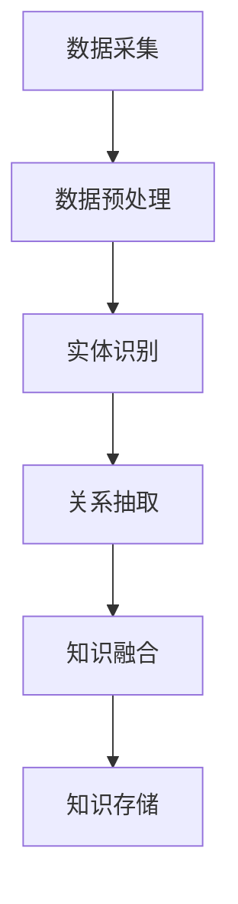

                 

关键词：知识经济，知识付费，人工智能，知识图谱，知识图谱构建

摘要：本文探讨了知识经济背景下，基于人工智能技术的知识付费模式及其核心——知识图谱的构建。通过对知识图谱的基本概念、核心算法、数学模型及其在实际应用中的价值进行了深入分析，本文旨在为知识付费行业提供理论支撑和实践指导。

## 1. 背景介绍

### 1.1 知识经济时代的崛起

随着互联网和信息技术的快速发展，知识经济成为全球经济的新引擎。知识经济强调以知识为核心的生产要素，通过对知识的创造、传播和应用，实现经济的持续增长。知识付费作为知识经济的重要组成部分，已成为当前市场需求的热点。

### 1.2 知识付费的兴起

知识付费是指用户为获取特定的知识或技能，通过支付一定费用来获得相关服务。知识付费的兴起，得益于互联网的普及和人们对终身学习的需求。它不仅改变了传统教育模式，也为知识创造者和传播者提供了新的收入来源。

### 1.3 人工智能在知识付费中的应用

人工智能技术为知识付费带来了全新的发展机遇。通过智能推荐、知识图谱构建等应用，人工智能能够提高知识付费服务的个性化、精准化水平，从而提升用户体验。

## 2. 核心概念与联系

### 2.1 知识图谱概述

知识图谱是一种结构化的语义知识库，通过实体、属性、关系等概念，将知识以图的形式进行组织。它能够有效地存储、管理和利用知识，是实现人工智能应用的重要基础。

### 2.2 知识图谱的核心概念

- **实体（Entity）**：知识图谱中的基本元素，如人、地点、组织等。
- **属性（Attribute）**：描述实体的特征，如姓名、年龄、职位等。
- **关系（Relation）**：实体之间的关联，如“工作于”、“位于”等。

### 2.3 知识图谱的架构

知识图谱的构建通常包括数据采集、数据预处理、实体识别、关系抽取、知识融合和知识存储等步骤。以下是一个简单的 Mermaid 流程图，展示了知识图谱的基本架构：



## 3. 核心算法原理 & 具体操作步骤

### 3.1 算法原理概述

知识图谱的构建主要依赖于图论和机器学习算法。其中，图论为知识图谱提供了理论基础，而机器学习算法则用于实现实体识别、关系抽取等功能。

### 3.2 算法步骤详解

#### 3.2.1 数据采集

数据采集是知识图谱构建的第一步，通常包括以下几种方式：

- **网络爬取**：从互联网上获取结构化和非结构化的数据。
- **数据接口**：通过API接口获取第三方平台的数据。
- **数据导入**：将现有的数据库或文件导入到知识图谱系统中。

#### 3.2.2 数据预处理

数据预处理是保证数据质量的重要步骤，主要包括数据清洗、数据整合和数据转换等。

- **数据清洗**：去除重复、错误和无关的数据。
- **数据整合**：将来自不同源的数据进行合并和统一格式化。
- **数据转换**：将数据转换为适合知识图谱表示的形式，如三元组。

#### 3.2.3 实体识别

实体识别是知识图谱构建的关键步骤，其主要任务是识别出文本中的实体，并将其转化为图中的节点。

- **命名实体识别**：识别文本中的专有名词、人名、地名等。
- **实体分类**：对命名实体进行分类，确定其实体类别。

#### 3.2.4 关系抽取

关系抽取是识别实体之间的关联，并将其转化为图中的边。

- **规则方法**：通过预定义的规则识别实体之间的关系。
- **机器学习方法**：利用机器学习算法，如条件随机场（CRF）、神经网络（NN）等，自动识别实体关系。

#### 3.2.5 知识融合

知识融合是将不同来源、不同格式的知识进行整合，形成一个统一的语义表示。

- **本体映射**：将不同本体中的概念进行映射，实现知识的一致性。
- **数据集成**：将不同数据源中的数据集成到一个知识库中。

#### 3.2.6 知识存储

知识存储是将构建好的知识图谱存储到数据库或图数据库中，以便后续查询和使用。

- **图数据库**：如Neo4j、JanusGraph等，专门用于存储和管理图结构数据。
- **关系数据库**：如MySQL、PostgreSQL等，适用于存储非图结构化的数据。

### 3.3 算法优缺点

- **优点**：
  - **高效性**：利用图结构和机器学习算法，能够快速构建大规模的知识图谱。
  - **灵活性**：支持多种数据源和多种知识表示方式，能够适应不同的应用场景。

- **缺点**：
  - **复杂性**：知识图谱的构建涉及多个步骤和算法，实现较为复杂。
  - **数据质量**：数据质量和完整性对知识图谱的构建至关重要，数据质量问题可能导致图谱的不准确。

### 3.4 算法应用领域

知识图谱在知识付费领域具有广泛的应用前景，包括但不限于：

- **个性化推荐**：根据用户行为和知识图谱，为用户推荐合适的知识内容。
- **知识库建设**：构建行业知识库，为用户提供权威、准确的知识服务。
- **智能问答**：利用知识图谱，实现智能问答系统，为用户提供即时解答。

## 4. 数学模型和公式 & 详细讲解 & 举例说明

### 4.1 数学模型构建

知识图谱的构建涉及到多种数学模型，如图论模型、概率模型、神经网络模型等。以下是一个简单的图论模型示例：

$$
G = (V, E)
$$

其中，$V$ 表示节点集合，$E$ 表示边集合。节点和边分别代表知识图谱中的实体和关系。

### 4.2 公式推导过程

在知识图谱中，实体之间的相似性可以通过以下公式计算：

$$
similarity(A, B) = \frac{|\{r \in E | r \in R(A) \cap R(B)\}|}{|\{r \in E | r \in R(A) \cup R(B)\}|
$$

其中，$R(A)$ 和 $R(B)$ 分别表示实体 $A$ 和 $B$ 的关系集合。

### 4.3 案例分析与讲解

假设有两个实体 $A$（苹果）和 $B$（香蕉），它们的关系集合分别为：

$$
R(A) = \{水果，红，甜\}
$$

$$
R(B) = \{水果，黄，甜\}
$$

根据相似性公式，可以计算出：

$$
similarity(A, B) = \frac{|\{水果，甜\}|}{|\{水果，红，甜，黄，甜\}|} = \frac{2}{5} = 0.4
$$

这意味着实体 $A$ 和 $B$ 之间的相似性为 40%，表明它们具有一定的相似性。

## 5. 项目实践：代码实例和详细解释说明

### 5.1 开发环境搭建

在本项目中，我们使用 Python 作为开发语言，结合 Neo4j 图数据库进行知识图谱的构建。以下是开发环境的搭建步骤：

1. 安装 Python 3.8 或更高版本。
2. 安装 Neo4j 图数据库，并启动服务。
3. 安装 Neo4j Python 驱动，如 `neo4j-driver`。

### 5.2 源代码详细实现

以下是一个简单的知识图谱构建代码示例：

```python
from neo4j import GraphDatabase

class KnowledgeGraph:
    def __init__(self, uri, user, password):
        self.driver = GraphDatabase.driver(uri, auth=(user, password))

    def close(self):
        self.driver.close()

    def create_node(self, label, properties):
        with self.driver.session() as session:
            session.run("CREATE (n:" + label + " " + properties + ")")

    def create_relationship(self, start_node, end_node, relationship):
        with self.driver.session() as session:
            session.run("MATCH (a:" + start_node + "), (b:" + end_node + ") CREATE (a)-[r:" + relationship + "]->(b)")

# 使用示例
kg = KnowledgeGraph("bolt://localhost:7687", "neo4j", "password")
kg.create_node("水果", "name:'苹果'")
kg.create_node("水果", "name:'香蕉'")
kg.create_relationship("苹果", "香蕉", "相似")
kg.close()
```

### 5.3 代码解读与分析

该代码示例首先定义了一个 `KnowledgeGraph` 类，用于连接 Neo4j 图数据库。通过 `create_node` 和 `create_relationship` 方法，可以创建节点和边，从而构建知识图谱。

- `create_node` 方法用于创建节点，参数 `label` 表示节点类别，`properties` 表示节点属性。
- `create_relationship` 方法用于创建边，参数 `start_node` 和 `end_node` 分别表示起始节点和结束节点，`relationship` 表示关系类型。

### 5.4 运行结果展示

执行以上代码后，Neo4j 图数据库中会创建两个节点（苹果、香蕉）和一个关系（相似）。可以使用 Neo4j 浏览器或 Cypher 查询语言查看知识图谱的构建结果。

```sql
MATCH (n)
RETURN n
```

## 6. 实际应用场景

### 6.1 个性化推荐

通过知识图谱，可以构建用户兴趣模型，实现个性化推荐。例如，根据用户的浏览历史和购买行为，推荐相关的知识内容。

### 6.2 知识库建设

知识图谱可以用于构建行业知识库，为用户提供权威、准确的知识服务。例如，在医学领域，可以构建药物知识图谱，为医生和患者提供药物相关信息。

### 6.3 智能问答

利用知识图谱，可以构建智能问答系统，为用户提供即时解答。例如，在法律咨询领域，可以构建法律知识图谱，为用户提供法律相关问题解答。

## 7. 未来应用展望

### 7.1 技术发展

随着人工智能技术的不断发展，知识图谱在知识付费领域的应用将更加广泛。例如，基于深度学习的实体识别和关系抽取技术，将进一步提高知识图谱的构建效率。

### 7.2 行业影响

知识图谱将深刻影响知识付费行业的商业模式。通过构建个性化的知识服务体系，知识付费平台将更好地满足用户需求，提高用户粘性和满意度。

### 7.3 法律法规

随着知识图谱应用的普及，相关法律法规也将不断完善。例如，数据隐私保护、知识产权保护等方面，将为知识付费行业提供法律保障。

## 8. 总结：未来发展趋势与挑战

### 8.1 研究成果总结

本文探讨了知识经济背景下，知识付费与人工智能知识图谱的关系。通过分析知识图谱的基本概念、核心算法和数学模型，本文为知识付费领域提供了理论支撑和实践指导。

### 8.2 未来发展趋势

未来，知识图谱将在知识付费领域发挥更加重要的作用。随着技术的进步和行业的成熟，知识图谱的应用将更加广泛，推动知识付费行业的创新发展。

### 8.3 面临的挑战

知识图谱的构建面临诸多挑战，包括数据质量、算法复杂度、法律法规等方面。如何解决这些挑战，将决定知识图谱在知识付费领域的发展前景。

### 8.4 研究展望

未来，知识图谱研究应重点关注以下几个方面：

- **数据质量**：提高数据质量和完整性，确保知识图谱的准确性。
- **算法优化**：优化实体识别和关系抽取算法，提高知识图谱的构建效率。
- **法律法规**：完善相关法律法规，保障知识付费行业的健康发展。

## 9. 附录：常见问题与解答

### 9.1 问题1：什么是知识图谱？

知识图谱是一种结构化的语义知识库，通过实体、属性、关系等概念，将知识以图的形式进行组织。

### 9.2 问题2：知识图谱有哪些应用领域？

知识图谱在多个领域具有广泛应用，如个性化推荐、知识库建设、智能问答等。

### 9.3 问题3：如何构建知识图谱？

构建知识图谱通常包括数据采集、数据预处理、实体识别、关系抽取、知识融合和知识存储等步骤。

### 9.4 问题4：知识图谱的算法有哪些？

知识图谱的算法包括图论算法、概率算法、神经网络算法等。

### 9.5 问题5：知识图谱与本体有何区别？

知识图谱和本体都是用于表示知识的工具，但知识图谱更侧重于知识的结构化组织，而本体更侧重于概念的定义和分类。

---

作者：禅与计算机程序设计艺术 / Zen and the Art of Computer Programming

