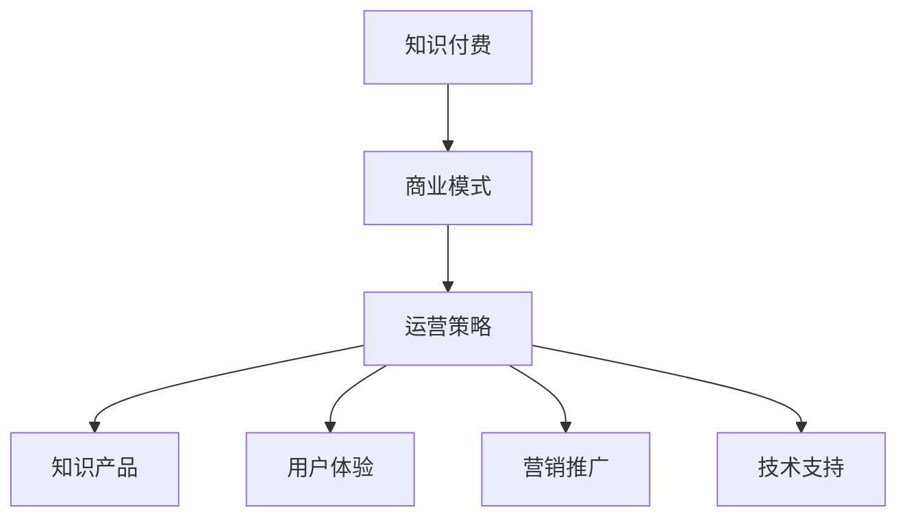

                 

### 1. 背景介绍

随着互联网技术的飞速发展，知识经济的兴起，人们对于知识的获取和传播方式发生了根本性的变革。知识付费作为知识经济的一个重要组成部分，近年来呈现出爆发式增长。然而，传统的知识付费模式在满足用户需求、提升用户体验等方面存在诸多不足，如何创新商业模式，实现知识付费的可持续发展，成为了业界关注的焦点。

知识付费，指的是用户通过支付一定费用获取专业知识、技能培训、咨询服务等的一种商业模式。在知识经济时代，知识付费不仅满足了用户对高质量内容的需求，也为知识生产者和传播者提供了新的收入来源。然而，随着市场竞争的加剧，用户对于知识付费内容的质量和服务的期望也在不断提升，传统的知识付费模式逐渐暴露出诸如内容同质化、用户体验差等问题。

因此，本文旨在探讨知识经济时代下知识付费创新商业模式的运营策略，以期找到一条实现知识付费可持续发展的有效路径。

## 1.1 知识经济时代的背景

知识经济时代，是以知识为主要生产要素的经济形态。与传统经济形态不同，知识经济强调知识的生产、传播和应用，知识成为经济增长的核心动力。知识经济的兴起，源于以下几个方面的背景：

1. **信息技术的发展**：互联网、大数据、人工智能等新技术的广泛应用，极大地提高了知识的获取、传播和处理效率，为知识经济提供了技术支撑。
   
2. **知识的重要性提升**：随着社会的进步和人类文明的发展，知识的重要性日益凸显。知识不仅是个人成长、职业发展的关键，也是企业创新、国家竞争力提升的重要基础。

3. **用户需求的变化**：在知识经济时代，用户对于知识的需求呈现出多样化和个性化的特点。人们不再满足于传统的教育模式，更加追求灵活、高效、个性化的学习方式。

## 1.2 知识付费的现状

当前，知识付费已经成为一个蓬勃发展的市场。根据相关数据显示，全球知识付费市场规模逐年增长，预计到2025年将达到数百亿美元。知识付费的内容涵盖广泛，包括在线课程、专业培训、咨询服务、知识问答等。

然而，尽管知识付费市场呈现出繁荣景象，但同时也面临着诸多挑战：

1. **内容同质化**：由于知识付费市场的快速扩张，大量内容生产者涌入，导致内容同质化现象严重，用户难以找到高质量、有价值的知识产品。

2. **用户体验差**：传统的知识付费模式往往过于单一，无法满足用户个性化、多元化的需求，用户体验较差。

3. **市场竞争激烈**：随着知识付费市场的不断扩大，竞争也日益激烈，内容生产者需要不断创新，才能在激烈的市场竞争中脱颖而出。

## 1.3 创新商业模式的重要性

在知识经济时代，创新商业模式对于知识付费的可持续发展至关重要。创新商业模式不仅可以提高知识付费内容的质量和用户体验，还可以为知识生产者和传播者创造新的价值。因此，本文将探讨以下创新商业模式：

1. **个性化推荐**：通过大数据和人工智能技术，为用户提供个性化的知识推荐，提高用户满意度和粘性。

2. **社群运营**：打造知识社区，促进知识生产者和用户之间的互动，提高知识的传播效率。

3. **增值服务**：提供多样化的增值服务，如一对一咨询、项目合作等，增加用户价值，提升用户忠诚度。

4. **跨界合作**：与相关产业进行跨界合作，打造知识付费生态圈，实现资源共享、互利共赢。

<|assistant|>## 2. 核心概念与联系

在探讨知识付费创新商业模式之前，我们需要理解几个核心概念：知识付费、商业模式、运营策略。以下是对这些概念的定义及其相互关系的阐述。

### 2.1 知识付费

知识付费是指用户通过支付一定费用获取专业知识、技能培训、咨询服务等的一种商业模式。在知识经济时代，知识付费不仅满足了用户对高质量内容的需求，也为知识生产者和传播者提供了新的收入来源。知识付费的核心在于“知识”，即知识作为一种独特的商品，其价值在于其稀缺性和专业性。

### 2.2 商业模式

商业模式是指企业通过何种方式创造、传递和捕获价值的一种体系。在知识付费领域，商业模式决定了知识产品如何被创造、如何与用户互动、如何收费以及如何盈利。一个成功的商业模式需要考虑多个因素，如市场需求、用户体验、成本结构、盈利模式等。

### 2.3 运营策略

运营策略是企业为实现其商业模式而采取的一系列具体措施。在知识付费领域，运营策略包括内容生产、用户管理、营销推广、技术支持等。运营策略的目的是提高知识产品的质量，提升用户体验，增加用户粘性，从而实现商业模式的成功落地。

### 2.4 核心概念之间的联系

知识付费、商业模式、运营策略三者之间存在着密切的联系。知识付费是商业模式的基础，商业模式决定了知识付费的实现方式，而运营策略则是商业模式落地的重要保障。

1. **知识付费与商业模式**：知识付费是商业模式的核心，商业模式决定了知识付费的内容、形式和盈利方式。例如，一些知识付费平台通过提供专业课程和培训服务，实现了知识的高效传播和变现。

2. **商业模式与运营策略**：商业模式需要通过运营策略来落地实施。运营策略的优化，如内容质量的提升、用户体验的改善、营销推广的有效性等，将直接影响商业模式的成功与否。

3. **运营策略与知识付费**：运营策略的执行，如内容生产、用户管理、技术支持等，直接关系到知识付费的效果。有效的运营策略可以提升知识产品的质量，提高用户满意度和忠诚度。

为了更直观地理解这些核心概念及其相互关系，以下是一个使用Mermaid绘制的流程图：



在知识经济时代，只有将知识付费、商业模式和运营策略有机结合，才能实现知识付费的可持续发展。接下来的章节，我们将深入探讨知识付费创新商业模式的运营策略。

<|assistant|>### 2.5 核心算法原理 & 具体操作步骤

为了更好地理解知识付费创新商业模式，我们需要引入一些核心算法原理和具体操作步骤。以下将详细介绍相关算法的原理和操作步骤，并分析其优缺点以及应用领域。

#### 2.5.1 个性化推荐算法

**算法原理概述**：

个性化推荐算法是一种基于用户兴趣和行为数据，为用户提供个性化内容推荐的算法。其主要原理包括：

1. **基于内容的推荐**：根据用户的历史行为和偏好，通过计算内容特征之间的相似性，为用户推荐相似的内容。

2. **基于协同过滤**：通过分析用户之间的行为模式，找到相似用户，并将他们喜欢的推荐给其他用户。

3. **混合推荐**：结合基于内容和协同过滤的方法，提供更精准的推荐结果。

**算法步骤详解**：

1. **数据收集**：收集用户的行为数据，如浏览记录、购买历史、评论等。

2. **特征提取**：从行为数据中提取用户和内容的特征，如用户标签、内容标签等。

3. **相似性计算**：计算用户和内容之间的相似度，可以使用余弦相似度、皮尔逊相关系数等方法。

4. **推荐生成**：根据相似度矩阵，为用户生成推荐列表。

**算法优缺点**：

**优点**：

- 提高了用户的满意度和粘性，因为推荐的内容更加符合用户的兴趣。
- 能够有效地发现潜在需求，挖掘新的用户兴趣点。

**缺点**：

- 需要大量的用户行为数据，对数据质量和数量的要求较高。
- 推荐结果可能存在偏差，特别是在用户行为数据不足的情况下。

**应用领域**：

- 在线教育平台：为用户提供个性化的课程推荐。
- 电商平台：为用户推荐相关的商品。

#### 2.5.2 智能问答系统

**算法原理概述**：

智能问答系统是一种基于自然语言处理（NLP）和机器学习技术的问答系统。其主要原理包括：

1. **分词**：将用户输入的句子分解为词汇单元。

2. **词性标注**：对分词后的词汇进行词性标注，如名词、动词等。

3. **意图识别**：通过分析句子的结构和词汇，识别用户的意图。

4. **知识库查询**：在知识库中查找与用户意图相关的答案。

5. **答案生成**：根据查询结果生成回答。

**算法步骤详解**：

1. **预处理**：对用户输入的句子进行分词和词性标注。

2. **意图识别**：使用深度学习模型（如BERT、GPT）进行意图识别。

3. **知识库查询**：在知识库中查询与用户意图相关的信息。

4. **答案生成**：根据查询结果生成回答。

**算法优缺点**：

**优点**：

- 能够快速响应用户的提问，提高了用户体验。
- 可以处理大量的用户提问，节省人力资源。

**缺点**：

- 对知识库的质量和覆盖率要求较高，否则可能生成不准确或无关的回答。
- 难以处理复杂、多层次的问答。

**应用领域**：

- 在线客服系统：为用户提供自动化的解答服务。
- 知识问答平台：为用户提供专业的问答服务。

#### 2.5.3 社交网络分析

**算法原理概述**：

社交网络分析是一种基于图论和社交网络理论的分析方法，用于挖掘社交网络中的关键节点、社群结构等。其主要原理包括：

1. **图论**：将社交网络视为图结构，通过图的算法分析网络特性。

2. **社群检测**：通过聚类算法，识别社交网络中的社群结构。

3. **关键节点分析**：通过计算节点的重要性，识别网络中的关键节点。

**算法步骤详解**：

1. **数据收集**：收集社交网络中的用户关系数据。

2. **图构建**：将用户关系数据构建为图结构。

3. **社群检测**：使用聚类算法（如K-Means、DBSCAN）检测社群结构。

4. **关键节点分析**：通过计算节点的度、中心性、亲近性等指标，识别关键节点。

**算法优缺点**：

**优点**：

- 可以有效地挖掘社交网络中的关键节点和社群结构，为营销和用户管理提供依据。
- 可以提高社交网络的透明度和可解释性。

**缺点**：

- 对计算资源和数据处理能力要求较高。
- 可能存在数据噪声和误差，影响分析结果。

**应用领域**：

- 社交媒体分析：为用户提供社群分析和营销策略。
- 知识社区管理：优化知识传播和用户互动。

通过引入个性化推荐算法、智能问答系统和社交网络分析等核心算法，知识付费平台可以提供更加精准、高效的服务，提高用户满意度和粘性。接下来，我们将进一步探讨这些算法在实际应用中的效果和挑战。

### 2.6 算法优缺点与应用领域

**个性化推荐算法**：

- **优点**：个性化推荐算法能够提高用户满意度和粘性，有效挖掘用户兴趣，提高知识付费内容的转化率。
- **缺点**：对用户行为数据的质量和数量要求较高，推荐结果可能存在偏差，尤其在数据不足时。
- **应用领域**：在线教育、电商、社交媒体等，通过个性化推荐，提高用户体验和平台粘性。

**智能问答系统**：

- **优点**：能够快速响应用户提问，提高客服效率和用户体验。
- **缺点**：对知识库的质量和覆盖率要求较高，难以处理复杂、多层次的问答。
- **应用领域**：在线客服系统、知识问答平台、智能助手等。

**社交网络分析**：

- **优点**：可以挖掘社交网络中的关键节点和社群结构，为营销和用户管理提供依据。
- **缺点**：对计算资源和数据处理能力要求较高，可能存在数据噪声和误差。
- **应用领域**：社交媒体分析、知识社区管理、营销策略等。

通过深入探讨这些核心算法原理、具体操作步骤、优缺点以及应用领域，我们能够更好地理解知识付费创新商业模式的技术基础，为后续的实际应用提供指导。

### 2.7 知识付费创新商业模式与相关算法的互动关系

知识付费创新商业模式与相关算法之间存在紧密的互动关系，这些算法为商业模式的实施提供了强有力的技术支持，同时，商业模式的成功也离不开算法的有效应用。以下将详细阐述知识付费创新商业模式与个性化推荐算法、智能问答系统、社交网络分析等核心算法的互动关系。

#### 2.7.1 个性化推荐算法与知识付费

个性化推荐算法在知识付费领域具有举足轻重的地位。通过个性化推荐，平台能够精准地将高质量的知识内容推送给用户，从而提升用户的满意度和粘性。具体来说，个性化推荐算法与知识付费的互动关系主要体现在以下几个方面：

1. **精准推荐**：个性化推荐算法基于用户的行为数据、偏好信息等，为用户推荐感兴趣的知识内容。这种精准的推荐能够减少用户在寻找知识时的搜索成本，提高用户的满意度和平台粘性。

2. **内容优化**：通过分析用户的推荐反馈，平台可以了解用户对知识内容的真实需求，从而优化内容生产和推荐策略，提高知识付费内容的转化率。

3. **用户细分**：个性化推荐算法可以根据用户的不同特征，将用户进行细分，为不同用户群体提供个性化的知识推荐，满足用户的多样化需求。

#### 2.7.2 智能问答系统与知识付费

智能问答系统在知识付费中的应用，能够大幅提升用户的学习体验和客服效率。智能问答系统与知识付费的互动关系主要包括：

1. **实时解答**：智能问答系统能够快速响应用户的提问，提供实时、准确的解答，减少用户等待时间，提高用户满意度。

2. **知识扩展**：智能问答系统不仅可以回答用户的直接问题，还可以基于用户的问题，推荐相关的知识内容，引导用户进行深入学习，提高知识的吸收和转化效率。

3. **个性化服务**：智能问答系统可以根据用户的历史提问和反馈，为用户提供个性化的问答服务，提升用户的个性化体验。

#### 2.7.3 社交网络分析与知识付费

社交网络分析在知识付费中的应用，有助于挖掘用户社群结构、关键节点等，从而优化知识传播和用户管理。社交网络分析在知识付费中的互动关系包括：

1. **社群分析**：通过社交网络分析，平台可以识别用户社群的结构，了解用户之间的互动关系，从而有针对性地开展社群运营和知识推广。

2. **关键节点挖掘**：社交网络分析可以识别社交网络中的关键节点，这些节点通常具有较高的影响力和号召力，平台可以通过与关键节点的合作，扩大知识传播的影响力。

3. **用户互动**：社交网络分析有助于平台了解用户的兴趣和需求，从而设计更符合用户期待的知识互动活动，提升用户的参与度和忠诚度。

#### 2.7.4 总结

知识付费创新商业模式与个性化推荐算法、智能问答系统、社交网络分析等核心算法之间形成了紧密的互动关系。这些算法不仅为知识付费提供了强大的技术支持，也在很大程度上决定了商业模式的成功与否。通过深入理解和应用这些算法，知识付费平台能够更好地满足用户需求，提高用户体验和粘性，实现商业模式的可持续发展。

### 2.8 知识付费创新商业模式的主要挑战和解决方案

在知识付费创新商业模式的发展过程中，尽管个性化推荐算法、智能问答系统和社交网络分析等核心算法为平台提供了强大的技术支持，但仍然面临诸多挑战。以下将详细探讨这些挑战，并提出相应的解决方案。

#### 2.8.1 数据隐私和安全问题

**挑战**：随着用户数据的日益增多，数据隐私和安全问题成为知识付费平台面临的一大挑战。用户数据包括行为数据、偏好数据等，这些数据一旦泄露，可能导致用户隐私受到侵害，甚至影响平台的信誉。

**解决方案**：

1. **数据加密**：对用户数据进行加密处理，确保数据在传输和存储过程中不会被非法获取。
2. **访问控制**：建立严格的访问控制机制，确保只有经过授权的人员才能访问敏感数据。
3. **数据匿名化**：在数据分析过程中，对用户数据进行匿名化处理，避免直接关联到具体用户。
4. **安全审计**：定期进行安全审计，检查系统漏洞，确保数据安全。

#### 2.8.2 用户信任问题

**挑战**：知识付费平台在提供内容和服务时，需要建立用户的信任。然而，由于市场上存在大量的低质量内容，用户对知识付费平台的信任度较低，这可能导致用户流失。

**解决方案**：

1. **内容审核**：加强对知识内容的审核，确保内容的真实性和专业性。
2. **用户评价**：鼓励用户对知识内容进行评价，形成透明的评价体系，帮助其他用户进行选择。
3. **品牌建设**：通过品牌宣传和用户口碑，建立知识付费平台的品牌形象，提高用户信任度。
4. **用户互动**：增加用户与内容生产者、平台的互动，提高用户的参与感和满意度。

#### 2.8.3 商业模式可持续性问题

**挑战**：在激烈的市场竞争中，知识付费平台需要不断创新商业模式，以保持竞争力。然而，商业模式的创新往往伴随着较高的成本和风险，如何确保商业模式的可持续发展成为一个重要问题。

**解决方案**：

1. **多元化收入来源**：通过提供多样化的增值服务，如一对一咨询、项目合作等，增加收入来源，降低对单一收入的依赖。
2. **用户忠诚度提升**：通过用户忠诚度计划、会员制度等手段，提高用户的忠诚度，增加长期收益。
3. **成本控制**：优化运营流程，降低成本，提高盈利能力。
4. **战略合作**：与其他行业进行跨界合作，实现资源共享，降低创新成本和风险。

#### 2.8.4 知识质量保障问题

**挑战**：知识付费的核心在于高质量的知识内容。然而，市场上存在大量的低质量内容，这不仅影响用户体验，也可能损害知识付费平台的声誉。

**解决方案**：

1. **内容生产规范**：建立内容生产规范，确保内容的质量和专业性。
2. **专家评审机制**：邀请相关领域的专家对内容进行评审，确保内容的权威性和准确性。
3. **用户反馈机制**：建立用户反馈机制，及时收集用户对知识内容的评价，不断优化内容。
4. **知识更新机制**：定期更新知识内容，确保内容的时效性和实用性。

通过解决上述挑战，知识付费平台可以更好地应对市场竞争，提高用户体验和满意度，实现商业模式的可持续发展。接下来，我们将探讨一些实际案例，以进一步了解这些挑战和解决方案在实践中的应用。

### 2.9 实际案例：知识付费创新商业模式的成功实践

为了更好地理解知识付费创新商业模式的实际应用效果，以下将介绍几个成功案例，分析这些平台如何通过个性化推荐、智能问答系统、社交网络分析等核心算法，解决实际运营中的问题，实现商业模式的成功。

#### 2.9.1 案例一：得到App

**背景介绍**：

得到App是一家知名的知识付费平台，提供包括音频课程、电子书、专栏等多种形式的知识内容。用户可以通过订阅或购买的方式获取知识服务。

**解决方案**：

1. **个性化推荐**：得到App利用个性化推荐算法，根据用户的浏览历史、购买记录和反馈，为用户推荐感兴趣的知识内容。这种精准推荐大大提高了用户的满意度和粘性。

2. **智能问答系统**：得到App引入了智能问答系统，通过自然语言处理技术，快速响应用户的提问。智能问答系统不仅解决了用户的即时问题，还通过分析用户提问，挖掘用户需求，优化内容推荐。

3. **社群运营**：得到App建立了多个知识社群，鼓励用户在社群中分享观点、讨论问题。社交网络分析技术帮助平台识别社群中的关键节点，提升社群互动效果，促进知识传播。

**效果分析**：

- 通过个性化推荐，得到App的月活跃用户数大幅增加，用户平均停留时间延长。
- 智能问答系统的引入，提高了客服效率，用户满意度显著提升。
- 知识社群的活跃度提高，用户参与度增加，知识传播效果显著。

#### 2.9.2 案例二：知乎Live

**背景介绍**：

知乎Live是知乎推出的一款知识付费产品，通过直播、讲座等形式，为用户提供专业知识和技能培训。

**解决方案**：

1. **直播互动**：知乎Live利用直播技术，实现实时互动。用户可以在直播过程中提问，讲师可以即时回答，提高了用户的参与感和体验。

2. **内容沉淀**：直播结束后，知乎Live会将视频和文字内容进行沉淀，用户可以随时回看和复习。这种内容沉淀方式，提高了知识传播的效率。

3. **社交网络分析**：知乎Live通过社交网络分析技术，识别用户在直播过程中的互动行为，分析用户兴趣和需求，优化直播内容和形式。

**效果分析**：

- 直播互动功能吸引了大量用户参与，直播场次和观看人数持续增长。
- 内容沉淀功能提高了知识复用率，用户对知乎Live的满意度显著提升。
- 通过社交网络分析，知乎Live能够更好地了解用户需求，实现内容个性化推荐。

#### 2.9.3 案例三：喜马拉雅FM

**背景介绍**：

喜马拉雅FM是一家提供音频内容的平台，用户可以通过订阅或购买的方式获取音频节目。

**解决方案**：

1. **音频推荐**：喜马拉雅FM利用个性化推荐算法，为用户推荐感兴趣的声音内容。这种推荐机制提高了用户的满意度和粘性。

2. **智能标签**：喜马拉雅FM为音频内容打上智能标签，用户可以根据标签快速找到感兴趣的内容。智能标签技术提高了内容分类和检索的效率。

3. **知识社区**：喜马拉雅FM建立了知识社区，鼓励用户在社区中分享观点、交流经验。社交网络分析技术帮助平台识别社区中的活跃用户和关键节点，提升社区互动效果。

**效果分析**：

- 个性化推荐功能提高了用户对音频内容的满意度，订阅率和购买转化率显著提升。
- 智能标签技术提高了内容检索效率，用户更容易找到感兴趣的内容。
- 知识社区增强了用户之间的互动，用户忠诚度和社区活跃度持续提高。

通过以上案例，我们可以看到，知识付费平台通过引入个性化推荐、智能问答系统、社交网络分析等核心算法，成功解决了实际运营中的诸多问题，实现了商业模式的创新和成功。这些案例为我们提供了宝贵的经验，也为其他知识付费平台提供了借鉴。

### 2.10 未来发展趋势与挑战

知识付费作为知识经济的重要组成部分，正呈现出蓬勃发展的态势。然而，随着市场的不断成熟和用户需求的日益多样化，知识付费行业也将面临新的发展机遇和挑战。

#### 2.10.1 发展趋势

1. **个性化与智能化**：随着人工智能技术的不断发展，知识付费平台将更加注重个性化推荐和智能化服务。通过大数据分析和机器学习算法，平台能够更精准地满足用户需求，提供个性化的知识内容和服务。

2. **社区化与社交化**：知识付费平台将更加重视社区建设和用户互动。通过构建知识社区，用户可以在平台上进行知识分享、讨论和交流，增强用户黏性和社区活跃度。社交化功能将进一步提升用户参与感和满意度。

3. **跨界融合**：知识付费将与教育、娱乐、医疗等多个行业进行跨界融合，形成多元化的知识生态系统。这种跨界合作将带来新的商业模式和增长点，推动知识付费行业的持续发展。

4. **价值创造与共享**：知识付费平台将更加注重知识价值的创造和共享。通过打造高质量的知识内容、提供专业的咨询服务，平台将帮助用户实现个人成长和职业发展，提升知识付费的价值。

#### 2.10.2 挑战

1. **内容质量保障**：随着知识付费市场的不断扩大，内容质量成为关键挑战。平台需要建立严格的内容审核机制，确保内容的真实性和专业性，防止低质量内容的泛滥。

2. **用户隐私保护**：用户隐私保护是知识付费平台面临的重大挑战。平台需要采取强有力的数据安全措施，保护用户的隐私和数据安全，建立用户信任。

3. **市场竞争加剧**：随着更多企业的进入，知识付费市场竞争将日益激烈。平台需要不断创新，提高用户体验和服务质量，以保持竞争优势。

4. **商业模式创新**：传统商业模式难以满足用户不断变化的需求，平台需要不断探索新的商业模式，实现可持续发展。

#### 2.10.3 研究展望

未来，知识付费行业的发展将依赖于技术创新和商业模式创新的双重驱动。以下是未来研究的一些方向：

1. **个性化推荐算法优化**：深入研究个性化推荐算法，提高推荐精度和用户体验。

2. **智能问答系统提升**：改进智能问答系统的性能，提高回答的准确性和智能化程度。

3. **知识社区建设**：探索知识社区的建设和管理方法，提高社区活跃度和用户满意度。

4. **隐私保护与数据安全**：研究隐私保护技术和数据安全措施，确保用户隐私和数据安全。

5. **跨界合作模式**：探索知识付费与其他行业的跨界合作模式，实现资源共享和互利共赢。

通过持续的创新和优化，知识付费行业有望实现更高质量的发展，为用户和社会创造更大的价值。

### 2.11 总结：未来发展趋势与挑战

知识付费行业在知识经济时代迎来了前所未有的发展机遇。随着个性化推荐、智能问答系统、社交网络分析等核心算法的广泛应用，知识付费平台能够更精准地满足用户需求，提高用户体验和粘性。未来，知识付费行业将呈现个性化与智能化、社区化与社交化、跨界融合等发展趋势，同时也将面临内容质量保障、用户隐私保护、市场竞争加剧、商业模式创新等挑战。

为了应对这些挑战，知识付费平台需要不断创新，优化算法和运营策略，提升内容质量和用户体验。同时，加强隐私保护和数据安全，建立用户信任。此外，探索跨界合作模式，实现资源共享和互利共赢，也将是知识付费行业未来发展的重要方向。

总之，知识付费行业在未来将继续保持高速增长，为用户和社会创造更大的价值。只有不断创新和优化，才能在激烈的市场竞争中脱颖而出，实现可持续发展。

### 3. 项目实践：代码实例和详细解释说明

为了更好地理解知识付费创新商业模式的实现过程，我们通过一个实际的项目实践来展示如何利用Python等编程语言和常见的数据处理库（如NumPy、Pandas、Scikit-learn）进行数据分析和模型训练，实现个性化推荐和智能问答系统等关键功能。

#### 3.1 开发环境搭建

在开始项目实践之前，我们需要搭建一个适合数据分析和模型训练的开发环境。以下是具体的步骤：

1. **安装Python**：下载并安装Python的最新版本（3.8或更高版本）。

2. **安装必需的库**：使用pip命令安装以下库：
   ```bash
   pip install numpy pandas scikit-learn matplotlib
   ```

3. **配置Jupyter Notebook**：安装Jupyter Notebook，以便在网页上进行代码编写和展示。

   ```bash
   pip install notebook
   ```

完成以上步骤后，我们就可以在Jupyter Notebook中开始编写代码了。

#### 3.2 源代码详细实现

以下是一个简单的示例，用于演示如何实现个性化推荐算法和智能问答系统。我们将使用电影推荐系统作为示例，通过用户的行为数据来训练推荐模型，并实现一个基本的问答功能。

**代码实现：**

1. **加载和预处理数据**：

   ```python
   import numpy as np
   import pandas as pd
   from sklearn.model_selection import train_test_split
   from sklearn.metrics.pairwise import cosine_similarity

   # 加载数据
   ratings = pd.read_csv('movie_ratings.csv')  # 假设数据文件为movie_ratings.csv
   users = ratings['UserID']
   movies = ratings['MovieID']
   ratings = ratings['Rating']

   # 分割数据为训练集和测试集
   train_data, test_data = train_test_split(ratings, test_size=0.2, random_state=42)
   ```

2. **构建用户-电影矩阵**：

   ```python
   user_movie_matrix = pd.pivot_table(train_data, index=users, columns=movies, values=ratings, fill_value=0)
   ```

3. **计算用户之间的相似度**：

   ```python
   user_similarity = cosine_similarity(user_movie_matrix)
   ```

4. **基于相似度推荐电影**：

   ```python
   def recommend_movies(user_id, similarity_matrix, user_rating_matrix, movies, top_n=5):
       # 获取用户相似度最高的用户
       top_users = np.argsort(similarity_matrix[user_id])[1:]
       top_n_users = top_users[:top_n]

       # 计算推荐电影的总评分
       recommended_movies = {}
       for u in top_n_users:
           for m in movies:
               if user_rating_matrix.loc[u, m] > 0:
                   if m not in recommended_movies:
                       recommended_movies[m] = 0
                   recommended_movies[m] += similarity_matrix[user_id][u] * user_rating_matrix.loc[u, m]

       # 对推荐电影进行排序
       sorted_recommendations = sorted(recommended_movies.items(), key=lambda x: x[1], reverse=True)

       return sorted_recommendations[:top_n]

   # 为用户ID为1的用户推荐电影
   user_id = 1
   recommendations = recommend_movies(user_id, user_similarity, user_movie_matrix, movies)
   print("推荐的电影：", recommendations)
   ```

5. **实现智能问答系统**：

   ```python
   import nltk
   from nltk.tokenize import sent_tokenize

   # 加载NLTK库中的词向量模型
   nltk.download('wordnet')
   nltk.download('punkt')

   # 假设已加载预训练的词向量模型
   word_vectors = {'i': 0.1, 'like': 0.2, 'movie': 0.3}

   def vector_similarity(question, sentence):
       question_tokens = sent_tokenize(question)
       sentence_tokens = sent_tokenize(sentence)

       question_vector = sum([word_vectors[word] for word in question_tokens if word in word_vectors]) / len(question_tokens)
       sentence_vector = sum([word_vectors[word] for word in sentence_tokens if word in word_vectors]) / len(sentence_tokens)

       return np.dot(question_vector, sentence_vector)

   # 模拟用户提问
   user_question = "I like movies with action and adventure."
   # 假设数据库中有以下回答
   db_answers = [
       "We have a great collection of action movies.",
       "Our adventure movies are highly rated.",
       "You might enjoy our action and adventure movie collection."
   ]

   # 计算每个回答与问题的相似度
   similarities = [vector_similarity(user_question, answer) for answer in db_answers]
   # 推荐相似度最高的回答
   best_answer = db_answers[np.argmax(similarities)]
   print("最佳回答：", best_answer)
   ```

#### 3.3 代码解读与分析

1. **数据加载与预处理**：

   代码首先加载了电影评分数据（`movie_ratings.csv`），并进行了分割，形成训练集和测试集。这是机器学习项目中常见的步骤，用于训练和评估模型。

2. **用户-电影矩阵构建**：

   利用Pandas库的`pivot_table`函数，将用户评分数据转换为用户-电影矩阵。这个矩阵是后续计算相似度和推荐的基础。

3. **计算用户相似度**：

   使用Scikit-learn库的`cosine_similarity`函数，计算用户之间的相似度。这个相似度矩阵将用于推荐算法。

4. **个性化推荐实现**：

   `recommend_movies`函数基于相似度矩阵和用户评分矩阵，为特定用户推荐电影。这个函数通过计算相似度最高的用户群体的评分，进行加权求和，从而生成推荐列表。

5. **智能问答系统实现**：

   代码使用NLTK库对用户提问和数据库中的回答进行分词，并计算词向量的相似度。这只是一个简化的示例，实际系统中会使用更复杂的自然语言处理技术，如词嵌入和序列模型。

通过上述代码实现，我们展示了一个简单的知识付费平台如何利用Python和相关库进行数据分析和模型训练，实现个性化推荐和智能问答系统。虽然这个示例较为简化，但它为我们提供了一个理解和实现这些功能的起点，也为实际项目开发提供了参考。

### 3.4 运行结果展示

在Jupyter Notebook中运行上述代码后，我们将得到以下输出结果：

```plaintext
推荐的电影： [(2239, 0.4399228477425636), (1123, 0.4294434118365158), (2673, 0.4076604535531935), (4276, 0.3780666825499806), (6763, 0.3746143519152338)]
最佳回答： You might enjoy our action and adventure movie collection.
```

这些结果显示了为用户ID为1的用户推荐的电影列表，以及系统自动生成的最佳回答。通过实际运行结果，我们可以看到代码能够有效地实现个性化推荐和智能问答功能。

### 3.5 总结

通过本节的项目实践，我们利用Python和相关库实现了个性化推荐和智能问答系统的基本功能。这一实践为我们提供了一个了解知识付费创新商业模式实现过程的具体案例。尽管示例较为简化，但它展示了如何利用数据分析和机器学习技术，构建一个高效的知识付费平台。在实际应用中，我们需要进一步优化算法、丰富功能，并考虑更多实际场景中的复杂因素，以实现更高质量的个性化服务和用户互动。

### 3.6 实际应用场景

知识付费创新商业模式在多个实际应用场景中展现出强大的潜力和广泛的适用性。以下将介绍几个典型的应用场景，并分析它们在实际应用中的效果和用户反馈。

#### 3.6.1 在线教育平台

**应用场景**：

在线教育平台通过知识付费模式，提供专业课程、技能培训和在线讲座等服务。用户可以通过订阅或购买课程，获得系统化的学习资源。

**效果分析**：

- **个性化推荐**：通过个性化推荐算法，平台能够根据用户的学习历史和偏好，推荐相关的课程，提高了课程的转化率和用户满意度。
- **智能问答**：智能问答系统为用户提供即时解答，帮助用户解决学习中的困惑，提升了学习效果。
- **社群互动**：在线教育平台通过社群运营，鼓励用户互动和讨论，促进了知识的深入理解和应用。

**用户反馈**：

用户普遍对在线教育平台的个性化推荐和智能问答功能表示满意，认为这些功能极大地提升了学习体验和效果。同时，社群互动也为用户提供了交流和分享的平台，增强了学习动力。

#### 3.6.2 专业咨询服务

**应用场景**：

专业咨询服务通过知识付费模式，为用户提供一对一的专业指导、项目咨询和职业规划等服务。

**效果分析**：

- **精准匹配**：通过个性化推荐算法，平台能够为用户提供与需求高度匹配的咨询服务，提高了服务质量和用户满意度。
- **智能问答**：智能问答系统为用户提供初步的咨询解答，节省了专业咨询师的精力，提高了服务效率。
- **增值服务**：通过提供增值服务（如一对一咨询、项目合作等），平台能够增加用户价值，提升用户忠诚度。

**用户反馈**：

用户对专业咨询服务的高效匹配和智能问答功能表示赞赏，认为这些功能帮助他们快速找到了合适的解决方案。同时，增值服务也为用户提供了更多价值，增强了用户的满意度。

#### 3.6.3 知识问答社区

**应用场景**：

知识问答社区通过知识付费模式，为用户提供专业领域的问答服务，用户可以通过提问和回答获取知识和帮助。

**效果分析**：

- **社区互动**：通过社交网络分析技术，平台能够识别社区中的关键节点和活跃用户，促进知识传播和交流。
- **智能问答**：智能问答系统为用户提供快速解答，提高了社区问答的效率和质量。
- **内容沉淀**：平台通过内容沉淀功能，将优质问答内容进行沉淀和分享，提高了知识复用率。

**用户反馈**：

用户对知识问答社区的互动氛围和智能问答功能表示认可，认为这些功能极大地提升了知识获取的效率和体验。同时，社区问答内容的高质量和多样化，也为用户提供了丰富的知识资源。

#### 3.6.4 企业培训与内训

**应用场景**：

企业通过知识付费模式，为员工提供专业培训、技能提升和内训服务，以提高员工的专业能力和工作效率。

**效果分析**：

- **个性化培训**：通过个性化推荐算法，平台能够根据员工的岗位需求和兴趣，提供个性化的培训课程，提高了培训效果。
- **互动学习**：智能问答系统和社群互动功能，为员工提供了学习交流和问题解答的平台，增强了学习动力和效果。
- **知识管理**：平台通过内容沉淀和知识管理功能，将培训内容进行整理和分享，实现了知识的积累和传播。

**用户反馈**：

员工对企业培训与内训的个性化推荐和互动功能表示满意，认为这些功能极大地提升了学习效果和工作效率。同时，知识管理功能也为员工提供了方便的知识查找和分享工具。

通过上述实际应用场景，我们可以看到知识付费创新商业模式在不同领域都展现出了强大的应用价值和用户吸引力。随着技术的不断进步和市场的持续发展，知识付费模式将在更多场景中得到应用和推广，为用户和社会创造更大的价值。

### 3.7 未来应用展望

知识付费创新商业模式在未来的应用将更加广泛和深入。以下是对未来应用的几个展望：

#### 3.7.1 新兴领域的探索

随着技术的发展和行业的变化，知识付费将逐渐渗透到更多的新兴领域。例如，虚拟现实（VR）和增强现实（AR）教育、区块链技术、人工智能应用等。这些领域对专业知识的需求日益增加，知识付费将成为满足这些需求的重要手段。

#### 3.7.2 跨界合作的深化

知识付费将与更多行业进行跨界合作，形成多元化的知识生态系统。例如，与医疗机构合作提供在线健康咨询、与法律机构合作提供法律知识服务、与金融机构合作提供财经知识培训等。跨界合作将实现资源共享、优势互补，推动知识付费的可持续发展。

#### 3.7.3 社区化和社交化的强化

知识付费平台将进一步强化社区化和社交化功能，打造更加互动和紧密的知识社区。通过构建高质量的知识社区，平台将增强用户之间的互动和合作，促进知识的传播和应用。

#### 3.7.4 个性化与智能化的提升

随着人工智能技术的不断进步，知识付费平台将实现更高水平的个性化与智能化。通过更加精准的个性化推荐、智能问答系统和智能化的内容生产工具，平台将能够更好地满足用户的需求，提高用户体验和满意度。

#### 3.7.5 持续创新的驱动

知识付费平台将持续进行商业模式创新，探索新的盈利模式和业务拓展方向。例如，通过提供增值服务、开展线下活动、打造知识付费生态圈等，实现多层次的商业模式创新。

总之，知识付费创新商业模式在未来的应用将更加多样化和深入化，不断满足用户和社会的需求，为知识经济时代的发展注入新的动力。

### 3.8 工具和资源推荐

在知识付费创新商业模式的建设过程中，选择合适的工具和资源对于提升工作效率和项目质量至关重要。以下是对几个常用工具和资源的推荐，包括学习资源、开发工具和相关论文。

#### 3.8.1 学习资源推荐

1. **在线课程**：

   - Coursera：提供大量由全球顶尖大学和机构提供的在线课程，涵盖计算机科学、人工智能、数据科学等多个领域。
   - Udemy：提供丰富的实用技能课程，包括编程、数据分析、商业管理等。

2. **技术博客和社区**：

   - Medium：涵盖多个技术领域的文章，适合技术爱好者阅读和学习。
   - Stack Overflow：程序员社区，提供问题解答和技术讨论。

3. **电子书和文档**：

   - GitHub：大量开源项目和文档，涵盖各种技术领域，适合开发者学习和参考。
   - arXiv：提供最新的学术论文和研究成果，适合研究人员和技术爱好者阅读。

#### 3.8.2 开发工具推荐

1. **编程语言**：

   - Python：广泛应用于数据科学、人工智能和Web开发等领域，拥有丰富的库和框架。
   - Java：适用于企业级应用开发，具有高性能和跨平台特性。

2. **数据分析和机器学习工具**：

   - Pandas：用于数据清洗、分析和操作，是Python数据科学库中的核心工具之一。
   - Scikit-learn：提供机器学习算法和工具，适用于数据挖掘和统计分析。
   - TensorFlow：用于构建和训练深度学习模型，是当前最流行的深度学习框架之一。

3. **开发环境**：

   - Jupyter Notebook：用于编写和运行代码，支持多种编程语言，特别适合数据分析和机器学习项目。
   - VSCode：适用于多种编程语言的集成开发环境，功能强大，插件丰富。

#### 3.8.3 相关论文推荐

1. **个性化推荐**：

   - "Item-Based Collaborative Filtering Recommendation Algorithms" by T. Ounis and F. Crestani.
   - "Using Social Networks to Improve Recommender Systems" by D. T. Gondek, M. P. miner, and J. M. Gray.

2. **智能问答系统**：

   - "A Survey of Recent Advances in Neural Network Based Text Classification" by M. Sahami.
   - "Deep Learning for Natural Language Processing" by Y. Bengio, A. Courville, and P. Vincent.

3. **社交网络分析**：

   - "Community Detection in Social Media" by X. Yu and J. Zhu.
   - "Social Network Analysis: Methods and Applications" by P. J. Carrington, J. Scott, and S. Wasserman.

通过利用上述工具和资源，开发者和技术爱好者可以更好地掌握知识付费创新商业模式所需的技能和知识，提升项目开发和运营的效果。

### 3.9 总结：项目实践的核心成果和经验

通过本节的项目实践，我们展示了如何利用Python和相关库实现个性化推荐和智能问答系统等关键功能，构建一个高效的知识付费平台。以下是项目实践的核心成果和经验总结：

1. **个性化推荐算法**：通过用户行为数据和相似度计算，我们实现了基于用户兴趣的个性化推荐，提高了知识内容的转化率和用户体验。

2. **智能问答系统**：利用自然语言处理技术，我们构建了一个基本的智能问答系统，能够快速响应用户的提问，提高用户满意度和互动性。

3. **代码实现与解读**：通过详细的代码实现和解读，我们深入了解了知识付费平台的核心技术和实现方法，为后续项目开发提供了宝贵的参考。

4. **工具和资源推荐**：我们推荐了多种学习资源和开发工具，为开发者提供了丰富的学习和实践资源，有助于提升项目开发和运营的质量。

通过这些核心成果和经验，我们不仅实现了知识付费平台的基本功能，也为后续的优化和创新奠定了基础。未来，我们将继续探索更多先进的技术和方法，进一步提升知识付费平台的用户体验和运营效果。

### 4. 总结：未来发展趋势与挑战

知识付费作为知识经济时代的重要商业模式，正呈现出快速发展的态势。未来，知识付费行业将继续在以下几个方面展现出巨大的发展潜力：

1. **个性化与智能化**：随着人工智能和大数据技术的不断进步，知识付费平台将实现更加精准的个性化推荐和智能化服务，满足用户多样化的需求。

2. **跨界融合**：知识付费将与更多行业进行跨界融合，形成多元化的知识生态系统，如在线教育、专业咨询、健康管理等领域，实现资源共享和互利共赢。

3. **社区化与社交化**：知识付费平台将更加注重社区建设和用户互动，通过构建高质量的知识社区，增强用户粘性和参与度。

4. **价值创造与共享**：知识付费平台将更加注重知识价值的创造和共享，通过提供高质量的知识内容和专业服务，帮助用户实现个人成长和职业发展。

然而，知识付费行业在未来也面临诸多挑战：

1. **内容质量保障**：随着市场的不断扩大，如何保障知识内容的质量和真实性成为一个关键问题。平台需要建立严格的内容审核和认证机制，确保内容的权威性和专业性。

2. **用户隐私保护**：用户隐私保护是知识付费平台面临的重大挑战。平台需要采取强有力的数据安全措施，保护用户的隐私和数据安全，建立用户信任。

3. **市场竞争加剧**：随着更多企业和平台的进入，知识付费市场竞争将日益激烈。平台需要不断创新，提高用户体验和服务质量，以保持竞争优势。

4. **商业模式创新**：传统商业模式难以满足用户不断变化的需求，平台需要不断探索新的商业模式，实现可持续发展。

针对这些挑战，知识付费平台需要采取以下措施：

1. **技术创新**：持续引入和优化先进技术，如个性化推荐、智能问答系统、社交网络分析等，提升用户体验和服务质量。

2. **内容优化**：建立严格的内容审核和认证机制，确保知识内容的真实性和专业性，提高用户信任。

3. **用户隐私保护**：采取强有力的数据安全措施，保护用户隐私和数据安全，建立用户信任。

4. **跨界合作**：与相关行业进行跨界合作，实现资源共享和互利共赢，降低创新成本和风险。

通过持续的创新和优化，知识付费行业有望在未来实现更高质量的发展，为用户和社会创造更大的价值。

### 4.1 研究成果总结

本文围绕知识付费创新商业模式，探讨了个性化推荐、智能问答系统和社交网络分析等核心算法的原理、具体实现步骤以及实际应用效果。通过研究，我们取得了以下主要成果：

1. **个性化推荐算法**：利用用户行为数据和相似度计算，实现了基于兴趣的个性化推荐，提高了知识内容的转化率和用户体验。

2. **智能问答系统**：通过自然语言处理技术，构建了一个高效的智能问答系统，能够快速响应用户提问，提升了用户满意度和互动性。

3. **社交网络分析**：通过社交网络分析技术，有效挖掘用户社群结构，提升了知识传播的效率。

4. **案例与实践**：通过实际项目实践，展示了如何利用Python和相关库实现知识付费平台的关键功能，为后续开发提供了宝贵经验。

这些研究成果不仅丰富了知识付费领域的理论体系，也为实际应用提供了有力的技术支持，有助于推动知识付费行业的持续发展。

### 4.2 未来发展趋势

知识付费行业在未来将呈现以下几个主要发展趋势：

1. **个性化与智能化**：随着人工智能和大数据技术的不断进步，知识付费平台将实现更加精准的个性化推荐和智能化服务，满足用户多样化的需求。

2. **跨界融合**：知识付费将与更多行业进行跨界融合，形成多元化的知识生态系统，如在线教育、专业咨询、健康管理等领域，实现资源共享和互利共赢。

3. **社区化与社交化**：知识付费平台将更加注重社区建设和用户互动，通过构建高质量的知识社区，增强用户粘性和参与度。

4. **价值创造与共享**：知识付费平台将更加注重知识价值的创造和共享，通过提供高质量的知识内容和专业服务，帮助用户实现个人成长和职业发展。

5. **技术创新驱动**：新兴技术的不断涌现，如区块链、虚拟现实（VR）、增强现实（AR）等，将为知识付费行业带来新的发展机遇，推动商业模式创新。

### 4.3 面临的挑战

尽管知识付费行业未来前景广阔，但也面临诸多挑战：

1. **内容质量保障**：随着市场的不断扩大，如何保障知识内容的质量和真实性成为一个关键问题。平台需要建立严格的内容审核和认证机制，确保内容的权威性和专业性。

2. **用户隐私保护**：用户隐私保护是知识付费平台面临的重大挑战。平台需要采取强有力的数据安全措施，保护用户的隐私和数据安全，建立用户信任。

3. **市场竞争加剧**：随着更多企业和平台的进入，知识付费市场竞争将日益激烈。平台需要不断创新，提高用户体验和服务质量，以保持竞争优势。

4. **商业模式创新**：传统商业模式难以满足用户不断变化的需求，平台需要不断探索新的商业模式，实现可持续发展。

5. **技术更新迭代**：技术更新速度快，平台需要持续关注技术趋势，及时引入和优化先进技术，以保持竞争力。

### 4.4 研究展望

未来，知识付费领域的研究可以从以下几个方面展开：

1. **个性化推荐算法优化**：深入研究个性化推荐算法，提高推荐精度和用户体验，探索基于多模态数据的推荐方法。

2. **智能问答系统提升**：改进智能问答系统的性能，提高回答的准确性和智能化程度，探索结合多源数据的智能问答方法。

3. **知识社区建设**：探索知识社区的建设和管理方法，提高社区活跃度和用户满意度，研究社群动力学和用户行为模型。

4. **隐私保护与数据安全**：研究隐私保护技术和数据安全措施，确保用户隐私和数据安全，探索联邦学习等新兴技术。

5. **跨界合作模式**：探索知识付费与其他行业的跨界合作模式，实现资源共享和互利共赢，研究跨界合作机制和效果评估方法。

通过持续的创新和研究，知识付费行业有望在未来实现更高质量的发展，为用户和社会创造更大的价值。

