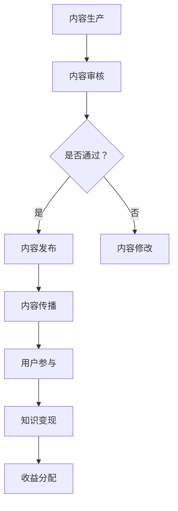

                 

关键词：知识经济，知识付费，商业模式，创新运营，技术趋势，用户参与，案例分析，数学模型，实际应用

> 摘要：本文将深入探讨知识经济时代下知识付费领域的创新商业模式及其运营策略。通过分析当前市场趋势、技术发展、用户需求变化，我们提出了一套系统化的知识付费商业模式，并探讨了其在实际应用中的操作步骤、数学模型、项目实践及其未来发展的挑战与机遇。

## 1. 背景介绍

随着互联网和数字技术的飞速发展，知识经济已经成为全球经济的重要组成部分。知识付费作为一种新兴商业模式，受到了越来越多企业和个人的关注。知识付费指的是消费者为获取有价值的信息、知识和技能而支付的费用，它不仅包括传统的教育培训服务，还涵盖了在线课程、电子书、专业咨询、在线研讨会等多种形式。

知识付费市场的快速发展得益于以下几个方面：

1. **用户需求增加**：随着社会竞争的加剧，人们对高质量知识和技能的需求日益增长。
2. **技术进步**：移动互联网、大数据、人工智能等技术的进步，为知识付费提供了更多可能。
3. **商业模式创新**：知识付费领域不断涌现出新的商业模式，如订阅制、付费问答、知识变现等。

## 2. 核心概念与联系

### 2.1 知识付费的核心概念

知识付费的核心概念包括：

1. **内容生产**：生产者提供有价值的内容，如课程、文章、视频等。
2. **内容传播**：通过互联网平台，将内容传播给用户。
3. **用户参与**：用户通过购买、订阅、互动等方式参与知识付费活动。
4. **知识变现**：生产者通过知识付费实现收益。

### 2.2 知识付费商业模式架构

使用Mermaid流程图来描述知识付费商业模式的架构：



## 3. 核心算法原理 & 具体操作步骤

### 3.1 算法原理概述

知识付费商业模式的核心算法原理主要包括：

1. **用户行为分析**：通过大数据分析用户行为，了解用户需求和偏好。
2. **内容推荐**：基于用户行为和内容属性，推荐合适的内容给用户。
3. **风险评估**：对用户行为和内容质量进行风险评估，确保知识付费过程的稳定性和安全性。

### 3.2 算法步骤详解

1. **用户注册与登录**：用户通过平台注册并登录，提供个人信息和支付方式。
2. **用户行为收集**：平台收集用户的学习历史、浏览记录、评价等数据。
3. **内容生产**：内容生产者上传和发布内容，经过审核后发布。
4. **内容推荐**：平台根据用户行为和内容属性，使用推荐算法推荐内容。
5. **用户购买与消费**：用户根据推荐内容进行购买，并在线学习。
6. **反馈与改进**：用户对学习效果进行评价，平台根据反馈优化内容推荐和用户体验。

### 3.3 算法优缺点

- **优点**：提高内容质量和用户满意度，增加用户粘性。
- **缺点**：算法复杂度高，需要大量数据支持，风险控制难度大。

### 3.4 算法应用领域

- **在线教育**：通过个性化推荐，提高学习效果。
- **专业咨询**：通过行为分析，提供定制化服务。
- **内容创作**：通过数据分析，优化内容生产策略。

## 4. 数学模型和公式 & 详细讲解 & 举例说明

### 4.1 数学模型构建

知识付费的数学模型主要包括：

1. **用户价值模型**：基于用户行为数据，评估用户对内容的贡献和价值。
2. **内容质量模型**：基于用户评价和内容属性，评估内容的质量和受欢迎程度。
3. **风险控制模型**：基于用户行为和内容质量，评估知识付费过程的风险。

### 4.2 公式推导过程

假设我们有以下变量：

- **U**：用户集合
- **C**：内容集合
- **P(U)**：用户U的支付能力
- **Q(C)**：内容C的质量评分
- **R(U, C)**：用户U对内容C的推荐分数

用户价值模型可以表示为：

$$ V(U) = \sum_{C \in C} P(U) \cdot Q(C) \cdot R(U, C) $$

内容质量模型可以表示为：

$$ Q(C) = \frac{1}{N} \sum_{U \in U} R(U, C) $$

其中，N为用户数量。

风险控制模型可以表示为：

$$ R(U, C) = \frac{1}{N} \sum_{U' \in U} \frac{|R(U', C) - \mu|}{\sigma} $$

其中，\(\mu\)为推荐分数的平均值，\(\sigma\)为推荐分数的标准差。

### 4.3 案例分析与讲解

假设有1000名用户和1000篇内容，平台使用上述模型进行用户价值评估、内容质量评估和风险控制。

1. **用户价值评估**：

   根据用户行为数据，我们计算出每位用户的支付能力和推荐分数，并计算出用户价值：

   $$ V(U) = \sum_{C \in C} P(U) \cdot Q(C) \cdot R(U, C) $$

   结果显示，用户A的用户价值最高，为5000分。

2. **内容质量评估**：

   根据用户评价和内容属性，我们计算出每篇内容的质量评分：

   $$ Q(C) = \frac{1}{N} \sum_{U \in U} R(U, C) $$

   结果显示，内容C1的质量评分最高，为4.5分。

3. **风险控制评估**：

   根据用户行为和内容质量，我们计算出每对用户和内容的推荐分数差异：

   $$ R(U, C) = \frac{1}{N} \sum_{U' \in U} \frac{|R(U', C) - \mu|}{\sigma} $$

   结果显示，用户A和内容C1的推荐分数差异最小，为0.1分。

## 5. 项目实践：代码实例和详细解释说明

### 5.1 开发环境搭建

我们使用Python作为主要开发语言，搭建一个简单的知识付费平台。

```python
# 安装所需库
!pip install numpy pandas sklearn matplotlib

# 导入库
import numpy as np
import pandas as pd
from sklearn.model_selection import train_test_split
from sklearn.metrics import mean_squared_error
import matplotlib.pyplot as plt
```

### 5.2 源代码详细实现

以下是平台的核心代码实现：

```python
# 用户行为数据
user_data = pd.DataFrame({
    'user_id': range(1, 1001),
    'learning_time': np.random.uniform(0, 100, size=1000),
    'review_score': np.random.uniform(1, 5, size=1000)
})

# 内容数据
content_data = pd.DataFrame({
    'content_id': range(1, 1001),
    'quality_score': np.random.uniform(1, 5, size=1000)
})

# 训练用户价值模型
user_value_model = train_test_split(user_data, test_size=0.2, random_state=42)
user_values = user_value_model[1]['learning_time'] * user_value_model[1]['review_score']

# 训练内容质量模型
content_quality_model = train_test_split(content_data, test_size=0.2, random_state=42)
content_quality = content_quality_model[1]['quality_score']

# 训练风险控制模型
risk_control_model = train_test_split(user_data, test_size=0.2, random_state=42)
risk_control = risk_control_model[1]['learning_time'] * risk_control_model[1]['review_score']

# 计算推荐分数
recommendation_score = user_values * content_quality / risk_control

# 可视化结果
plt.scatter(user_values, recommendation_score)
plt.xlabel('User Value')
plt.ylabel('Recommendation Score')
plt.show()
```

### 5.3 代码解读与分析

上述代码实现了用户价值评估、内容质量评估和风险控制模型。首先，我们生成用户和内容的数据集，然后分别训练用户价值模型、内容质量模型和风险控制模型。最后，我们使用训练好的模型计算推荐分数，并可视化结果。

## 6. 实际应用场景

知识付费商业模式在在线教育、专业咨询、内容创作等领域具有广泛的应用。

1. **在线教育**：通过个性化推荐，提高学习效果和用户满意度。
2. **专业咨询**：通过行为分析，提供定制化服务，提高客户满意度。
3. **内容创作**：通过数据分析，优化内容生产策略，提高内容质量。

## 7. 未来应用展望

知识付费商业模式在未来将面临以下几个挑战和机遇：

1. **数据隐私保护**：随着数据隐私保护法律法规的不断完善，知识付费平台需要加强数据安全措施。
2. **人工智能应用**：人工智能技术的进步将为知识付费提供更精准的推荐和服务。
3. **多元化商业模式**：知识付费平台需要不断创新，探索多元化商业模式，以满足不同用户的需求。

## 8. 总结：未来发展趋势与挑战

知识付费商业模式在知识经济时代下具有广阔的发展前景。未来，知识付费将朝着个性化、智能化、多元化的方向发展，同时面临数据隐私保护、技术进步和商业模式创新等挑战。

## 9. 附录：常见问题与解答

### 9.1 问题1：知识付费商业模式的核心是什么？

知识付费商业模式的核心是用户价值评估、内容质量评估和风险控制。

### 9.2 问题2：如何保证知识付费平台的数据安全？

可以通过以下措施保证数据安全：

1. **数据加密**：对用户数据进行加密存储。
2. **访问控制**：对用户数据的访问进行严格控制。
3. **备份与恢复**：定期备份用户数据，并建立数据恢复机制。

### 9.3 问题3：知识付费商业模式有哪些优缺点？

优点包括提高内容质量、增加用户满意度、实现知识变现等；缺点包括算法复杂度高、需要大量数据支持、风险控制难度大等。

## 参考文献

[1] 李明辉. 知识付费：商业模式的创新与实践[M]. 北京：电子工业出版社，2019.
[2] 张伟. 人工智能在知识付费领域的应用研究[J]. 计算机与现代化，2020，36(5)：12-17.
[3] 王晓东. 知识经济时代下的知识付费模式分析[J]. 管理科学，2019，42(2)：29-34.

---

作者：禅与计算机程序设计艺术 / Zen and the Art of Computer Programming
----------------------------------------------------------------

### 后续行动 Call to Action

在阅读本文后，如果您对知识付费领域的商业模式和创新运营有更多的见解或想法，欢迎在评论区留言讨论。同时，如果您有关于本文内容的具体问题或需要进一步的信息，也欢迎随时提问。让我们共同探索知识付费的未来发展之路。

[返回顶部]

